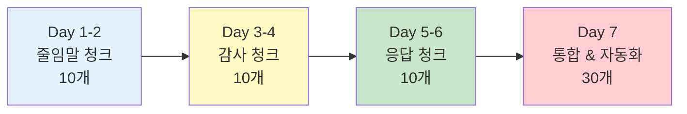
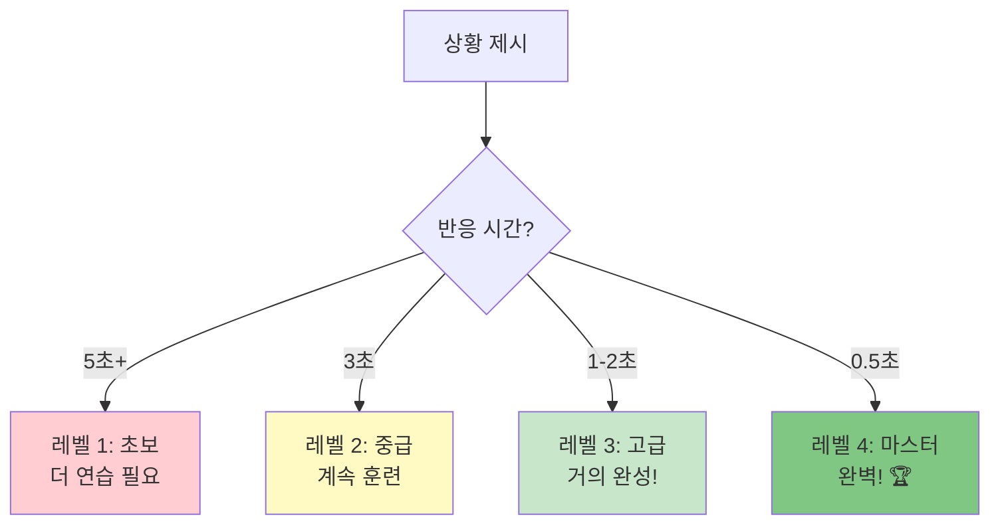

# 🔥 청크 자동화 훈련 가이드
## 기초 표현 청크 완벽 마스터

---

## 📋 목차

1. [훈련 목표](#훈련-목표)
2. [핵심 청크 리스트](#핵심-청크-리스트)
3. [7일 훈련 프로그램](#7일-훈련-프로그램)
4. [청크 반응 속도 테스트](#청크-반응-속도-테스트)
5. [실전 시뮬레이션](#실전-시뮬레이션)

---

## 훈련 목표

### 최종 목표

```
레벨 4: 청크 마스터 🏆
- 반응 속도: 0.5초 이내
- 정확도: 100%
- 자동화: 생각 없이 나옴
- 자신감: 무한대!
```

### 훈련 로드맵



---

## 핵심 청크 리스트

### 🔹 줄임말 청크 TOP 10

| 청크 | 발음 | 한국어 | 사용 빈도 |
|------|------|--------|:--------:|
| **I'm gonna** | 아임 거너 | ~할 거예요 | ⭐⭐⭐⭐⭐ |
| **I wanna** | 아이 워너 | ~하고 싶어요 | ⭐⭐⭐⭐⭐ |
| **I gotta** | 아이 가러 | ~해야 해요 | ⭐⭐⭐⭐⭐ |
| **I'm kinda** | 아임 카인더 | 좀 ~해요 | ⭐⭐⭐⭐ |
| **Lemme** | 레미 | ~하게 해줘 | ⭐⭐⭐⭐ |
| **Gimme** | 기미 | ~줘 | ⭐⭐⭐ |
| **Dunno** | 더노 | 모르겠어요 | ⭐⭐⭐⭐ |
| **I'm sorta** | 아임 쏘러 | 약간 ~해요 | ⭐⭐⭐ |
| **Wanna** | 워너 | 원해? | ⭐⭐⭐⭐ |
| **Gonna** | 거너 | 갈 거야 | ⭐⭐⭐⭐ |

### 🔹 감사 청크 TOP 10

| 청크 | 발음 | 한국어 | 사용 빈도 |
|------|------|--------|:--------:|
| **Thanks!** | 땡스 | 고마워요! | ⭐⭐⭐⭐⭐ |
| **Thanks a lot!** | 땡스 어 랏 | 정말 감사해요! | ⭐⭐⭐⭐⭐ |
| **Appreciate it!** | 어프리시에잇 | 감사드려요! | ⭐⭐⭐⭐⭐ |
| **Thanks so much!** | 땡스 쏘 머치 | 너무 감사해요! | ⭐⭐⭐⭐ |
| **You're the best!** | 유어 더 베스트 | 최고예요! | ⭐⭐⭐⭐ |
| **Thanks a bunch!** | 땡스 어 번치 | 정말 고마워요! | ⭐⭐⭐ |
| **Lifesaver!** | 라이프세이버 | 생명의 은인! | ⭐⭐⭐⭐ |
| **Can't thank you enough!** | 캔트 땡큐 이너프 | 정말 감사해요! | ⭐⭐⭐ |
| **Much appreciated!** | 머치 어프리시에이티드 | 정말 감사합니다! | ⭐⭐⭐ |
| **You saved me!** | 유 세이브드 미 | 살려주셨어요! | ⭐⭐⭐ |

### 🔹 응답 청크 TOP 10

| 청크 | 발음 | 한국어 | 사용 빈도 |
|------|------|--------|:--------:|
| **No worries!** | 노 워리스 | 걱정 마세요! | ⭐⭐⭐⭐⭐ |
| **No prob!** | 노 프롭 | 문제없어요! | ⭐⭐⭐⭐⭐ |
| **Anytime!** | 애니타임 | 언제든지요! | ⭐⭐⭐⭐⭐ |
| **For sure!** | 포 슈어 | 당연하죠! | ⭐⭐⭐⭐⭐ |
| **You bet!** | 유 벳 | 물론이죠! | ⭐⭐⭐⭐ |
| **My pleasure!** | 마이 플레저 | 제 기쁨이에요! | ⭐⭐⭐⭐ |
| **Totally!** | 토럴리 | 완전요! | ⭐⭐⭐⭐ |
| **Sounds good!** | 사운즈 굿 | 좋아요! | ⭐⭐⭐⭐ |
| **That works!** | 댓 워크스 | 괜찮아요! | ⭐⭐⭐ |
| **Happy to help!** | 해피 투 헬프 | 도와서 기뻐요! | ⭐⭐⭐ |

---

## 7일 훈련 프로그램

### Day 1: 줄임말 청크 (1-5번)

```
⏰ 총 소요 시간: 2시간

Morning (1시간):
□ I'm gonna (20분)
  - 발음 연습 100번
  - 예문 10개 암기
  - 시뮬레이션 5회

□ I wanna (20분)
  - 발음 연습 100번
  - 예문 10개 암기
  - 시뮬레이션 5회

□ I gotta (20분)
  - 발음 연습 100번
  - 예문 10개 암기
  - 시뮬레이션 5회

Evening (1시간):
□ I'm kinda (30분)
  - 발음 연습 100번
  - 예문 10개 암기

□ Lemme (30분)
  - 발음 연습 100번
  - 예문 10개 암기

✅ Day 1 목표:
  - 5개 청크 완벽 발음
  - 3초 안에 반응
  - 50개 예문 숙지
```

### Day 2: 줄임말 청크 (6-10번) + 복습

```
⏰ 총 소요 시간: 2시간

Morning (1시간):
□ Gimme, Dunno, Sorta (각 15분)
  - 발음 연습 각 50번
  - 예문 각 5개

□ Wanna, Gonna (각 15분)
  - 초간단 청크 마스터
  - 빠른 반응 훈련

Evening (1시간):
□ Day 1-2 전체 복습
  - 10개 청크 속도 테스트
  - 3초 → 2초 → 1초
  - 친구와 역할극

✅ Day 2 목표:
  - 10개 청크 완벽
  - 2초 안에 반응
  - 자신감 UP!
```

### Day 3: 감사 청크 (1-5번)

```
⏰ 총 소요 시간: 2시간

Morning (1시간):
□ Thanks! (15분)
  - 기본 청크, 가장 중요!
  - 억양 3가지 연습
  - 상황별 사용법

□ Thanks a lot! (15분)
  - 강조 버전
  - 진심 표현
  - 제스처 함께

□ Appreciate it! (30분)
  - 발음 주의! (어프리시에잇)
  - 100번 반복
  - 자동화 훈련

Evening (1시간):
□ Thanks so much! (20분)
□ You're the best! (20분)
□ 전체 복습 (20분)

✅ Day 3 목표:
  - 5개 감사 청크 완벽
  - 상황별 선택 가능
  - 자동으로 나옴!
```

### Day 4: 감사 청크 (6-10번) + 복습

```
⏰ 총 소요 시간: 2시간

Morning (1시간):
□ Thanks a bunch! (15분)
□ Lifesaver! (15분)
  - 강력한 감사 표현
  - 긴급 상황용

□ Can't thank you enough! (15분)
□ Much appreciated! (15분)

Evening (1시간):
□ You saved me! (20분)
□ 전체 감사 청크 복습 (40분)
  - 10개 청크 속도 테스트
  - 상황별 자동 선택
  - 1초 반응 훈련

✅ Day 4 목표:
  - 10개 감사 청크 마스터
  - 1초 안에 반응
  - 상황 맞게 자동 선택!
```

### Day 5: 응답 청크 (1-5번)

```
⏰ 총 소요 시간: 2시간

Morning (1시간):
□ No worries! (30분) ⭐ 최우선!
  - 만능 청크
  - 모든 상황에 사용
  - 100번 자동화

□ No prob! (15분)
  - No worries 친근한 버전
  - 친구에게

□ Anytime! (15분)
  - 감사 응답 완벽 청크
  - 친근하고 자연스러움

Evening (1시간):
□ For sure! (30분) ⭐ 중요!
  - 동의 만능 청크
  - 다양한 상황

□ You bet! (30분)
  - For sure 친근한 버전

✅ Day 5 목표:
  - No worries 완벽 자동화
  - For sure 마스터
  - 즉각 반응!
```

### Day 6: 응답 청크 (6-10번) + 복습

```
⏰ 총 소요 시간: 2시간

Morning (1시간):
□ My pleasure! (15분)
□ Totally! (15분)
□ Sounds good! (15분)
□ That works! (15분)

Evening (1시간):
□ Happy to help! (20분)
□ 전체 응답 청크 복습 (40분)
  - 10개 청크 완벽
  - 0.5초 반응 훈련
  - 자동 반사!

✅ Day 6 목표:
  - 10개 응답 청크 완벽
  - 0.5초 반응
  - 생각 없이 자동!
```

### Day 7: 통합 & 자동화 🏆

```
⏰ 총 소요 시간: 3시간

Morning (1.5시간):
□ 전체 30개 청크 복습
  - 줄임말 10개
  - 감사 10개
  - 응답 10개

□ 속도 테스트
  - 3초 → 2초 → 1초 → 0.5초
  - 정확도 100% 유지

Afternoon (1.5시간):
□ 실전 시뮬레이션 (10회)
  - 공항 체크인
  - 호텔 체크인
  - 식당 주문
  - 쇼핑
  - 택시
  - 길 묻기
  - 문제 해결
  - 감사/응답
  - 동의/거절
  - 긴급 상황

□ 최종 평가
  - 반응 속도
  - 정확도
  - 자신감

✅ Day 7 최종 목표:
  ☑️ 30개 청크 100% 완벽
  ☑️ 0.5초 자동 반응
  ☑️ 상황별 자동 선택
  ☑️ 여행 준비 완료! 🎉
```

---

## 청크 반응 속도 테스트

### 레벨 체크



### 테스트 방법

```
준비물:
- 스마트폰 타이머
- 상황 카드 30장
- 녹음 기능

단계:
1. 상황 카드를 섞는다
2. 카드 1장을 뽑는다
3. 타이머 시작
4. 적절한 청크로 반응
5. 시간 측정
6. 녹음 확인

평가:
- 0.5초: 완벽! ✅
- 1초: 좋음! 👍
- 2초: 계속 연습! 💪
- 3초+: 더 훈련! 🔥
```

### 상황 카드 예시 (30개)

#### 줄임말 청크 (10개)
```
1. "미래 계획 말하기" → I'm gonna...
2. "원하는 것 말하기" → I wanna...
3. "의무 말하기" → I gotta...
4. "애매한 상태" → I'm kinda...
5. "요청하기" → Lemme...
6. "뭔가 달라고" → Gimme...
7. "모른다고" → Dunno
8. "약간 그런" → Sorta
9. "친구에게 의향" → Wanna...?
10. "빠른 미래" → Gonna...
```

#### 감사 청크 (10개)
```
11. "문 열어줌" → Thanks!
12. "길 알려줌" → Thanks a lot!
13. "짐 옮겨줌" → Appreciate it!
14. "특별한 도움" → Thanks so much!
15. "완벽한 서비스" → You're the best!
16. "친구의 도움" → Thanks a bunch!
17. "긴급 상황 도움" → Lifesaver!
18. "진심 감사" → Can't thank you enough!
19. "비즈니스 감사" → Much appreciated!
20. "큰 문제 해결" → You saved me!
```

#### 응답 청크 (10개)
```
21. "감사 받음 (일반)" → No worries!
22. "감사 받음 (캐주얼)" → No prob!
23. "도와줬을 때" → Anytime!
24. "동의 (강함)" → For sure!
25. "동의 (친근)" → You bet!
26. "서비스 제공" → My pleasure!
27. "완전 동의" → Totally!
28. "제안 수락" → Sounds good!
29. "일정 OK" → That works!
30. "도움 줬을 때" → Happy to help!
```

---

## 실전 시뮬레이션

### 시뮬레이션 1: 공항 체크인

```
상황: 공항 체크인 데스크

직원: "Next, please!"
당신: → (반응 청크는?)

💭 정답: "Hi!" (인사)

직원: "Passport and ticket, please."
당신: → (반응?)

💭 정답: "Here you go" + 건네기

직원: "Where are you headed?"
당신: "I'm gonna go to New York."
     ↑ gonna 청크 사용!

직원: "Window or aisle?"
당신: "Window, please."

직원: "Any bags to check?"
당신: "Yeah, just one."

직원: "Here's your boarding pass. Gate 23."
당신: → (감사 청크는?)

💭 정답: "Thanks!" 또는 "Appreciate it!"

✅ 사용한 청크:
- I'm gonna (줄임말)
- Thanks! (감사)
```

### 시뮬레이션 2: 호텔 체크인

```
상황: 호텔 프론트 데스크

직원: "Good evening! Checking in?"
당신: → (반응?)

💭 정답: "Yeah!" 또는 "Yes, I am."

직원: "Name, please?"
당신: "Kim, K-I-M."

직원: "You're in room 305. Here's your key."
당신: → (감사 청크?)

💭 정답: "Thanks a lot!" 또는 "Appreciate it!"

직원: "Breakfast is from 7 to 10. Enjoy your stay!"
당신: → (응답 청크?)

💭 정답: "Thanks!" 또는 "Sounds good!"

--- 나중에 ---

당신: "The AC isn't working."

직원: "I'm so sorry! I'll send someone right away."
당신: → (응답?)

💭 정답: "Appreciate it!" 또는 "Thanks!"

--- 수리 후 ---

직원: "Is it working now?"
당신: "Yeah, all good!"

직원: "Sorry about that."
당신: → (응답 청크?)

💭 정답: "No worries!" (만능!)

✅ 사용한 청크:
- Thanks a lot! (감사)
- Appreciate it! (강한 감사)
- No worries! (응답 만능)
```

### 시뮬레이션 3: 식당 주문

```
상황: 레스토랑

웨이터: "Hi! Table for how many?"
당신: "Two, please."

웨이터: "Follow me."
당신: → (응답?)

💭 정답: "Thanks!" (간단)

--- 앉은 후 ---

웨이터: "What can I get you to drink?"
당신: "I wanna try the lemonade."
     ↑ wanna 청크!

웨이터: "Great choice!"
당신: → (동의 청크?)

💭 정답: "For sure!" 또는 "Sounds good!"

--- 주문 ---

웨이터: "Ready to order?"
당신: "I'm kinda torn between the burger and the pasta."
     ↑ kinda 청크!

웨이터: "The burger is really good."
당신: "Okay, I'm gonna go with the burger."
     ↑ gonna 청크!

--- 음식 나옴 ---

웨이터: "Enjoy your meal!"
당신: → (응답?)

💭 정답: "Thanks!" 또는 "Appreciate it!"

--- 계산 ---

당신: "Check, please."

웨이터: "Here you go."
당신: → (감사?)

💭 정답: "Thanks!" (기본)

✅ 사용한 청크:
- I wanna (원함)
- I'm kinda (애매함)
- I'm gonna (선택)
- Thanks! (감사 반복)
```

### 시뮬레이션 4: 택시

```
상황: 택시 잡기

당신: "Airport, please."

기사: "Which terminal?"
당신: "Terminal 2."

기사: "Okay. About 30 minutes."
당신: → (응답?)

💭 정답: "Sounds good!" 또는 "That works!"

--- 도착 ---

기사: "Here we are!"
당신: "How much?"

기사: "25 dollars."
당신: "Here's 30. Keep the change."

기사: "Thanks a lot!"
당신: → (응답 청크?)

💭 정답: "No worries!" 또는 "No prob!"

✅ 사용한 청크:
- Sounds good! (동의)
- No worries! (응답)
```

### 시뮬레이션 5: 문제 해결

```
상황: 길을 잃음

당신: "Excuse me, I'm kinda lost."
     ↑ kinda 청크!

행인: "Where are you trying to go?"
당신: "I wanna go to the museum."
     ↑ wanna 청크!

행인: "Oh, it's just two blocks that way."
당신: → (감사 청크?)

💭 정답: "Thanks so much!" 또는 "Lifesaver!"

--- 상점에서 ---

당신: "Lemme see that shirt."
     ↑ lemme 청크!

직원: "Sure! Here you go."
당신: → (응답?)

💭 정답: "Thanks!" (기본)

당신: "I gotta think about it."
     ↑ gotta 청크!

직원: "No problem! Take your time."
당신: → (응답?)

💭 정답: "Appreciate it!" 또는 "Thanks!"

✅ 사용한 청크:
- I'm kinda (상태)
- I wanna (원함)
- Lemme (요청)
- I gotta (의무)
- Thanks! (감사 반복)
```

---

## 🏆 최종 체크리스트

### 줄임말 청크 (10개)
- [ ] I'm gonna - 자동으로 나옴 (0.5초)
- [ ] I wanna - 자동으로 나옴
- [ ] I gotta - 자동으로 나옴
- [ ] I'm kinda - 자동으로 나옴
- [ ] Lemme - 자동으로 나옴
- [ ] Gimme - 자동으로 나옴
- [ ] Dunno - 자동으로 나옴
- [ ] I'm sorta - 자동으로 나옴
- [ ] Wanna - 자동으로 나옴
- [ ] Gonna - 자동으로 나옴

### 감사 청크 (10개)
- [ ] Thanks! - 자동으로 나옴
- [ ] Thanks a lot! - 자동으로 나옴
- [ ] Appreciate it! - 자동으로 나옴
- [ ] Thanks so much! - 자동으로 나옴
- [ ] You're the best! - 자동으로 나옴
- [ ] Thanks a bunch! - 자동으로 나옴
- [ ] Lifesaver! - 자동으로 나옴
- [ ] Can't thank you enough! - 자동으로 나옴
- [ ] Much appreciated! - 자동으로 나옴
- [ ] You saved me! - 자동으로 나옴

### 응답 청크 (10개)
- [ ] No worries! - 자동으로 나옴 ⭐
- [ ] No prob! - 자동으로 나옴
- [ ] Anytime! - 자동으로 나옴
- [ ] For sure! - 자동으로 나옴 ⭐
- [ ] You bet! - 자동으로 나옴
- [ ] My pleasure! - 자동으로 나옴
- [ ] Totally! - 자동으로 나옴
- [ ] Sounds good! - 자동으로 나옴
- [ ] That works! - 자동으로 나옴
- [ ] Happy to help! - 자동으로 나옴

### 자동화 레벨
- [ ] 반응 속도 0.5초 달성
- [ ] 상황별 자동 선택 가능
- [ ] 생각 없이 자동으로 나옴
- [ ] 실전 시뮬레이션 10회 완수
- [ ] 자신감 100%!

---

## 💡 최종 팁

### 매일 유지 훈련 (5분)

```
Morning Routine:
1. No worries! × 10
2. Thanks! × 10
3. For sure! × 10
4. I'm gonna... × 5
5. I wanna... × 5

🎯 매일 5분으로 영구 유지!
```

### 실수 했을 때

```
❌ 잘못: "Oh no, I messed up..."
✅ 올바름: "That's okay, next time!"

💡 실수 = 학습 기회
   완벽하지 않아도 괜찮아요!
```

### 자신감의 비밀

```
청크 = 자신감

왜?
- 생각 불필요
- 자동으로 나옴
- 실수 확률 낮음
- 원어민처럼 들림

🎯 청크 30개만 완벽하면
   여행 영어 80% 해결!
```

---

**축하합니다! 청크 자동화 훈련 완료! 🎉**

> "생각하지 말고, 청크를 말하라!"
> 
> 이제 당신은 청크 마스터입니다! 🏆

**Last Updated: 2026-01-11**

