# 🛍️🚕 쇼핑 & 교통 표현 완벽 가이드
## 스마트한 쇼핑과 안전한 이동을 위한 필수 표현

---

## 📋 목차

### 🛍️ 쇼핑편
1. [쇼핑 전체 프로세스](#쇼핑-전체-프로세스)
2. [의류 쇼핑 표현](#의류-쇼핑)
3. [전자제품 쇼핑 표현](#전자제품-쇼핑)
4. [환불 & 교환 표현](#환불--교환)

### 🚕 교통편
5. [택시 이용 표현](#택시-이용)
6. [우버 이용 표현](#우버-이용)
7. [대중교통 표현](#대중교통)
8. [길 묻기 표현](#길-묻기)

---

## 전체 구조 마인드맵

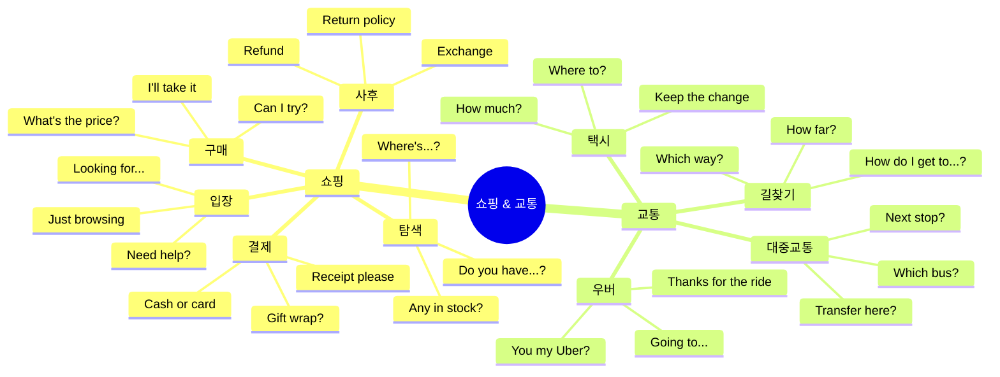

---

# 🛍️ 쇼핑 표현

## 쇼핑 전체 프로세스

### 쇼핑 여정 플로우차트

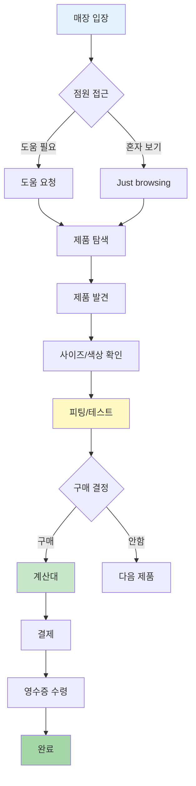

### 쇼핑 단계별 핵심 표현

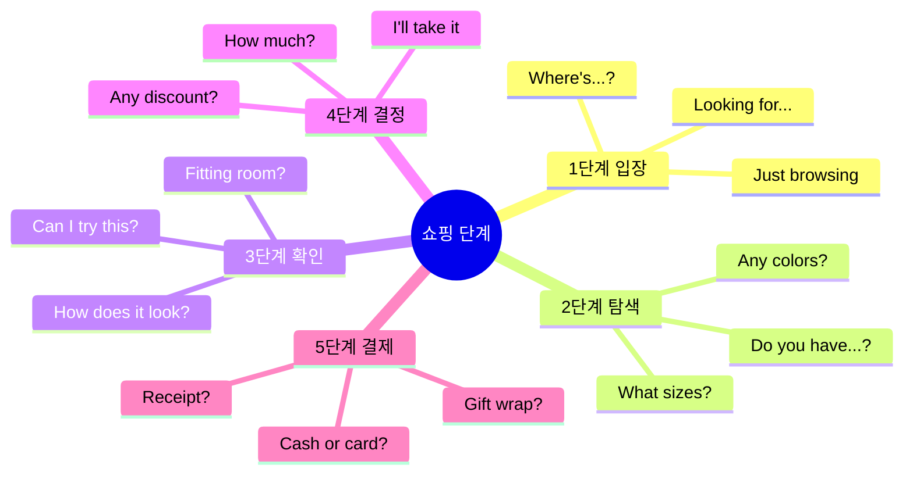

---

## 의류 쇼핑

### 의류 쇼핑 마인드맵

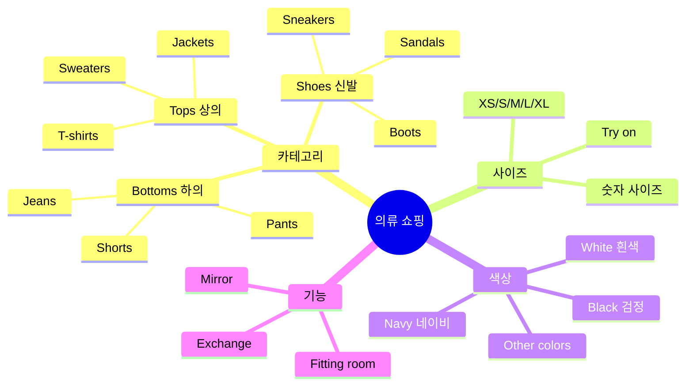

---

## 1️⃣ Just browsing (그냥 구경 중)

### 📖 기본 정보

| 표현 | 발음 | 의미 | 사용 상황 |
|------|------|------|----------|
| **Just browsing** | 저스트 브라우징 | 그냥 구경 중이에요 | 점원이 다가올 때 |
| **Just looking** | 저스트 루킹 | 그냥 보는 중이에요 | 혼자 보고 싶을 때 |
| **I'm good** | 아임 굿 | 괜찮아요 | 도움 거절 |

### 🎯 상황별 대응

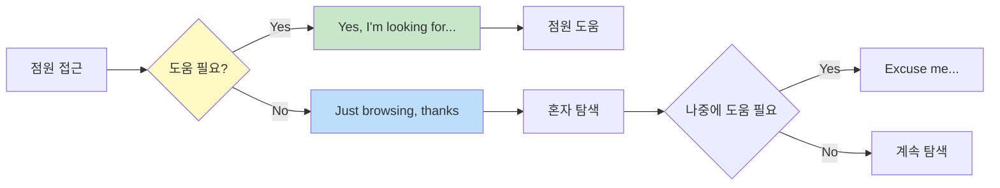

### 💬 실전 대화

```
시나리오 A: 혼자 보고 싶을 때

점원: "Hi! Can I help you find anything?"
손님: "Hey! Just browsing. I'll let you know if I need help."
점원: "Cool! Lemme know if you need anything."
손님: "Thanks!"

한국어:
점원: 안녕하세요! 뭘 찾으시나요?
손님: 안녕하세요! 그냥 구경 중이에요. 필요하면 말할게요.
점원: 좋아요! 필요하시면 말씀하세요.
손님: 고마워요!
```

```
시나리오 B: 나중에 도움 요청

손님: "Actually, where are your jackets?"
점원: "Back wall, to the right."
손님: "Thanks!"
(잠시 후)
손님: "Do you have this in black?"
점원: "Lemme check... Yeah, one left!"

한국어:
손님: 사실, 재킷은 어디 있나요?
점원: 뒤쪽 벽, 오른쪽이요.
손님: 고마워요!
(잠시 후)
손님: 이거 검정색 있나요?
점원: 확인해볼게요... 네, 하나 남았어요!
```

### 📌 핵심 표현 정리

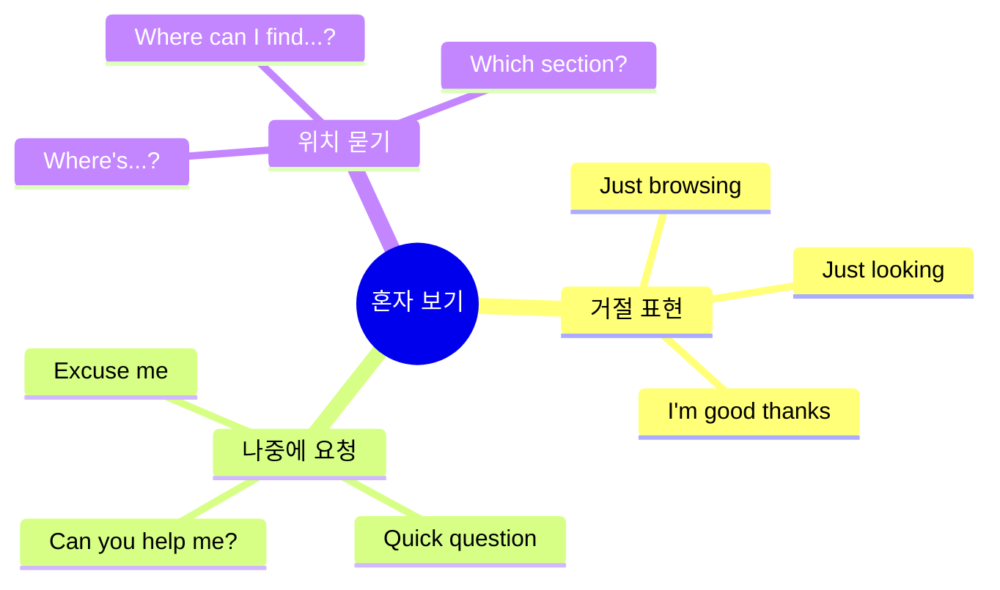

---

## 2️⃣ Do you have this in...? (이거 ~로 있나요?)

### 📖 다양한 요청 표현

| 요청 내용 | 영어 표현 | 발음 | 예문 |
|----------|----------|------|------|
| **사이즈** | Do you have this in (size)? | 두 유 해브 디스 인 (사이즈)? | "In medium?" |
| **색상** | Do you have this in (color)? | 두 유 해브 디스 인 (컬러)? | "In black?" |
| **다른 스타일** | Do you have this in (style)? | 두 유 해브 디스 인 (스타일)? | "Long sleeve?" |

### 🎨 색상 & 사이즈 매트릭스

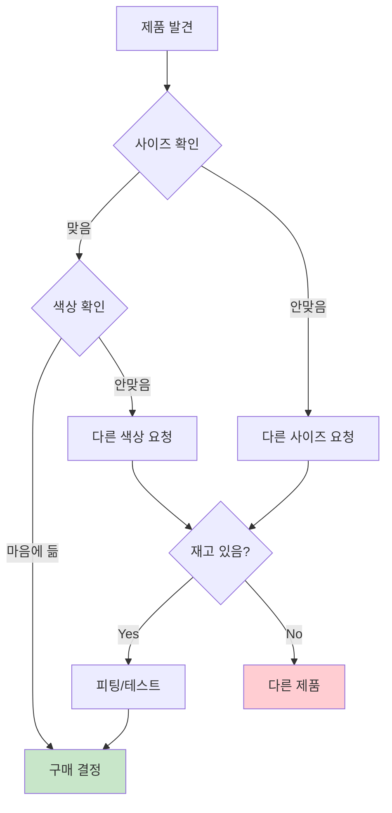

### 💬 실전 표현

```
사이즈 요청:
✅ "Do you have this in medium?"
   (두 유 해브 디스 인 미디엄?)
   → 이거 미디엄 있나요?

✅ "Got a small?"
   (갓 어 스몰?)
   → 스몰 있어요?

✅ "Any larger sizes?"
   (에니 라저 사이지즈?)
   → 더 큰 사이즈 있나요?

색상 요청:
✅ "Do you have this in black?"
   → 이거 검정색 있나요?

✅ "Any other colors?"
   → 다른 색깔 있나요?

✅ "What colors does this come in?"
   → 이게 무슨 색으로 나와요?
```

### 📊 의류 사이즈 비교표

| 미국 사이즈 | 한국 사이즈 | 영어 표현 | 설명 |
|:----------:|:----------:|----------|------|
| **XS** | 85 | Extra Small | 매우 작음 |
| **S** | 90 | Small | 작음 |
| **M** | 95 | Medium | 중간 |
| **L** | 100 | Large | 큰 편 |
| **XL** | 105 | Extra Large | 매우 큼 |
| **XXL** | 110 | Double XL | 아주 큼 |

---

## 3️⃣ Can I try this on? (입어봐도 될까요?)

### 📖 피팅 관련 표현

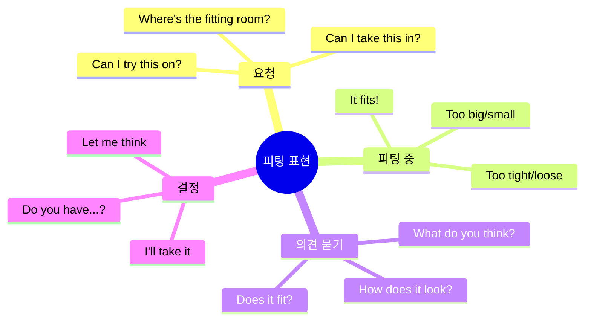

### 💬 실전 대화

```
완벽한 피팅 시나리오:

손님: "Can I try this on?"
점원: "For sure! Fitting rooms are over there."
손님: "Thanks!"

(피팅 후)
손님: "This is perfect! How much?"
점원: "It's $89, but it's 30% off today."
손님: "Oh nice! So like $62?"
점원: "Yep! Good deal, right?"
손님: "Totally! I'll take it."

한국어:
손님: 이거 입어봐도 될까요?
점원: 물론이죠! 피팅룸은 저쪽이에요.
손님: 고마워요!

(피팅 후)
손님: 완벽해요! 얼마예요?
점원: 89달러인데, 오늘 30% 할인이에요.
손님: 오 좋네요! 그럼 62달러?
점원: 네! 좋은 거래죠?
손님: 완전! 살게요.
```

### 📌 사이즈 문제 해결

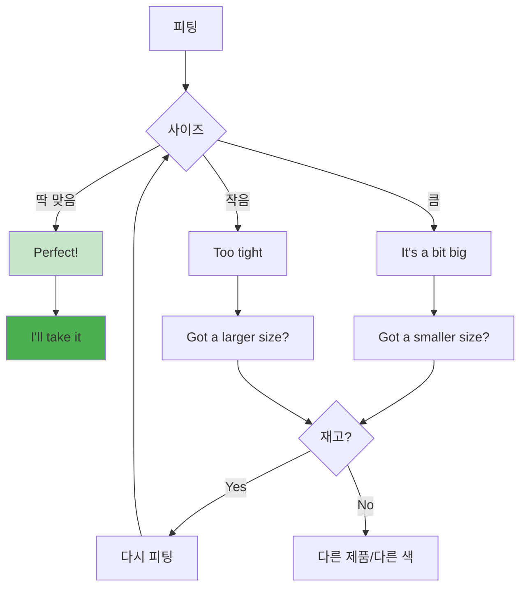

### 표현 정리표

| 상황 | 영어 표현 | 한국어 | 뉘앙스 |
|------|----------|--------|--------|
| **딱 맞음** | It fits perfectly! | 완벽해요! | 😊 최고 |
| **조금 큼** | It's a bit big. | 좀 커요. | 😐 애매 |
| **많이 큼** | It's way too big. | 너무 커요. | 😞 안맞음 |
| **조금 작음** | It's a bit tight. | 좀 작아요. | 😐 애매 |
| **많이 작음** | It's too tight. | 너무 작아요. | 😞 안맞음 |
| **길이 김** | Too long. | 너무 길어요. | 수선 가능? |
| **길이 짧음** | Too short. | 너무 짧아요. | 교환 필요 |

---

## 전자제품 쇼핑

### 전자제품 쇼핑 프로세스

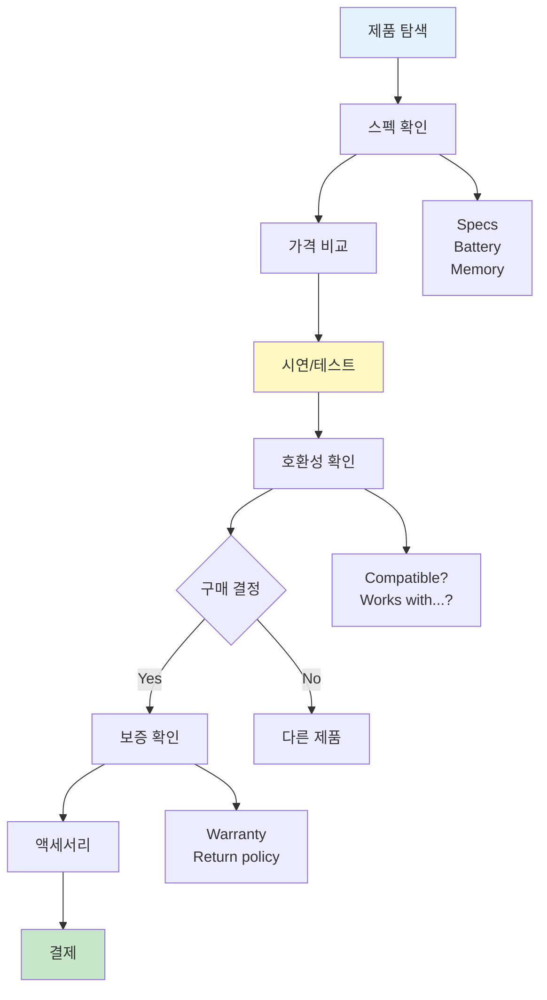

---

## 4️⃣ What's your budget? (예산이 어떻게 되나요?)

### 📖 가격 관련 표현

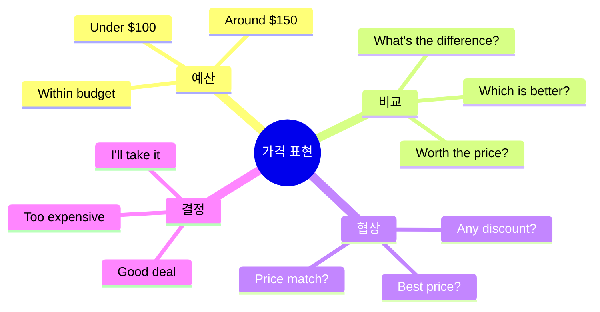

### 💬 실전 대화: 이어폰 구매

```
전자제품 구매 시나리오:

점원: "Hey, I'm looking for earbuds."
손님: "Cool! What's your budget?"
점원: "Like, under $150?"
손님: "Got some good options. Noise canceling?"
점원: "Yeah, that'd be nice."
손님: "These Sony ones are fire. Super popular."
점원: "How's the battery life?"
손님: "About 8 hours. 24 with the case."
점원: "That's solid. Can I try them?"
손님: "For sure! Let me open a demo."

(테스트 후)
점원: "Wow, the sound's great!"
손님: "Right? They're honestly the best at this price."
점원: "Do they work with iPhone?"
손님: "Yep! Bluetooth, so they work with everything."
점원: "Any warranty?"
손님: "One year. We also sell extended for $20."
점원: "Nah, I'm good with the standard."

한국어:
점원: 안녕하세요, 이어폰 찾고 있어요.
손님: 좋아요! 예산이 어떻게 되세요?
점원: 음, 150달러 이하요?
손님: 좋은 옵션들 있어요. 노이즈 캔슬링 필요하세요?
점원: 네, 있으면 좋겠어요.
손님: 이 소니 제품이 대박이에요. 엄청 인기 있어요.
점원: 배터리는 얼마나 가요?
손님: 약 8시간이요. 케이스 포함하면 24시간이에요.
점원: 괜찮네요. 써봐도 될까요?
손님: 물론이죠! 데모 열어드릴게요.

(테스트 후)
점원: 우와, 소리 정말 좋네요!
손님: 그죠? 솔직히 이 가격대에서 최고예요.
점원: 아이폰이랑 되나요?
손님: 네! 블루투스라 다 돼요.
점원: 보증은요?
손님: 1년이요. 20달러에 연장도 팔아요.
점원: 아니요, 기본으로 괜찮아요.
```

### 📊 가격대별 표현 가이드

| 가격대 | 영어 표현 | 상황 | 뉘앙스 |
|--------|----------|------|--------|
| **저렴** | Cheap / Affordable | Under $50 | 가성비 중시 |
| **적당** | Reasonable / Fair | $50-150 | 일반적 |
| **비싼편** | Pricey / Expensive | $150-300 | 고민됨 |
| **매우 비쌈** | Really expensive / Way too much | Over $300 | 부담스러움 |

### 가격 협상 표현

```
할인 요청:
✅ "Any discounts today?"
   (에니 디스카운츠 투데이?)
   → 오늘 할인 있나요?

✅ "What's your best price?"
   (왓츠 유어 베스트 프라이스?)
   → 최저가가 얼마예요?

✅ "Can you do any better?"
   (캔 유 두 에니 베터?)
   → 더 낮춰주실 수 있나요?

✅ "Do you price match?"
   (두 유 프라이스 매치?)
   → 가격 맞춰주시나요?
```

---

## 환불 & 교환

### 환불/교환 프로세스

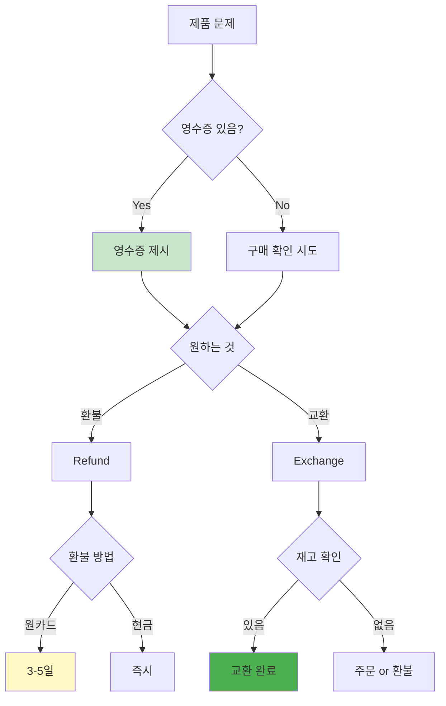

---

## 5️⃣ I need to return this (환불하고 싶어요)

### 📖 환불/교환 표현

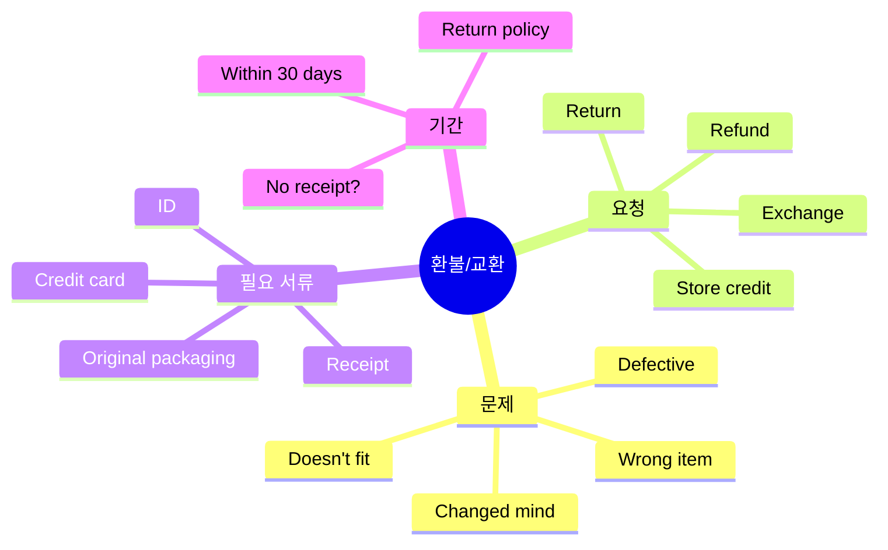

### 💬 실전 대화: 환불

```
환불 시나리오:

손님: "Hey, I need to return this."
점원: "Sure! What's wrong with it?"
손님: "Doesn't fit. Too small."
점원: "Got your receipt?"
손님: "Yeah, here."
점원: "Cool. Want to exchange or refund?"
손님: "Do you have a larger size?"
점원: "Lemme check... Shoot, we're out."
손님: "Ugh, really?"
점원: "Yeah, sorry! I can order one though."
손님: "How long would that take?"
점원: "Usually 3-5 days. We can ship to you."
손님: "Hmm, I'm leaving in 2 days."
점원: "Oh. In that case, maybe a refund?"
손님: "Yeah, I guess so."
점원: "No problem! Same card?"
손님: "Yeah. How long till it shows up?"
점원: "3-5 business days usually."
손님: "Alright. Thanks anyway!"
점원: "Sorry we couldn't help more! Come back anytime!"

한국어:
손님: 안녕하세요, 이거 환불하고 싶어요.
점원: 네! 무슨 문제가 있나요?
손님: 안 맞아요. 너무 작아요.
점원: 영수증 있으세요?
손님: 네, 여기요.
점원: 좋아요. 교환하시겠어요 환불하시겠어요?
손님: 더 큰 사이즈 있나요?
점원: 확인해볼게요... 아, 없네요.
손님: 아, 정말요?
점원: 네, 죄송해요! 주문은 할 수 있어요.
손님: 얼마나 걸려요?
점원: 보통 3-5일이요. 배송해드릴 수 있어요.
손님: 음, 저 2일 후에 떠나요.
점원: 아. 그러면 환불하시는 게 나을 것 같아요?
손님: 네, 그래야겠네요.
점원: 문제없어요! 같은 카드로요?
손님: 네. 언제 들어와요?
점원: 보통 3-5 영업일이요.
손님: 알겠어요. 어쨌든 고마워요!
점원: 더 도와드리지 못해 죄송해요! 다음에 또 오세요!
```

### 📊 환불/교환 정책 비교표

| 항목 | 환불 (Refund) | 교환 (Exchange) | 스토어 크레딧 |
|------|--------------|----------------|-------------|
| **영어** | Refund | Exchange | Store credit |
| **돈** | 돌려받음 💰 | 안받음 | 안받음 |
| **제품** | 반납 | 다른 제품 | 나중에 선택 |
| **기간** | 3-5일 | 즉시 | 기한 있음 |
| **조건** | 영수증 필수 | 영수증 필요 | 영수증 불필요(때로) |
| **추천** | 떠날 때 | 계속 쇼핑 | 결정 못했을 때 |

### 핵심 표현 정리

```
환불 요청:
✅ "I'd like to return this."
   → 이거 환불하고 싶어요.

✅ "Can I get a refund?"
   → 환불 받을 수 있나요?

✅ "It doesn't work."
   → 작동 안 해요.

교환 요청:
✅ "Can I exchange this?"
   → 이거 교환할 수 있나요?

✅ "Do you have another one?"
   → 다른 거 있나요?

정책 확인:
✅ "What's your return policy?"
   → 환불 정책이 어떻게 되나요?

✅ "How long do I have?"
   → 기한이 얼마나 되나요?
```

---

# 🚕 교통 표현

## 교통수단 전체 맵

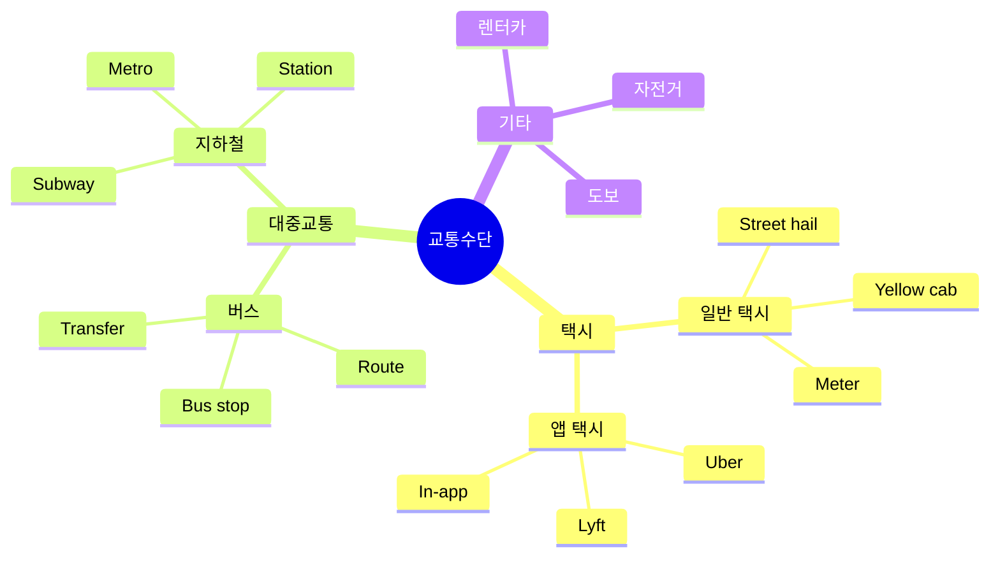

---

## 택시 이용

### 택시 이용 플로우

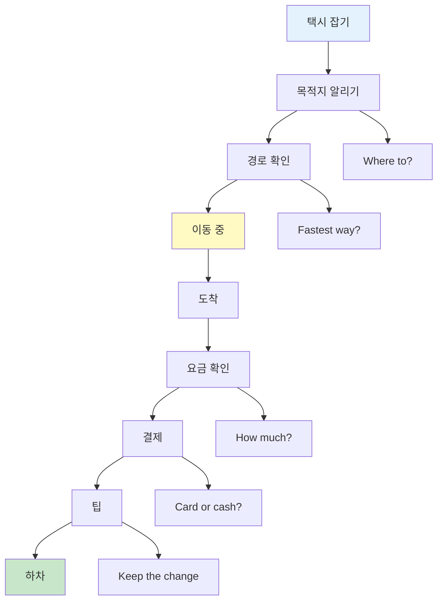

---

## 6️⃣ Where to? (어디 가세요?)

### 📖 목적지 표현

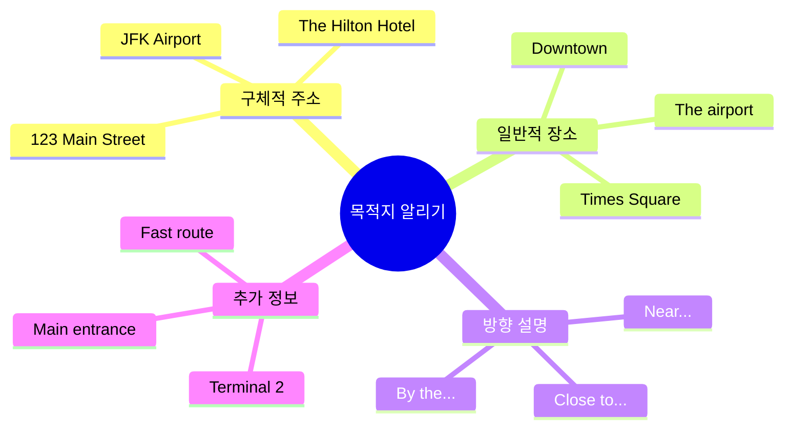

### 💬 실전 대화: 일반 택시

```
완벽한 택시 대화:

기사: "Where to?"
손님: "Hey! Downtown, please."
기사: "Sure thing. Whereabouts?"
손님: "The Hilton on 5th Street."
기사: "Got it. Know the fastest way?"
손님: "Nah, you're the expert!"
기사: "Ha! I'll take the highway then."
손님: "How long you think?"
기사: "Maybe 20, depends on traffic."
손님: "Cool. Rough estimate on price?"
기사: "Prob'ly around $25-30."
손님: "That works. First time here."
기사: "Oh yeah? Where you from?"
손님: "Korea. Seoul."
기사: "Nice! Here for vacation?"
손님: "Yeah, got a week. Any tips?"
기사: "Def check out the food market downtown."
손님: "Oh for sure!"

(도착)
기사: "Here good?"
손님: "Yep! That's $27.50."
손님: "Here's $35. Keep the change!"
기사: "Thanks so much! Enjoy!"

한국어:
기사: 어디 가세요?
손님: 안녕하세요! 다운타운이요.
기사: 네. 어디쯤이요?
손님: 5번가 힐튼이요.
기사: 알겠습니다. 가장 빠른 길 아세요?
손님: 아니요, 전문가시잖아요!
기사: 하! 그럼 고속도로로 갈게요.
손님: 얼마나 걸릴 것 같아요?
기사: 20분쯤? 교통 상황에 따라 다르죠.
손님: 좋아요. 대략 얼마나 나올까요?
기사: 아마 25-30달러쯤요.
손님: 괜찮네요. 여기 처음이에요.
기사: 그래요? 어디서 오셨어요?
손님: 한국이요. 서울.
기사: 좋네요! 휴가로 오셨어요?
손님: 네, 일주일 있어요. 팁 있으세요?
기사: 다운타운 푸드 마켓 꼭 가보세요.
손님: 오 꼭요!

(도착)
기사: 여기 괜찮아요?
손님: 네! 27.50달러네요.
손님: 35달러요. 잔돈은 가지세요!
기사: 정말 감사합니다! 즐거운 시간 보내세요!
```

### 📊 택시 표현 레벨별 비교

| 상황 | 초급 😊 | 중급 👍 | 고급/현대 🔥 |
|------|---------|---------|-------------|
| **목적지** | "Airport, please." | "Could you take me to the airport?" | "Hey! Airport, please." |
| **시간** | "How long?" | "How long will it take?" | "How long you think?" |
| **가격** | "How much?" | "What's the fare?" | "Rough estimate on price?" |
| **팁** | "Thank you." | "Keep the change." | "Here's $35. Keep the change!" |
| **하차** | "Here." | "You can stop here." | "Here good?" |

---

## 우버 이용

### 우버 이용 플로우

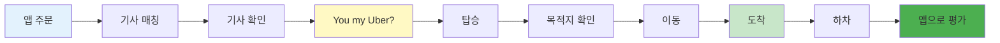

---

## 7️⃣ You my Uber? (제 우버 맞나요?)

### 📖 우버 전용 표현

```mermaid
mindmap
  root((우버 표현))
    확인
      You my Uber?
      You [name]?
      Going to...?
    탑승
      Hop in
      Back seat OK?
      Thanks for picking me up
    이동 중
      Mind if I...?
      Can I plug in?
      How's traffic?
    도착
      Thanks for the ride
      I'll give you 5 stars
      Have a good one
```

### 💬 실전 대화: 우버

```
완벽한 우버 대화:

손님: "Hey, you're my Uber?"
기사: "Yep! You Kim?"
손님: "That's me!"
기사: "Cool, hop in! Going to the airport?"
손님: "Yeah, Terminal 2."
기사: "Got it. Flight soon?"
손님: "In like 3 hours. Should be fine, right?"
기사: "Oh yeah, plenty of time."
손님: "Phew! Mind if I plug in my phone?"
기사: "Go for it! Chargers in the back."
손님: "You're a lifesaver. Phone's at 5%."
기사: "Ha! Been there!"
손님: "Is there traffic usually at this hour?"
기사: "Nah, we should cruise right through."
손님: "Sweet."

(도착)
기사: "Alright, here we are!"
손님: "Thanks for the smooth ride!"
기사: "No prob! I'll help with your bags."
손님: "You're awesome. I'll give you 5 stars!"
기사: "Thanks! Safe travels!"

한국어:
손님: 안녕하세요, 제 우버 맞나요?
기사: 네! 김 씨 맞으세요?
손님: 네 맞아요!
기사: 좋아요, 타세요! 공항 가시나요?
손님: 네, 2터미널이요.
기사: 알겠습니다. 비행기 곧 있어요?
손님: 3시간 후요. 괜찮겠죠?
기사: 오 네, 시간 충분해요.
손님: 휴! 핸드폰 충전해도 될까요?
기사: 그러세요! 뒤에 충전기 있어요.
손님: 생명의 은인이네요. 폰이 5%예요.
기사: 하! 저도 그런 적 있어요!
손님: 이 시간에 보통 막혀요?
기사: 아니요, 쭉 갈 수 있을 거예요.
손님: 좋네요.

(도착)
기사: 자, 도착했습니다!
손님: 편한 라이드 감사합니다!
기사: 천만에요! 짐 도와드릴게요.
손님: 정말 감사합니다. 별 5개 줄게요!
기사: 감사합니다! 안전한 여행 되세요!
```

### 📊 택시 vs 우버 표현 비교

| 상황 | 일반 택시 🚕 | 우버 🚗 | 차이점 |
|------|------------|---------|--------|
| **확인** | (없음, 바로 탑승) | "You my Uber?" | 우버는 확인 필수 |
| **목적지** | "Where to?" (기사가 물음) | (앱에 이미 입력됨) | 우버는 말 안해도 됨 |
| **결제** | 현금/카드 (직접) | 앱 자동 결제 | 우버가 편함 |
| **팁** | 직접 현금 | 앱에서 추가 | 둘 다 가능 |
| **평가** | 없음 | 별점 5점 | 우버는 평가 문화 |

---

## 대중교통

### 대중교통 시스템 맵

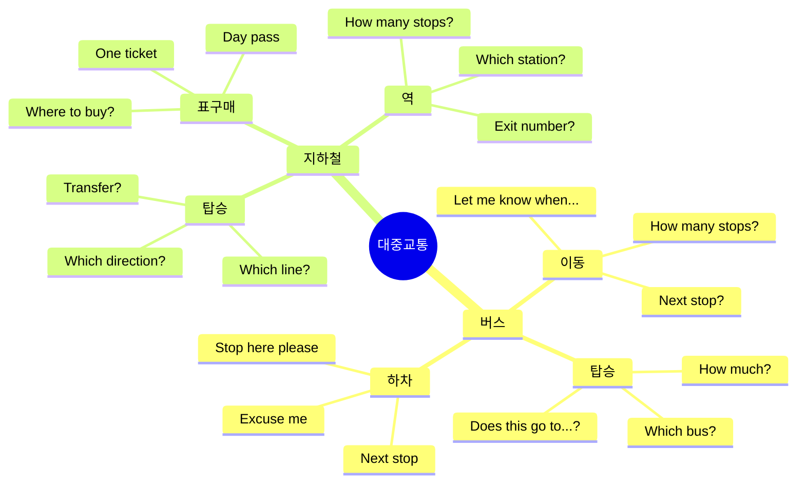

---

## 8️⃣ Which bus goes to...? (어느 버스가 ~에 가나요?)

### 💬 대중교통 표현

```
버스 이용:
✅ "Which bus goes to downtown?"
   (위치 버스 고즈 투 다운타운?)
   → 어느 버스가 다운타운에 가나요?

✅ "Does this bus go to...?"
   (더즈 디스 버스 고 투...?)
   → 이 버스 ~에 가나요?

✅ "How much is the fare?"
   (하우 머치 이즈 더 페어?)
   → 요금이 얼마예요?

하차:
✅ "Next stop, please."
   (넥스트 스탑, 플리즈)
   → 다음 정류장에 내려주세요.

✅ "Can you let me know when we get to...?"
   → ~에 도착하면 알려주실 수 있나요?
```

---

## 길 묻기

### 길 묻기 상황 플로우

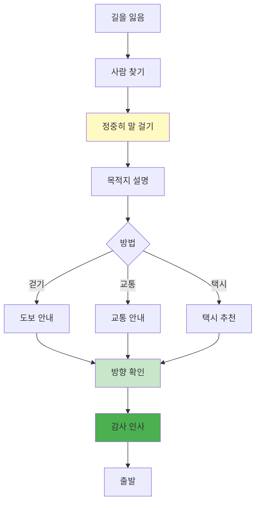

---

## 9️⃣ How do I get to...? (어떻게 가나요?)

### 📖 길 묻기 표현

```mermaid
mindmap
  root((길 묻기))
    시작
      Excuse me
      Sorry to bother
      Quick question
    질문
      How do I get to...?
      Where's...?
      Which way?
    거리
      How far?
      Walking distance?
      Close from here?
    방법
      Can I walk?
      Should I take taxi?
      Which bus?
    확인
      Straight?
      Turn left?
      Can't miss it?
```

### 💬 실전 대화: 길 묻기

```
완벽한 길 묻기 대화:

여행자: "Hey, sorry! Quick question?"
현지인: "Yeah, what's up?"
여행자: "How do I get to the train station?"
현지인: "Oh, it's like 10 minutes that way."
여행자: "Walking?"
현지인: "Yeah. Straight down this street."
여행자: "Then what?"
현지인: "Turn left at the Starbucks. Can't miss it."
여행자: "Is it the big building?"
현지인: "Yep! Big glass thing."
여행자: "Could I Uber there?"
현지인: "I mean, you could, but it's super close."
여행자: "True. Is the area safe?"
현지인: "Oh yeah, totally safe. Even at night."
여행자: "Good to know! Where's a good place to eat around there?"
현지인: "There's this taco spot next to the station. Bomb!"
여행자: "Bomb?"
현지인: "Sorry - means really good! Slang. 😅"
여행자: "Ha! Got it. Thanks so much!"
현지인: "No worries! Have fun!"

한국어:
여행자: 안녕하세요, 죄송해요! 질문 하나만요?
현지인: 네, 뭔데요?
여행자: 기차역에 어떻게 가나요?
현지인: 오, 저쪽으로 10분쯤이요.
여행자: 걸어서요?
현지인: 네. 이 길로 쭉 가세요.
여행자: 그 다음엔요?
현지인: 스타벅스에서 왼쪽으로 도세요. 못 찾을 수가 없어요.
여행자: 큰 건물인가요?
현지인: 네! 큰 유리 건물이요.
여행자: 우버 타고 가도 될까요?
현지인: 뭐, 그럴 수도 있는데 진짜 가까워요.
여행자: 맞네요. 그 지역 안전한가요?
현지인: 오 네, 완전 안전해요. 밤에도요.
여행자: 알았어요! 그 근처에 맛있는 곳 있나요?
현지인: 역 옆에 타코 집 있어요. 대박이에요!
여행자: 대박?
현지인: 아 - 정말 맛있다는 뜻이에요! 슬랭이에요. 😅
여행자: 하! 알겠어요. 정말 감사합니다!
현지인: 천만에요! 즐거운 시간 보내세요!
```

### 📊 방향 표현 정리표

| 영어 | 발음 | 한국어 | 제스처 |
|------|------|--------|--------|
| **Straight** | 스트레잇 | 직진 | 👆 |
| **Left** | 레프트 | 왼쪽 | 👈 |
| **Right** | 라잇 | 오른쪽 | 👉 |
| **Turn** | 턴 | 돌다 | 🔄 |
| **Go down** | 고 다운 | 내려가다 | ⬇️ |
| **Go up** | 고 업 | 올라가다 | ⬆️ |
| **Cross** | 크로스 | 건너다 | ➡️ |
| **Past** | 패스트 | 지나서 | ↗️ |
| **Next to** | 넥스트 투 | 옆에 | 👯 |
| **Across from** | 어크로스 프롬 | 맞은편 | ↔️ |

---

## 핵심 표현 총정리

### 🛍️ 쇼핑 TOP 15

```mermaid
mindmap
  root((쇼핑 필수))
    입장
      Just browsing
      Looking for...
      Need help?
    탐색
      Do you have...?
      In my size?
      Any colors?
    시도
      Can I try this?
      Fitting room?
      How does it look?
    구매
      I'll take it
      How much?
      Cash or card?
    문제
      Return this
      Exchange
      Refund
```

### 🚕 교통 TOP 15

```mermaid
mindmap
  root((교통 필수))
    택시
      Where to?
      How long?
      How much?
      Keep the change
    우버
      You my Uber?
      Going to...
      Thanks for ride
      5 stars
    대중교통
      Which bus?
      Next stop
      Transfer here?
    길찾기
      How do I get to...?
      Which way?
      How far?
```

### 마스터 표현 TOP 20

| 순위 | 표현 | 카테고리 | 사용 빈도 |
|:---:|------|----------|:--------:|
| 1 | Just browsing | 쇼핑 | ⭐⭐⭐⭐⭐ |
| 2 | Do you have...? | 쇼핑 | ⭐⭐⭐⭐⭐ |
| 3 | Can I try this? | 쇼핑 | ⭐⭐⭐⭐⭐ |
| 4 | I'll take it | 쇼핑 | ⭐⭐⭐⭐⭐ |
| 5 | How much? | 쇼핑/택시 | ⭐⭐⭐⭐⭐ |
| 6 | Return this | 쇼핑 | ⭐⭐⭐⭐ |
| 7 | Where to? | 택시 | ⭐⭐⭐⭐⭐ |
| 8 | How long? | 택시 | ⭐⭐⭐⭐⭐ |
| 9 | Keep the change | 택시 | ⭐⭐⭐⭐ |
| 10 | You my Uber? | 우버 | ⭐⭐⭐⭐⭐ |
| 11 | Thanks for ride | 우버/택시 | ⭐⭐⭐⭐ |
| 12 | 5 stars | 우버 | ⭐⭐⭐⭐ |
| 13 | Which bus? | 대중교통 | ⭐⭐⭐⭐ |
| 14 | Next stop | 대중교통 | ⭐⭐⭐⭐ |
| 15 | How do I get to...? | 길찾기 | ⭐⭐⭐⭐⭐ |
| 16 | Which way? | 길찾기 | ⭐⭐⭐⭐ |
| 17 | How far? | 길찾기 | ⭐⭐⭐⭐ |
| 18 | Any discount? | 쇼핑 | ⭐⭐⭐ |
| 19 | Receipt please | 쇼핑 | ⭐⭐⭐ |
| 20 | Hop in | 택시/우버 | ⭐⭐⭐ |

---

## 학습 체크리스트

### 🛍️ 쇼핑
- [ ] Just browsing 완벽 숙지
- [ ] 사이즈/색상 요청 표현 암기
- [ ] 피팅 관련 표현 연습
- [ ] 환불/교환 절차 이해
- [ ] 가격 협상 표현 학습

### 🚕 교통
- [ ] 택시 기본 대화 연습
- [ ] 우버 확인 표현 암기
- [ ] 대중교통 이용 표현 학습
- [ ] 길 묻기 표현 완벽 숙지
- [ ] 방향 관련 단어 암기

---

## 📚 다음 학습 단계

이제 쇼핑 & 교통을 마스터했다면:
- 👉 [일상생활 표현 가이드](../일상_긴급/13_일상생활_표현_분석.md)
- 👉 [긴급상황 대처 표현](../일상_긴급/14_긴급상황_표현_분석.md)

---

*이 표현들로 스마트한 쇼핑과 안전한 이동을 즐기세요!*

---

## 🎯 전설의 10턴 대화 마스터

## 🛍️ 쇼핑 시나리오

### 쇼핑 상황 1: 의류 매장 - 사이즈 찾기 + 피팅

```
턴 1 - 손님: "Hey! Just browsing. I'll let you know if I need help."
턴 2 - 직원: "Cool! Take your time."
턴 3 - (잠시 후) 손님: "Actually, do you have this in medium?"
턴 4 - 직원: "Lemme check... Yeah! Here you go."
턴 5 - 손님: "Awesome! Can I try this on?"
턴 6 - 직원: "For sure! Fitting rooms are right there."
턴 7 - (피팅 후) 손님: "It's perfect! How much?"
턴 8 - 직원: "$45, but it's 30% off today!"
턴 9 - 손님: "Oh nice! So like $31.50?"
턴 10 - 직원: "Exactly! Great deal. I'll ring you up!"

🇰🇷 한국어 번역:
턴 1 - 손님: 안녕하세요! 그냥 구경 중이에요. 필요하면 말할게요.
턴 2 - 직원: 좋아요! 천천히 보세요.
턴 3 - (잠시 후) 손님: 사실, 이거 미디엄 사이즈 있나요?
턴 4 - 직원: 확인해볼게요... 네! 여기요.
턴 5 - 손님: 좋아요! 입어봐도 될까요?
턴 6 - 직원: 물론이죠! 피팅룸은 저쪽이에요.
턴 7 - (피팅 후) 손님: 완벽해요! 얼마예요?
턴 8 - 직원: 45달러인데, 오늘 30% 할인이에요!
턴 9 - 손님: 오 좋네요! 그럼 31.50달러?
턴 10 - 직원: 정확해요! 좋은 거래예요. 계산해드릴게요!

📝 핵심 표현:
• Just browsing (그냥 구경)
• Do you have this in...? (이거 ~로 있나요?)
• Can I try this on? (입어봐도 될까요?)
• Fitting rooms (피팅룸)
• 30% off (30% 할인)
• I'll ring you up (계산해드릴게요)
```

### 쇼핑 상황 2: 전자제품 매장 - 비교 + 구매

```
턴 1 - 손님: "Hey, I'm looking for earbuds."
턴 2 - 직원: "Cool! What's your budget?"
턴 3 - 손님: "Like, under $150?"
턴 4 - 직원: "Got some good options. These Sony ones are fire!"
턴 5 - 손님: "How's the battery life?"
턴 6 - 직원: "About 8 hours. 24 with the case."
턴 7 - 손님: "That's solid. Can I test them?"
턴 8 - 직원: "For sure! Lemme open a demo."
턴 9 - (테스트 후) 손님: "Wow, the sound's great! I'll take them."
턴 10 - 직원: "Awesome choice! That's $129. Cash or card?"

🇰🇷 한국어 번역:
턴 1 - 손님: 안녕하세요, 이어폰 찾고 있어요.
턴 2 - 직원: 좋아요! 예산이 어떻게 되세요?
턴 3 - 손님: 음, 150달러 이하요?
턴 4 - 직원: 좋은 옵션들 있어요. 이 소니 제품이 대박이에요!
턴 5 - 손님: 배터리는 얼마나 가요?
턴 6 - 직원: 약 8시간이요. 케이스 포함 24시간이에요.
턴 7 - 손님: 괜찮네요. 테스트해볼 수 있나요?
턴 8 - 직원: 물론이죠! 데모 열어드릴게요.
턴 9 - (테스트 후) 손님: 우와, 소리 정말 좋네요! 살게요.
턴 10 - 직원: 훌륭한 선택이에요! 129달러예요. 현금이요 카드요?

📝 핵심 표현:
• I'm looking for... (~을 찾고 있어요)
• What's your budget? (예산이 얼마예요?)
• Fire (대박) - 슬랭
• Battery life (배터리 수명)
• I'll take them (살게요)
• Cash or card? (현금? 카드?)
```

### 쇼핑 상황 3: 환불 - 사이즈 문제

```
턴 1 - 손님: "Hey, I need to return this."
턴 2 - 직원: "Sure! What's wrong with it?"
턴 3 - 손님: "Doesn't fit. Too small."
턴 4 - 직원: "Got your receipt?"
턴 5 - 손님: "Yeah, here."
턴 6 - 직원: "Cool. Want to exchange or refund?"
턴 7 - 손님: "Do you have a larger size?"
턴 8 - 직원: "Lemme check... Shoot, we're out."
턴 9 - 손님: "Ugh. I guess refund then."
턴 10 - 직원: "No problem! Same card? 3-5 business days."

🇰🇷 한국어 번역:
턴 1 - 손님: 안녕하세요, 이거 환불하고 싶어요.
턴 2 - 직원: 네! 무슨 문제가 있나요?
턴 3 - 손님: 안 맞아요. 너무 작아요.
턴 4 - 직원: 영수증 있으세요?
턴 5 - 손님: 네, 여기요.
턴 6 - 직원: 좋아요. 교환하시겠어요 환불하시겠어요?
턴 7 - 손님: 더 큰 사이즈 있나요?
턴 8 - 직원: 확인해볼게요... 아, 없네요.
턴 9 - 손님: 아. 그럼 환불할게요.
턴 10 - 직원: 문제없어요! 같은 카드로요? 3-5 영업일이에요.

📝 핵심 표현:
• I need to return this (환불하고 싶어요)
• Doesn't fit (안 맞아요)
• Got your receipt? (영수증 있어요?)
• Exchange or refund (교환 vs 환불)
• We're out (재고 없음)
• 3-5 business days (3-5 영업일)
```

---

## 🚕 교통 시나리오

### 교통 상황 1: 일반 택시 - 공항까지

```
턴 1 - 손님: "Hey! Can you take me to the airport?"
턴 2 - 기사: "For sure! Hop in! Which terminal?"
턴 3 - 손님: "Terminal 2. How long you think?"
턴 4 - 기사: "Maybe 30 minutes? Traffic's not bad."
턴 5 - 손님: "Perfect! Rough estimate on price?"
턴 6 - 기사: "Prob'ly around $40-45."
턴 7 - 손님: "That works. First time here, so I'm kinda lost!"
턴 8 - 기사: "Ha! No worries. You're from Korea?"
턴 9 - 손님: "Yeah! Seoul. Any tips for next time?"
턴 10 - 기사: "Book Uber next time - cheaper! (도착) Here we are. That's $42."

🇰🇷 한국어 번역:
턴 1 - 손님: 안녕하세요! 공항까지 태워주실 수 있나요?
턴 2 - 기사: 물론이죠! 타세요! 몇 번 터미널이요?
턴 3 - 손님: 2터미널이요. 얼마나 걸릴 것 같아요?
턴 4 - 기사: 30분쯤요? 교통이 안 막혀요.
턴 5 - 손님: 완벽해요! 대략 얼마나 나올까요?
턴 6 - 기사: 아마 40-45달러쯤이요.
턴 7 - 손님: 괜찮네요. 여기 처음이라 좀 헷갈려요!
턴 8 - 기사: 하! 괜찮아요. 한국에서 오셨어요?
턴 9 - 손님: 네! 서울이요. 다음을 위한 팁 있으세요?
턴 10 - 기사: 다음엔 우버 예약하세요 - 더 싸요! (도착) 도착했습니다. 42달러예요.

📝 핵심 표현:
• Can you take me to...? (태워주실 수 있나요?)
• Hop in (타세요)
• How long you think? (얼마나 걸릴까요?)
• Rough estimate (대략적인 견적)
• That works (괜찮아요)
• Here we are (도착했습니다)
```

### 교통 상황 2: 우버 - 호텔까지

```
턴 1 - 손님: "Hey, you're my Uber?"
턴 2 - 기사: "Yep! You Kim?"
턴 3 - 손님: "That's me! Going to Hilton Hotel."
턴 4 - 기사: "Got it! Already in the app. Buckle up!"
턴 5 - 손님: "Thanks! Mind if I plug in my phone?"
턴 6 - 기사: "Go for it! Charger's in the back."
턴 7 - 손님: "You're a lifesaver. Phone's at 5%!"
턴 8 - 기사: "Ha! I got you. Traffic's not too bad today."
턴 9 - (도착) 손님: "Thanks for the smooth ride!"
턴 10 - 기사: "No prob! I'll help with your bag. Have a good one!"

🇰🇷 한국어 번역:
턴 1 - 손님: 안녕하세요, 제 우버 맞나요?
턴 2 - 기사: 네! 김 씨 맞으세요?
턴 3 - 손님: 네 맞아요! 힐튼 호텔 가요.
턴 4 - 기사: 알겠습니다! 이미 앱에 있네요. 안전벨트 매세요!
턴 5 - 손님: 감사합니다! 핸드폰 충전해도 될까요?
턴 6 - 기사: 그러세요! 충전기는 뒤에 있어요.
턴 7 - 손님: 생명의 은인이네요. 폰이 5%예요!
턴 8 - 기사: 하! 제가 도와드릴게요. 오늘 교통이 괜찮네요.
턴 9 - (도착) 손님: 편한 라이드 감사합니다!
턴 10 - 기사: 천만에요! 짐 도와드릴게요. 좋은 하루 되세요!

📝 핵심 표현:
• You're my Uber? (제 우버 맞나요?)
• Already in the app (이미 앱에 있음)
• Mind if I...? (~해도 될까요?)
• You're a lifesaver (생명의 은인)
• Thanks for the smooth ride (편한 라이드 감사)
• Have a good one (좋은 하루)
```

### 교통 상황 3: 길 묻기 - 기차역 찾기

```
턴 1 - 손님: "Hey, sorry! Quick question?"
턴 2 - 현지인: "Yeah, what's up?"
턴 3 - 손님: "How do I get to the train station?"
턴 4 - 현지인: "Oh, it's like 10 minutes that way. Walking."
턴 5 - 손님: "Straight down this street?"
턴 6 - 현지인: "Yep! Turn left at the Starbucks. Can't miss it."
턴 7 - 손님: "Is it the big building?"
턴 8 - 현지인: "Yeah! Big glass thing. Super obvious."
턴 9 - 손님: "Perfect! Thanks so much!"
턴 10 - 현지인: "No worries! Have fun!"

🇰🇷 한국어 번역:
턴 1 - 손님: 안녕하세요, 죄송해요! 질문 하나만요?
턴 2 - 현지인: 네, 뭔데요?
턴 3 - 손님: 기차역에 어떻게 가나요?
턴 4 - 현지인: 오, 저쪽으로 10분쯤이요. 걸어서요.
턴 5 - 손님: 이 길로 쭉 가면 되나요?
턴 6 - 현지인: 네! 스타벅스에서 왼쪽으로 도세요. 못 찾을 수가 없어요.
턴 7 - 손님: 큰 건물인가요?
턴 8 - 현지인: 네! 큰 유리 건물이요. 엄청 눈에 띄어요.
턴 9 - 손님: 완벽해요! 정말 감사합니다!
턴 10 - 현지인: 천만에요! 즐거운 시간 보내세요!

📝 핵심 표현:
• Quick question? (질문 하나만?)
• How do I get to...? (어떻게 가나요?)
• That way (저쪽으로)
• Turn left at... (~에서 왼쪽으로)
• Can't miss it (못 찾을 수 없어요)
• Have fun (즐거운 시간)
```

---

## 📝 쇼핑 & 교통 마스터 테스트

### 테스트 1: 필수 표현 완성 (10문제)

```
빈칸에 적절한 단어를 넣으세요.

쇼핑:
1. "Just _______. I'll let you know."
2. "Do you have this in _______?"
3. "Can I _______ this on?"
4. "I need to _______ this."
5. "_______ or refund?"

교통:
6. "_______ in! Which terminal?"
7. "You're my _______?"
8. "How _______ you think?"
9. "Mind if I _______ in my phone?"
10. "How do I _______ to the station?"
```

<details>
<summary>✅ 정답 확인</summary>

1. **browsing** (구경)
2. **medium** / **black** (사이즈/색상)
3. **try** (입어보다)
4. **return** (환불하다)
5. **Exchange** (교환)
6. **Hop** (타다)
7. **Uber** (우버)
8. **long** (시간)
9. **plug** (충전하다)
10. **get** (가다)

</details>

---

### 테스트 2: 상황 구별하기 (5문제)

```
다음 표현이 쇼핑(S)인지 교통(T)인지 구별하세요.

1. "Just browsing" - ___
2. "Hop in!" - ___
3. "Can I try this on?" - ___
4. "You're my Uber?" - ___
5. "Got your receipt?" - ___
```

<details>
<summary>✅ 정답 확인</summary>

1. **S** (Shopping - 쇼핑)
2. **T** (Transportation - 교통)
3. **S** (Shopping - 쇼핑)
4. **T** (Transportation - 교통)
5. **S** (Shopping - 쇼핑)

</details>

---

### 테스트 3: 금액 계산 (5문제)

```
다음 상황에서 최종 금액을 계산하세요.

1. 셔츠 $50, 30% off
   최종 가격: $_____

2. 이어폰 $129, 10% tax
   최종 가격: $_____

3. 택시 $42, 팁 15%
   총 지불: $_____

4. 택시 $35, 팁 20%
   총 지불: $_____

5. 옷 $80, 20% off, 세금 8%
   최종 가격: $_____
```

<details>
<summary>✅ 정답 확인</summary>

1. **$35** ($50 × 0.7 = $35)
2. **$141.90** ($129 × 1.1 = $141.90)
3. **$48.30** ($42 × 1.15 = $48.30)
4. **$42** ($35 × 1.2 = $42)
5. **$69.12** ($80 × 0.8 × 1.08 = $69.12)

**계산 팁:**
- 할인: 원가 × (1 - 할인율)
- 세금: 금액 × (1 + 세율)
- 팁: 금액 × (1 + 팁%)

</details>

---

### 테스트 4: 10턴 대화 완성 - 쇼핑 (종합)

```
상황: 매장 입장 → 제품 찾기 → 피팅 → 구매

턴 1 - 나: _________________________________
턴 2 - 직원: _________________________________
턴 3 - 나: _________________________________
턴 4 - 직원: _________________________________
턴 5 - 나: _________________________________
턴 6 - 직원: _________________________________
턴 7 - 나: _________________________________
턴 8 - 직원: _________________________________
턴 9 - 나: _________________________________
턴 10 - 직원: _________________________________

필수 포함:
□ Just browsing
□ 사이즈 요청
□ 피팅 요청
□ 가격 확인
□ 구매 결정
```

<details>
<summary>💡 모범 답안</summary>

**턴 1 - 나:** "Hey! Just browsing. I'll let you know if I need help."

**턴 2 - 직원:** "Cool! Take your time."

**턴 3 - 나:** "(잠시 후) Do you have this jacket in large?"

**턴 4 - 직원:** "Lemme check... Yeah! Here's a large. Wanna try it?"

**턴 5 - 나:** "Yeah! Where's the fitting room?"

**턴 6 - 직원:** "Right over there!"

**턴 7 - 나:** "(피팅 후) Perfect fit! How much is it?"

**턴 8 - 직원:** "$89, but we have 20% off today!"

**턴 9 - 나:** "Oh nice! So $71.20? I'll take it!"

**턴 10 - 직원:** "Great choice! Cash or card?"

</details>

---

### 테스트 5: 10턴 대화 완성 - 교통 (종합)

```
상황: 우버 확인 → 목적지 → 대화 → 도착

턴 1 - 나: _________________________________
턴 2 - 기사: _________________________________
턴 3 - 나: _________________________________
턴 4 - 기사: _________________________________
턴 5 - 나: _________________________________
턴 6 - 기사: _________________________________
턴 7 - 나: _________________________________
턴 8 - 기사: _________________________________
턴 9 - 나: _________________________________
턴 10 - 기사: _________________________________

필수 포함:
□ 우버 확인
□ 목적지 확인
□ 소소한 대화
□ 감사 표현
□ 작별 인사
```

<details>
<summary>💡 모범 답안</summary>

**턴 1 - 나:** "Hey! You my Uber? Going to downtown?"

**턴 2 - 기사:** "Yep! You Park? Hop in!"

**턴 3 - 나:** "That's me! Thanks! How long you think?"

**턴 4 - 기사:** "Maybe 20 minutes. Traffic's okay today."

**턴 5 - 나:** "Perfect! Mind if I open the window a bit?"

**턴 6 - 기사:** "Go for it! Nice weather today, right?"

**턴 7 - 나:** "Totally! Love it here. You from here?"

**턴 8 - 기사:** "Born and raised! Here for vacation?"

**턴 9 - 나:** "(도착) Yeah! Thanks for the smooth ride!"

**턴 10 - 기사:** "No prob! I'll give you 5 stars. Have fun!"

</details>

---

## 🎓 학습 완료 체크리스트

### 쇼핑 마스터 ✅
- [ ] Just browsing 완벽 활용
- [ ] 사이즈/색상 요청 자연스럽게
- [ ] 피팅 과정 완벽 숙지
- [ ] 할인 계산 빠르게 가능
- [ ] 환불/교환 절차 이해
- [ ] 쇼핑 10턴 대화 3개 유창하게

### 교통 마스터 ✅
- [ ] 택시/우버 구별 사용
- [ ] 목적지 명확히 전달
- [ ] 요금 협상 및 팁 계산
- [ ] 길 묻기 완벽 숙지
- [ ] 교통 10턴 대화 3개 유창하게

### 실전 준비도 🔥
- [ ] 테스트 1-5 모두 80% 이상
- [ ] 금액 계산 빠르게 가능
- [ ] 상황별 표현 즉각 사용
- [ ] 자연스러운 대화 흐름
- [ ] 문화적 차이 이해 (팁, 할인 등)

---

## 💡 실전 꿀팁

### 쇼핑 시
```
✅ 입장 시:
- "Just browsing" → 혼자 보고 싶을 때
- 직접 도움 요청 → 시간 절약

✅ 피팅 시:
- 사이즈 2개 가져가기 (대/중)
- 솔직하게 의견 묻기
- 편하지 않으면 No 하기

✅ 계산 시:
- 할인 미리 계산하기
- 세금 포함인지 확인
- 영수증 꼭 받기 (환불용)

✅ 환불 시:
- 영수증 필수
- 30일 이내 (보통)
- 태그 제거 안 함
```

### 교통 이용 시
```
✅ 택시:
- 목적지 명확히
- 대략 요금 물어보기
- 팁 15-20%

✅ 우버/리프트:
- 차량 번호 확인
- 이름 확인 필수
- 앱으로 평가

✅ 대중교통:
- 노선 미리 확인
- 정류장 이름 메모
- 현지인에게 물어보기

✅ 길 묻기:
- "Quick question?" 시작
- 간단명료하게
- 감사 표현 꼭
```

---

**Last Updated: 2026-01-11**

