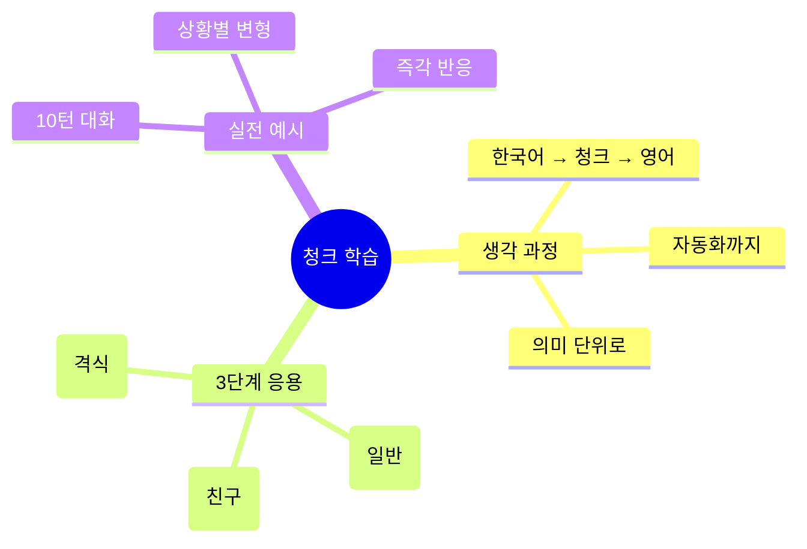
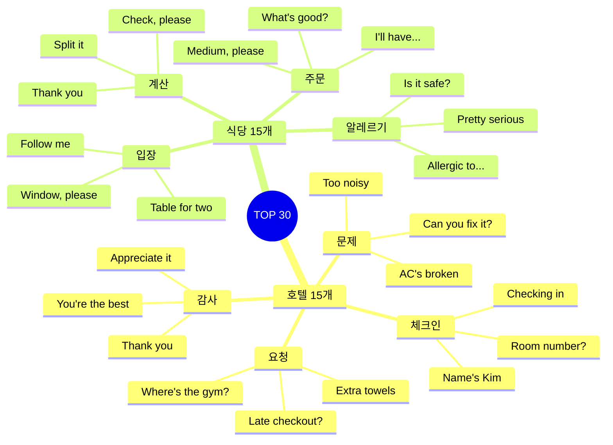

# 🏨🍽️ 호텔 & 식당 청크 실전 가이드
## 편안한 숙박과 맛있는 식사를 위한 청크 학습법

---

## 📋 청크 학습 시스템

### 🧠 이 가이드의 특별함



---

# 🏨 호텔 청크 마스터

## 청크 #1: 체크인 시작하기

### 🧩 청크 구조 분석

```
청크 = [동작] + [부가정보]
예: "Checking in / Name's Kim"
    [체크인 중] / [김입니다]
```

### 🎭 3단계 응용: 호텔 체크인

**🔹 1단계: 줄임말 (Casual)**
```
상황: 친근한 호텔, 젊은 직원

청크: "Hey! / Checking in. / Kim."
      [인사] [목적]      [이름]

🗣️ 말하는 순서:
1. Hey! (가벼운 인사)
2. Checking in (뭐하러 왔는지)
3. Kim (누구인지)

💭 생각 과정:
"안녕하세요" → "Hey!"
"체크인이요" → "Checking in"
"김입니다" → "Kim"

⏱️ 소요 시간: 2초
```

**🔹 2단계: 실전 (Standard) ⭐ 추천**
```
상황: 일반 호텔, 표준 서비스

청크: "Hi! / Checking in. / The name is Kim."
      [인사] [목적]      [이름 청크]

🗣️ 말하는 순서:
1. Hi! (일반 인사)
2. Checking in (목적)
3. The name is Kim (예약자 이름)

💭 생각 과정:
"안녕하세요" → "Hi!"
"체크인입니다" → "Checking in"
"예약자는 김입니다" → "The name is Kim"

⏱️ 소요 시간: 3초
```

**🔹 3단계: 정중 (Formal)**
```
상황: 고급 호텔, 프리미엄 서비스

청크: "Good evening. / I'd like to check in. / The reservation / is under Kim."
      [격식 인사]   [정중한 요청]       [예약]        [이름]

🗣️ 말하는 순서:
1. Good evening (시간대별 인사)
2. I'd like to check in (공손한 요청)
3. The reservation (예약 건)
4. is under Kim (예약자명)

💭 생각 과정:
"좋은 저녁입니다" → "Good evening"
"체크인하고 싶습니다" → "I'd like to check in"
"예약은 김으로 되어 있습니다" → "The reservation is under Kim"

⏱️ 소요 시간: 5초
```

### 📊 청크 비교표

| 레벨 | 청크 | 단어 수 | 격식도 | 추천 상황 |
|:---:|------|:------:|:-----:|----------|
| 1단계 | "Hey! Checking in. Kim." | 3 | ★ | 저렴한 호스텔, 친구 같은 분위기 |
| 2단계 | "Hi! Checking in. The name is Kim." | 6 | ★★★ | 일반 호텔, 가장 무난 |
| 3단계 | "Good evening. I'd like to check in. The reservation is under Kim." | 11 | ★★★★★ | 고급 호텔, 비즈니스 |

### 🎬 실전 대화 - 3가지 버전

**버전 A: 줄임말 버전**
```
상황: 저렴한 호스텔, 20대 배낭여행자

👤: "Hey! / Checking in. / Kim."
    [인사] [목적]      [이름]
👔: "Hey Kim! / Got your passport?"
    [인사]     [요청]
👤: "Yeah, / here."
    [확인] [제공]
👔: "Cool. / Room 203. / Second floor."
    [OK]   [방 번호]   [층]
👤: "Sweet. / Wi-Fi?"
    [만족]  [질문]
👔: "Password's / on the card. / Breakfast / 7 to 10."
    [비밀번호]  [카드]       [조식]    [시간]
👤: "Perfect. / Thanks!"
    [만족]    [감사]

⏱️ 총 시간: 20초
💭 느낌: 빠르고 효율적
🎯 청크 개수: 14개
```

**버전 B: 실전 버전 ⭐ 가장 많이 사용**
```
상황: 일반 호텔, 보통 여행자

👤: "Hi! / Checking in. / The name is Kim."
    [인사] [목적]      [이름]
👔: "Welcome, Mr. Kim! / May I see / your passport?"
    [환영]             [요청]     [서류]
👤: "Sure. / Here you go."
    [OK]   [제공]
👔: "Thank you. / You're in / room 812, / 8th floor."
    [감사]      [위치]    [방]      [층]
👤: "Great! / Is breakfast included?"
    [만족]  [조식 질문]
👔: "Yes, / it's included. / 6:30 to 10 AM / in the restaurant."
    [확인] [포함]        [시간]          [장소]
👤: "Perfect. / Where's the gym?"
    [만족]    [시설 질문]
👔: "Third floor. / Opens at 6 AM."
    [층]          [시간]
👤: "Excellent. / Thank you!"
    [만족]      [감사]
👔: "You're welcome. / Enjoy your stay!"
    [응답]          [인사]

⏱️ 총 시간: 45초
💭 느낌: 명확하고 자연스러움
🎯 청크 개수: 22개
```

**버전 C: 정중 버전**
```
상황: 5성급 호텔, 비즈니스 여행

👤: "Good evening. / I'd like to check in. / The reservation / is under Kim."
    [격식 인사]   [정중한 요청]       [예약]        [이름]
👔: "Good evening, Mr. Kim. / Welcome to / the Grand Hotel. / May I have / your passport / and credit card?"
    [환영]                [호텔명]                    [요청]      [서류들]
👤: "Certainly. / Here they are."
    [흔쾌히]    [제공]
👔: "Thank you very much. / I have you / in a deluxe room / on the 15th floor / with a city view."
    [정중한 감사]        [확인]      [객실 유형]      [층]            [전망]
👤: "That sounds wonderful. / Could you confirm / the checkout time?"
    [만족 표현]           [요청]           [시간]
👔: "Standard checkout / is at noon. / However, / I can extend / to 2 PM / for you / at no extra charge."
    [기본 시간]      [정오]     [그러나]  [연장 가능]  [시간]   [고객용] [무료]
👤: "That would be / most appreciated. / Thank you."
    [그것은]      [매우 감사]      [감사]
👔: "My pleasure. / The concierge desk / is to your right / if you need / any assistance. / Enjoy your stay."
    [천만에]     [컨시어지]         [위치]          [필요시]  [도움]        [인사]

⏱️ 총 시간: 90초
💭 느낌: 매우 격식있고 전문적
🎯 청크 개수: 32개
```

---

## 청크 #2: 객실 문제 해결

### 🧩 청크 구조 분석

```
청크 = [문제 제기] + [구체적 내용] + [요청]
예: "Got a problem / AC's not working / Can you help?"
    [문제 있음]   [에어컨 고장]      [도움 요청]
```

### 🎭 3단계 응용: 에어컨 고장

**🔹 1단계: 줄임말**
```
청크: "Hey, / AC's broken. / Can you fix it?"
      [호출] [문제]        [요청]

💭 생각:
"안녕하세요" → "Hey"
"에어컨 고장" → "AC's broken"
"고쳐줄 수 있나요?" → "Can you fix it?"

⏱️ 2초
```

**🔹 2단계: 실전 ⭐**
```
청크: "Hi, / I have a problem / with my room. / The AC / isn't working."
      [인사] [문제 있음]      [위치]        [기기]  [고장]

💭 생각:
"안녕하세요" → "Hi"
"문제가 있어요" → "I have a problem"
"제 방에" → "with my room"
"에어컨이" → "The AC"
"작동 안 해요" → "isn't working"

⏱️ 4초
```

**🔹 3단계: 정중**
```
청크: "Excuse me. / I'm terribly sorry / to bother you, / but I'm having / an issue / with the air conditioning / in my room. / It doesn't seem / to be working."
      [실례]     [죄송]           [방해]         [문제 있음]   [이슈]  [에어컨]                [위치]      [상태]          [고장]

💭 생각:
"실례합니다" → "Excuse me"
"정말 죄송하지만" → "I'm terribly sorry to bother you"
"문제가 있습니다" → "I'm having an issue"
"에어컨이" → "with the air conditioning"
"제 방에서" → "in my room"
"작동하지 않는 것 같습니다" → "It doesn't seem to be working"

⏱️ 8초
```

### 📊 문제 해결 청크 패턴

| 문제 | 1단계 (줄임말) | 2단계 (실전) ⭐ | 3단계 (정중) |
|------|---------------|----------------|-------------|
| **에어컨** | "AC's broken." | "The AC isn't working." | "The air conditioning doesn't seem to be functioning." |
| **소음** | "Too noisy." | "It's quite noisy." | "I'm experiencing some noise issues." |
| **청결** | "Room's dirty." | "The room needs cleaning." | "The room could use some attention." |
| **온도** | "Too hot." | "It's very warm in here." | "The temperature seems rather high." |

### 🎬 실전 대화 - 문제 해결 3버전

**버전 A: 줄임말 (빠른 해결)**
```
👤: "Hey, / AC's broken."
    [호출] [문제]
👔: "Oh no! / Room number?"
    [놀람]  [확인]
👤: "512."
    [방 번호]
👔: "On it. / Send someone / right away."
    [처리 중] [사람 보냄]  [즉시]
👤: "Thanks!"
    [감사]

⏱️ 15초 해결
```

**버전 B: 실전 (표준) ⭐**
```
👤: "Hi, / I have a problem / with my room."
    [인사] [문제 있음]      [위치]
👔: "I'm sorry / to hear that. / What's the issue?"
    [사과]     [듣기]        [무엇?]
👤: "The AC / isn't working. / It's really hot."
    [기기]   [고장]         [상태]
👔: "I apologize. / Let me / send someone / right away. / What's your room?"
    [사과]       [내가]  [보낼게요]  [즉시]      [방?]
👤: "512."
    [번호]
👔: "Okay. / Someone will be there / in 5 minutes. / Or / I can move you / to another room?"
    [OK]   [사람이 갈 거예요]   [5분]          [또는] [옮겨드릴까요]  [다른 방]
👤: "Moving rooms / would be better. / I need to rest."
    [방 옮기기]   [더 좋겠음]      [이유]
👔: "Absolutely. / Room 618 / is ready. / Better view too!"
    [당연히]     [방 번호]   [준비됨]  [보너스]

⏱️ 60초 해결
```

**버전 C: 정중 (고급 서비스)**
```
👤: "Excuse me. / I'm terribly sorry / to trouble you, / but I'm experiencing / an issue / with the climate control / in my room."
    [실례]     [매우 죄송]      [방해]         [문제 있음]       [이슈]  [에어컨]              [위치]
👔: "I sincerely apologize. / That's completely / unacceptable. / May I have / your room number?"
    [진심으로 사과]         [완전히]         [용납 불가]   [여쭤봐도]  [방 번호]
👤: "It's 512. / The air conditioning / doesn't appear / to be functioning."
    [방]       [에어컨]            [~인 것 같음]  [작동 안 함]
👔: "I'm extremely sorry / for the inconvenience. / I'll dispatch / our maintenance team / immediately. / Alternatively, / I can relocate you / to a superior room / with our compliments."
    [매우 죄송]          [불편]             [파견할게요]  [수리팀]            [즉시]      [또는]        [옮겨드릴게요]    [더 좋은 방]      [무료로]
👤: "I would appreciate / the room change. / I have / an early meeting / tomorrow."
    [감사하겠습니다]    [방 교체]         [있습니다] [이른 회의]     [내일]
👔: "Certainly. / Room 1205 / is a deluxe suite / on a higher floor. / I'll have / a bellhop / assist with / your luggage. / Once again, / my sincerest apologies."
    [물론]     [방 번호]   [디럭스 스위트]   [높은 층]        [시키겠습니다] [벨보이]  [돕도록]    [짐]         [다시 한번]  [진심 어린 사과]

⏱️ 120초 해결
```

---

## 청크 #3: 체크아웃 & 연장

### 🧩 청크 구조 분석

```
청크 = [시간 질문] + [연장 요청]
예: "What time's checkout? / Can I extend?"
    [체크아웃 시간?]     [연장 가능?]
```

### 🎭 3단계 응용

**🔹 1단계: 줄임말**
```
👤: "Checkout time?"
    [시간?]
👔: "11 AM."
    [시간]
👤: "Can I stay / till 2?"
    [머물 수 있나요] [2시까지]
👔: "Sure. / No extra charge."
    [OK]  [추가 요금 없음]
👤: "Perfect!"
    [만족]

⏱️ 10초
🎯 청크: 5개
```

**🔹 2단계: 실전 ⭐**
```
👤: "Hi! / What time / is checkout?"
    [인사] [몇 시]   [체크아웃]
👔: "Standard checkout / is at 11 AM."
    [기본]           [시간]
👤: "Could I / extend it / to 2 PM? / My flight's / at 5."
    [가능한가요] [연장]    [2시]      [비행기]    [5시]
👔: "Let me check... / Yes, / that's fine. / I'll note it / in the system."
    [확인할게요]      [네]  [괜찮습니다] [메모할게요]  [시스템에]
👤: "Thank you / so much! / Really appreciate it."
    [감사]      [매우]   [정말 감사]

⏱️ 30초
🎯 청크: 15개
```

**🔹 3단계: 정중**
```
👤: "Good morning. / I'd like to inquire / about / the checkout time."
    [인사]         [문의하고 싶습니다]   [~에 대해] [체크아웃 시간]
👔: "Good morning. / Our standard checkout / is at noon. / May I ask / when you're planning / to depart?"
    [인사]         [기본 체크아웃]      [정오]     [여쭤봐도]  [계획하시는지]    [출발]
👤: "My flight / isn't until / 5 PM. / Would it be possible / to extend / my checkout / to 2 PM?"
    [비행기]    [~까지 아님]  [5시]  [가능할까요]        [연장]    [체크아웃]  [2시]
👔: "Let me verify / availability... / Certainly. / I can accommodate / that request / at no additional cost."
    [확인할게요]   [가능 여부]    [물론]     [수용할 수 있습니다] [요청]      [추가 비용 없이]
👤: "That's very kind / of you. / I genuinely appreciate / your flexibility."
    [매우 친절하시네요]        [진심으로 감사합니다] [융통성]

⏱️ 60초
🎯 청크: 24개
```

---

# 🍽️ 식당 청크 마스터

## 청크 #4: 테이블 요청

### 🧩 청크 구조 분석

```
청크 = [인원수] + [위치 선호]
예: "Table for two / by the window?"
    [2명 자리]     [창가에]
```

### 🎭 3단계 응용

**🔹 1단계: 줄임말**
```
👤: "Two?"
    [2명?]
👔: "Yeah, / this way."
    [네]  [이쪽]
👤: "Window?"
    [창가?]
👔: "Sure. / Here good?"
    [OK]  [여기 OK?]
👤: "Perfect."
    [완벽]

⏱️ 8초
💭 극도로 간결
```

**🔹 2단계: 실전 ⭐**
```
👤: "Hi! / Table for two, / please."
    [인사] [2명]         [부탁]
👔: "Sure! / Follow me. / Here or / by the window?"
    [OK]  [따라오세요]  [여기]  [창가]
👤: "Window, / if possible."
    [창가]   [가능하면]
👔: "No problem. / Right this way."
    [문제없음]   [이쪽으로]
👤: "Thank you."
    [감사]

⏱️ 20초
💭 가장 자연스러움
```

**🔹 3단계: 정중**
```
👤: "Good evening. / We'd like / a table for two, / please."
    [인사]         [원합니다] [2명 자리]       [부탁]
👔: "Good evening. / Right away. / Would you prefer / indoor or outdoor?"
    [인사]         [즉시]      [선호하시나요]   [실내/실외]
👤: "Indoor, / by the window / if available."
    [실내]   [창가]          [가능하다면]
👔: "Certainly. / I have / a lovely spot / right here. / How's this?"
    [물론]     [있습니다] [멋진 자리]   [바로 여기]  [어떠세요?]
👤: "This is perfect. / Thank you very much."
    [완벽합니다]      [대단히 감사합니다]

⏱️ 40초
💭 매우 격식있음
```

---

## 청크 #5: 메뉴 추천 받기

### 🧩 청크 구조 분석

```
청크 = [질문] + [선호도] + [제한사항]
예: "What's good? / Not too spicy. / No seafood."
    [뭐 맛있어요?] [너무 맵지 않게] [해산물 제외]
```

### 🎭 3단계 응용

**🔹 1단계: 줄임말**
```
👤: "What's good?"
    [뭐 맛있어요?]
👔: "The pasta's / fire."
    [파스타가]    [대박]
👤: "Spicy?"
    [매워요?]
👔: "Nah."
    [아니요]
👤: "Cool. / That one."
    [좋아]  [그거]

⏱️ 10초
💭 초고속 주문
```

**🔹 2단계: 실전 ⭐**
```
👤: "What do you recommend? / I like / pasta dishes."
    [추천해주시겠어요?]      [좋아해요] [파스타 요리]
👔: "The salmon pasta / is very popular. / Fresh salmon / with cream sauce."
    [연어 파스타]      [인기 많음]      [신선한 연어]  [크림 소스]
👤: "That sounds great! / Is it / very spicy?"
    [좋아 보이네요!]     [그건]  [매우 매운가요?]
👔: "Not at all. / It's mild / and creamy."
    [전혀]        [순한]   [크리미]
👤: "Perfect. / I'll have that."
    [완벽]     [그걸로 할게요]
👔: "Excellent choice. / Any allergies / I should know about?"
    [훌륭한 선택]    [알레르기]   [알아야 할]
👤: "No, / I'm good."
    [아니요] [괜찮아요]

⏱️ 45초
💭 명확하고 안전
```

**🔹 3단계: 정중**
```
👤: "Excuse me. / Could you / perhaps recommend / something / from the menu? / I'm particularly fond / of seafood."
    [실례]       [해주실 수 있나요] [추천]           [무언가]  [메뉴에서]      [특히 좋아합니다]  [해산물]
👔: "Certainly. / May I suggest / the grilled salmon? / It's one of / our signature dishes. / Perfectly seasoned / and served with / seasonal vegetables."
    [물론]      [제안해도 될까요] [구운 연어]        [하나입니다]  [대표 요리]        [완벽하게 양념]    [함께 제공됩니다] [제철 채소]
👤: "That sounds delightful. / However, / I should mention / that I have / a mild allergy / to shellfish. / Is the salmon / prepared separately?"
    [매우 좋아 보입니다]     [그러나]  [말씀드려야 할]    [있습니다]  [가벼운 알레르기]  [갑각류]    [연어는]       [따로 준비되나요?]
👔: "I appreciate / you letting me know. / The salmon / is prepared / independently, / so there's / no cross-contamination. / However, / I'll inform / the kitchen / of your allergy / to ensure / complete safety."
    [감사합니다]  [알려주셔서]        [연어는]      [준비됩니다]  [독립적으로]   [없습니다]  [교차 오염]           [하지만]  [알리겠습니다] [주방에]  [알레르기를]   [보장하기 위해] [완전한 안전]
👤: "I'm very grateful / for your attentiveness. / I'll have / the salmon, / please."
    [매우 감사합니다]  [세심함]             [주문할게요] [연어를]   [부탁드립니다]

⏱️ 100초
💭 최고급 서비스
```

---

## 청크 #6: 알레르기 고지

### 🧩 청크 구조 분석 - 생명과 관련된 중요 청크!

```
청크 = [주의 환기] + [알레르기] + [강도]
예: "Important! / Allergic to peanuts. / Really serious."
    [중요!]      [땅콩 알레르기]     [매우 심각]
```

### 🎭 3단계 응용 (모두 중요!)

**🔹 1단계: 줄임말**
```
👤: "Hey, / peanut allergy. / Serious."
    [저기] [땅콩 알레르기]  [심각]

💡 긴급 상황에서도 OK
⚠️ 하지만 2-3단계 추천!
```

**🔹 2단계: 실전 ⭐⭐⭐ 강력 추천**
```
👤: "Before I order, / I have / a peanut allergy. / It's pretty serious."
    [주문 전에]      [있어요] [땅콩 알레르기]     [꽤 심각해요]
👔: "Thank you / for letting me know. / I'll make sure / the kitchen knows. / Which dish / were you considering?"
    [감사합니다] [알려주셔서]        [확실히 하겠습니다] [주방이 알도록]  [어떤 요리]  [고려하시나요?]
👤: "The chicken pasta. / Does it have / any nuts?"
    [치킨 파스타]      [들어가나요?] [견과류]
👔: "Let me / double-check / with the kitchen."
    [제가]  [재확인할게요]  [주방과]
[확인 후]
👔: "Good news! / The chicken pasta / is completely / nut-free. / I've informed / the chef / about your allergy."
    [좋은 소식]  [치킨 파스타는]    [완전히]     [견과류 없음] [알렸습니다]  [주방장에게] [알레르기를]
👤: "Thank you / so much. / I really appreciate / your help."
    [감사합니다] [매우]   [정말 감사합니다]  [도움]

⏱️ 60초
💭 안전하고 명확
```

**🔹 3단계: 정중 (고급 레스토랑)**
```
👤: "Excuse me. / Before we proceed, / I must inform you / that I have / a severe allergy / to peanuts / and tree nuts. / This is / quite serious."
    [실례]       [진행하기 전에]    [알려드려야]       [있습니다]  [심각한 알레르기]  [땅콩]    [견과류]       [이것은]  [상당히 심각합니다]
👔: "Thank you / for informing us. / Your safety / is our priority. / I will personally / notify our chef / and ensure / that all precautions / are taken. / May I ask / if you carry / an EpiPen?"
    [감사합니다] [알려주셔서]     [안전은]     [최우선]        [개인적으로]      [알리겠습니다] [주방장에게] [보장할게요] [모든 예방조치가]  [취해지도록]  [여쭤봐도] [가지고 계시나요] [에피펜]
👤: "Yes, / I do have one / with me. / I appreciate / your diligence. / Which items / on the menu / are completely safe?"
    [네]  [가지고 있습니다]        [정말 감사합니다] [세심함]        [어떤 메뉴들이]          [완전히 안전한가요?]
👔: "Certainly. / The grilled salmon, / the chicken breast, / and the vegetable risotto / are all / completely nut-free / and prepared / in a separate area. / I'll have / our chef / personally oversee / your meal preparation."
    [물론]      [구운 연어]        [치킨 가슴살]        [야채 리조또]          [모두]  [완전히 견과류 없음]  [준비됩니다]  [별도 공간에서]   [시키겠습니다] [주방장이] [직접 감독하도록]  [식사 준비를]

⏱️ 120초
💭 최고 수준의 안전
```

### ⚠️ 알레르기 청크 - 필수 암기!

```
핵심 알레르기 청크:

✅ "I have / a [food] allergy."
   [있어요] [음식 알레르기]

✅ "It's / pretty serious."
   [그건] [꽤 심각해요]

✅ "I'm allergic to / [food]."
   [알레르기 있어요] [음식]

✅ "Does this have / any [allergen]?"
   [들어가나요?]    [알레르겐]

🚨 생명과 직결! 반드시 명확하게!
```

---

## 청크 #7: 계산하기

### 🧩 청크 구조 분석

```
청크 = [계산 요청] + [분할 여부] + [팁]
예: "Check, please. / Split it. / 20% tip."
    [계산서]       [나누기]  [팁]
```

### 🎭 3단계 응용

**🔹 1단계: 줄임말**
```
👤: "Check?"
    [계산?]
👔: "Coming up."
    [가져올게요]
[계산서 후]
👤: "Split?"
    [나눠요?]
👔: "Sure. / Two cards?"
    [OK]  [카드 2개?]
👤: "Yeah."
    [네]

⏱️ 15초
```

**🔹 2단계: 실전 ⭐**
```
👤: "Excuse me, / can we get / the check?"
    [실례]       [받을 수 있나요] [계산서]
👔: "Of course. / How was / everything?"
    [물론]       [어떠셨나요] [모든 것]
👤: "Really good! / The salmon / was amazing."
    [정말 좋았어요] [연어가]     [대단했어요]
👔: "Wonderful! / I'll get / your check. / One check or / separate?"
    [좋네요!]     [가져올게요] [계산서]   [한 장?]      [따로?]
👤: "Can we / split it? / Two cards."
    [할 수 있나요] [나눠서]   [카드 2개]
👔: "No problem. / I'll split it / 50-50."
    [문제없어요]   [나눌게요]    [반반]

⏱️ 40초
```

**🔹 3단계: 정중**
```
👤: "Excuse me. / When you have / a moment, / we'd like / the check, / please."
    [실례]       [시간 되실 때]          [원합니다] [계산서]   [부탁드립니다]
👔: "Certainly. / First, / may I say / you've chosen / excellent dishes. / Were they / to your satisfaction?"
    [물론]      [먼저]  [말씀드려도]  [선택하셨네요] [훌륭한 요리들] [그것들이]  [만족스러우셨나요?]
👤: "Absolutely. / Everything was / prepared beautifully. / Our compliments / to the chef."
    [정말]        [모든 것이]     [훌륭하게 준비되었습니다] [칭찬]           [주방장에게]
👔: "I'll be sure / to pass that along. / Now, / would you prefer / one check / or separate checks?"
    [꼭 전달하겠습니다]               [이제]  [선호하시나요]  [한 장]    [따로 따로]
👤: "We'd like / to split it evenly, / if that's / not too much trouble."
    [원합니다]  [균등하게 나누고 싶습니다] [만약]      [너무 번거롭지 않다면]
👔: "Not at all. / I'll prepare / two separate bills / for you. / One moment, / please."
    [전혀]        [준비하겠습니다] [두 개의 계산서를]        [잠시만]        [기다려주세요]

⏱️ 80초
```

---

## 🎯 통합 시나리오: 완벽한 식사

### 시나리오 1: 캐주얼 식당 (줄임말 버전)

```
장소: 캐주얼 레스토랑
인원: 2명
시간: 저녁

👤: "Hey! / Two?"
    [인사] [2명?]
👔: "Yeah! / Window OK?"
    [OK]  [창가?]
👤: "Perfect."
    [좋아]

[자리 안내 후]
👤: "What's good?"
    [뭐 맛있어요?]
👔: "Burgers / are fire."
    [버거가]   [대박]
👤: "Sweet. / Two burgers. / Medium."
    [좋아]  [버거 2개]   [미디엄]
👔: "Drinks?"
    [음료?]
👤: "Two beers."
    [맥주 2개]
👔: "You got it."
    [알겠습니다]

[식사 중]
👤: "This is / so good!"
    [이거]    [정말 맛있어!]
👔: "Right? / Glad you / like it!"
    [그죠?]  [기뻐요]    [좋아하시다니!]

[식사 후]
👤: "Check?"
    [계산?]
👔: "Sure. / $45 total."
    [네]   [총 45달러]
👤: "Split it."
    [나눠요]
👔: "22.50 each. / Cash or card?"
    [각각]          [현금? 카드?]
👤: "Cards."
    [카드]

⏱️ 총 소요: 20분
💭 느낌: 편하고 빠름
🎯 청크: 22개
```

### 시나리오 2: 표준 레스토랑 (실전 버전) ⭐

```
장소: 일반 레스토랑
인원: 2명
목적: 여유로운 식사

턴 1-3: 입장
👤: "Hi! / Table for two, / please."
👔: "Of course! / Right this way. / By the window / okay?"
👤: "That's perfect. / Thank you."

턴 4-6: 메뉴 확인
👔: "Here are / your menus. / Can I start you / with drinks?"
👤: "What do you / recommend?"
👔: "The house wine / is excellent. / Or / our fresh lemonade."
👤: "Two lemonades, / please."
👔: "Coming right up."

턴 7-10: 주문
👔: "Ready to order?"
👤: "Yes! / I have / a question first. / I'm allergic to / shellfish. / Which dishes / are safe?"
👔: "Thank you / for telling me. / The chicken pasta / and the steak / are both / completely safe."
👤: "Great! / I'll have / the chicken pasta. / My friend / will have / the steak."
👔: "Perfect. / How would you like / the steak cooked?"
👤: "Medium, / please."
👔: "Excellent. / I'll get / those orders in."

턴 11-13: 식사 중
👔: "How is / everything?"
👤: "Delicious! / The pasta / is amazing."
👔: "So glad / you're enjoying it. / Let me know / if you need / anything else."

턴 14-18: 계산
👤: "We're ready / for the check."
👔: "Of course. / Here you go. / Take your time."
👤: "Can we / split this?"
👔: "No problem. / I'll divide it / evenly. / That's / $32.50 each."
👤: "Perfect. / Here are / our cards."
👔: "I'll be / right back."
[결제 후]
👔: "All set! / Thank you / so much. / Hope to see you / again soon!"
👤: "Thank you! / Everything was / wonderful."

⏱️ 총 소요: 45분
💭 느낌: 편안하고 만족스러움
🎯 청크: 52개
```

### 시나리오 3: 고급 레스토랑 (정중 버전)

```
장소: 파인 다이닝
인원: 비즈니스 미팅
중요도: 높음

턴 1-2: 예약 확인
👤: "Good evening. / We have / a reservation / under Kim / for 7:30."
👔: "Good evening, / Mr. Kim. / Welcome. / Your table / is ready. / Please, / follow me."

턴 3-4: 착석
👔: "Will this table / suit you? / It's one of / our quieter spots / for conversation."
👤: "This is / absolutely perfect. / Thank you / for your consideration."

턴 5-8: 음료 주문
👔: "May I offer you / our wine list? / Or perhaps / an aperitif?"
👤: "I'd appreciate / seeing / the wine list. / Could you / recommend / something / that pairs well / with seafood?"
👔: "Certainly. / The Chablis / is exceptional / with our seafood dishes. / Would you like / to try / a glass?"
👤: "That sounds / delightful. / We'll have / two glasses, / please."

턴 9-15: 메뉴 상담
👔: "Have you had / a chance / to review / the menu? / May I answer / any questions?"
👤: "Yes, / thank you. / Before we order, / I should mention / that my colleague / has / a severe allergy / to tree nuts. / Could you / advise us / on safe options?"
👔: "I greatly appreciate / you informing us. / Your safety / is paramount. / I'll personally / speak with / our chef. / May I suggest / the Dover sole / or / the beef tenderloin? / Both are / completely nut-free / and prepared / in a dedicated area."
👤: "Excellent. / We'll have / the Dover sole / and / the beef tenderloin. / For the beef, / medium-rare, / please."
👔: "A wonderful choice. / I'll ensure / the chef / is aware / of the allergy. / Would you care for / any appetizers?"
👤: "What would you / recommend?"
👔: "The oysters / are exceptional / this evening. / Alternatively, / the burrata / is exquisite."
👤: "We'll start with / the burrata, / thank you."

턴 16-20: 식사 중 서비스
👔: "Is everything / to your liking?"
👤: "Everything is / absolutely superb. / Please convey / our compliments / to the chef."
👔: "I'm delighted / to hear that. / I'll certainly / pass along / your kind words."

턴 21-25: 계산
👤: "When you have / a moment, / we'd like / the check, / please."
👔: "Of course. / I'll prepare that / for you. / Would you prefer / one check / or separate?"
👤: "One check / will be fine. / This is / a business dinner / on my account."
👔: "Understood. / One moment, / please."
[계산서 후]
👔: "Here is / your check. / There's / no rush / at all."
👤: "Thank you. / [처리 후] / The service / was impeccable. / We'll certainly / return."
👔: "That's / most kind / of you. / We look forward / to welcoming you / again. / Have a / wonderful evening."

⏱️ 총 소요: 90분
💭 느낌: 세련되고 전문적
🎯 청크: 98개
```

---

## 📊 호텔 & 식당 청크 마스터 맵

### 필수 암기 청크 TOP 30



---

## 💡 청크 마스터 전략

### 1주일 집중 훈련

```
Day 1: 호텔 체크인 청크
□ "Checking in" 100번
□ "The name is Kim" 50번
□ 3단계 모두 연습

Day 2: 호텔 문제 해결 청크
□ "AC's broken" 시나리오
□ "Too noisy" 시나리오
□ 각 3단계 연습

Day 3: 식당 입장 청크
□ "Table for two" 100번
□ 위치 청크 연습
□ 실전 대화 5회

Day 4: 주문 청크
□ "What's good?" 패턴
□ "I'll have..." 연습
□ 조리법 청크 암기

Day 5: 알레르기 청크 (중요!)
□ "Allergic to..." 필수 암기
□ 안전 확인 청크
□ 비상 상황 연습

Day 6: 계산 청크
□ "Check, please" 기본
□ 분할 결제 청크
□ 팁 계산 연습

Day 7: 통합 테스트
□ 전체 시나리오 3회
□ 3단계 모두 연습
□ 실전 준비 완료!
```

---

## 🏆 최종 체크리스트

### 호텔 청크 ✅
- [ ] 체크인 3단계 완벽
- [ ] 문제 해결 청크 암기
- [ ] 요청 표현 자동화
- [ ] 10턴 대화 유창

### 식당 청크 ✅
- [ ] 입장 청크 완벽
- [ ] 주문 청크 자동화
- [ ] 알레르기 청크 필수 암기
- [ ] 계산 청크 마스터

### 실전 준비 🔥
- [ ] 3초 안에 반응
- [ ] 3단계 자유자재
- [ ] 20턴 대화 가능
- [ ] 실전 자신감 100%

---

**Last Updated: 2026-01-11**

