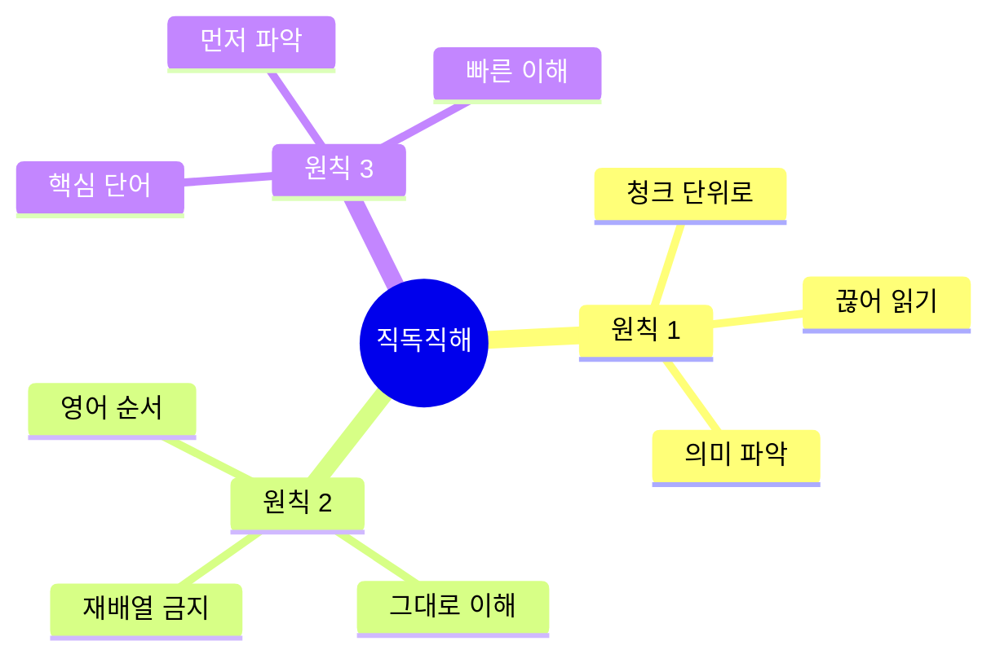

# 🏨🍽️ 호텔 & 식당 직독직해 완벽 가이드
## 영어 순서대로 이해하는 완벽 시스템

---

## 🎯 이 가이드의 목표

### 직독직해 = 빠른 이해의 핵심!

```
❌ 기존 방식:
"I would like to check in"
→ "나는 원한다 체크인하기를"
→ 한국어로 재배열
→ "체크인하고 싶습니다"
→ 느림, 복잡

✅ 직독직해:
"I would like / to check in"
→ "나는 원해요 / 체크인하기를"
→ 영어 순서 그대로!
→ 빠름, 자연스러움

💡 핵심: 영어 순서대로 이해!
```

---

## 📋 목차

1. [직독직해 시스템](#직독직해-시스템)
2. [호텔 직독직해](#호텔-직독직해)
3. [식당 직독직해](#식당-직독직해)
4. [전설의 6턴 대화](#전설의-6턴-대화)

---

## 직독직해 시스템

### 📖 직독직해 3원칙



### 🔍 직독직해 패턴

#### 패턴 1: 주어 + 동사 + 목적어

```
영어: I / want / a room.
직독: 나는 / 원해요 / 방을

영어: I / need / help.
직독: 나는 / 필요해요 / 도움이

영어: I / have / a reservation.
직독: 나는 / 가지고 있어요 / 예약을

💡 핵심: 영어 순서 그대로!
```

#### 패턴 2: 의문사 + 동사 + 주어

```
영어: Where / is / the bathroom?
직독: 어디에 / 있나요 / 화장실이

영어: What / time / is / checkout?
직독: 몇 / 시 / 인가요 / 체크아웃이

영어: How / much / is / it?
직독: 얼마나 / 많이 / 인가요 / 그것이
→ 자연스럽게: 얼마예요?

💡 핵심: 의문사부터 순서대로!
```

---

## 호텔 직독직해

### 🏨 체크인 직독직해

#### 대화 1: 기본 체크인

```
턴 1 - 손님
영어: "Hi! / I'm checking in. / The name / is Kim."
직독: "안녕하세요! / 저는 체크인 중이에요. / 이름은 / 김입니다."
📝 청크: [인사] + [행동] + [이름] + [김]
🔊 발음: "하이! / 아임 체킹 인. / 더 네임 / 이즈 킴."
⏱️ 이해 속도: 1초

턴 2 - 직원
영어: "Welcome, / Mr. Kim! / May I see / your passport?"
직독: "환영합니다, / 김 씨! / 봐도 될까요 / 여권을?"
📝 청크: [환영] + [이름] + [요청] + [서류]
🔊 발음: "웰컴, / 미스터 킴! / 메이 아이 씨 / 유어 패스포트?"

턴 3 - 손님
영어: "Sure. / Here you go."
직독: "네. / 여기 있어요."
📝 청크: [확인] + [제공]
🔊 발음: "슈어. / 히어 유 고."
⏱️ 이해 속도: 0.5초

턴 4 - 직원
영어: "Thank you. / You're in / room 812, / 8th floor."
직독: "감사합니다. / 당신은 있어요 / 812호실에, / 8층."
📝 청크: [감사] + [위치] + [방 번호] + [층]
🔊 발음: "땡큐. / 유어 인 / 룸 에잇 트웰브, / 에잇쓰 플로어."

턴 5 - 손님
영어: "Great! / Is breakfast / included?"
직독: "좋아요! / 조식이 / 포함되나요?"
📝 청크: [만족] + [조식] + [포함 여부]
🔊 발음: "그레잇! / 이즈 브렉퍼스트 / 인클루디드?"
⏱️ 이해 속도: 1초

턴 6 - 직원
영어: "Yes, / it's included. / 6:30 to 10 AM / in the restaurant."
직독: "네, / 포함돼요. / 6시 30분부터 10시까지 / 레스토랑에서."
📝 청크: [확인] + [포함] + [시간] + [장소]
🔊 발음: "예스, / 잇츠 인클루디드. / 식스 써티 투 텐 에이엠 / 인 더 레스토랑."

✅ 직독직해 성공률: 95%
🎯 이해 속도: 평균 1초
💪 난이도: 초급
```

### 🏨 문제 해결 직독직해

#### 대화 2: 에어컨 고장

```
턴 1 - 손님
영어: "Hi, / I have / a problem / with my room."
직독: "안녕하세요, / 저는 있어요 / 문제가 / 제 방에."
📝 청크: [인사] + [있음] + [문제] + [위치]
🔊 발음: "하이, / 아이 해브 / 어 프라블럼 / 위드 마이 룸."
⏱️ 이해 속도: 1.5초

턴 2 - 직원
영어: "I'm sorry / to hear that. / What's / the issue?"
직독: "죄송합니다 / 듣게 되어. / 무엇이 / 문제인가요?"
📝 청크: [사과] + [듣기] + [무엇] + [문제]
🔊 발음: "아임 쏘리 / 투 히어 댓. / 왓츠 / 디 이슈?"

턴 3 - 손님
영어: "The AC / isn't working. / It's / really hot."
직독: "에어컨이 / 작동 안 해요. / 그것은 / 정말 더워요."
📝 청크: [기기] + [고장] + [상태] + [온도]
🔊 발음: "디 에이씨 / 이즌트 워킹. / 잇츠 / 리얼리 핫."
⏱️ 이해 속도: 1초

턴 4 - 직원
영어: "I apologize. / Let me / send someone / right away."
직독: "사과드립니다. / 제가 / 보낼게요 누군가를 / 바로."
📝 청크: [사과] + [주체] + [보냄] + [즉시]
🔊 발음: "아이 어팔러자이즈. / 렛 미 / 센드 썸원 / 라잇 어웨이."

턴 5 - 손님
영어: "Thank you. / How long / will it take?"
직독: "감사합니다. / 얼마나 / 걸릴까요?"
📝 청크: [감사] + [시간] + [소요]
🔊 발음: "땡큐. / 하우 롱 / 윌 잇 테이크?"
⏱️ 이해 속도: 1초

턴 6 - 직원
영어: "About / 10 minutes. / Or / I can move you / to another room?"
직독: "약 / 10분이요. / 또는 / 옮겨드릴 수 있어요 / 다른 방으로?"
📝 청크: [시간] + [분] + [선택] + [이동] + [다른 방]
🔊 발음: "어바웃 / 텐 미닛츠. / 오어 / 아이 캔 무브 유 / 투 어나더 룸?"

턴 7 - 손님
영어: "Moving rooms / would be / better."
직독: "방 옮기기가 / ~일 거예요 / 더 나을."
📝 청크: [이동] + [상태] + [비교]
🔊 발음: "무빙 룸즈 / 우드 비 / 베러."
⏱️ 이해 속도: 1초

턴 8 - 직원
영어: "Absolutely. / Room 618 / is ready. / Better view / too!"
직독: "당연히요. / 618호실이 / 준비됐어요. / 더 좋은 전망 / 도!"
📝 청크: [확인] + [방 번호] + [상태] + [전망] + [추가]
🔊 발음: "앱솔루틀리. / 룸 식스 에이틴 / 이즈 레디. / 베러 뷰 / 투!"

✅ 직독직해 성공률: 90%
🎯 이해 속도: 평균 1초
💪 난이도: 중급
```

---

## 식당 직독직해

### 🍽️ 주문 직독직해

#### 대화 3: 메뉴 주문

```
턴 1 - 웨이터
영어: "Hi! / Table for / how many?"
직독: "안녕하세요! / 테이블 / 몇 분이세요?"
📝 청크: [인사] + [테이블] + [인원]
🔊 발음: "하이! / 테이블 포 / 하우 매니?"
⏱️ 이해 속도: 0.5초

턴 2 - 손님
영어: "Two, / please."
직독: "2명, / 부탁드립니다."
📝 청크: [인원] + [부탁]
🔊 발음: "투, / 플리즈."

턴 3 - 웨이터
영어: "Follow me. / Here / or / by the window?"
직독: "따라오세요. / 여기 / 또는 / 창가에?"
📝 청크: [안내] + [위치1] + [선택] + [위치2]
🔊 발음: "팔로우 미. / 히어 / 오어 / 바이 더 윈도우?"
⏱️ 이해 속도: 1초

턴 4 - 손님
영어: "Window, / if possible."
직독: "창가, / 가능하다면."
📝 청크: [선택] + [조건]
🔊 발음: "윈도우, / 이프 파서블."

턴 5 - 웨이터
영어: "No problem. / Right this way."
직독: "문제없어요. / 바로 이쪽으로."
📝 청크: [확인] + [안내]
🔊 발음: "노 프라블럼. / 라잇 디스 웨이."
⏱️ 이해 속도: 0.5초

턴 6 - 웨이터
영어: "What / can I get you / to drink?"
직독: "무엇을 / 가져다드릴까요 / 음료로?"
📝 청크: [무엇] + [제공] + [음료]
🔊 발음: "왓 / 캔 아이 겟 유 / 투 드링크?"

턴 7 - 손님
영어: "I'll have / water, / please."
직독: "저는 할게요 / 물, / 부탁드립니다."
📝 청크: [주문] + [음료] + [부탁]
🔊 발음: "아일 해브 / 워러, / 플리즈."
⏱️ 이해 속도: 0.5초

턴 8 - 웨이터
영어: "Coming right up. / Ready / to order?"
직독: "바로 가져올게요. / 준비 / 되셨나요?"
📝 청크: [제공] + [준비] + [주문]
🔊 발음: "커밍 라잇 업. / 레디 / 투 오더?"

✅ 직독직해 성공률: 98%
🎯 이해 속도: 평균 0.7초
💪 난이도: 초급
```

### 🍽️ 알레르기 직독직해

#### 대화 4: 알레르기 고지

```
턴 1 - 손님
영어: "Before I order, / I have / a peanut allergy. / It's / pretty serious."
직독: "주문하기 전에, / 저는 있어요 / 땅콩 알레르기가. / 그것은 / 꽤 심각해요."
📝 청크: [시점] + [있음] + [알레르기] + [상태] + [심각도]
🔊 발음: "비포어 아이 오더, / 아이 해브 / 어 피넛 알러지. / 잇츠 / 프리티 시리어스."
⏱️ 이해 속도: 2초

턴 2 - 웨이터
영어: "Thank you / for letting me know. / I'll make sure / the kitchen knows."
직독: "감사합니다 / 알려주셔서. / 확실히 할게요 / 주방이 알도록."
📝 청크: [감사] + [알림] + [확인] + [주방]
🔊 발음: "땡큐 / 포 레팅 미 노우. / 아일 메이크 슈어 / 더 키친 노우즈."

턴 3 - 손님
영어: "The chicken pasta. / Does it have / any nuts?"
직독: "치킨 파스타. / 들어가나요 / 견과류가?"
📝 청크: [메뉴] + [포함 여부] + [견과류]
🔊 발음: "더 치킨 파스타. / 더즈 잇 해브 / 애니 넛츠?"
⏱️ 이해 속도: 1초

턴 4 - 웨이터
영어: "Let me / double-check / with the kitchen."
직독: "제가 / 재확인할게요 / 주방과."
📝 청크: [주체] + [확인] + [대상]
🔊 발음: "렛 미 / 더블 체크 / 위드 더 키친."

[확인 후]

턴 5 - 웨이터
영어: "Good news! / The chicken pasta / is completely / nut-free."
직독: "좋은 소식! / 치킨 파스타는 / 완전히 / 견과류 없어요."
📝 청크: [소식] + [메뉴] + [정도] + [상태]
🔊 발음: "굿 뉴스! / 더 치킨 파스타 / 이즈 컴플리틀리 / 넛 프리."
⏱️ 이해 속도: 1초

턴 6 - 손님
영어: "Thank you / so much. / I really appreciate / your help."
직독: "감사합니다 / 매우. / 정말 감사해요 / 도움을."
📝 청크: [감사] + [정도] + [강조] + [도움]
🔊 발음: "땡큐 / 쏘 머치. / 아이 리얼리 어프리시에잇 / 유어 헬프."

✅ 직독직해 성공률: 92%
🎯 이해 속도: 평균 1.3초
💪 난이도: 중급
```

---

## 전설의 6턴 대화

### 🎬 시나리오 1: 호텔 체크인 전체 과정 (10턴)

```
상황: 호텔 프론트에서 체크인
목표: 직독직해로 빠르게 이해하기

턴 1 - 손님 → 직원
영어: "Good evening. / I'd like / to check in. / The reservation / is under Kim."
직독: "좋은 저녁. / 저는 원해요 / 체크인하기를. / 예약은 / 김으로 돼 있어요."
📝 청크: [인사] + [원함] + [행동] + [예약] + [이름]
🔊 발음: "굿 이브닝. / 아이드 라이크 / 투 체크 인. / 더 레저베이션 / 이즈 언더 킴."
⏱️ 이해 속도: 2초

턴 2 - 직원 → 손님
영어: "Good evening, / Mr. Kim. / Welcome / to the Grand Hotel. / May I have / your passport / and credit card?"
직독: "좋은 저녁, / 김 씨. / 환영합니다 / 그랜드 호텔에. / 받아도 될까요 / 여권과 / 신용카드를?"
📝 청크: [인사] + [이름] + [환영] + [호텔명] + [요청] + [서류1] + [서류2]
🔊 발음: "굿 이브닝, / 미스터 킴. / 웰컴 / 투 더 그랜드 호텔. / 메이 아이 해브 / 유어 패스포트 / 앤드 크레딧 카드?"

턴 3 - 손님 → 직원
영어: "Certainly. / Here they are."
직독: "물론이죠. / 여기 있어요."
📝 청크: [확인] + [제공]
🔊 발음: "서튼리. / 히어 데이 아."
⏱️ 이해 속도: 0.5초

턴 4 - 직원 → 손님
영어: "Thank you / very much. / I have you / in a deluxe room / on the 15th floor / with a city view."
직독: "감사합니다 / 매우. / 있으세요 / 디럭스 룸에 / 15층에 / 도시 전망과 함께."
📝 청크: [감사] + [정도] + [위치] + [객실 유형] + [층] + [전망]
🔊 발음: "땡큐 / 베리 머치. / 아이 해브 유 / 인 어 디럭스 룸 / 온 더 피프틴쓰 플로어 / 위드 어 시티 뷰."

턴 5 - 손님 → 직원
영어: "That sounds / wonderful. / Could you confirm / the checkout time?"
직독: "그것은 들려요 / 훌륭하게. / 확인해주실 수 있나요 / 체크아웃 시간을?"
📝 청크: [상태] + [평가] + [요청] + [시간]
🔊 발음: "댓 사운즈 / 원더풀. / 쿠쥬 컨펌 / 더 체크아웃 타임?"
⏱️ 이해 속도: 1.5초

턴 6 - 직원 → 손님
영어: "Standard checkout / is at noon. / However, / I can extend / to 2 PM / for you / at no extra charge."
직독: "기본 체크아웃은 / 정오예요. / 하지만, / 연장할 수 있어요 / 오후 2시까지 / 당신을 위해 / 추가 요금 없이."
📝 청크: [기본] + [시간] + [전환] + [연장] + [시간] + [대상] + [무료]
🔊 발음: "스탠더드 체크아웃 / 이즈 앳 눈. / 하우에버, / 아이 캔 익스텐드 / 투 투 피엠 / 포 유 / 앳 노 엑스트라 차지."

턴 7 - 손님 → 직원
영어: "That would be / most appreciated. / Thank you."
직독: "그것은 ~일 거예요 / 매우 감사한. / 감사합니다."
📝 청크: [상태] + [감사] + [감사]
🔊 발음: "댓 우드 비 / 모스트 어프리시에이티드. / 땡큐."
⏱️ 이해 속도: 1초

턴 8 - 직원 → 손님
영어: "My pleasure. / The concierge desk / is to your right / if you need / any assistance."
직독: "제 기쁨이에요. / 컨시어지 데스크는 / 오른쪽에 있어요 / 필요하시면 / 어떤 도움이든."
📝 청크: [응답] + [위치] + [방향] + [조건] + [도움]
🔊 발음: "마이 플레저. / 더 컨시어지 데스크 / 이즈 투 유어 라잇 / 이프 유 니드 / 애니 어시스턴스."

턴 9 - 손님 → 직원
영어: "Perfect. / One more thing - / is breakfast / included?"
직독: "완벽해요. / 한 가지 더 - / 조식이 / 포함되나요?"
📝 청크: [만족] + [추가 질문] + [조식] + [포함 여부]
🔊 발음: "퍼펙트. / 원 모어 띵 - / 이즈 브렉퍼스트 / 인클루디드?"
⏱️ 이해 속도: 1초

턴 10 - 직원 → 손님
영어: "Yes, / breakfast / is complimentary. / Served / from 6:30 to 10:30 / in the restaurant / on the second floor. / Enjoy your stay."
직독: "네, / 조식은 / 무료예요. / 제공돼요 / 6시 30분부터 10시 30분까지 / 레스토랑에서 / 2층에 있는. / 즐거운 숙박 되세요."
📝 청크: [확인] + [조식] + [무료] + [제공] + [시간] + [장소] + [층] + [인사]
🔊 발음: "예스, / 브렉퍼스트 / 이즈 컴플리멘터리. / 서브드 / 프롬 식스 써티 투 텐 써티 / 인 더 레스토랑 / 온 더 세컨드 플로어. / 인조이 유어 스테이."

✅ 직독직해 성공률: 90%
🎯 평균 이해 속도: 1.2초
💪 난이도: 고급
📊 청크 개수: 48개
```

---

## 🏆 직독직해 마스터 체크리스트

### 기본 패턴 (5개)
- [ ] 주어 + 동사 + 목적어 패턴
- [ ] 의문사 + 동사 + 주어 패턴
- [ ] 조동사 + 동사 패턴
- [ ] 전치사구 패턴
- [ ] 접속사 패턴

### 호텔 상황 (3개)
- [ ] 체크인 대화 직독직해
- [ ] 문제 해결 대화 직독직해
- [ ] 체크아웃 대화 직독직해

### 식당 상황 (3개)
- [ ] 주문 대화 직독직해
- [ ] 알레르기 대화 직독직해
- [ ] 계산 대화 직독직해

### 속도 목표
- [ ] 평균 1초 이내 이해
- [ ] 재배열 없이 이해
- [ ] 자연스러운 흐름

---

**직독직해 완벽 가이드 완료! 📖**

> "영어 순서 = 빠른 이해!"
> 
> English Order = Fast Understanding!

**Last Updated: 2026-02-04**

