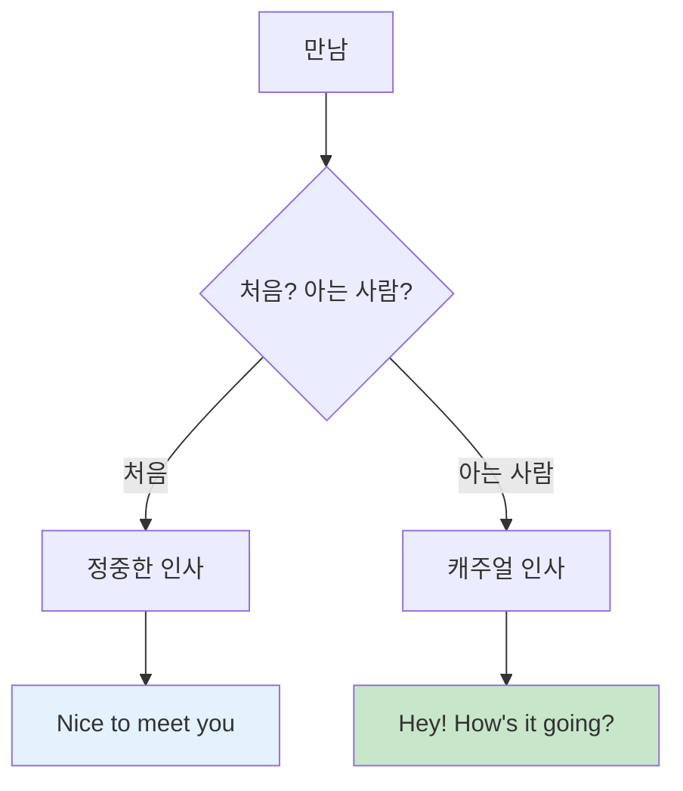
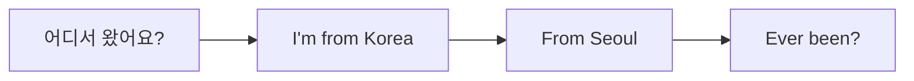
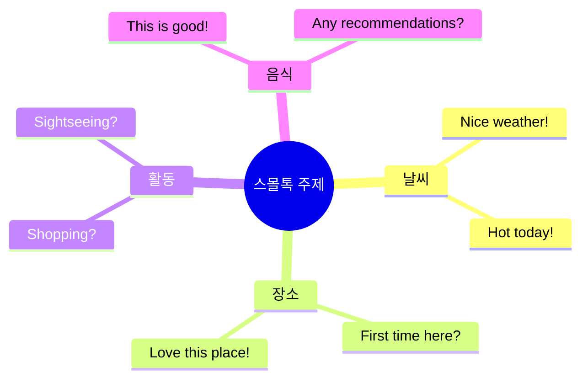
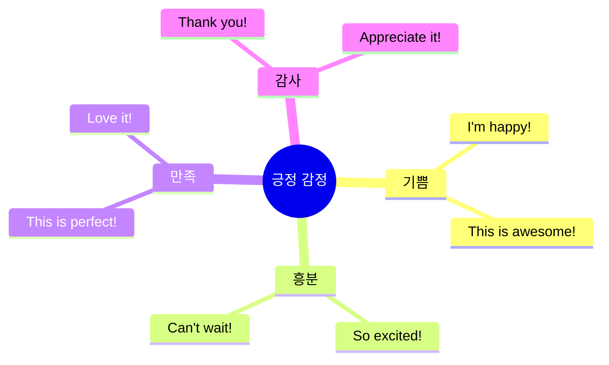

# 🌆 일상생활 청크 실전 가이드
## 날씨부터 잡담까지 완벽 마스터

---

## 🎯 이 가이드의 목표

### 일상생활 = 진짜 영어!

```
❌ 흔한 실수:
"Um... the weather is... 
very nice... today... right?"
→ 어색, 부자연스러움

✅ 청크로 말하면:
"Nice weather today!"
→ 자연스러움, 현지인 같음!

💡 핵심: 짧고 친근하게!
```

### 🏆 학습 목표

```
✅ 일상 청크 30개 마스터
✅ 3단계 응용 (캐주얼/표준/정중)
✅ 스몰톡 자유자재
✅ 현지인처럼 자연스럽게
✅ 친구 만들기 가능!
```

---

## 📋 목차

1. [인사 & 소개 청크](#인사--소개-청크)
2. [날씨 & 스몰톡 청크](#날씨--스몰톡-청크)
3. [일상 활동 청크](#일상-활동-청크)
4. [감정 표현 청크](#감정-표현-청크)
5. [실전 대화](#실전-대화)

---

## 인사 & 소개 청크

### 💡 인사 시스템



### 🔹 기본 인사 청크

#### 청크 1: Hey / Hi ⭐

**3단계 시스템:**

| 단계 | 청크 | 상황 | 느낌 |
|:---:|------|------|------|
| 1단계 | "Hey!" | 친구 | 😊 친근 |
| 2단계 | "Hi!" | 일반 | 👍 안전 |
| 3단계 | "Hello!" | 격식 | 🎩 정중 |

**시간대별 인사:**

| 시간 | 청크 | 발음 |
|------|------|------|
| 아침 | "Morning!" | 모닝 |
| 오후 | "Hi!" | 하이 |
| 저녁 | "Evening!" | 이브닝 |
| 밤 | "Hey!" | 헤이 |

**실전 대화:**
```
--- 카페에서 ---

바리스타: "Morning!"
당신: "Morning! How's it going?"
      ↑ 인사 + 안부

바리스타: "Good! You?"
당신: "Can't complain!"
      ↑ 좋다는 의미!

⏱️ 소요 시간: 3초
✅ 자연스러운 시작!
```

---

#### 청크 2: How's it going? ⭐

**3단계:**

| 단계 | 청크 | 상황 |
|:---:|------|------|
| 1단계 | "How's it going?" | 캐주얼 ⭐ |
| 2단계 | "How are you?" | 기본 |
| 3단계 | "How are you doing?" | 정중 |

**답변 청크:**

| 상황 | 청크 | 의미 |
|------|------|------|
| 좋음 | "Good! You?" | 좋아요! 당신은? ⭐ |
| 괜찮음 | "Not bad!" | 나쁘지 않아요! |
| 최고 | "Great!" | 최고예요! |
| 그저그럼 | "Can't complain!" | 불평 못 해요! (괜찮다는 뜻) |
| 피곤 | "Tired, but good!" | 피곤하지만 좋아요! |

---

### 🔹 소개 청크

#### 청크 3: 이름 소개

**3단계:**

| 단계 | 청크 | 상황 |
|:---:|------|------|
| 1단계 | "I'm Kim." | 간단 |
| 2단계 | "I'm Kim. Nice to meet you!" | 기본 ⭐ |
| 3단계 | "My name is Kim. Pleased to meet you." | 격식 |

**받아쓰기:**
```
상대: "I'm Sarah."
당신: "Nice to meet you, Sarah!"
      ↑ 이름 반복 = 친근감!

상대: "You too!"
```

#### 청크 4: 출신 소개



**청크:**

| 질문 | 답변 청크 |
|------|----------|
| "Where are you from?" | "I'm from Korea." ⭐ |
| 도시는? | "Seoul." (간단) |
| 처음 방문? | "First time here!" |

**실전 대화:**
```
상대: "Where are you from?"
당신: "Korea. Seoul."
      ↑ 나라 + 도시

상대: "Cool! First time in New York?"
당신: "Yeah, first time!"
      ↑ 간단 답변

상대: "How do you like it?"
당신: "Love it! It's amazing!"
      ↑ 긍정적!

✅ 친근한 대화 시작!
```

---

## 날씨 & 스몰톡 청크

### 💡 스몰톡 = 친구 만들기의 핵심!



### 🔹 날씨 청크

#### 청크 5: 좋은 날씨

**청크:**

| 상황 | 청크 | 사용 |
|------|------|------|
| 화창 | "Nice weather!" | 🌞 |
| 따뜻 | "Warm today!" | 🌡️ |
| 시원 | "Nice and cool!" | 😊 |
| 완벽 | "Perfect day!" | ⭐ |

**실전 사용:**
```
--- 엘리베이터에서 ---

당신: "Nice weather today!"
      ↑ 대화 시작!

상대: "Yeah, finally!"
당신: "Been waiting for this!"
      ↑ 공감!

✅ 자연스러운 스몰톡!
```

#### 청크 6: 안 좋은 날씨

**청크:**

| 상황 | 청크 | 의미 |
|------|------|------|
| 더움 | "So hot!" | 너무 더워! |
| 추움 | "Freezing!" | 엄청 추워! |
| 비 | "Rainy day..." | 비 오는 날... |
| 습함 | "So humid!" | 너무 습해! |

**위로 청크:**
```
상대: "So hot today!"
당신: "I know, right?"
      ↑ 공감 청크!

또는:
"Tell me about it!"
(정말요!)
```

---

### 🔹 칭찬 청크

#### 청크 7: 옷/스타일 칭찬

**청크:**

| 대상 | 청크 | 의미 |
|------|------|------|
| 옷 | "Love your shirt!" | 셔츠 멋져요! |
| 신발 | "Cool shoes!" | 신발 멋져요! |
| 가방 | "Nice bag!" | 가방 예뻐요! |
| 전체 | "Great style!" | 스타일 좋아요! |

**받는 법:**
```
상대: "Love your jacket!"
당신: "Thanks! Got it here actually."
      ↑ 감사 + 정보

또는:
"Thanks so much!"
"Appreciate it!"

💡 칭찬은 친구 만들기 지름길!
```

#### 청크 8: 장소 칭찬

**청크:**

| 상황 | 청크 |
|------|------|
| 카페 | "Love this place!" |
| 식당 | "This is amazing!" |
| 도시 | "Beautiful city!" |
| 공원 | "So peaceful here!" |

---

## 일상 활동 청크

### 🔹 쇼핑 관련

#### 청크 9: 쇼핑 중

```
누가 물어볼 때:
"What are you up to?"
(뭐 해?)

답변 청크:
"Just shopping." ⭐
"Looking around."
"Killing time."

💡 간단하게!
```

#### 청크 10: 추천 요청

```
"Any recommendations?"
(추천 있나요?)

"What's good here?"
(여기 뭐가 좋아요?)

"What do you recommend?"
(뭐 추천하세요?)

💡 현지인한테 물어보기!
```

---

### 🔹 식사 관련

#### 청크 11: 식사 제안

**청크:**

| 상황 | 청크 | 의미 |
|------|------|------|
| 아침 | "Grab breakfast?" | 아침 먹을래? |
| 점심 | "Lunch?" | 점심? |
| 저녁 | "Wanna grab dinner?" | 저녁 먹을래? |
| 커피 | "Coffee?" | 커피? |

**답변 청크:**

| 답변 | 청크 |
|------|------|
| 좋아 | "Sure!" / "Sounds good!" |
| 싫어 | "I'm good." / "Maybe next time." |
| 나중에 | "Later?" / "In a bit?" |

#### 청크 12: 맛 표현

**청크:**

| 맛 | 청크 | 의미 |
|----|------|------|
| 맛있음 | "This is good!" | 이거 맛있어! ⭐ |
| 최고 | "So good!" | 진짜 맛있어! |
| 별로 | "Not my thing." | 내 스타일 아냐. |
| 특이 | "Interesting..." | 특이하네... |

---

## 감정 표현 청크

### 🔹 긍정 청크



#### 청크 13: 기쁨

**청크:**

| 감정 | 청크 | 강도 |
|------|------|:----:|
| 기쁨 | "I'm happy!" | ⭐⭐⭐ |
| 최고 | "This is awesome!" | ⭐⭐⭐⭐⭐ |
| 완벽 | "Perfect!" | ⭐⭐⭐⭐ |
| 사랑 | "Love it!" | ⭐⭐⭐⭐⭐ |

#### 청크 14: 흥분

**청크:**
```
"So excited!"
(완전 신나!)

"Can't wait!"
(기다릴 수 없어!)

"This is amazing!"
(이거 대박!)

💡 여행에서 자주 사용!
```

---

### 🔹 부정 청크 (정중하게)

#### 청크 15: 피곤

**청크:**

| 상황 | 청크 | 느낌 |
|------|------|------|
| 피곤 | "I'm tired." | 피곤해 |
| 지침 | "Exhausted..." | 완전 지쳐 |
| 쉬고 싶음 | "Need a break." | 쉬어야겠어 |

**정중한 거절:**
```
상대: "Wanna go out?"
당신: "I'm pretty tired. Maybe tomorrow?"
      ↑ 이유 + 대안 = 정중!

상대: "No worries!"
```

#### 청크 16: 배고픔

**청크:**
```
"I'm hungry!"
(배고파!)

"Starving!"
(완전 배고파!)

"Could eat!"
(먹을 수 있어!)

💡 식사 제안할 때!
```

---

## 실전 대화

### 🎬 시나리오 1: 카페에서 대화

```
--- 카페 줄 ---

당신: "Line's long!"
      ↑ 대화 시작!

상대: "Yeah, always is."
당신: "Must be good!"
      ↑ 추측!

상대: "It's the best! First time here?"
당신: "Yeah, any recommendations?"
      ↑ 추천 요청!

상대: "Get the latte. It's amazing."
당신: "Thanks for the tip!"
      ↑ 감사!

--- 음료 나옴 ---

당신: "This is good!"
      ↑ 맛 표현!

상대: "Told you!"
당신: "Thanks again!"

✅ 친근한 대화 완성!
⏱️ 소요 시간: 2분
```

### 🎬 시나리오 2: 엘리베이터 스몰톡

```
--- 엘리베이터 ---

당신: "Nice weather today!"
      ↑ 날씨 청크!

상대: "Finally! Been raining all week."
당신: "I know, right?"
      ↑ 공감!

상대: "You visiting?"
당신: "Yeah, from Korea. First time!"
      ↑ 소개!

상대: "Welcome! How do you like it?"
당신: "Love it! Such a beautiful city."
      ↑ 칭찬!

상대: "Enjoy your stay!"
당신: "Thanks!"

--- 내림 ---

당신: "Have a good one!"
      ↑ 작별 인사!

✅ 완벽한 스몰톡!
💡 포인트: 긍정적 + 간단
```

### 🎬 시나리오 3: 공원에서

```
--- 벤치 ---

당신: (앉음)

옆 사람: "Beautiful day!"
당신: "Perfect!"
      ↑ 공감!

옆 사람: "Just relaxing?"
당신: "Yeah, needed a break. You?"
      ↑ 질문 돌려주기!

옆 사람: "Same! Been sightseeing all morning."
당신: "Me too! Where'd you go?"
      ↑ 관심!

옆 사람: "Times Square, Central Park..."
당신: "Nice! Any other recommendations?"
      ↑ 추천 요청!

옆 사람: "Brooklyn Bridge is amazing at sunset."
당신: "Oh, thanks for the tip!"
      ↑ 감사!

--- 일어날 때 ---

당신: "Enjoy the rest of your day!"
옆 사람: "You too!"

✅ 여행 친구 만들기!
💡 포인트: 적극적 + 친근
```

---

## 🗣️ 작별 인사 청크

### 🔹 일반 작별

**청크:**

| 상황 | 청크 | 의미 |
|------|------|------|
| 기본 | "Bye!" | 잘 가! |
| 캐주얼 | "See ya!" | 나중에 봐! |
| 정중 | "Take care!" | 조심해! |
| 격식 | "Have a good one!" | 좋은 하루! ⭐ |

### 🔹 시간대별 작별

**청크:**

| 시간 | 청크 |
|------|------|
| 아침 | "Have a good morning!" |
| 오후 | "Have a good day!" |
| 저녁 | "Have a good evening!" |
| 밤 | "Have a good night!" |

### 🔹 다시 만날 때

**청크:**
```
"See you tomorrow!"
(내일 봐!)

"See you around!"
(근처에서 봐!)

"Catch you later!"
(나중에 봐!)

💡 친해진 후!
```

---

## 📝 일상 청크 마스터 체크리스트

### 인사 청크 (10개)

```
□ Hey! / Hi!
□ How's it going?
□ Good! You?
□ I'm from Korea
□ Nice to meet you
□ First time here
□ Love it here
□ How do you like it?
□ Thanks!
□ Bye! / See ya!
```

### 스몰톡 청크 (10개)

```
□ Nice weather!
□ So hot/cold!
□ Love your shirt!
□ Cool place!
□ Any recommendations?
□ What's good?
□ This is good!
□ I know, right?
□ Tell me about it!
□ Have a good one!
```

### 활동 청크 (5개)

```
□ Just shopping
□ Looking around
□ Grab lunch?
□ Coffee?
□ Need a break
```

### 감정 청크 (5개)

```
□ Love it!
□ This is awesome!
□ Can't wait!
□ I'm tired
□ I'm hungry
```

---

## 💡 스몰톡 마스터 팁

### 대화 시작 주제 TOP 5

```
1. 날씨 ☀️
   "Nice weather!"
   → 가장 안전!

2. 장소 🏙️
   "Love this place!"
   → 공감 유도!

3. 활동 🛍️
   "Shopping?"
   → 관심 표현!

4. 칭찬 👕
   "Cool shoes!"
   → 긍정적!

5. 추천 🍔
   "Any recommendations?"
   → 대화 연결!

💡 순서대로 시도!
```

### 공감 청크 (만능!)

```
상대가 뭐라고 하든:

"I know, right?"
(그러니까요!)

"Tell me about it!"
(정말요!)

"Totally!"
(완전!)

"For sure!"
(당연하죠!)

"Same here!"
(저도요!)

💡 이것만 있어도 대화 유지!
```

### 대화 유지 전략

```
1. 질문 돌려주기
   상대: "How are you?"
   당신: "Good! You?"
         ↑ 돌려주기!

2. 간단히 답변 + 질문
   상대: "Where are you from?"
   당신: "Korea. You?"
         ↑ 답변 + 질문!

3. 공감 + 추가 정보
   상대: "So hot today!"
   당신: "I know! Been like this all week?"
         ↑ 공감 + 질문!

💡 대화는 캐치볼!
```

---

## 🏆 최종 마스터 체크

### 스몰톡 레벨

```
레벨 1: 초보
- 인사만 가능
- 어색함

레벨 2: 중급
- 기본 대화 가능
- 2-3 턴

레벨 3: 고급 ⭐
- 자연스러운 대화
- 5+ 턴
- 공감 표현

레벨 4: 마스터 🏆
- 현지인처럼
- 친구 만들기
- 농담 가능

🎯 목표: 레벨 3!
```

### 자신감 체크

```
□ 먼저 인사할 수 있음
□ 날씨로 대화 시작 가능
□ 칭찬할 수 있음
□ 공감 표현 자연스러움
□ 질문 돌려줄 수 있음
□ 5턴 이상 대화 가능
□ 작별 인사 자연스러움
□ 긴장하지 않음

✅ 6개 이상: 준비 완료!
```

---

## 🌟 문화 팁

### 미국 스몰톡 문화

```
✅ DO:
- 미소 짓기 😊
- 눈 맞춤 👁️
- 긍정적 태도 ✨
- 간단한 칭찬 💙
- 공감 표현 👍

❌ DON'T:
- 너무 개인적 질문
  (나이, 수입, 결혼 등)
- 정치/종교 논쟁
- 불평만 하기
- 너무 길게 말하기
```

### 친구 만들기 팁

```
1. 미소 + 인사
   "Hi! How's it going?"

2. 공통 관심사 찾기
   "Love this place!"

3. 칭찬하기
   "Cool style!"

4. 추천 요청
   "Any tips?"

5. 연락처 교환
   "Instagram?"

💡 자연스럽게!
```

---

**일상생활 청크 마스터 완료! 🌆👋**

> "인사 + 스몰톡 + 작별 = 친구 만들기!"
> 
> Greet + Small Talk + Goodbye = New Friends!

**Last Updated: 2026-01-11**

