# 🏪💊🚨 일상생활 & 긴급상황 완벽 대응 가이드
## 여행 중 마주치는 모든 상황 완벽 정복

---

## 📋 목차

### 🏪 일상생활편
1. [편의점 이용 표현](#편의점)
2. [약국 이용 표현](#약국)
3. [주유소 이용 표현](#주유소)
4. [미용실 이용 표현](#미용실)
5. [은행/환전 표현](#은행환전)

### 🚨 긴급상황편
6. [분실 신고 표현](#분실-신고)
7. [의료 긴급 상황](#의료-긴급)
8. [도움 요청 표현](#도움-요청)
9. [경찰 신고 표현](#경찰-신고)

---

## 전체 상황 마인드맵

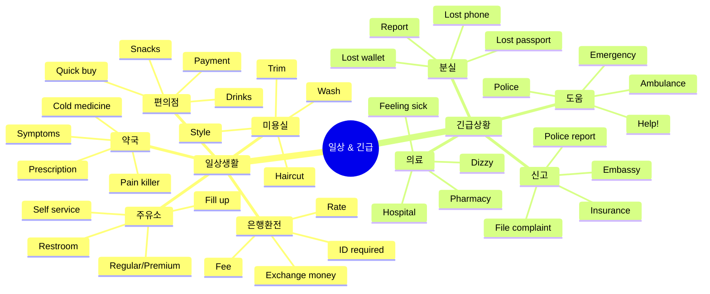

---

# 🏪 일상생활 표현

## 편의점

### 편의점 이용 플로우

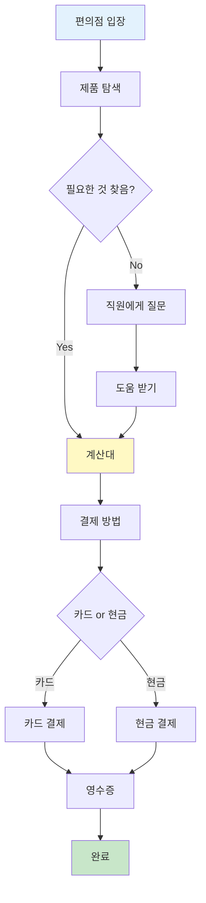

### 편의점 필수 표현 맵

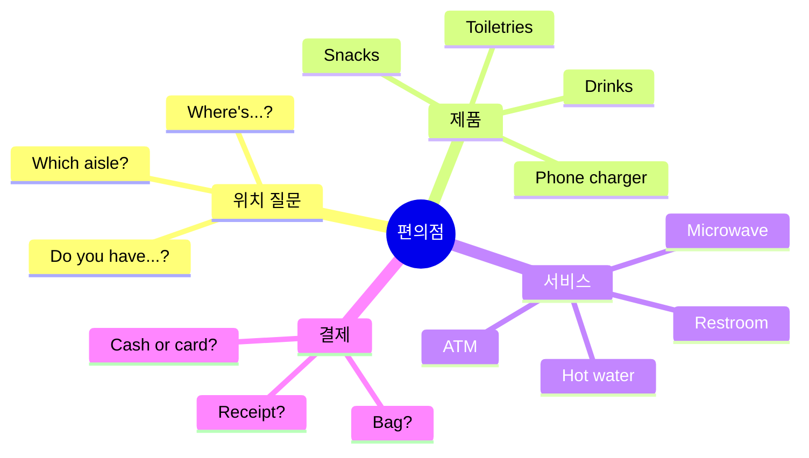

---

## 1️⃣ Do you have...? (편의점에서)

### 📖 편의점 자주 찾는 물품

| 물품 | 영어 | 발음 | 위치 |
|------|------|------|------|
| **충전기** | Phone charger | 폰 차저 | By batteries |
| **물** | Water | 워러 | Fridge section |
| **스낵** | Snacks | 스낵스 | Aisle 2 |
| **음료** | Drinks | 드링크스 | Back wall |
| **화장지** | Toilet paper | 토일렛 페이퍼 | Aisle 3 |
| **약** | Medicine | 메디슨 | Near counter |

### 💬 실전 대화: 빠른 구매

```
시나리오 A: 간단한 구매

손님: "Hey!"
직원: "What's up! Find everything?"
손님: "Yeah, just this."
직원: "Cool. That's $3.50."
손님: "Can I pay with card?"
직원: "For sure! Tap or insert?"
손님: "Tap."
직원: "Perfect. Receipt?"
손님: "Nah, I'm good."
직원: "Alright! Have a good one!"
손님: "Oh wait! Do you have phone chargers?"
직원: "Yeah, over there by the batteries."
손님: "Sweet, lemme grab one."
(돌아와서)
손님: "This too."
직원: "Nice. $15.50 total now."
손님: "Here you go."
직원: "Thanks! Anything else?"
손님: "Nope, that's it. Thanks!"
직원: "You got it!"

한국어:
손님: 안녕하세요!
직원: 안녕하세요! 다 찾으셨어요?
손님: 네, 이것만요.
직원: 좋아요. 3.50달러예요.
손님: 카드로 결제할 수 있나요?
직원: 물론이죠! 탭하시겠어요 넣으시겠어요?
손님: 탭할게요.
직원: 완벽해요. 영수증 받으시겠어요?
손님: 아니요, 괜찮아요.
직원: 알겠습니다! 좋은 하루 보내세요!
손님: 아 잠깐! 충전기 있나요?
직원: 네, 저기 배터리 옆에 있어요.
손님: 좋아요, 하나 가져올게요.
(돌아와서)
손님: 이것도요.
직원: 좋아요. 총 15.50달러예요.
손님: 여기요.
직원: 감사합니다! 더 필요하신 거 있나요?
손님: 아니요, 이게 다예요. 고마워요!
직원: 천만에요!
```

### 📊 편의점 표현 레벨표

| 상황 | 초급 🌱 | 중급 🌿 | 현대 💬 |
|------|---------|---------|---------|
| **입장 인사** | "Hello." | "Hi there!" | "Hey! / What's up!" |
| **물건 찾기** | "Where water?" | "Where's the water?" | "Got any water?" |
| **결제** | "Pay please." | "Can I pay?" | "Cash or card?" |
| **감사** | "Thank you." | "Thanks!" | "Thanks! / Appreciate it!" |
| **퇴장** | "Goodbye." | "Have a good day!" | "Have a good one! / Later!" |

---

## 2️⃣ ATM / Restroom (편의점 시설)

### 💬 실전 표현

```
ATM 찾기:
✅ "Hey, is there an ATM around here?"
   (헤이, 이즈 데얼 언 에이티엠 어라운드 히얼?)
   → ATM 근처에 있나요?

직원: "Yeah, there's one in the back."
      (예, 데얼즈 원 인 더 백)
      → 네, 뒤쪽에 있어요.

손님: "Oh, in here? Nice!"
      → 오, 여기 안에요? 좋아요!

직원: "Yep! $3 fee though."
      → 네! 근데 수수료 3달러예요.

손님: "That's fine."
      → 괜찮아요.

화장실:
✅ "Where's the bathroom?"
   (웨얼즈 더 배스룸?)
   → 화장실 어디예요?

✅ "Restroom?"
   (레스트룸?)
   → 화장실요?

직원: "Around the side. Key's on the counter."
      → 옆으로 돌아가세요. 열쇠는 카운터에 있어요.

손님: "Oh, I need a key?"
      → 아, 열쇠가 필요해요?

직원: "Yeah, just bring it back after."
      → 네, 쓰고 나서 돌려주세요.
```

---

## 약국

### 약국 이용 전체 프로세스

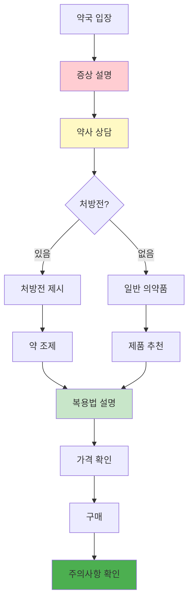

### 증상별 약 매트릭스

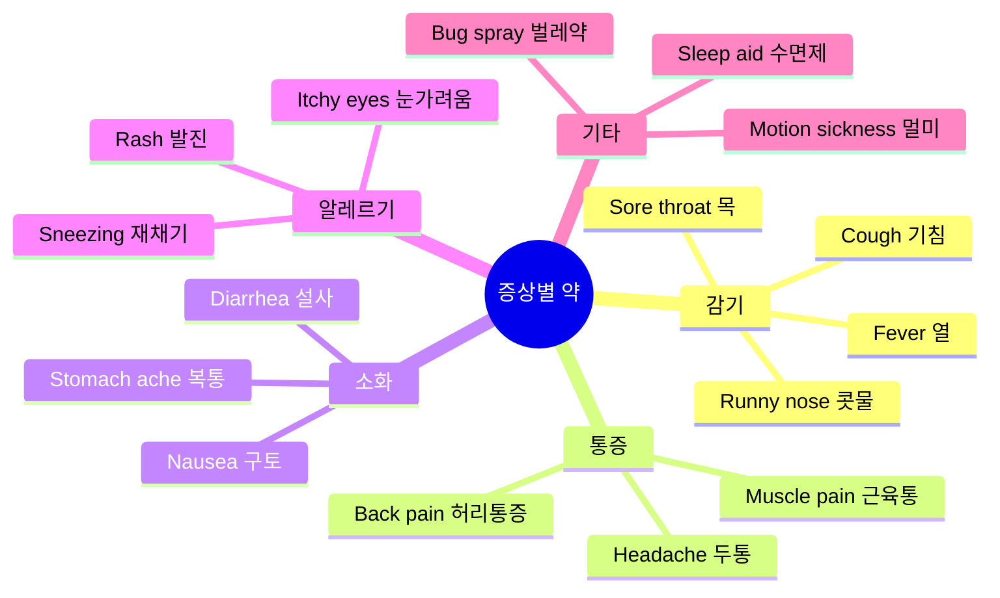

---

## 3️⃣ I need something for... (~을 위한 약이 필요해요)

### 📖 증상 표현법

| 증상 | 영어 | 발음 | 추천 약 |
|------|------|------|---------|
| **감기** | Cold | 콜드 | Cold medicine |
| **두통** | Headache | 헤데이크 | Ibuprofen, Tylenol |
| **복통** | Stomach ache | 스터머케이크 | Antacid |
| **설사** | Diarrhea | 다이어리어 | Anti-diarrheal |
| **알레르기** | Allergy | 알러지 | Antihistamine |
| **멀미** | Motion sickness | 모션 씨크니스 | Dramamine |

### 💬 실전 대화: 감기약 구매

```
완벽한 약국 대화:

손님: "Hey, I need something for a cold."
약사: "Sure! What are your symptoms?"
손님: "Runny nose, sore throat, the works."
약사: "Sounds rough! Fever?"
손님: "Maybe a little? I feel warm."
약사: "Got it. Try this - it covers everything."
손님: "Is it drowsy? I got stuff to do."
약사: "We have non-drowsy too. Want that?"
손님: "Yeah, that'd be better."
약사: "Here you go. Take 2 every 6 hours."
손님: "Can I take it with food?"
약사: "Yep! Actually, better with food."
손님: "Cool. Anything else help?"
약사: "Hot tea, rest, lots of fluids."
손님: "I'll grab some tea too then."
약사: "Smart! Aisle 5."
손님: "Thanks! How much for the meds?"
약사: "$12.99. Feel better!"
손님: "Thanks! I really appreciate the help."
약사: "No prob! Come back if it doesn't get better."

한국어:
손님: 안녕하세요, 감기약이 필요해요.
약사: 네! 증상이 어떻게 되세요?
손님: 콧물, 목 아픔, 다 있어요.
약사: 힘드시겠네요! 열은요?
손님: 약간요? 좀 덥게 느껴져요.
약사: 알겠습니다. 이거 드셔보세요 - 다 커버돼요.
손님: 졸려요? 할 일이 있어서요.
약사: 졸리지 않은 것도 있어요. 그걸로 드릴까요?
손님: 네, 그게 더 좋겠어요.
약사: 여기 있어요. 6시간마다 2알씩 드세요.
손님: 음식이랑 같이 먹어도 되나요?
약사: 네! 사실 음식이랑 같이 먹는 게 더 좋아요.
손님: 좋아요. 다른 도움 되는 거 있나요?
약사: 뜨거운 차, 휴식, 물 많이 마시기요.
손님: 그럼 차도 사야겠네요.
약사: 현명하시네요! 5번 통로에 있어요.
손님: 고마워요! 약은 얼마예요?
약사: 12.99달러예요. 빨리 나으세요!
손님: 감사합니다! 정말 도움이 됐어요.
약사: 천만에요! 안 나으시면 다시 오세요.
```

### 📊 약 복용 관련 표현

| 영어 | 한국어 | 예문 |
|------|--------|------|
| **Take 2 pills** | 2알 복용 | Take 2 every 6 hours |
| **With food** | 음식과 함께 | Better with food |
| **Before bed** | 자기 전 | Take before bed |
| **On empty stomach** | 공복에 | Take on empty stomach |
| **Don't mix with alcohol** | 술과 섞지 말것 | Important! |
| **Finish all** | 다 먹기 | Finish all pills |
| **Side effects** | 부작용 | May cause drowsiness |

---

## 4️⃣ Prescription (처방전)

### 💬 처방전 관련 표현

```
처방전 제시:
손님: "Hey, I have a prescription from the clinic."
약사: "Sure! Let me see."
손님: "Here you go."
약사: "Okay, antibiotics. Any allergies?"
손님: "Nope, none that I know of."
약사: "Good. This'll take about 15 minutes."
손님: "Can I wait?"
약사: "Yeah! Or I can text you when it's ready."
손님: "Text would be great. My number's 555-1234."
약사: "Got it!"

(돌아와서)
손님: "Hey, got your text!"
약사: "Perfect timing. Here's your prescription."
손님: "How do I take this?"
약사: "One pill twice a day. Finish all of them."
손님: "Even if I feel better?"
약사: "Yep! Super important. Don't skip."
손님: "Got it. Any side effects?"
약사: "Maybe upset stomach. Take with food."
손님: "Will do. Thanks for explaining!"
약사: "Of course! Feel better soon!"

한국어:
손님: 안녕하세요, 병원에서 처방전 받았어요.
약사: 네! 볼게요.
손님: 여기요.
약사: 알겠습니다, 항생제네요. 알레르기 있으세요?
손님: 아니요, 아는 건 없어요.
약사: 좋아요. 15분 정도 걸려요.
손님: 기다려도 될까요?
약사: 네! 아니면 준비되면 문자 드릴 수도 있어요.
손님: 문자가 좋겠어요. 제 번호는 555-1234예요.
약사: 알겠습니다!

(돌아와서)
손님: 안녕하세요, 문자 받았어요!
약사: 완벽한 타이밍이네요. 여기 처방약이에요.
손님: 어떻게 먹나요?
약사: 하루에 두 번, 한 알씩이요. 다 드세요.
손님: 나아져도요?
약사: 네! 아주 중요해요. 빼먹지 마세요.
손님: 알겠어요. 부작용은요?
약사: 속이 안 좋을 수 있어요. 음식이랑 드세요.
손님: 그럴게요. 설명해주셔서 감사해요!
약사: 물론이죠! 빨리 나으세요!
```

---

## 주유소

### 주유소 이용 플로우

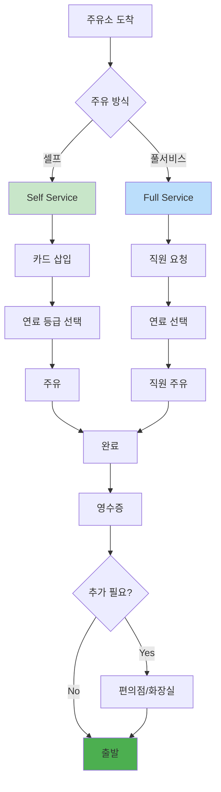

### 주유소 표현 맵

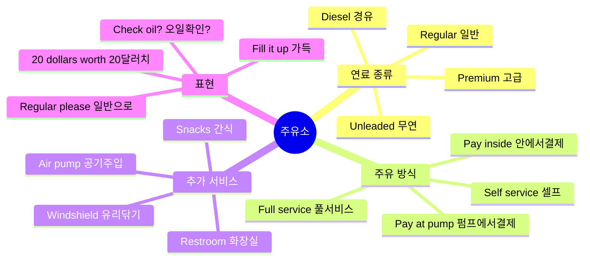

---

## 5️⃣ Fill it up, please (가득 채워주세요)

### 📖 주유 관련 표현

| 표현 | 의미 | 상황 |
|------|------|------|
| **Fill it up** | 가득 채우기 | 풀 탱크 |
| **$20 worth** | 20달러어치 | 일부만 |
| **Regular** | 일반 휘발유 | 가장 흔함 |
| **Premium** | 고급 휘발유 | 고급 차량 |
| **Diesel** | 경유 | 디젤 차량 |

### 💬 실전 대화: 풀 서비스

```
풀 서비스 주유:

손님: "Fill it up, please!"
직원: "Regular or premium?"
손님: "Regular's fine."
직원: "You got it. Pop the tank?"
손님: "Oh right! (열기) There you go."
직원: "Thanks! Want me to check the oil?"
손님: "Nah, I'm good."
직원: "How about windshield?"
손님: "Sure, it's kinda dirty."
직원: "I got you. (청소)"
손님: "Thanks! This is great service."
직원: "We try! Where you headed?"
손님: "Road trip up the coast."
직원: "Nice! Long drive?"
손님: "About 6 hours."
직원: "Wow! Make sure to take breaks."
손님: "Will do! How much?"
직원: "That's $45.60."
손님: "Here's $50. Keep the change!"
직원: "Thanks! Drive safe!"

한국어:
손님: 가득 채워주세요!
직원: 일반이요 고급이요?
손님: 일반으로요.
직원: 알겠습니다. 주유구 열어주시겠어요?
손님: 아 맞다! (열기) 여기요.
직원: 감사합니다! 오일 확인해드릴까요?
손님: 아니요, 괜찮아요.
직원: 유리는요?
손님: 네, 좀 더러워요.
직원: 제가 할게요. (청소)
손님: 고마워요! 서비스 정말 좋네요.
직원: 노력하고 있어요! 어디 가세요?
손님: 해안 드라이브 여행이요.
직원: 좋네요! 긴 여행이에요?
손님: 6시간쯤요.
직원: 우와! 꼭 쉬면서 가세요.
손님: 그럴게요! 얼마예요?
직원: 45.60달러예요.
손님: 50달러요. 잔돈은 가지세요!
직원: 감사합니다! 안전 운전하세요!
```

### 📊 주유 방식 비교표

| 항목 | 셀프 서비스 🚗 | 풀 서비스 👨‍🔧 |
|------|---------------|---------------|
| **가격** | 저렴 | 조금 비쌈 |
| **편의성** | 직접 해야 함 | 편함 |
| **속도** | 빠름 | 약간 느림 |
| **추가 서비스** | 없음 | 유리 닦기, 오일 체크 |
| **팁** | 불필요 | 선택 ($2-5) |
| **지역** | 대부분 지역 | 일부 주 (NJ, OR) |

---

## 미용실

### 미용실 이용 프로세스

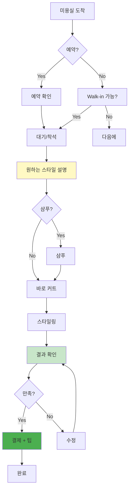

---

## 6️⃣ Do you have walk-ins? (예약 없이 가능한가요?)

### 📖 미용실 표현 맵

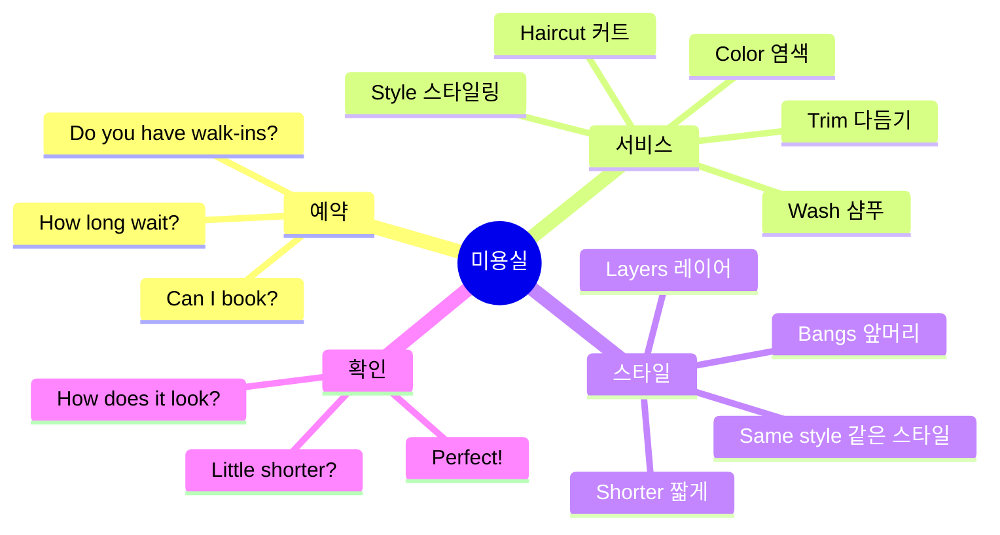

### 💬 실전 대화: 간단한 커트

```
완벽한 미용실 대화:

손님: "Hey! Do you have walk-ins?"
미용사: "Yeah! Actually perfect timing."
손님: "Sweet! I need a haircut."
미용사: "Cool, have a seat! What are we doing?"
손님: "Just a trim. Like an inch?"
미용사: "You got it. Any style in mind?"
손님: "Same style, just shorter."
미용사: "Easy! Wash first?"
손님: "Yeah, please."

(샴푸 후)
미용사: "Pressure okay?"
손님: "Perfect. This is so relaxing."
미용사: "Ha! People always fall asleep!"
손님: "I could totally nap right now."

(커트 중)
미용사: "So what brings you to town?"
손님: "Vacation! Here for a week."
미용사: "Nice! Having fun so far?"
손님: "Yeah, loving it!"
미용사: "Alright, what do you think?"
손님: "It's perfect! Exactly what I wanted."
미용사: "Yay! That'll be $35. Tips appreciated!"
손님: "Here's $45. Keep it!"
미용사: "Aww, thanks so much!"

한국어:
손님: 안녕하세요! 예약 없이 가능한가요?
미용사: 네! 사실 타이밍 완벽해요.
손님: 좋아요! 머리 자르고 싶어요.
미용사: 좋아요, 앉으세요! 어떻게 해드릴까요?
손님: 다듬기만요. 한 2-3cm 정도?
미용사: 알겠습니다. 스타일은요?
손님: 같은 스타일로, 그냥 짧게만요.
미용사: 쉬워요! 먼저 감겨드릴까요?
손님: 네, 부탁드려요.

(샴푸 후)
미용사: 압력 괜찮아요?
손님: 완벽해요. 진짜 편안하네요.
미용사: 하! 사람들 항상 잠들어요!
손님: 저도 지금 잘 수 있을 것 같아요.

(커트 중)
미용사: 여기는 어쩌다 오셨어요?
손님: 휴가요! 일주일 있어요.
미용사: 좋네요! 재미있게 보내고 계세요?
손님: 네, 너무 좋아요!
미용사: 자, 어때요?
손님: 완벽해요! 딱 원하던 거예요.
미용사: 야호! 35달러예요. 팁 주시면 감사하고요!
손님: 여기 45달러요. 가지세요!
미용사: 아, 정말 감사합니다!
```

### 📊 미용실 서비스 & 가격표

| 서비스 | 영어 | 평균 가격 | 소요 시간 |
|--------|------|-----------|----------|
| **컷** | Haircut | $35-60 | 30-45분 |
| **트림** | Trim | $25-40 | 20-30분 |
| **샴푸+컷** | Wash + Cut | $45-70 | 45-60분 |
| **염색** | Color | $80-150 | 2-3시간 |
| **하이라이트** | Highlights | $100-200 | 2-3시간 |
| **블로우** | Blow dry | $30-50 | 30분 |

### 팁 가이드

```
미용실 팁:
• 기본: 15-20%
• 좋은 서비스: 20-25%
• 훌륭한 서비스: 25-30%
• 계산: 가격 x 0.2 = 20% 팁
```

---

## 은행/환전

### 환전 프로세스

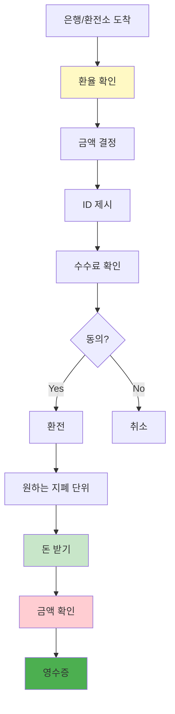

---

## 7️⃣ Exchange money (환전하기)

### 📖 환전 필수 표현

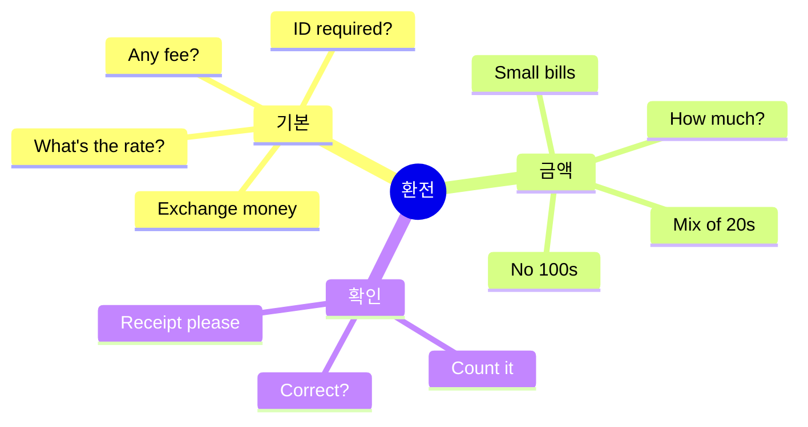

### 💬 실전 대화: 환전

```
환전 대화:

손님: "Hey, I need to exchange some money."
직원: "Sure! What currency?"
손님: "Korean won to dollars."
직원: "How much?"
손님: "Like 500,000 won?"
직원: "Okay, today's rate is about 1,350 to 1."
손님: "So that's around... $370?"
직원: "Exactly! $370.37 to be precise."
손님: "Is there a fee?"
직원: "$5 flat fee."
손님: "That's not bad. Let's do it."
직원: "ID please?"
손님: "Here's my passport."
직원: "Perfect. How do you want it?"
손님: "Mix of 20s and some smaller bills?"
직원: "Good idea. Easier to use."
손님: "Yeah, I hate breaking 100s."
직원: "Same! Here you go. Count it?"
손님: "(세기) All good! Thanks!"
직원: "You're welcome! Safe travels!"

한국어:
손님: 안녕하세요, 환전하고 싶어요.
직원: 네! 무슨 화폐요?
손님: 한국 원을 달러로요.
직원: 얼마나요?
손님: 50만원 정도요?
직원: 네, 오늘 환율은 1350대 1이에요.
손님: 그럼 약... 370달러?
직원: 정확히요! 370.37달러예요.
손님: 수수료 있나요?
직원: 5달러 정액이에요.
손님: 괜찮네요. 할게요.
직원: 신분증 주시겠어요?
손님: 여기 여권이요.
직원: 완벽해요. 어떻게 받으시겠어요?
손님: 20달러 섞어서 좀 작은 단위로도요?
직원: 좋은 생각이에요. 쓰기 편하죠.
손님: 네, 100달러 깨는 거 싫어해요.
직원: 저도요! 여기 있어요. 세어보시겠어요?
손님: (세기) 다 맞아요! 감사합니다!
직원: 천만에요! 안전한 여행 되세요!
```

### 📊 환율 & 수수료 비교표

| 장소 | 환율 | 수수료 | 편의성 | 추천도 |
|------|:----:|:------:|:------:|:------:|
| **은행** | 좋음 ⭐⭐⭐⭐ | 낮음 $3-5 | 보통 | ⭐⭐⭐⭐⭐ |
| **공항** | 나쁨 ⭐⭐ | 높음 $10-15 | 최고 | ⭐⭐ |
| **환전소** | 보통 ⭐⭐⭐ | 중간 $5-10 | 좋음 | ⭐⭐⭐ |
| **ATM** | 좋음 ⭐⭐⭐⭐ | 중간 $3-5 | 최고 | ⭐⭐⭐⭐ |
| **호텔** | 최악 ⭐ | 최고 $15+ | 편함 | ⭐ |

---

# 🚨 긴급상황 대응

## 긴급상황 전체 맵

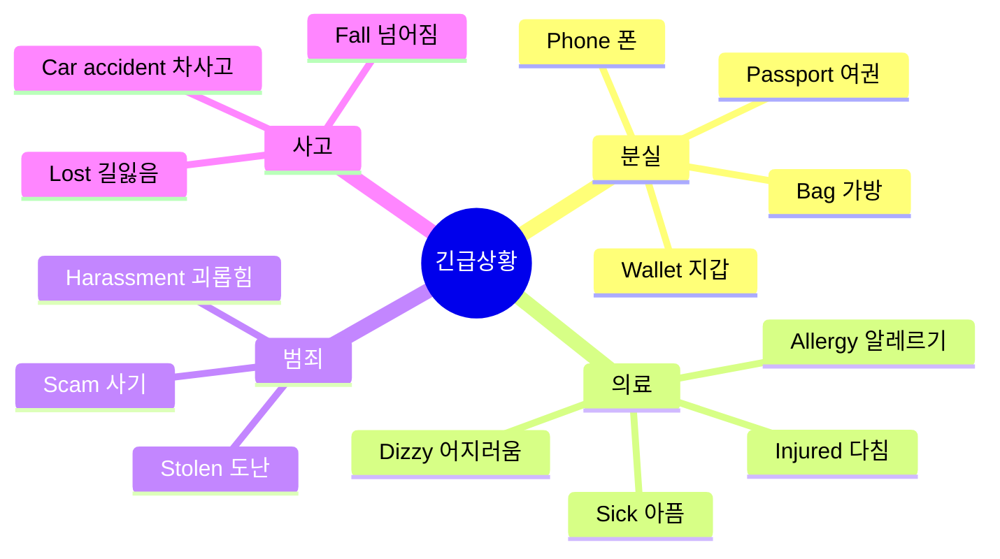

---

## 분실 신고

### 분실 대응 플로우

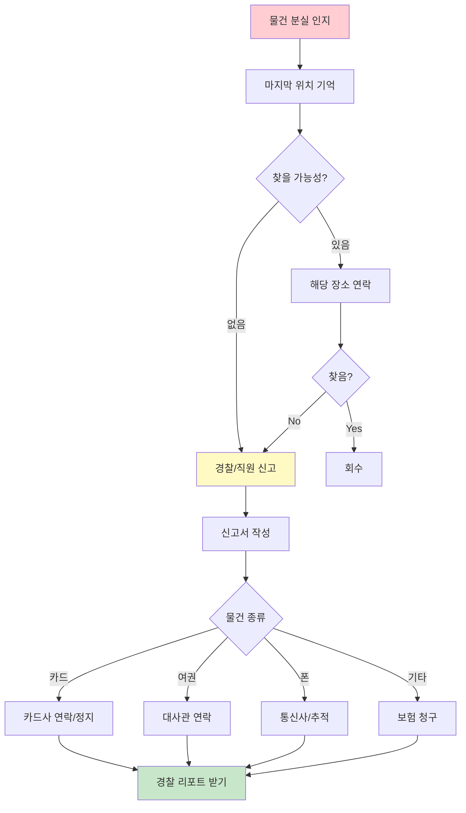

---

## 8️⃣ I lost my wallet (지갑을 잃어버렸어요)

### 📖 분실 신고 표현

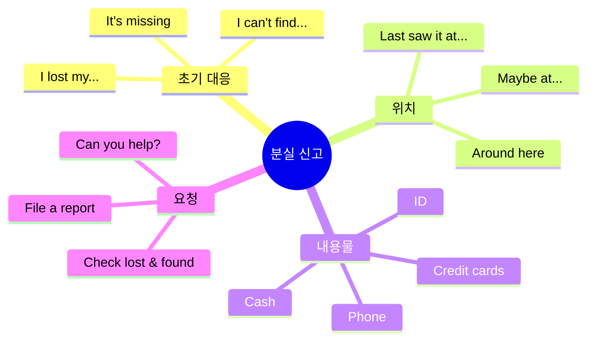

### 💬 실전 대화: 지갑 분실

```
분실 신고 대화:

손님: "Hey, I need help. I lost my wallet."
직원: "Oh no! When did you last have it?"
손님: "Like an hour ago at the market."
직원: "Did you check with the market office?"
손님: "Not yet. I panicked and came here."
직원: "That's okay. Let's file a report first."
손님: "What do I need?"
직원: "Just your info. Name, what was in it..."
손님: "My credit cards are in there!"
직원: "You should call to cancel those ASAP."
손님: "Right, right. Can I use your phone?"
직원: "Sure, or use the computer over there."
손님: "Thanks. (취소 후) Okay, done."
직원: "Good. Any cash in the wallet?"
손님: "Like $200."
직원: "Ugh, I'm sorry."
손님: "It's okay. Lesson learned."
직원: "Here's your report number. Call if it turns up."
손님: "Thanks for the help. I appreciate it."
직원: "Hope you find it! Good luck!"

한국어:
손님: 안녕하세요, 도움이 필요해요. 지갑을 잃어버렸어요.
직원: 어머! 마지막으로 언제 가지고 계셨어요?
손님: 한 시간 전에 시장에서요.
직원: 시장 사무실에는 확인해보셨어요?
손님: 아직이요. 당황해서 여기 왔어요.
직원: 괜찮아요. 먼저 신고서를 작성하죠.
손님: 뭐가 필요한가요?
직원: 정보만요. 이름, 안에 뭐가 있었는지...
손님: 신용카드가 들어있어요!
직원: 빨리 전화해서 정지시키세요.
손님: 맞아요, 맞아. 전화 써도 될까요?
직원: 네, 아니면 저기 컴퓨터 쓰세요.
손님: 감사합니다. (취소 후) 됐어요.
직원: 좋아요. 현금은 얼마나 있었어요?
손님: 200달러 정도요.
직원: 아, 안됐네요.
손님: 괜찮아요. 교훈을 얻었죠.
직원: 여기 신고 번호예요. 나타나면 전화하세요.
손님: 도와주셔서 감사합니다.
직원: 찾으시길 바랄게요! 행운을 빌어요!
```

### 📊 분실물 대응 체크리스트

| 분실물 | 즉시 할 일 | 연락처 | 필요 서류 |
|--------|-----------|--------|----------|
| **지갑** | 카드 정지 | 카드사 | 경찰 리포트 |
| **여권** | 대사관 연락 | 한국대사관 | 신분증, 사진 |
| **폰** | 분실 모드 | 통신사 | 경찰 리포트 |
| **가방** | 경찰 신고 | 경찰서 | 내용물 목록 |
| **카메라** | 보험 청구 | 보험사 | 영수증, 리포트 |

---

## 의료 긴급

### 의료 긴급 대응 플로우

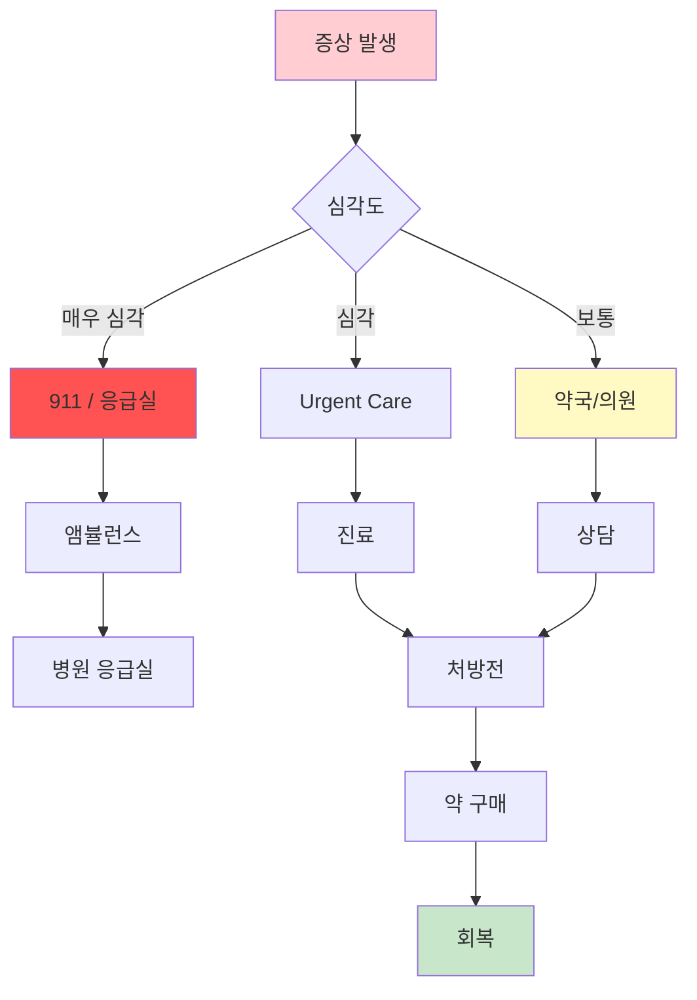

---

## 9️⃣ I don't feel good (몸이 안 좋아요)

### 📖 증상 표현

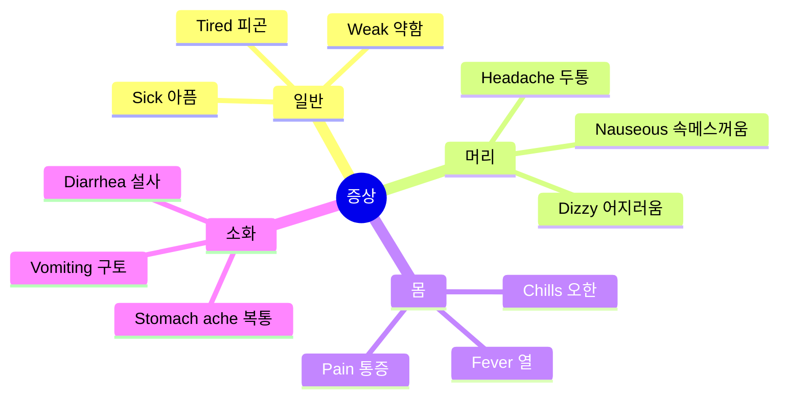

### 💬 실전 대화: 의료 긴급

```
의료 긴급 대화:

환자: "I don't feel good. Really dizzy."
의료진: "Sit down, sit down. When did it start?"
환자: "Like 20 minutes ago. Out of nowhere."
의료진: "Did you eat today?"
환자: "Um... I skipped breakfast?"
의료진: "That might be it. Any other symptoms?"
환자: "Kinda nauseous too."
의료진: "Okay, we're gonna check your blood sugar."
환자: "Is it serious?"
의료진: "Prob'ly just low blood sugar. Common thing."
환자: "Phew. I got scared."
의료진: "Understandable! Here, drink this juice."
환자: "(마시고) Okay, feeling a little better."
의료진: "Good! Your color's coming back too."
환자: "I should've eaten, huh."
의료진: "Yeah, don't skip meals! Especially traveling."
환자: "Lesson learned. Thanks for helping."
의료진: "No prob! Rest here for a bit."
환자: "Can I go in like 10 minutes?"
의료진: "Yeah, just take it easy. And eat something!"

한국어:
환자: 몸이 안 좋아요. 정말 어지러워요.
의료진: 앉으세요, 앉으세요. 언제 시작됐어요?
환자: 20분 전쯤이요. 갑자기요.
의료진: 오늘 식사하셨어요?
환자: 음... 아침을 안 먹었어요?
의료진: 그게 원인일 수 있어요. 다른 증상은요?
환자: 좀 메스꺼워요.
의료진: 알겠어요, 혈당 체크할게요.
환자: 심각한가요?
의료진: 아마 낮은 혈당일 거예요. 흔한 일이에요.
환자: 휴. 무서웠어요.
의료진: 이해해요! 여기, 이 주스 마셔요.
환자: (마시고) 네, 좀 나아진 것 같아요.
의료진: 좋아요! 안색도 돌아오네요.
환자: 밥을 먹었어야 했나봐요.
의료진: 네, 식사 거르지 마세요! 특히 여행 중엔요.
환자: 배웠어요. 도와주셔서 감사합니다.
의료진: 천만에요! 여기서 좀 쉬세요.
환자: 10분 후에 가도 될까요?
의료진: 네, 천천히 하시고요. 그리고 뭐 좀 드세요!
```

### 📊 응급 상황 판단 가이드

| 증상 | 심각도 | 대응 | 연락 |
|------|:-----:|------|------|
| **의식 잃음** | 🚨 매우 심각 | 즉시 911 | 응급실 |
| **가슴 통증** | 🚨 매우 심각 | 즉시 911 | 응급실 |
| **호흡 곤란** | 🚨 매우 심각 | 즉시 911 | 응급실 |
| **심한 출혈** | 🚨 매우 심각 | 즉시 911 | 응급실 |
| **고열 (40°C+)** | ⚠️ 심각 | Urgent Care | 병원 |
| **심한 복통** | ⚠️ 심각 | Urgent Care | 병원 |
| **어지러움** | ⚡ 보통 | 휴식/약국 | 약사 |
| **감기** | ⚡ 보통 | 약국 | 약사 |
| **두통** | ⚡ 보통 | 약국 | 약사 |

---

## 핵심 표현 총정리

### 일상생활 TOP 20

| 순위 | 표현 | 카테고리 | 빈도 |
|:---:|------|----------|:----:|
| 1 | Do you have...? | 편의점/약국 | ⭐⭐⭐⭐⭐ |
| 2 | Where's the bathroom? | 어디서나 | ⭐⭐⭐⭐⭐ |
| 3 | Cash or card? | 결제 | ⭐⭐⭐⭐⭐ |
| 4 | I need something for... | 약국 | ⭐⭐⭐⭐ |
| 5 | Fill it up | 주유소 | ⭐⭐⭐⭐ |
| 6 | Regular or premium? | 주유소 | ⭐⭐⭐⭐ |
| 7 | Just a trim | 미용실 | ⭐⭐⭐⭐ |
| 8 | Exchange money | 은행 | ⭐⭐⭐⭐ |
| 9 | What's the rate? | 환전 | ⭐⭐⭐⭐ |
| 10 | Receipt please | 어디서나 | ⭐⭐⭐⭐ |

### 긴급상황 TOP 10

| 순위 | 표현 | 상황 | 중요도 |
|:---:|------|------|:-----:|
| 1 | **Help!** | 모든 긴급 | 🚨🚨🚨 |
| 2 | **Call 911!** | 의료/범죄 | 🚨🚨🚨 |
| 3 | **I lost my...** | 분실 | 🚨🚨 |
| 4 | **I don't feel good** | 의료 | 🚨🚨 |
| 5 | **Where's the hospital?** | 의료 | 🚨🚨 |
| 6 | **I need a doctor** | 의료 | 🚨🚨 |
| 7 | **Someone stole...** | 범죄 | 🚨🚨 |
| 8 | **I'm lost** | 길잃음 | 🚨 |
| 9 | **Can you help me?** | 일반 | 🚨 |
| 10 | **Where's the police?** | 범죄 | 🚨🚨 |

---

## 학습 체크리스트

### 일상생활
- [ ] 편의점 기본 대화 숙지
- [ ] 약국 증상 설명 표현 암기
- [ ] 주유소 주문 표현 연습
- [ ] 미용실 스타일 설명법 이해
- [ ] 환전 프로세스 숙지

### 긴급상황
- [ ] Help! 외치기 연습 😅
- [ ] 911 사용법 이해
- [ ] 분실 신고 절차 숙지
- [ ] 의료 증상 표현 암기
- [ ] 긴급 연락처 저장

---

*이 가이드로 모든 상황에 완벽 대비하세요!*

---

## 🎯 전설의 10턴 대화 마스터

## 🏪 일상생활 시나리오

### 일상 상황 1: 편의점 - 빠른 쇼핑

```
턴 1 - 손님: "Hey! Where's the water?"
턴 2 - 직원: "Fridge section, back wall!"
턴 3 - 손님: "Thanks! Do you have phone chargers?"
턴 4 - 직원: "Yep! By the batteries, aisle 3."
턴 5 - 손님: "Perfect! (물건 들고) Just these."
턴 6 - 직원: "Cool! That's $18.50. Cash or card?"
턴 7 - 손님: "Card. Can I tap?"
턴 8 - 직원: "For sure! (결제) Receipt?"
턴 9 - 손님: "Nah, I'm good. Thanks!"
턴 10 - 직원: "Have a good one!"

🇰🇷 한국어 번역:
턴 1 - 손님: 안녕하세요! 물이 어디 있나요?
턴 2 - 직원: 냉장고 섹션, 뒤쪽 벽이요!
턴 3 - 손님: 감사합니다! 충전기 있나요?
턴 4 - 직원: 네! 배터리 옆에, 3번 통로요.
턴 5 - 손님: 완벽해요! (물건 들고) 이것만요.
턴 6 - 직원: 좋아요! 18.50달러예요. 현금이요 카드요?
턴 7 - 손님: 카드요. 탭할 수 있나요?
턴 8 - 직원: 물론이죠! (결제) 영수증 받으시겠어요?
턴 9 - 손님: 아니요, 괜찮아요. 감사합니다!
턴 10 - 직원: 좋은 하루 보내세요!

📝 핵심 표현:
• Where's...? (어디 있나요?)
• Back wall (뒤쪽 벽)
• Just these (이것만)
• Can I tap? (탭 가능?)
• I'm good (괜찮아요)
• Have a good one (좋은 하루)
```

### 일상 상황 2: 약국 - 감기약 구매

```
턴 1 - 손님: "Hey, I need something for a cold."
턴 2 - 약사: "Sure! What are your symptoms?"
턴 3 - 손님: "Runny nose, sore throat. Kinda tired."
턴 4 - 약사: "Any fever?"
턴 5 - 손님: "Maybe a little? I feel warm."
턴 6 - 약사: "Try this. It's non-drowsy, covers everything."
턴 7 - 손님: "Perfect! How do I take it?"
턴 8 - 약사: "Two pills every 6 hours. With food's better."
턴 9 - 손님: "Got it. How much?"
턴 10 - 약사: "$12.99. Feel better soon!"

🇰🇷 한국어 번역:
턴 1 - 손님: 안녕하세요, 감기약이 필요해요.
턴 2 - 약사: 네! 증상이 어떻게 되세요?
턴 3 - 손님: 콧물, 목 아픔. 좀 피곤해요.
턴 4 - 약사: 열은요?
턴 5 - 손님: 약간요? 좀 덥게 느껴져요.
턴 6 - 약사: 이거 드셔보세요. 졸리지 않고, 다 커버해요.
턴 7 - 손님: 완벽해요! 어떻게 먹나요?
턴 8 - 약사: 6시간마다 2알씩이요. 음식이랑 먹는 게 더 좋아요.
턴 9 - 손님: 알겠습니다. 얼마예요?
턴 10 - 약사: 12.99달러예요. 빨리 나으세요!

📝 핵심 표현:
• I need something for... (~을 위한 약)
• What are your symptoms? (증상이?)
• Runny nose (콧물)
• Sore throat (목 아픔)
• Non-drowsy (졸리지 않음)
• Feel better soon (빨리 나으세요)
```

### 일상 상황 3: 미용실 - 간단한 커트

```
턴 1 - 손님: "Hey! Do you have walk-ins?"
턴 2 - 미용사: "Yeah! Perfect timing. Have a seat!"
턴 3 - 손님: "Awesome! Just a trim, please. Like an inch?"
턴 4 - 미용사: "You got it! Same style?"
턴 5 - 손님: "Yep! Just shorter."
턴 6 - 미용사: "Easy! Wash first?"
턴 7 - 손님: "Yeah, please."
턴 8 - (커트 후) 미용사: "How's this?"
턴 9 - 손님: "Perfect! Exactly what I wanted. How much?"
턴 10 - 미용사: "$35. Tips appreciated!"

🇰🇷 한국어 번역:
턴 1 - 손님: 안녕하세요! 예약 없이 가능한가요?
턴 2 - 미용사: 네! 타이밍 완벽해요. 앉으세요!
턴 3 - 손님: 좋아요! 다듬기만요. 한 2-3cm 정도?
턴 4 - 미용사: 알겠습니다! 같은 스타일로요?
턴 5 - 손님: 네! 그냥 짧게만요.
턴 6 - 미용사: 쉬워요! 먼저 감겨드릴까요?
턴 7 - 손님: 네, 부탁드려요.
턴 8 - (커트 후) 미용사: 어때요?
턴 9 - 손님: 완벽해요! 딱 원하던 거예요. 얼마예요?
턴 10 - 미용사: 35달러예요. 팁 주시면 감사하고요!

📝 핵심 표현:
• Do you have walk-ins? (예약 없이 가능?)
• Just a trim (다듬기만)
• Same style (같은 스타일)
• How's this? (어때요?)
• Tips appreciated (팁 감사)
```

---

## 🚨 긴급상황 시나리오

### 긴급 상황 1: 지갑 분실

```
턴 1 - 손님: "Hey, I need help. I lost my wallet."
턴 2 - 직원: "Oh no! When did you last have it?"
턴 3 - 손님: "Like an hour ago at the market."
턴 4 - 직원: "Did you check with the market office?"
턴 5 - 손님: "Not yet. I panicked and came here."
턴 6 - 직원: "That's okay. Let's file a report first."
턴 7 - 손님: "What do I need?"
턴 8 - 직원: "Your info and what was in it. Credit cards?"
턴 9 - 손님: "Yeah! I gotta cancel those ASAP."
턴 10 - 직원: "For sure. Use my phone. Here's the report number."

🇰🇷 한국어 번역:
턴 1 - 손님: 안녕하세요, 도움이 필요해요. 지갑을 잃어버렸어요.
턴 2 - 직원: 어머! 마지막으로 언제 가지고 계셨어요?
턴 3 - 손님: 한 시간 전에 시장에서요.
턴 4 - 직원: 시장 사무실에는 확인해보셨어요?
턴 5 - 손님: 아직이요. 당황해서 여기 왔어요.
턴 6 - 직원: 괜찮아요. 먼저 신고서를 작성하죠.
턴 7 - 손님: 뭐가 필요한가요?
턴 8 - 직원: 정보랑 안에 뭐가 있었는지요. 신용카드요?
턴 9 - 손님: 네! 빨리 정지시켜야 해요.
턴 10 - 직원: 당연하죠. 제 전화 쓰세요. 여기 신고 번호예요.

📝 핵심 표현:
• I lost my wallet (지갑 잃어버렸어요)
• Last have it (마지막으로 가지고 있었던)
• I panicked (당황했어요)
• File a report (신고서 작성)
• Cancel those ASAP (빨리 정지)
```

### 긴급 상황 2: 몸이 안 좋음

```
턴 1 - 환자: "Excuse me, I don't feel good. Really dizzy."
턴 2 - 의료진: "Sit down, sit down! When did it start?"
턴 3 - 환자: "Like 20 minutes ago. Out of nowhere."
턴 4 - 의료진: "Did you eat today?"
턴 5 - 환자: "Um... I skipped breakfast?"
턴 6 - 의료진: "That might be it. Drink this juice."
턴 7 - 환자: "(마시고) Okay, feeling a little better."
턴 8 - 의료진: "Good! Your color's coming back."
턴 9 - 환자: "Thank you. I was so scared."
턴 10 - 의료진: "No prob! Don't skip meals, especially traveling!"

🇰🇷 한국어 번역:
턴 1 - 환자: 실례합니다, 몸이 안 좋아요. 정말 어지러워요.
턴 2 - 의료진: 앉으세요, 앉으세요! 언제 시작됐어요?
턴 3 - 환자: 20분 전쯤이요. 갑자기요.
턴 4 - 의료진: 오늘 식사하셨어요?
턴 5 - 환자: 음... 아침을 안 먹었어요?
턴 6 - 의료진: 그게 원인일 수 있어요. 이 주스 마셔요.
턴 7 - 환자: (마시고) 네, 좀 나아진 것 같아요.
턴 8 - 의료진: 좋아요! 안색이 돌아오네요.
턴 9 - 환자: 감사합니다. 너무 무서웠어요.
턴 10 - 의료진: 천만에요! 식사 거르지 마세요, 특히 여행 중엔!

📝 핵심 표현:
• I don't feel good (몸이 안 좋아요)
• Really dizzy (정말 어지러워요)
• Out of nowhere (갑자기)
• I skipped breakfast (아침 거름)
• Color's coming back (안색 돌아옴)
```

### 긴급 상황 3: 길을 잃음 + 도움 요청

```
턴 1 - 여행자: "Excuse me! I'm kinda lost. Can you help?"
턴 2 - 현지인: "Sure! Where you trying to go?"
턴 3 - 여행자: "Back to my hotel. Hilton on 5th Street?"
턴 4 - 현지인: "Oh, you're pretty far. Like 15 blocks."
턴 5 - 여행자: "Oh no! Should I take a taxi?"
턴 6 - 현지인: "Yeah, way easier. There's a taxi stand right there."
턴 7 - 여행자: "Thank you so much! You're a lifesaver!"
턴 8 - 현지인: "No worries! Just tell them '5th and Main.'"
턴 9 - 여행자: "5th and Main. Got it!"
턴 10 - 현지인: "Perfect! They'll know. Have a good one!"

🇰🇷 한국어 번역:
턴 1 - 여행자: 실례합니다! 길을 잃어버린 것 같아요. 도와주실 수 있나요?
턴 2 - 현지인: 물론이죠! 어디 가시려고요?
턴 3 - 여행자: 제 호텔로요. 5번가 힐튼이요?
턴 4 - 현지인: 오, 꽤 멀어요. 한 15블록이요.
턴 5 - 여행자: 아 안돼! 택시 타야 할까요?
턴 6 - 현지인: 네, 훨씬 쉬워요. 저기 택시 승강장 있어요.
턴 7 - 여행자: 정말 감사합니다! 생명의 은인이에요!
턴 8 - 현지인: 천만에요! 그냥 "5번가와 메인"이라고 말하세요.
턴 9 - 여행자: 5번가와 메인. 알겠어요!
턴 10 - 현지인: 완벽해요! 알 거예요. 좋은 하루!

📝 핵심 표현:
• I'm kinda lost (길을 잃었어요)
• Can you help? (도와주실 수 있나요?)
• You're pretty far (꽤 멀어요)
• Should I take a taxi? (택시 타야 할까요?)
• You're a lifesaver (생명의 은인)
```

---

## 📝 일상생활 & 긴급상황 마스터 테스트

### 테스트 1: 상황별 첫 마디 (10문제)

```
각 상황에서 첫 마디로 할 말을 쓰세요.

일상:
1. 편의점에서 물 위치 묻기:
   _________________________________

2. 약국에서 감기약 요청:
   _________________________________

3. 미용실에서 예약 없이 가능한지:
   _________________________________

긴급:
4. 지갑을 잃어버렸을 때:
   _________________________________

5. 몸이 안 좋을 때:
   _________________________________

6. 길을 잃었을 때:
   _________________________________

7. 핸드폰을 잃어버렸을 때:
   _________________________________

8. 응급 상황 (911):
   _________________________________

9. 물건을 도난당했을 때:
   _________________________________

10. 병원이 어디인지 물을 때:
    _________________________________
```

<details>
<summary>✅ 정답 확인 (모범 답안)</summary>

**일상:**
1. **"Hey! Where's the water?"**
2. **"Hey, I need something for a cold."**
3. **"Hey! Do you have walk-ins?"**

**긴급:**
4. **"Hey, I need help. I lost my wallet."**
5. **"Excuse me, I don't feel good. Really dizzy."**
6. **"Excuse me! I'm kinda lost. Can you help?"**
7. **"Help! I lost my phone!"**
8. **"Help! I need an ambulance!"** / **"Call 911!"**
9. **"Someone stole my bag! I need to report it."**
10. **"Where's the nearest hospital?"**

</details>

---

### 테스트 2: 긴급도 판단 (5문제)

```
다음 상황을 긴급도에 따라 분류하세요.
A: 매우 긴급 (즉시 대응)
B: 긴급 (빠른 대응)
C: 보통 (일반 대응)

1. 가슴 통증 + 호흡 곤란 - ___
2. 지갑 분실 - ___
3. 감기 증상 - ___
4. 의식 잃음 - ___
5. 약간 어지러움 - ___
```

<details>
<summary>✅ 정답 확인</summary>

1. **A** - 매우 긴급 (즉시 911)
2. **B** - 긴급 (경찰 신고, 카드 정지)
3. **C** - 보통 (약국 방문)
4. **A** - 매우 긴급 (즉시 911)
5. **B/C** - 보통~긴급 (휴식 or 병원)

**응급 판단 기준:**
- 🚨 A: 생명 위협 → 즉시 911
- ⚠️ B: 빠른 대응 필요 → 경찰/병원
- 💊 C: 일반 대응 → 약국/휴식

</details>

---

### 테스트 3: 대화 순서 맞추기 - 지갑 분실

```
다음 대화를 올바른 순서로 배열하세요.

A. "What do I need?"
B. "Hey, I need help. I lost my wallet."
C. "Oh no! When did you last have it?"
D. "That's okay. Let's file a report first."
E. "Your info and what was in it."
F. "Like an hour ago at the market."
G. "Not yet. I panicked and came here."
H. "Did you check with the market office?"

순서: ___ → ___ → ___ → ___ → ___ → ___ → ___ → ___
```

<details>
<summary>✅ 정답 확인</summary>

**올바른 순서:**
B → C → F → H → G → D → A → E

**완성된 대화:**
1. B: "Hey, I need help. I lost my wallet."
2. C: "Oh no! When did you last have it?"
3. F: "Like an hour ago at the market."
4. H: "Did you check with the market office?"
5. G: "Not yet. I panicked and came here."
6. D: "That's okay. Let's file a report first."
7. A: "What do I need?"
8. E: "Your info and what was in it."

</details>

---

### 테스트 4: 10턴 대화 완성 - 약국 (종합)

```
상황: 두통약 구매 + 복용법 확인

턴 1 - 나: _________________________________
턴 2 - 약사: _________________________________
턴 3 - 나: _________________________________
턴 4 - 약사: _________________________________
턴 5 - 나: _________________________________
턴 6 - 약사: _________________________________
턴 7 - 나: _________________________________
턴 8 - 약사: _________________________________
턴 9 - 나: _________________________________
턴 10 - 약사: _________________________________

필수 포함:
□ 증상 설명
□ 약 추천
□ 복용법 질문
□ 부작용 확인
□ 가격 확인
```

<details>
<summary>💡 모범 답안</summary>

**턴 1 - 나:** "Hey, I need something for a headache."

**턴 2 - 약사:** "Sure! How bad is it?"

**턴 3 - 나:** "Pretty bad. It's been like 3 hours."

**턴 4 - 약사:** "Try this - Ibuprofen. Works fast."

**턴 5 - 나:** "How do I take it?"

**턴 6 - 약사:** "Two pills every 4-6 hours. Don't exceed 6 per day."

**턴 7 - 나:** "Any side effects?"

**턴 8 - 약사:** "Take with food. Might upset your stomach."

**턴 9 - 나:** "Got it. How much?"

**턴 10 - 약사:** "$8.99. Feel better!"

</details>

---

### 테스트 5: 10턴 대화 완성 - 긴급 (종합)

```
상황: 몸이 안 좋아서 도움 요청

턴 1 - 나: _________________________________
턴 2 - 도움자: _________________________________
턴 3 - 나: _________________________________
턴 4 - 도움자: _________________________________
턴 5 - 나: _________________________________
턴 6 - 도움자: _________________________________
턴 7 - 나: _________________________________
턴 8 - 도움자: _________________________________
턴 9 - 나: _________________________________
턴 10 - 도움자: _________________________________

필수 포함:
□ 증상 설명
□ 도움 요청
□ 원인 파악
□ 응급 조치
□ 감사 표현
```

<details>
<summary>💡 모범 답안</summary>

**턴 1 - 나:** "Excuse me! I don't feel good. Can you help?"

**턴 2 - 도움자:** "Of course! Sit down. What's wrong?"

**턴 3 - 나:** "I'm really dizzy. Feel like I might pass out."

**턴 4 - 도움자:** "When did you eat last?"

**턴 5 - 나:** "Um... this morning? I've been walking all day."

**턴 6 - 도움자:** "You need food and water. Here, drink this."

**턴 7 - 나:** "(마시고) Thanks. Feeling a bit better already."

**턴 8 - 도움자:** "Good. Rest here. Should I call 911?"

**턴 9 - 나:** "No, I think I'm okay now. Just needed to sit."

**턴 10 - 도움자:** "Alright, but eat something soon. Take care!"

</details>

---

## 🎓 학습 완료 체크리스트

### 일상생활 마스터 ✅
- [ ] 편의점 쇼핑 완벽
- [ ] 약국 이용 자신감
- [ ] 미용실 의사소통 가능
- [ ] 일상 대화 3개 유창하게

### 긴급상황 대응 ✅
- [ ] 분실 신고 절차 숙지
- [ ] 의료 긴급 대응 가능
- [ ] 도움 요청 자신감
- [ ] 긴급 대화 3개 암기

### 실전 준비도 🔥
- [ ] 테스트 1-5 모두 80% 이상
- [ ] 긴급도 판단 정확
- [ ] 당황하지 않고 대응
- [ ] 핵심 표현 즉각 사용

---

## 💡 실전 생존 가이드

### 긴급 연락처 (미국 기준)
```
🚨 응급:
• 911 - 경찰/소방/응급
• 112 - 한국 (참고)

🏥 의료:
• Urgent Care - 비응급 진료
• Pharmacy - 약국 (24시간 많음)

🇰🇷 대사관:
• 한국대사관 - 여권 분실
• 영사 콜센터 - +82-2-3210-0404

💳 카드:
• Visa: 1-800-847-2911
• MasterCard: 1-800-627-8372
```

### 긴급 상황 대응 순서
```
1. 침착하기 😤
   - 심호흡
   - 패닉 금지

2. 상황 파악 🧐
   - 어떤 문제?
   - 얼마나 긴급?

3. 도움 요청 🆘
   - 주변 사람
   - 직원
   - 911

4. 필요 정보 준비 📋
   - 위치
   - 연락처
   - 상황 설명

5. 후속 조치 ✅
   - 신고서
   - 보험
   - 대사관
```

### 여행 전 준비물
```
✅ 필수 복사본:
- 여권 사본
- 신용카드 정보
- 보험증서
- 긴급 연락처

✅ 앱 다운로드:
- Google Maps
- 번역기
- Uber/Lyft
- 보험사 앱

✅ 암기할 것:
- 호텔 주소
- 긴급 연락처
- 기본 표현 10개
```

---

## 🎯 최종 점검

### 이 가이드로 당신은...
- ✅ 편의점, 약국, 미용실 문제없이 이용
- ✅ 지갑/핸드폰 분실 시 대응 가능
- ✅ 몸이 안 좋을 때 도움 요청 가능
- ✅ 길을 잃어도 당황하지 않음
- ✅ 18가지 실전 대화 완벽 숙지

### 마지막 조언
```
💡 여행은 완벽하지 않아도 됩니다.
   실수해도 괜찮습니다.
   중요한 건 당황하지 않고
   이 표현들을 기억하는 것!

🌟 You got this!
   자신감을 가지세요!
```

---

**Last Updated: 2026-01-11**

