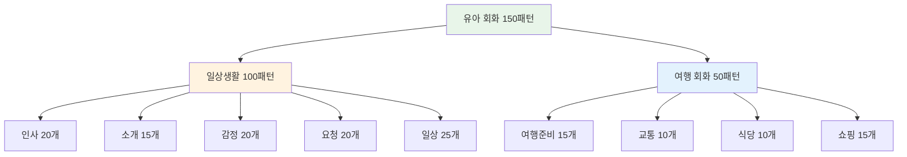
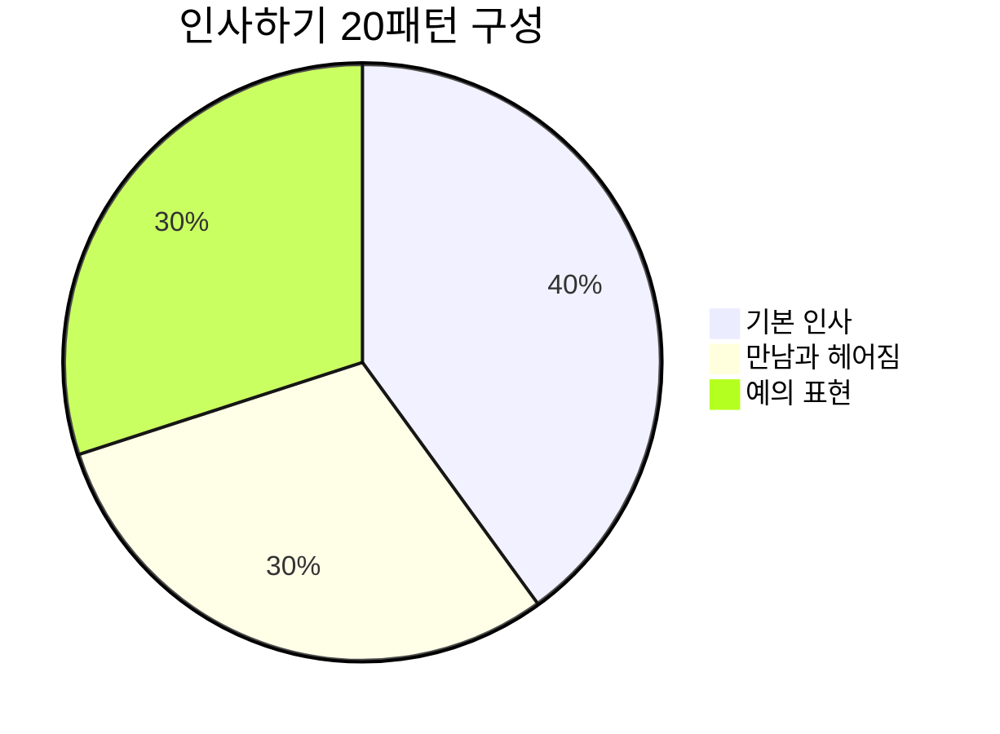
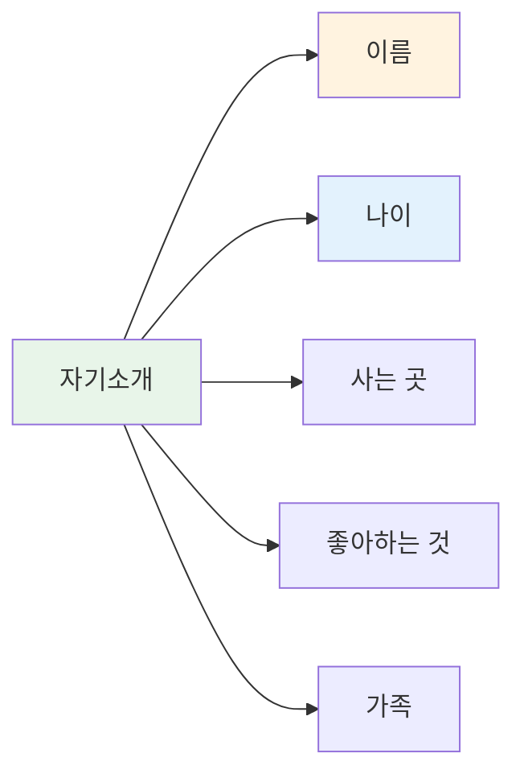
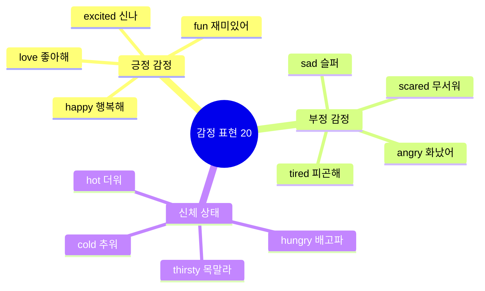
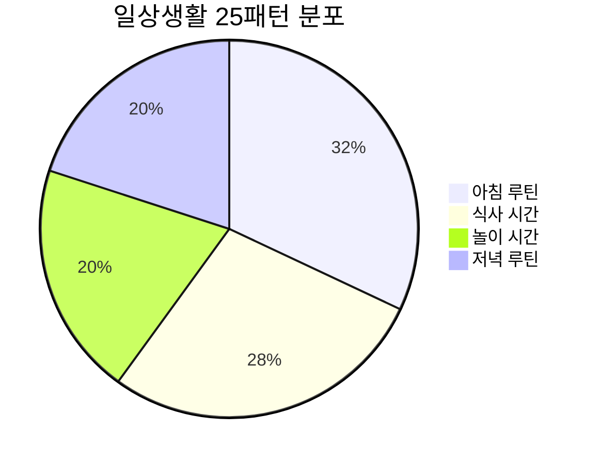
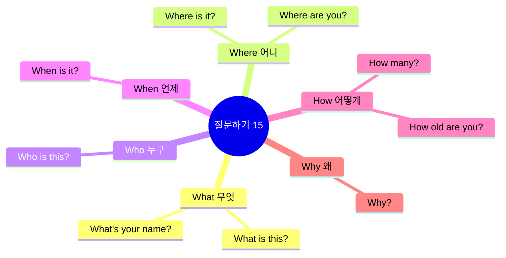
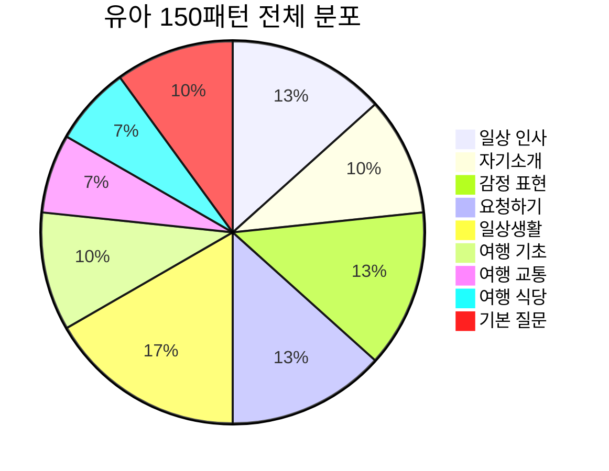
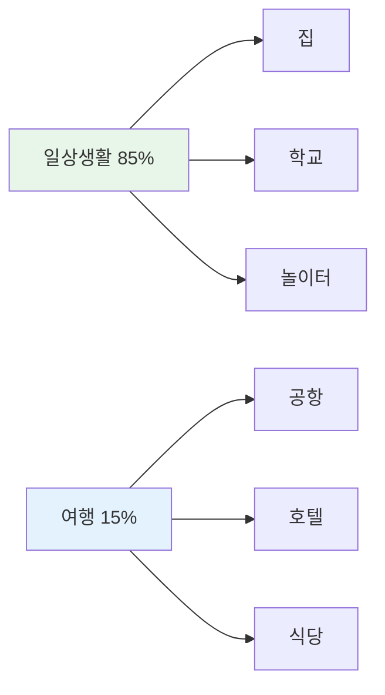
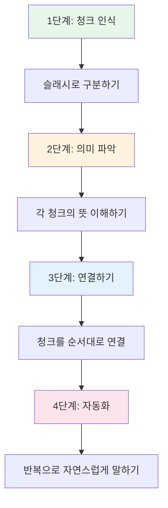

# 🧒 전설의 유아 회화 150패턴 - 청크 마스터

## 🎯 학습 안내

이 과정은 영어권 아이들이 일상생활과 여행에서 가장 많이 사용하는 **150가지 핵심 패턴**을 청크(Chunk, 의미 단위) 형태로 익히는 과정입니다. 문장을 통째로 외우는 대신 의미 단위로 끊어서 학습하여 자연스러운 발화가 가능하도록 구성되었습니다.

```mermaid
mindmap
  root((유아 회화<br/>150패턴))
    원칙
      의미 단위(청크) 학습
      직독직해 연습
      반복 발화
      실전 적용
    구성
      일상 인사 (20)
      자기소개 (15)
      감정 표현 (20)
      요청하기 (20)
      일상생활 (25)
      놀이와 친구 (20)
      여행 기초 (15)
      여행 교통 (10)
      여행 식당 (10)
      기본 질문 (15)
```

---

## 📊 전체 구조 한눈에 보기



---

## 📚 학습 방법

| 단계 | 방법 | 시간 | 체크포인트 |
|------|------|------|------------|
| **1단계** | 청크 읽기 | 30초 | 슬래시(/)로 구분된 의미 단위 확인 |
| **2단계** | 직독직해 | 1분 | 영어 어순 그대로 한국어 뜻 매칭 |
| **3단계** | 소리 내기 | 2분 | 입으로 3번 이상 크게 따라 읽기 |
| **4단계** | 테스트 | 1분 | 체크박스로 학습 상태 점검 |
| **5단계** | 실전 연습 | 3분 | 상황에 맞게 패턴 사용하기 |

---

## 👋 Part 1: 일상 인사 (Patterns 001-020)

### 📋 인사 카테고리 분포



### 기본 인사 (001-008)

| No. | 패턴 | 청크 분해 | 한국어 |
|:---:|------|----------|--------|
| 001 | Hi! How are you? | Hi! / How are you? | 안녕! / 어떻게 지내? |
| 002 | Hello, everyone! | Hello, / everyone! | 안녕하세요, / 여러분! |
| 003 | Good morning, Mommy! | Good morning, / Mommy! | 좋은 아침이에요, / 엄마! |
| 004 | Good afternoon! | Good afternoon, / teacher! | 좋은 오후에요, / 선생님! |
| 005 | Good evening! | Good evening, / Daddy! | 좋은 저녁이에요, / 아빠! |
| 006 | Good night! | Good night, / sleep well! | 잘 자요, / 푹 자요! |
| 007 | How are you today? | How are you / today? | 어떻게 지내요 / 오늘? |
| 008 | I'm fine, thank you! | I'm fine, / thank you! | 나는 잘 지내요, / 고마워요! |

#### 001. **Hi!** - 안녕!
```
Hi! / How / are you?
안녕! / 어떻게 / 지내?
```
**청크 포인트**: `Hi!` (인사) → `How are you?` (안부 묻기)
- [ ] 청크 읽기 | [ ] 직독직해 | [ ] 소리 내기

#### 002. **Hello!** - 안녕하세요!
```
Hello, / everyone!
안녕하세요, / 여러분!
```
**청크 포인트**: `Hello,` (인사) → `everyone!` (대상)
- [ ] 청크 읽기 | [ ] 직독직해 | [ ] 소리 내기

#### 003. **Good morning!** - 좋은 아침이에요!
```
Good morning, / Mommy!
좋은 아침이에요, / 엄마!
```
**청크 포인트**: `Good morning,` (아침 인사) → `Mommy!` (호칭)
- [ ] 청크 읽기 | [ ] 직독직해 | [ ] 소리 내기

#### 004. **Good afternoon!** - 좋은 오후에요!
```
Good afternoon, / teacher!
좋은 오후에요, / 선생님!
```
**청크 포인트**: `Good afternoon,` (오후 인사) → `teacher!` (호칭)
- [ ] 청크 읽기 | [ ] 직독직해 | [ ] 소리 내기

#### 005. **Good evening!** - 좋은 저녁이에요!
```
Good evening, / Daddy!
좋은 저녁이에요, / 아빠!
```
**청크 포인트**: `Good evening,` (저녁 인사) → `Daddy!` (호칭)
- [ ] 청크 읽기 | [ ] 직독직해 | [ ] 소리 내기

#### 006. **Good night!** - 잘 자요!
```
Good night, / sleep well!
잘 자요, / 푹 자요!
```
**청크 포인트**: `Good night,` (밤 인사) → `sleep well!` (잘 자라는 말)
- [ ] 청크 읽기 | [ ] 직독직해 | [ ] 소리 내기

#### 007. **How are you today?** - 오늘 어떻게 지내?
```
How are you / today?
어떻게 지내요 / 오늘?
```
**청크 포인트**: `How are you` (안부) → `today?` (시간)
- [ ] 청크 읽기 | [ ] 직독직해 | [ ] 소리 내기

#### 008. **I'm fine, thank you!** - 나는 잘 지내요, 고마워요!
```
I'm fine, / thank you!
나는 잘 지내요, / 고마워요!
```
**청크 포인트**: `I'm fine,` (상태) → `thank you!` (감사)
- [ ] 청크 읽기 | [ ] 직독직해 | [ ] 소리 내기

### 만남과 헤어짐 (009-014)

| No. | 패턴 | 청크 분해 | 한국어 |
|:---:|------|----------|--------|
| 009 | Bye-bye! | Bye-bye, / see you! | 잘 가, / 또 봐! |
| 010 | See you! | See you / tomorrow! | 보자 / 내일! |
| 011 | See you later! | See you later, / friend! | 나중에 봐, / 친구야! |
| 012 | Nice to meet you! | Nice to meet you! / I'm Tom. | 만나서 반가워! / 나는 톰이야. |
| 013 | Nice to see you again! | Nice to see you / again! | 다시 만나서 / 반가워! |
| 014 | Have a good day! | Have / a good day! | 가져요 / 좋은 하루를! |

#### 009. **Bye-bye!** - 잘 가!
```
Bye-bye, / see you!
잘 가, / 또 봐!
```
**청크 포인트**: `Bye-bye,` (작별) → `see you!` (다음 만남)
- [ ] 청크 읽기 | [ ] 직독직해 | [ ] 소리 내기

#### 010. **See you!** - 또 만나!
```
See you / tomorrow!
보자 / 내일!
```
**청크 포인트**: `See you` (만남 약속) → `tomorrow!` (시간)
- [ ] 청크 읽기 | [ ] 직독직해 | [ ] 소리 내기

#### 011. **See you later!** - 나중에 봐!
```
See you later, / friend!
나중에 봐, / 친구야!
```
**청크 포인트**: `See you later,` (나중에) → `friend!` (호칭)
- [ ] 청크 읽기 | [ ] 직독직해 | [ ] 소리 내기

#### 012. **Nice to meet you!** - 만나서 반가워!
```
Nice to meet you! / I'm Tom.
만나서 반가워! / 나는 톰이야.
```
**청크 포인트**: `Nice to meet you!` (첫 만남) → `I'm Tom.` (소개)
- [ ] 청크 읽기 | [ ] 직독직해 | [ ] 소리 내기

#### 013. **Nice to see you again!** - 다시 만나서 반가워!
```
Nice to see you / again!
다시 만나서 / 반가워!
```
**청크 포인트**: `Nice to see you` (만남) → `again!` (재회)
- [ ] 청크 읽기 | [ ] 직독직해 | [ ] 소리 내기

#### 014. **Have a good day!** - 좋은 하루 보내!
```
Have / a good day!
가져요 / 좋은 하루를!
```
**청크 포인트**: `Have` (가지다) → `a good day!` (좋은 하루)
- [ ] 청크 읽기 | [ ] 직독직해 | [ ] 소리 내기

### 예의 표현 (015-020)

| No. | 패턴 | 청크 분해 | 한국어 |
|:---:|------|----------|--------|
| 015 | Thank you! | Thank you / so much! | 고마워요 / 정말 많이! |
| 016 | You're welcome! | You're welcome! / Anytime. | 천만에요! / 언제든지. |
| 017 | Please! | Help me, / please! | 도와주세요, / 제발요! |
| 018 | Sorry! | Sorry, / I'm late! | 미안해요, / 내가 늦었어요! |
| 019 | Excuse me! | Excuse me, / teacher! | 실례합니다, / 선생님! |
| 020 | No problem! | No problem! / It's okay. | 문제없어요! / 괜찮아요. |

#### 015. **Thank you!** - 고마워!
```
Thank you / so much!
고마워요 / 정말 많이!
```
**청크 포인트**: `Thank you` (감사) → `so much!` (강조)
- [ ] 청크 읽기 | [ ] 직독직해 | [ ] 소리 내기

#### 016. **You're welcome!** - 천만에!
```
You're welcome! / Anytime.
천만에요! / 언제든지.
```
**청크 포인트**: `You're welcome!` (답례) → `Anytime.` (언제든)
- [ ] 청크 읽기 | [ ] 직독직해 | [ ] 소리 내기

#### 017. **Please!** - 부탁해요!
```
Help me, / please!
도와주세요, / 제발요!
```
**청크 포인트**: `Help me,` (요청) → `please!` (공손)
- [ ] 청크 읽기 | [ ] 직독직해 | [ ] 소리 내기

#### 018. **Sorry!** - 미안해!
```
Sorry, / I'm late!
미안해요, / 내가 늦었어요!
```
**청크 포인트**: `Sorry,` (사과) → `I'm late!` (이유)
- [ ] 청크 읽기 | [ ] 직독직해 | [ ] 소리 내기

#### 019. **Excuse me!** - 실례합니다!
```
Excuse me, / teacher!
실례합니다, / 선생님!
```
**청크 포인트**: `Excuse me,` (주의 끌기) → `teacher!` (호칭)
- [ ] 청크 읽기 | [ ] 직독직해 | [ ] 소리 내기

#### 020. **No problem!** - 문제없어요!
```
No problem! / It's okay.
문제없어요! / 괜찮아요.
```
**청크 포인트**: `No problem!` (괜찮음) → `It's okay.` (확인)
- [ ] 청크 읽기 | [ ] 직독직해 | [ ] 소리 내기

---

## 🙋 Part 2: 자기소개 (Patterns 021-035)



### 기본 소개 (021-030)

| No. | 패턴 | 청크 분해 | 한국어 |
|:---:|------|----------|--------|
| 021 | I'm Jenny. | I'm / Jenny. | 나는 / 제니야. |
| 022 | My name is Tom. | My name / is Tom. | 내 이름은 / 톰이야. |
| 023 | I'm five years old. | I'm / five years old. | 나는 / 다섯 살이야. |
| 024 | I live in Korea. | I live / in Korea. | 나는 살아 / 한국에. |
| 025 | I like ice cream. | I like / ice cream. | 나는 좋아해 / 아이스크림을. |
| 026 | I love pizza! | I love / pizza! | 나는 정말 좋아해 / 피자를! |
| 027 | I don't like broccoli. | I don't like / broccoli. | 나는 싫어해 / 브로콜리를. |
| 028 | I can swim. | I can / swim. | 나는 할 수 있어 / 수영하기를. |
| 029 | I can't fly. | I can't / fly. | 나는 할 수 없어 / 날기를. |
| 030 | I want to be a teacher. | I want to be / a teacher. | 나는 되고 싶어 / 선생님이. |

#### 021-030 패턴 상세

#### 021. **I'm [이름].** - 나는 ~야.
```
I'm / Jenny.
나는 / 제니야.
```
- [ ] 청크 읽기 | [ ] 직독직해 | [ ] 소리 내기

#### 022. **My name is [이름].** - 내 이름은 ~야.
```
My name / is Tom.
내 이름은 / 톰이야.
```
- [ ] 청크 읽기 | [ ] 직독직해 | [ ] 소리 내기

#### 023. **I'm [숫자] years old.** - 나는 ~살이야.
```
I'm / five years old.
나는 / 다섯 살이야.
```
- [ ] 청크 읽기 | [ ] 직독직해 | [ ] 소리 내기

#### 024. **I live in [장소].** - 나는 ~에 살아.
```
I live / in Korea.
나는 살아 / 한국에.
```
- [ ] 청크 읽기 | [ ] 직독직해 | [ ] 소리 내기

#### 025. **I like [것].** - 나는 ~를 좋아해.
```
I like / ice cream.
나는 좋아해 / 아이스크림을.
```
- [ ] 청크 읽기 | [ ] 직독직해 | [ ] 소리 내기

#### 026. **I love [것]!** - 나는 정말 좋아해!
```
I love / pizza!
나는 정말 좋아해 / 피자를!
```
- [ ] 청크 읽기 | [ ] 직독직해 | [ ] 소리 내기

#### 027. **I don't like [것].** - 나는 싫어해.
```
I don't like / broccoli.
나는 싫어해 / 브로콜리를.
```
- [ ] 청크 읽기 | [ ] 직독직해 | [ ] 소리 내기

#### 028. **I can [동사].** - 나는 할 수 있어.
```
I can / swim.
나는 할 수 있어 / 수영하기를.
```
- [ ] 청크 읽기 | [ ] 직독직해 | [ ] 소리 내기

#### 029. **I can't [동사].** - 나는 할 수 없어.
```
I can't / fly.
나는 할 수 없어 / 날기를.
```
- [ ] 청크 읽기 | [ ] 직독직해 | [ ] 소리 내기

#### 030. **I want to be [직업].** - 나는 ~가 되고 싶어.
```
I want to be / a teacher.
나는 되고 싶어 / 선생님이.
```
- [ ] 청크 읽기 | [ ] 직독직해 | [ ] 소리 내기

### 가족 소개 (031-035)

| No. | 패턴 | 청크 분해 | 한국어 |
|:---:|------|----------|--------|
| 031 | This is my mom. | This is / my mom. | 이쪽은 / 나의 엄마야. |
| 032 | I have a baby sister. | I have / a baby sister. | 나는 가지고 있어 / 여동생을. |
| 033 | My dad is tall. | My dad / is tall. | 우리 아빠는 / 키가 커. |
| 034 | I love my grandma. | I love / my grandma. | 나는 사랑해 / 우리 할머니를. |
| 035 | We are a happy family. | We are / a happy family. | 우리는 / 행복한 가족이야. |

#### 031-035 패턴 상세

#### 031. **This is my [가족].** - 이쪽은 내 ~야.
```
This is / my mom.
이쪽은 / 나의 엄마야.
```
- [ ] 청크 읽기 | [ ] 직독직해 | [ ] 소리 내기

#### 032. **I have a [가족].** - 나는 ~가 있어.
```
I have / a baby sister.
나는 가지고 있어 / 여동생을.
```
- [ ] 청크 읽기 | [ ] 직독직해 | [ ] 소리 내기

#### 033. **My [가족] is [형용사].** - 내 ~은 ~해.
```
My dad / is tall.
우리 아빠는 / 키가 커.
```
- [ ] 청크 읽기 | [ ] 직독직해 | [ ] 소리 내기

#### 034. **I love my [가족].** - 나는 ~를 사랑해.
```
I love / my grandma.
나는 사랑해 / 우리 할머니를.
```
- [ ] 청크 읽기 | [ ] 직독직해 | [ ] 소리 내기

#### 035. **We are a family.** - 우리는 가족이야.
```
We are / a happy family.
우리는 / 행복한 가족이야.
```
- [ ] 청크 읽기 | [ ] 직독직해 | [ ] 소리 내기

---

## 😊 Part 3: 감정 표현 (Patterns 036-055)



### 기본 감정 (036-045)

| No. | 패턴 | 청크 분해 | 한국어 |
|:---:|------|----------|--------|
| 036 | I'm happy! | I'm / so happy / today! | 나는 / 정말 행복해 / 오늘! |
| 037 | I'm sad. | I'm sad. / My toy / broke. | 나 슬퍼. / 내 장난감이 / 부서졌어. |
| 038 | I'm angry! | I'm angry! / That's / not fair! | 나 화났어! / 그건 / 불공평해! |
| 039 | I'm scared. | I'm scared / of the dark. | 나는 무서워 / 어둠이. |
| 040 | I'm tired. | I'm tired. / I want / to sleep. | 나 피곤해. / 나는 원해 / 자기를. |
| 041 | I'm excited! | I'm excited! / It's my birthday! | 나 신나! / 내 생일이야! |
| 042 | I'm shy. | I'm shy. / Don't look / at me. | 나 부끄러워. / 보지 마 / 나를. |
| 043 | I'm brave! | I'm brave! / I'm not scared! | 나 용감해! / 나는 안 무서워! |
| 044 | I'm okay. | I'm okay. / Don't worry. | 나 괜찮아. / 걱정하지 마. |
| 045 | I feel good! | I feel good / today! | 나는 기분 좋아 / 오늘! |

#### 036-045 패턴 상세 (일부)

#### 036. **I'm happy!** - 나 행복해!
```
I'm / so happy / today!
나는 / 정말 행복해 / 오늘!
```
**청크 포인트**: `I'm` (주어+동사) → `so happy` (감정 강조) → `today!` (시간)
- [ ] 청크 읽기 | [ ] 직독직해 | [ ] 소리 내기

#### 037. **I'm sad.** - 나 슬퍼.
```
I'm sad. / My toy / broke.
나 슬퍼. / 내 장난감이 / 부서졌어.
```
**청크 포인트**: `I'm sad.` (감정) → `My toy` (대상) → `broke.` (원인)
- [ ] 청크 읽기 | [ ] 직독직해 | [ ] 소리 내기

#### 038. **I'm angry!** - 나 화났어!
```
I'm angry! / That's / not fair!
나 화났어! / 그건 / 불공평해!
```
**청크 포인트**: `I'm angry!` (감정) → `That's` (지시) → `not fair!` (이유)
- [ ] 청크 읽기 | [ ] 직독직해 | [ ] 소리 내기

### 좋고 싫음 (046-050)

| No. | 패턴 | 청크 분해 | 한국어 |
|:---:|------|----------|--------|
| 046 | I like it! | I like it! / It's / yummy! | 이거 좋아! / 이건 / 맛있어! |
| 047 | I love it! | I love it! / Thank you! | 이거 너무 좋아! / 고마워! |
| 048 | I hate it! | I hate / spiders! | 나는 정말 싫어 / 거미를! |
| 049 | It's fun! | It's / so fun! | 이건 / 정말 재미있어! |
| 050 | It's boring. | It's / boring. | 이건 / 지루해. |

#### 046-050 패턴 상세

#### 046. **I like it!** - 이거 좋아!
```
I like it! / It's / yummy!
이거 좋아! / 이건 / 맛있어!
```
- [ ] 청크 읽기 | [ ] 직독직해 | [ ] 소리 내기

#### 047. **I love it!** - 이거 너무 좋아!
```
I love it! / Thank you!
이거 너무 좋아! / 고마워!
```
- [ ] 청크 읽기 | [ ] 직독직해 | [ ] 소리 내기

#### 048. **I hate it!** - 이거 싫어!
```
I hate / spiders!
나는 정말 싫어 / 거미를!
```
- [ ] 청크 읽기 | [ ] 직독직해 | [ ] 소리 내기

#### 049. **It's fun!** - 재미있어!
```
It's / so fun!
이건 / 정말 재미있어!
```
- [ ] 청크 읽기 | [ ] 직독직해 | [ ] 소리 내기

#### 050. **It's boring.** - 지루해.
```
It's / boring.
이건 / 지루해.
```
- [ ] 청크 읽기 | [ ] 직독직해 | [ ] 소리 내기

### 신체 상태 (051-055)

| No. | 패턴 | 청크 분해 | 한국어 |
|:---:|------|----------|--------|
| 051 | I'm hungry! | I'm hungry! / Can I / eat? | 배고파! / 제가 / 먹어도 되나요? |
| 052 | I'm thirsty! | I'm thirsty! / Water, / please! | 목말라! / 물 / 주세요! |
| 053 | I'm cold! | I'm cold! / Give me / a blanket. | 추워! / 나에게 줘요 / 담요를. |
| 054 | I'm hot! | I'm hot! / Turn on / the fan. | 더워! / 켜줘요 / 선풍기를. |
| 055 | I feel sick. | I feel sick. / My tummy / hurts. | 아파요. / 내 배가 / 아파요. |

#### 051-055 패턴 상세

#### 051. **I'm hungry!** - 배고파!
```
I'm hungry! / Can I / eat?
배고파요! / 제가 / 먹어도 되나요?
```
- [ ] 청크 읽기 | [ ] 직독직해 | [ ] 소리 내기

#### 052. **I'm thirsty!** - 목말라!
```
I'm thirsty! / Water, / please!
목말라요! / 물 / 주세요!
```
- [ ] 청크 읽기 | [ ] 직독직해 | [ ] 소리 내기

#### 053. **I'm cold!** - 추워!
```
I'm cold! / Give me / a blanket.
추워요! / 나에게 줘요 / 담요를.
```
- [ ] 청크 읽기 | [ ] 직독직해 | [ ] 소리 내기

#### 054. **I'm hot!** - 더워!
```
I'm hot! / Turn on / the fan.
더워요! / 켜줘요 / 선풍기를.
```
- [ ] 청크 읽기 | [ ] 직독직해 | [ ] 소리 내기

#### 055. **I feel sick.** - 아파요.
```
I feel sick. / My tummy / hurts.
나 아파요. / 내 배가 / 아파요.
```
- [ ] 청크 읽기 | [ ] 직독직해 | [ ] 소리 내기

---

## 🙏 Part 4: 요청하기 (Patterns 056-075)


### 기본 요청 (056-065)

| No. | 패턴 | 청크 분해 | 한국어 |
|:---:|------|----------|--------|
| 056 | Can I have some water? | Can I have / some water? | 저 가질 수 있나요 / 물을 약간? |
| 057 | I want a cookie. | I want / a cookie. | 나는 원해요 / 쿠키를. |
| 058 | Give me the ball, please. | Give me / the ball, / please. | 나에게 줘요 / 그 공을, / 제발요. |
| 059 | Help me, please! | Help me, / please! / I can't reach it. | 도와주세요, / 제발! / 손이 닿지 않아요. |
| 060 | Wait for me! | Wait / for me! / I'm coming! | 기다려 / 나를! / 내가 가고 있어! |
| 061 | Look at this! | Look / at this! | 봐요 / 이것을! |
| 062 | Listen to me! | Listen / to me! | 들어요 / 나를! |
| 063 | Come here! | Come here, / please! | 여기 와요, / 제발요! |
| 064 | Go away! | Go away! / Leave me alone! | 저리 가요! / 나를 혼자 두세요! |
| 065 | Stop it! | Stop it! / I don't like it! | 그만해요! / 나는 싫어요! |

#### 056-065 패턴 상세 (일부)

#### 056. **Can I have [것]?** - ~를 줄 수 있어요?
```
Can I have / some water?
저 가질 수 있나요 / 물을 약간?
```
**청크 포인트**: `Can I have` (요청 표현) → `some water?` (원하는 것)
- [ ] 청크 읽기 | [ ] 직독직해 | [ ] 소리 내기

#### 057. **I want [것].** - ~를 원해요.
```
I want / a cookie.
나는 원해요 / 쿠키를.
```
- [ ] 청크 읽기 | [ ] 직독직해 | [ ] 소리 내기

#### 058. **Give me [것], please.** - ~를 주세요.
```
Give me / the ball, / please.
나에게 줘요 / 그 공을, / 제발요.
```
- [ ] 청크 읽기 | [ ] 직독직해 | [ ] 소리 내기

### 허락 구하기 (066-070)

| No. | 패턴 | 청크 분해 | 한국어 |
|:---:|------|----------|--------|
| 066 | Can I go outside? | Can I go / outside? | 제가 가도 되나요 / 밖으로? |
| 067 | May I play? | May I / play? | 제가 해도 되나요 / 놀기를? |
| 068 | Can I play with this? | Can I play / with this? | 제가 놀아도 되나요 / 이것을 가지고? |
| 069 | Can I watch TV? | Can I watch / TV / now? | 제가 봐도 되나요 / TV를 / 지금? |
| 070 | Can I eat candy? | Can I eat / candy? | 제가 먹어도 되나요 / 사탕을? |

#### 066-070 패턴 상세

#### 066. **Can I go [장소]?** - ~에 가도 돼요?
```
Can I go / outside?
제가 가도 되나요 / 밖으로?
```
- [ ] 청크 읽기 | [ ] 직독직해 | [ ] 소리 내기

#### 067. **May I [동사]?** - ~해도 되나요?
```
May I / play?
제가 해도 되나요 / 놀기를?
```
- [ ] 청크 읽기 | [ ] 직독직해 | [ ] 소리 내기

#### 068. **Can I play with [것]?** - ~로 놀아도 돼요?
```
Can I play / with this?
제가 놀아도 되나요 / 이것을 가지고?
```
- [ ] 청크 읽기 | [ ] 직독직해 | [ ] 소리 내기

### 필요 표현 (071-075)

| No. | 패턴 | 청크 분해 | 한국어 |
|:---:|------|----------|--------|
| 071 | I need my teddy bear. | I need / my teddy bear. | 나는 필요해요 / 내 곰 인형이. |
| 072 | I need to go potty. | I need / to go potty / now! | 나는 필요해요 / 화장실 가는 것이 / 지금! |
| 073 | Let me try! | Let me / try! | 내가 하게 해줘 / 해보기를! |
| 074 | One more, please! | One more / cookie, / please! | 하나 더 / 쿠키를, / 부탁해요! |
| 075 | Not yet! | Not yet! / Wait / a minute! | 아직 아니에요! / 기다려요 / 잠깐만! |

#### 071-075 패턴 상세

#### 071. **I need [것].** - ~가 필요해요.
```
I need / my teddy bear.
나는 필요해요 / 내 곰 인형이.
```
- [ ] 청크 읽기 | [ ] 직독직해 | [ ] 소리 내기

#### 072. **I need to go potty.** - 화장실 가야 해요.
```
I need / to go potty / now!
나는 필요해요 / 화장실 가는 것이 / 지금!
```
- [ ] 청크 읽기 | [ ] 직독직해 | [ ] 소리 내기

#### 073. **Let me [동사].** - 내가 ~할게요.
```
Let me / try!
내가 하게 해줘 / 해보기를!
```
- [ ] 청크 읽기 | [ ] 직독직해 | [ ] 소리 내기

#### 074. **One more, please!** - 하나 더요!
```
One more / cookie, / please!
하나 더 / 쿠키를, / 부탁해요!
```
- [ ] 청크 읽기 | [ ] 직독직해 | [ ] 소리 내기

#### 075. **Not yet!** - 아직이요!
```
Not yet! / Wait / a minute!
아직 아니에요! / 기다려요 / 잠깐만!
```
- [ ] 청크 읽기 | [ ] 직독직해 | [ ] 소리 내기

---

## 🏠 Part 5: 일상생활 (Patterns 076-100)



### 아침 루틴 (076-083)

| No. | 패턴 | 청크 분해 | 한국어 |
|:---:|------|----------|--------|
| 076 | Wake up! | Wake up! / It's / morning! | 일어나! / 지금은 / 아침이야! |
| 077 | Time to eat breakfast! | Time / to eat / breakfast! | 시간이야 / 먹을 / 아침을! |
| 078 | I'm getting dressed. | I'm / getting dressed / now. | 나는 / 옷 입는 중이야 / 지금. |
| 079 | I'm brushing my teeth. | I'm / brushing / my teeth. | 나는 / 닦는 중이야 / 내 이를. |
| 080 | I'm washing my face. | I'm / washing / my face. | 나는 / 씻는 중이야 / 내 얼굴을. |
| 081 | I'm combing my hair. | I'm / combing / my hair. | 나는 / 빗는 중이야 / 내 머리를. |
| 082 | Let's go to school! | Let's go / to school! | 가자 / 학교에! |
| 083 | Put on your shoes! | Put on / your shoes! | 신어요 / 너의 신발을! |

#### 076-083 패턴 상세 (일부)

#### 076. **Wake up!** - 일어나!
```
Wake up! / It's / morning!
일어나! / 지금은 / 아침이야!
```
- [ ] 청크 읽기 | [ ] 직독직해 | [ ] 소리 내기

#### 077. **Time to [동사]!** - ~할 시간이야!
```
Time / to eat / breakfast!
시간이야 / 먹을 / 아침을!
```
- [ ] 청크 읽기 | [ ] 직독직해 | [ ] 소리 내기

### 식사 시간 (084-090)

| No. | 패턴 | 청크 분해 | 한국어 |
|:---:|------|----------|--------|
| 084 | I'm eating an apple. | I'm eating / an apple. | 나는 먹는 중이야 / 사과 하나를. |
| 085 | Yummy! | Yummy! / I love / pizza! | 맛있어! / 나는 좋아해 / 피자를! |
| 086 | I'm full. | I'm full. / No more, / please. | 나 배불러요. / 더는 안돼요, / 제발요. |
| 087 | I'm done! | I'm done / eating! | 나 다 했어요 / 먹는 것을! |
| 088 | Can I have more? | Can I have / more juice? | 저 가질 수 있나요 / 더 많은 주스를? |
| 089 | It's delicious! | It's / delicious! | 이건 / 맛있어요! |
| 090 | I want seconds! | I want / seconds! | 나는 원해요 / 한 번 더! (두 번째 접시) |

#### 084-090 패턴 상세 (일부)

#### 084. **I'm eating [음식].** - ~먹고 있어.
```
I'm eating / an apple.
나는 먹는 중이야 / 사과 하나를.
```
- [ ] 청크 읽기 | [ ] 직독직해 | [ ] 소리 내기

#### 085. **Yummy!** - 맛있어!
```
Yummy! / I love / pizza!
맛있어! / 나는 좋아해 / 피자를!
```
- [ ] 청크 읽기 | [ ] 직독직해 | [ ] 소리 내기

### 놀이 시간 (091-095)

| No. | 패턴 | 청크 분해 | 한국어 |
|:---:|------|----------|--------|
| 091 | I'm playing with blocks. | I'm playing / with blocks. | 나는 노는 중이야 / 블록을 가지고. |
| 092 | Let's play together! | Let's play / together! | 놀자 / 함께! |
| 093 | It's my turn! | It's / my turn / now! | 지금은 / 내 차례야 / 지금! |
| 094 | Your turn! | Your turn! / Go / ahead! | 네 차례야! / 가 / 앞으로! (해봐!) |
| 095 | I won! | I won! / Yay! | 내가 이겼다! / 야호! |

#### 091-095 패턴 상세

#### 091. **I'm playing.** - 놀고 있어.
```
I'm playing / with blocks.
나는 노는 중이야 / 블록을 가지고.
```
- [ ] 청크 읽기 | [ ] 직독직해 | [ ] 소리 내기

#### 092. **Let's play!** - 같이 놀자!
```
Let's play / together!
놀자 / 함께!
```
- [ ] 청크 읽기 | [ ] 직독직해 | [ ] 소리 내기

### 저녁 루틴 (096-100)

| No. | 패턴 | 청크 분해 | 한국어 |
|:---:|------|----------|--------|
| 096 | I'm home! | I'm home! / Where's / Mom? | 나 집에 왔어요! / 어디 있나요 / 엄마는? |
| 097 | I'm taking a bath. | I'm / taking a bath / now. | 나는 / 목욕하는 중이야 / 지금. |
| 098 | I'm going to bed. | I'm going / to bed. / Good night! | 나는 가요 / 침대로. / 잘 자요! |
| 099 | Sweet dreams! | Sweet dreams! / See you / tomorrow! | 좋은 꿈 꿔! / 봐요 / 내일! |
| 100 | I love you! | I love you, / Mom! | 사랑해요, / 엄마! |

#### 096-100 패턴 상세

#### 096. **I'm home!** - 나 왔어!
```
I'm home! / Where's / Mom?
나 집에 왔어요! / 어디 있나요 / 엄마는?
```
- [ ] 청크 읽기 | [ ] 직독직해 | [ ] 소리 내기

#### 097. **I'm taking a bath.** - 목욕하고 있어.
```
I'm / taking a bath / now.
나는 / 목욕하는 중이야 / 지금.
```
- [ ] 청크 읽기 | [ ] 직독직해 | [ ] 소리 내기

#### 098. **I'm going to bed.** - 자러 갈게.
```
I'm going / to bed. / Good night!
나는 가요 / 침대로. / 잘 자요!
```
- [ ] 청크 읽기 | [ ] 직독직해 | [ ] 소리 내기

#### 099. **Sweet dreams!** - 좋은 꿈 꿔!
```
Sweet dreams! / See you / tomorrow!
좋은 꿈 꿔! / 봐요 / 내일!
```
- [ ] 청크 읽기 | [ ] 직독직해 | [ ] 소리 내기

#### 100. **I love you!** - 사랑해요!
```
I love you, / Mom!
사랑해요, / 엄마!
```
- [ ] 청크 읽기 | [ ] 직독직해 | [ ] 소리 내기

---

## ✈️ Part 6: 여행 기초 (Patterns 101-115)


### 공항 기본 (101-105)

| No. | 패턴 | 청크 분해 | 한국어 |
|:---:|------|----------|--------|
| 101 | Where is the bathroom? | Where is / the bathroom? | 어디 있나요 / 화장실이? |
| 102 | I need help. | I need / help. | 나는 필요해요 / 도움이. |
| 103 | I'm lost. | I'm lost. / Can you help me? | 나 길을 잃었어요. / 도와줄 수 있나요? |
| 104 | This is my bag. | This is / my bag. | 이것은 / 내 가방이에요. |
| 105 | Thank you for helping! | Thank you / for helping! | 고마워요 / 도와줘서! |

#### 101-105 패턴 상세

#### 101. **Where is the bathroom?** - 화장실이 어디 있나요?
```
Where is / the bathroom?
어디 있나요 / 화장실이?
```
**청크 포인트**: `Where is` (장소 질문) → `the bathroom?` (찾는 곳)
- [ ] 청크 읽기 | [ ] 직독직해 | [ ] 소리 내기

#### 102. **I need help.** - 도움이 필요해요.
```
I need / help.
나는 필요해요 / 도움이.
```
- [ ] 청크 읽기 | [ ] 직독직해 | [ ] 소리 내기

#### 103. **I'm lost.** - 나 길을 잃었어요.
```
I'm lost. / Can you help me?
나 길을 잃었어요. / 도와줄 수 있나요?
```
- [ ] 청크 읽기 | [ ] 직독직해 | [ ] 소리 내기

### 호텔 기본 (106-110)

| No. | 패턴 | 청크 분해 | 한국어 |
|:---:|------|----------|--------|
| 106 | This is my room. | This is / my room. | 이것은 / 내 방이에요. |
| 107 | Where is my bed? | Where is / my bed? | 어디 있나요 / 내 침대가? |
| 108 | I like this room! | I like / this room! | 나는 좋아해요 / 이 방을! |
| 109 | Can I watch TV? | Can I watch / TV? | 제가 봐도 되나요 / TV를? |
| 110 | Good morning! | Good morning! / What's for breakfast? | 좋은 아침이에요! / 뭐예요 아침은? |

#### 106-110 패턴 상세

#### 106. **This is my room.** - 이것은 내 방이에요.
```
This is / my room.
이것은 / 내 방이에요.
```
- [ ] 청크 읽기 | [ ] 직독직해 | [ ] 소리 내기

#### 107. **Where is my bed?** - 내 침대가 어디 있나요?
```
Where is / my bed?
어디 있나요 / 내 침대가?
```
- [ ] 청크 읽기 | [ ] 직독직해 | [ ] 소리 내기

### 긴급 상황 (111-115)

| No. | 패턴 | 청크 분해 | 한국어 |
|:---:|------|----------|--------|
| 111 | Help! | Help! / I need / an adult! | 도와주세요! / 나는 필요해요 / 어른이! |
| 112 | I can't find my mom. | I can't find / my mom. | 나는 찾을 수 없어요 / 우리 엄마를. |
| 113 | I'm scared. | I'm scared. / Where's my dad? | 나 무서워요. / 어디 있나요 우리 아빠는? |
| 114 | Call my mom! | Call / my mom! | 전화해 주세요 / 우리 엄마한테! |
| 115 | I don't speak English well. | I don't speak / English / well. | 나는 못해요 / 영어를 / 잘. |

#### 111-115 패턴 상세

#### 111. **Help!** - 도와주세요!
```
Help! / I need / an adult!
도와주세요! / 나는 필요해요 / 어른이!
```
- [ ] 청크 읽기 | [ ] 직독직해 | [ ] 소리 내기

#### 112. **I can't find my mom.** - 엄마를 찾을 수 없어요.
```
I can't find / my mom.
나는 찾을 수 없어요 / 우리 엄마를.
```
- [ ] 청크 읽기 | [ ] 직독직해 | [ ] 소리 내기

---

## 🚗 Part 7: 여행 교통 (Patterns 116-125)

### 교통수단 (116-125)

| No. | 패턴 | 청크 분해 | 한국어 |
|:---:|------|----------|--------|
| 116 | I want to go to the park. | I want to go / to the park. | 나는 가고 싶어요 / 공원에. |
| 117 | Are we there yet? | Are we / there / yet? | 우리 / 거기에 / 이미 도착했나요? |
| 118 | How long will it take? | How long / will it take? | 얼마나 오래 / 걸릴까요? |
| 119 | I feel sick. | I feel sick. / I need / fresh air. | 나 아파요. / 나는 필요해요 / 신선한 공기가. |
| 120 | Can we stop here? | Can we stop / here? | 우리 멈출 수 있나요 / 여기서? |
| 121 | This bus is big! | This bus / is big! | 이 버스는 / 커요! |
| 122 | I like the train! | I like / the train! | 나는 좋아해요 / 기차를! |
| 123 | Look out the window! | Look / out the window! | 봐요 / 창문 밖을! |
| 124 | We're here! | We're here! / Let's get off! | 우리 도착했어요! / 내려요! |
| 125 | I'm tired of sitting. | I'm tired / of sitting. | 나는 피곤해요 / 앉아 있는 것이. |

#### 116-125 패턴 상세 (일부)

#### 116. **I want to go to [장소].** - ~에 가고 싶어요.
```
I want to go / to the park.
나는 가고 싶어요 / 공원에.
```
- [ ] 청크 읽기 | [ ] 직독직해 | [ ] 소리 내기

#### 117. **Are we there yet?** - 아직 안 도착했나요?
```
Are we / there / yet?
우리 / 거기에 / 이미 도착했나요?
```
- [ ] 청크 읽기 | [ ] 직독직해 | [ ] 소리 내기

---

## 🍽️ Part 8: 여행 식당 (Patterns 126-135)

### 식당 표현 (126-135)

| No. | 패턴 | 청크 분해 | 한국어 |
|:---:|------|----------|--------|
| 126 | I'm hungry! | I'm hungry! / Can we eat? | 배고파요! / 우리 먹을 수 있나요? |
| 127 | What's this? | What's this? / Is it yummy? | 이게 뭐예요? / 맛있나요? |
| 128 | I want chicken nuggets. | I want / chicken nuggets. | 나는 원해요 / 치킨 너겟을. |
| 129 | Can I have fries? | Can I have / fries? | 저 가질 수 있나요 / 감자튀김을? |
| 130 | I don't like this. | I don't like / this. | 나는 싫어해요 / 이것을. |
| 131 | It's too hot! | It's / too hot! | 이건 / 너무 뜨거워요! |
| 132 | I need a spoon. | I need / a spoon. | 나는 필요해요 / 숟가락이. |
| 133 | More water, please! | More water, / please! | 물 더 주세요, / 제발요! |
| 134 | I'm finished! | I'm finished! / Thank you! | 나 다 먹었어요! / 고마워요! |
| 135 | That was delicious! | That was / delicious! | 그것은 / 맛있었어요! |

#### 126-135 패턴 상세 (일부)

#### 126. **I'm hungry!** - 배고파요!
```
I'm hungry! / Can we eat?
배고파요! / 우리 먹을 수 있나요?
```
- [ ] 청크 읽기 | [ ] 직독직해 | [ ] 소리 내기

#### 127. **What's this?** - 이게 뭐예요?
```
What's this? / Is it yummy?
이게 뭐예요? / 맛있나요?
```
- [ ] 청크 읽기 | [ ] 직독직해 | [ ] 소리 내기

---

## ❓ Part 9: 기본 질문 (Patterns 136-150)



### 기본 질문 (136-150)

| No. | 패턴 | 청크 분해 | 한국어 |
|:---:|------|----------|--------|
| 136 | What is this? | What / is this? | 무엇이니 / 이것은? |
| 137 | What is that? | What / is that / over there? | 무엇이니 / 저것은 / 저 너머에 있는? |
| 138 | Who is this? | Who / is this / in the picture? | 누구니 / 이 사람은 / 사진 속의? |
| 139 | What color is it? | What color / is / this flower? | 무슨 색이니 / ~는 / 이 꽃은? |
| 140 | What's your name? | Hi! / What's / your name? | 안녕! / 무엇이니 / 너의 이름은? |
| 141 | Where is my backpack? | Where is / my backpack? | 어디 있나요 / 내 배낭이? |
| 142 | Where are you? | Where / are you, / Mommy? | 어디 / 있나요 당신은, / 엄마? |
| 143 | When is my birthday? | When is / my birthday? | 언제인가요 / 내 생일이? |
| 144 | How old are you? | How old / are you? | 얼마나 나이 들었니 / 너는? |
| 145 | How many? | How many / cookies / are there? | 얼마나 많은 / 쿠키가 / 있나요 거기에? |
| 146 | Why? | Why / can't I / go? | 왜 / 저는 할 수 없나요 / 가는 것을? |
| 147 | Why not? | Why not? / I want / to play! | 왜 안 돼요? / 나는 원해요 / 노는 것을! |
| 148 | Really? | Really? / Is it / true? | 진짜요? / 그것은 / 사실인가요? |
| 149 | Are you okay? | Are you okay? / Did you / fall? | 너 괜찮니? / 너 했니 / 넘어지기를? |
| 150 | Do you like chocolate? | Do you like / chocolate? | 너 좋아하니 / 초콜릿을? |

#### 136-150 패턴 상세 (일부)

#### 136. **What is this?** - 이게 뭐야?
```
What / is this?
무엇이니 / 이것은?
```
- [ ] 청크 읽기 | [ ] 직독직해 | [ ] 소리 내기

#### 140. **What's your name?** - 이름이 뭐야?
```
Hi! / What's / your name?
안녕! / 무엇이니 / 너의 이름은?
```
- [ ] 청크 읽기 | [ ] 직독직해 | [ ] 소리 내기

#### 141. **Where is [것]?** - ~가 어디 있어?
```
Where is / my backpack?
어디 있나요 / 내 배낭이?
```
- [ ] 청크 읽기 | [ ] 직독직해 | [ ] 소리 내기

#### 146. **Why?** - 왜?
```
Why / can't I / go?
왜 / 저는 할 수 없나요 / 가는 것을?
```
- [ ] 청크 읽기 | [ ] 직독직해 | [ ] 소리 내기

#### 150. **Do you like [것]?** - ~좋아해?
```
Do you like / chocolate?
너 좋아하니 / 초콜릿을?
```
- [ ] 청크 읽기 | [ ] 직독직해 | [ ] 소리 내기

---

## 📊 전체 패턴 분석

### 카테고리별 분포



### 학습 난이도 분포

| 난이도 | 패턴 수 | 카테고리 | 특징 |
|--------|---------|----------|------|
| **초급** | 70개 | 인사, 소개, 기본 감정 | 1-3단어 문장 |
| **중급** | 50개 | 요청, 일상생활 | 3-5단어 문장 |
| **고급** | 30개 | 여행, 복잡한 질문 | 5단어 이상 문장 |

### 주제별 활용도



---

## 💡 학습 가이드

### 주간 학습 계획표

| 요일 | 학습 범위 | 패턴 수 | 주제 | 예상 시간 |
|------|-----------|---------|------|-----------|
| **월요일** | 001-030 | 30개 | 인사 + 소개 | 30분 |
| **화요일** | 031-055 | 25개 | 감정 표현 | 25분 |
| **수요일** | 056-075 | 20개 | 요청하기 | 20분 |
| **목요일** | 076-100 | 25개 | 일상생활 | 25분 |
| **금요일** | 101-125 | 25개 | 여행 기초 + 교통 | 25분 |
| **토요일** | 126-150 | 25개 | 식당 + 질문 | 25분 |
| **일요일** | 전체 복습 | 150개 | 전체 패턴 | 60분 |

### 청크 학습 4단계



### 실전 활용 팁

| 상황 | 추천 패턴 | 활용 예시 |
|------|----------|-----------|
| **아침에 일어났을 때** | 076-083 | Wake up! → I'm brushing my teeth. → Let's go! |
| **배고플 때** | 051, 126-135 | I'm hungry! → Can I have fries? → Yummy! |
| **놀이터에서** | 091-095 | Let's play together! → It's my turn! → I won! |
| **길을 잃었을 때** | 103, 111-115 | I'm lost. → I need help. → I can't find my mom. |

---

## 🎯 마스터 체크리스트

### 전체 진도 확인


### 레벨별 목표

| 레벨 | 목표 | 기준 | 보상 |
|------|------|------|------|
| **Bronze** | 50개 패턴 | 청크 읽기 완료 | 🥉 |
| **Silver** | 100개 패턴 | 직독직해 완료 | 🥈 |
| **Gold** | 150개 패턴 | 소리 내기 완료 | 🥇 |
| **Master** | 실전 활용 | 상황별 사용 가능 | ⭐ |

---

*Last Updated: 2026-01-10*
*Total Patterns: 150개 | Daily Practice: 20-30분 | Complete in: 1주일*

