# 🧒 전설의 유아 회화 150패턴 - 청크 마스터

## 🎯 학습 안내

이 과정은 영어권 아이들이 일상생활과 여행에서 가장 많이 사용하는 **150가지 핵심 패턴**을 청크(Chunk, 의미 단위) 형태로 익히는 과정입니다. 문장을 통째로 외우는 대신 의미 단위로 끊어서 학습하여 자연스러운 발화가 가능하도록 구성되었습니다.

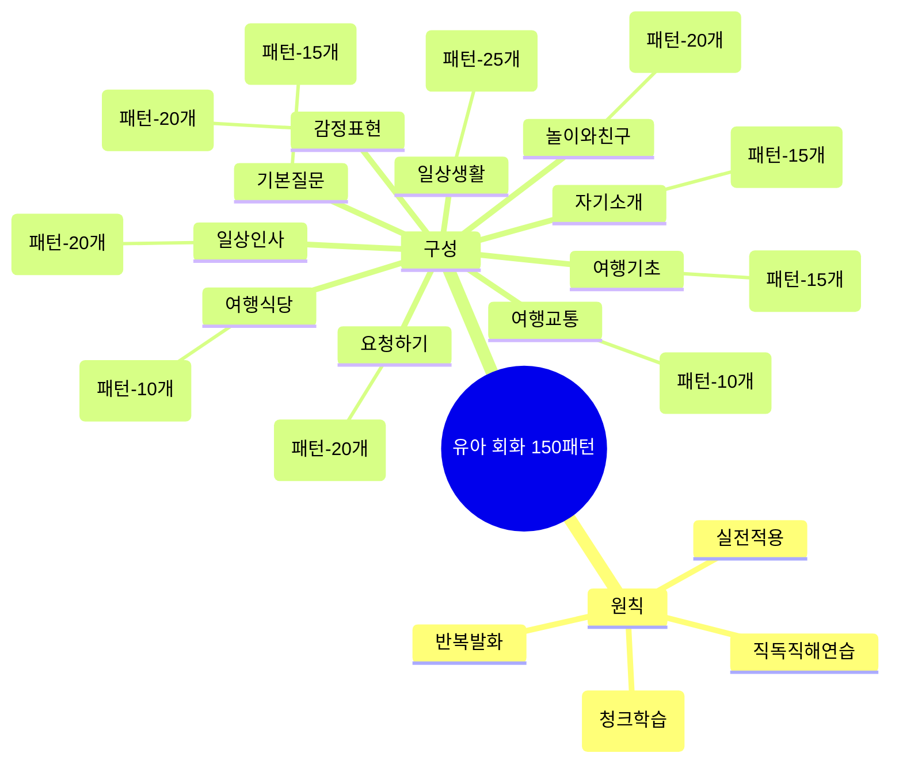

---

## 📊 전체 구조 한눈에 보기

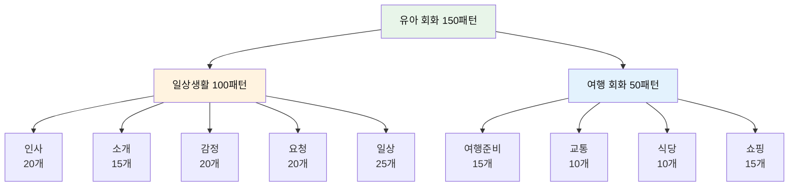

---

## 📚 학습 방법

| 단계 | 방법 | 시간 | 체크포인트 |
|------|------|------|------------|
| **1단계** | 청크 읽기 | 30초 | 슬래시(/)로 구분된 의미 단위 확인 |
| **2단계** | 직독직해 | 1분 | 영어 어순 그대로 한국어 뜻 매칭 |
| **3단계** | 소리 내기 | 2분 | 입으로 3번 이상 크게 따라 읽기 |
| **4단계** | 테스트 | 1분 | 체크박스로 학습 상태 점검 |
| **5단계** | 실전 연습 | 3분 | 상황에 맞게 패턴 사용하기 |

---

## 👋 Part 1: 일상 인사 (Patterns 001-020)

### 📋 인사 카테고리 분포

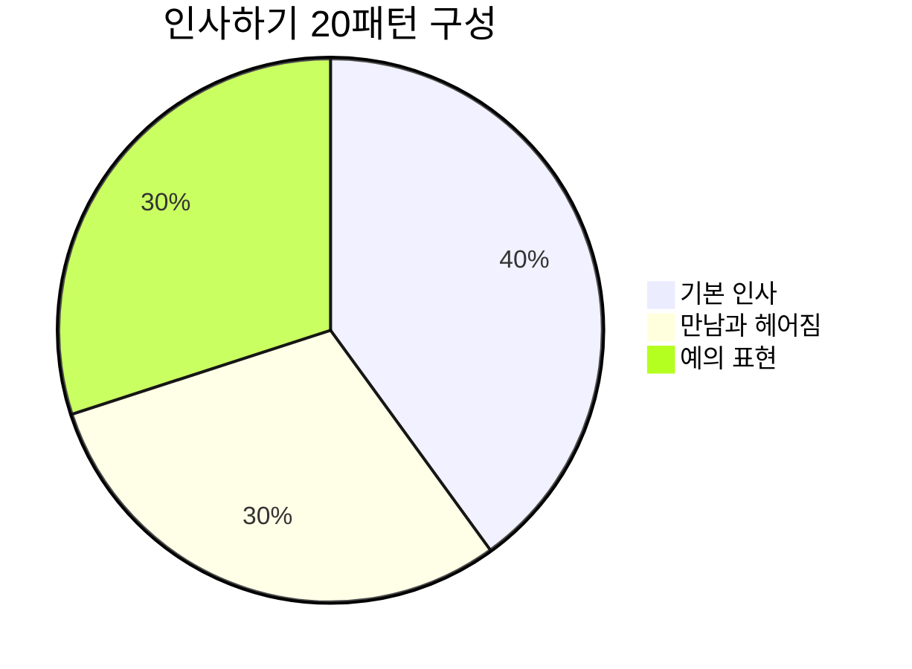

### 기본 인사 (001-008)

| No. | 패턴 | 청크 분해 | 한국어 |
|:---:|------|----------|--------|
| 001 | Hi! How are you? | Hi! / How are you? | 안녕! / 어떻게 지내? |
| 002 | Hello, everyone! | Hello, / everyone! | 안녕하세요, / 여러분! |
| 003 | Good morning, Mommy! | Good morning, / Mommy! | 좋은 아침이에요, / 엄마! |
| 004 | Good afternoon! | Good afternoon, / teacher! | 좋은 오후에요, / 선생님! |
| 005 | Good evening! | Good evening, / Daddy! | 좋은 저녁이에요, / 아빠! |
| 006 | Good night! | Good night, / sleep well! | 잘 자요, / 푹 자요! |
| 007 | How are you today? | How are you / today? | 어떻게 지내요 / 오늘? |
| 008 | I'm fine, thank you! | I'm fine, / thank you! | 나는 잘 지내요, / 고마워요! |

#### 001. **Hi!** - 안녕!
```
Hi! / How / are you?
안녕! / 어떻게 / 지내?
```
**청크 포인트**: `Hi!` (인사) → `How are you?` (안부 묻기)

**💬 실전 대화 턴 (친구 만났을 때)**
```
A: Hi! How are you?
   (안녕! 어떻게 지내?)
   
B: Hi! I'm fine, thank you!
   (안녕! 나는 잘 지내, 고마워!)
   
A: Good! Let's play!
   (좋아! 같이 놀자!)
```

**🎯 응용 연습**
- 아침에 엄마한테: "Hi, Mommy! How are you?"
- 학교에서 선생님한테: "Hi, teacher! How are you today?"
- 친구 만났을 때: "Hi! How are you? Let's play!"

- [ ] 청크 읽기 | [ ] 직독직해 | [ ] 소리 내기

#### 002. **Hello!** - 안녕하세요!
```
Hello, / everyone!
안녕하세요, / 여러분!
```
**청크 포인트**: `Hello,` (인사) → `everyone!` (대상)

**💬 실전 대화 턴 (교실에서)**
```
선생님: Hello, everyone! How are you today?
        (안녕하세요, 여러분! 오늘 어떻게 지내요?)
        
아이들: Hello, teacher! We're fine!
        (안녕하세요, 선생님! 우리는 잘 지내요!)
        
선생님: That's good! Let's start our class!
        (좋아요! 수업을 시작하자!)
        
아이들: Okay! Hello, class!
        (네! 안녕, 반 친구들!)
```

**🎯 응용 연습**
- 유치원에서: "Hello, friends! Let's play!"
- 가게에서: "Hello! Thank you!"
- 이웃에게: "Hello, Mr. Kim!"

- [ ] 청크 읽기 | [ ] 직독직해 | [ ] 소리 내기

#### 003. **Good morning!** - 좋은 아침이에요!
```
Good morning, / Mommy!
좋은 아침이에요, / 엄마!
```
**청크 포인트**: `Good morning,` (아침 인사) → `Mommy!` (호칭)

**💬 실전 대화 턴 (아침에 일어나서)**
```
아이: Good morning, Mommy!
      (좋은 아침이에요, 엄마!)
      
엄마: Good morning, sweetie! Did you sleep well?
      (좋은 아침, 얘야! 잘 잤니?)
      
아이: Yes! I had a good dream!
      (네! 좋은 꿈 꿨어요!)
      
엄마: That's wonderful! Let's have breakfast!
      (잘됐구나! 아침 먹자!)
```

**🎯 응용 연습**
- 아빠에게: "Good morning, Daddy! I love you!"
- 선생님께: "Good morning, teacher!"
- 친구에게: "Good morning! Let's play!"

- [ ] 청크 읽기 | [ ] 직독직해 | [ ] 소리 내기

#### 004. **Good afternoon!** - 좋은 오후에요!
```
Good afternoon, / teacher!
좋은 오후에요, / 선생님!
```
**청크 포인트**: `Good afternoon,` (오후 인사) → `teacher!` (호칭)

**💬 실전 대화 턴 (오후 수업 시작)**
```
아이: Good afternoon, teacher!
      (좋은 오후에요, 선생님!)
      
선생님: Good afternoon! Are you ready to learn?
        (좋은 오후! 배울 준비 됐니?)
        
아이: Yes! I'm ready!
      (네! 준비됐어요!)
      
선생님: Great! Let's begin!
        (좋아! 시작하자!)
```

**🎯 응용 연습**
- 유치원에서: "Good afternoon, everyone!"
- 이웃에게: "Good afternoon, Mrs. Kim!"
- 가게에서: "Good afternoon! Can I have this?"

- [ ] 청크 읽기 | [ ] 직독직해 | [ ] 소리 내기

#### 005. **Good evening!** - 좋은 저녁이에요!
```
Good evening, / Daddy!
좋은 저녁이에요, / 아빠!
```
**청크 포인트**: `Good evening,` (저녁 인사) → `Daddy!` (호칭)

**💬 실전 대화 턴 (아빠 퇴근 후)**
```
아이: Good evening, Daddy!
      (좋은 저녁이에요, 아빠!)
      
아빠: Good evening! Did you have a good day?
      (좋은 저녁! 좋은 하루 보냈어?)
      
아이: Yes! I played with my friends!
      (네! 친구들이랑 놀았어요!)
      
아빠: That's nice! Let's eat dinner together!
      (좋았겠다! 같이 저녁 먹자!)
```

**🎯 응용 연습**
- 할머니께: "Good evening, Grandma!"
- 이웃에게: "Good evening, Mr. Park!"
- 집에 돌아와서: "Good evening, everyone!"

- [ ] 청크 읽기 | [ ] 직독직해 | [ ] 소리 내기

#### 006. **Good night!** - 잘 자요!
```
Good night, / sleep well!
잘 자요, / 푹 자요!
```
**청크 포인트**: `Good night,` (밤 인사) → `sleep well!` (잘 자라는 말)

**💬 실전 대화 턴 (잠자리에서)**
```
엄마: It's bedtime. Good night, sweetie!
      (잘 시간이야. 잘 자, 얘야!)
      
아이: Good night, Mommy! Sleep well!
      (잘 자요, 엄마! 푹 자요!)
      
엄마: Sweet dreams! I love you!
      (좋은 꿈 꿔! 사랑해!)
      
아이: I love you too! Good night!
      (저도 사랑해요! 잘 자요!)
```

**🎯 응용 연습**
- 아빠에게: "Good night, Daddy! See you tomorrow!"
- 형제에게: "Good night, brother! Sleep well!"
- 인형에게: "Good night, teddy bear!"

- [ ] 청크 읽기 | [ ] 직독직해 | [ ] 소리 내기

#### 007. **How are you today?** - 오늘 어떻게 지내?
```
How are you / today?
어떻게 지내요 / 오늘?
```
**청크 포인트**: `How are you` (안부) → `today?` (시간)

**💬 실전 대화 턴 (아침에 만났을 때)**
```
선생님: Good morning! How are you today?
        (좋은 아침! 오늘 어떻게 지내?)
        
아이: I'm great! How are you?
      (아주 좋아요! 선생님은요?)
      
선생님: I'm fine, thank you! Are you happy?
        (나도 좋아, 고마워! 너 기분 좋니?)
        
아이: Yes! I'm very happy today!
      (네! 오늘 아주 기분 좋아요!)
```

**🎯 응용 연습**
- 친구에게: "How are you today? Let's play!"
- 할머니께: "How are you today, Grandma?"
- 이웃에게: "Hello! How are you today?"

- [ ] 청크 읽기 | [ ] 직독직해 | [ ] 소리 내기

#### 008. **I'm fine, thank you!** - 나는 잘 지내요, 고마워요!
```
I'm fine, / thank you!
나는 잘 지내요, / 고마워요!
```
**청크 포인트**: `I'm fine,` (상태) → `thank you!` (감사)

**💬 실전 대화 턴 (안부 묻고 답하기)**
```
친구: Hi! How are you?
      (안녕! 어떻게 지내?)
      
아이: I'm fine, thank you! And you?
      (잘 지내, 고마워! 너는?)
      
친구: I'm good too! Want to play?
      (나도 좋아! 놀래?)
      
아이: Yes! Let's play together!
      (응! 같이 놀자!)
```

**🎯 응용 연습**
- 기분 좋을 때: "I'm great, thank you!"
- 보통일 때: "I'm okay, thank you!"
- 피곤할 때: "I'm a little tired, thank you!"

- [ ] 청크 읽기 | [ ] 직독직해 | [ ] 소리 내기

### 만남과 헤어짐 (009-014)

| No. | 패턴 | 청크 분해 | 한국어 |
|:---:|------|----------|--------|
| 009 | Bye-bye! | Bye-bye, / see you! | 잘 가, / 또 봐! |
| 010 | See you! | See you / tomorrow! | 보자 / 내일! |
| 011 | See you later! | See you later, / friend! | 나중에 봐, / 친구야! |
| 012 | Nice to meet you! | Nice to meet you! / I'm Tom. | 만나서 반가워! / 나는 톰이야. |
| 013 | Nice to see you again! | Nice to see you / again! | 다시 만나서 / 반가워! |
| 014 | Have a good day! | Have / a good day! | 가져요 / 좋은 하루를! |

#### 009. **Bye-bye!** - 잘 가!
```
Bye-bye, / see you!
잘 가, / 또 봐!
```
**청크 포인트**: `Bye-bye,` (작별) → `see you!` (다음 만남)

**💬 실전 대화 턴 (집에 갈 때)**
```
친구: I have to go home now.
      (나 이제 집에 가야 해.)
      
아이: Okay! Bye-bye! See you!
      (알겠어! 잘 가! 또 봐!)
      
친구: Bye-bye! See you tomorrow!
      (잘 가! 내일 봐!)
      
아이: Yes! See you tomorrow!
      (응! 내일 봐!)
```

**🎯 응용 연습**
- 친구에게: "Bye-bye! Come play again!"
- 선생님께: "Bye-bye, teacher! See you!"
- 엄마에게: "Bye-bye, Mommy! Have a good day!"

- [ ] 청크 읽기 | [ ] 직독직해 | [ ] 소리 내기

#### 010. **See you!** - 또 만나!
```
See you / tomorrow!
보자 / 내일!
```
**청크 포인트**: `See you` (만남 약속) → `tomorrow!` (시간)

**💬 실전 대화 턴 (유치원 끝나고)**
```
아이: Today was fun! See you tomorrow!
      (오늘 재미있었어! 내일 보자!)
      
친구: See you! What will we play tomorrow?
      (또 봐! 내일 뭐 하고 놀까?)
      
아이: Let's play tag! See you at the playground!
      (술래잡기 하자! 놀이터에서 보자!)
      
친구: Okay! See you! Bye!
      (좋아! 또 봐! 안녕!)
```

**🎯 응용 연습**
- 월요일에: "See you on Monday!"
- 나중에: "See you later!"
- 곧: "See you soon!"

- [ ] 청크 읽기 | [ ] 직독직해 | [ ] 소리 내기

#### 011. **See you later!** - 나중에 봐!
```
See you later, / friend!
나중에 봐, / 친구야!
```
**청크 포인트**: `See you later,` (나중에) → `friend!` (호칭)

**💬 실전 대화 턴 (잠깐 헤어질 때)**
```
아이: I need to eat lunch now.
      (나 이제 점심 먹어야 해.)
      
친구: Okay! See you later, friend!
      (알겠어! 나중에 봐, 친구야!)
      
아이: See you later! Let's play after lunch!
      (나중에 봐! 점심 먹고 놀자!)
      
친구: Yes! See you later!
      (응! 나중에 봐!)
```

**🎯 응용 연습**
- 수업 전: "See you later! I have class!"
- 집에 갈 때: "See you later! Have fun!"
- 친구에게: "See you later, buddy!"

- [ ] 청크 읽기 | [ ] 직독직해 | [ ] 소리 내기

#### 012. **Nice to meet you!** - 만나서 반가워!
```
Nice to meet you! / I'm Tom.
만나서 반가워! / 나는 톰이야.
```
**청크 포인트**: `Nice to meet you!` (첫 만남) → `I'm Tom.` (소개)

**💬 실전 대화 턴 (새 친구 사귈 때)**
```
A: Hi! I'm Tom. What's your name?
   (안녕! 나는 톰이야. 너의 이름은 뭐야?)
   
B: I'm Jenny. Nice to meet you!
   (나는 제니야. 만나서 반가워!)
   
A: Nice to meet you too! Do you like toys?
   (나도 만나서 반가워! 너 장난감 좋아해?)
```

**🎯 응용 연습**
- 새 친구: "Hi! I'm [이름]. Nice to meet you!"
- 친구 부모님께: "Hello! I'm [이름]. Nice to meet you!"
- 선생님께: "Good morning! I'm [이름]. Nice to meet you!"

- [ ] 청크 읽기 | [ ] 직독직해 | [ ] 소리 내기

#### 013. **Nice to see you again!** - 다시 만나서 반가워!
```
Nice to see you / again!
다시 만나서 / 반가워!
```
**청크 포인트**: `Nice to see you` (만남) → `again!` (재회)

**💬 실전 대화 턴 (방학 후 친구 만났을 때)**
```
아이: Hi, Jenny! Nice to see you again!
      (안녕, 제니! 다시 만나서 반가워!)
      
친구: Nice to see you too! I missed you!
      (나도 반가워! 보고 싶었어!)
      
아이: I missed you too! How was your vacation?
      (나도 보고 싶었어! 방학 어땠어?)
      
친구: It was fun! Let's play together!
      (재미있었어! 같이 놀자!)
```

**🎯 응용 연습**
- 할머니께: "Nice to see you again, Grandma!"
- 선생님께: "Nice to see you again, teacher!"
- 이웃에게: "Nice to see you again!"

- [ ] 청크 읽기 | [ ] 직독직해 | [ ] 소리 내기

#### 014. **Have a good day!** - 좋은 하루 보내!
```
Have / a good day!
가져요 / 좋은 하루를!
```
**청크 포인트**: `Have` (가지다) → `a good day!` (좋은 하루)

**💬 실전 대화 턴 (아침에 엄마와 헤어질 때)**
```
엄마: Okay, sweetie. Time to go to school!
      (좋아, 얘야. 학교 갈 시간이야!)
      
아이: Okay, Mommy! Have a good day!
      (네, 엄마! 좋은 하루 보내세요!)
      
엄마: Thank you! You have a good day too!
      (고마워! 너도 좋은 하루 보내!)
      
아이: I will! See you later! Love you!
      (그럴게요! 나중에 봐요! 사랑해요!)
```

**🎯 응용 연습**
- 아빠에게: "Have a good day at work, Daddy!"
- 선생님께: "Have a good day, teacher!"
- 친구에게: "Have a good day! See you!"

- [ ] 청크 읽기 | [ ] 직독직해 | [ ] 소리 내기

### 예의 표현 (015-020)

| No. | 패턴 | 청크 분해 | 한국어 |
|:---:|------|----------|--------|
| 015 | Thank you! | Thank you / so much! | 고마워요 / 정말 많이! |
| 016 | You're welcome! | You're welcome! / Anytime. | 천만에요! / 언제든지. |
| 017 | Please! | Help me, / please! | 도와주세요, / 제발요! |
| 018 | Sorry! | Sorry, / I'm late! | 미안해요, / 내가 늦었어요! |
| 019 | Excuse me! | Excuse me, / teacher! | 실례합니다, / 선생님! |
| 020 | No problem! | No problem! / It's okay. | 문제없어요! / 괜찮아요. |

#### 015. **Thank you!** - 고마워!
```
Thank you / so much!
고마워요 / 정말 많이!
```
**청크 포인트**: `Thank you` (감사) → `so much!` (강조)

**💬 실전 대화 턴 (선물 받았을 때)**
```
엄마: Here's a present for you!
      (너에게 줄 선물이 있어!)
      
아이: Wow! Thank you so much, Mommy!
      (와! 정말 고마워요, 엄마!)
      
엄마: Do you like it?
      (마음에 들어?)
      
아이: Yes! I love it! Thank you!
      (네! 너무 좋아요! 고마워요!)
```

**🎯 응용 연습**
- 도움 받았을 때: "Thank you for helping me!"
- 음식 받았을 때: "Thank you for the food!"
- 친구에게: "Thank you, friend!"

- [ ] 청크 읽기 | [ ] 직독직해 | [ ] 소리 내기

#### 016. **You're welcome!** - 천만에!
```
You're welcome! / Anytime.
천만에요! / 언제든지.
```
**청크 포인트**: `You're welcome!` (답례) → `Anytime.` (언제든)

**💬 실전 대화 턴 (친구 도와준 후)**
```
친구: Thank you for sharing your toys!
      (장난감 나눠줘서 고마워!)
      
아이: You're welcome! Anytime!
      (천만에! 언제든지!)
      
친구: You're so nice!
      (너 정말 착해!)
      
아이: You're nice too! Let's play more!
      (너도 착해! 더 놀자!)
```

**🎯 응용 연습**
- 도와준 후: "You're welcome! I like helping!"
- 음식 나눠준 후: "You're welcome! Eat more!"
- 친구에게: "You're welcome, friend!"

- [ ] 청크 읽기 | [ ] 직독직해 | [ ] 소리 내기

#### 017. **Please!** - 부탁해요!
```
Help me, / please!
도와주세요, / 제발요!
```
**청크 포인트**: `Help me,` (요청) → `please!` (공손)

**💬 실전 대화 턴 (높은 곳에 있는 것 달라고 할 때)**
```
아이: Mommy, I want that toy. Please!
      (엄마, 저 장난감 갖고 싶어요. 제발요!)
      
엄마: Which one? This one?
      (어떤 것? 이거?)
      
아이: Yes, that one! Please, Mommy!
      (네, 그거요! 제발요, 엄마!)
      
엄마: Here you go! Remember to say thank you!
      (여기 있어! 고맙다고 말하는 거 잊지 마!)
```

**🎯 응용 연습**
- 간식 달라고: "Can I have a cookie, please?"
- 놀고 싶을 때: "Can I play outside, please?"
- 도움 요청: "Help me, please!"

- [ ] 청크 읽기 | [ ] 직독직해 | [ ] 소리 내기

#### 018. **Sorry!** - 미안해!
```
Sorry, / I'm late!
미안해요, / 내가 늦었어요!
```
**청크 포인트**: `Sorry,` (사과) → `I'm late!` (이유)

**💬 실전 대화 턴 (실수로 친구를 밀었을 때)**
```
아이: Oops! Sorry! I didn't mean it!
      (앗! 미안해! 일부러 그런 거 아니야!)
      
친구: Ow! That hurt a little.
      (앗! 조금 아팠어.)
      
아이: Sorry! Are you okay?
      (미안해! 괜찮아?)
      
친구: It's okay. I'm fine. Let's play!
      (괜찮아. 나 괜찮아. 놀자!)
```

**🎯 응용 연습**
- 물건 떨어뜨렸을 때: "Sorry! I dropped it!"
- 늦었을 때: "Sorry I'm late!"
- 실수했을 때: "Sorry! My mistake!"

- [ ] 청크 읽기 | [ ] 직독직해 | [ ] 소리 내기

#### 019. **Excuse me!** - 실례합니다!
```
Excuse me, / teacher!
실례합니다, / 선생님!
```
**청크 포인트**: `Excuse me,` (주의 끌기) → `teacher!` (호칭)

**💬 실전 대화 턴 (선생님께 질문할 때)**
```
아이: Excuse me, teacher!
      (실례합니다, 선생님!)
      
선생님: Yes? What is it?
        (응? 뭐니?)
        
아이: Can I go to the bathroom?
      (화장실 가도 되나요?)
      
선생님: Yes, you may. Go ahead!
        (그래, 가도 돼. 가렴!)
```

**🎯 응용 연습**
- 지나갈 때: "Excuse me! Can I pass?"
- 질문할 때: "Excuse me! I have a question!"
- 모르는 사람에게: "Excuse me! Where is the bathroom?"

- [ ] 청크 읽기 | [ ] 직독직해 | [ ] 소리 내기

#### 020. **No problem!** - 문제없어요!
```
No problem! / It's okay.
문제없어요! / 괜찮아요.
```
**청크 포인트**: `No problem!` (괜찮음) → `It's okay.` (확인)

**💬 실전 대화 턴 (친구가 사과할 때)**
```
A: Sorry! I broke your toy.
   (미안! 내가 네 장난감을 부쉈어.)
   
B: No problem! It's okay.
   (문제없어! 괜찮아.)
   
A: Thank you! You're nice!
   (고마워! 너 착해!)
```

**🎯 응용 연습**
- 친구가 부딪혔을 때: "No problem! It's okay!"
- 엄마가 늦었을 때: "No problem, Mommy!"
- 선생님이 실수했을 때: "No problem, teacher!"

- [ ] 청크 읽기 | [ ] 직독직해 | [ ] 소리 내기

---

## 🎭 Part 1 실전 대화 시나리오

### 상황 1: 아침에 학교 가기 전
```
엄마: Good morning, sweetie! How are you today?
      (좋은 아침, 얘야! 오늘 어떻게 지내?)
      
아이: Good morning, Mommy! I'm fine, thank you!
      (좋은 아침이에요, 엄마! 잘 지내요, 고마워요!)
      
엄마: That's good! Let's go to school!
      (좋구나! 학교 가자!)
      
아이: Okay! Have a good day, Mommy!
      (네! 좋은 하루 보내세요, 엄마!)
```

### 상황 2: 놀이터에서 새 친구 만나기
```
아이 A: Hi! What's your name?
        (안녕! 너 이름이 뭐야?)
        
아이 B: Hi! I'm Jenny. What's your name?
        (안녕! 나는 제니야. 너 이름은?)
        
아이 A: I'm Tom. Nice to meet you!
        (나는 톰이야. 만나서 반가워!)
        
아이 B: Nice to meet you too! Let's play together!
        (나도 만나서 반가워! 같이 놀자!)
        
아이 A: Okay! Thank you!
        (좋아! 고마워!)
```

### 상황 3: 친구에게 도움 요청하기
```
아이 A: Help me, please! I can't reach it.
        (도와주세요, 제발! 손이 닿지 않아요.)
        
아이 B: No problem! I can help you.
        (문제없어! 내가 도와줄게.)
        
아이 A: Thank you so much!
        (정말 고마워!)
        
아이 B: You're welcome! Anytime!
        (천만에요! 언제든지!)
```

---

## 🙋 Part 2: 자기소개 (Patterns 021-035)


### 기본 소개 (021-030)

| No. | 패턴 | 청크 분해 | 한국어 |
|:---:|------|----------|--------|
| 021 | I'm Jenny. | I'm / Jenny. | 나는 / 제니야. |
| 022 | My name is Tom. | My name / is Tom. | 내 이름은 / 톰이야. |
| 023 | I'm five years old. | I'm / five years old. | 나는 / 다섯 살이야. |
| 024 | I live in Korea. | I live / in Korea. | 나는 살아 / 한국에. |
| 025 | I like ice cream. | I like / ice cream. | 나는 좋아해 / 아이스크림을. |
| 026 | I love pizza! | I love / pizza! | 나는 정말 좋아해 / 피자를! |
| 027 | I don't like broccoli. | I don't like / broccoli. | 나는 싫어해 / 브로콜리를. |
| 028 | I can swim. | I can / swim. | 나는 할 수 있어 / 수영하기를. |
| 029 | I can't fly. | I can't / fly. | 나는 할 수 없어 / 날기를. |
| 030 | I want to be a teacher. | I want to be / a teacher. | 나는 되고 싶어 / 선생님이. |

#### 021-030 패턴 상세

#### 021. **I'm [이름].** - 나는 ~야.
```
I'm / Jenny.
나는 / 제니야.
```
**청크 포인트**: `I'm` (나는) → `Jenny.` (이름)

**💬 실전 대화 턴 (처음 만난 친구에게)**
```
아이: Hi! I'm Jenny! What's your name?
      (안녕! 나는 제니야! 너 이름이 뭐야?)
      
친구: Hi! I'm Tom! Nice to meet you!
      (안녕! 나는 톰이야! 만나서 반가워!)
      
아이: Nice to meet you too! I'm five!
      (나도 만나서 반가워! 나 다섯 살이야!)
      
친구: Me too! I'm five! Let's be friends!
      (나도! 나도 다섯 살! 친구하자!)
```

**🎯 응용 연습**
- 자기 이름: "Hi! I'm [너의 이름]!"
- 별명으로: "I'm [별명]. Call me [별명]!"
- 정중하게: "Hello! I'm [이름]. Nice to meet you!"

- [ ] 청크 읽기 | [ ] 직독직해 | [ ] 소리 내기

#### 022. **My name is [이름].** - 내 이름은 ~야.
```
My name / is Tom.
내 이름은 / 톰이야.
```
**청크 포인트**: `My name` (내 이름) → `is Tom.` (톰이야)

**💬 실전 대화 턴 (선생님께 자기소개)**
```
선생님: Hello! What's your name?
        (안녕! 너 이름이 뭐니?)
        
아이: My name is Tom!
      (제 이름은 톰이에요!)
      
선생님: Nice name! How old are you, Tom?
        (좋은 이름이네! 톰, 몇 살이니?)
        
아이: I'm six years old!
      (저는 여섯 살이에요!)
```

**🎯 응용 연습**
- 정중하게: "Hello! My name is [이름]."
- 친근하게: "My name is [이름]! Call me [별명]!"
- 전체 이름: "My full name is [이름 성]."

- [ ] 청크 읽기 | [ ] 직독직해 | [ ] 소리 내기

#### 023. **I'm [숫자] years old.** - 나는 ~살이야.
```
I'm / five years old.
나는 / 다섯 살이야.
```
**청크 포인트**: `I'm` (나는) → `five years old.` (다섯 살)

**💬 실전 대화 턴 (나이 묻고 답하기)**
```
친구: How old are you?
      (너 몇 살이야?)
      
아이: I'm five years old! And you?
      (나는 다섯 살이야! 너는?)
      
친구: I'm five too! We're the same age!
      (나도 다섯 살! 우리 같은 나이야!)
      
아이: Yay! We can be good friends!
      (야호! 우리 좋은 친구가 될 수 있어!)
```

**🎯 응용 연습**
- 네 살: "I'm four years old!"
- 여섯 살: "I'm six years old!"
- 일곱 살: "I'm seven years old!"

- [ ] 청크 읽기 | [ ] 직독직해 | [ ] 소리 내기

#### 024. **I live in [장소].** - 나는 ~에 살아.
```
I live / in Korea.
나는 살아 / 한국에.
```
**청크 포인트**: `I live` (나는 살아) → `in Korea.` (한국에)

**💬 실전 대화 턴 (사는 곳 묻기)**
```
친구: Where do you live?
      (너 어디 살아?)
      
아이: I live in Seoul! Where do you live?
      (나는 서울에 살아! 너는 어디 살아?)
      
친구: I live in Busan! It's far from here!
      (나는 부산에 살아! 여기서 멀어!)
      
아이: Wow! Do you like Busan?
      (와! 부산 좋아해?)
```

**🎯 응용 연습**
- 도시: "I live in Seoul!"
- 나라: "I live in Korea!"
- 동네: "I live near the park!"

- [ ] 청크 읽기 | [ ] 직독직해 | [ ] 소리 내기

#### 025. **I like [것].** - 나는 ~를 좋아해.
```
I like / ice cream.
나는 좋아해 / 아이스크림을.
```
**청크 포인트**: `I like` (나는 좋아해) → `ice cream.` (아이스크림을)

**💬 실전 대화 턴 (좋아하는 것 묻기)**
```
친구: What do you like?
      (너 뭘 좋아해?)
      
아이: I like ice cream! It's yummy!
      (나는 아이스크림 좋아해! 맛있어!)
      
친구: Me too! What flavor do you like?
      (나도! 어떤 맛 좋아해?)
      
아이: I like chocolate! And strawberry too!
      (나는 초콜릿 좋아해! 그리고 딸기도!)
```

**🎯 응용 연습**
- 음식: "I like pizza! It's delicious!"
- 동물: "I like dogs! They're cute!"
- 색깔: "I like blue! It's pretty!"

- [ ] 청크 읽기 | [ ] 직독직해 | [ ] 소리 내기

#### 026. **I love [것]!** - 나는 정말 좋아해!
```
I love / pizza!
나는 정말 좋아해 / 피자를!
```
**청크 포인트**: `I love` (나는 정말 좋아해) → `pizza!` (피자를)

**💬 실전 대화 턴 (저녁 메뉴 정할 때)**
```
엄마: What do you want for dinner?
      (저녁으로 뭘 먹고 싶어?)
      
아이: I love pizza! Can we have pizza?
      (나 피자 정말 좋아해요! 피자 먹을 수 있어요?)
      
엄마: Sure! What toppings do you want?
      (물론이지! 무슨 토핑 원해?)
      
아이: I love cheese! Lots of cheese, please!
      (나 치즈 정말 좋아해요! 치즈 많이요, 제발요!)
```

**🎯 응용 연습**
- 음식: "I love chocolate! It's the best!"
- 활동: "I love playing! It's so fun!"
- 사람: "I love Mommy! She's the best!"

- [ ] 청크 읽기 | [ ] 직독직해 | [ ] 소리 내기

#### 027. **I don't like [것].** - 나는 싫어해.
```
I don't like / broccoli.
나는 싫어해 / 브로콜리를.
```
**청크 포인트**: `I don't like` (나는 싫어해) → `broccoli.` (브로콜리를)

**💬 실전 대화 턴 (음식 거부할 때)**
```
엄마: Eat your vegetables!
      (채소 먹어!)
      
아이: But I don't like broccoli!
      (하지만 나는 브로콜리 싫어해요!)
      
엄마: Try just one bite! It's good for you!
      (한 입만 먹어봐! 너한테 좋아!)
      
아이: Okay... I'll try. But I still don't like it!
      (알겠어요... 먹어볼게요. 하지만 여전히 싫어요!)
```

**🎯 응용 연습**
- 음식: "I don't like spinach!"
- 날씨: "I don't like rain!"
- 활동: "I don't like cleaning!"

- [ ] 청크 읽기 | [ ] 직독직해 | [ ] 소리 내기

#### 028. **I can [동사].** - 나는 할 수 있어.
```
I can / swim.
나는 할 수 있어 / 수영하기를.
```
**청크 포인트**: `I can` (나는 할 수 있어) → `swim.` (수영하기를)

**💬 실전 대화 턴 (친구와 자랑하기)**
```
친구: Can you swim?
      (너 수영할 수 있어?)
      
아이: Yes! I can swim! Look at me!
      (응! 나는 수영할 수 있어! 나 봐봐!)
      
친구: Wow! That's cool! Can you teach me?
      (와! 멋지다! 나 가르쳐 줄 수 있어?)
      
아이: Sure! I can help you learn!
      (물론! 내가 배우는 거 도와줄 수 있어!)
```

**🎯 응용 연습**
- 활동: "I can jump high!"
- 기술: "I can draw pictures!"
- 운동: "I can ride a bike!"

- [ ] 청크 읽기 | [ ] 직독직해 | [ ] 소리 내기

#### 029. **I can't [동사].** - 나는 할 수 없어.
```
I can't / fly.
나는 할 수 없어 / 날기를.
```
**청크 포인트**: `I can't` (나는 할 수 없어) → `fly.` (날기를)

**💬 실전 대화 턴 (도움 요청할 때)**
```
아이: Mommy, I can't reach it!
      (엄마, 나 닿을 수 없어요!)
      
엄마: Which one? This one?
      (어떤 거? 이거?)
      
아이: Yes! I can't get it! Help me, please!
      (네! 나 가질 수 없어요! 도와주세요, 제발요!)
      
엄마: Here you go! Now you have it!
      (여기 있어! 이제 가졌네!)
```

**🎯 응용 연습**
- 불가능: "I can't fly like a bird!"
- 도움 필요: "I can't open this! Help me!"
- 아직 못함: "I can't read yet. Can you help?"

- [ ] 청크 읽기 | [ ] 직독직해 | [ ] 소리 내기

#### 030. **I want to be [직업].** - 나는 ~가 되고 싶어.
```
I want to be / a teacher.
나는 되고 싶어 / 선생님이.
```
**청크 포인트**: `I want to be` (나는 되고 싶어) → `a teacher.` (선생님이)

**💬 실전 대화 턴 (꿈에 대해 이야기)**
```
선생님: What do you want to be when you grow up?
        (커서 뭐가 되고 싶어?)
        
아이: I want to be a teacher! Like you!
      (저는 선생님이 되고 싶어요! 선생님처럼요!)
      
선생님: That's wonderful! Why do you want to be a teacher?
        (멋지다! 왜 선생님이 되고 싶어?)
        
아이: Because I like teaching my friends!
      (친구들 가르치는 게 좋아서요!)
```

**🎯 응용 연습**
- 직업: "I want to be a doctor!"
- 직업: "I want to be a firefighter!"
- 직업: "I want to be a singer!"

- [ ] 청크 읽기 | [ ] 직독직해 | [ ] 소리 내기

### 가족 소개 (031-035)

| No. | 패턴 | 청크 분해 | 한국어 |
|:---:|------|----------|--------|
| 031 | This is my mom. | This is / my mom. | 이쪽은 / 나의 엄마야. |
| 032 | I have a baby sister. | I have / a baby sister. | 나는 가지고 있어 / 여동생을. |
| 033 | My dad is tall. | My dad / is tall. | 우리 아빠는 / 키가 커. |
| 034 | I love my grandma. | I love / my grandma. | 나는 사랑해 / 우리 할머니를. |
| 035 | We are a happy family. | We are / a happy family. | 우리는 / 행복한 가족이야. |

#### 031-035 패턴 상세

#### 031. **This is my [가족].** - 이쪽은 내 ~야.
```
This is / my mom.
이쪽은 / 나의 엄마야.
```
**청크 포인트**: `This is` (이쪽은) → `my mom.` (나의 엄마야)

**💬 실전 대화 턴 (친구에게 가족 소개)**
```
아이: Jenny, this is my mom!
      (제니, 이쪽은 우리 엄마야!)
      
친구: Hello! Nice to meet you!
      (안녕하세요! 만나서 반가워요!)
      
엄마: Nice to meet you too, Jenny!
      (나도 만나서 반갑구나, 제니!)
      
아이: And this is my dad! Say hi!
      (그리고 이쪽은 우리 아빠야! 인사해!)
```

**🎯 응용 연습**
- 아빠: "This is my dad! He's tall!"
- 형제: "This is my brother! He's funny!"
- 할머니: "This is my grandma! She's nice!"

- [ ] 청크 읽기 | [ ] 직독직해 | [ ] 소리 내기

#### 032. **I have a [가족].** - 나는 ~가 있어.
```
I have / a baby sister.
나는 가지고 있어 / 여동생을.
```
**청크 포인트**: `I have` (나는 가지고 있어) → `a baby sister.` (여동생을)

**💬 실전 대화 턴 (가족 이야기)**
```
친구: Do you have any brothers or sisters?
      (너 형제나 자매 있어?)
      
아이: Yes! I have a baby sister!
      (응! 나 여동생이 있어!)
      
친구: That's cute! What's her name?
      (귀엽다! 이름이 뭐야?)
      
아이: Her name is Mina! She's very small!
      (이름은 미나야! 아주 작아!)
```

**🎯 응용 연습**
- 형: "I have a big brother!"
- 누나: "I have an older sister!"
- 강아지: "I have a puppy!"

- [ ] 청크 읽기 | [ ] 직독직해 | [ ] 소리 내기

#### 033. **My [가족] is [형용사].** - 내 ~은 ~해.
```
My dad / is tall.
우리 아빠는 / 키가 커.
```
**청크 포인트**: `My dad` (우리 아빠는) → `is tall.` (키가 커)

**💬 실전 대화 턴 (가족 자랑하기)**
```
친구: Tell me about your family!
      (너희 가족에 대해 말해줘!)
      
아이: My dad is tall! He's very strong!
      (우리 아빠는 키가 커! 아주 힘이 세!)
      
친구: Cool! What about your mom?
      (멋지다! 엄마는?)
      
아이: My mom is beautiful! She cooks well!
      (우리 엄마는 예뻐! 요리를 잘해!)
```

**🎯 응용 연습**
- 엄마: "My mom is kind!"
- 형: "My brother is smart!"
- 할아버지: "My grandpa is funny!"

- [ ] 청크 읽기 | [ ] 직독직해 | [ ] 소리 내기

#### 034. **I love my [가족].** - 나는 ~를 사랑해.
```
I love / my grandma.
나는 사랑해 / 우리 할머니를.
```
**청크 포인트**: `I love` (나는 사랑해) → `my grandma.` (우리 할머니를)

**💬 실전 대화 턴 (할머니 댁 방문)**
```
아이: Grandma! I love my grandma!
      (할머니! 저 할머니 사랑해요!)
      
할머니: I love you too, sweetie!
        (나도 사랑해, 얘야!)
        
아이: I love coming to your house!
      (할머니 집 오는 거 좋아요!)
        
할머니: I love having you here! Let's bake cookies!
        (여기 와줘서 좋아! 쿠키 만들자!)
```

**🎯 응용 연습**
- 가족: "I love my family!"
- 엄마: "I love my mommy!"
- 강아지: "I love my dog!"

- [ ] 청크 읽기 | [ ] 직독직해 | [ ] 소리 내기

#### 035. **We are a family.** - 우리는 가족이야.
```
We are / a happy family.
우리는 / 행복한 가족이야.
```
**청크 포인트**: `We are` (우리는) → `a happy family.` (행복한 가족이야)

**💬 실전 대화 턴 (가족 사진 보면서)**
```
아이: Look at this photo! We are a happy family!
      (이 사진 봐요! 우리는 행복한 가족이에요!)
      
엄마: Yes, we are! I love our family!
      (그래, 우리는! 우리 가족 사랑해!)
      
아이: Me too! We are the best family!
      (저도요! 우리는 최고의 가족이에요!)
      
아빠: That's right! We love each other!
      (맞아! 우리는 서로 사랑해!)
```

**🎯 응용 연습**
- 자랑: "We are a big family!"
- 소개: "We are a family of four!"
- 감정: "We are a loving family!"

- [ ] 청크 읽기 | [ ] 직독직해 | [ ] 소리 내기

---

## 😊 Part 3: 감정 표현 (Patterns 036-055)

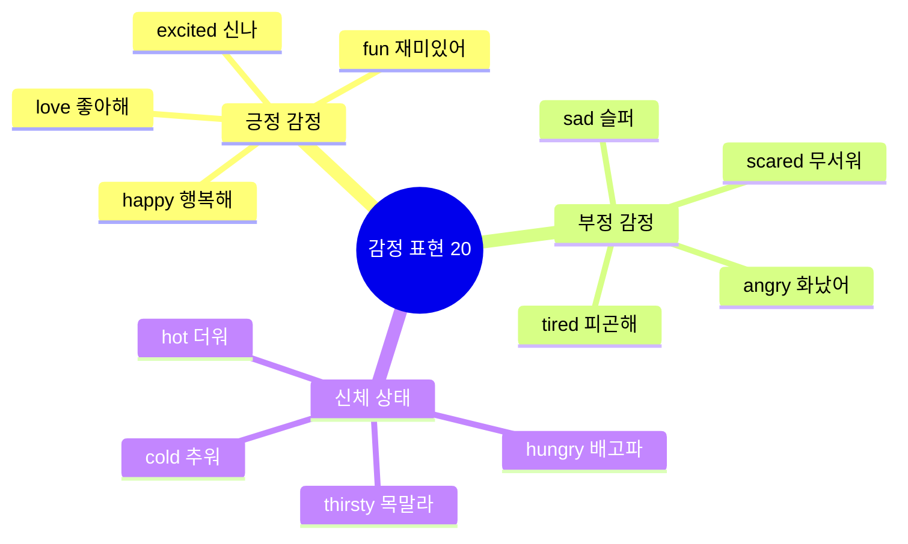

### 기본 감정 (036-045)

| No. | 패턴 | 청크 분해 | 한국어 |
|:---:|------|----------|--------|
| 036 | I'm happy! | I'm / so happy / today! | 나는 / 정말 행복해 / 오늘! |
| 037 | I'm sad. | I'm sad. / My toy / broke. | 나 슬퍼. / 내 장난감이 / 부서졌어. |
| 038 | I'm angry! | I'm angry! / That's / not fair! | 나 화났어! / 그건 / 불공평해! |
| 039 | I'm scared. | I'm scared / of the dark. | 나는 무서워 / 어둠이. |
| 040 | I'm tired. | I'm tired. / I want / to sleep. | 나 피곤해. / 나는 원해 / 자기를. |
| 041 | I'm excited! | I'm excited! / It's my birthday! | 나 신나! / 내 생일이야! |
| 042 | I'm shy. | I'm shy. / Don't look / at me. | 나 부끄러워. / 보지 마 / 나를. |
| 043 | I'm brave! | I'm brave! / I'm not scared! | 나 용감해! / 나는 안 무서워! |
| 044 | I'm okay. | I'm okay. / Don't worry. | 나 괜찮아. / 걱정하지 마. |
| 045 | I feel good! | I feel good / today! | 나는 기분 좋아 / 오늘! |

#### 036-045 패턴 상세 (일부)

#### 036. **I'm happy!** - 나 행복해!
```
I'm / so happy / today!
나는 / 정말 행복해 / 오늘!
```
**청크 포인트**: `I'm` (주어+동사) → `so happy` (감정 강조) → `today!` (시간)

**💬 실전 대화 턴 (선물 받았을 때)**
```
엄마: Look! I have a present for you!
      (봐! 너에게 줄 선물이 있어!)
      
아이: Wow! Thank you, Mommy! I'm so happy!
      (와! 고마워요, 엄마! 나 정말 행복해요!)
      
엄마: You're welcome, sweetie! Do you like it?
      (천만에, 얘야! 마음에 들어?)
      
아이: Yes! I love it!
      (네! 정말 좋아해요!)
```

**🎯 응용 연습**
- 생일 때: "I'm so happy! It's my birthday!"
- 친구와 놀 때: "I'm happy! Let's play!"
- 맛있는 거 먹을 때: "I'm so happy! This is yummy!"

- [ ] 청크 읽기 | [ ] 직독직해 | [ ] 소리 내기

#### 037. **I'm sad.** - 나 슬퍼.
```
I'm sad. / My toy / broke.
나 슬퍼. / 내 장난감이 / 부서졌어.
```
**청크 포인트**: `I'm sad.` (감정) → `My toy` (대상) → `broke.` (원인)

**💬 실전 대화 턴 (장난감 망가졌을 때)**
```
아이: Mommy, I'm sad. My toy broke!
      (엄마, 나 슬퍼요. 장난감이 부서졌어요!)
      
엄마: Oh no! Let me see. Can we fix it?
      (아이고! 내가 볼게. 고칠 수 있을까?)
      
아이: I don't know. I'm so sad!
      (몰라요. 너무 슬퍼요!)
      
엄마: Don't cry. Daddy will fix it!
      (울지 마. 아빠가 고쳐줄 거야!)
```

**🎯 응용 연습**
- 친구 없을 때: "I'm sad. My friend is gone."
- 아플 때: "I'm sad. I'm sick today."
- 못 갈 때: "I'm sad. I can't go to the park."

- [ ] 청크 읽기 | [ ] 직독직해 | [ ] 소리 내기

#### 038. **I'm angry!** - 나 화났어!
```
I'm angry! / That's / not fair!
나 화났어! / 그건 / 불공평해!
```
**청크 포인트**: `I'm angry!` (감정) → `That's` (지시) → `not fair!` (이유)

**💬 실전 대화 턴 (불공평할 때)**
```
아이: I'm angry! That's not fair!
      (나 화났어! 그건 불공평해!)
      
엄마: What happened? Why are you angry?
      (무슨 일이야? 왜 화났어?)
      
아이: He took my toy! I'm so angry!
      (그가 내 장난감을 가져갔어요! 너무 화나요!)
      
엄마: Let's talk about it. We can solve this.
      (얘기해보자. 해결할 수 있어.)
```

**🎯 응용 연습**
- 장난감 빼앗겼을 때: "I'm angry! Give it back!"
- 규칙 어겼을 때: "I'm angry! That's not fair!"
- 짜증날 때: "I'm angry! Leave me alone!"

- [ ] 청크 읽기 | [ ] 직독직해 | [ ] 소리 내기

### 좋고 싫음 (046-050)

| No. | 패턴 | 청크 분해 | 한국어 |
|:---:|------|----------|--------|
| 046 | I like it! | I like it! / It's / yummy! | 이거 좋아! / 이건 / 맛있어! |
| 047 | I love it! | I love it! / Thank you! | 이거 너무 좋아! / 고마워! |
| 048 | I hate it! | I hate / spiders! | 나는 정말 싫어 / 거미를! |
| 049 | It's fun! | It's / so fun! | 이건 / 정말 재미있어! |
| 050 | It's boring. | It's / boring. | 이건 / 지루해. |

#### 046-050 패턴 상세

#### 046. **I like it!** - 이거 좋아!
```
I like it! / It's / yummy!
이거 좋아! / 이건 / 맛있어!
```
**청크 포인트**: `I like it!` (좋아해) → `It's yummy!` (맛있어)

**💬 실전 대화 턴 (음식 먹을 때)**
```
엄마: Try this! Do you like it?
      (이거 먹어봐! 좋아해?)
      
아이: Mmm! I like it! It's yummy!
      (음! 나 이거 좋아해요! 맛있어요!)
      
엄마: Good! Do you want more?
      (좋아! 더 먹을래?)
      
아이: Yes, please! I really like it!
      (네, 부탁해요! 진짜 좋아해요!)
```

- [ ] 청크 읽기 | [ ] 직독직해 | [ ] 소리 내기

#### 047. **I love it!** - 이거 너무 좋아!
```
I love it! / Thank you!
이거 너무 좋아! / 고마워!
```
**청크 포인트**: `I love it!` (너무 좋아) → `Thank you!` (감사)

**💬 실전 대화 턴 (선물 받을 때)**
```
할머니: Here's a present for you!
        (너에게 선물이 있어!)
        
아이: Wow! A teddy bear! I love it!
      (와! 곰 인형이다! 너무 좋아요!)
      
할머니: I'm glad you like it!
        (네가 좋아하니 기뻐!)
        
아이: Thank you, Grandma! I love it so much!
      (고마워요, 할머니! 정말 너무 좋아요!)
```

- [ ] 청크 읽기 | [ ] 직독직해 | [ ] 소리 내기

#### 048. **I hate it!** - 이거 싫어!
```
I hate / spiders!
나는 정말 싫어 / 거미를!
```
**청크 포인트**: `I hate` (정말 싫어) → `spiders!` (거미)

**💬 실전 대화 턴 (무서운 것 봤을 때)**
```
아이: Ahhh! A spider! I hate spiders!
      (아아! 거미다! 나 거미 싫어요!)
      
엄마: It's okay! It's very small!
      (괜찮아! 아주 작아!)
      
아이: But I hate it! Take it away!
      (하지만 싫어요! 없애줘요!)
      
엄마: Okay, I'll put it outside!
      (알았어, 밖에 내보낼게!)
```

- [ ] 청크 읽기 | [ ] 직독직해 | [ ] 소리 내기

#### 049. **It's fun!** - 재미있어!
```
It's / so fun!
이건 / 정말 재미있어!
```
**청크 포인트**: `It's` (이건) → `so fun!` (정말 재미있어)

**💬 실전 대화 턴 (놀이터에서)**
```
아이: This slide is so fun!
      (이 미끄럼틀 정말 재미있어!)
      
친구: I know! Let's go again!
      (그러게! 다시 하자!)
      
아이: Okay! It's so fun! Whee!
      (좋아! 정말 재미있어! 위이!)
      
친구: One more time! It's so fun!
      (한 번 더! 정말 재미있어!)
```

- [ ] 청크 읽기 | [ ] 직독직해 | [ ] 소리 내기

#### 050. **It's boring.** - 지루해.
```
It's / boring.
이건 / 지루해.
```
**청크 포인트**: `It's` (이건) → `boring.` (지루해)

**💬 실전 대화 턴 (할 것 없을 때)**
```
아이: Mommy, I'm bored. It's boring here.
      (엄마, 심심해요. 여기 지루해요.)
      
엄마: Why don't you read a book?
      (책 읽어보는 게 어때?)
      
아이: Reading is boring. Can we play?
      (읽는 건 지루해요. 우리 놀 수 있어요?)
      
엄마: Okay! Let's play a game!
      (좋아! 게임하자!)
```

- [ ] 청크 읽기 | [ ] 직독직해 | [ ] 소리 내기

### 신체 상태 (051-055)

| No. | 패턴 | 청크 분해 | 한국어 |
|:---:|------|----------|--------|
| 051 | I'm hungry! | I'm hungry! / Can I / eat? | 배고파! / 제가 / 먹어도 되나요? |
| 052 | I'm thirsty! | I'm thirsty! / Water, / please! | 목말라! / 물 / 주세요! |
| 053 | I'm cold! | I'm cold! / Give me / a blanket. | 추워! / 나에게 줘요 / 담요를. |
| 054 | I'm hot! | I'm hot! / Turn on / the fan. | 더워! / 켜줘요 / 선풍기를. |
| 055 | I feel sick. | I feel sick. / My tummy / hurts. | 아파요. / 내 배가 / 아파요. |

#### 051-055 패턴 상세

#### 051. **I'm hungry!** - 배고파!
```
I'm hungry! / Can I / eat?
배고파요! / 제가 / 먹어도 되나요?
```

**💬 실전 대화 턴 (밥 먹고 싶을 때)**
```
아이: Mommy, I'm hungry! Can I eat?
      (엄마, 배고파요! 먹어도 되나요?)
      
엄마: Yes, of course! What do you want to eat?
      (그럼, 물론이지! 뭘 먹고 싶어?)
      
아이: I want pizza, please!
      (피자 먹고 싶어요, 부탁해요!)
      
엄마: Okay! Let's have pizza for lunch!
      (좋아! 점심으로 피자 먹자!)
```

**🎯 응용 연습**
- 아침에: "Mommy, I'm hungry! Time to eat breakfast!"
- 간식 시간: "I'm hungry! Can I have a snack?"
- 식당에서: "I'm hungry! What's for dinner?"

- [ ] 청크 읽기 | [ ] 직독직해 | [ ] 소리 내기

#### 052. **I'm thirsty!** - 목말라!
```
I'm thirsty! / Water, / please!
목말라요! / 물 / 주세요!
```
**청크 포인트**: `I'm thirsty!` (목말라) → `Water, please!` (물 주세요)

**💬 실전 대화 턴 (물 달라고 할 때)**
```
아이: Mommy, I'm thirsty! Water, please!
      (엄마, 목말라요! 물 주세요!)
      
엄마: Here you go! Drink slowly.
      (여기 있어! 천천히 마셔.)
      
아이: Ahh! Thank you! I was so thirsty!
      (아! 고마워요! 정말 목말랐어요!)
      
엄마: You're welcome! Do you want more?
      (천만에! 더 마실래?)
```

- [ ] 청크 읽기 | [ ] 직독직해 | [ ] 소리 내기

#### 053. **I'm cold!** - 추워!
```
I'm cold! / Give me / a blanket.
추워요! / 나에게 줘요 / 담요를.
```
**청크 포인트**: `I'm cold!` (추워) → `Give me a blanket.` (담요 줘)

**💬 실전 대화 턴 (추울 때)**
```
아이: Brrr! I'm cold! Give me a blanket!
      (부르르! 추워요! 담요 줘요!)
      
엄마: Here's a warm blanket for you!
      (여기 따뜻한 담요 있어!)
      
아이: Thank you! Now I'm warm!
      (고마워요! 이제 따뜻해요!)
      
엄마: Good! Stay under the blanket!
      (좋아! 담요 안에 있어!)
```

- [ ] 청크 읽기 | [ ] 직독직해 | [ ] 소리 내기

#### 054. **I'm hot!** - 더워!
```
I'm hot! / Turn on / the fan.
더워요! / 켜줘요 / 선풍기를.
```
**청크 포인트**: `I'm hot!` (더워) → `Turn on the fan.` (선풍기 켜줘)

**💬 실전 대화 턴 (더울 때)**
```
아이: Mommy, I'm hot! Turn on the fan!
      (엄마, 더워요! 선풍기 켜줘요!)
      
엄마: Okay! Here, the fan is on now.
      (알았어! 자, 선풍기 켰어.)
      
아이: Ahh! That's better! Thank you!
      (아! 나아졌다! 고마워요!)
      
엄마: Do you want some cold water too?
      (시원한 물도 마실래?)
```

- [ ] 청크 읽기 | [ ] 직독직해 | [ ] 소리 내기

#### 055. **I feel sick.** - 아파요.
```
I feel sick. / My tummy / hurts.
나 아파요. / 내 배가 / 아파요.
```
**청크 포인트**: `I feel sick.` (아파요) → `My tummy hurts.` (배가 아파요)

**💬 실전 대화 턴 (아플 때)**
```
아이: Mommy, I feel sick. My tummy hurts.
      (엄마, 아파요. 배가 아파요.)
      
엄마: Oh no! Let me see. Does it hurt here?
      (아이고! 내가 볼게. 여기 아파?)
      
아이: Yes! It hurts! I feel sick!
      (네! 아파요! 아파요!)
      
엄마: Lie down. I'll get you some medicine.
      (누워. 약 가져올게.)
```

- [ ] 청크 읽기 | [ ] 직독직해 | [ ] 소리 내기

---

## 🙏 Part 4: 요청하기 (Patterns 056-075)

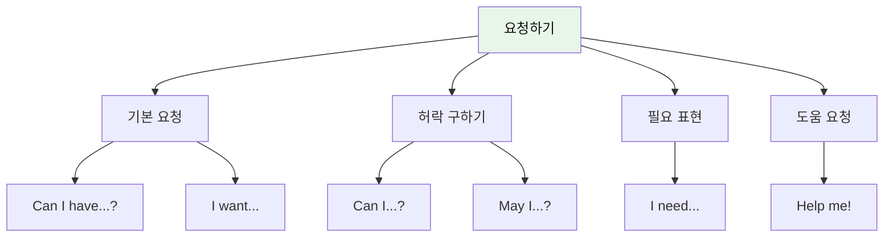

### 기본 요청 (056-065)

| No. | 패턴 | 청크 분해 | 한국어 |
|:---:|------|----------|--------|
| 056 | Can I have some water? | Can I have / some water? | 저 가질 수 있나요 / 물을 약간? |
| 057 | I want a cookie. | I want / a cookie. | 나는 원해요 / 쿠키를. |
| 058 | Give me the ball, please. | Give me / the ball, / please. | 나에게 줘요 / 그 공을, / 제발요. |
| 059 | Help me, please! | Help me, / please! / I can't reach it. | 도와주세요, / 제발! / 손이 닿지 않아요. |
| 060 | Wait for me! | Wait / for me! / I'm coming! | 기다려 / 나를! / 내가 가고 있어! |
| 061 | Look at this! | Look / at this! | 봐요 / 이것을! |
| 062 | Listen to me! | Listen / to me! | 들어요 / 나를! |
| 063 | Come here! | Come here, / please! | 여기 와요, / 제발요! |
| 064 | Go away! | Go away! / Leave me alone! | 저리 가요! / 나를 혼자 두세요! |
| 065 | Stop it! | Stop it! / I don't like it! | 그만해요! / 나는 싫어요! |

#### 056-065 패턴 상세 (일부)

#### 056. **Can I have [것]?** - ~를 줄 수 있어요?
```
Can I have / some water?
저 가질 수 있나요 / 물을 약간?
```
**청크 포인트**: `Can I have` (요청 표현) → `some water?` (원하는 것)

**💬 실전 대화 턴 (물 달라고 할 때)**
```
아이: Mommy, I'm thirsty. Can I have some water?
      (엄마, 목말라요. 물 좀 줄 수 있나요?)
      
엄마: Sure! Here you go.
      (물론이지! 여기 있어.)
      
아이: Thank you so much!
      (정말 고마워요!)
      
엄마: You're welcome, sweetie!
      (천만에, 얘야!)
```

**🎯 응용 연습**
- 간식: "Can I have a cookie, please?"
- 장난감: "Can I have the ball?"
- 우유: "Can I have some milk?"

- [ ] 청크 읽기 | [ ] 직독직해 | [ ] 소리 내기

#### 057. **I want [것].** - ~를 원해요.
```
I want / a cookie.
나는 원해요 / 쿠키를.
```
**청크 포인트**: `I want` (원해요) → `a cookie.` (쿠키를)

**💬 실전 대화 턴 (간식 달라고 할 때)**
```
아이: Mommy, I want a cookie!
      (엄마, 나 쿠키 먹고 싶어요!)
      
엄마: Okay, but just one. Here you go!
      (좋아, 하지만 하나만. 여기 있어!)
      
아이: Thank you! I love cookies!
      (고마워요! 나 쿠키 좋아해요!)
      
엄마: I know! Enjoy your cookie!
      (알아! 맛있게 먹어!)
```

- [ ] 청크 읽기 | [ ] 직독직해 | [ ] 소리 내기

#### 058. **Give me [것], please.** - ~를 주세요.
```
Give me / the ball, / please.
나에게 줘요 / 그 공을, / 제발요.
```
**청크 포인트**: `Give me` (줘요) → `the ball,` (공을) → `please.` (제발)

**💬 실전 대화 턴 (공놀이할 때)**
```
아이: Give me the ball, please!
      (공 주세요!)
      
친구: Okay! Here! Catch!
      (좋아! 자! 받아!)
      
아이: Thank you! Now I'll throw it to you!
      (고마워! 이제 내가 너한테 던질게!)
      
친구: Ready! Give me the ball!
      (준비됐어! 공 줘!)
```

- [ ] 청크 읽기 | [ ] 직독직해 | [ ] 소리 내기

### 허락 구하기 (066-070)

| No. | 패턴 | 청크 분해 | 한국어 |
|:---:|------|----------|--------|
| 066 | Can I go outside? | Can I go / outside? | 제가 가도 되나요 / 밖으로? |
| 067 | May I play? | May I / play? | 제가 해도 되나요 / 놀기를? |
| 068 | Can I play with this? | Can I play / with this? | 제가 놀아도 되나요 / 이것을 가지고? |
| 069 | Can I watch TV? | Can I watch / TV / now? | 제가 봐도 되나요 / TV를 / 지금? |
| 070 | Can I eat candy? | Can I eat / candy? | 제가 먹어도 되나요 / 사탕을? |

#### 066-070 패턴 상세

#### 066. **Can I go [장소]?** - ~에 가도 돼요?
```
Can I go / outside?
제가 가도 되나요 / 밖으로?
```
**청크 포인트**: `Can I go` (가도 되나요) → `outside?` (밖으로)

**💬 실전 대화 턴 (밖에 나가고 싶을 때)**
```
아이: Mommy, can I go outside?
      (엄마, 밖에 나가도 되요?)
      
엄마: Did you finish your lunch?
      (점심 다 먹었어?)
      
아이: Yes! Can I go outside now?
      (네! 이제 밖에 나가도 되요?)
      
엄마: Okay! But stay in the yard!
      (좋아! 하지만 마당에만 있어!)
```

- [ ] 청크 읽기 | [ ] 직독직해 | [ ] 소리 내기

#### 067. **May I [동사]?** - ~해도 되나요?
```
May I / play?
제가 해도 되나요 / 놀기를?
```
**청크 포인트**: `May I` (해도 되나요) → `play?` (놀기를)

**💬 실전 대화 턴 (선생님께 정중히 물을 때)**
```
아이: Teacher, may I play now?
      (선생님, 이제 놀아도 되나요?)
      
선생님: Did you finish your work?
        (숙제 다 끝냈니?)
        
아이: Yes! May I go to the playground?
      (네! 놀이터에 가도 되나요?)
        
선생님: Yes, you may! Have fun!
        (그래, 가도 돼! 재미있게 놀아!)
```

- [ ] 청크 읽기 | [ ] 직독직해 | [ ] 소리 내기

#### 068. **Can I play with [것]?** - ~로 놀아도 돼요?
```
Can I play / with this?
제가 놀아도 되나요 / 이것을 가지고?
```
**청크 포인트**: `Can I play` (놀아도 되나요) → `with this?` (이것으로)

**💬 실전 대화 턴 (친구 장난감 가지고 놀고 싶을 때)**
```
아이: That's a cool toy! Can I play with it?
      (그거 멋진 장난감이다! 그것으로 놀아도 돼?)
      
친구: Sure! Let's play together!
      (물론! 같이 놀자!)
      
아이: Thank you! Can I play with the car too?
      (고마워! 자동차로도 놀아도 돼?)
      
친구: Yes! We can share!
      (응! 같이 쓰자!)
```

- [ ] 청크 읽기 | [ ] 직독직해 | [ ] 소리 내기

### 필요 표현 (071-075)

| No. | 패턴 | 청크 분해 | 한국어 |
|:---:|------|----------|--------|
| 071 | I need my teddy bear. | I need / my teddy bear. | 나는 필요해요 / 내 곰 인형이. |
| 072 | I need to go potty. | I need / to go potty / now! | 나는 필요해요 / 화장실 가는 것이 / 지금! |
| 073 | Let me try! | Let me / try! | 내가 하게 해줘 / 해보기를! |
| 074 | One more, please! | One more / cookie, / please! | 하나 더 / 쿠키를, / 부탁해요! |
| 075 | Not yet! | Not yet! / Wait / a minute! | 아직 아니에요! / 기다려요 / 잠깐만! |

#### 071-075 패턴 상세

#### 071. **I need [것].** - ~가 필요해요.
```
I need / my teddy bear.
나는 필요해요 / 내 곰 인형이.
```
- [ ] 청크 읽기 | [ ] 직독직해 | [ ] 소리 내기

#### 072. **I need to go potty.** - 화장실 가야 해요.
```
I need / to go potty / now!
나는 필요해요 / 화장실 가는 것이 / 지금!
```
- [ ] 청크 읽기 | [ ] 직독직해 | [ ] 소리 내기

#### 073. **Let me [동사].** - 내가 ~할게요.
```
Let me / try!
내가 하게 해줘 / 해보기를!
```
- [ ] 청크 읽기 | [ ] 직독직해 | [ ] 소리 내기

#### 074. **One more, please!** - 하나 더요!
```
One more / cookie, / please!
하나 더 / 쿠키를, / 부탁해요!
```
- [ ] 청크 읽기 | [ ] 직독직해 | [ ] 소리 내기

#### 075. **Not yet!** - 아직이요!
```
Not yet! / Wait / a minute!
아직 아니에요! / 기다려요 / 잠깐만!
```
- [ ] 청크 읽기 | [ ] 직독직해 | [ ] 소리 내기

---

## 🏠 Part 5: 일상생활 (Patterns 076-100)

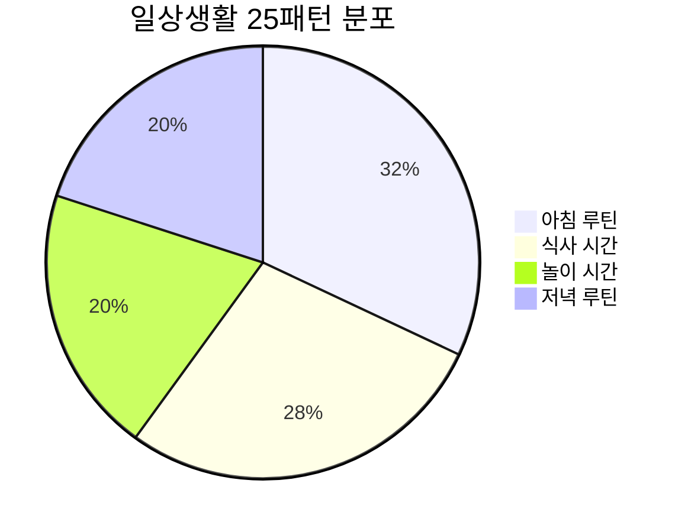

### 아침 루틴 (076-083)

| No. | 패턴 | 청크 분해 | 한국어 |
|:---:|------|----------|--------|
| 076 | Wake up! | Wake up! / It's / morning! | 일어나! / 지금은 / 아침이야! |
| 077 | Time to eat breakfast! | Time / to eat / breakfast! | 시간이야 / 먹을 / 아침을! |
| 078 | I'm getting dressed. | I'm / getting dressed / now. | 나는 / 옷 입는 중이야 / 지금. |
| 079 | I'm brushing my teeth. | I'm / brushing / my teeth. | 나는 / 닦는 중이야 / 내 이를. |
| 080 | I'm washing my face. | I'm / washing / my face. | 나는 / 씻는 중이야 / 내 얼굴을. |
| 081 | I'm combing my hair. | I'm / combing / my hair. | 나는 / 빗는 중이야 / 내 머리를. |
| 082 | Let's go to school! | Let's go / to school! | 가자 / 학교에! |
| 083 | Put on your shoes! | Put on / your shoes! | 신어요 / 너의 신발을! |

#### 076-083 패턴 상세 (일부)

#### 076. **Wake up!** - 일어나!
```
Wake up! / It's / morning!
일어나! / 지금은 / 아침이야!
```
- [ ] 청크 읽기 | [ ] 직독직해 | [ ] 소리 내기

#### 077. **Time to [동사]!** - ~할 시간이야!
```
Time / to eat / breakfast!
시간이야 / 먹을 / 아침을!
```
- [ ] 청크 읽기 | [ ] 직독직해 | [ ] 소리 내기

### 식사 시간 (084-090)

| No. | 패턴 | 청크 분해 | 한국어 |
|:---:|------|----------|--------|
| 084 | I'm eating an apple. | I'm eating / an apple. | 나는 먹는 중이야 / 사과 하나를. |
| 085 | Yummy! | Yummy! / I love / pizza! | 맛있어! / 나는 좋아해 / 피자를! |
| 086 | I'm full. | I'm full. / No more, / please. | 나 배불러요. / 더는 안돼요, / 제발요. |
| 087 | I'm done! | I'm done / eating! | 나 다 했어요 / 먹는 것을! |
| 088 | Can I have more? | Can I have / more juice? | 저 가질 수 있나요 / 더 많은 주스를? |
| 089 | It's delicious! | It's / delicious! | 이건 / 맛있어요! |
| 090 | I want seconds! | I want / seconds! | 나는 원해요 / 한 번 더! (두 번째 접시) |

#### 084-090 패턴 상세 (일부)

#### 084. **I'm eating [음식].** - ~먹고 있어.
```
I'm eating / an apple.
나는 먹는 중이야 / 사과 하나를.
```
- [ ] 청크 읽기 | [ ] 직독직해 | [ ] 소리 내기

#### 085. **Yummy!** - 맛있어!
```
Yummy! / I love / pizza!
맛있어! / 나는 좋아해 / 피자를!
```
- [ ] 청크 읽기 | [ ] 직독직해 | [ ] 소리 내기

### 놀이 시간 (091-095)

| No. | 패턴 | 청크 분해 | 한국어 |
|:---:|------|----------|--------|
| 091 | I'm playing with blocks. | I'm playing / with blocks. | 나는 노는 중이야 / 블록을 가지고. |
| 092 | Let's play together! | Let's play / together! | 놀자 / 함께! |
| 093 | It's my turn! | It's / my turn / now! | 지금은 / 내 차례야 / 지금! |
| 094 | Your turn! | Your turn! / Go / ahead! | 네 차례야! / 가 / 앞으로! (해봐!) |
| 095 | I won! | I won! / Yay! | 내가 이겼다! / 야호! |

#### 091-095 패턴 상세

#### 091. **I'm playing.** - 놀고 있어.
```
I'm playing / with blocks.
나는 노는 중이야 / 블록을 가지고.
```
- [ ] 청크 읽기 | [ ] 직독직해 | [ ] 소리 내기

#### 092. **Let's play!** - 같이 놀자!
```
Let's play / together!
놀자 / 함께!
```
- [ ] 청크 읽기 | [ ] 직독직해 | [ ] 소리 내기

### 저녁 루틴 (096-100)

| No. | 패턴 | 청크 분해 | 한국어 |
|:---:|------|----------|--------|
| 096 | I'm home! | I'm home! / Where's / Mom? | 나 집에 왔어요! / 어디 있나요 / 엄마는? |
| 097 | I'm taking a bath. | I'm / taking a bath / now. | 나는 / 목욕하는 중이야 / 지금. |
| 098 | I'm going to bed. | I'm going / to bed. / Good night! | 나는 가요 / 침대로. / 잘 자요! |
| 099 | Sweet dreams! | Sweet dreams! / See you / tomorrow! | 좋은 꿈 꿔! / 봐요 / 내일! |
| 100 | I love you! | I love you, / Mom! | 사랑해요, / 엄마! |

#### 096-100 패턴 상세

#### 096. **I'm home!** - 나 왔어!
```
I'm home! / Where's / Mom?
나 집에 왔어요! / 어디 있나요 / 엄마는?
```
- [ ] 청크 읽기 | [ ] 직독직해 | [ ] 소리 내기

#### 097. **I'm taking a bath.** - 목욕하고 있어.
```
I'm / taking a bath / now.
나는 / 목욕하는 중이야 / 지금.
```
- [ ] 청크 읽기 | [ ] 직독직해 | [ ] 소리 내기

#### 098. **I'm going to bed.** - 자러 갈게.
```
I'm going / to bed. / Good night!
나는 가요 / 침대로. / 잘 자요!
```
- [ ] 청크 읽기 | [ ] 직독직해 | [ ] 소리 내기

#### 099. **Sweet dreams!** - 좋은 꿈 꿔!
```
Sweet dreams! / See you / tomorrow!
좋은 꿈 꿔! / 봐요 / 내일!
```
- [ ] 청크 읽기 | [ ] 직독직해 | [ ] 소리 내기

#### 100. **I love you!** - 사랑해요!
```
I love you, / Mom!
사랑해요, / 엄마!
```
- [ ] 청크 읽기 | [ ] 직독직해 | [ ] 소리 내기

---

## ✈️ Part 6: 여행 기초 (Patterns 101-115)

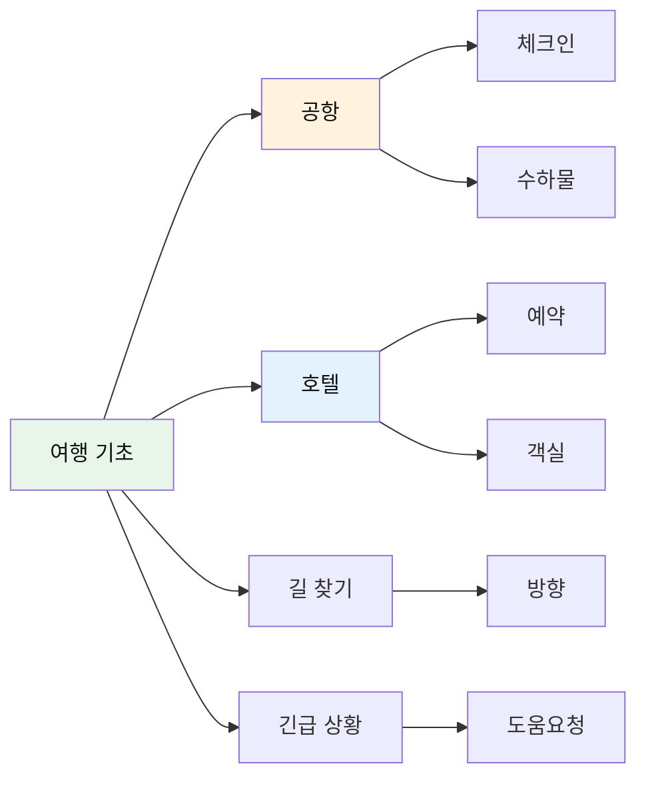

### 공항 기본 (101-105)

| No. | 패턴 | 청크 분해 | 한국어 |
|:---:|------|----------|--------|
| 101 | Where is the bathroom? | Where is / the bathroom? | 어디 있나요 / 화장실이? |
| 102 | I need help. | I need / help. | 나는 필요해요 / 도움이. |
| 103 | I'm lost. | I'm lost. / Can you help me? | 나 길을 잃었어요. / 도와줄 수 있나요? |
| 104 | This is my bag. | This is / my bag. | 이것은 / 내 가방이에요. |
| 105 | Thank you for helping! | Thank you / for helping! | 고마워요 / 도와줘서! |

#### 101-105 패턴 상세

#### 101. **Where is the bathroom?** - 화장실이 어디 있나요?
```
Where is / the bathroom?
어디 있나요 / 화장실이?
```
**청크 포인트**: `Where is` (장소 질문) → `the bathroom?` (찾는 곳)

**💬 실전 대화 턴 (화장실 급할 때)**
```
아이: Excuse me! Where is the bathroom?
      (실례합니다! 화장실이 어디 있나요?)
      
직원: It's over there. Turn left.
      (저기 있어요. 왼쪽으로 도세요.)
      
아이: Thank you for helping!
      (도와주셔서 고마워요!)
      
직원: You're welcome!
      (천만에요!)
```

**🎯 응용 연습**
- 엄마 찾기: "Excuse me, where is my mom?"
- 장난감 가게: "Where is the toy store?"
- 출구 찾기: "Where is the exit?"

- [ ] 청크 읽기 | [ ] 직독직해 | [ ] 소리 내기

#### 102. **I need help.** - 도움이 필요해요.
```
I need / help.
나는 필요해요 / 도움이.
```
**청크 포인트**: `I need` (필요해요) → `help.` (도움이)

**💬 실전 대화 턴 (도움 요청할 때)**
```
아이: Excuse me! I need help!
      (실례합니다! 도움이 필요해요!)
      
직원: What's wrong? How can I help?
      (무슨 일이니? 어떻게 도와줄까?)
      
아이: I can't find my mom! I need help!
      (엄마를 찾을 수 없어요! 도움이 필요해요!)
      
직원: Don't worry. Let's find her together!
      (걱정 마. 같이 찾자!)
```

- [ ] 청크 읽기 | [ ] 직독직해 | [ ] 소리 내기

#### 103. **I'm lost.** - 나 길을 잃었어요.
```
I'm lost. / Can you help me?
나 길을 잃었어요. / 도와줄 수 있나요?
```
**청크 포인트**: `I'm lost.` (길 잃었어요) → `Can you help me?` (도와줄 수 있나요)

**💬 실전 대화 턴 (길 잃었을 때)**
```
아이: Excuse me! I'm lost! Can you help me?
      (실례합니다! 길을 잃었어요! 도와줄 수 있나요?)
      
어른: Oh no! Where's your mom?
      (어머나! 엄마 어디 계시니?)
      
아이: I don't know! I'm lost! I'm scared!
      (몰라요! 길 잃었어요! 무서워요!)
      
어른: Stay with me. We'll find her!
      (나랑 있어. 찾을 거야!)
```

- [ ] 청크 읽기 | [ ] 직독직해 | [ ] 소리 내기

### 호텔 기본 (106-110)

| No. | 패턴 | 청크 분해 | 한국어 |
|:---:|------|----------|--------|
| 106 | This is my room. | This is / my room. | 이것은 / 내 방이에요. |
| 107 | Where is my bed? | Where is / my bed? | 어디 있나요 / 내 침대가? |
| 108 | I like this room! | I like / this room! | 나는 좋아해요 / 이 방을! |
| 109 | Can I watch TV? | Can I watch / TV? | 제가 봐도 되나요 / TV를? |
| 110 | Good morning! | Good morning! / What's for breakfast? | 좋은 아침이에요! / 뭐예요 아침은? |

#### 106-110 패턴 상세

#### 106. **This is my room.** - 이것은 내 방이에요.
```
This is / my room.
이것은 / 내 방이에요.
```
- [ ] 청크 읽기 | [ ] 직독직해 | [ ] 소리 내기

#### 107. **Where is my bed?** - 내 침대가 어디 있나요?
```
Where is / my bed?
어디 있나요 / 내 침대가?
```
- [ ] 청크 읽기 | [ ] 직독직해 | [ ] 소리 내기

### 긴급 상황 (111-115)

| No. | 패턴 | 청크 분해 | 한국어 |
|:---:|------|----------|--------|
| 111 | Help! | Help! / I need / an adult! | 도와주세요! / 나는 필요해요 / 어른이! |
| 112 | I can't find my mom. | I can't find / my mom. | 나는 찾을 수 없어요 / 우리 엄마를. |
| 113 | I'm scared. | I'm scared. / Where's my dad? | 나 무서워요. / 어디 있나요 우리 아빠는? |
| 114 | Call my mom! | Call / my mom! | 전화해 주세요 / 우리 엄마한테! |
| 115 | I don't speak English well. | I don't speak / English / well. | 나는 못해요 / 영어를 / 잘. |

#### 111-115 패턴 상세

#### 111. **Help!** - 도와주세요!
```
Help! / I need / an adult!
도와주세요! / 나는 필요해요 / 어른이!
```
**청크 포인트**: `Help!` (도와주세요) → `I need an adult!` (어른이 필요해요)

**💬 실전 대화 턴 (긴급할 때)**
```
아이: Help! Help! I need an adult!
      (도와주세요! 도와주세요! 어른이 필요해요!)
      
어른: What's wrong? Are you okay?
      (무슨 일이야? 괜찮니?)
      
아이: Help! I can't find my mommy!
      (도와주세요! 엄마를 못 찾겠어요!)
      
어른: Stay calm. I'll help you find her!
      (진정해. 내가 찾는 것 도와줄게!)
```

- [ ] 청크 읽기 | [ ] 직독직해 | [ ] 소리 내기

#### 112. **I can't find my mom.** - 엄마를 찾을 수 없어요.
```
I can't find / my mom.
나는 찾을 수 없어요 / 우리 엄마를.
```
**청크 포인트**: `I can't find` (찾을 수 없어요) → `my mom.` (엄마를)

**💬 실전 대화 턴 (엄마 못 찾을 때)**
```
아이: Excuse me! I can't find my mom!
      (실례합니다! 엄마를 못 찾겠어요!)
      
직원: Oh! What does she look like?
      (어머! 엄마가 어떻게 생겼니?)
      
아이: She has long hair! I can't find her!
      (긴 머리예요! 못 찾겠어요!)
      
직원: Let's go to the front desk together!
      (안내 데스크로 같이 가자!)
```

- [ ] 청크 읽기 | [ ] 직독직해 | [ ] 소리 내기

---

## 🚗 Part 7: 여행 교통 (Patterns 116-125)

### 교통수단 (116-125)

| No. | 패턴 | 청크 분해 | 한국어 |
|:---:|------|----------|--------|
| 116 | I want to go to the park. | I want to go / to the park. | 나는 가고 싶어요 / 공원에. |
| 117 | Are we there yet? | Are we / there / yet? | 우리 / 거기에 / 이미 도착했나요? |
| 118 | How long will it take? | How long / will it take? | 얼마나 오래 / 걸릴까요? |
| 119 | I feel sick. | I feel sick. / I need / fresh air. | 나 아파요. / 나는 필요해요 / 신선한 공기가. |
| 120 | Can we stop here? | Can we stop / here? | 우리 멈출 수 있나요 / 여기서? |
| 121 | This bus is big! | This bus / is big! | 이 버스는 / 커요! |
| 122 | I like the train! | I like / the train! | 나는 좋아해요 / 기차를! |
| 123 | Look out the window! | Look / out the window! | 봐요 / 창문 밖을! |
| 124 | We're here! | We're here! / Let's get off! | 우리 도착했어요! / 내려요! |
| 125 | I'm tired of sitting. | I'm tired / of sitting. | 나는 피곤해요 / 앉아 있는 것이. |

#### 116-125 패턴 상세 (일부)

#### 116. **I want to go to [장소].** - ~에 가고 싶어요.
```
I want to go / to the park.
나는 가고 싶어요 / 공원에.
```
- [ ] 청크 읽기 | [ ] 직독직해 | [ ] 소리 내기

#### 117. **Are we there yet?** - 아직 안 도착했나요?
```
Are we / there / yet?
우리 / 거기에 / 이미 도착했나요?
```
- [ ] 청크 읽기 | [ ] 직독직해 | [ ] 소리 내기

---

## 🍽️ Part 8: 여행 식당 (Patterns 126-135)

### 식당 표현 (126-135)

| No. | 패턴 | 청크 분해 | 한국어 |
|:---:|------|----------|--------|
| 126 | I'm hungry! | I'm hungry! / Can we eat? | 배고파요! / 우리 먹을 수 있나요? |
| 127 | What's this? | What's this? / Is it yummy? | 이게 뭐예요? / 맛있나요? |
| 128 | I want chicken nuggets. | I want / chicken nuggets. | 나는 원해요 / 치킨 너겟을. |
| 129 | Can I have fries? | Can I have / fries? | 저 가질 수 있나요 / 감자튀김을? |
| 130 | I don't like this. | I don't like / this. | 나는 싫어해요 / 이것을. |
| 131 | It's too hot! | It's / too hot! | 이건 / 너무 뜨거워요! |
| 132 | I need a spoon. | I need / a spoon. | 나는 필요해요 / 숟가락이. |
| 133 | More water, please! | More water, / please! | 물 더 주세요, / 제발요! |
| 134 | I'm finished! | I'm finished! / Thank you! | 나 다 먹었어요! / 고마워요! |
| 135 | That was delicious! | That was / delicious! | 그것은 / 맛있었어요! |

#### 126-135 패턴 상세 (일부)

#### 126. **I'm hungry!** - 배고파요!
```
I'm hungry! / Can we eat?
배고파요! / 우리 먹을 수 있나요?
```

**💬 실전 대화 턴 (식당에서)**
```
아이: Daddy, I'm hungry! Can we eat?
      (아빠, 배고파요! 우리 먹을 수 있나요?)
      
아빠: Sure! What do you want to eat?
      (물론이지! 뭘 먹고 싶어?)
      
아이: I want chicken nuggets!
      (치킨 너겟 먹고 싶어요!)
      
아빠: Okay! Let's order chicken nuggets!
      (좋아! 치킨 너겟을 주문하자!)
```

**🎯 응용 연습**
- 햄버거 먹고 싶을 때: "I'm hungry! Can I have a hamburger?"
- 피자 먹고 싶을 때: "I'm hungry! I want pizza!"

- [ ] 청크 읽기 | [ ] 직독직해 | [ ] 소리 내기

#### 127. **What's this?** - 이게 뭐예요?
```
What's this? / Is it yummy?
이게 뭐예요? / 맛있나요?
```
- [ ] 청크 읽기 | [ ] 직독직해 | [ ] 소리 내기

---

## ❓ Part 9: 기본 질문 (Patterns 136-150)

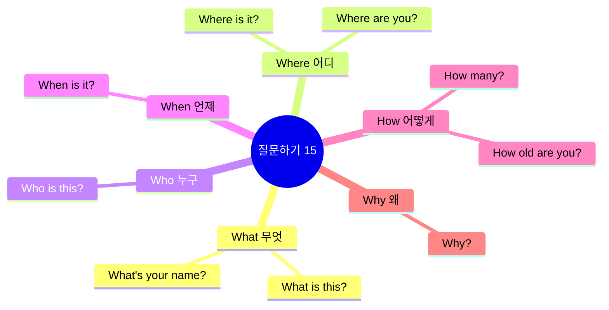

### 기본 질문 (136-150)

| No. | 패턴 | 청크 분해 | 한국어 |
|:---:|------|----------|--------|
| 136 | What is this? | What / is this? | 무엇이니 / 이것은? |
| 137 | What is that? | What / is that / over there? | 무엇이니 / 저것은 / 저 너머에 있는? |
| 138 | Who is this? | Who / is this / in the picture? | 누구니 / 이 사람은 / 사진 속의? |
| 139 | What color is it? | What color / is / this flower? | 무슨 색이니 / ~는 / 이 꽃은? |
| 140 | What's your name? | Hi! / What's / your name? | 안녕! / 무엇이니 / 너의 이름은? |
| 141 | Where is my backpack? | Where is / my backpack? | 어디 있나요 / 내 배낭이? |
| 142 | Where are you? | Where / are you, / Mommy? | 어디 / 있나요 당신은, / 엄마? |
| 143 | When is my birthday? | When is / my birthday? | 언제인가요 / 내 생일이? |
| 144 | How old are you? | How old / are you? | 얼마나 나이 들었니 / 너는? |
| 145 | How many? | How many / cookies / are there? | 얼마나 많은 / 쿠키가 / 있나요 거기에? |
| 146 | Why? | Why / can't I / go? | 왜 / 저는 할 수 없나요 / 가는 것을? |
| 147 | Why not? | Why not? / I want / to play! | 왜 안 돼요? / 나는 원해요 / 노는 것을! |
| 148 | Really? | Really? / Is it / true? | 진짜요? / 그것은 / 사실인가요? |
| 149 | Are you okay? | Are you okay? / Did you / fall? | 너 괜찮니? / 너 했니 / 넘어지기를? |
| 150 | Do you like chocolate? | Do you like / chocolate? | 너 좋아하니 / 초콜릿을? |

#### 136-150 패턴 상세 (일부)

#### 136. **What is this?** - 이게 뭐야?
```
What / is this?
무엇이니 / 이것은?
```

**💬 실전 대화 턴 (새로운 것 봤을 때)**
```
아이: Mommy, what is this?
      (엄마, 이게 뭐예요?)
      
엄마: That's a butterfly!
      (그건 나비야!)
      
아이: Wow! It's beautiful!
      (와! 아름다워요!)
      
엄마: Yes, it is!
      (그렇지!)
```

**🎯 응용 연습**
- 박물관에서: "What is this animal?"
- 식당에서: "What is this food?"
- 가게에서: "What is this toy?"

- [ ] 청크 읽기 | [ ] 직독직해 | [ ] 소리 내기

#### 140. **What's your name?** - 이름이 뭐야?
```
Hi! / What's / your name?
안녕! / 무엇이니 / 너의 이름은?
```
**청크 포인트**: `What's` (무엇이니) → `your name?` (너의 이름은)

**💬 실전 대화 턴 (새 친구에게 물을 때)**
```
아이: Hi! What's your name?
      (안녕! 너 이름이 뭐야?)
      
친구: My name is Lisa! What's your name?
      (내 이름은 리사야! 너 이름은 뭐야?)
      
아이: I'm Tom! Nice to meet you, Lisa!
      (나는 톰이야! 만나서 반가워, 리사!)
      
친구: Nice to meet you too! Let's be friends!
      (나도 만나서 반가워! 우리 친구하자!)
```

- [ ] 청크 읽기 | [ ] 직독직해 | [ ] 소리 내기

#### 141. **Where is [것]?** - ~가 어디 있어?
```
Where is / my backpack?
어디 있나요 / 내 배낭이?
```
**청크 포인트**: `Where is` (어디 있나요) → `my backpack?` (내 배낭이)

**💬 실전 대화 턴 (물건 찾을 때)**
```
아이: Mommy, where is my backpack?
      (엄마, 내 배낭 어디 있어요?)
      
엄마: Did you check your room?
      (네 방 확인했어?)
      
아이: Yes! Where is it? I can't find it!
      (네! 어디 있어요? 못 찾겠어요!)
      
엄마: Look behind the door! It's there!
      (문 뒤에 봐! 거기 있어!)
```

- [ ] 청크 읽기 | [ ] 직독직해 | [ ] 소리 내기

#### 146. **Why?** - 왜?
```
Why / can't I / go?
왜 / 저는 할 수 없나요 / 가는 것을?
```
- [ ] 청크 읽기 | [ ] 직독직해 | [ ] 소리 내기

#### 150. **Do you like [것]?** - ~좋아해?
```
Do you like / chocolate?
너 좋아하니 / 초콜릿을?
```
**청크 포인트**: `Do you like` (좋아하니) → `chocolate?` (초콜릿을)

**💬 실전 대화 턴 (친구와 대화할 때)**
```
아이: Do you like chocolate?
      (너 초콜릿 좋아해?)
      
친구: Yes! I love chocolate! Do you?
      (응! 초콜릿 정말 좋아해! 너는?)
      
아이: Me too! Do you like ice cream?
      (나도! 아이스크림 좋아해?)
      
친구: Of course! Let's get some ice cream!
      (당연하지! 아이스크림 먹으러 가자!)
```

- [ ] 청크 읽기 | [ ] 직독직해 | [ ] 소리 내기

---

## 📊 전체 패턴 분석

### 카테고리별 분포

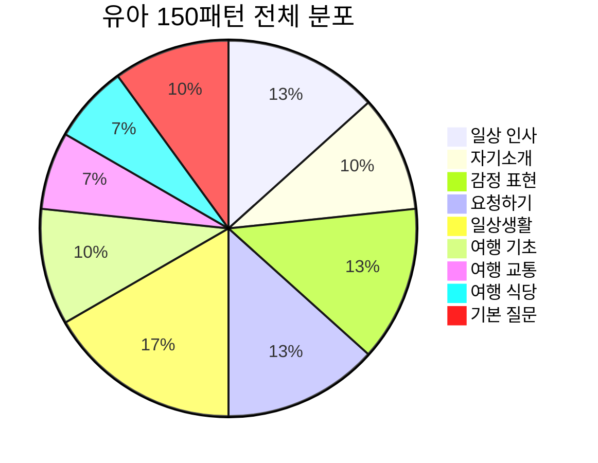

### 학습 난이도 분포

| 난이도 | 패턴 수 | 카테고리 | 특징 |
|--------|---------|----------|------|
| **초급** | 70개 | 인사, 소개, 기본 감정 | 1-3단어 문장 |
| **중급** | 50개 | 요청, 일상생활 | 3-5단어 문장 |
| **고급** | 30개 | 여행, 복잡한 질문 | 5단어 이상 문장 |

### 주제별 활용도

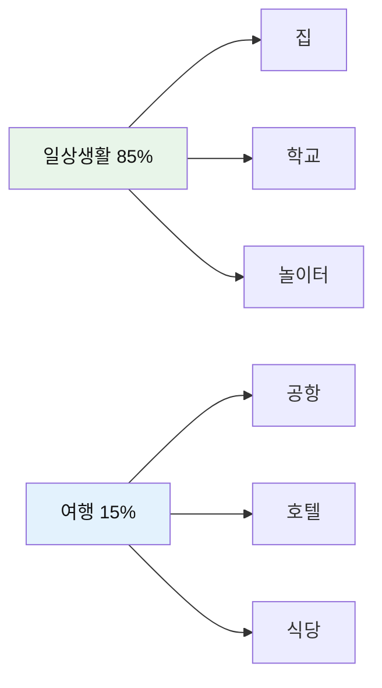

---

## 💡 학습 가이드

### 주간 학습 계획표

| 요일 | 학습 범위 | 패턴 수 | 주제 | 예상 시간 |
|------|-----------|---------|------|-----------|
| **월요일** | 001-030 | 30개 | 인사 + 소개 | 30분 |
| **화요일** | 031-055 | 25개 | 감정 표현 | 25분 |
| **수요일** | 056-075 | 20개 | 요청하기 | 20분 |
| **목요일** | 076-100 | 25개 | 일상생활 | 25분 |
| **금요일** | 101-125 | 25개 | 여행 기초 + 교통 | 25분 |
| **토요일** | 126-150 | 25개 | 식당 + 질문 | 25분 |
| **일요일** | 전체 복습 | 150개 | 전체 패턴 | 60분 |

### 청크 학습 4단계

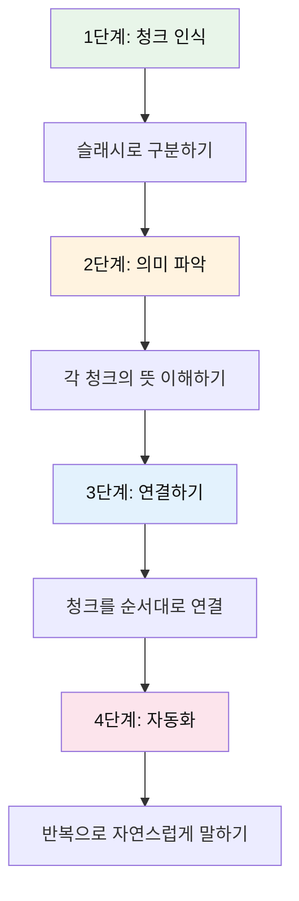

### 실전 활용 팁

| 상황 | 추천 패턴 | 활용 예시 |
|------|----------|-----------|
| **아침에 일어났을 때** | 076-083 | Wake up! → I'm brushing my teeth. → Let's go! |
| **배고플 때** | 051, 126-135 | I'm hungry! → Can I have fries? → Yummy! |
| **놀이터에서** | 091-095 | Let's play together! → It's my turn! → I won! |
| **길을 잃었을 때** | 103, 111-115 | I'm lost. → I need help. → I can't find my mom. |

---

## 🎯 마스터 체크리스트

### 전체 진도 확인

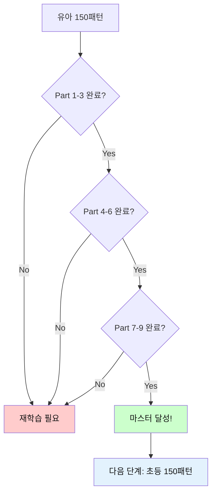

### 레벨별 목표

| 레벨 | 목표 | 기준 | 보상 |
|------|------|------|------|
| **Bronze** | 50개 패턴 | 청크 읽기 완료 | 🥉 |
| **Silver** | 100개 패턴 | 직독직해 완료 | 🥈 |
| **Gold** | 150개 패턴 | 소리 내기 완료 | 🥇 |
| **Master** | 실전 활용 | 상황별 사용 가능 | ⭐ |

---

*Last Updated: 2026-01-10*
*Total Patterns: 150개 | Daily Practice: 20-30분 | Complete in: 1주일*

