# 📚 전설의 초등 회화 150패턴 - 청크 마스터

## 🎯 학습 안내

초등학생 수준에서 일상생활과 여행에서 꼭 필요한 **150가지 핵심 패턴**을 청크(Chunk, 의미 단위) 형태로 익히는 과정입니다. 문장의 구조를 이해하고 원어민의 어순으로 생각하는 훈련을 통해 실전 회화 실력을 키웁니다.

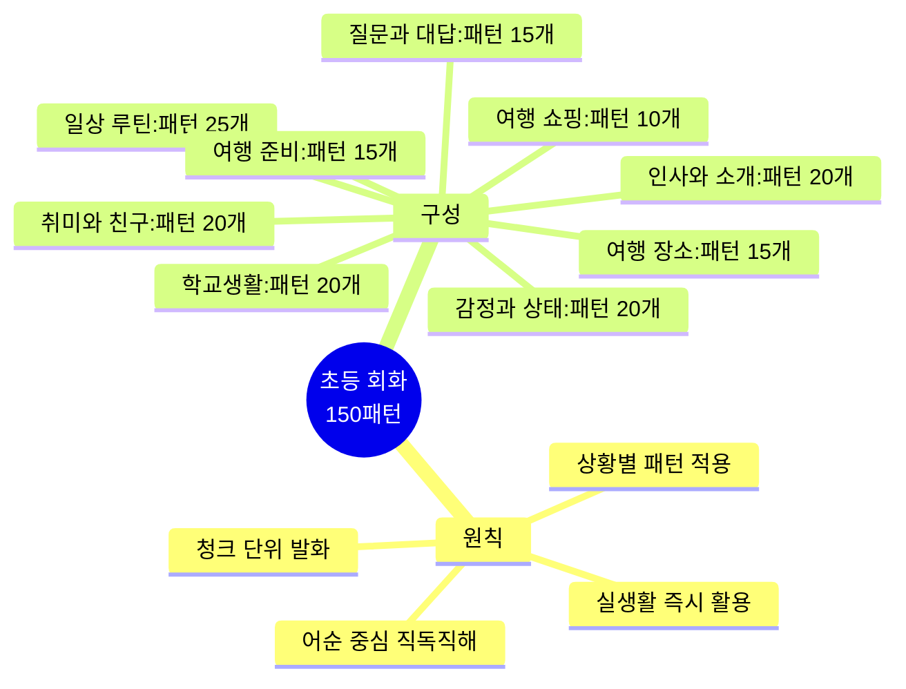

---

## 📊 전체 구조 한눈에 보기

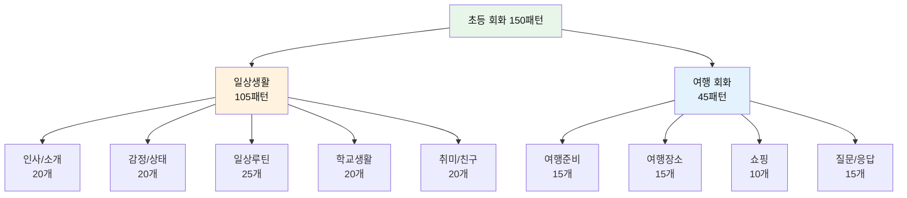

---

## 📚 학습 방법

| 단계 | 방법 | 시간 | 핵심 포인트 |
|------|------|------|-------------|
| **1단계** | 청크 읽기 | 30초 | 슬래시(/) 기준으로 의미 단위 파악 |
| **2단계** | 직독직해 | 1분 | 영어 어순 그대로 한국어 뜻 매칭 |
| **3단계** | 소리 내기 | 2분 | 억양과 강세 살려 3번 이상 반복 |
| **4단계** | 패턴 변형 | 2분 | 단어를 바꿔가며 응용 연습 |
| **5단계** | 실전 테스트 | 3분 | 상황별로 패턴 즉시 사용하기 |

---

## 👋 Part 1: 인사와 자기소개 (Patterns 001-020)

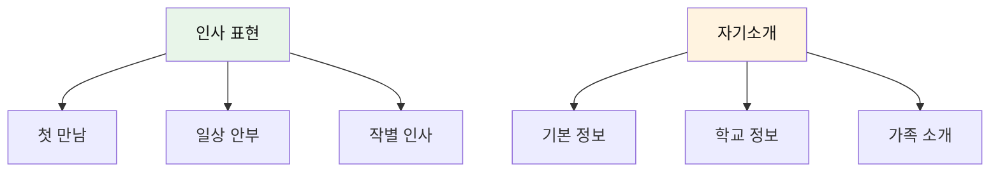

### 기본 인사 (001-010)

| No. | 패턴 | 청크 분해 | 한국어 | 활용도 |
|:---:|------|----------|--------|:------:|
| 001 | Hi there! How's it going? | Hi there! / How's it / going? | 안녕! / 어떻게 / 지내? | ⭐⭐⭐⭐⭐ |
| 002 | Hey! What's up? | Hey! / What's up, / dude? | 야! / 별일 없어, / 친구야? | ⭐⭐⭐⭐⭐ |
| 003 | Good to see you! | Good to see you / again! | 만나서 좋아 / 다시! | ⭐⭐⭐⭐ |
| 004 | Long time no see! | Long time / no see! / Where have you been? | 오랜 시간 동안 / 보지 못했네! / 너 어디 있었어? | ⭐⭐⭐ |
| 005 | How's it going? | Hey, / how's it / going? | 야, / 어떻게 / 지내? | ⭐⭐⭐⭐⭐ |
| 006 | What's new? | What's new / with you? | 무슨 새로운 일 있어 / 너에게? | ⭐⭐⭐⭐ |
| 007 | How was your day? | How was / your day / at school? | 어떠했니 / 너의 하루는 / 학교에서? | ⭐⭐⭐⭐⭐ |
| 008 | See you tomorrow! | See you / tomorrow / at school! | 보자 / 내일 / 학교에서! | ⭐⭐⭐⭐⭐ |
| 009 | Take care! | Take care! / See you / later! | 조심해서 가! / 보자 / 나중에! | ⭐⭐⭐⭐ |
| 010 | Have a good one! | Have / a good one! / Bye! | 가져라 / 좋은 하루를! / 안녕! | ⭐⭐⭐ |

#### 001-010 패턴 상세

#### 001. **Hi there! How's it going?** - 안녕! 어떻게 지내?
```
Hi there! / How's it / going?
안녕! / 어떻게 / 지내?
```
**청크 포인트**: `Hi there!` (친근한 인사) → `How's it` (어떻게) → `going?` (진행되고 있니)
**활용 상황**: 친구를 만났을 때 일상적으로 사용

**💬 실전 대화 턴 (학교에서 친구 만났을 때)**
```
A: Hi there! How's it going?
   (안녕! 어떻게 지내?)
   
B: Hey! Pretty good! How about you?
   (야! 꽤 좋아! 너는?)
   
A: I'm doing great! Want to play basketball after school?
   (나 아주 잘 지내! 방과 후에 농구 할래?)
   
B: Sure! That sounds fun!
   (물론이지! 재미있을 것 같아!)
```

**🎯 응용 연습**
- 아침에 친구에게: "Hi there! How's it going today?"
- 점심시간에: "Hey! How's it going? Let's eat together!"
- 주말에 만났을 때: "Hi! How's it going? What did you do this weekend?"

- [ ] 청크 읽기 | [ ] 직독직해 | [ ] 소리 내기

#### 002. **Hey! What's up?** - 야! 뭐해?
```
Hey! / What's up, / dude?
야! / 별일 없어, / 친구야?
```
**청크 포인트**: `Hey!` (호출) → `What's up,` (무슨 일) → `dude?` (친구)
**활용 상황**: 가까운 친구에게 캐주얼하게 인사할 때

**💬 실전 대화 턴 (복도에서 친구 만났을 때)**
```
A: Hey! What's up, dude?
   (야! 뭐해, 친구?)
   
B: Not much! Just finished math class. You?
   (별일 없어! 방금 수학 수업 끝났어. 너는?)
   
A: Same! The test was so hard. What's up after school?
   (나도! 시험 너무 어려웠어. 방과 후에 뭐 해?)
   
B: Nothing planned! Want to play basketball?
   (계획 없어! 농구 할래?)
```

**🎯 응용 연습**
- 점심시간: "Hey! What's up? Want to eat together?"
- 주말에: "Hey! What's up this weekend?"
- 온라인에서: "Hey! What's up? Are you gaming?"

- [ ] 청크 읽기 | [ ] 직독직해 | [ ] 소리 내기

#### 003. **Good to see you!** - 다시 보니 좋다!
```
Good to see you / again!
만나서 좋아 / 다시!
```
**청크 포인트**: `Good to see you` (만나서 좋다) → `again!` (다시)
**활용 상황**: 오랜만에 만난 친구에게

**💬 실전 대화 턴 (개학 첫날)**
```
A: Hey! Good to see you again!
   (야! 다시 보니 좋다!)
   
B: Good to see you too! How was your vacation?
   (나도 보니 좋아! 방학 어땠어?)
   
A: It was awesome! I went to the beach! How about you?
   (최고였어! 해변에 갔어! 너는?)
   
B: I stayed home but played lots of games. Good to see you back!
   (나는 집에 있었지만 게임 많이 했어. 다시 보니 좋다!)
```

**🎯 응용 연습**
- 친구에게: "Good to see you! I missed you!"
- 선생님께: "Good to see you again, teacher!"
- 이웃에게: "Good to see you! How have you been?"

- [ ] 청크 읽기 | [ ] 직독직해 | [ ] 소리 내기

#### 004. **Long time no see!** - 오랜만이야!
```
Long time / no see! / Where have you been?
오랜 시간 동안 / 보지 못했네! / 너 어디 있었어?
```
**청크 포인트**: `Long time` (오랜 시간) → `no see!` (보지 못했네) → `Where have you been?` (어디 있었어)

**💬 실전 대화 턴 (여름방학 후 친구 만났을 때)**
```
A: Hey! Long time no see! Where have you been?
   (야! 오랜만이야! 어디 있었어?)
   
B: Hi! I went to my grandma's house for vacation. How about you?
   (안녕! 방학 동안 할머니 댁에 갔었어. 너는?)
   
A: I went to the beach! It was so fun!
   (나는 해변에 갔어! 정말 재미있었어!)
   
B: That sounds amazing! We should catch up soon!
   (정말 멋지다! 우리 곧 만나서 얘기하자!)
```

**🎯 응용 연습**
- 오랜만에 만난 친구: "Long time no see! I missed you!"
- 전학 갔다 온 친구: "Long time no see! How was your new school?"
- 아팠던 친구: "Long time no see! Are you feeling better now?"

- [ ] 청크 읽기 | [ ] 직독직해 | [ ] 소리 내기

#### 005-010 패턴 (간략)

#### 005. **How's it going?**
```
Hey, / how's it / going?
야, / 어떻게 / 지내?
```
**청크 포인트**: `Hey,` (호출) → `how's it` (어떻게) → `going?` (지내)

**💬 실전 대화 턴 (점심시간에 친구와)**
```
A: Hey, how's it going?
   (야, 어떻게 지내?)
   
B: Not bad! Just finished lunch. How about you?
   (나쁘지 않아! 점심 막 먹었어. 너는?)
   
A: Good! Hey, want to play soccer during break?
   (좋아! 야, 쉬는 시간에 축구 할래?)
   
B: Sure! Let's meet at the field!
   (물론! 운동장에서 만나자!)
```

- [ ] 청크 읽기 | [ ] 직독직해 | [ ] 소리 내기

#### 006. **What's new?**
```
What's new / with you?
무슨 새로운 일 있어 / 너에게?
```
**청크 포인트**: `What's new` (무슨 새로운 일) → `with you?` (너에게)

**💬 실전 대화 턴 (친구와 안부 묻기)**
```
A: Hey! What's new with you?
   (야! 새로운 일 있어?)
   
B: I got a new puppy! His name is Max!
   (나 새 강아지 생겼어! 이름은 맥스야!)
   
A: Really? That's awesome! What's new with your puppy?
   (진짜? 대박! 강아지 별일 없어?)
   
B: He's learning tricks! What's new with you?
   (재주 배우고 있어! 너는 새로운 일 있어?)
```

- [ ] 청크 읽기 | [ ] 직독직해 | [ ] 소리 내기

#### 007. **How was your day?**
```
How was / your day / at school?
어떠했니 / 너의 하루는 / 학교에서?
```
**청크 포인트**: `How was` (어떠했니) → `your day` (너의 하루는) → `at school?` (학교에서)

**💬 실전 대화 턴 (집에 돌아와서 엄마와)**
```
엄마: Hi, sweetie! How was your day at school?
      (안녕, 얘야! 학교에서 하루 어땠어?)
      
아이: It was great! We had art class today!
      (좋았어요! 오늘 미술 수업했어요!)
      
엄마: That sounds fun! How was your art project?
      (재미있겠다! 미술 과제는 어땠어?)
      
아이: I drew a dinosaur! My teacher said it was good!
      (공룡 그렸어요! 선생님이 잘했대요!)
```

- [ ] 청크 읽기 | [ ] 직독직해 | [ ] 소리 내기

#### 008. **See you tomorrow!**
```
See you / tomorrow / at school!
보자 / 내일 / 학교에서!
```
**청크 포인트**: `See you` (보자) → `tomorrow` (내일) → `at school!` (학교에서)

**💬 실전 대화 턴 (하교할 때)**
```
A: I had fun today! See you tomorrow at school!
   (오늘 재미있었어! 내일 학교에서 보자!)
   
B: Yeah, me too! See you tomorrow!
   (응, 나도! 내일 봐!)
   
A: Don't forget to bring the game! See you!
   (게임 가져오는 거 잊지 마! 또 봐!)
   
B: I won't! See you tomorrow, buddy!
   (안 잊을게! 내일 보자, 친구!)
```

- [ ] 청크 읽기 | [ ] 직독직해 | [ ] 소리 내기

#### 009. **Take care!**
```
Take care! / See you / later!
조심해서 가! / 보자 / 나중에!
```
**청크 포인트**: `Take care!` (조심해서 가) → `See you later!` (나중에 보자)

**💬 실전 대화 턴 (비 오는 날 헤어질 때)**
```
A: It's raining hard! Be careful on the way home!
   (비가 많이 와! 집 가는 길 조심해!)
   
B: Thanks! I will. Take care! See you later!
   (고마워! 그럴게. 조심해서 가! 나중에 봐!)
   
A: You too! Take care! Don't get wet!
   (너도! 조심해! 비 맞지 마!)
   
B: I'll try! Take care, buddy!
   (노력할게! 조심해, 친구!)
```

- [ ] 청크 읽기 | [ ] 직독직해 | [ ] 소리 내기

#### 010. **Have a good one!**
```
Have / a good one! / Bye!
가져라 / 좋은 하루를! / 안녕!
```
**청크 포인트**: `Have` (가져라) → `a good one!` (좋은 하루를) → `Bye!` (안녕)

**💬 실전 대화 턴 (주말 전 헤어질 때)**
```
A: It's Friday! Have a good weekend!
   (금요일이야! 주말 잘 보내!)
   
B: Thanks! Have a good one! Any plans?
   (고마워! 좋은 주말 보내! 계획 있어?)
   
A: I'm going camping! Have a good one, everyone!
   (캠핑 가! 다들 좋은 주말 보내!)
   
B: That sounds fun! Have a good one! Bye!
   (재미있겠다! 좋은 주말! 잘 가!)
```

- [ ] 청크 읽기 | [ ] 직독직해 | [ ] 소리 내기

### 자기소개 (011-020)

| No. | 패턴 | 청크 분해 | 한국어 |
|:---:|------|----------|--------|
| 011 | I'm from Seoul, Korea. | I'm / from Seoul, / Korea. | 나는 / ~출신이야 서울, / 한국. |
| 012 | I go to Oak Elementary School. | I go / to Oak / Elementary School. | 나는 다녀 / 오크 / 초등학교에. |
| 013 | I'm in the 5th grade. | I'm / in the / 5th grade. | 나는 / ~안에 있어 / 5학년. |
| 014 | My favorite subject is math. | My favorite / subject / is math. | 내가 제일 좋아하는 / 과목은 / 수학이야. |
| 015 | I'm good at drawing. | I'm / good at / drawing. | 나는 / ~를 잘해 / 그림 그리기. |
| 016 | I'm not good at sports. | I'm / not good at / sports. | 나는 / 잘하지 못해 / 스포츠를. |
| 017 | My hobby is reading books. | My hobby / is / reading books. | 내 취미는 / ~이야 / 책 읽기. |
| 018 | I have one older brother. | I have / one / older brother. | 나는 가지고 있어 / 한 명의 / 형을. |
| 019 | I was born in 2015. | I was / born / in 2015. | 나는 / 태어났어 / 2015년에. |
| 020 | I've lived here for 3 years. | I've lived / here / for 3 years. | 나는 살아왔어 / 여기서 / 3년 동안. |

#### 011-020 패턴 상세 (선별)

#### 011. **I'm from [장소].** - 나는 ~에서 왔어.
```
I'm / from Seoul, / Korea.
나는 / ~출신이야 서울, / 한국.
```
**청크 포인트**: `I'm` (나는) → `from Seoul,` (서울 출신) → `Korea.` (한국)

**💬 실전 대화 턴 (외국인 친구에게 소개할 때)**
```
A: Hi! I'm Tom. I'm from Seoul, Korea. Where are you from?
   (안녕! 나는 톰이야. 서울, 한국에서 왔어. 너는 어디 출신이야?)
   
B: Nice to meet you! I'm from New York. Is Seoul big?
   (만나서 반가워! 나는 뉴욕에서 왔어. 서울 크니?)
   
A: Yes! It's huge! I'm from a city called Gangnam.
   (응! 엄청 커! 나는 강남이라는 도시에서 왔어.)
   
B: Cool! I've heard of Gangnam! The song, right?
   (멋지다! 강남 들어봤어! 노래 있잖아, 맞지?)
```

- [ ] 청크 읽기 | [ ] 직독직해 | [ ] 소리 내기

#### 013. **I'm in [학년].** - 나는 ~학년이야.
```
I'm / in the / 5th grade.
나는 / ~안에 있어 / 5학년.
```
**청크 포인트**: `I'm` → `in the` (안에) → `5th grade.` (5학년)

**💬 실전 대화 턴 (새 친구에게 학년 소개)**
```
A: Hi! I'm in the 5th grade. What grade are you in?
   (안녕! 나는 5학년이야. 너는 몇 학년이야?)
   
B: I'm in the 5th grade too! Same class?
   (나도 5학년이야! 같은 반이야?)
   
A: I don't know. I'm in class 3. You?
   (모르겠어. 나는 3반이야. 너는?)
   
B: I'm in class 2! But we can still be friends!
   (나는 2반이야! 그래도 친구할 수 있어!)
```

- [ ] 청크 읽기 | [ ] 직독직해 | [ ] 소리 내기

#### 014-020 (간략 표시)
각 패턴의 청크 읽기, 직독직해, 소리 내기 연습 포함
- [ ] 014-020 전체 학습 완료

---

## 😊 Part 2: 감정과 상태 (Patterns 021-040)

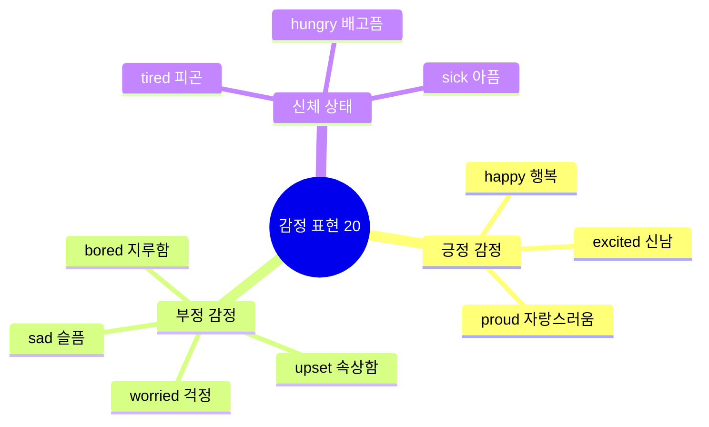

### 기본 감정 (021-030)

| No. | 패턴 | 청크 분해 | 한국어 | 상황 |
|:---:|------|----------|--------|------|
| 021 | I'm so happy I passed the test! | I'm so happy / I passed / the test! | 나는 너무 행복해 / 내가 통과해서 / 시험을! | 시험 합격 |
| 022 | I'm feeling great today! | I'm feeling / great / today! | 나는 느끼고 있어 / 아주 좋게 / 오늘! | 좋은 기분 |
| 023 | I'm a little sad. | I'm / a little sad. / My pet / is sick. | 나는 / 조금 슬퍼. / 내 애완동물이 / 아파. | 슬픈 일 |
| 024 | I'm really upset. | I'm really upset / about / what happened. | 나는 정말 속상해 / ~에 대해 / 일어난 일. | 속상한 일 |
| 025 | I'm so excited for the trip! | I'm so excited / for / the trip! | 나는 너무 신나 / ~때문에 / 여행! | 기대감 |
| 026 | I'm kind of nervous. | I'm kind of / nervous / about the presentation. | 나는 약간 / 긴장돼 / 발표에 대해. | 긴장 |
| 027 | I'm super bored. | I'm super bored. / There's / nothing to do. | 나는 정말 지루해. / 있어 / 할 것이 아무것도. | 지루함 |
| 028 | I'm a bit worried. | I'm / a bit worried / about the test. | 나는 / 약간 걱정돼 / 시험에 대해. | 걱정 |
| 029 | I'm really tired. | I'm really tired. / I stayed up / late. | 나는 정말 피곤해. / 나는 깨어 있었어 / 늦게까지. | 피곤함 |
| 030 | I'm feeling better now. | I was sick, / but / I'm feeling / better now. | 나는 아팠어, / 하지만 / 나는 느끼고 있어 / 더 좋게 지금. | 회복 |

#### 021-030 패턴 상세 (선별)

#### 021. **I'm so happy!** - 너무 행복해!
```
I'm so happy / I passed / the test!
나는 너무 행복해 / 내가 통과해서 / 시험을!
```
**청크 포인트**: `I'm so happy` (감정) → `I passed` (이유1) → `the test!` (이유2)

**💬 실전 대화 턴 (시험 결과 받았을 때)**
```
A: Guess what? I'm so happy! I passed the test!
   (있잖아? 나 너무 행복해! 시험에 통과했어!)
   
B: Really? Congratulations! What did you get?
   (정말? 축하해! 몇 점 받았어?)
   
A: I got an A! I studied so hard!
   (A를 받았어! 정말 열심히 공부했어!)
   
B: Wow! Good job! I'm proud of you!
   (와! 잘했어! 자랑스러워!)
```

**🎯 응용 연습**
- 생일 선물 받았을 때: "I'm so happy! I got a new bike!"
- 대회에서 이겼을 때: "I'm so happy! Our team won!"
- 친구가 전학 안 갔을 때: "I'm so happy! You're not moving away!"

- [ ] 청크 읽기 | [ ] 직독직해 | [ ] 소리 내기

#### 025. **I'm so excited!** - 너무 신나!
```
I'm so excited / for / the trip!
나는 너무 신나 / ~때문에 / 여행!
```
**청크 포인트**: `I'm so excited` (감정) → `for` (이유 연결) → `the trip!` (대상)
- [ ] 청크 읽기 | [ ] 직독직해 | [ ] 소리 내기

### 신체 상태 (031-040)

| No. | 패턴 | 청크 분해 | 한국어 |
|:---:|------|----------|--------|
| 031 | I have a headache. | I have / a headache. / Can I / rest? | 나는 가지고 있어 / 두통을. / 제가 할 수 있나요 / 쉬기를? |
| 032 | My stomach hurts. | My stomach / hurts / really bad. | 내 배가 / 아파 / 정말 심하게. |
| 033 | I feel dizzy. | I feel dizzy. / I need / to sit down. | 나는 어지러움을 느껴. / 나는 필요해 / 앉는 것이. |
| 034 | I'm starving! | I'm starving! / When's / lunch? | 나 배고파 죽겠어! / 언제야 / 점심은? |
| 035 | I'm stuffed! | I'm stuffed! / I ate / too much. | 나 배불러 죽겠어! / 나는 먹었어 / 너무 많이. |
| 036 | I'm freezing! | I'm freezing! / It's / so cold! | 나 얼어 죽겠어! / 이건 / 너무 추워! |
| 037 | I'm burning up! | I'm burning up! / It's / so hot! | 나 더워 죽겠어! / 이건 / 너무 더워! |
| 038 | I can't sleep. | I can't sleep. / I'm / too excited. | 나는 잠 못 자겠어. / 나는 / 너무 신나. |
| 039 | I feel better. | I feel better / now. / Thanks! | 나는 기분 좋아졌어 / 지금. / 고마워! |
| 040 | I'm wide awake! | I'm / wide awake! / Let's go! | 나는 / 완전히 깨어 있어! / 가자! |

#### 031-040 패턴 학습
- [ ] 031-040 전체 청크 읽기
- [ ] 031-040 직독직해 연습
- [ ] 031-040 소리 내기 완료

---

## 🏠 Part 3: 일상 루틴 (Patterns 041-065)

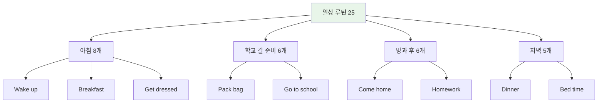

### 아침 루틴 (041-048)

| No. | 패턴 | 청크 분해 | 한국어 | 시간 |
|:---:|------|----------|--------|------|
| 041 | I woke up at 7 AM. | I / woke up / at 7 AM. | 나는 / 일어났어 / 오전 7시에. | 7:00 |
| 042 | I need to get ready. | I need / to get ready / for school. | 나는 필요해 / 준비하는 것이 / 학교를 위해. | 7:10 |
| 043 | I'm running late! | I'm / running late! / Hurry up! | 나는 / 늦어지고 있어! / 서둘러! | 7:40 |
| 044 | I almost missed the bus. | I / almost missed / the bus / today. | 나는 / 거의 놓쳤어 / 버스를 / 오늘. | 7:50 |
| 045 | I had cereal for breakfast. | I had / cereal / for breakfast. | 나는 먹었어 / 시리얼을 / 아침으로. | 7:20 |
| 046 | I didn't have time to eat. | I didn't have / time / to eat / breakfast. | 나는 가지지 못했어 / 시간을 / 먹을 / 아침을. | 7:45 |
| 047 | I forgot my homework! | I forgot / my homework / at home! | 나는 잊었어 / 내 숙제를 / 집에! | 8:00 |
| 048 | My mom packed my lunch. | My mom / packed / my lunch / today. | 우리 엄마가 / 쌌어 / 내 점심을 / 오늘. | 7:30 |

#### 041-048 패턴 상세 (선별)

#### 041. **I woke up at [시간].** - ~에 일어났어.
```
I / woke up / at 7 AM.
나는 / 일어났어 / 오전 7시에.
```
**청크 포인트**: `I` (주어) → `woke up` (일어났다) → `at 7 AM.` (시간)
**활용**: I woke up at 6 / 7 / 8 AM 등으로 변형 가능

**💬 실전 대화 턴 (학교에서 친구와 대화)**
```
A: You look tired. What time did you wake up?
   (너 피곤해 보여. 몇 시에 일어났어?)
   
B: I woke up at 6 AM. I had to study for the test.
   (6시에 일어났어. 시험 공부해야 했어.)
   
A: Wow! That's so early! Did you have breakfast?
   (와! 정말 일찍이네! 아침 먹었어?)
   
B: Not really. I was too busy.
   (별로 못 먹었어. 너무 바빴어.)
```

**🎯 응용 연습**
- 주말에: "I woke up at 10 AM. It was so nice!"
- 늦잠 잤을 때: "I woke up late! I almost missed the bus!"
- 일찍 일어났을 때: "I woke up early today. I feel great!"

- [ ] 청크 읽기 | [ ] 직독직해 | [ ] 소리 내기

#### 043. **I'm running late!** - 늦었어!
```
I'm / running late! / Hurry up!
나는 / 늦어지고 있어! / 서둘러!
```
**청크 포인트**: `I'm` → `running late!` (늦는 중) → `Hurry up!` (재촉)

**💬 실전 대화 턴 (아침에 늦었을 때)**
```
A: Oh no! I'm running late! Hurry up!
   (안돼! 늦고 있어! 서둘러!)
   
B: What time is it? We still have time!
   (몇 시야? 아직 시간 있어!)
   
A: No! The bus leaves in 5 minutes! I'm running late!
   (아니! 버스 5분 후에 가! 늦고 있어!)
   
B: Let's run! We can make it!
   (뛰자! 탈 수 있어!)
```

**🎯 응용 연습**
- 아침에: "I'm running late! I overslept!"
- 약속에: "I'm running late! Sorry!"
- 학교에: "I'm running late for class!"

- [ ] 청크 읽기 | [ ] 직독직해 | [ ] 소리 내기

### 학교 갈 준비 (049-054)

| No. | 패턴 | 청크 분해 | 한국어 |
|:---:|------|----------|--------|
| 049 | Can you drive me to school? | Can you / drive me / to school? | 당신은 할 수 있나요 / 나를 운전해서 데려다주기를 / 학교에? |
| 050 | I'll walk to school today. | I'll walk / to school / today. | 나는 걸어갈 거야 / 학교에 / 오늘. |
| 051 | The school bus is here! | The school bus / is here! / Let's go! | 스쿨버스가 / 여기 있어! / 가자! |
| 052 | I'll be back at 3 PM. | I'll be back / at 3 PM. | 나는 돌아올 거야 / 오후 3시에. |
| 053 | Don't forget your backpack! | Don't forget / your backpack! | 잊지 마 / 너의 배낭을! |
| 054 | Have a great day at school! | Have / a great day / at school! | 가져라 / 좋은 하루를 / 학교에서! |

#### 049-054 패턴 학습
- [ ] 049-054 전체 학습 완료

### 방과 후 (055-060)

| No. | 패턴 | 청크 분해 | 한국어 |
|:---:|------|----------|--------|
| 055 | I'm home! What's for dinner? | I'm home! / What's / for dinner? | 나 집에 왔어요! / 무엇인가요 / 저녁은? |
| 056 | I'm back from school. | I'm back / from school. / It was / tiring. | 나는 돌아왔어 / 학교에서. / 그것은 / 피곤했어. |
| 057 | I have to do my homework first. | I have / to do / my homework / first. | 나는 가지고 있어 / 하는 것을 / 내 숙제를 / 먼저. |
| 058 | Can I go outside and play? | Can I / go outside / and play? | 제가 할 수 있나요 / 밖으로 나가는 것을 / 그리고 놀기를? |
| 059 | I need to practice piano now. | I need / to practice / the piano / now. | 나는 필요해 / 연습하는 것이 / 피아노를 / 지금. |
| 060 | I'm going to my friend's house. | I'm going / to my friend's house. | 나는 가는 중이야 / 내 친구 집에. |

#### 055-060 패턴 학습
- [ ] 055-060 전체 학습 완료

### 저녁 루틴 (061-065)

| No. | 패턴 | 청크 분해 | 한국어 |
|:---:|------|----------|--------|
| 061 | I'll set the table for dinner. | I'll / set the table / for dinner. | 내가 / 식탁을 차릴게 / 저녁을 위해. |
| 062 | Can I stay up late tonight? | Can I / stay up late / tonight? | 제가 할 수 있나요 / 늦게까지 깨어 있는 것을 / 오늘 밤? |
| 063 | I need to take a shower. | I need / to take a shower / before bed. | 나는 필요해 / 샤워하는 것이 / 자기 전에. |
| 064 | Good night, everyone! | Good night, / everyone! / See you / tomorrow! | 잘 자요, / 여러분! / 봐요 / 내일! |
| 065 | I'm going to bed now. | I'm going / to bed / now. / I'm tired. | 나는 가는 중이야 / 침대로 / 지금. / 나 피곤해. |

#### 061-065 패턴 학습
- [ ] 061-065 전체 학습 완료

---

## 🏫 Part 4: 학교생활 (Patterns 066-085)

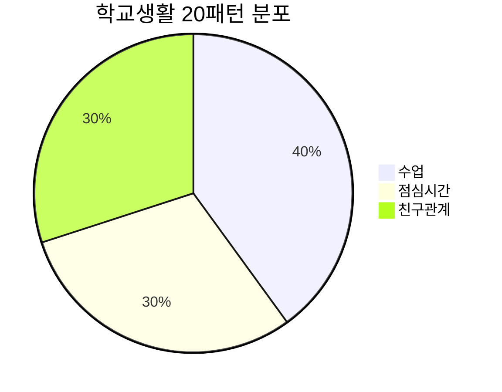

### 수업 시간 (066-073)

| No. | 패턴 | 청크 분해 | 한국어 |
|:---:|------|----------|--------|
| 066 | What class do we have next? | What class / do we / have / next? | 무슨 수업을 / 우리는 / 가지니 / 다음에? |
| 067 | I have science class after lunch. | I have / science class / after lunch. | 나는 가지고 있어 / 과학 수업을 / 점심 식사 후에. |
| 068 | This class is so boring. | This class / is so / boring. / I'm sleepy. | 이 수업은 / ~이다 정말 / 지루한. / 나 졸려. |
| 069 | I don't understand this. | I / don't understand / this problem. | 나는 / 이해하지 못해 / 이 문제를. |
| 070 | Can you explain it again? | Can you / explain it / again, / please? | 당신은 할 수 있나요 / 그것을 설명하기를 / 다시, / 제발요? |
| 071 | How do you solve this? | How / do you / solve / this math problem? | 어떻게 / 너는 / 푸니 / 이 수학 문제를? |
| 072 | Can I borrow your eraser? | Can I / borrow / your eraser? | 제가 할 수 있나요 / 빌리는 것을 / 너의 지우개를? |
| 073 | I need to study more. | I need / to study / more / for the next test. | 나는 필요해 / 공부하는 것이 / 더 많이 / 다음 시험을 위해. |

#### 066-073 패턴 상세

#### 066. **What class do we have next?** - 다음 수업 뭐야?
```
What class / do we / have / next?
무슨 수업을 / 우리는 / 가지니 / 다음에?
```
**청크 포인트**: `What class` (무슨 수업) → `do we have` (우리 있어) → `next?` (다음에)

**💬 실전 대화 턴 (쉬는 시간에)**
```
A: Hey, what class do we have next?
   (야, 다음 수업 뭐야?)
   
B: I think we have English. Check your schedule!
   (영어인 것 같아. 시간표 확인해봐!)
   
A: Oh yeah! What class do we have after English?
   (아 맞다! 영어 다음에 무슨 수업 있어?)
   
B: Science! I love science class!
   (과학! 나 과학 수업 좋아해!)
```

- [ ] 청크 읽기 | [ ] 직독직해 | [ ] 소리 내기

#### 070. **Can you explain it again?** - 다시 설명해 줄 수 있어?
```
Can you / explain it / again, / please?
당신은 할 수 있나요 / 그것을 설명하기를 / 다시, / 제발요?
```
**청크 포인트**: `Can you` (할 수 있어) → `explain it again,` (다시 설명하기를) → `please?` (제발)

**💬 실전 대화 턴 (수업 중 이해 안 될 때)**
```
A: Teacher, can you explain it again, please?
   (선생님, 다시 설명해 주실 수 있나요, 제발요?)
   
선생님: Of course! Which part didn't you understand?
        (물론이지! 어떤 부분을 이해 못 했니?)
        
A: This math problem. Can you explain the first step?
   (이 수학 문제요. 첫 번째 단계 설명해 주실 수 있나요?)
   
선생님: Sure! Let me show you again.
        (물론! 다시 보여줄게.)
```

- [ ] 청크 읽기 | [ ] 직독직해 | [ ] 소리 내기

- [ ] 066-073 전체 학습 완료

### 점심시간 (074-079)

| No. | 패턴 | 청크 분해 | 한국어 |
|:---:|------|----------|--------|
| 074 | It's lunchtime! Let's go eat! | It's / lunchtime! / Let's go / eat! | 지금은 / 점심시간이야! / 가자 / 먹으러! |
| 075 | Let's sit together at lunch! | Let's / sit together / at lunch! | 우리 / 함께 앉자 / 점심에! |
| 076 | I brought my lunch from home. | I / brought / my lunch / from home. | 나는 / 가져왔어 / 내 점심을 / 집에서. |
| 077 | Can I try some of that? | Can I / try some / of that? / It looks good! | 제가 할 수 있나요 / 조금 먹어보는 것을 / 저것의? / 그거 좋아 보여! |
| 078 | What did you bring for lunch? | What / did you / bring / for lunch? | 무엇을 / 너는 / 가져왔니 / 점심으로? |
| 079 | The cafeteria food is pretty good. | The cafeteria food / is / pretty good / today. | 급식은 / ~이다 / 꽤 좋은 / 오늘. |

#### 074-079 패턴 학습
- [ ] 074-079 전체 학습 완료

### 친구 관계 (080-085)

| No. | 패턴 | 청크 분해 | 한국어 |
|:---:|------|----------|--------|
| 080 | Do you want to hang out? | Do you want / to hang out / after school? | 너 원하니 / 어울려 노는 것을 / 학교 끝난 후에? |
| 081 | Let's do something fun! | Let's / do / something fun / this weekend! | 우리 / 하자 / 무언가 재미있는 것을 / 이번 주말에! |
| 082 | You're my best friend! | You're / my best friend! / Thanks / for everything! | 너는 / 내 가장 친한 친구야! / 고마워 / 모든 것에 대해! |
| 083 | Thanks for helping me! | Thanks for / helping me / with my homework! | 고마워 / 나를 도와준 것에 대해 / 내 숙제와 함께! |
| 084 | I'm sorry about what I said. | I'm / sorry about / what I said. | 나는 / 미안해 / 내가 말한 것에 대해. |
| 085 | It's okay, don't worry. | It's okay, / don't / worry / about it. | 괜찮아, / 하지 마 / 걱정 / 그것에 대해. |

#### 080-085 패턴 학습
- [ ] 080-085 전체 학습 완료

---

## 🎮 Part 5: 취미와 친구 (Patterns 086-105)

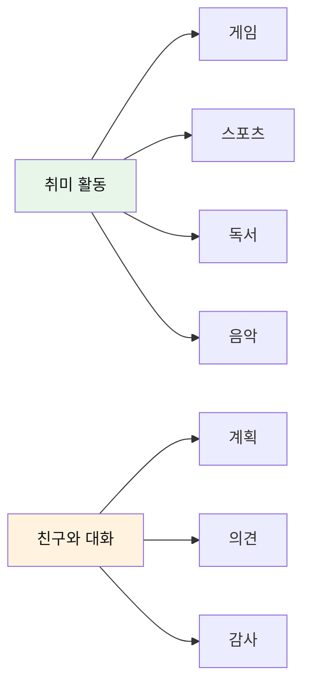

### 취미 관련 (086-095)

| No. | 패턴 | 청크 분해 | 한국어 |
|:---:|------|----------|--------|
| 086 | I'm into video games these days. | I'm / into video games / these days. | 나는 / ~안에 있어(빠졌어) 비디오 게임 / 요즘. |
| 087 | I'm really interested in science. | I'm / really interested / in science. | 나는 / 정말 관심 있어 / 과학에. |
| 088 | I love playing basketball. | I love / playing / basketball / with friends. | 나는 정말 좋아해 / 경기하는 것을 / 농구를 / 친구들과 함께. |
| 089 | I've been reading a lot lately. | I've been / reading / a lot / lately. | 나는 해오고 있어 / 읽기를 / 많이 / 요즘. |
| 090 | Do you play Roblox? | Do you / play / Roblox? | 너는 하니 / / 로블록스를? |
| 091 | I'm learning to play guitar. | I'm learning / to play / guitar. | 나는 배우고 있어 / 연주하는 것을 / 기타를. |
| 092 | I practice piano every day. | I practice / piano / every day. | 나는 연습해 / 피아노를 / 매일. |
| 093 | I'm on the school soccer team. | I'm / on the / school soccer team. | 나는 / ~에 있어 / 학교 축구팀. |
| 094 | We have practice after school. | We have / practice / after school. | 우리는 가지고 있어 / 연습을 / 방과 후에. |
| 095 | I won the game! | I won / the game! / It was close! | 나는 이겼어 / 그 경기를! / 그것은 가까웠어! |

#### 086-095 패턴 학습
- [ ] 086-095 전체 학습 완료

### 친구와 계획 (096-105)

| No. | 패턴 | 청크 분해 | 한국어 |
|:---:|------|----------|--------|
| 096 | Are you free on Saturday? | Are you / free / on Saturday? | 너는 있니 / 자유롭게(시간이) / 토요일에? |
| 097 | That sounds fun! Count me in! | That / sounds / fun! / Count me in! | 그것은 / 들린다 / 재미있게! / 나도 끼워줘! |
| 098 | Let's meet at the park. | Let's meet / at the park / at 2 PM. | 만나자 / 공원에서 / 오후 2시에. |
| 099 | Can you come to my house? | Can you come / to my house / tomorrow? | 너 올 수 있니 / 내 집에 / 내일? |
| 100 | I'm having a birthday party! | I'm having / a birthday party! / You're invited! | 나는 열 거야 / 생일 파티를! / 너 초대됐어! |
| 101 | What do you want to do? | What / do you / want to do / this weekend? | 무엇을 / 너는 / 하고 싶니 / 이번 주말에? |
| 102 | Let's watch a movie together. | Let's watch / a movie / together. | 보자 / 영화를 / 함께. |
| 103 | I can't wait! | I can't wait! / This will be / so much fun! | 나는 기다릴 수 없어! / 이것은 될 거야 / 정말 재미있게! |
| 104 | My mom said yes! | My mom / said yes! / I can come! | 우리 엄마가 / 된다고 했어! / 나 갈 수 있어! |
| 105 | Sorry, I can't make it. | Sorry, / I can't make it. / Family thing. | 미안, / 나는 못 갈 것 같아. / 가족 일이야. |

#### 096-105 패턴 학습
- [ ] 096-105 전체 학습 완료

---

## ✈️ Part 6: 여행 준비 (Patterns 106-120)

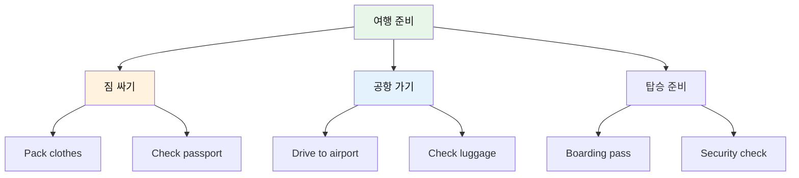

### 여행 계획 (106-115)

| No. | 패턴 | 청크 분해 | 한국어 |
|:---:|------|----------|--------|
| 106 | We're going on a trip! | We're going / on a trip! / I'm so excited! | 우리는 가는 중이야 / 여행을! / 나 너무 신나! |
| 107 | Where are we going? | Where / are we / going? | 어디로 / 우리는 / 가는 거야? |
| 108 | When are we leaving? | When / are we / leaving? | 언제 / 우리는 / 떠나는 거야? |
| 109 | How long will we stay? | How long / will we / stay / there? | 얼마나 오래 / 우리는 / 머무를 거야 / 거기에? |
| 110 | I need to pack my bag. | I need / to pack / my bag. | 나는 필요해 / 짐 싸는 것이 / 내 가방을. |
| 111 | Don't forget your passport! | Don't forget / your passport! | 잊지 마 / 너의 여권을! |
| 112 | I have my ticket. | I have / my ticket / right here. | 나는 가지고 있어 / 내 티켓을 / 바로 여기에. |
| 113 | What should I pack? | What / should I / pack? | 무엇을 / 내가 / 싸야 할까? |
| 114 | Pack warm clothes. | Pack / warm clothes. / It's cold there. | 싸라 / 따뜻한 옷을. / 거기는 추워. |
| 115 | I'm ready to go! | I'm ready / to go! / Let's leave! | 나는 준비됐어 / 가기를! / 떠나자! |

#### 106-115 패턴 상세 (선별)

#### 106. **We're going on a trip!** - 우리 여행 가!
```
We're going / on a trip! / I'm so excited!
우리는 가는 중이야 / 여행을! / 나 너무 신나!
```
**청크 포인트**: `We're going` (우리 간다) → `on a trip!` (여행을) → `I'm so excited!` (신난다)

**💬 실전 대화 턴 (집에서 가족과)**
```
엄마: Kids, guess what? We're going on a trip!
      (애들아, 있잖아? 우리 여행 가!
      
아이: Really? Where are we going?
      (정말요? 우리 어디 가요?)
      
엄마: We're going to Jeju Island!
      (제주도에 가!
      
아이: Wow! I'm so excited! When are we leaving?
      (와! 너무 신나요! 언제 떠나요?)
      
엄마: Next Saturday! Start packing!
      (다음 주 토요일! 짐 싸기 시작해!)
```

**🎯 응용 연습**
- 학교 현장학습: "We're going on a field trip tomorrow!"
- 캠핑: "We're going camping this weekend! I can't wait!"
- 할머니 댁: "We're going to grandma's house! I'm so excited!"

- [ ] 청크 읽기 | [ ] 직독직해 | [ ] 소리 내기

#### 110. **I need to pack my bag.** - 짐 싸야 해.
```
I need / to pack / my bag.
나는 필요해 / 짐 싸는 것이 / 내 가방을.
```
- [ ] 청크 읽기 | [ ] 직독직해 | [ ] 소리 내기

### 공항/탑승 (116-120)

| No. | 패턴 | 청크 분해 | 한국어 |
|:---:|------|----------|--------|
| 116 | Where do we check in? | Where / do we / check in? | 어디서 / 우리는 / 체크인하나요? |
| 117 | Here's my boarding pass. | Here's / my boarding pass. | 여기 있어요 / 내 탑승권이. |
| 118 | What gate is our flight? | What gate / is / our flight? | 몇 번 게이트인가요 / ~인지 / 우리 비행기는? |
| 119 | When do we board? | When / do we / board? | 언제 / 우리는 / 탑승하나요? |
| 120 | The plane is boarding now! | The plane / is boarding / now! / Let's go! | 비행기가 / 탑승 중이야 / 지금! / 가자! |

#### 116-120 패턴 학습
- [ ] 116-120 전체 학습 완료

---

## 🗺️ Part 7: 여행 장소 (Patterns 121-135)

### 관광지 (121-130)

| No. | 패턴 | 청크 분해 | 한국어 |
|:---:|------|----------|--------|
| 121 | This place is amazing! | This place / is / amazing! | 이 장소는 / ~이다 / 놀라워! |
| 122 | Can we take a picture? | Can we / take a picture / here? | 우리가 할 수 있나요 / 사진 찍는 것을 / 여기서? |
| 123 | I want to see the beach. | I want / to see / the beach. | 나는 원해 / 보는 것을 / 해변을. |
| 124 | How do we get there? | How / do we / get / there? | 어떻게 / 우리는 / 가나요 / 거기로? |
| 125 | Is it far from here? | Is it / far / from here? | 그것은 / 멀까요 / 여기서? |
| 126 | Let's go to the museum. | Let's go / to the museum / tomorrow. | 가자 / 박물관에 / 내일. |
| 127 | This is so cool! | This / is / so cool! / Look at that! | 이건 / ~이다 / 정말 멋져! / 저것 봐! |
| 128 | I'm having so much fun! | I'm having / so much fun! | 나는 가지고 있어 / 정말 많은 재미를! |
| 129 | Can we come back here? | Can we / come back / here / again? | 우리가 할 수 있나요 / 다시 오는 것을 / 여기로 / 다시? |
| 130 | I love this place! | I love / this place! / It's beautiful! | 나는 좋아해 / 이 장소를! / 아름다워! |

#### 121-130 패턴 학습
- [ ] 121-130 전체 학습 완료

### 호텔/숙소 (131-135)

| No. | 패턴 | 청크 분해 | 한국어 |
|:---:|------|----------|--------|
| 131 | This is our hotel room. | This is / our hotel room. / It's nice! | 이것은 / 우리 호텔 방이야. / 좋네! |
| 132 | Where's the swimming pool? | Where's / the swimming pool? | 어디 있나요 / 수영장이? |
| 133 | What time is breakfast? | What time / is / breakfast? | 몇 시인가요 / ~인지 / 아침 식사가? |
| 134 | Can I use the Wi-Fi? | Can I / use / the Wi-Fi? | 제가 할 수 있나요 / 사용하는 것을 / 와이파이를? |
| 135 | I like this hotel! | I like / this hotel! / The room is big! | 나는 좋아해 / 이 호텔을! / 방이 커! |

#### 131-135 패턴 학습
- [ ] 131-135 전체 학습 완료

---

## 🛍️ Part 8: 여행 쇼핑 (Patterns 136-145)

### 쇼핑 표현 (136-145)

| No. | 패턴 | 청크 분해 | 한국어 |
|:---:|------|----------|--------|
| 136 | Can I buy this? | Can I / buy / this? / It's so cute! | 제가 할 수 있나요 / 사는 것을 / 이것을? / 정말 귀여워! |
| 137 | How much is this? | How much / is / this? | 얼마인가요 / ~인지 / 이것은? |
| 138 | It's too expensive. | It's / too expensive. / Do you have / a cheaper one? | 이건 / 너무 비싸요. / 당신은 가지고 있나요 / 더 싼 것을? |
| 139 | I want to buy a souvenir. | I want / to buy / a souvenir / for my friend. | 나는 원해 / 사는 것을 / 기념품을 / 내 친구를 위한. |
| 140 | Can I try this on? | Can I / try / this on? | 제가 할 수 있나요 / 입어보는 것을 / 이것을? |
| 141 | Do you have this in blue? | Do you have / this / in blue? | 당신은 가지고 있나요 / 이것을 / 파란색으로? |
| 142 | I'll take this one. | I'll take / this one. / Thank you! | 나는 가질게요 / 이것을. / 고마워요! |
| 143 | Can I get a bag? | Can I get / a bag / for this? | 제가 받을 수 있나요 / 가방을 / 이것을 위한? |
| 144 | This is perfect! | This / is / perfect! / I love it! | 이건 / ~이다 / 완벽해! / 나 정말 좋아해! |
| 145 | Let's go to that store. | Let's go / to that store / over there. | 가자 / 저 가게에 / 저기 있는. |

#### 136-145 패턴 상세 (선별)

#### 136. **Can I buy this?** - 이거 사도 돼요?
```
Can I / buy / this? / It's so cute!
제가 할 수 있나요 / 사는 것을 / 이것을? / 정말 귀여워!
```
**청크 포인트**: `Can I` (허락 요청) → `buy` (구매) → `this?` (대상) → `It's so cute!` (이유)

**💬 실전 대화 턴 (기념품 가게에서)**
```
아이: Mom, look! Can I buy this? It's so cute!
      (엄마, 봐요! 이거 사도 돼요? 정말 귀여워요!)
      
엄마: Let me see. How much is it?
      (내가 볼게. 얼마니?)
      
아이: It's $10. Please, Mom!
      (10달러예요. 제발요, 엄마!)
      
엄마: Okay. You can buy it. But that's your only souvenir.
      (좋아. 사도 돼. 하지만 그게 네 유일한 기념품이야.)
      
아이: Thank you so much! I'll take good care of it!
      (정말 고마워요! 잘 간직할게요!)
```

**🎯 응용 연습**
- 장난감 가게: "Can I buy this toy? I've been saving my money!"
- 서점에서: "Can I buy this book? It looks interesting!"
- 옷 가게: "Can I buy this shirt? It fits perfectly!"

- [ ] 청크 읽기 | [ ] 직독직해 | [ ] 소리 내기

#### 137. **How much is this?** - 이거 얼마예요?
```
How much / is / this?
얼마인가요 / ~인지 / 이것은?
```
- [ ] 청크 읽기 | [ ] 직독직해 | [ ] 소리 내기

---

## ❓ Part 9: 질문과 대답 (Patterns 146-150)

### 정보 질문 (146-150)

| No. | 패턴 | 청크 분해 | 한국어 | 상황 |
|:---:|------|----------|--------|------|
| 146 | What does this mean? | What does / this / mean? | 무엇을 하나요 / 이것이 / 의미하기를? | 단어 모를 때 |
| 147 | Can you help me? | Can you / help me / with this? | 당신은 할 수 있나요 / 나를 돕는 것을 / 이것과 함께? | 도움 필요 |
| 148 | Where's the bathroom? | Where's / the bathroom? | 어디 있나요 / 화장실이? | 화장실 찾기 |
| 149 | What should we do? | What / should we / do / now? | 무엇을 / 해야 할까 우리가 / 하기를 / 지금? | 계획 논의 |
| 150 | That sounds great! | That / sounds / great! / Let's do it! | 그것은 / 들린다 / 좋게! / 그것을 하자! | 동의 표현 |

#### 146-150 패턴 상세

#### 146. **What does [단어] mean?** - ~무슨 뜻이야?
```
What does / this / mean?
무엇을 하나요 / 이것이 / 의미하기를?
```
**청크 포인트**: `What does` (무엇을 하나) → `this` (이것이) → `mean?` (의미하다)
- [ ] 청크 읽기 | [ ] 직독직해 | [ ] 소리 내기

#### 147. **Can you help me?** - 도와줄 수 있어?
```
Can you / help me / with this?
당신은 할 수 있나요 / 나를 돕는 것을 / 이것과 함께?
```
- [ ] 청크 읽기 | [ ] 직독직해 | [ ] 소리 내기

#### 148. **Where's the bathroom?** - 화장실이 어디예요?
```
Where's / the bathroom?
어디 있나요 / 화장실이?
```
- [ ] 청크 읽기 | [ ] 직독직해 | [ ] 소리 내기

#### 149. **What should we do?** - 뭐 할까?
```
What / should we / do / now?
무엇을 / 해야 할까 우리가 / 하기를 / 지금?
```
- [ ] 청크 읽기 | [ ] 직독직해 | [ ] 소리 내기

#### 150. **That sounds great!** - 좋은데!
```
That / sounds / great! / Let's do it!
그것은 / 들린다 / 좋게! / 그것을 하자!
```
- [ ] 청크 읽기 | [ ] 직독직해 | [ ] 소리 내기

---

## 📊 전체 패턴 분석

### 카테고리별 분포

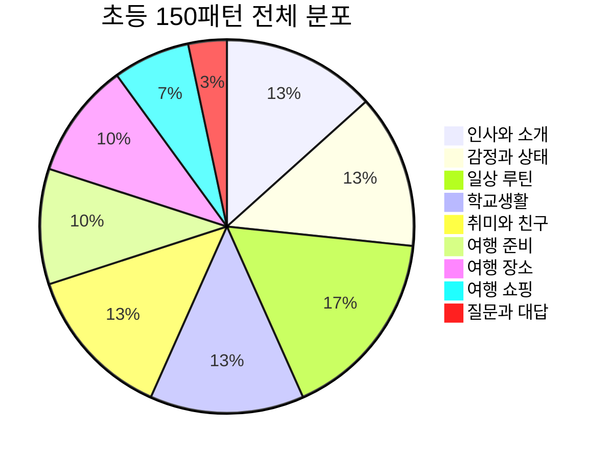

### 학습 난이도 분석

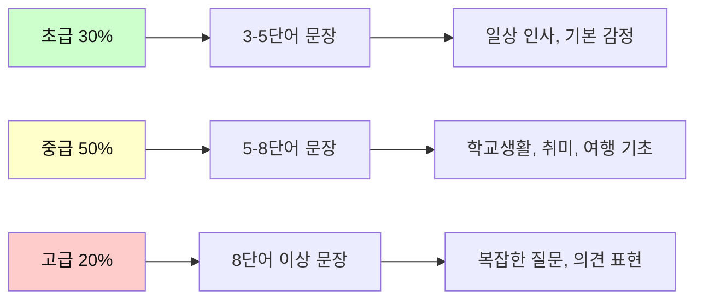

### 활용도 순위

| 순위 | 카테고리 | 일상 활용도 | 여행 활용도 | 총점 |
|------|----------|------------|------------|------|
| 1 | 인사와 소개 | ⭐⭐⭐⭐⭐ | ⭐⭐⭐⭐⭐ | 10/10 |
| 2 | 감정과 상태 | ⭐⭐⭐⭐⭐ | ⭐⭐⭐⭐ | 9/10 |
| 3 | 질문과 대답 | ⭐⭐⭐⭐⭐ | ⭐⭐⭐⭐ | 9/10 |
| 4 | 일상 루틴 | ⭐⭐⭐⭐⭐ | ⭐⭐⭐ | 8/10 |
| 5 | 여행 준비 | ⭐⭐ | ⭐⭐⭐⭐⭐ | 7/10 |
| 6 | 학교생활 | ⭐⭐⭐⭐⭐ | ⭐⭐ | 7/10 |
| 7 | 취미와 친구 | ⭐⭐⭐⭐ | ⭐⭐⭐ | 7/10 |
| 8 | 여행 장소 | ⭐⭐ | ⭐⭐⭐⭐⭐ | 7/10 |
| 9 | 여행 쇼핑 | ⭐⭐ | ⭐⭐⭐⭐ | 6/10 |

---

## 💡 학습 가이드

### 2주 완성 플랜

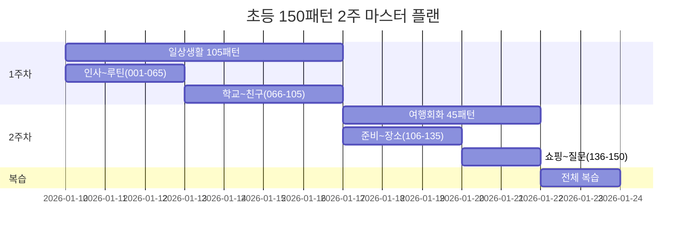

### 일일 학습 스케줄

| 시간대 | 활동 | 패턴 수 | 방법 |
|--------|------|---------|------|
| **아침 (7:00-7:30)** | 전날 복습 | 10개 | 빠르게 청크 읽기 |
| **점심 (12:00-12:30)** | 신규 학습 | 10개 | 정독+직독직해 |
| **저녁 (19:00-19:30)** | 오늘 복습 | 10개 | 소리 내기+응용 |
| **잠자기 전 (21:00-21:10)** | 퀴즈 테스트 | 5개 | 랜덤 패턴 말하기 |

### 청크 학습 5단계 마스터

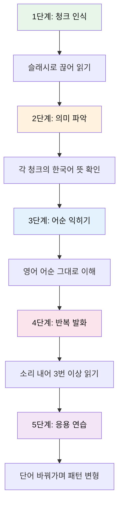

---

## 🎯 실전 활용 시나리오

### 시나리오 1: 학교에서 하루

| 상황 | 사용 패턴 | 번호 |
|------|----------|------|
| 등교 | See you tomorrow at school! | 008 |
| 수업 중 | I don't understand this. | 069 |
| 도움 요청 | Can you explain it again? | 070 |
| 점심시간 | Let's sit together at lunch! | 075 |
| 방과 후 | Do you want to hang out? | 080 |

### 시나리오 2: 가족 여행

| 상황 | 사용 패턴 | 번호 |
|------|----------|------|
| 여행 준비 | We're going on a trip! | 106 |
| 짐 싸기 | I need to pack my bag. | 110 |
| 공항 | Here's my boarding pass. | 117 |
| 관광지 | This place is amazing! | 121 |
| 쇼핑 | Can I buy this? | 136 |
| 호텔 | I like this hotel! | 135 |

### 시나리오 3: 새 친구 사귀기

| 단계 | 사용 패턴 | 번호 |
|------|----------|------|
| 1. 인사 | Hi there! How's it going? | 001 |
| 2. 소개 | I'm from Seoul, Korea. | 011 |
| 3. 학교 | I go to Oak Elementary School. | 012 |
| 4. 취미 | I love playing basketball. | 088 |
| 5. 계획 | Let's do something fun! | 081 |

---

## 📝 마스터 체크리스트

### 레벨별 목표

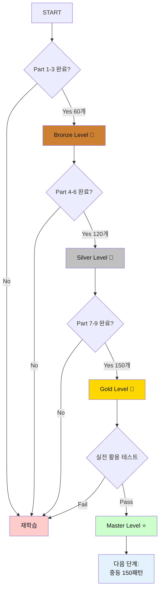

### 평가 기준표

| 레벨 | 청크 읽기 | 직독직해 | 소리 내기 | 응용 능력 | 보상 |
|------|----------|----------|----------|-----------|------|
| **Bronze** | 60개 이상 | 50% 이상 | 40% 이상 | - | 🥉 |
| **Silver** | 120개 이상 | 80% 이상 | 70% 이상 | 30% 이상 | 🥈 |
| **Gold** | 150개 전체 | 95% 이상 | 90% 이상 | 60% 이상 | 🥇 |
| **Master** | 150개 완벽 | 100% | 100% | 90% 이상 | ⭐ |

---

## 🌟 학습 성공 팁

### TOP 10 학습 전략

1. **매일 10개씩** - 꾸준함이 핵심
2. **소리 내어 읽기** - 청각+시각 활용
3. **실생활 적용** - 배운 패턴 즉시 사용
4. **친구와 연습** - 대화 형태로 학습
5. **앱 활용** - 음성인식으로 발음 체크
6. **메모하기** - 자주 틀리는 패턴 기록
7. **영상 시청** - 원어민 사용 예시 관찰
8. **게임화** - 포인트 시스템으로 동기부여
9. **부모님과 함께** - 가족이 함께 학습
10. **목표 설정** - 2주 완성 목표 달성

---

*Last Updated: 2026-01-10*
*Total Patterns: 150개 | Daily Practice: 30-40분 | Complete in: 2주*

