# 🎓 전설의 중등 회화 150패턴 - 청크 마스터

## 🎯 학습 안내

중학생 수준에서 일상생활과 해외여행에서 자연스럽게 의사소통하는 데 꼭 필요한 **150가지 핵심 패턴**을 청크(Chunk, 의미 단위) 형태로 익히는 과정입니다. 복잡한 문장도 청크로 나누어 학습하면 원어민처럼 자연스럽게 말할 수 있습니다.

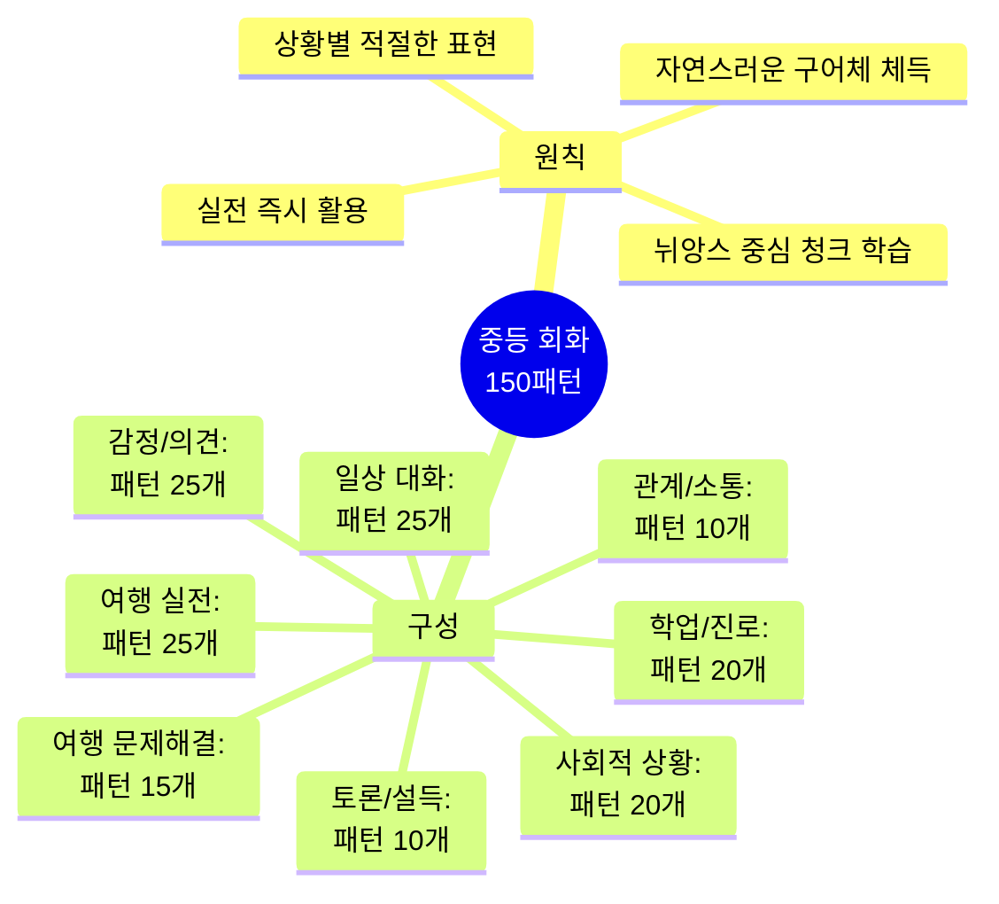

---

## 📊 전체 구조 한눈에 보기

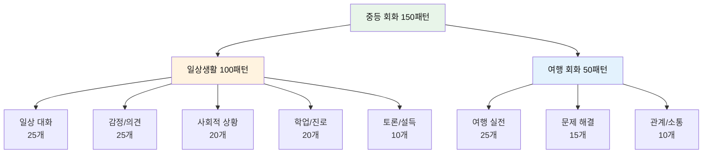

---

## 📚 학습 방법

| 단계 | 방법 | 시간 | 핵심 포인트 | 난이도 |
|------|------|------|-------------|--------|
| **1단계** | 청크 분석 | 1분 | 의미 단위 구조 파악 | ⭐⭐ |
| **2단계** | 직독직해 | 1분 | 영어식 사고 훈련 | ⭐⭐⭐ |
| **3단계** | 억양 연습 | 2분 | 원어민 뉘앙스 체득 | ⭐⭐⭐⭐ |
| **4단계** | 패턴 응용 | 2분 | 다양한 상황 변형 | ⭐⭐⭐⭐ |
| **5단계** | 실전 대화 | 4분 | 즉흥 대화 연습 | ⭐⭐⭐⭐⭐ |

---

## 💬 Part 1: 일상 대화 (Patterns 001-025)

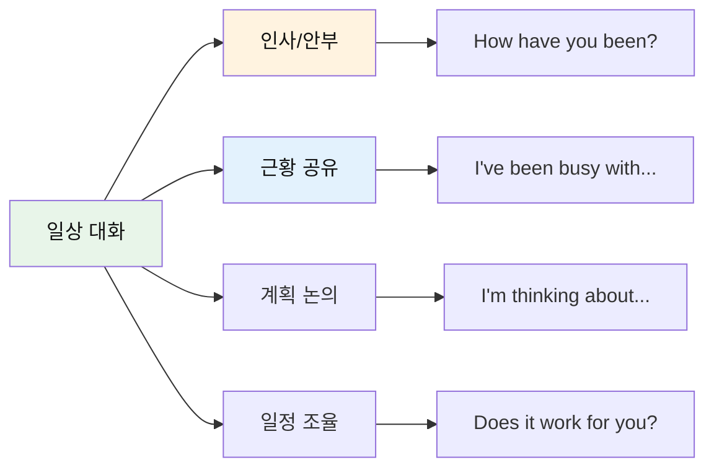

### 인사와 안부 (001-012)

| No. | 패턴 | 청크 분해 | 한국어 | 뉘앙스 |
|:---:|------|----------|--------|--------|
| 001 | How have you been? | Hey! / How / have you / been lately? | 야! / 어떻게 / 너는 / 지내왔니 최근에? | 친근+관심 |
| 002 | It's been a while! | It's been / a while! / What's new / with you? | 있었어 / 꽤 오랜 시간! / 무슨 새로운 일 있어 / 너에게? | 반가움 |
| 003 | What have you been up to? | What / have you / been up to / these days? | 무엇을 / 너는 / 해오고 있니 / 요즘? | 호기심 |
| 004 | Same old, same old. | How are / things? / - Same old, / same old. | 어떠니 / 모든 것이? / - 똑같은 옛날이지, / 똑같아. | 평범함 |
| 005 | Can't complain. | How's it / going? / - Can't / complain. | 어떻게 / 지내? / - 할 수 없어 / 불평하기를. | 괜찮음 |
| 006 | I've been busy with finals. | I've been / busy with / finals / lately. | 나는 해왔어 / ~로 바쁜 상태를 / 기말고사 / 최근에. | 바쁨 |
| 007 | Things have been crazy. | Things / have been / crazy / at home. | 상황들이 / 해왔어 / 미친 듯이(정신없이) / 집에서. | 혼란 |
| 008 | I've been meaning to call you. | I've been / meaning / to call you. | 나는 해왔어 / 의도하기를 / 너에게 전화하는 것을. | 미안함 |
| 009 | It's so good to see you! | It's / so good / to see / you again! | 그것은 / 정말 좋아 / 보는 것이 / 너를 다시! | 기쁨 |
| 010 | We should catch up sometime. | We should / catch up / sometime / soon. | 우리는 해야 해 / 밀린 이야기를 하다 / 언젠가 / 곧. | 제안 |
| 011 | Let's keep in touch. | Let's / keep / in touch, / okay? | 우리 하자 / 유지하기를 / 연락 안에서, / 알았지? | 약속 |
| 012 | Don't be a stranger! | Don't be / a stranger! / Text me / anytime. | 되지 마 / 낯선 사람이! (연락해!) / 나에게 문자 해 / 언제든지. | 친근함 |

#### 001-012 패턴 상세 (선별)

#### 001. **How have you been?** - 어떻게 지냈어?
```
Hey! / How / have you / been lately?
야! / 어떻게 / 너는 / 지내왔니 최근에?
```
**청크 포인트**: `Hey!` (호출) → `How` (방법) → `have you` (계속) → `been lately?` (최근 상태)
**뉘앙스**: 오랜만에 만난 사람에게 진심 어린 관심 표현
**응용**: How have you been doing? / How have things been?

**💬 실전 대화 턴 (여름방학 후 친구 만났을 때)**
```
A: Hey! How have you been lately? I haven't seen you in ages!
   (야! 최근에 어떻게 지냈어? 정말 오랜만이야!)
   
B: I've been pretty good! I went to camp this summer. How about you?
   (꽤 잘 지냈어! 이번 여름에 캠프 갔어. 너는?)
   
A: Same here! I've been busy with tennis lessons. We should hang out sometime!
   (나도! 테니스 레슨 때문에 바빴어. 우리 언젠가 놀아야겠다!)
   
B: Definitely! How about this weekend?
   (당연하지! 이번 주말 어때?)
```

**🎯 응용 연습**
- 온라인 친구 만났을 때: "Hey! How have you been? Long time no see online!"
- 전학 갔던 친구: "How have you been? How's your new school?"
- 아팠던 친구: "How have you been feeling? Are you all better now?"

- [ ] 청크 읽기 | [ ] 직독직해 | [ ] 소리 내기

#### 002. **It's been a while!** - 오랜만이다!
```
It's been / a while! / What's new / with you?
있었어 / 꽤 오랜 시간! / 무슨 새로운 일 있어 / 너에게?
```
**청크 포인트**: `It's been` (시간이 흘렀다) → `a while!` (꽤 오래) → `What's new` (새로운 일) → `with you?` (너에게)
**뉘앙스**: 반가움과 함께 근황 궁금증 표현

**💬 실전 대화 턴 (학교 행사에서 오랜만에 만났을 때)**
```
A: Oh hey! It's been a while! What's new with you?
   (오 야! 오랜만이다! 새로운 일 있어?)
   
B: Yeah, it's been forever! I joined the basketball team!
   (응, 엄청 오랜만이야! 농구팀에 들어갔어!)
   
A: No way! It's been a while since we played together!
   (대박! 우리 같이 논 지 오래됐다!)
   
B: We should play again sometime! I miss those days!
   (언젠가 다시 하자! 그때가 그리워!)
```

**🎯 응용 연습**
- SNS로 연락할 때: "Hey! It's been a while! How are you?"
- 동창회에서: "Wow! It's been a while! You look different!"
- 학원에서: "It's been a while! Did you stop coming here?"

- [ ] 청크 읽기 | [ ] 직독직해 | [ ] 소리 내기

#### 003. **What have you been up to?** - 요즘 뭐 하고 지내?
```
What / have you / been up to / these days?
무엇을 / 너는 / 해오고 있니 / 요즘?
```
**청크 포인트**: `What` (무엇) → `have you` (너는 계속) → `been up to` (하고 있었니) → `these days?` (요즘)
**뉘앙스**: 캐주얼하면서도 관심 있는 톤

**💬 실전 대화 턴 (점심시간에 친구와)**
```
A: Hey! What have you been up to these days?
   (야! 요즘 뭐 하고 지내?)
   
B: Not much, really. Just studying for midterms. What about you?
   (별거 없어. 그냥 중간고사 공부 중. 너는?)
   
A: Same! What have you been up to after school though?
   (나도! 근데 방과 후에는 뭐 해?)
   
B: I've been watching this new drama. It's so addicting!
   (새 드라마 보고 있어. 완전 중독성 있어!)
```

**🎯 응용 연습**
- 주말 후: "What have you been up to this weekend?"
- 방학 후: "What have you been up to during break?"
- 문자로: "What have you been up to? Let's hang out!"

- [ ] 청크 읽기 | [ ] 직독직해 | [ ] 소리 내기

#### 004-012 패턴 (간략)
- [ ] 004-012 전체 청크 읽기 완료
- [ ] 004-012 직독직해 완료
- [ ] 004-012 소리 내기 완료

### 근황과 일정 (013-025)

| No. | 패턴 | 청크 분해 | 한국어 |
|:---:|------|----------|--------|
| 013 | I'm kind of in a hurry. | Sorry, / I'm / kind of / in a hurry right now. | 미안, / 나는 / 약간 / 서두르는 중이야 지금. |
| 014 | I totally forgot about the meeting! | I / totally forgot / about / the meeting! | 나는 / 완전히 잊었어 / ~에 대해 / 그 회의! |
| 015 | It completely slipped my mind. | Your birthday! / It / completely slipped / my mind. | 너의 생일! / 그것이 / 완전히 빠져나갔어 / 내 마음에서. |
| 016 | I've got a lot on my plate. | I've got / a lot / on my plate / right now. | 나는 가지고 있어 / 많은 것을 / 내 접시 위에 / 지금 당장. |
| 017 | I'm swamped with homework. | I'm / swamped with / homework / this week. | 나는 / 늪에 빠진(압도된) 상태야 / 숙제로 / 이번 주에. |
| 018 | I could really use some coffee. | I / could really use / some coffee / right now. | 나는 / 정말 잘 사용할 수 있을 거야(필요해) / 약간의 커피를 / 지금 당장. |
| 019 | I'm not in the mood for going out. | I'm not / in the mood / for going out / tonight. | 나는 있지 않아 / 기분 안에 / 나가는 것에 대한 / 오늘 밤. |
| 020 | I'm thinking about joining the club. | I'm / thinking / about / joining the club. | 나는 / 생각 중이야 / ~에 대해 / 그 동아리에 가입하는 것. |
| 021 | Are you doing anything this Saturday? | Are you / doing / anything / this Saturday? | 너는 / 하고 있니 / 어떤 것을 / 이번 토요일에? |
| 022 | Would you be interested in going? | Would you / be / interested in / going to a concert? | 너는 / 있을 거니 / 관심 있는 상태로 / 콘서트에 가는 것에? |
| 023 | How does Friday evening sound? | How / does / Friday evening / sound? | 어떻게 / 하나요 / 금요일 저녁이 / 들리기를? (어때?) |
| 024 | Does 3 PM work for you? | Does / 3 PM / work / for you? | 하나요 / 오후 3시가 / 작동하기를(괜찮기를) / 너에게? |
| 025 | I'll have to take a rain check. | I can't / tonight. / I'll / have to / take a rain check. | 나는 할 수 없어 / 오늘 밤에. / 나는 / 해야 할 거야 / 다음을 기약하기를. |

#### 013-025 패턴 상세 (선별)

#### 016. **I've got a lot on my plate.** - 할 일이 너무 많아.
```
I've got / a lot / on my plate / right now.
나는 가지고 있어 / 많은 것을 / 내 접시 위에 / 지금 당장.
```
**청크 포인트**: `I've got` (가지고 있다) → `a lot` (많은 것) → `on my plate` (접시 위에=책임) → `right now` (지금)
**뉘앙스**: 은유적 표현으로 바쁨을 자연스럽게 전달

**💬 실전 대화 턴 (친구가 놀자고 할 때)**
```
친구: Hey! Want to go to the movies this Saturday?
      (야! 이번 토요일에 영화 보러 갈래?)
      
나: I'd love to, but I've got a lot on my plate right now.
    (가고 싶은데, 지금 할 일이 너무 많아.)
    
친구: Oh no! What's going on?
      (아 안 됐다! 무슨 일이야?)
      
나: I have three exams next week, and I need to finish my project.
    (다음 주에 시험 3개 있고, 프로젝트도 끝내야 해.)
    
친구: I understand. How about next weekend?
      (이해해. 다음 주말은 어때?)
      
나: That sounds perfect! I'll be free by then.
    (완벽해! 그때쯤이면 시간 있을 거야.)
```

**🎯 응용 연습**
- 부모님께: "I've got a lot on my plate. Can we talk later?"
- 선생님께: "I've got a lot on my plate this month with all the tests."
- 동아리 활동: "Sorry, I can't join. I've got a lot on my plate."

- [ ] 청크 읽기 | [ ] 직독직해 | [ ] 소리 내기

#### 021. **Are you doing anything [시간]?** - ~에 뭐 해?
```
Are you / doing / anything / this Saturday?
너는 / 하고 있니 / 어떤 것을 / 이번 토요일에?
```
**청크 포인트**: `Are you` (너는) → `doing` (하고 있니) → `anything` (무언가) → `this Saturday?` (이번 토요일)
**뉘앙스**: 부드럽게 계획 물어보며 약속 제안하는 분위기
- [ ] 청크 읽기 | [ ] 직독직해 | [ ] 소리 내기

---

## 😤 Part 2: 감정과 의견 표현 (Patterns 026-050)

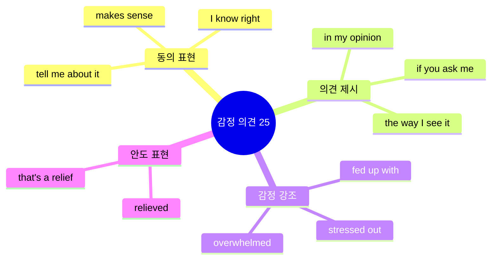

### 동의와 공감 (026-035)

| No. | 패턴 | 청크 분해 | 한국어 | 상황 |
|:---:|------|----------|--------|------|
| 026 | That makes sense. | Oh, / that / makes / sense now. | 오, / 그것이 / 만든다 / 의미를 이제. | 이해 |
| 027 | I see what you mean. | I see / what / you / mean. / Good point. | 나는 본다(안다) / 무엇을 / 네가 / 의미하는지. / 좋은 지적이야. | 공감 |
| 028 | I know, right? | The test / was / so hard! / - I know, / right? | 그 시험은 / ~이었다 / 정말 어려운! / - 나도 알아, / 맞지? | 강한 동의 |
| 029 | Tell me about it! | Mondays / are / the worst. / - Tell me / about it! | 월요일들은 / ~이다 / 최악인. / - 나에게 말해줘 / 그것에 대해! | 완전 공감 |
| 030 | You can say that again! | Life / is / tough. / - You can / say that / again! | 인생은 / ~이다 / 힘든. / - 너는 할 수 있어 / 그것을 말하기를 / 다시! | 강조된 동의 |
| 031 | I'm so stressed out. | I'm / so stressed / out / about exams. | 나는 / 정말 스트레스받은 / 상태야 / 시험에 대해. | 스트레스 |
| 032 | I'm under a lot of pressure. | I'm / under / a lot of pressure / from my parents. | 나는 / ~아래에 있어 / 많은 압박 / 나의 부모님으로부터. | 압박감 |
| 033 | I'm feeling overwhelmed. | I'm feeling / overwhelmed / with / everything. | 나는 느끼고 있어 / 압도된 기분을 / ~로 / 모든 것. | 감당 안 됨 |
| 034 | I'm fed up with all this drama. | I'm / fed up / with / all this drama. | 나는 / 질렸어(충분히 먹었어) / ~로 / 이 모든 드라마(소동). | 짜증 |
| 035 | I'm sick and tired of studying. | I'm / sick and tired / of / studying. | 나는 / 아프고 피곤해 / ~에 대해 / 공부하기. | 지긋지긋함 |

#### 026-035 패턴 상세 (선별)

#### 028. **I know, right?** - 그러니까, 맞지?
```
The test / was / so hard! / - I know, / right?
그 시험은 / ~이었다 / 정말 어려운! / - 나도 알아, / 맞지?
```
**청크 포인트**: `The test` (시험) → `was so hard!` (정말 어려웠다) → `I know,` (나도 알아) → `right?` (맞지?)
- **뉘앙스**: 상대방 말에 강하게 공감하며 동의하는 자연스러운 표현
- **활용**: 친구들과 대화할 때 빈번하게 사용

**💬 실전 대화 턴 (시험 끝나고)**
```
A: Oh my gosh! The math test was so hard!
   (아이고! 수학 시험 정말 어려웠어!)
   
B: I know, right? I couldn't finish the last three problems.
   (그러니까, 맞지? 마지막 세 문제를 못 풀었어.)
   
A: Me too! I thought I studied enough, but...
   (나도! 충분히 공부했다고 생각했는데...)
   
B: I know, right? The teacher said it would be easy!
   (그러니까, 맞지? 선생님이 쉬울 거라고 했는데!)
   
A: Exactly! We got tricked!
   (정확히! 우리 속았어!)
```

**🎯 응용 연습**
- 날씨 얘기: "It's so hot today!" → "I know, right? I'm melting!"
- 음식 얘기: "This pizza is amazing!" → "I know, right? Best pizza ever!"
- 드라마 얘기: "That show is so addicting!" → "I know, right? I can't stop watching!"

- [ ] 청크 읽기 | [ ] 직독직해 | [ ] 소리 내기

#### 031. **I'm so stressed out.** - 스트레스 받아 죽겠어.
```
I'm / so stressed / out / about exams.
나는 / 정말 스트레스받은 / 상태야 / 시험에 대해.
```
**청크 포인트**: `I'm` (나는) → `so stressed` (정말 스트레스받은) → `out` (완전히) → `about exams` (시험에 대해)
- **뉘앙스**: 감정 강조를 위해 'out' 추가

**💬 실전 대화 턴 (시험 기간 중)**
```
A: Ugh, I'm so stressed out about exams. I can't sleep!
   (아, 시험 때문에 스트레스 받아 죽겠어. 잠을 못 자!)
   
B: Me too! I'm so stressed out I can't even eat properly.
   (나도! 너무 스트레스 받아서 밥도 제대로 못 먹어.)
   
A: We should study together. Maybe it'll help!
   (같이 공부하자. 도움이 될지도!)
   
B: Good idea! I'm so stressed out when I study alone.
   (좋은 생각! 나 혼자 공부하면 너무 스트레스 받아.)
```

**🎯 응용 연습**
- 숙제: "I'm so stressed out about this project!"
- 발표: "I'm so stressed out about the presentation!"
- 일반: "I'm so stressed out. I need a break."

- [ ] 청크 읽기 | [ ] 직독직해 | [ ] 소리 내기

### 의견 표현 (036-045)

| No. | 패턴 | 청크 분해 | 한국어 |
|:---:|------|----------|--------|
| 036 | In my opinion, this is unfair. | In / my opinion, / this / is unfair. | 안에서 / 나의 의견, / 이것은 / ~이다 불공평한. |
| 037 | If you ask me, he is wrong. | If / you / ask me, / he / is wrong. | 만약 / 네가 / 나에게 묻는다면, / 그는 / 틀렸어. |
| 038 | The way I see it, we have no choice. | The way / I see / it, / we have / no choice. | 그 방법 / 내가 보는 / 그것을, / 우리는 가지고 있어 / 선택권이 없는 상태를. |
| 039 | Personally, I think we should wait. | Personally, / I think / we should / wait. | 개인적으로, / 나는 생각해 / 우리가 해야 한다고 / 기다리기를. |
| 040 | I'm pretty sure that she's right. | I'm / pretty sure / that / she's right. | 나는 / 꽤 확신해 / ~라는 것을 / 그녀가 맞다는 것. |
| 041 | To be honest, I don't really like it. | To / be honest, / I / don't / really like it. | ~하기 위해 / 정직해지기, / 나는 / 하지 않아 / 정말 그것을 좋아하기를. |
| 042 | Between you and me, I think he's lying. | Between / you / and me, / I think / he's lying. | ~사이에 / 너 / 그리고 나, / 나는 생각해 / 그가 거짓말하고 있다고. |
| 043 | Don't get me wrong, but I disagree. | Don't / get me / wrong, / but / I disagree. | 하지 마 / 나를 이해하기를 / 잘못되게, / 하지만 / 나는 반대해. |
| 044 | I'm relieved that it's finally over. | I'm / relieved / that / it's finally over. | 나는 / 안도해 / ~라는 것에 / 그것이 마침내 끝났다는 것. |
| 045 | That's a relief! | You / passed? / That's / a relief! | 네가 / 통과했다고? / 그것은 / 하나의 안도(다행)야! |

#### 036-045 패턴 상세

#### 036. **In my opinion...** - 내 생각엔...
```
In / my opinion, / this / is unfair.
안에서 / 나의 의견, / 이것은 / ~이다 불공평한.
```
**청크 포인트**: `In my opinion,` (내 의견으로는) → `this is unfair.` (이건 불공평해)

**💬 실전 대화 턴 (모둠 활동 중 의견 나눌 때)**
```
A: What do you guys think about the new school rules?
   (너희들 새 학교 규칙에 대해 어떻게 생각해?)
   
B: In my opinion, this is unfair. We need more break time!
   (내 생각에, 이건 불공평해. 우리는 쉬는 시간이 더 필요해!)
   
A: I agree! In my opinion, they should ask students first.
   (동의해! 내 생각엔, 그들은 학생들에게 먼저 물어봐야 해.)
   
B: Exactly! In my opinion, we should write a petition.
   (맞아! 내 생각엔, 우리가 청원서를 써야 해.)
```

- [ ] 청크 읽기 | [ ] 직독직해 | [ ] 소리 내기

#### 041. **To be honest...** - 솔직히 말해서...
```
To / be honest, / I / don't / really like it.
~하기 위해 / 정직해지기, / 나는 / 하지 않아 / 정말 그것을 좋아하기를.
```
**청크 포인트**: `To be honest,` (솔직히) → `I don't really like it.` (나 별로 안 좋아해)

**💬 실전 대화 턴 (친구 의견 구할 때)**
```
A: Hey, what do you think about my new haircut?
   (야, 내 새 머리 어떻게 생각해?)
   
B: To be honest, I don't really like it. Sorry!
   (솔직히, 나 별로 안 좋아해. 미안!)
   
A: Really? To be honest, I'm not sure about it either.
   (진짜? 솔직히, 나도 잘 모르겠어.)
   
B: Maybe it'll look better after a few days!
   (며칠 지나면 더 좋아 보일지도!)
```

- [ ] 청크 읽기 | [ ] 직독직해 | [ ] 소리 내기

- [ ] 036-045 전체 학습 완료

### 강한 감정 표현 (046-050)

| No. | 패턴 | 청크 분해 | 한국어 |
|:---:|------|----------|--------|
| 046 | I'm absolutely thrilled! | I'm / absolutely thrilled! / This is amazing! | 나는 / 완전히 흥분돼! / 이건 놀라워! |
| 047 | I'm totally bummed out. | I'm / totally bummed out / about / the cancellation. | 나는 / 완전히 실망했어 / ~에 대해 / 취소. |
| 048 | I'm freaking out! | I'm / freaking out! / The deadline / is tomorrow! | 나는 / 패닉 상태야! / 마감일이 / 내일이야! |
| 049 | I couldn't be happier! | I / couldn't be / happier! / Everything / worked out! | 나는 / 될 수 없어 / 더 행복하게! / 모든 것이 / 잘 됐어! |
| 050 | This is driving me crazy! | This / is / driving me / crazy! / I can't take it! | 이것은 / ~이다 / 나를 몰아가고 있어 / 미치게! / 나는 견딜 수 없어! |

#### 046-050 패턴 상세

#### 046. **I'm absolutely thrilled!** - 완전 흥분돼!
```
I'm / absolutely thrilled! / This is amazing!
나는 / 완전히 흥분돼! / 이건 놀라워!
```
**청크 포인트**: `I'm absolutely thrilled!` (완전 흥분돼) → `This is amazing!` (이건 놀라워)

**💬 실전 대화 턴 (대회 결과 발표 후)**
```
A: Did you see the results? We won first place!
   (결과 봤어? 우리 1등 했어!)
   
B: I'm absolutely thrilled! I can't believe it!
   (완전 흥분돼! 믿을 수가 없어!)
   
A: Me too! I'm absolutely thrilled! All our hard work paid off!
   (나도! 완전 흥분돼! 우리 노력이 보상받았어!)
   
B: We should celebrate! This is amazing!
   (축하해야 해! 이건 정말 대단해!)
```

- [ ] 청크 읽기 | [ ] 직독직해 | [ ] 소리 내기

#### 048. **I'm freaking out!** - 패닉 상태야!
```
I'm / freaking out! / The deadline / is tomorrow!
나는 / 패닉 상태야! / 마감일이 / 내일이야!
```
**청크 포인트**: `I'm freaking out!` (패닉 상태야) → `The deadline is tomorrow!` (마감이 내일이야)

**💬 실전 대화 턴 (숙제 마감 전날)**
```
A: Oh no! I'm freaking out! The deadline is tomorrow!
   (안돼! 패닉 상태야! 마감이 내일이야!)
   
B: What? You haven't finished yet? I'm freaking out too now!
   (뭐? 아직 안 끝냈어? 나도 이제 패닉이야!)
   
A: Help me! I'm totally freaking out!
   (도와줘! 완전 패닉 상태야!)
   
B: Okay, calm down! Let's work on it together!
   (알았어, 진정해! 같이 하자!)
```

- [ ] 청크 읽기 | [ ] 직독직해 | [ ] 소리 내기

- [ ] 046-050 전체 학습 완료

---

## 🌍 Part 3: 사회적 상황 대처 (Patterns 051-070)

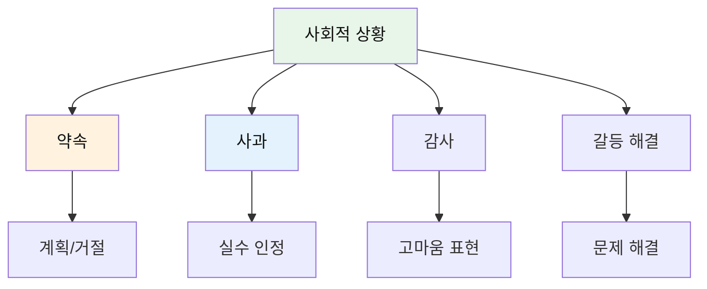

### 약속과 계획 (051-060)

| No. | 패턴 | 청크 분해 | 한국어 |
|:---:|------|----------|--------|
| 051 | I'm running a bit late. | Sorry, / I'm / running / a bit late. / Be there in 10. | 미안, / 나는 / 달리고 있어 / 약간 늦게. / 10분 안에 거기 갈게. |
| 052 | Sorry to keep you waiting. | Sorry / to keep / you / waiting. / Traffic was terrible. | 미안해 / 유지하게 해서 / 너를 / 기다리는 상태로. / 교통이 끔찍했어. |
| 053 | I owe you an apology. | I / owe / you / an apology / for what I said. | 나는 / 빚지고 있어 / 너에게 / 하나의 사과를 / 내가 말한 것에 대해. |
| 054 | I shouldn't have yelled at you. | I / shouldn't have / yelled / at you. | 나는 / 하지 말았어야 했어 / 소리 지르기를 / 너에게. |
| 055 | I didn't mean to hurt your feelings. | I / didn't / mean / to hurt your feelings. | 나는 / 하지 않았어 / 의도하기를 / 너의 감정을 상하게 하는 것. |
| 056 | How can I make it up to you? | I'm sorry. / How / can I / make it up / to you? | 미안해. / 어떻게 / 내가 할 수 있을까 / 보상하기를 / 너에게? |
| 057 | No hard feelings. | No / hard feelings. / We / are / cool. | 없어 / 나쁜 감정은. / 우리는 / ~이다 / 괜찮은(상관없는). |
| 058 | I really appreciate your help. | I / really / appreciate / your help. | 나는 / 정말 / 감사해 / 너의 도움을. |
| 059 | I can't thank you enough. | I / can't / thank you / enough / for everything. | 나는 / 할 수 없어 / 너에게 감사하기를 / 충분히 / 모든 것에 대해. |
| 060 | That was so sweet of you! | That / was / so sweet / of you / to remember! | 그것은 / ~이었다 / 정말 달콤한(다정한) / 너의 행동 / 기억해준 것! |

#### 051-060 패턴 학습
- [ ] 051-060 전체 학습 완료

### 문제 해결 (061-070)

| No. | 패턴 | 청크 분해 | 한국어 |
|:---:|------|----------|--------|
| 061 | You should be proud of yourself. | You / worked hard. / You / should be / proud. | 너는 / 열심히 일했어. / 너는 / 이어야만 해 / 자랑스러운 상태. |
| 062 | I'm in a bit of a situation. | I'm / in / a bit of / a situation. / Can you help? | 나는 / ~안에 있어 / 약간의 / 곤란한 상황. / 도와줄 수 있어? |
| 063 | Let's not make a big deal out of it. | It's minor. / Let's not / make / a big deal / out of it. | 그건 사소해. / 우리 하지 말자 / 만들기를 / 큰일로 / 그것으로부터. |
| 064 | We'll cross that bridge when we get there. | Don't worry. / We'll / cross / that bridge / when we get there. | 걱정 마. / 우리는 / 건널 거야 / 그 다리를 / 우리가 거기에 도착할 때. |
| 065 | Let's just play it by ear. | We / don't have / a plan. / Let's / just / play it by ear. | 우리는 / 가지고 있지 않아 / 계획을. / 우리 하자 / 그냥 / 상황 봐서 행동하기를. |
| 066 | Keep your fingers crossed! | I have / an interview / tomorrow. / Keep your fingers crossed! | 나는 가지고 있어 / 면접을 / 내일. / 행운을 빌어줘! |
| 067 | Break a leg! | You're / performing tonight? / Break a leg! | 너는 / 공연하는 거야 오늘 밤? / 행운을 빌어! |
| 068 | You've got this! | Don't / be nervous. / You've / got this! | 하지 마 / 긴장하기를. / 너는 / 이것을 가졌어! (할 수 있어!) |
| 069 | Hang in there! | I know / it's tough. / Hang / in there! | 나도 알아 / 그것이 힘들다는 것을. / 매달려 있어 / 거기 안에! (버텨!) |
| 070 | Everything will work out. | Don't worry. / Everything / will / work out. | 걱정 마. / 모든 것이 / 할 거야 / 잘 해결되기를. |

#### 061-070 패턴 학습
- [ ] 061-070 전체 학습 완료

---

## 📖 Part 4: 학업과 진로 (Patterns 071-090)

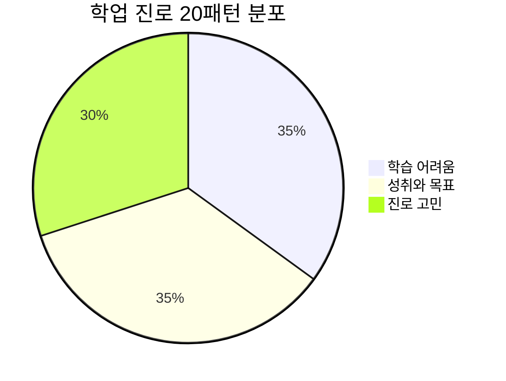

### 학습 관련 (071-080)

| No. | 패턴 | 청크 분해 | 한국어 |
|:---:|------|----------|--------|
| 071 | I'm struggling with this subject. | I'm / struggling / with / this subject. | 나는 / 분투하고 있어(어려움을 겪어) / ~로 / 이 과목. |
| 072 | I'm having trouble understanding. | I'm / having / trouble / understanding this concept. | 나는 / 가지는 중이야 / 문제를 / 이 개념을 이해하는 것에서. |
| 073 | Could you walk me through this? | Could you / walk me through / this problem / step by step? | 당신은 할 수 있나요 / 나를 이끌어주기를(설명해주기를) / 이 문제를 / 단계별로? |
| 074 | I finally figured it out! | I / finally / figured / it / out! | 나는 / 마침내 / 알아냈어 / 그것을 / 완전히! |
| 075 | I need to step up my game. | My grades / are slipping. / I need / to step up / my game. | 내 성적이 / 미끄러지고 있어. / 나는 필요해 / 한 단계 올리는 것이 / 나의 수준을. |
| 076 | I'm falling behind in math. | I'm / falling / behind / in math. | 나는 / 떨어지고 있어 / 뒤로 / 수학에서. |
| 077 | I'm going to pull an all-nighter. | I have / to pull / an all-nighter / for this project. | 나는 가지고 있어 / 당기는 것을(하는 것을) / 밤샘을 / 이 프로젝트를 위해. |
| 078 | I aced the test! | I / studied hard / and / aced the test! | 나는 / 공부했다 열심히 / 그리고 / 시험에서 A를 받았어! |
| 079 | I bombed the test. | I / didn't study / and / bombed the test. | 나는 / 공부하지 않았다 / 그리고 / 시험에 폭탄을 던졌어(망쳤어). |
| 080 | I nailed the presentation! | I / prepared well / and / nailed / the presentation! | 나는 / 준비했다 잘 / 그리고 / 제대로 해냈어 / 발표를! |

#### 071-080 패턴 학습
- [ ] 071-080 전체 학습 완료

### 진로 고민 (081-090)

| No. | 패턴 | 청크 분해 | 한국어 |
|:---:|------|----------|--------|
| 081 | I'm considering studying abroad. | I'm / considering / studying / abroad. | 나는 / 고려 중이야 / 공부하는 것을 / 해외에서. |
| 082 | I'm not sure what I want to do. | I'm / not sure / what / I want / to do / after graduation. | 나는 / 확실하지 않아 / 무엇을 / 내가 원하는지 / 하는 것을 / 졸업 후에. |
| 083 | I'm passionate about helping others. | I'm / passionate / about / helping others. | 나는 / 열정적이야 / ~에 대해 / 다른 사람들을 돕는 것. |
| 084 | My dream is to travel the world. | My dream / is / to travel / the world. | 내 꿈은 / ~이다 / 여행하는 것 / 세계를. |
| 085 | I'm working towards my goals. | I'm / working / towards / my goals / every day. | 나는 / 일하고 있어 / ~를 향해 / 나의 목표들 / 매일. |
| 086 | I need to weigh my options. | I need / to weigh / my options / carefully. | 나는 필요해 / 무게를 다는 것이(따져보는 것이) / 나의 선택지들을 / 신중하게. |
| 087 | I'm at a crossroads. | I'm / at / a crossroads / in my life. | 나는 / ~에 있어 / 갈림길 / 나의 인생에서. |
| 088 | I'm leaning towards the science track. | I'm / leaning / towards / the science track. | 나는 / 기울고 있어 / ~를 향해 / 과학 진로. |
| 089 | It's a tough decision. | Choosing / a major / is / a tough decision. | 선택하는 것은 / 전공을 / ~이다 / 하나의 힘든 결정. |
| 090 | I'm keeping my options open. | I'm / keeping / my options / open / for now. | 나는 / 유지하고 있어 / 나의 선택지들을 / 열린 상태로 / 지금은. |

#### 081-090 패턴 학습
- [ ] 081-090 전체 학습 완료

---

## 🗣️ Part 5: 토론과 설득 (Patterns 091-100)

### 의견 교환 (091-100)

| No. | 패턴 | 청크 분해 | 한국어 |
|:---:|------|----------|--------|
| 091 | I totally agree with you. | I / totally / agree / with you / on this. | 나는 / 완전히 / 동의해 / 너와 함께 / 이것에 대해. |
| 092 | You have a point there. | You / have / a point / there. / I didn't think / of that. | 너는 / 가지고 있어 / 하나의 논점(일리)을 / 거기서. / 나는 생각하지 못했어 / 그것에 대해. |
| 093 | I see where you're coming from. | I see / where / you're / coming from, / but... | 나는 알아 / 어디서 / 네가 / 오고 있는지(입장), / 하지만... |
| 094 | I beg to differ. | I / beg / to differ. / I think / the opposite / is true. | 나는 / 간청해 / 다르기를. (의견이 달라요) / 나는 생각해 / 정반대가 / 사실이라고. |
| 095 | I respectfully disagree. | I / respectfully / disagree / with / your opinion. | 나는 / 정중하게 / 반대해 / ~와 / 너의 의견. |
| 096 | Let's agree to disagree. | We / won't / agree / on this. / Let's / agree to disagree. | 우리는 / 하지 않을 거야 / 동의하기를 / 이것에 대해. / 우리 하자 / 다름을 인정하기로 동의하기를. |
| 097 | The point is... | The point / is, / we / can't / ignore this issue. | 그 요점은 / ~이다, / 우리는 / 할 수 없어 / 무시하기를 이 문제를. |
| 098 | Just hear me out. | Just / hear me / out / before / you decide. | 그냥 / 내 말을 들어줘 / 끝까지 / ~전에 / 네가 결정하기. |
| 099 | What do you have to lose? | It's free. / What / do you / have / to lose? | 그건 공짜야. / 무엇을 / 너는 / 가지고 있니 / 잃을 것에 대해? |
| 100 | Don't knock it till you try it. | Don't / knock it / till / you / try it. | 하지 마 / 그것을 비난하기를 / ~까지 / 네가 / 그것을 시도하기. |

#### 091-100 패턴 학습
- [ ] 091-100 전체 학습 완료

---

## ✈️ Part 6: 여행 실전 (Patterns 101-125)

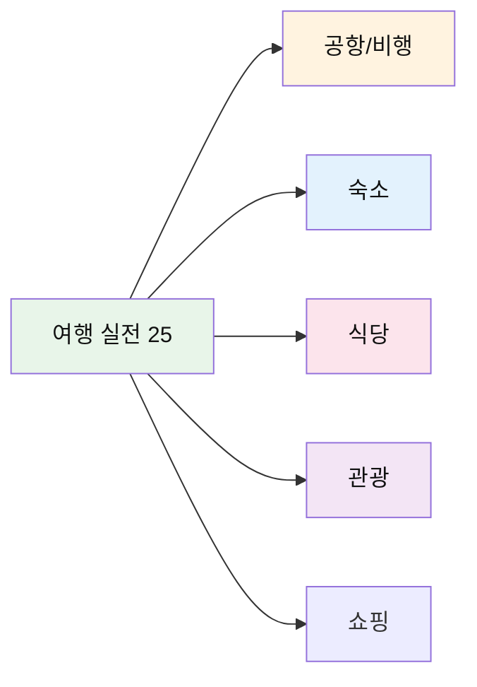

### 공항과 비행 (101-110)

| No. | 패턴 | 청크 분해 | 한국어 |
|:---:|------|----------|--------|
| 101 | Where can I check in for my flight? | Where / can I / check in / for my flight? | 어디서 / 나는 할 수 있나요 / 체크인하는 것을 / 내 비행기를 위해? |
| 102 | I'd like a window seat, please. | I'd like / a window seat, / please. | 나는 원해요 / 창가 좌석을, / 부탁합니다. |
| 103 | How many bags can I check? | How many bags / can I / check? | 몇 개의 가방을 / 나는 / 맡길 수 있나요? |
| 104 | Is this carry-on size okay? | Is / this carry-on / size / okay? | ~인가요 / 이 기내 반입 / 크기가 / 괜찮나요? |
| 105 | What gate does my flight leave from? | What gate / does / my flight / leave from? | 몇 번 게이트에서 / ~하나요 / 내 비행기가 / 출발하나요? |
| 106 | When do we start boarding? | When / do we / start boarding? | 언제 / 우리는 / 탑승을 시작하나요? |
| 107 | Can I get an aisle seat? | Can I get / an aisle seat? | 나는 받을 수 있나요 / 복도 좌석을? |
| 108 | My flight has been delayed. | My flight / has been / delayed / by two hours. | 내 비행기가 / ~되었어요 / 지연된 / 2시간. |
| 109 | Where do I pick up my luggage? | Where / do I / pick up / my luggage? | 어디서 / 나는 / 찾나요 / 내 수하물을? |
| 110 | I think my bag is lost. | I think / my bag / is lost. / It's not here. | 나는 생각해요 / 내 가방이 / 잃어버려진 것 같아요. / 여기 없어요. |

#### 101-110 패턴 상세 (선별)

#### 101. **Where can I check in for my flight?** - 어디서 체크인하나요?
```
Where / can I / check in / for my flight?
어디서 / 나는 할 수 있나요 / 체크인하는 것을 / 내 비행기를 위해?
```
**청크 포인트**: `Where` (장소) → `can I` (가능) → `check in` (체크인) → `for my flight?` (비행기)
**상황**: 공항 도착 후 가장 먼저 물어볼 표현

**💬 실전 대화 턴 (공항 도착 후)**
```
나: Excuse me. Where can I check in for my flight?
    (실례합니다. 어디서 제 비행기 체크인하나요?)
    
직원: What's your destination?
      (목적지가 어디신가요?)
      
나: I'm flying to Los Angeles.
    (로스앤젤레스로 가요.)
    
직원: Okay, you can check in at counter 15, over there.
      (네, 저기 15번 카운터에서 체크인하실 수 있습니다.)
      
나: Thank you! Do I need to print my boarding pass?
    (감사합니다! 탑승권을 출력해야 하나요?)
      
직원: You can do it at the counter or use the self-service kiosk.
      (카운터에서 하시거나 셀프 체크인 기기를 사용하시면 됩니다.)
```

**🎯 응용 연습**
- 여러 항공사: "Where can I check in for Korean Air?"
- 국제선: "Where can I check in for international flights?"
- 온라인 체크인 후: "I checked in online. Where do I drop my luggage?"

- [ ] 청크 읽기 | [ ] 직독직해 | [ ] 소리 내기

#### 102. **I'd like a window seat, please.** - 창가 좌석 주세요.
```
I'd like / a window seat, / please.
나는 원해요 / 창가 좌석을, / 부탁합니다.
```
**청크 포인트**: `I'd like` (원하다, 정중) → `a window seat,` (창가 자리) → `please.` (부탁)
**응용**: aisle seat (복도석), middle seat (가운데석)
- [ ] 청크 읽기 | [ ] 직독직해 | [ ] 소리 내기

### 숙소 (111-115)

| No. | 패턴 | 청크 분해 | 한국어 |
|:---:|------|----------|--------|
| 111 | I have a reservation under [이름]. | I have / a reservation / under Kim. | 나는 가지고 있어요 / 예약을 / 김 이름으로. |
| 112 | Can I get a room with a view? | Can I get / a room / with a view? | 나는 받을 수 있나요 / 방을 / 전망이 있는? |
| 113 | What time is checkout? | What time / is / checkout? | 몇 시인가요 / ~인지 / 체크아웃이? |
| 114 | Could I get a wake-up call? | Could I get / a wake-up call / at 7 AM? | 나는 받을 수 있나요 / 모닝콜을 / 오전 7시에? |
| 115 | The air conditioning isn't working. | The air conditioning / isn't working. / Can you fix it? | 에어컨이 / 작동하지 않아요. / 고쳐주실 수 있나요? |

#### 111-115 패턴 학습
- [ ] 111-115 전체 학습 완료

### 식당 (116-120)

| No. | 패턴 | 청크 분해 | 한국어 |
|:---:|------|----------|--------|
| 116 | Table for two, please. | Table / for two, / please. | 테이블 / 두 명을 위한, / 부탁합니다. |
| 117 | Can I see the menu? | Can I see / the menu, / please? | 나는 볼 수 있나요 / 메뉴를, / 부탁합니다? |
| 118 | What do you recommend? | What / do you / recommend? | 무엇을 / 당신은 / 추천하나요? |
| 119 | I'll have the same. | That looks good. / I'll have / the same. | 그거 좋아 보여요. / 나는 가질게요 / 같은 것을. |
| 120 | Can we get the check, please? | Can we get / the check, / please? | 우리가 받을 수 있나요 / 계산서를, / 부탁합니다? |

#### 116-120 패턴 학습
- [ ] 116-120 전체 학습 완료

### 관광 (121-125)

| No. | 패턴 | 청크 분해 | 한국어 |
|:---:|------|----------|--------|
| 121 | How do I get to [장소]? | How / do I / get to / the museum? | 어떻게 / 나는 / 가나요 / 박물관에? |
| 122 | Is it within walking distance? | Is it / within / walking distance? | 그것은 / ~안에 있나요 / 걸어갈 수 있는 거리? |
| 123 | Can you take a picture of us? | Excuse me, / can you / take a picture / of us? | 실례합니다, / 당신은 할 수 있나요 / 사진을 찍는 것을 / 우리의? |
| 124 | What time does it open? | What time / does / it / open? | 몇 시에 / ~하나요 / 그것이 / 여나요? |
| 125 | How much is the admission? | How much / is / the admission? | 얼마인가요 / ~인지 / 입장료가? |

#### 121-125 패턴 학습
- [ ] 121-125 전체 학습 완료

---

## 🆘 Part 7: 여행 문제해결 (Patterns 126-140)

### 긴급 상황 (126-135)

| No. | 패턴 | 청크 분해 | 한국어 | 긴급도 |
|:---:|------|----------|--------|:------:|
| 126 | I need help, please! | I need help, / please! / It's urgent! | 도움이 필요해요, / 제발! / 긴급해요! | 🚨🚨🚨 |
| 127 | I've lost my passport. | I've lost / my passport. / What should I do? | 나는 잃어버렸어요 / 내 여권을. / 뭘 해야 하나요? | 🚨🚨🚨 |
| 128 | Someone stole my wallet. | Someone / stole / my wallet! / Call the police! | 누군가가 / 훔쳤어요 / 내 지갑을! / 경찰을 불러주세요! | 🚨🚨🚨 |
| 129 | I don't feel well. | I don't feel well. / Is there / a hospital nearby? | 나는 기분이 안 좋아요. / 있나요 / 근처에 병원이? | 🚨🚨 |
| 130 | I'm allergic to [것]. | I'm allergic to / peanuts. / Please check the ingredients. | 나는 알레르기가 있어요 / 땅콩에. / 재료를 확인해 주세요. | 🚨🚨 |
| 131 | Where's the nearest pharmacy? | Where's / the nearest / pharmacy? / I need medicine. | 어디 있나요 / 가장 가까운 / 약국이? / 약이 필요해요. | 🚨 |
| 132 | Can you call an ambulance? | Can you / call / an ambulance? / It's an emergency! | 당신은 할 수 있나요 / 부르는 것을 / 구급차를? / 긴급 상황이에요! | 🚨🚨🚨 |
| 133 | I've been in an accident. | I've been / in an accident. / I need help. | 나는 있었어요 / 사고에. / 도움이 필요해요. | 🚨🚨🚨 |
| 134 | My phone was stolen. | My phone / was stolen. / Can I / use yours? | 내 전화기가 / 도난당했어요. / 제가 / 당신 것을 사용할 수 있나요? | 🚨🚨 |
| 135 | I'm locked out of my room. | I'm locked out / of my room. / Can you help? | 나는 잠겨서 못 들어가요 / 내 방에. / 도와줄 수 있나요? | 🚨 |

#### 126-135 패턴 학습
- [ ] 126-135 전체 학습 완료

### 일반 문제 (136-140)

| No. | 패턴 | 청크 분해 | 한국어 |
|:---:|------|----------|--------|
| 136 | This isn't what I ordered. | This / isn't / what I ordered. / I ordered / the pasta. | 이것은 / 아니에요 / 내가 주문한 것이. / 나는 주문했어요 / 파스타를. |
| 137 | There's a mistake in the bill. | Excuse me, / there's / a mistake / in the bill. | 실례합니다, / 있어요 / 실수가 / 계산서에. |
| 138 | Can I get a refund? | This is damaged. / Can I get / a refund? | 이것은 파손됐어요. / 나는 받을 수 있나요 / 환불을? |
| 139 | I'd like to exchange this. | I'd like / to exchange / this / for a different size. | 나는 원해요 / 교환하는 것을 / 이것을 / 다른 사이즈로. |
| 140 | Do you speak English? | Excuse me, / do you / speak / English? | 실례합니다, / 당신은 / 하시나요 / 영어를? |

#### 136-140 패턴 학습
- [ ] 136-140 전체 학습 완료

---

## 💔 Part 8: 관계와 소통 (Patterns 141-150)

### 인간관계 (141-150)

| No. | 패턴 | 청크 분해 | 한국어 | 감정 |
|:---:|------|----------|--------|------|
| 141 | We've grown apart. | We / were close, / but / we've / grown apart. | 우리는 / 가까웠어, / 하지만 / 우리는 / 멀어지며 자랐어(사이가 멀어졌어). | 😢 |
| 142 | I can always count on you. | Thanks. / I / can / always / count on / you. | 고마워. / 나는 / 할 수 있어 / 항상 / 의지하기를 / 너에게. | 😊 |
| 143 | I've got your back. | Don't worry. / I've / got / your back. | 걱정 마. / 나는 / 가졌어 / 너의 등을. (네 편이야) | 😊 |
| 144 | We're on the same page. | We / are / on the / same page / about this. | 우리는 / ~이다 / ~위에 / 같은 페이지 / 이것에 대해. | 😊 |
| 145 | We need to talk. | We / need / to talk / about / what happened. | 우리는 / 필요해 / 이야기하는 것이 / ~에 대해 / 일어난 일. | 😐 |
| 146 | Can we clear the air? | Can we / clear / the air / between us? | 우리가 할 수 있을까 / 맑게 하기를 / 그 공기를 / 우리 사이에? (오해를 풀다) | 😐 |
| 147 | I didn't mean it that way. | I / didn't / mean it / that way. / Let me explain. | 나는 / 하지 않았어 / 그것을 의도하기를 / 그런 식으로. / 내가 설명하게 해줘. | 😐 |
| 148 | Let's put this behind us. | Let's / put / this / behind us / and move forward. | 우리 하자 / 두기를 / 이것을 / 우리 뒤에 / 그리고 앞으로 나아가기를. | 😊 |
| 149 | I'm willing to compromise. | I'm / willing / to compromise / if / you are. | 나는 / 기꺼이 하는 상태야 / 타협하는 것을 / 만약 / 네가 그렇다면. | 😊 |
| 150 | We'll figure it out together. | Don't worry. / We'll / figure it out / together. | 걱정 마. / 우리는 / 해결할 거야 / 함께. | 😊 |

#### 141-150 패턴 상세 (선별)

#### 142. **I can always count on you.** - 넌 항상 믿을 수 있어.
```
Thanks. / I / can / always / count on / you.
고마워. / 나는 / 할 수 있어 / 항상 / 의지하기를 / 너에게.
```
**청크 포인트**: `Thanks.` (감사) → `I can always` (항상 할 수 있다) → `count on` (의지하다) → `you.` (너를)
**뉘앙스**: 깊은 신뢰와 감사의 표현
- [ ] 청크 읽기 | [ ] 직독직해 | [ ] 소리 내기

#### 145. **We need to talk.** - 우리 얘기 좀 해야 해.
```
We / need / to talk / about / what happened.
우리는 / 필요해 / 이야기하는 것이 / ~에 대해 / 일어난 일.
```
**청크 포인트**: `We` (우리) → `need` (필요) → `to talk` (말하기) → `about what happened` (일어난 일에 대해)
**뉘앙스**: 진지한 대화가 필요한 상황
- [ ] 청크 읽기 | [ ] 직독직해 | [ ] 소리 내기

#### 150. **We'll figure it out together.** - 함께 해결할 거야.
```
Don't worry. / We'll / figure it out / together.
걱정 마. / 우리는 / 해결할 거야 / 함께.
```
**청크 포인트**: `Don't worry.` (위로) → `We'll` (우리는 할 거야) → `figure it out` (해결하다) → `together.` (함께)
**뉘앙스**: 격려와 연대감
- [ ] 청크 읽기 | [ ] 직독직해 | [ ] 소리 내기

---

## 📊 전체 패턴 종합 분석

### 카테고리별 분포

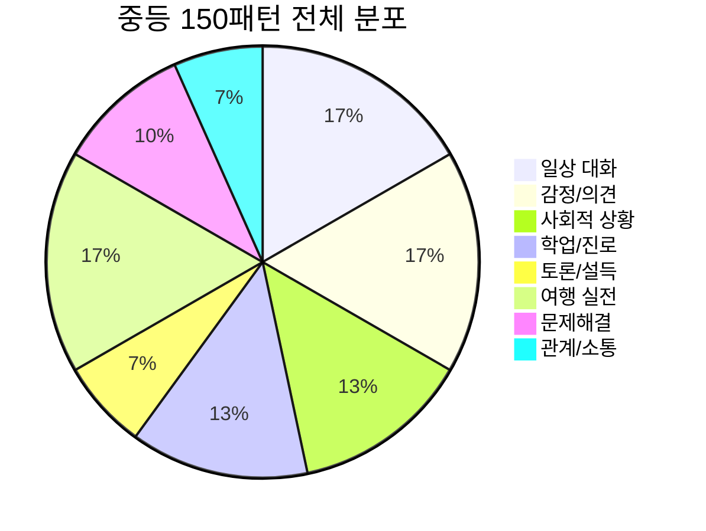

### 난이도 분석

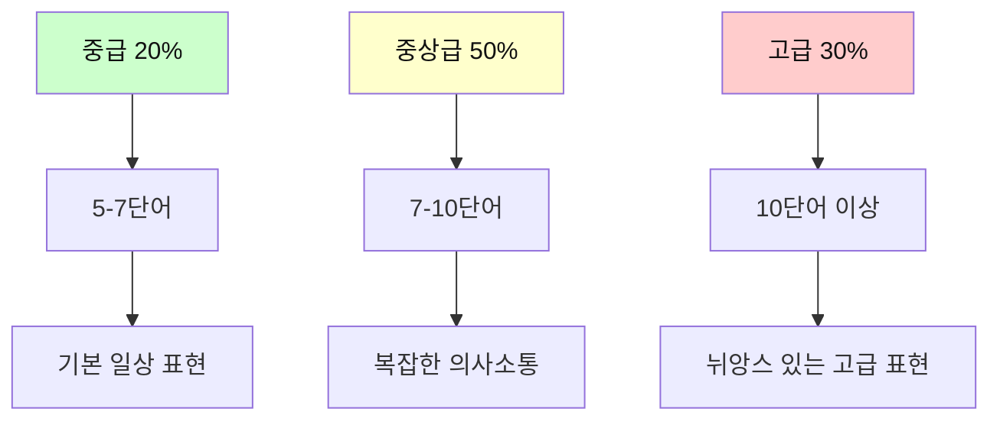

### 활용 우선순위

| 순위 | 카테고리 | 일상 | 여행 | 학교 | 중요도 |
|------|----------|------|------|------|--------|
| 1 | 일상 대화 | ⭐⭐⭐⭐⭐ | ⭐⭐⭐⭐ | ⭐⭐⭐⭐⭐ | 높음 |
| 2 | 감정/의견 | ⭐⭐⭐⭐⭐ | ⭐⭐⭐ | ⭐⭐⭐⭐⭐ | 높음 |
| 3 | 여행 실전 | ⭐⭐ | ⭐⭐⭐⭐⭐ | ⭐⭐ | 높음 |
| 4 | 사회적 상황 | ⭐⭐⭐⭐ | ⭐⭐⭐⭐ | ⭐⭐⭐ | 중간 |
| 5 | 학업/진로 | ⭐⭐⭐ | ⭐ | ⭐⭐⭐⭐⭐ | 중간 |
| 6 | 문제해결 | ⭐⭐⭐ | ⭐⭐⭐⭐⭐ | ⭐⭐ | 중간 |
| 7 | 토론/설득 | ⭐⭐⭐ | ⭐⭐ | ⭐⭐⭐⭐ | 중간 |
| 8 | 관계/소통 | ⭐⭐⭐⭐⭐ | ⭐⭐ | ⭐⭐⭐⭐ | 높음 |

---

## 💡 학습 가이드

### 3주 완성 마스터 플랜

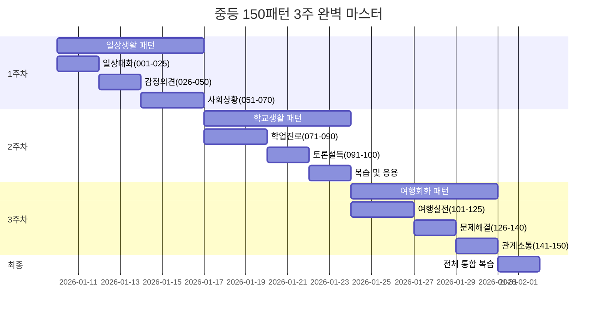

### 일일 학습 루틴

| 시간 | 활동 | 패턴 수 | 방법 | 목표 |
|------|------|---------|------|------|
| **07:00-07:20** | 전날 복습 | 10개 | 빠른 청크 읽기 | 기억 유지 |
| **12:30-13:00** | 신규 학습 | 7-8개 | 정독+분석 | 이해 |
| **18:00-18:30** | 응용 연습 | 10개 | 문장 변형 | 활용 |
| **21:00-21:30** | 종합 복습 | 15개 | 상황별 연습 | 자동화 |

### 청크 마스터 6단계

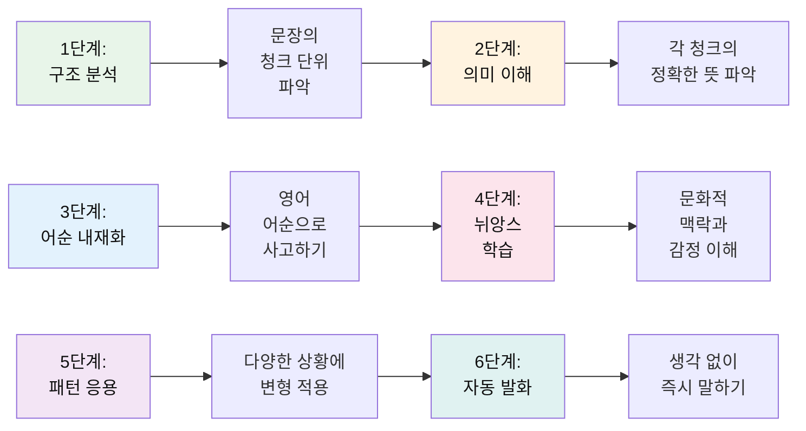

---

## 🎯 실전 시나리오

### 시나리오 1: 해외 여행 첫날

| 단계 | 상황 | 사용 패턴 | 번호 |
|------|------|----------|------|
| 1 | 공항 도착 | Where can I check in for my flight? | 101 |
| 2 | 좌석 요청 | I'd like a window seat, please. | 102 |
| 3 | 수하물 | How many bags can I check? | 103 |
| 4 | 비행 지연 | My flight has been delayed. | 108 |
| 5 | 호텔 체크인 | I have a reservation under Kim. | 111 |
| 6 | 방 문제 | The air conditioning isn't working. | 115 |

### 시나리오 2: 학교에서 프로젝트 협업

| 단계 | 상황 | 사용 패턴 | 번호 |
|------|------|----------|------|
| 1 | 의견 제시 | In my opinion, this is the best approach. | 036 |
| 2 | 동의 표현 | I totally agree with you. | 091 |
| 3 | 다른 의견 | I see where you're coming from, but... | 093 |
| 4 | 타협 | I'm willing to compromise. | 149 |
| 5 | 격려 | We'll figure it out together. | 150 |

### 시나리오 3: 긴급 상황 대처

| 상황 | 긴급도 | 사용 패턴 | 번호 |
|------|--------|----------|------|
| 여권 분실 | 🚨🚨🚨 | I've lost my passport. | 127 |
| 지갑 도난 | 🚨🚨🚨 | Someone stole my wallet! | 128 |
| 건강 문제 | 🚨🚨 | I don't feel well. | 129 |
| 알레르기 | 🚨🚨 | I'm allergic to peanuts. | 130 |
| 약 필요 | 🚨 | Where's the nearest pharmacy? | 131 |

---

## 📝 마스터 체크리스트

### 레벨별 달성 기준

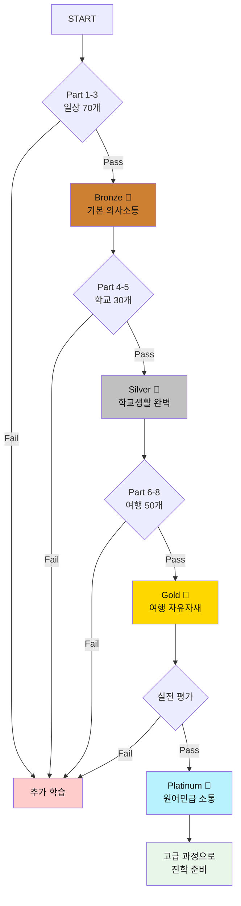

### 평가 기준표

| 레벨 | 패턴 수 | 청크 분석 | 직독직해 | 발화 | 응용 | 보상 |
|------|---------|----------|----------|------|------|------|
| **Bronze** | 70개 | 80% | 70% | 60% | 40% | 🥉 |
| **Silver** | 100개 | 90% | 85% | 75% | 60% | 🥈 |
| **Gold** | 150개 | 95% | 95% | 90% | 80% | 🥇 |
| **Platinum** | 150개 | 100% | 100% | 95% | 90% | 💎 |

---

## 🌟 학습 성공 전략

### TOP 15 고급 학습 전략

1. **뉘앙스 학습** - 단순 번역이 아닌 문화적 맥락 이해
2. **원어민 영상** - 넷플릭스, 유튜브로 실제 사용 관찰
3. **쉐도잉** - 원어민 음성 따라하며 억양 체득
4. **일기 쓰기** - 배운 패턴으로 매일 3문장 일기
5. **음성 녹음** - 자신의 발음 녹음 후 비교
6. **스터디 그룹** - 친구들과 영어로만 대화 시간
7. **앱 활용** - 듀오링고, 캠블리로 실전 연습
8. **드라마 분석** - 한 장면을 여러 번 보며 패턴 찾기
9. **상황 시뮬레이션** - 가상의 여행/학교 상황 연기
10. **오류 노트** - 자주 틀리는 패턴 따로 정리
11. **주간 테스트** - 매주 금요일 랜덤 20개 패턴 테스트
12. **보상 시스템** - 목표 달성 시 자신에게 상 주기
13. **챗GPT 활용** - AI와 영어 대화 연습
14. **영어 사고** - 하루 10분 영어로만 생각하기
15. **지속성** - 하루 30분, 90일 연속 달성

---

*Last Updated: 2026-01-10*
*Total Patterns: 150개 | Daily Practice: 40-60분 | Complete in: 3주*
*Next Level: 고급 비즈니스 영어 또는 토론/프레젠테이션 영어*

