# 🎓 전설의 고등 회화 150패턴 - 청크 마스터

## 🎯 학습 안내

고등학생 수준에서 학술적 토론, 대학 준비, 해외 교환학생, 그리고 실생활에서 필요한 **150가지 고급 패턴**을 청크(Chunk, 의미 단위) 형태로 익히는 과정입니다. 원어민처럼 자연스럽고 논리적인 의사소통이 가능하도록 설계되었습니다.

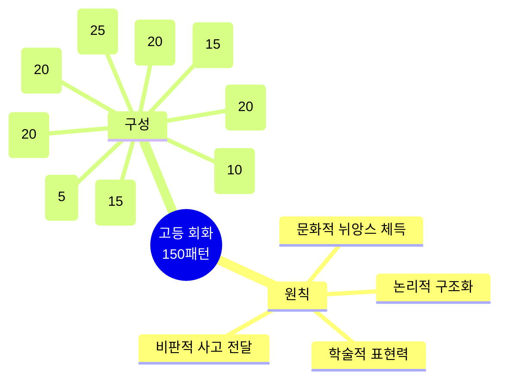

---

## 📊 전체 구조 한눈에 보기

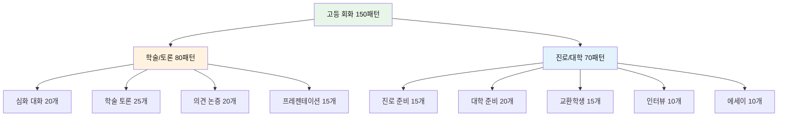

---

## 📚 학습 방법

| 단계 | 방법 | 시간 | 핵심 포인트 | 난이도 |
|------|------|------|-------------|--------|
| **1단계** | 논리 구조 분석 | 2분 | 문장의 논리적 흐름 파악 | ⭐⭐⭐⭐ |
| **2단계** | 학술적 해석 | 2분 | 형식적/비형식적 차이 이해 | ⭐⭐⭐⭐⭐ |
| **3단계** | 발화 연습 | 3분 | 자신감 있는 억양과 강세 | ⭐⭐⭐⭐ |
| **4단계** | 맥락 변형 | 3분 | 다양한 학술/비즈니스 상황 적용 | ⭐⭐⭐⭐⭐ |
| **5단계** | 실전 토론 | 5분 | 실시간 논리적 대화 | ⭐⭐⭐⭐⭐ |

---

## 💭 Part 1: 심화 일상 대화 (Patterns 001-020)

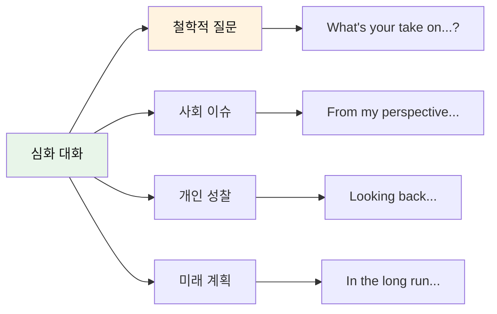

### 깊이 있는 대화 (001-010)

| No. | 패턴 | 청크 분해 | 한국어 | 상황 |
|:---:|------|----------|--------|------|
| 001 | What's your take on this? | What's / your take / on / this issue? | 무엇인가요 / 당신의 견해는 / ~에 대한 / 이 이슈? | 의견 묻기 |
| 002 | From my perspective... | From / my perspective, / we need / systemic change. | ~로부터 / 나의 관점, / 우리는 필요해 / 체계적 변화가. | 관점 제시 |
| 003 | That's a valid point. | That's / a valid point, / but / have you considered...? | 그것은 / 타당한 논점이야, / 하지만 / 너는 고려했니...? | 인정+반론 |
| 004 | I'm torn between... | I'm / torn between / pursuing my passion / and being practical. | 나는 / 갈라져 있어 / 내 열정을 추구하는 것과 / 실용적인 것 사이에. | 갈등 |
| 005 | It's more nuanced than that. | It's / more nuanced / than that. / Let me explain. | 그것은 / 더 미묘해 / 그것보다. / 내가 설명할게. | 복잡성 설명 |
| 006 | I've been reflecting on... | I've been / reflecting on / my values / lately. | 나는 해왔어 / 성찰하기를 / 나의 가치관을 / 최근에. | 자기 성찰 |
| 007 | That resonates with me. | That / really / resonates with me / on a personal level. | 그것은 / 정말 / 공명해 나와 함께 / 개인적 차원에서. | 깊은 공감 |
| 008 | I'm having second thoughts about... | I'm having / second thoughts / about / my major. | 나는 가지고 있어 / 재고를 / ~에 대해 / 내 전공. | 재고려 |
| 009 | In the grand scheme of things... | In / the grand scheme of things, / this is / relatively minor. | 안에서 / 거대한 계획(큰 그림), / 이것은 / 상대적으로 사소해. | 큰 그림 |
| 010 | That's food for thought. | That's / interesting. / That's / definitely / food for thought. | 그것은 / 흥미로워. / 그것은 / 확실히 / 생각할 거리야. | 깊은 고민 |

#### 001-010 패턴 상세 (선별)

#### 001. **What's your take on this?** - 이것에 대한 당신 견해는?
```
What's / your take / on / this issue?
무엇인가요 / 당신의 견해는 / ~에 대한 / 이 이슈?
```
**청크 포인트**: `What's` (무엇) → `your take` (당신의 견해, 비형식적) → `on` (대상) → `this issue?` (이 이슈)
**뉘앙스**: "opinion"보다 캐주얼하고 대화적인 표현
**응용**: What's your take on climate change? / What's your take on the new policy?

**💬 실전 대화 턴 (학급 토론 후)**
```
A: We just discussed social media's impact on teens. What's your take on this issue?
   (우리 방금 소셜 미디어가 청소년에게 미치는 영향을 토론했어. 이 이슈에 대한 너의 견해는?)
   
B: From my perspective, it's a double-edged sword. It connects us but also creates pressure.
   (내 관점에서는, 양날의 검이야. 우리를 연결하지만 압박도 만들어.)
   
A: That's a valid point. What kind of pressure are you talking about?
   (타당한 지적이야. 어떤 종류의 압박을 말하는 거야?)
   
B: You know, the constant comparison with others, FOMO, that kind of thing.
   (있잖아, 다른 사람들과의 끊임없는 비교, 소외 공포, 그런 거.)
   
A: I see what you mean. So would you say the negatives outweigh the positives?
   (무슨 말인지 알겠어. 그럼 부정적인 면이 긍정적인 면보다 크다고 생각해?)
   
B: Not necessarily. It depends on how you use it. What's your take?
   (꼭 그렇지는 않아. 어떻게 사용하느냐에 달렸지. 너 생각은?)
```

**🎯 응용 연습**
- 환경 문제: "What's your take on renewable energy?"
- 교육 정책: "What's your take on standardized testing?"
- 사회 이슈: "What's your take on work-life balance?"

- [ ] 청크 읽기 | [ ] 직독직해 | [ ] 소리 내기

#### 004. **I'm torn between...** - ~사이에서 갈등하고 있어.
```
I'm / torn between / pursuing my passion / and being practical.
나는 / 갈라져 있어 / 내 열정을 추구하는 것과 / 실용적인 것 사이에.
```
**청크 포인트**: `I'm torn` (찢어진, 갈등하는) → `between` (사이) → `pursuing my passion` (열정 추구) → `and being practical` (실용성)
**뉘앙스**: 내적 갈등을 표현하는 고급 표현

**💬 실전 대화 턴 (진로 상담 중)**
```
상담사: So, you're trying to decide on your major. What are you considering?
        (그래서, 전공을 결정하려고 하는구나. 무엇을 고려하고 있니?)
        
학생: Honestly, I'm torn between pursuing my passion for art and being practical.
      (솔직히, 예술에 대한 열정을 추구하는 것과 실용적인 것 사이에서 갈등하고 있어요.)
      
상담사: That's a common dilemma. What does "being practical" mean to you?
        (흔한 딜레마야. 너에게 "실용적"이라는 게 무슨 의미니?)
        
학생: Well, my parents want me to major in business or engineering. They say it's safer.
      (음, 부모님이 경영이나 공학을 전공하길 원하세요. 더 안전하다고 하시거든요.)
      
상담사: I understand. But have you considered that you might find a way to combine both?
        (이해해. 하지만 둘 다 결합할 방법을 찾을 수 있다는 걸 고려해봤니?)
        
학생: Like what? I didn't know that was possible.
      (어떻게요? 그게 가능한지 몰랐어요.)
      
상담사: Well, there's graphic design, digital media, even art business management. Let's explore your options.
        (음, 그래픽 디자인, 디지털 미디어, 심지어 예술 경영도 있어. 선택지들을 탐색해보자.)
```

**🎯 응용 연습**
- 대학 선택: "I'm torn between studying abroad and staying close to home."
- 시간 관리: "I'm torn between finishing my project and getting enough sleep."
- 친구 관계: "I'm torn between telling the truth and not hurting their feelings."

- [ ] 청크 읽기 | [ ] 직독직해 | [ ] 소리 내기

#### 005. **It's more nuanced than that.** - 그것보다 더 미묘해.
```
It's / more nuanced / than that. / Let me explain.
그것은 / 더 미묘해 / 그것보다. / 내가 설명할게.
```
**청크 포인트**: `It's more nuanced` (더 미묘하다) → `than that` (그것보다) → `Let me explain` (설명하겠다)
**뉘앙스**: 단순하지 않은 복잡한 상황을 설명할 때

**💬 실전 대화 턴 (토론 수업 중)**
```
A: So you're saying social media is completely bad for teenagers?
   (그래서 소셜 미디어가 청소년에게 완전히 나쁘다는 거야?)
   
B: No, it's more nuanced than that. Let me explain.
   (아니, 그것보다 더 미묘해. 설명할게.)
   
A: Okay, I'm listening. What do you mean by nuanced?
   (좋아, 듣고 있어. 미묘하다는 게 무슨 말이야?)
   
B: Well, it depends on how it's used. It can be harmful or beneficial.
   (음, 어떻게 사용되느냐에 달려 있어. 해로울 수도 유익할 수도 있어.)
   
A: So it's not black and white. That's a fair point.
   (그래서 흑백논리가 아니구나. 타당한 지적이야.)
   
B: Exactly. It's more nuanced than simply saying it's good or bad.
   (정확해. 단순히 좋다 나쁘다고 하는 것보다 더 미묘해.)
```

**🎯 응용 연습**
- 정치: "The immigration issue is more nuanced than people think."
- 경제: "The economic impact is more nuanced than the data suggests."
- 윤리: "It's more nuanced than right or wrong in this case."

- [ ] 청크 읽기 | [ ] 직독직해 | [ ] 소리 내기

### 사회적 이슈 토론 (011-020)

| No. | 패턴 | 청크 분해 | 한국어 |
|:---:|------|----------|--------|
| 011 | The way I see it... | The way / I see it, / technology / is a double-edged sword. | 그 방식 / 내가 보는 / 그것을, / 기술은 / 양날의 검이야. |
| 012 | There are pros and cons to... | There are / pros and cons / to / social media usage. | 있어 / 장단점이 / ~에 / 소셜 미디어 사용. |
| 013 | I'm skeptical about... | I'm / skeptical about / the effectiveness / of standardized tests. | 나는 / 회의적이야 / 효과성에 대해 / 표준화된 시험의. |
| 014 | We need to strike a balance between... | We need / to strike a balance / between / freedom and responsibility. | 우리는 필요해 / 균형을 맞추기를 / ~사이에 / 자유와 책임. |
| 015 | That's a slippery slope. | That's / a slippery slope / argument. / Where do we draw the line? | 그것은 / 미끄러운 비탈이야 / 논쟁. / 어디서 우리는 선을 그을까? |
| 016 | Let's not jump to conclusions. | Let's not / jump to conclusions / until / we have all the facts. | 우리 하지 말자 / 성급한 결론에 뛰어들기를 / ~까지 / 우리가 모든 사실을 가질 때. |
| 017 | I'd like to play devil's advocate. | I'd like / to play devil's advocate / for a moment. | 나는 원해 / 악마의 대변인 역할을 하기를 / 잠시 동안. |
| 018 | There's merit to both sides. | There's / merit / to both sides / of the argument. | 있어 / 장점이 / 양측 모두에 / 그 논쟁의. |
| 019 | We're missing the bigger picture. | We're / missing / the bigger picture / here. | 우리는 / 놓치고 있어 / 더 큰 그림을 / 여기서. |
| 020 | It depends on the context. | It / depends on / the context / and circumstances. | 그것은 / 달려 있어 / 맥락과 / 상황에. |

#### 011-020 패턴 학습
- [ ] 011-020 전체 청크 읽기 완료
- [ ] 011-020 직독직해 완료
- [ ] 011-020 소리 내기 완료

---

## 📖 Part 2: 학술 토론 (Patterns 021-045)

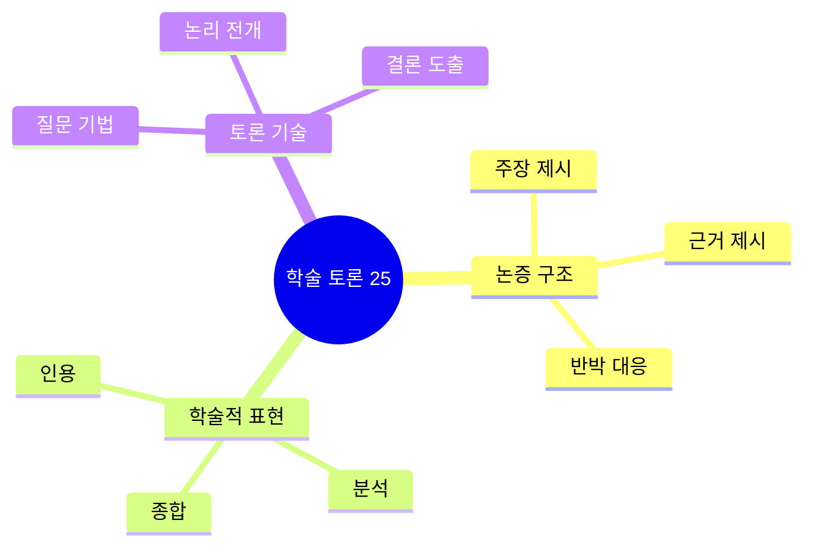

### 논리적 주장 (021-030)

| No. | 패턴 | 청크 분해 | 한국어 | 기능 |
|:---:|------|----------|--------|------|
| 021 | According to recent research... | According to / recent research, / there's a correlation between... | ~에 따르면 / 최근 연구, / 상관관계가 있어... | 근거 제시 |
| 022 | Studies have shown that... | Studies / have shown that / early intervention / is crucial. | 연구들이 / 보여줬어 / 조기 개입이 / 결정적이라고. | 연구 인용 |
| 023 | The data suggests that... | The data / suggests that / we need / a different approach. | 그 데이터는 / 제안해 / 우리가 필요하다고 / 다른 접근법이. | 데이터 해석 |
| 024 | This raises the question of... | This / raises / the question of / whether it's sustainable. | 이것은 / 제기해 / 그 질문을 / 그것이 지속가능한지의. | 질문 제기 |
| 025 | One could argue that... | One could argue / that / traditional methods / are outdated. | 누군가는 주장할 수 있어 / ~라고 / 전통적 방법들이 / 구식이라고. | 가능 주장 |
| 026 | It's worth noting that... | It's / worth noting that / correlation / doesn't imply causation. | 그것은 / 주목할 가치가 있어 / 상관관계가 / 인과관계를 의미하지 않는다는 것. | 주의사항 |
| 027 | This begs the question... | This / begs the question: / what are / the long-term implications? | 이것은 / 질문을 불러일으켜: / 무엇인가 / 장기적 영향이? | 후속 질문 |
| 028 | There's a growing body of evidence... | There's / a growing body / of evidence / supporting this theory. | 있어 / 증가하는 몸체가 / 증거의 / 이 이론을 지지하는. | 증거 누적 |
| 029 | This challenges the assumption that... | This / challenges / the assumption that / success equals happiness. | 이것은 / 도전해 / 그 가정에 / 성공이 행복과 같다는. | 가정 도전 |
| 030 | Drawing from multiple sources... | Drawing from / multiple sources, / we can conclude that... | 끌어오면서 / 다수의 출처로부터, / 우리는 결론내릴 수 있어... | 종합 분석 |

#### 021-030 패턴 상세 (선별)

#### 021. **According to recent research...** - 최근 연구에 따르면...
```
According to / recent research, / there's a correlation between...
~에 따르면 / 최근 연구, / 상관관계가 있어...
```
**청크 포인트**: `According to` (에 따르면) → `recent research,` (최근 연구) → `there's a correlation` (상관관계 존재)
**뉘앙스**: 학술적 권위를 빌려 주장 강화
**응용**: According to the study / According to experts / According to statistics

**💬 실전 대화 턴 (과학 프레젝트 발표)**
```
발표자: According to recent research published in Nature, there's a correlation between sleep deprivation and academic performance.
        (Nature에 발표된 최근 연구에 따르면, 수면 부족과 학업 성적 사이에 상관관계가 있습니다.)
        
청중: That's interesting. What exactly did they find?
      (흥미롭네요. 정확히 무엇을 발견했나요?)
      
발표자: Students who slept less than 6 hours per night scored 15% lower on tests on average.
        (하루 6시간 미만으로 자는 학생들이 평균적으로 시험에서 15% 낮은 점수를 받았습니다.)
        
청중: But wait, doesn't that just show correlation, not causation?
      (잠깐만요, 그건 단지 상관관계만 보여주는 거 아닌가요, 인과관계가 아니라?)
      
발표자: You're absolutely right. That's why the researchers did follow-up studies controlling for other variables.
        (완전히 맞습니다. 그래서 연구자들이 다른 변수들을 통제하는 추가 연구를 했습니다.)
        
청중: And what did those show?
      (그리고 그것들은 무엇을 보여줬나요?)
      
발표자: They confirmed that sleep quality directly impacts cognitive function. Let me show you the data.
        (수면의 질이 직접적으로 인지 기능에 영향을 미친다는 것을 확인했습니다. 데이터를 보여드리겠습니다.)
```

**🎯 응용 연습**
- 환경 토론: "According to recent research, renewable energy is becoming more cost-effective."
- 건강 주제: "According to medical experts, regular exercise reduces stress significantly."
- 경제 논의: "According to economic data, youth unemployment has decreased."

- [ ] 청크 읽기 | [ ] 직독직해 | [ ] 소리 내기

#### 024. **This raises the question of...** - 이것은 ~의 질문을 제기해.
```
This / raises / the question of / whether it's sustainable.
이것은 / 제기해 / 그 질문을 / 그것이 지속가능한지의.
```
**청크 포인트**: `This raises` (제기하다) → `the question of` (질문을) → `whether...` (~인지)
**뉘앙스**: 토론을 더 깊은 차원으로 이끄는 표현

**💬 실전 대화 턴 (경제 토론 중)**
```
A: The government just announced massive subsidies for electric vehicles.
   (정부가 방금 전기차에 대한 대규모 보조금을 발표했어.)
   
B: This raises the question of whether it's sustainable in the long run.
   (이것은 장기적으로 지속가능한지에 대한 질문을 제기해.)
   
A: You're right. That raises another question too—who's funding this?
   (맞아. 그것도 또 다른 질문을 제기해—누가 이걸 자금을 대고 있는 거지?)
   
B: Exactly. This raises the question of whether taxpayers are being fairly treated.
   (정확해. 이것은 납세자들이 공정하게 대우받고 있는지에 대한 질문을 제기해.)
```

**🎯 응용 연습**
- 교육: "This raises the question of whether standardized tests are effective."
- 환경: "This raises the question of whether we're doing enough for climate change."
- 기술: "This raises the question of whether AI will replace human jobs."

- [ ] 청크 읽기 | [ ] 직독직해 | [ ] 소리 내기

### 비판적 분석 (031-045)

| No. | 패턴 | 청크 분해 | 한국어 |
|:---:|------|----------|--------|
| 031 | What are the implications of...? | What are / the implications / of / this policy change? | 무엇인가 / 그 영향들이 / ~의 / 이 정책 변화? |
| 032 | We need to examine the underlying causes. | We need / to examine / the underlying causes / of this phenomenon. | 우리는 필요해 / 조사하기를 / 근본적인 원인들을 / 이 현상의. |
| 033 | There's a disconnect between... | There's / a disconnect / between / theory and practice. | 있어 / 단절이 / ~사이에 / 이론과 실제. |
| 034 | This warrants further investigation. | This / warrants / further investigation / before we draw conclusions. | 이것은 / 필요로 해 / 추가 조사를 / 우리가 결론을 내리기 전에. |
| 035 | Let's deconstruct this argument. | Let's / deconstruct / this argument / step by step. | 우리 하자 / 해체하기를 / 이 논증을 / 단계별로. |
| 036 | The evidence is inconclusive. | The evidence / is / inconclusive / at this point. | 그 증거는 / ~이다 / 결정적이지 않은 / 이 시점에서. |
| 037 | We're conflating two separate issues. | We're / conflating / two separate issues / here. | 우리는 / 혼동하고 있어 / 두 개의 별개 이슈를 / 여기서. |
| 038 | That's an oversimplification. | That's / an oversimplification / of / a complex issue. | 그것은 / 지나친 단순화야 / ~의 / 복잡한 이슈. |
| 039 | Let's look at this from another angle. | Let's / look at this / from / another angle. | 우리 하자 / 이것을 보기를 / ~로부터 / 다른 각도. |
| 040 | The root cause lies in... | The root cause / lies in / systemic inequality. | 그 근본 원인은 / 놓여 있어 / 체계적 불평등에. |
| 041 | This phenomenon can be attributed to... | This phenomenon / can be attributed to / multiple factors. | 이 현상은 / 귀속될 수 있어 / 다수의 요인들에. |
| 042 | We need to consider the broader context. | We need / to consider / the broader context / of this issue. | 우리는 필요해 / 고려하기를 / 더 넓은 맥락을 / 이 이슈의. |
| 043 | There's a paradigm shift happening. | There's / a paradigm shift / happening / in this field. | 있어 / 패러다임 전환이 / 일어나고 있어 / 이 분야에서. |
| 044 | Let's synthesize these ideas. | Let's / synthesize / these ideas / into a coherent framework. | 우리 하자 / 종합하기를 / 이 아이디어들을 / 일관된 틀로. |
| 045 | The consensus among experts is... | The consensus / among experts / is that / we need urgent action. | 그 합의는 / 전문가들 사이의 / ~라는 것이야 / 우리가 긴급한 행동이 필요하다는 것. |

#### 031-045 패턴 상세 (선별)

#### 032. **We need to examine the underlying causes.** - 근본적인 원인을 조사해야 해.
```
We need / to examine / the underlying causes / of this phenomenon.
우리는 필요해 / 조사하기를 / 근본적인 원인들을 / 이 현상의.
```
**청크 포인트**: `We need to examine` (조사해야 해) → `the underlying causes` (근본 원인) → `of this phenomenon` (이 현상의)

**💬 실전 대화 턴 (사회문제 토론)**
```
A: Youth unemployment is at an all-time high. What do you think?
   (청년 실업이 사상 최고야. 어떻게 생각해?)
   
B: We need to examine the underlying causes of this phenomenon.
   (이 현상의 근본적인 원인을 조사해야 해.)
   
A: What do you think are the underlying causes?
   (근본적인 원인이 뭐라고 생각해?)
   
B: I believe it's a combination of education mismatch and economic recession.
   (교육 불일치와 경기 침체의 조합이라고 생각해.)
   
A: So we need to examine both the education system and labor market.
   (그러면 교육 시스템과 노동 시장 둘 다 조사해야겠네.)
   
B: Exactly. We can't address this without understanding the underlying causes.
   (정확해. 근본 원인을 이해하지 못하면 이걸 해결할 수 없어.)
```

- [ ] 청크 읽기 | [ ] 직독직해 | [ ] 소리 내기

#### 038. **That's an oversimplification.** - 그건 지나친 단순화야.
```
That's / an oversimplification / of / a complex issue.
그것은 / 지나친 단순화야 / ~의 / 복잡한 이슈.
```
**청크 포인트**: `That's an oversimplification` (지나친 단순화) → `of a complex issue` (복잡한 이슈의)

**💬 실전 대화 턴 (토론 수업에서)**
```
A: If we just ban plastic, the pollution problem will be solved.
   (플라스틱만 금지하면 오염 문제가 해결될 거야.)
   
B: That's an oversimplification of a complex issue.
   (그건 복잡한 이슈의 지나친 단순화야.)
   
A: What do you mean? Isn't plastic the main problem?
   (무슨 말이야? 플라스틱이 주요 문제 아니야?)
   
B: Plastic is one factor, but we also need to consider packaging alternatives, consumer behavior, and waste management systems.
   (플라스틱은 한 요소지만, 포장 대안, 소비자 행동, 폐기물 관리 시스템도 고려해야 해.)
```

- [ ] 청크 읽기 | [ ] 직독직해 | [ ] 소리 내기

- [ ] 031-045 전체 학습 완료

---

## 🗣️ Part 3: 의견 논증 (Patterns 046-065)

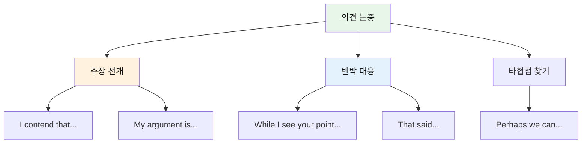

### 강력한 주장 (046-055)

| No. | 패턴 | 청크 분해 | 한국어 | 강도 |
|:---:|------|----------|--------|:----:|
| 046 | I firmly believe that... | I / firmly believe that / education / should be accessible to all. | 나는 / 확고히 믿어 / 교육이 / 모두에게 접근 가능해야 한다고. | ⭐⭐⭐⭐⭐ |
| 047 | I contend that... | I / contend that / the current system / is fundamentally flawed. | 나는 / 주장해 / 현재 시스템이 / 근본적으로 결함이 있다고. | ⭐⭐⭐⭐⭐ |
| 048 | There's compelling evidence that... | There's / compelling evidence that / climate change / is accelerating. | 있어 / 강력한 증거가 / 기후 변화가 / 가속화되고 있다는. | ⭐⭐⭐⭐ |
| 049 | It's imperative that we... | It's / imperative that / we / take action / now. | 그것은 / 필수적이야 / 우리가 / 행동을 취하는 것이 / 지금. | ⭐⭐⭐⭐⭐ |
| 050 | I would go so far as to say... | I would / go so far as to say / that / this is a crisis. | 나는 / 감히 말하겠어 / ~라고 / 이것이 위기라고. | ⭐⭐⭐⭐⭐ |
| 051 | The evidence overwhelmingly supports... | The evidence / overwhelmingly supports / the notion that... | 그 증거는 / 압도적으로 지지해 / 그 개념을... | ⭐⭐⭐⭐ |
| 052 | This is a matter of principle. | This / is / a matter of principle, / not convenience. | 이것은 / ~이다 / 원칙의 문제야, / 편의가 아니라. | ⭐⭐⭐⭐ |
| 053 | We can no longer afford to... | We / can no longer / afford to / ignore this issue. | 우리는 / 더 이상 할 수 없어 / 여유가 / 이 이슈를 무시하기를. | ⭐⭐⭐⭐⭐ |
| 054 | History has shown us that... | History / has shown us that / ignoring warnings / leads to disaster. | 역사는 / 우리에게 보여줬어 / 경고를 무시하는 것이 / 재앙으로 이끈다는 것을. | ⭐⭐⭐⭐ |
| 055 | The stakes are too high to... | The stakes / are / too high / to take chances. | 그 위험(이해관계)은 / ~이다 / 너무 높아 / 모험하기에는. | ⭐⭐⭐⭐⭐ |

#### 046-055 패턴 학습
- [ ] 046-055 전체 학습 완료

### 균형 잡힌 대응 (056-065)

| No. | 패턴 | 청크 분해 | 한국어 |
|:---:|------|----------|--------|
| 056 | While I see your point... | While / I see your point, / I have / some reservations. | ~하는 동안 / 나는 당신 요점을 봐, / 나는 가지고 있어 / 약간의 의구심을. |
| 057 | I can appreciate that, but... | I can / appreciate that, / but / we need to consider... | 나는 할 수 있어 / 그것을 인정하기를, / 하지만 / 우리는 고려해야 해... |
| 058 | That's partially true, however... | That's / partially true, / however, / it overlooks... | 그것은 / 부분적으로 사실이야, / 그러나, / 그것은 간과해... |
| 059 | I'm willing to concede that... | I'm willing / to concede that / you have a point / about... | 나는 기꺼이 하겠어 / 인정하기를 / 당신이 일리 있다고 / ~에 대해... |
| 060 | Let's find common ground. | Let's / find / common ground / we can build on. | 우리 하자 / 찾기를 / 공통의 기반을 / 우리가 구축할 수 있는. |
| 061 | Perhaps there's a middle way. | Perhaps / there's / a middle way / that satisfies both sides. | 아마도 / 있어 / 중도가 / 양측을 만족시키는. |
| 062 | I'm open to alternative perspectives. | I'm / open to / alternative perspectives / on this. | 나는 / 열려 있어 / 대안적 관점들에 / 이것에 대한. |
| 063 | Let's agree to disagree respectfully. | Let's / agree to disagree / respectfully / on this matter. | 우리 하자 / 다름을 인정하기로 동의하기를 / 존중하며 / 이 문제에 대해. |
| 064 | What if we approached it differently? | What if / we approached / it / differently? | 만약 어떨까 / 우리가 접근한다면 / 그것을 / 다르게? |
| 065 | Let's examine both sides objectively. | Let's / examine / both sides / objectively / before deciding. | 우리 하자 / 조사하기를 / 양측을 / 객관적으로 / 결정하기 전에. |

#### 056-065 패턴 학습
- [ ] 056-065 전체 학습 완료

---

## 🎯 Part 4: 진로와 진학 준비 (Patterns 066-080)

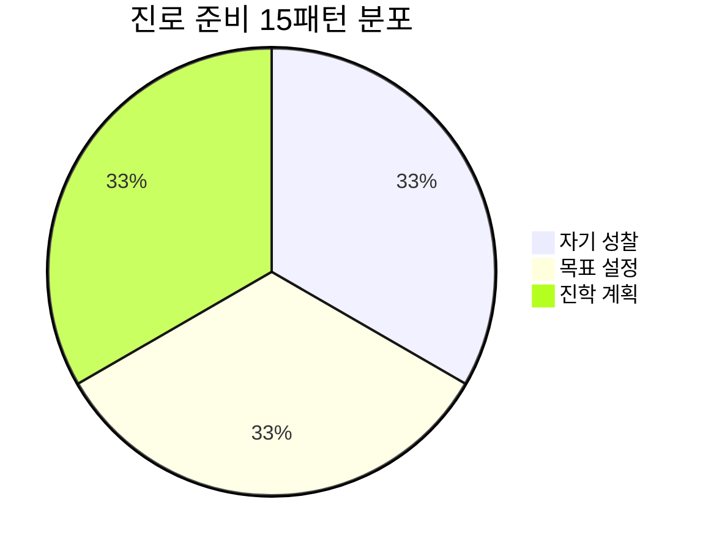

### 진로 탐색 (066-075)

| No. | 패턴 | 청크 분해 | 한국어 |
|:---:|------|----------|--------|
| 066 | I'm exploring different career paths. | I'm / exploring / different career paths / in the field of... | 나는 / 탐색하고 있어 / 다양한 진로들을 / ~분야에서... |
| 067 | I'm drawn to... | I'm / particularly / drawn to / interdisciplinary work. | 나는 / 특히 / 끌려 / 학제간 작업에. |
| 068 | I see myself pursuing... | I see myself / pursuing / a career in / environmental science. | 나는 나를 봐 / 추구하는 / 진로를 / 환경과학에서. |
| 069 | I'm passionate about making a difference. | I'm / passionate about / making a difference / in people's lives. | 나는 / 열정적이야 / 변화를 만드는 것에 / 사람들 삶에. |
| 070 | I'm torn between... and... | I'm / torn between / medicine and research. | 나는 / 갈등하고 있어 / 의학과 연구 사이에서. |
| 071 | What drives me is... | What / drives me / is / the desire to innovate. | 무엇이 / 나를 움직이는지는 / ~이야 / 혁신하고자 하는 욕망. |
| 072 | I'm building experience in... | I'm / building experience / in / project management. | 나는 / 경험을 쌓고 있어 / ~에서 / 프로젝트 관리. |
| 073 | I'm developing skills in... | I'm / developing skills / in / data analysis and coding. | 나는 / 스킬을 개발하고 있어 / ~에서 / 데이터 분석과 코딩. |
| 074 | My long-term goal is to... | My long-term goal / is to / contribute to / sustainable development. | 내 장기 목표는 / ~하는 것이야 / 기여하는 것 / 지속가능한 발전에. |
| 075 | I envision myself as... | I / envision myself / as / a leader in this field. | 나는 / 나를 그려봐 / ~로서 / 이 분야의 리더. |

#### 066-075 패턴 학습
- [ ] 066-075 전체 학습 완료

### 대학 준비 (076-080)

| No. | 패턴 | 청크 분해 | 한국어 |
|:---:|------|----------|--------|
| 076 | I'm researching universities that... | I'm / researching universities / that / specialize in... | 나는 / 대학들을 조사하고 있어 / ~하는 / 전문화된... |
| 077 | I'm working on my application to... | I'm / working on / my application / to several top-tier schools. | 나는 / 작업 중이야 / 내 지원서를 / 몇몇 최상위 학교들에. |
| 078 | I need to strengthen my... | I need / to strengthen / my portfolio / before applying. | 나는 필요해 / 강화하기를 / 내 포트폴리오를 / 지원하기 전에. |
| 079 | I'm considering a gap year to... | I'm / considering / a gap year / to gain real-world experience. | 나는 / 고려하고 있어 / 휴학 기간을 / 실제 세계 경험을 얻기 위해. |
| 080 | My academic interests align with... | My academic interests / align with / the program's focus on... | 내 학문적 관심사는 / 일치해 / 그 프로그램의 초점과... |

#### 076-080 패턴 학습
- [ ] 076-080 전체 학습 완료

---

## 🎤 Part 5: 프레젠테이션 (Patterns 081-100)

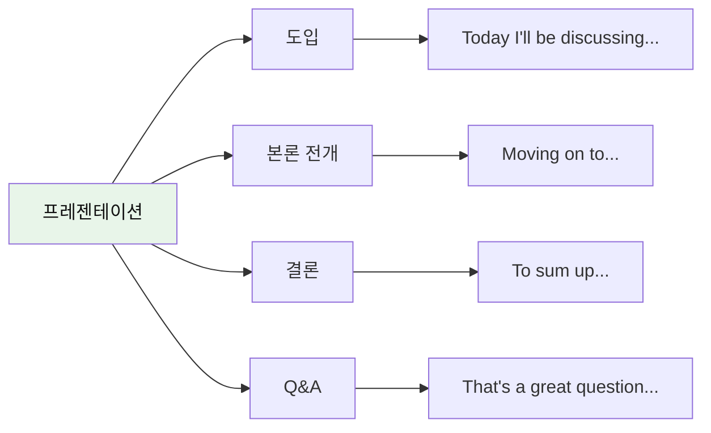

### 발표 시작 (081-085)

| No. | 패턴 | 청크 분해 | 한국어 |
|:---:|------|----------|--------|
| 081 | Today I'll be discussing... | Today / I'll be discussing / the impact of / social media on mental health. | 오늘 / 나는 논의할 거예요 / 영향을 / 소셜 미디어가 정신 건강에 미치는. |
| 082 | My presentation focuses on... | My presentation / focuses on / three key areas. | 내 발표는 / 초점을 맞춰요 / 세 가지 핵심 영역에. |
| 083 | I'd like to begin by... | I'd like / to begin by / providing some background. | 나는 원해요 / 시작하기를 / 약간의 배경을 제공함으로써. |
| 084 | The purpose of this presentation is... | The purpose / of this presentation / is to / explore... | 그 목적은 / 이 발표의 / ~하는 것이야 / 탐구하기를... |
| 085 | Let me give you an overview. | Let me / give you / an overview / of what we'll cover. | 내가 / 당신에게 줄게요 / 개요를 / 우리가 다룰 것의. |

#### 081-085 패턴 학습
- [ ] 081-085 전체 학습 완료

### 내용 전개 (086-095)

| No. | 패턴 | 청크 분해 | 한국어 |
|:---:|------|----------|--------|
| 086 | Moving on to my next point... | Moving on / to my next point, / let's examine... | 이동하면서 / 내 다음 요점으로, / 조사해봅시다... |
| 087 | This brings us to... | This / brings us to / the question of... | 이것은 / 우리를 데려와요 / ~의 질문으로... |
| 088 | As illustrated in this chart... | As / illustrated / in this chart, / we can see... | ~처럼 / 설명된 / 이 차트에서, / 우리는 볼 수 있어요... |
| 089 | It's important to note that... | It's / important to note that / correlation doesn't mean causation. | 그것은 / 주목하는 것이 중요해 / 상관관계가 인과관계를 의미하지 않는다는 것을. |
| 090 | Let me elaborate on that. | Let me / elaborate on / that point / with an example. | 내가 / 자세히 설명할게요 / 그 점을 / 예시와 함께. |
| 091 | To put this in perspective... | To / put this / in perspective, / consider... | ~하기 위해 / 이것을 두기를 / 관점 안에, / 고려해봐요... |
| 092 | What this demonstrates is... | What / this demonstrates / is / the need for change. | 무엇을 / 이것이 보여주는지는 / ~이야 / 변화의 필요성. |
| 093 | Let's look at the data. | Let's / look at / the data / more closely. | 우리 / 봅시다 / 그 데이터를 / 더 자세히. |
| 094 | This is particularly significant because... | This is / particularly significant / because / it affects... | 이것은 / 특히 중요해요 / 왜냐하면 / 그것이 영향을 미치기 때문에... |
| 095 | Building on this idea... | Building on / this idea, / we can conclude... | 구축하면서 / 이 아이디어 위에, / 우리는 결론내릴 수 있어요... |

#### 086-095 패턴 학습
- [ ] 086-095 전체 학습 완료

### 마무리 및 Q&A (096-100)

| No. | 패턴 | 청크 분해 | 한국어 |
|:---:|------|----------|--------|
| 096 | To sum up... | To sum up, / we've explored / three main themes. | 요약하자면, / 우리는 탐구했어요 / 세 가지 주요 주제를. |
| 097 | In conclusion... | In conclusion, / I'd like to emphasize / the urgency of... | 결론적으로, / 나는 강조하고 싶어요 / ~의 긴급성을... |
| 098 | Thank you for your attention. | Thank you / for your attention. / I'm happy to take questions. | 감사합니다 / 당신의 주목에 대해. / 기꺼이 질문 받겠습니다. |
| 099 | That's a great question. | That's / a great question. / Let me address that. | 그것은 / 훌륭한 질문이에요. / 제가 그것을 다루겠습니다. |
| 100 | I'd be happy to clarify that. | I'd be happy / to clarify / that point / after the presentation. | 나는 기꺼이 하겠어요 / 명확히 하기를 / 그 점을 / 발표 후에. |

#### 096-100 패턴 학습
- [ ] 096-100 전체 학습 완료

---

## 🎓 Part 6: 대학 지원 및 인터뷰 (Patterns 101-120)

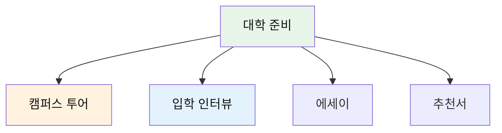

### 캠퍼스 방문 (101-105)

| No. | 패턴 | 청크 분해 | 한국어 |
|:---:|------|----------|--------|
| 101 | I'm interested in learning more about... | I'm / interested in / learning more about / your engineering program. | 나는 / 관심 있어요 / 더 배우는 것에 / 당신의 공학 프로그램에 대해. |
| 102 | What sets your program apart? | What / sets / your program / apart / from others? | 무엇이 / 차별화하나요 / 당신의 프로그램을 / 떨어지게 / 다른 것들로부터? |
| 103 | Could you tell me about... | Could you / tell me about / the research opportunities / available? | 당신은 할 수 있나요 / 나에게 말해주기를 / 연구 기회들에 대해 / 이용 가능한? |
| 104 | What is the student-faculty ratio? | What is / the student-faculty ratio / in this department? | 무엇인가요 / 학생-교수 비율이 / 이 학과에서? |
| 105 | I'm impressed by... | I'm / really impressed by / the facilities / I've seen today. | 나는 / 정말 감명받았어요 / 시설들에 / 내가 오늘 본. |

#### 101-105 패턴 학습
- [ ] 101-105 전체 학습 완료

### 입학 인터뷰 (106-115)

| No. | 패턴 | 청크 분해 | 한국어 | 상황 |
|:---:|------|----------|--------|------|
| 106 | What draws me to this university is... | What / draws me / to this university / is / its commitment to... | 무엇이 / 나를 끄는지는 / 이 대학으로 / ~이야 / 그것의 헌신... | 지원 동기 |
| 107 | I believe I can contribute... | I believe / I can contribute / to the campus community / through... | 나는 믿어요 / 내가 기여할 수 있다고 / 캠퍼스 공동체에 / ~를 통해... | 기여 가능성 |
| 108 | One of my proudest achievements is... | One of / my proudest achievements / is / winning... | 하나는 / 나의 가장 자랑스러운 성취들 중 / ~이야 / 우승하기... | 성취 |
| 109 | I've taken the initiative to... | I've / taken the initiative / to / start a club focused on... | 나는 / 주도권을 잡았어요 / ~하기 위해 / 동아리를 시작하기 초점을 둔... | 리더십 |
| 110 | This experience taught me... | This experience / taught me / the value of / perseverance. | 이 경험은 / 나에게 가르쳐줬어요 / 가치를 / 인내의. | 교훈 |
| 111 | I'm particularly interested in... | I'm / particularly interested in / the opportunity to / conduct research. | 나는 / 특히 관심 있어요 / 기회에 / 연구를 수행할. | 관심사 |
| 112 | My academic strengths lie in... | My academic strengths / lie in / analytical thinking and... | 내 학문적 강점은 / 놓여 있어요 / 분석적 사고와... | 강점 |
| 113 | I'm seeking an environment where... | I'm / seeking / an environment / where / I can grow academically. | 나는 / 찾고 있어요 / 환경을 / ~한 / 내가 학문적으로 성장할 수 있는. | 희망 |
| 114 | In five years, I see myself... | In five years, / I see myself / pursuing graduate studies in... | 5년 후에, / 나는 나를 봐요 / 대학원 공부를 하는 / ~에서... | 미래 계획 |
| 115 | What excites me most is... | What / excites me most / is / the interdisciplinary approach. | 무엇이 / 나를 가장 흥분시키는지는 / ~이야 / 학제간 접근법. | 열정 |

#### 106-115 패턴 학습
- [ ] 106-115 전체 학습 완료

### 에세이 및 추천서 (116-120)

| No. | 패턴 | 청크 분해 | 한국어 |
|:---:|------|----------|--------|
| 116 | My personal statement reflects... | My personal statement / reflects / my journey of / self-discovery. | 내 자기소개서는 / 반영해요 / 나의 여정을 / 자아 발견의. |
| 117 | I'd like to request a letter of recommendation. | I'd like / to request / a letter of recommendation / from you. | 나는 원해요 / 요청하기를 / 추천서를 / 당신으로부터. |
| 118 | Could you speak to my... | Could you / speak to / my leadership skills / in your letter? | 당신은 할 수 있나요 / 말해주기를 / 나의 리더십 기술에 대해 / 당신의 편지에서? |
| 119 | I've attached my resume. | I've / attached / my resume / for your reference. | 나는 / 첨부했어요 / 내 이력서를 / 당신의 참고를 위해. |
| 120 | The deadline for submission is... | The deadline / for submission / is / December 15th. | 그 마감일은 / 제출의 / ~이에요 / 12월 15일. |

#### 116-120 패턴 학습
- [ ] 116-120 전체 학습 완료

---

## 🌏 Part 7: 교환학생 및 해외 경험 (Patterns 121-135)

### 교환학생 준비 (121-130)

| No. | 패턴 | 청크 분해 | 한국어 |
|:---:|------|----------|--------|
| 121 | I'm applying for an exchange program. | I'm / applying for / an exchange program / in Australia. | 나는 / 지원하고 있어요 / 교환학생 프로그램에 / 호주의. |
| 122 | I'm excited about the opportunity to... | I'm / excited about / the opportunity to / immerse myself in... | 나는 / 신나요 / 기회에 대해 / 나 자신을 몰입시키는 / ~에... |
| 123 | I hope to broaden my perspective. | I hope / to broaden / my perspective / through this experience. | 나는 희망해요 / 넓히기를 / 나의 관점을 / 이 경험을 통해. |
| 124 | I'm looking forward to experiencing... | I'm / looking forward to / experiencing / different cultures. | 나는 / 기대하고 있어요 / 경험하는 것을 / 다른 문화들을. |
| 125 | This will challenge me to... | This / will challenge me / to / step out of my comfort zone. | 이것은 / 나에게 도전할 거예요 / ~하도록 / 내 안전지대에서 나오기를. |
| 126 | I plan to take courses in... | I plan / to take courses / in / international relations. | 나는 계획해요 / 수업을 듣기를 / ~에서 / 국제 관계. |
| 127 | I'm preparing by... | I'm / preparing / by / studying the language intensively. | 나는 / 준비하고 있어요 / ~함으로써 / 그 언어를 집중적으로 공부하기. |
| 128 | I'm concerned about... | I'm / concerned about / adjusting to / a new academic system. | 나는 / 걱정돼요 / 적응하는 것에 대해 / 새로운 학술 시스템에. |
| 129 | I'm researching accommodation options. | I'm / researching / accommodation options / near campus. | 나는 / 조사하고 있어요 / 숙소 옵션들을 / 캠퍼스 근처의. |
| 130 | I need to sort out my visa. | I need / to sort out / my visa / before departure. | 나는 필요해요 / 해결하기를 / 내 비자를 / 출발 전에. |

#### 121-130 패턴 학습
- [ ] 121-130 전체 학습 완료

### 해외 적응 (131-135)

| No. | 패턴 | 청크 분해 | 한국어 |
|:---:|------|----------|--------|
| 131 | I'm adjusting to the time difference. | I'm / still / adjusting to / the time difference. | 나는 / 아직 / 적응하고 있어요 / 시차에. |
| 132 | I'm trying to make local friends. | I'm / trying to / make local friends / to practice the language. | 나는 / 노력하고 있어요 / 현지 친구들을 사귀기를 / 언어를 연습하기 위해. |
| 133 | I'm experiencing culture shock. | I'm / experiencing / some culture shock, / but / it's getting better. | 나는 / 겪고 있어요 / 약간의 문화 충격을, / 하지만 / 나아지고 있어요. |
| 134 | I've learned so much about... | I've / learned so much / about / myself / through this experience. | 나는 / 많이 배웠어요 / ~에 대해 / 나 자신 / 이 경험을 통해. |
| 135 | This has been a transformative experience. | This / has been / a transformative experience / for me. | 이것은 / ~이었어요 / 변화시키는 경험 / 나에게. |

#### 131-135 패턴 학습
- [ ] 131-135 전체 학습 완료

---

## 💼 Part 8: 인턴십 및 직업 준비 (Patterns 136-145)

### 인턴십 지원 (136-145)

| No. | 패턴 | 청크 분해 | 한국어 |
|:---:|------|----------|--------|
| 136 | I'm seeking an internship in... | I'm / seeking / an internship / in the tech industry. | 나는 / 찾고 있어요 / 인턴십을 / 기술 산업에서. |
| 137 | What attracted me to this position is... | What / attracted me / to this position / is / your company's mission. | 무엇이 / 나를 끌었는지는 / 이 직위로 / ~이야 / 당신 회사의 미션. |
| 138 | I have hands-on experience in... | I have / hands-on experience / in / project management. | 나는 가지고 있어요 / 실무 경험을 / ~에서 / 프로젝트 관리. |
| 139 | I'm proficient in... | I'm / proficient in / Python, Java, and SQL. | 나는 / 능숙해요 / 파이썬, 자바, 그리고 SQL에. |
| 140 | I'm a quick learner. | I'm / a quick learner / and / adaptable to new environments. | 나는 / 빠르게 배우는 사람이고 / 그리고 / 새 환경에 적응 가능해요. |
| 141 | I work well in team settings. | I / work well / in team settings / and / independently. | 나는 / 잘 일해요 / 팀 환경에서 / 그리고 / 독립적으로. |
| 142 | I'm detail-oriented. | I'm / detail-oriented / and / committed to quality. | 나는 / 세부사항 지향적이고 / 그리고 / 품질에 헌신해요. |
| 143 | I thrive under pressure. | I / thrive / under pressure / and / meet tight deadlines. | 나는 / 번영해요 / 압박 아래에서 / 그리고 / 타이트한 마감일을 맞춰요. |
| 144 | I'm eager to apply my skills. | I'm / eager to / apply my skills / in a real-world setting. | 나는 / 열망해요 / 내 기술을 적용하기를 / 실제 세계 환경에서. |
| 145 | I'm available to start... | I'm / available to start / immediately / after the semester ends. | 나는 / 시작할 수 있어요 / 즉시 / 학기가 끝난 후. |

#### 136-145 패턴 학습
- [ ] 136-145 전체 학습 완료

---

## ✍️ Part 9: 학술 글쓰기 (Patterns 146-150)

### 에세이 작성 (146-150)

| No. | 패턴 | 청크 분해 | 한국어 | 용도 |
|:---:|------|----------|--------|------|
| 146 | This essay explores... | This essay / explores / the relationship between / technology and society. | 이 에세이는 / 탐구해요 / 관계를 / 기술과 사회 사이의. | 서론 |
| 147 | Previous research has shown... | Previous research / has shown / that... | 이전 연구들은 / 보여줬어요 / ~라는 것을... | 문헌 검토 |
| 148 | The findings suggest that... | The findings / suggest that / further investigation / is needed. | 그 발견들은 / 제안해요 / 추가 조사가 / 필요하다고. | 결과 |
| 149 | In light of these findings... | In light of / these findings, / it is clear that... | ~에 비추어 / 이 발견들, / 명확해요... | 논의 |
| 150 | Further research is warranted. | Further research / is warranted / to fully understand... | 추가 연구가 / 필요해요 / 완전히 이해하기 위해... | 결론 |

#### 146-150 패턴 학습
- [ ] 146-150 전체 학습 완료

---

## 📊 전체 패턴 종합 분석

### 카테고리별 분포

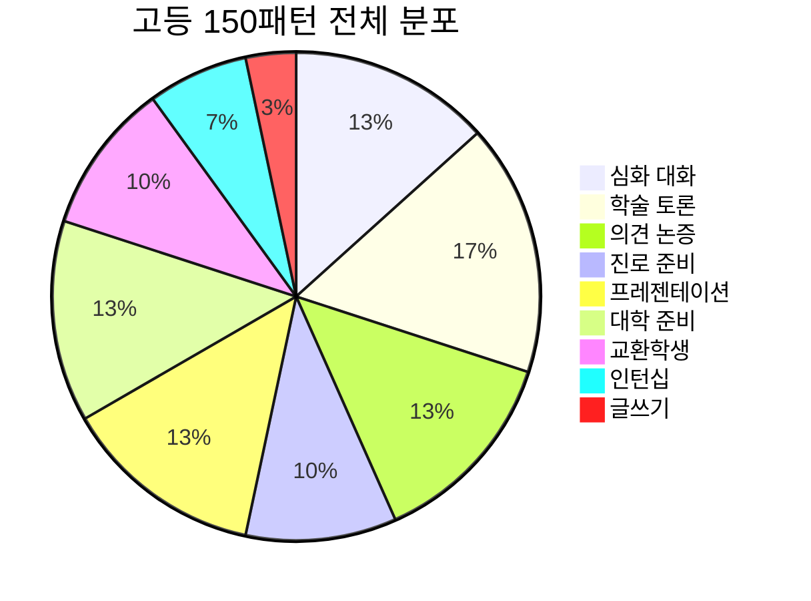

### 활용 영역 분석

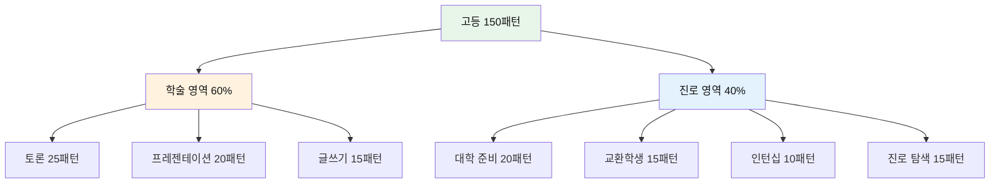

### 난이도 및 복잡도

| 레벨 | 문장 길이 | 어휘 난이도 | 구문 복잡도 | 비율 |
|------|-----------|-------------|-------------|------|
| **중상급** | 8-12단어 | 학술 어휘 | 종속절 2개 | 30% |
| **고급** | 12-15단어 | 전문 어휘 | 복합 구문 | 50% |
| **최상급** | 15단어+ | 학술 전문 | 다층 구조 | 20% |

---

## 💡 학습 가이드

### 4주 완벽 마스터 플랜

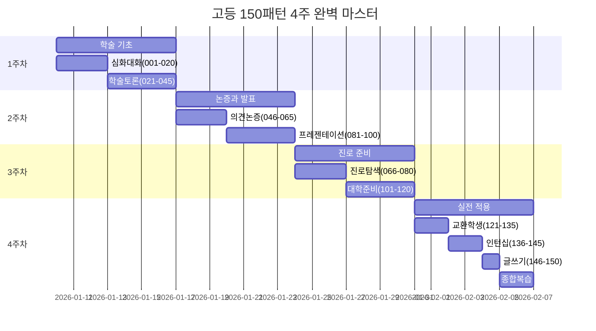

### 일일 학습 루틴 (고급)

| 시간 | 활동 | 패턴 수 | 방법 | 목표 |
|------|------|---------|------|------|
| **06:30-07:00** | 전날 복습 | 10개 | 빠른 리뷰 | 기억 강화 |
| **12:00-12:30** | 신규 학습 | 5-6개 | 심층 분석 | 완벽 이해 |
| **17:00-17:30** | 응용 연습 | 10개 | 문장 변형 | 창의적 활용 |
| **19:00-19:45** | 토론 연습 | 15개 | 실전 대화 | 자동화 |
| **21:30-22:00** | 에세이 작성 | - | 글쓰기 | 통합 정리 |

### 학습 전략

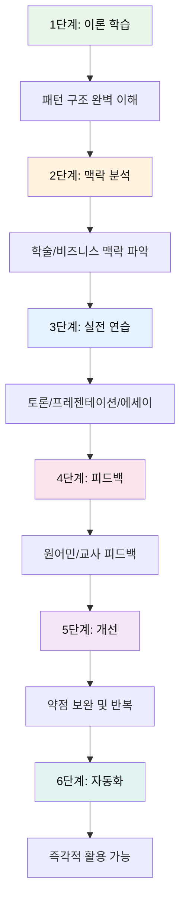

---

## 🎯 실전 시나리오

### 시나리오 1: 학술 토론 대회

| 단계 | 상황 | 사용 패턴 | 번호 |
|------|------|----------|------|
| 1 | 주장 제시 | I contend that... | 047 |
| 2 | 근거 제공 | According to recent research... | 021 |
| 3 | 반론 대응 | While I see your point... | 056 |
| 4 | 질문 제기 | This raises the question of... | 024 |
| 5 | 결론 | In conclusion... | 097 |

### 시나리오 2: 대학 입학 인터뷰

| 단계 | 질문 | 사용 패턴 | 번호 |
|------|------|----------|------|
| 1 | 지원 동기 | What draws me to this university is... | 106 |
| 2 | 강점 설명 | My academic strengths lie in... | 112 |
| 3 | 경험 공유 | This experience taught me... | 110 |
| 4 | 미래 계획 | In five years, I see myself... | 114 |
| 5 | 마무리 | What excites me most is... | 115 |

### 시나리오 3: 국제 컨퍼런스 발표

| 단계 | 상황 | 사용 패턴 | 번호 |
|------|------|----------|------|
| 1 | 도입 | Today I'll be discussing... | 081 |
| 2 | 배경 설명 | I'd like to begin by... | 083 |
| 3 | 주요 내용 | Moving on to my next point... | 086 |
| 4 | 데이터 제시 | As illustrated in this chart... | 088 |
| 5 | 결론 | To sum up... | 096 |
| 6 | Q&A | That's a great question. | 099 |

---

## 📝 레벨 테스트 및 인증

### 마스터 레벨 기준

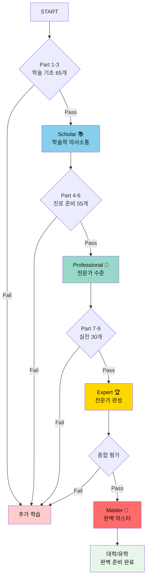

### 평가 기준표

| 레벨 | 패턴 수 | 이해도 | 발화 | 응용 | 학술 글쓰기 | 인증 |
|------|---------|--------|------|------|-------------|------|
| **Scholar** | 65개 | 85% | 75% | 65% | 50% | 📚 |
| **Professional** | 120개 | 90% | 85% | 75% | 70% | 💼 |
| **Expert** | 150개 | 95% | 90% | 85% | 80% | 🏆 |
| **Master** | 150개 | 98% | 95% | 92% | 90% | 👑 |

---

## 🌟 성공을 위한 TOP 20 전략

1. **학술지 읽기** - Nature, Science 등 영문 학술지 정기 구독
2. **TED 분석** - TED Talks 스크립트 분석 및 따라하기
3. **토론 클럽** - 영어 토론 동아리 참여
4. **에세이 챌린지** - 주 1회 500단어 에세이 작성
5. **원어민 멘토** - 정기적 피드백 세션
6. **학술 팟캐스트** - Radiolab, Freakonomics 청취
7. **프레젠테이션** - 월 1회 영어 발표
8. **문헌 검토** - 관심 주제 영문 논문 10편 읽기
9. **디베이트** - 온라인 디베이트 플랫폼 활용
10. **ChatGPT 활용** - AI와 학술 토론 연습
11. **YouTube 강의** - Khan Academy, Coursera 영문 강의
12. **독서 노트** - 영문 서적 읽고 정리
13. **모의 인터뷰** - 대학 입학 인터뷰 준비
14. **SAT/TOEFL** - 공인 시험 준비로 실력 점검
15. **Study Abroad** - 단기 어학연수 또는 교환학생
16. **LinkedIn 활용** - 영어로 전문가 네트워킹
17. **학술 컨퍼런스** - 국제 학술대회 참관
18. **영문 이력서** - 영문 CV/Resume 작성 연습
19. **온라인 코스** - edX, Coursera 영어 강의 수강
20. **지속성** - 하루 1시간, 120일 연속 목표

---

## 🎓 다음 단계

### 마스터 후 진로

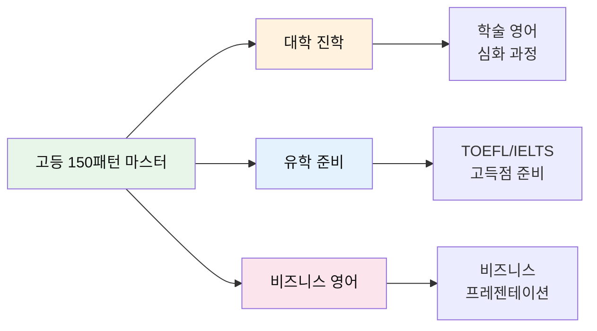

---

*Last Updated: 2026-01-10*
*Total Patterns: 150개 | Daily Practice: 60-90분 | Complete in: 4주*
*Target: 대학 진학, 유학 준비, 학술 토론, 인턴십 지원 완벽 대비*
*Next Level: 대학 학술 영어, TOEFL/IELTS 고급, 비즈니스 영어 전문가*

