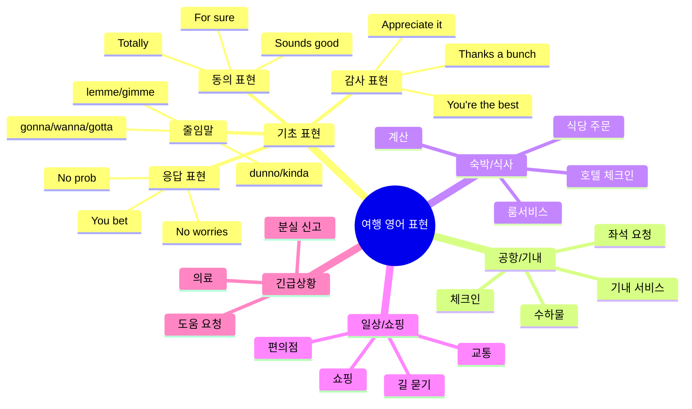
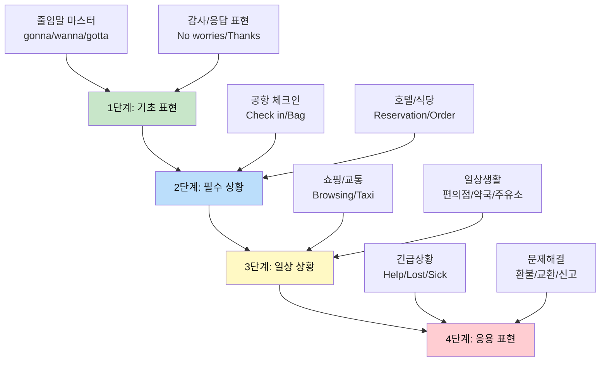
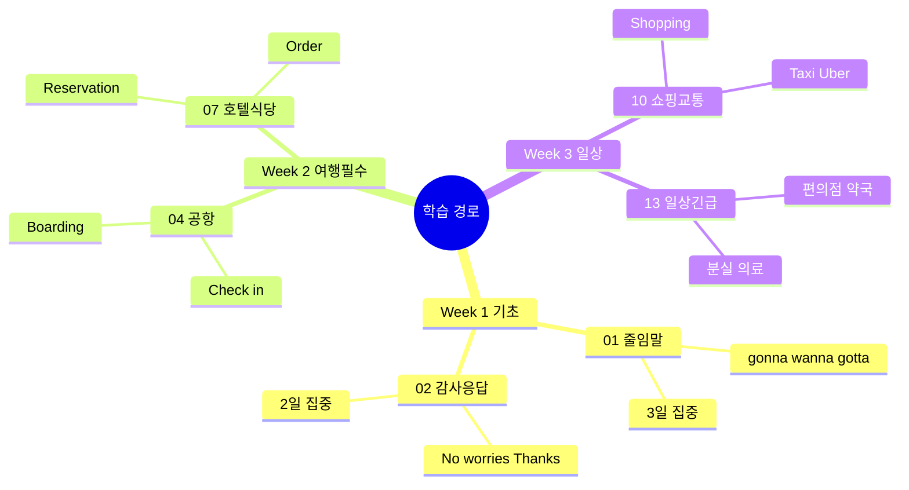
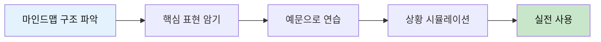
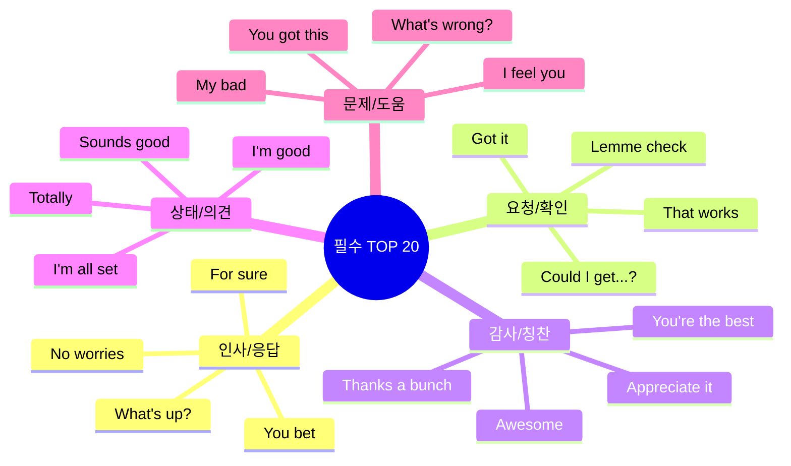
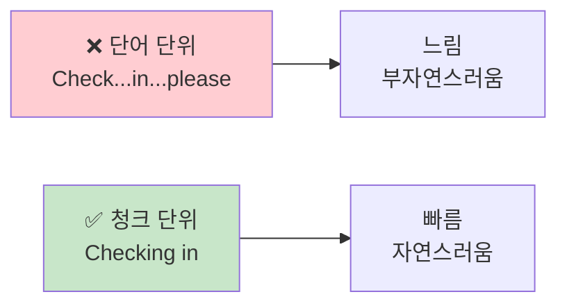
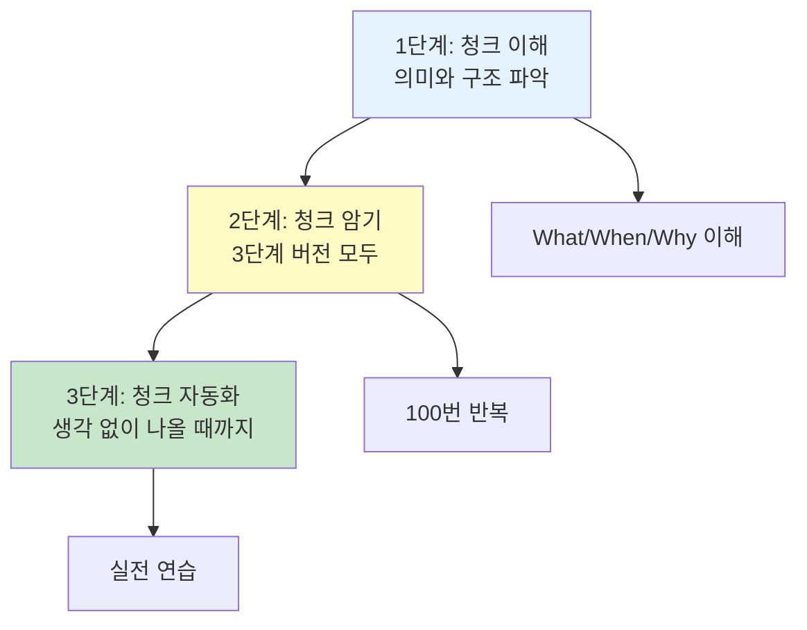
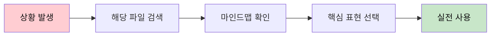
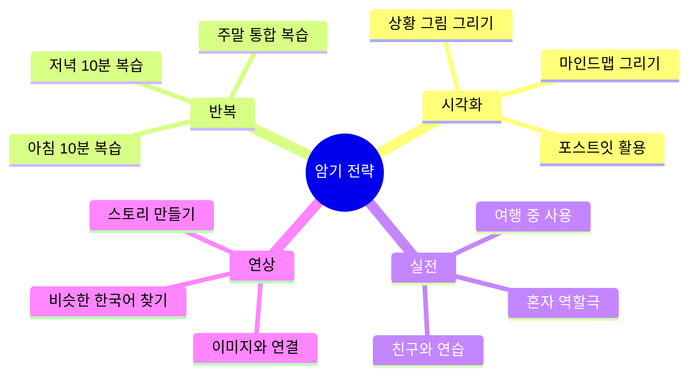

# 🗣️ 여행 영어 표현 완벽 가이드
## 상황별 영어 표현 한국어 상세 설명

---

## 📚 목차

### 🆕 청크 학습 시작!
- [청크 학습 완벽 가이드](#청크-학습-가이드) ⭐ **필독!**
- [청크 자동화 훈련 가이드](#청크-자동화-훈련)

### 핵심 기초 표현 (청크 기반)
- [01. 줄임말 청크 마스터](#파일-01) ✅
- [02. 감사/응답/동의 청크 체계](#파일-02) ✅

### 공항 & 입국
- [04. 공항 체크인 청크 실전](#파일-04) ✅
- [05. 입국심사 청크 실전](#파일-05) 🆕

### 숙박 & 식사
- [07. 호텔 & 식당 청크 실전](#파일-07) ✅
- [08. 카페 주문 청크 실전](#파일-08) 🆕

### 쇼핑 & 교통 & 관광
- [10. 쇼핑 & 교통 청크 실전](#파일-10) ✅
- [11. 관광지 청크 실전](#파일-11) 🆕

### 일상 & 긴급
- [12. 일상생활 청크 실전](#파일-12) 🆕
- [13. 긴급상황 완벽 대응](#파일-13) ✅

---

## 🎯 전체 표현 구조 마인드맵



---

## 📖 학습 가이드

### 🌟 우선순위 학습 순서



### 📚 파일별 학습 로드맵



### 📊 표현 레벨 체계

| 레벨 | 설명 | 예시 | 학습 목표 |
|:---:|------|------|----------|
| 🌱 **초급** | 단순 직설적 표현 | "Water please?" | 기본 의사소통 |
| 🌿 **중급** | 정중하고 완성된 표현 | "Could I get some water?" | 자연스러운 대화 |
| 🌳 **고급** | 관용적 네이티브 표현 | "I'll pass on that." | 원어민처럼 |
| 💬 **현대** | 줄임말 & 캐주얼 | "I'm gonna grab water." | 친근한 소통 |

---

## 🎓 효과적인 학습 방법

### ✅ 추천 학습법



1. **마인드맵으로 전체 구조 이해**
   - 각 상황의 표현 카테고리 파악
   - 관련 표현들의 연결고리 이해

2. **상황별 핵심 표현 3-5개 집중**
   - 가장 자주 쓰이는 표현 우선
   - 뉘앙스와 사용 맥락 이해

3. **소리 내어 반복 연습**
   - 줄임말 발음 연습 (gonna, wanna)
   - 자연스러운 억양 익히기

4. **상황 시뮬레이션**
   - 머릿속으로 상황 그리기
   - 실제 대화처럼 연습

5. **실전 사용**
   - 여행 중 적극 사용
   - 실수해도 괜찮다는 마인드

### ❌ 피해야 할 학습법

- ❌ 모든 표현을 한 번에 암기하려고 하기
- ❌ 문법만 집중하고 실제 사용 안 하기
- ❌ 격식체만 고집하기 (오히려 부자연스러움)
- ❌ 발음 연습 없이 읽기만 하기

---

## 🔥 가장 중요한 표현 TOP 20

### 핵심 중의 핵심



### 상세 설명

| 순위 | 표현 | 발음 | 한국어 의미 | 사용 빈도 |
|:---:|------|------|-----------|:--------:|
| 1 | **No worries** | 노 워리스 | 걱정 마세요 / 괜찮아요 | ⭐⭐⭐⭐⭐ |
| 2 | **For sure** | 포 슈어 | 물론이죠 / 당연하죠 | ⭐⭐⭐⭐⭐ |
| 3 | **Sounds good** | 사운즈 굿 | 좋아요 / 좋은데요 | ⭐⭐⭐⭐⭐ |
| 4 | **I'm gonna** | 아임 거나 | ~할 거예요 | ⭐⭐⭐⭐⭐ |
| 5 | **Lemme (let me)** | 레미 | ~할게요 / ~하자 | ⭐⭐⭐⭐⭐ |
| 6 | **Got it** | 갓 잇 | 알겠어요 / 이해했어요 | ⭐⭐⭐⭐⭐ |
| 7 | **Could I get...?** | 쿠다이 겟 | ~주실 수 있나요? | ⭐⭐⭐⭐⭐ |
| 8 | **That works** | 댓 월스 | 그거 좋네요 | ⭐⭐⭐⭐ |
| 9 | **Appreciate it** | 어프리시에잇 잇 | 감사합니다 | ⭐⭐⭐⭐ |
| 10 | **My bad** | 마이 배드 | 제 잘못이에요 | ⭐⭐⭐⭐ |
| 11 | **I'm good** | 아임 굿 | 괜찮아요 / 됐어요 | ⭐⭐⭐⭐⭐ |
| 12 | **You bet** | 유 벳 | 물론이죠 | ⭐⭐⭐⭐ |
| 13 | **Totally** | 토털리 | 완전히 / 정말 | ⭐⭐⭐⭐ |
| 14 | **Sweet** | 스윗 | 좋아 / 멋져 | ⭐⭐⭐ |
| 15 | **Awesome** | 어썸 | 대단해 / 멋져 | ⭐⭐⭐⭐ |
| 16 | **What's up?** | 왓츠 업 | 안녕? / 무슨 일이야? | ⭐⭐⭐⭐ |
| 17 | **Hang on** | 행 온 | 잠깐만요 | ⭐⭐⭐ |
| 18 | **I feel you** | 아이 필 유 | 이해해 / 공감해 | ⭐⭐⭐ |
| 19 | **Same here** | 세임 히어 | 나도 마찬가지 | ⭐⭐⭐ |
| 20 | **You got this** | 유 갓 디스 | 너 할 수 있어 | ⭐⭐⭐ |

---

## 📁 파일 구조

```
영어_일상_회화/표현_설명/
│
├── 00_전체_표현_마스터_가이드.md (현재 파일) ✅
│
├── 기초_표현/
│   ├── 01_줄임말_완전_분석.md ✅
│   ├── 02_감사_응답_표현_체계.md ✅
│   └── 03_동의_거절_표현_가이드.md (통합됨)
│
├── 공항_기내/
│   ├── 04_공항_체크인_표현_분석.md ✅
│   └── (기내 서비스는 원본 파일 참조)
│
├── 숙박_식사/
│   └── 07_호텔_식당_표현_완벽_가이드.md ✅
│       (호텔 & 식당 통합)
│
├── 쇼핑_교통/
│   └── 10_쇼핑_교통_실전_표현_완벽_가이드.md ✅
│       (쇼핑 & 교통 통합)
│
└── 일상_긴급/
    └── 13_일상생활_긴급상황_완벽_대응_가이드.md ✅
        (일상생활 & 긴급상황 통합)
```

### 파일 특징

✅ **완성된 파일들의 특징:**
- 🎨 풍부한 Mermaid 다이어그램 (마인드맵, 플로우차트)
- 📊 상세한 비교 표
- 💬 실전 대화 예시
- 🎯 단계별 학습 가이드
- 📌 핵심 표현 정리

---

## 🎯 각 파일의 구성

모든 상세 파일은 다음 구조로 구성됩니다:

### 1️⃣ 마인드맵
- 해당 상황의 전체 표현 구조 시각화
- 카테고리별 표현 분류

### 2️⃣ 핵심 표현 분석
- 가장 많이 쓰이는 표현 10-15개
- 각 표현의 상세 설명:
  - 한국어 의미
  - 발음 가이드
  - 뉘앙스 설명
  - 사용 상황
  - 주의사항

### 3️⃣ 표현 비교표
- 격식체 vs 캐주얼
- 초급 vs 고급
- 상황별 적절한 표현

### 4️⃣ 실전 예문
- 실제 대화 예시
- 상황별 적용 방법

### 5️⃣ 연습 문제
- 표현 선택 퀴즈
- 상황별 적절한 표현 찾기

---

## 🧠 청크(Chunk) 학습 방법론

### 청크란 무엇인가?

**청크(Chunk)** = 의미 있는 언어 덩어리를 말합니다.



### 왜 청크로 배워야 하나?

1. **속도**: 생각하지 않고 자동으로 나옴 ⚡
2. **자연스러움**: 원어민처럼 들림 🎯
3. **기억력**: 덩어리로 외우면 잊지 않음 🧠
4. **실수 감소**: 문법 걱정 없이 말할 수 있음 ✅

### 3단계 응용 시스템

모든 표현을 **3가지 레벨**로 학습합니다:

| 단계 | 상황 | 느낌 | 예시 |
|:---:|------|------|------|
| **1단계<br/>줄임말** | 친구, 캐주얼 | 편함 😊 | "Checking in." |
| **2단계<br/>실전** | 일반적 상황 | 안전 👍 | "I'd like to check in." ⭐ |
| **3단계<br/>정중** | 격식, 비즈니스 | 공손 🎩 | "I'd like to check in, please." |

### 청크 학습 3단계 프로세스



### 청크 학습 로드맵 (2주)

**Week 1: 기본 청크 마스터**
```
Day 1-2: 공항 청크
□ Check in 관련 청크 10개
□ 3단계 모두 연습
□ 10턴 대화 3회

Day 3-4: 호텔 청크
□ 체크인/문제 해결 청크
□ 3단계 연습
□ 실전 시뮬레이션

Day 5-6: 식당 청크
□ 주문/알레르기 청크
□ 안전 확인 필수
□ 계산 청크

Day 7: Week 1 통합
□ 전체 복습
□ 약점 보강
□ 속도 향상
```

**Week 2: 고급 청크 & 자동화**
```
Day 8-9: 쇼핑 청크
□ 입장/피팅 청크
□ 환불 청크
□ 가격 협상

Day 10-11: 교통 청크
□ 택시/우버 청크
□ 길 묻기 청크
□ 3초 반응 훈련

Day 12-13: 속도 & 자동화
□ 1초 안에 반응
□ 생각 없이 나오기
□ 실전 시뮬레이션

Day 14: 최종 테스트
□ 전체 시나리오
□ 3단계 자유자재
□ 실전 투입 준비!
```

### 청크 자동화 레벨

```
레벨 1: 의식적 (3-5초) 
"음... 체크인은... Checking in!"

레벨 2: 빠른 반응 (1-2초)
"Checking in!" [생각→말]

레벨 3: 자동 반응 (0.5초)
[생각=말] "Checking in!"

레벨 4: 무의식적 (0초) 🏆
상황 보자마자 자동으로!

🎯 목표: 레벨 3 이상!
```

### 청크 학습 신규 가이드

우리의 새로운 청크 기반 가이드:
- 📘 [공항 체크인 청크 가이드](./공항_기내/04_공항_체크인_청크_실전_가이드.md)
- 📗 [호텔 & 식당 청크 가이드](./숙박_식사/07_호텔_식당_청크_실전_가이드.md)
- 📙 [쇼핑 & 교통 청크 가이드](./쇼핑_교통/10_쇼핑_교통_청크_실전_가이드.md)

---

## 💡 빠른 시작 가이드

### 여행 전 준비 (1-2주)

#### 1주차: 기초 다지기
- ✅ `01_줄임말_완전_분석.md` 학습
- ✅ `02_감사_응답_표현_체계.md` 학습
- ✅ TOP 20 표현 완벽 암기

#### 2주차: 필수 상황 준비
- ✅ `04_공항_체크인_표현_분석.md`
- ✅ `07_호텔_숙박_표현_분석.md`
- ✅ `08_식당_주문_표현_분석.md`

### 여행 중 활용



1. 상황 발생
2. 해당 파일 빠르게 찾기
3. 마인드맵으로 구조 파악
4. 핵심 표현 2-3개 선택
5. 자신있게 사용

---

## 🌟 학습 팁

### ✨ 효과적인 암기법



### 🎤 발음 연습법

1. **줄임말 집중 연습**
   - gonna → "거너" (going to)
   - wanna → "워너" (want to)
   - gotta → "가러" (got to)

2. **연음 규칙 이해**
   - "Could I" → "쿠다이"
   - "Did you" → "디쥬"
   - "What are you" → "와러유"

3. **억양 패턴 익히기**
   - 질문: 끝을 올림 ⬆️
   - 진술: 끝을 내림 ⬇️
   - 강조: 특정 단어 세게 💪

---

## 📱 활용 방법

### 여행 전
- [ ] 모든 마인드맵 출력해서 벽에 붙이기
- [ ] TOP 20 표현 녹음해서 반복 듣기
- [ ] 예상 상황 리스트 만들기

### 여행 중
- [ ] 스마트폰에 파일 저장
- [ ] 오프라인에서도 볼 수 있게 준비
- [ ] 사용한 표현 체크리스트 작성

### 여행 후
- [ ] 실제 사용한 표현 기록
- [ ] 어려웠던 상황 복습
- [ ] 다음 여행 준비

---

## 🔗 다음 단계

### 지금 바로 시작하기

1. **기초부터 탄탄히**
   - 📖 [줄임말 완전 분석](./기초_표현/01_줄임말_완전_분석.md)으로 시작하세요

2. **필수 상황 준비**
   - ✈️ [공항 체크인 표현](./공항_기내/04_공항_체크인_표현_분석.md)을 먼저 익히세요

3. **실전 연습**
   - 각 파일의 연습 문제로 실력 테스트

---

## ❓ 자주 묻는 질문

### Q1: 어디서부터 시작해야 하나요?
**A:** `01_줄임말_완전_분석.md`부터 시작하세요. 줄임말은 모든 상황에서 사용되는 기초입니다.

### Q2: 얼마나 공부해야 하나요?
**A:** 하루 30분씩 2주면 기본 준비 완료! TOP 20 표현은 반드시 암기하세요.

### Q3: 가장 중요한 표현은?
**A:** "No worries", "For sure", "Could I get...?" 이 3개만 완벽히 익혀도 70% 커버됩니다.

### Q4: 발음이 안 되면?
**A:** 각 파일의 발음 가이드를 참고하세요. 줄임말은 원어민도 발음이 뭉개지니 부담 갖지 마세요!

### Q5: 실수하면 어떡하죠?
**A:** 실수는 학습의 일부! "My bad" 하고 넘어가세요. 😊

---

*이 가이드는 실제 여행 상황에서 가장 많이 쓰이는 표현들을 엄선했습니다.*  
*모든 표현은 2026년 기준 현대 영어를 반영합니다.*

**Last Updated: 2026-01-10**

