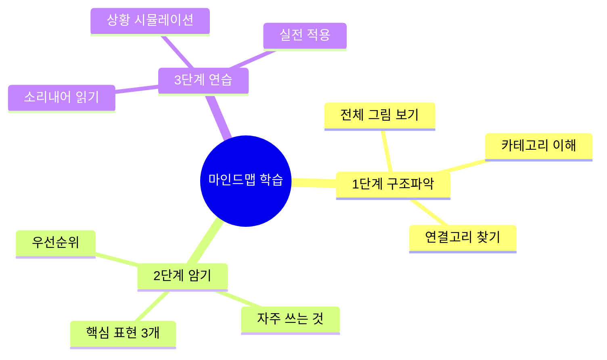
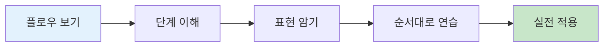

# 🗣️ 영어 표현 상세 설명 가이드
## 청크 기반 3단계 응용 학습 시스템

---

## 🆕 2026 업데이트: 청크 학습 혁명!

### 🧠 청크(Chunk) 학습법이란?

**청크** = 의미 있는 언어 덩어리를 말합니다.

단어 하나하나가 아닌, **의미 단위로 묶어서** 생각하고 말하는 방법!

```
❌ 기존: "I... want... to... check... in..." (느림, 부자연스러움)
✅ 청크: "I'd like to check in" (빠름, 자연스러움, 하나의 덩어리로!)
```

### ⭐ 3단계 응용 시스템

모든 표현을 3가지 레벨로 학습:

| 레벨 | 상황 | 예시 |
|:---:|------|------|
| **1단계: 줄임말** | 친구, 캐주얼 | "Checking in." |
| **2단계: 실전** ⭐ | 일반 상황 (가장 많이 사용!) | "I'd like to check in." |
| **3단계: 정중** | 격식, 비즈니스 | "I'd like to check in, please." |

### 💪 청크 학습의 4가지 장점

1. **빠른 반응**: 생각하지 않고 자동으로! ⚡
2. **자연스러움**: 원어민처럼 들림 🎯
3. **강한 기억**: 덩어리로 외우면 안 잊음 🧠
4. **실수 감소**: 문법 걱정 NO! ✅

### 🆕 청크 실전 가이드 (신규!)

- 📘 [청크 학습 완벽 가이드](./청크_학습_완벽_가이드.md) ⭐ **필독!**
- 📗 [공항 체크인 청크 실전](./공항_기내/04_공항_체크인_청크_실전_가이드.md)
- 📙 [호텔 & 식당 청크 실전](./숙박_식사/07_호텔_식당_청크_실전_가이드.md)
- 📕 [쇼핑 & 교통 청크 실전](./쇼핑_교통/10_쇼핑_교통_청크_실전_가이드.md)

---

## ✨ 이 폴더의 특징

### 🎨 시각화 중심 학습
- **Mermaid 다이어그램** 대량 활용
  - 🧠 마인드맵: 개념 구조화
  - 🔄 플로우차트: 프로세스 이해
  - 📊 표: 비교와 정리

### 📚 체계적 구조
- 기초 → 필수 → 일상 → 긴급 순서
- 레벨별 표현 (초급/중급/고급/현대)
- 실전 대화 + 한국어 해석

---

## 📂 파일 구조

```
표현_설명/
├── 00_전체_표현_마스터_가이드.md        ⭐ 시작점 (청크 방법론 포함)
├── 청크_학습_완벽_가이드.md             🆕 청크 학습법 완벽 설명 (필독!)
│
├── 🆕 청크 실전 가이드 (2026 신규!)
│   ├── 04_공항_체크인_청크_실전_가이드.md       ⭐ 공항 청크 마스터
│   ├── 07_호텔_식당_청크_실전_가이드.md         ⭐ 호텔 & 식당 청크
│   └── 10_쇼핑_교통_청크_실전_가이드.md         ⭐ 쇼핑 & 교통 청크
│
├── 기초_표현/
│   ├── 01_줄임말_완전_분석.md           ✅ 완성
│   └── 02_감사_응답_표현_체계.md         ✅ 완성
│
└── 일상_긴급/
    └── 13_일상생활_긴급상황_완벽_대응_가이드.md ✅ 완성
```

---

## 🚀 빠른 시작

### 1️⃣ 완전 초보자 (2주 과정)
```
Day 1: 청크_학습_완벽_가이드.md 읽기 (필수!)
       → 청크가 무엇인지, 왜 중요한지 이해

Day 2-3: 공항 청크 마스터
         04_공항_체크인_청크_실전_가이드.md

Day 4-5: 호텔 & 식당 청크
         07_호텔_식당_청크_실전_가이드.md

Day 6-7: 쇼핑 & 교통 청크
         10_쇼핑_교통_청크_실전_가이드.md

Day 8-14: 전체 복습 & 자동화 훈련
          3초 → 1초 → 0.5초 반응 연습!
```

### 2️⃣ 여행 준비자 (1주일 남음) ⚡
```
Day 1: 청크_학습_완벽_가이드.md (1시간)
Day 2-3: 공항 + 호텔 청크 집중 (각 2시간)
Day 4-5: 식당 + 쇼핑 + 교통 청크 (각 2시간)
Day 6-7: 실전 시뮬레이션 (하루 일정 전체)

🎯 핵심 청크 75개 마스터!
```

### 3️⃣ 여행 준비자 (급행! 3일 남음) 🚨
```
Day 1: 공항 청크 10개 완벽 암기 (3시간)
       → "I'd like to check in" 등
       
Day 2: 호텔 & 식당 청크 15개 (4시간)
       → 특히 알레르기 표현 필수!
       
Day 3: 교통 & 쇼핑 필수 10개 (3시간)
       → "Where to?" "Just browsing" 등

💡 총 35개 핵심 청크에 집중!
```

### 4️⃣ 여행 중 (스마트폰 활용)
```
- 상황 발생 → 해당 청크 가이드 찾기
- 3단계 중 적절한 레벨 선택
- 청크 그대로 사용!
- 13_일상생활_긴급상황_완벽_대응_가이드.md (긴급 시)
```

---

## 🎯 학습 전략

### 마인드맵 활용법



### 플로우차트 활용법



---

## 📊 각 파일의 구성

### 공통 구조

1. **전체 마인드맵**
   - 해당 주제의 전체 구조
   - 카테고리별 분류

2. **플로우차트**
   - 실제 상황 흐름
   - 단계별 프로세스

3. **표현 분석**
   - 표현별 상세 설명
   - 발음, 뉘앙스, 사용법

4. **비교 표**
   - 레벨별 비교
   - 상황별 비교

5. **실전 대화**
   - 영어 + 한국어
   - 자연스러운 대화

6. **연습 문제**
   - 이해도 체크
   - 실전 적용

---

## 🎨 Mermaid 다이어그램 종류

### 1. 마인드맵 (Mindmap)
```
용도: 개념 구조화, 브레인스토밍
예시: 감사 표현의 종류와 관계
```

### 2. 플로우차트 (Flowchart)
```
용도: 순서, 프로세스, 의사결정
예시: 공항 체크인 프로세스
```

### 3. 표 (Table)
```
용도: 비교, 정리, 레벨 구분
예시: 표현 레벨별 비교
```

---

## 💡 효과적인 학습 팁

### ✅ 권장 학습법

1. **마인드맵 먼저**
   - 전체 구조 파악
   - 큰 그림 이해

2. **플로우차트로 흐름 파악**
   - 실제 상황 순서
   - 어떤 표현이 언제

3. **표로 정리**
   - 비교하며 암기
   - 차이점 이해

4. **실전 대화 연습**
   - 소리 내어 읽기
   - 역할극 하기

5. **연습 문제로 확인**
   - 이해도 체크
   - 부족한 부분 재학습

### ❌ 피해야 할 학습법

- ❌ 한 번에 모두 읽으려 하기
- ❌ 마인드맵 건너뛰기
- ❌ 소리 내지 않고 읽기만
- ❌ 실전 대화 무시하기
- ❌ 연습 문제 안 풀기

---

## 📱 활용 시나리오

### 시나리오 1: 출국 전 준비 (2주 전) - 청크 마스터
```
Week 1: 기본 청크 완벽 암기
Day 1:    청크 학습법 이해
Day 2-3:  공항 청크 10개 (3단계 모두)
Day 4-5:  호텔 & 식당 청크 15개
Day 6-7:  복습 & 자동화 (3초 → 1초)

Week 2: 고급 청크 & 실전
Day 8-9:   쇼핑 & 교통 청크 20개
Day 10-11: 속도 향상 (1초 → 0.5초)
Day 12-13: 실전 시뮬레이션
Day 14:    최종 테스트 & 자신감 확인!

🎯 목표: 75개 청크 자동 반응!
```

### 시나리오 2: 여행 중 (스마트폰에 저장)
```
상황 발생 → 청크 가이드 찾기 → 3단계 중 선택
→ 청크 그대로 사용 → 성공! ✅

예: 공항 체크인
1. 공항_체크인_청크_가이드 열기
2. "체크인" 청크 찾기
3. 상황에 맞는 레벨 선택:
   - 캐주얼: "Checking in."
   - 일반: "I'd like to check in." ⭐
   - 정중: "I'd like to check in, please."
4. 그대로 말하기!
```

### 시나리오 3: 여행 중 실전 (긴급)
```
문제 발생! 🚨
→ 13_일상생활_긴급상황 열기
→ 해당 청크 찾기
→ 명확하게 말하기
→ 안전 확보!
```

### 시나리오 4: 귀국 후 복습
```
- 실제 사용한 청크 체크
- 어려웠던 상황의 청크 재학습
- 새로운 청크 추가
- 다음 여행 대비 (더 자동화!)
```

---

## 🔥 핵심 표현 총정리

### TOP 30 마스터 표현

| 순위 | 표현 | 파일 | 중요도 |
|:---:|------|------|:-----:|
| 1 | No worries | 02 | ⭐⭐⭐⭐⭐ |
| 2 | For sure | 02 | ⭐⭐⭐⭐⭐ |
| 3 | I'm gonna | 01 | ⭐⭐⭐⭐⭐ |
| 4 | I wanna | 01 | ⭐⭐⭐⭐⭐ |
| 5 | Checking in | 04, 07 | ⭐⭐⭐⭐⭐ |
| 6 | Just browsing | 10 | ⭐⭐⭐⭐⭐ |
| 7 | Where to? | 10 | ⭐⭐⭐⭐⭐ |
| 8 | What's good? | 07 | ⭐⭐⭐⭐ |
| 9 | I'll have... | 07 | ⭐⭐⭐⭐ |
| 10 | Got it | 01, 02 | ⭐⭐⭐⭐ |

(나머지 20개는 각 파일 참조)

---

## 📞 긴급 연락처 (미국 기준)

```
🚨 응급: 911
👮 경찰: 911
🚑 앰뷸런스: 911
🔥 화재: 911

🏥 비응급 의료: 311
📞 정보 문의: 411

🇰🇷 주미 한국대사관
워싱턴 DC: +1-202-939-5600
```

---

## 🎓 학습 완료 체크리스트

### 기초 단계
- [ ] 01 줄임말 8개 암기
- [ ] 02 감사/응답 표현 10개 암기
- [ ] TOP 20 표현 완벽 숙지

### 여행 준비
- [ ] 04 공항 체크인 프로세스 이해
- [ ] 07 호텔 & 식당 주문법 숙지
- [ ] 10 쇼핑 & 택시 표현 연습

### 실전 대비
- [ ] 13 긴급상황 대응법 암기
- [ ] 모든 마인드맵 숙지
- [ ] 실전 대화 5회 이상 연습

---

## 💬 피드백 & 개선

이 가이드를 사용하면서:
- ✅ 도움이 된 부분
- ❌ 부족한 부분
- 💡 추가되었으면 하는 내용

을 기록해두시면 다음 여행 준비에 도움이 됩니다!

---

## 🌟 마지막 당부

### Remember! (청크 학습의 비결)

1. **청크로 생각하고 말하세요** 🧠
   - 단어가 아닌 덩어리로!
   - "I'd like to check in" = 하나의 청크
   - 생각 없이 자동으로 나올 때까지!

2. **3단계 시스템을 활용하세요** 📊
   - 줄임말 → 실전 → 정중
   - 상황에 맞게 선택
   - 헷갈리면 2단계(실전) 사용! ⭐

3. **완벽하지 않아도 괜찮습니다** ✅
   - 실수는 학습의 일부
   - 용기있게 청크 내뱉기
   - 자신감이 가장 중요!

4. **매일 조금씩 반복하세요** 📅
   - 하루 30분 × 14일
   - 반복이 자동화의 비결
   - 생각하지 말고, 말하라!

5. **No worries는 만능입니다** 💙
   - 감사 응답, 사과 응답, 안심
   - 가장 많이 쓰는 청크!

6. **표정과 제스처도 언어입니다** 🎭
   - 미소 😊
   - 손짓 👋
   - 눈 맞춤 👁️

---

## 🎯 청크 마스터의 최종 목표

```
레벨 1: 청크 이해 (3일)
□ 청크가 무엇인지 안다
□ 3단계 시스템 이해

레벨 2: 청크 암기 (5일)
□ 핵심 75개 청크 암기
□ 3초 안에 반응

레벨 3: 청크 자동화 (7일)
□ 1초 안에 반응
□ 생각 없이 나옴

레벨 4: 청크 마스터 (14일+)
□ 0.5초 자동 반응
□ 실전 100% 자신감
□ 여행 준비 완료! 🏆
```

---

**행운을 빕니다! 청크로 말하면 됩니다! 🚀**

> "생각하지 말고, 청크를 말하라!"
> 
> Think in Chunks, Speak in Chunks! 💪

*Last Updated: 2026-01-11*

