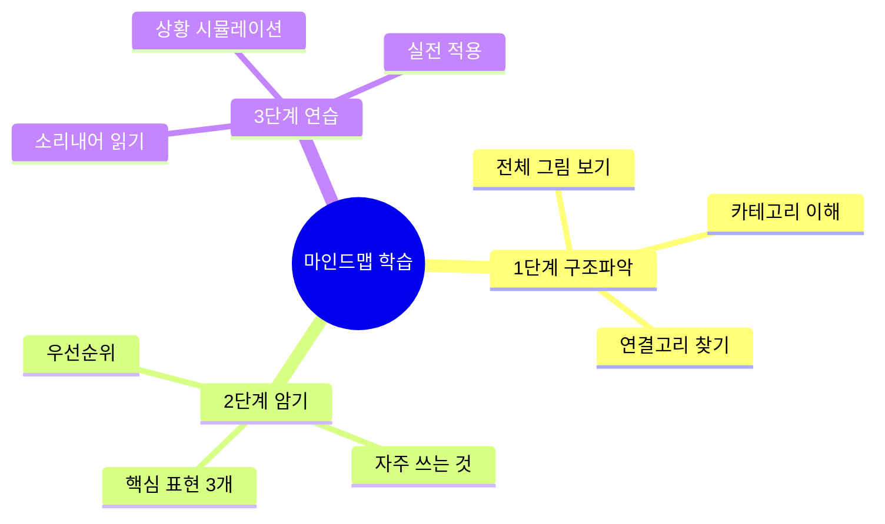
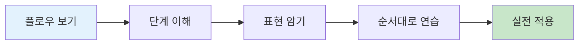

# 🗣️ 영어 표현 상세 설명 가이드
## 마인드맵과 구조도로 완벽 이해하기

---

## ✨ 이 폴더의 특징

### 🎨 시각화 중심 학습
- **Mermaid 다이어그램** 대량 활용
  - 🧠 마인드맵: 개념 구조화
  - 🔄 플로우차트: 프로세스 이해
  - 📊 표: 비교와 정리

### 📚 체계적 구조
- 기초 → 필수 → 일상 → 긴급 순서
- 레벨별 표현 (초급/중급/고급/현대)
- 실전 대화 + 한국어 해석

---

## 📂 파일 구조

```
표현_설명/
├── 00_전체_표현_마스터_가이드.md        ⭐ 시작점
│
├── 기초_표현/
│   ├── 01_줄임말_완전_분석.md           ✅ 완성
│   └── 02_감사_응답_표현_체계.md         ✅ 완성
│
├── 공항_기내/
│   └── 04_공항_체크인_표현_분석.md       ✅ 완성
│
├── 숙박_식사/
│   └── 07_호텔_식당_표현_완벽_가이드.md  ✅ 완성
│
├── 쇼핑_교통/
│   └── 10_쇼핑_교통_실전_표현_완벽_가이드.md ✅ 완성
│
└── 일상_긴급/
    └── 13_일상생활_긴급상황_완벽_대응_가이드.md ✅ 완성
```

---

## 🚀 빠른 시작

### 1️⃣ 완전 초보자
```
1. 00_전체_표현_마스터_가이드.md 읽기
2. 01_줄임말_완전_분석.md 학습
3. 02_감사_응답_표현_체계.md 학습
4. TOP 20 표현 암기
```

### 2️⃣ 여행 준비자 (1주일 남음)
```
1. 04_공항_체크인_표현_분석.md
2. 07_호텔_식당_표현_완벽_가이드.md
3. 10_쇼핑_교통_실전_표현_완벽_가이드.md
```

### 3️⃣ 여행 중
```
- 13_일상생활_긴급상황_완벽_대응_가이드.md
- 상황 발생 시 해당 섹션 바로 찾기
```

---

## 🎯 학습 전략

### 마인드맵 활용법



### 플로우차트 활용법



---

## 📊 각 파일의 구성

### 공통 구조

1. **전체 마인드맵**
   - 해당 주제의 전체 구조
   - 카테고리별 분류

2. **플로우차트**
   - 실제 상황 흐름
   - 단계별 프로세스

3. **표현 분석**
   - 표현별 상세 설명
   - 발음, 뉘앙스, 사용법

4. **비교 표**
   - 레벨별 비교
   - 상황별 비교

5. **실전 대화**
   - 영어 + 한국어
   - 자연스러운 대화

6. **연습 문제**
   - 이해도 체크
   - 실전 적용

---

## 🎨 Mermaid 다이어그램 종류

### 1. 마인드맵 (Mindmap)
```
용도: 개념 구조화, 브레인스토밍
예시: 감사 표현의 종류와 관계
```

### 2. 플로우차트 (Flowchart)
```
용도: 순서, 프로세스, 의사결정
예시: 공항 체크인 프로세스
```

### 3. 표 (Table)
```
용도: 비교, 정리, 레벨 구분
예시: 표현 레벨별 비교
```

---

## 💡 효과적인 학습 팁

### ✅ 권장 학습법

1. **마인드맵 먼저**
   - 전체 구조 파악
   - 큰 그림 이해

2. **플로우차트로 흐름 파악**
   - 실제 상황 순서
   - 어떤 표현이 언제

3. **표로 정리**
   - 비교하며 암기
   - 차이점 이해

4. **실전 대화 연습**
   - 소리 내어 읽기
   - 역할극 하기

5. **연습 문제로 확인**
   - 이해도 체크
   - 부족한 부분 재학습

### ❌ 피해야 할 학습법

- ❌ 한 번에 모두 읽으려 하기
- ❌ 마인드맵 건너뛰기
- ❌ 소리 내지 않고 읽기만
- ❌ 실전 대화 무시하기
- ❌ 연습 문제 안 풀기

---

## 📱 활용 시나리오

### 시나리오 1: 출국 전 준비 (2주 전)
```
Day 1-3:  기초 표현 (01, 02)
Day 4-7:  공항 & 호텔 (04, 07)
Day 8-10: 쇼핑 & 교통 (10)
Day 11-14: 일상 & 긴급 (13)
```

### 시나리오 2: 여행 중 (스마트폰에 저장)
```
상황 발생 → 해당 파일 찾기 → 마인드맵 확인 
→ 필요 표현 찾기 → 바로 사용!
```

### 시나리오 3: 귀국 후 복습
```
- 실제 사용한 표현 체크
- 어려웠던 상황 재학습
- 다음 여행 대비
```

---

## 🔥 핵심 표현 총정리

### TOP 30 마스터 표현

| 순위 | 표현 | 파일 | 중요도 |
|:---:|------|------|:-----:|
| 1 | No worries | 02 | ⭐⭐⭐⭐⭐ |
| 2 | For sure | 02 | ⭐⭐⭐⭐⭐ |
| 3 | I'm gonna | 01 | ⭐⭐⭐⭐⭐ |
| 4 | I wanna | 01 | ⭐⭐⭐⭐⭐ |
| 5 | Checking in | 04, 07 | ⭐⭐⭐⭐⭐ |
| 6 | Just browsing | 10 | ⭐⭐⭐⭐⭐ |
| 7 | Where to? | 10 | ⭐⭐⭐⭐⭐ |
| 8 | What's good? | 07 | ⭐⭐⭐⭐ |
| 9 | I'll have... | 07 | ⭐⭐⭐⭐ |
| 10 | Got it | 01, 02 | ⭐⭐⭐⭐ |

(나머지 20개는 각 파일 참조)

---

## 📞 긴급 연락처 (미국 기준)

```
🚨 응급: 911
👮 경찰: 911
🚑 앰뷸런스: 911
🔥 화재: 911

🏥 비응급 의료: 311
📞 정보 문의: 411

🇰🇷 주미 한국대사관
워싱턴 DC: +1-202-939-5600
```

---

## 🎓 학습 완료 체크리스트

### 기초 단계
- [ ] 01 줄임말 8개 암기
- [ ] 02 감사/응답 표현 10개 암기
- [ ] TOP 20 표현 완벽 숙지

### 여행 준비
- [ ] 04 공항 체크인 프로세스 이해
- [ ] 07 호텔 & 식당 주문법 숙지
- [ ] 10 쇼핑 & 택시 표현 연습

### 실전 대비
- [ ] 13 긴급상황 대응법 암기
- [ ] 모든 마인드맵 숙지
- [ ] 실전 대화 5회 이상 연습

---

## 💬 피드백 & 개선

이 가이드를 사용하면서:
- ✅ 도움이 된 부분
- ❌ 부족한 부분
- 💡 추가되었으면 하는 내용

을 기록해두시면 다음 여행 준비에 도움이 됩니다!

---

## 🌟 마지막 당부

### Remember!
1. **완벽하지 않아도 괜찮습니다**
   - 실수는 학습의 일부
   - 용기있게 말하기

2. **줄임말을 적극 활용하세요**
   - gonna, wanna, gotta
   - 더 자연스러워요

3. **No worries는 만능입니다**
   - 감사 응답, 사과 응답, 안심
   - 가장 많이 쓰는 표현

4. **표정과 제스처도 언어입니다**
   - 미소 😊
   - 손짓 👋
   - 눈 맞춤 👁️

---

**행운을 빕니다! You got this! 🚀**

*Last Updated: 2026-01-10*

