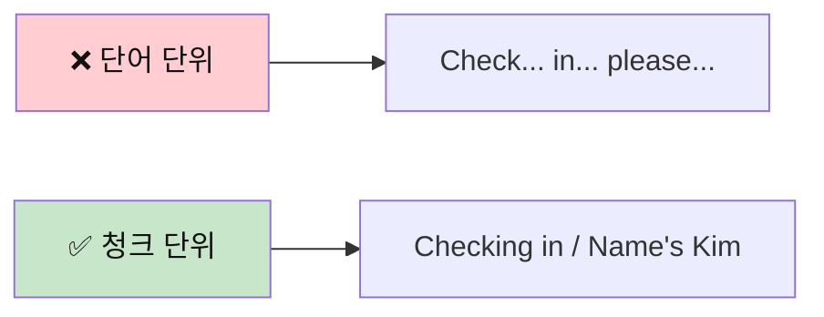
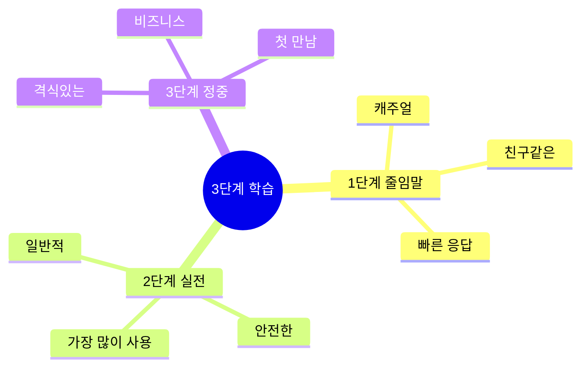
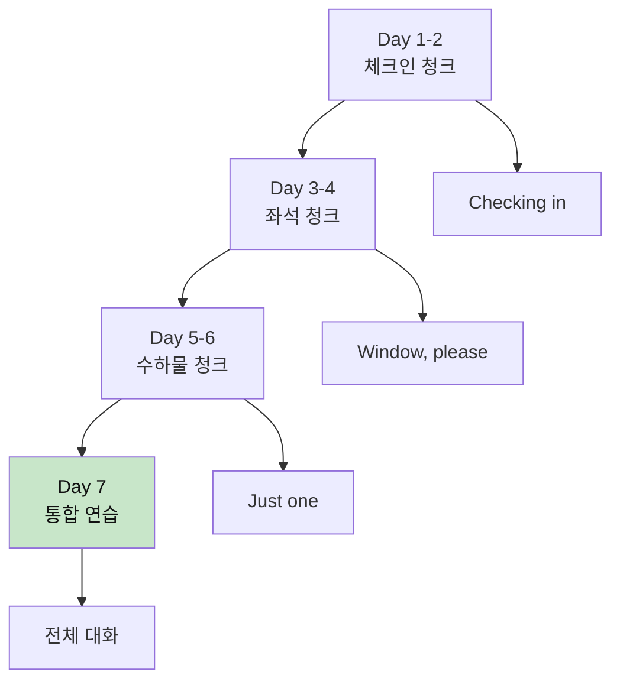
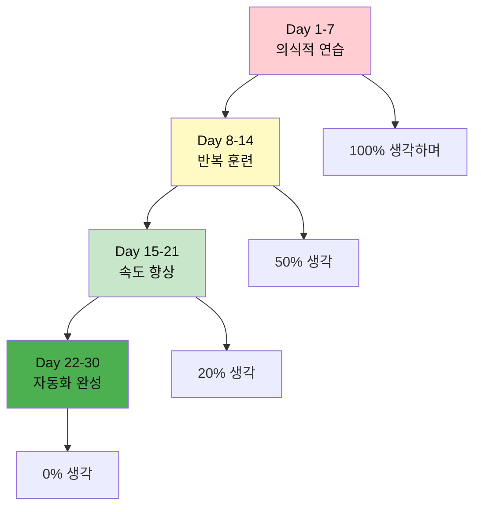

# ✈️ 공항 체크인 청크 실전 가이드
## 생각하고 말하는 청크 기반 학습법

---

## 📋 이 가이드의 특별한 점

### 🧠 청크(Chunk) 학습이란?
> **청크(Chunk)** = 의미 있는 언어 덩어리
> 
> 단어 하나하나가 아닌, **의미 단위로 묶어서** 생각하고 말하는 방법입니다.



### 💡 왜 청크로 배워야 하나?

1. **빠른 반응**: 생각하지 않고 자동으로 나옴
2. **자연스러움**: 원어민처럼 들림
3. **기억력 향상**: 덩어리로 외우면 잊어버리지 않음
4. **실수 감소**: 문법 걱정 없이 말할 수 있음

---

## 🎯 3단계 응용 시스템

모든 표현을 **3가지 레벨**로 학습합니다:



| 단계 | 상황 | 느낌 | 예시 |
|:---:|------|------|------|
| **1단계<br/>줄임말** | 친구, 캐주얼 | 편함 😊 | "Wanna window?" |
| **2단계<br/>실전** | 일반적 상황 | 안전 👍 | "Window seat, please." |
| **3단계<br/>정중** | 격식, 비즈니스 | 공손 🎩 | "Could I get a window seat?" |

---

## 📚 핵심 청크 마스터하기

### 청크 #1: 체크인 시작하기

#### 🧩 청크 구조 분석
```
청크 = [동작] + [목적]
예: "Checking in" = [체크인하는 중] + [이라는 목적]
```

#### 🎭 3단계 응용

**🔹 1단계: 줄임말 (Casual)**
```
상황: 친근한 분위기, 젊은 직원
청크: "Hey! / Checking in."

🗣️ 말하는 순서:
1. Hey! (인사)
2. Checking in (목적)

💭 생각 과정:
"안녕하세요" → "Hey!"
"체크인 할게요" → "Checking in"
```

**🔹 2단계: 실전 (Standard)**
```
상황: 일반적인 상황, 가장 안전
청크: "Hi! / I'd like to check in."

🗣️ 말하는 순서:
1. Hi! (인사)
2. I'd like to (원하는 것)
3. check in (목적)

💭 생각 과정:
"안녕하세요" → "Hi!"
"체크인 하고 싶어요" → "I'd like to check in"
```

**🔹 3단계: 정중 (Formal)**
```
상황: 격식 있는 상황, 비즈니스 클래스
청크: "Good morning. / I'd like to check in, please."

🗣️ 말하는 순서:
1. Good morning (정중한 인사)
2. I'd like to (예의 있는 요청)
3. check in, please (공손한 마무리)

💭 생각 과정:
"좋은 아침입니다" → "Good morning"
"체크인 하고 싶습니다" → "I'd like to check in, please"
```

#### 📊 청크 비교표

| 레벨 | 청크 | 길이 | 느낌 | 추천도 |
|:---:|------|:---:|:---:|:-----:|
| 1단계 | "Hey! Checking in." | ⚡ 짧음 | 😊 편함 | ⭐⭐⭐⭐ |
| 2단계 | "Hi! I'd like to check in." | 📏 보통 | 👍 안전 | ⭐⭐⭐⭐⭐ |
| 3단계 | "Good morning. I'd like to check in, please." | 📖 김 | 🎩 격식 | ⭐⭐⭐ |

#### 🎬 실전 대화 - 3가지 버전

**버전 A: 줄임말 (20대 배낭여행자)**
```
👤 손님: "Hey! Checking in."
👔 직원: "Hey! Passport?"
👤 손님: "Here."
👔 직원: "Cool. Kim, right?"
👤 손님: "Yep!"

⏱️ 시간: 5초
💭 느낌: 빠르고 편함
```

**버전 B: 실전 (일반 여행자) ⭐ 추천**
```
👤 손님: "Hi! I'd like to check in."
👔 직원: "Sure! May I see your passport?"
👤 손님: "Here you go."
👔 직원: "Thank you, Mr. Kim."
👤 손님: "Thanks!"

⏱️ 시간: 8초
💭 느낌: 가장 자연스러움
```

**버전 C: 정중 (비즈니스 여행자)**
```
👤 손님: "Good morning. I'd like to check in, please."
👔 직원: "Good morning! Of course. May I have your passport?"
👤 손님: "Certainly. Here it is."
👔 직원: "Thank you very much, Mr. Kim."
👤 손님: "Thank you."

⏱️ 시간: 12초
💭 느낌: 매우 공손함
```

---

### 청크 #2: 좌석 선택하기

#### 🧩 청크 구조 분석
```
청크 = [원하는 것] + [구체적 내용]
예: "Window seat" = [창가] + [좌석]
```

#### 🎭 3단계 응용

**🔹 1단계: 줄임말 (Casual)**
```
청크: "Window?"

🗣️ 말하는 순서:
1. Window? (원하는 것만)

💭 생각 과정:
"창가요?" → "Window?"

🎯 포인트:
- 한 단어로 끝냄
- 올림 억양 ↗️
- 표정으로 도움 (창문 가리키기)
```

**🔹 2단계: 실전 (Standard) ⭐ 추천**
```
청크: "Window seat, please."

🗣️ 말하는 순서:
1. Window seat (무엇을)
2. please (공손하게)

💭 생각 과정:
"창가 좌석" → "Window seat"
"주세요" → "please"

🎯 포인트:
- 완전한 청크
- 명확한 의사 전달
- 자연스러운 속도
```

**🔹 3단계: 정중 (Formal)**
```
청크: "Could I get / a window seat, / please?"

🗣️ 말하는 순서:
1. Could I get (공손한 요청)
2. a window seat (무엇을)
3. please (예의)

💭 생각 과정:
"받을 수 있을까요?" → "Could I get"
"창가 좌석을" → "a window seat"
"부탁드립니다" → "please"

🎯 포인트:
- 가장 예의 바름
- 청크를 나눠서 말하기
- 부드러운 톤
```

#### 📍 상황별 실전 청크

**상황 1: 직원이 먼저 물을 때**
```
👔 직원: "Window or aisle?"

✅ 1단계: "Window."
✅ 2단계: "Window, please."
✅ 3단계: "Window would be great."

💡 팁: 짧은 대답이 자연스러움!
```

**상황 2: 내가 먼저 요청할 때**
```
✅ 1단계: "Wanna window."
✅ 2단계: "I'd like a window seat."
✅ 3단계: "Could I possibly get a window seat?"

💡 팁: 2단계가 가장 무난!
```

**상황 3: 좌석이 없을 때 대응**
```
👔 직원: "Sorry, no window seats left."

✅ 1단계: "Aisle's cool."
✅ 2단계: "Aisle is fine too."
✅ 3단계: "That's alright, I'll take an aisle seat."

💡 팁: 유연한 태도 중요!
```

#### 🎬 청크 조합 실전

**시나리오: 완벽한 좌석 요청**
```
👔 직원: "Checking in?"
👤 손님: "Yep! Kim."
👔 직원: "Got it. Window or aisle?"
👤 손님: "Window, please. / Near the front / if possible?"
         [청크1]      [청크2]        [청크3]
👔 직원: "Lemme see... / 8A. / Perfect spot!"
         [생각하는 중]  [결과] [평가]

💭 청크로 생각하기:
손님 마음: "창가석 + 앞쪽 + 가능하면"
       → 3개 청크로 나눠서 말하기
```

---

### 청크 #3: 수하물 처리하기

#### 🧩 청크 구조 분석
```
청크 = [개수] + [행동]
예: "Just one" = [하나만] + [있어요]
```

#### 🎭 3단계 응용 - 수하물 있을 때

**🔹 1단계: 줄임말**
```
👔 직원: "Bags?"
👤 손님: "One."

청크: "One."
⏱️ 0.5초
💭 생각: "하나" → "One"
```

**🔹 2단계: 실전 ⭐**
```
👔 직원: "Any bags to check?"
👤 손님: "Yeah, / just one."
         [확인] [개수]

청크: "Yeah, just one."
⏱️ 1초
💭 생각: "네" → "Yeah"
         "하나만" → "just one"
```

**🔹 3단계: 정중**
```
👔 직원: "Do you have any bags to check?"
👤 손님: "Yes, / I have one bag / to check."
         [확인] [무엇을]      [목적]

청크: "Yes, I have one bag to check."
⏱️ 2초
💭 생각: "네" → "Yes"
         "가방 하나" → "I have one bag"
         "부치려고요" → "to check"
```

#### 🎭 3단계 응용 - 수하물 없을 때

**🔹 1단계: 줄임말**
```
청크: "Nah. / Carry-on only."
      [거절] [이유]

💭 생각: "아니요" → "Nah"
         "기내용만" → "Carry-on only"
```

**🔹 2단계: 실전 ⭐**
```
청크: "No, / just carry-on."
      [거절] [이유]

💭 생각: "아니요" → "No"
         "기내용만" → "just carry-on"
```

**🔹 3단계: 정중**
```
청크: "No thank you, / I only have carry-on."
      [공손한 거절]  [이유 설명]

💭 생각: "아니요 괜찮습니다" → "No thank you"
         "기내용만 있어요" → "I only have carry-on"
```

#### 📊 무게 확인 청크

**상황: 저울에 올린 후**
```
👔 직원: "Pop it on the scale."
👤 손님: [짐을 올림]
👤 손님: "Is it okay?"
         [확인 청크]

💭 청크 분석:
"Is it" = 확인하는 청크
"okay" = 괜찮은지 묻는 청크
```

**3단계 무게 확인 청크**
```
✅ 1단계: "Okay?" (초간단)
✅ 2단계: "Is it okay?" (표준)
✅ 3단계: "Is the weight alright?" (정중)

💡 실전에서는 2단계가 가장 자연스러움!
```

---

### 청크 #4: 게이트 & 탑승 시간 확인

#### 🧩 청크 구조 분석
```
청크 = [의문사] + [명사]?
예: "What gate?" = [무엇] + [게이트]?
```

#### 🎭 3단계 질문 청크

**질문 1: 게이트 번호**
```
✅ 1단계: "Gate?"
   - 한 단어
   - 올림 억양
   - 빠름 ⚡

✅ 2단계: "What gate?" ⭐ 추천
   - 완전한 질문
   - 명확함
   - 자연스러움

✅ 3단계: "Which gate am I at?"
   - 완전한 문장
   - 정중함
   - 비즈니스 OK
```

**질문 2: 탑승 시간**
```
✅ 1단계: "Boarding time?"
✅ 2단계: "When's boarding?" ⭐
✅ 3단계: "What time does boarding start?"
```

**질문 3: 게이트 위치**
```
✅ 1단계: "Where?"
✅ 2단계: "Where's gate 15?" ⭐
✅ 3단계: "Could you tell me where gate 15 is?"
```

#### 🎬 청크 조합 - 완벽한 마무리

**시나리오: 모든 정보 확인하기**
```
상황: 탑승권을 받은 직후

👔 직원: "Here's your boarding pass."
👤 손님: "Thanks! / What gate?"
         [감사]   [질문1]
👔 직원: "Gate 22."
👤 손님: "And boarding time?"
         [추가 질문]
👔 직원: "2:30 PM."
👤 손님: "Perfect. / Where is it?"
         [확인]    [위치]
👔 직원: "That way, / past security."
         [방향]      [상세]
👤 손님: "Got it. / Thanks!"
         [이해]    [감사]

💭 청크 분석:
- 각 질문을 짧은 청크로
- 한 번에 하나씩
- 명확하고 빠르게
```

---

## 🧠 청크 사고 훈련법

### 방법 1: 거울 앞 청크 연습

```
1단계: 한국어로 생각
"체크인하고 싶어요"

2단계: 청크로 나누기
"체크인" + "하고 싶어요"
↓
"Check in" + "I'd like to"

3단계: 순서 바꾸기 (영어식)
"I'd like to" + "check in"

4단계: 소리 내어 말하기
"I'd like to check in."

5단계: 자동화될 때까지 반복
10번, 20번, 50번...
```

### 방법 2: 청크 속도 훈련

```
느리게 (청크 구분하며):
"I'd like to / check in."
  [원하는 것]  [행동]

보통 속도:
"I'd like to check in."

빠르게 (자동으로):
"I'dliketocheckin."
↓
들리는 건: "아일라이크투체킨"

💡 목표: 생각 없이 자동으로 나올 때까지!
```

### 방법 3: 상황 시뮬레이션

```
상황 카드를 만들어서 연습:

📇 카드 1: 공항 도착
→ "Hey! Checking in."
→ [3초 안에 자동으로 나와야 함]

📇 카드 2: 좌석 물어볼 때
→ "Window, please."
→ [2초 안에 자동으로]

📇 카드 3: 짐 물어볼 때
→ "Yeah, just one."
→ [1초 안에 자동으로]

🎯 목표: 생각하는 시간 0초!
```

---

## 📊 청크 마스터 로드맵

### 1주차: 기본 청크 암기



**Day 1-2: 체크인 청크**
```
□ "Checking in" 100번 말하기
□ "I'd like to check in" 50번
□ "Name's Kim" 50번
□ 거울 보며 연습 10분 × 2
```

**Day 3-4: 좌석 청크**
```
□ "Window, please" 100번
□ "Aisle is fine" 50번
□ "Near the front if possible" 30번
□ 상황 시뮬레이션 3회
```

**Day 5-6: 수하물 청크**
```
□ "Just one" 100번
□ "Is it okay?" 50번
□ "What gate?" 50번
□ 전체 연결 연습
```

**Day 7: 통합 테스트**
```
□ 10턴 대화 5회 연습
□ 녹음해서 듣기
□ 친구와 역할극
□ 실전 준비 완료!
```

### 2주차: 속도 & 자동화

```
Week 2 목표: 생각 없이 자동으로!

Day 8-9: 속도 올리기
□ 1.5배속으로 연습
□ 3초 → 2초 → 1초
□ 빠른 응답 훈련

Day 10-11: 변형 연습
□ 다른 이름으로
□ 다른 좌석으로
□ 다른 상황으로

Day 12-13: 실전 시뮬레이션
□ 예상치 못한 질문 대응
□ 문제 상황 연습
□ 자신감 UP!

Day 14: 최종 점검
□ 전체 복습
□ 약점 보강
□ 실전 투입 준비!
```

---

## 🎯 실전 청크 대화 - 완벽한 체크인

### 시나리오 1: 순조로운 체크인 (줄임말 버전)

```
상황: 20대 배낭여행자, 친근한 분위기

턴 1
👤: "Hey! / Checking in."
    [인사] [목적]
💭: "안녕" + "체크인"

턴 2
👔: "Hey! / Passport?"
    [인사] [요청]
👤: "Here."
    [건네기]
💭: "여기요" → 짧게!

턴 3
👔: "Cool. / Kim, right?"
    [확인] [이름]
👤: "Yep!"
    [긍정]
💭: "네" → 캐주얼하게

턴 4
👔: "Window or aisle?"
👤: "Window."
    [선택]
💭: 한 단어로 충분!

턴 5
👔: "Got it. / Any bags?"
    [확인]   [질문]
👤: "One."
    [개수]
💭: 최소한으로!

턴 6
👔: "Pop it on the scale."
👤: [짐을 올림]
👤: "Okay?"
    [확인]
💭: 간단하게!

턴 7
👔: "You're good. / 20 kilos."
    [OK]         [무게]
👤: "Sweet!"
    [만족]
💭: 기뻐하는 표현

턴 8
👔: "Here's your pass. / Gate 22."
    [탑승권]          [게이트]
👤: "When's boarding?"
    [질문]
💭: 시간 확인

턴 9
👔: "2:30. / That way."
    [시간]  [방향]
👤: "Perfect. / Thanks!"
    [만족]   [감사]

턴 10
👔: "No prob! / Have a good flight!"
    [응답]    [인사]

⏱️ 총 소요시간: 약 45초
🎯 청크 개수: 15개
💡 느낌: 빠르고 효율적!
```

### 시나리오 2: 표준 체크인 (실전 버전) ⭐ 추천

```
상황: 일반 여행자, 가장 보편적

턴 1
👤: "Hi! / I'd like to check in."
    [인사] [목적 청크]
💭: "안녕하세요" + "체크인하고 싶어요"

턴 2
👔: "Sure! / May I see your passport?"
    [OK]   [요청]
👤: "Here you go."
    [건네는 청크]
💭: "여기 있어요" → 공손하게

턴 3
👔: "Thank you, Mr. Kim. / Flying to LA?"
    [감사]              [확인]
👤: "Yes, that's right."
    [확인 청크]
💭: "네, 맞아요"

턴 4
👔: "Perfect. / Window or aisle?"
    [좋다]   [선택 질문]
👤: "Window, please. / Near the front / if possible?"
    [선택]          [위치]       [조건]
💭: 3개 청크로 나눠서 요청

턴 5
👔: "Let me check... / I have 8A. / Good spot!"
    [확인 중]        [결과]     [평가]
👤: "That's great! / Thank you."
    [만족]        [감사]
💭: 긍정적으로 반응

턴 6
👔: "Any bags to check?"
👤: "Yes, / just one."
    [확인] [개수]
💭: "네" + "하나만"

턴 7
👔: "Please put it on the scale."
👤: [짐을 올림]
👤: "Is it okay?"
    [확인 청크]
💭: 무게 걱정

턴 8
👔: "Perfect! / 22 kilos. / You're all set."
    [OK]     [무게]     [완료]
👤: "Wonderful!"
    [기쁨 표현]
💭: 안도감

턴 9
👤: "What gate / am I at?"
    [질문 청크] [위치]
👔: "Gate 15. / Boarding starts / at 2:30."
    [게이트]  [탑승 시작]  [시간]
💭: 정보를 청크로 나눠서 받기

턴 10
👤: "Got it. / Where is gate 15?"
    [이해]   [위치 질문]
👔: "Down the hall, / to your left."
    [방향]          [상세]
👤: "Thank you so much!"
    [감사 청크]

⏱️ 총 소요시간: 약 90초
🎯 청크 개수: 28개
💡 느낌: 명확하고 정중!
```

### 시나리오 3: 격식 체크인 (정중 버전)

```
상황: 비즈니스 여행자, 프리미엄 서비스

턴 1
👤: "Good morning. / I'd like to check in, / please."
    [격식 인사]   [청크 요청]         [공손]
💭: 격식 갖춰서 시작

턴 2
👔: "Good morning, sir. / May I have your passport / and booking confirmation?"
    [격식 인사]       [요청1]                  [요청2]
👤: "Certainly. / Here they are."
    [흔쾌히]    [제공]
💭: 모든 서류 준비됨

턴 3
👔: "Thank you very much. / Mr. Kim, / business class to Tokyo?"
    [정중한 감사]        [호칭]   [확인]
👤: "Yes, / that's correct."
    [확인] [동의]
💭: 정중하게 확인

턴 4
👔: "Wonderful. / For seating, / would you prefer / window or aisle?"
    [긍정]      [주제]       [공손한 질문]  [선택]
👤: "I'd prefer / a window seat, / if available. / Ideally / near the front."
    [선호]     [좌석]         [조건]      [이상적] [위치]
💭: 5개 청크로 정중하게 요청

턴 5
👔: "Let me see / what I can do. / ... / Yes, / I can offer you / seat 2A. / That's / right at the front."
    [확인하겠다] [노력]         [확인] [제안]        [좌석]   [위치]  [설명]
👤: "That would be perfect. / Thank you."
    [만족]              [감사]
💭: 정중하게 감사

턴 6
👔: "My pleasure. / Do you have / any bags / to check today?"
    [천만에]     [질문]       [대상]   [행동]
👤: "Yes, / I have two bags. / Could you / confirm / the weight allowance?"
    [확인] [개수]          [요청]    [확인]   [한도]
💭: 사전에 확인

턴 7
👔: "Of course. / Business class allows / two bags / up to 32 kilos each."
    [물론]     [설명]              [개수]    [무게]
👤: "Excellent. / These should be / within the limit."
    [좋음]     [예상]           [한도 내]
💭: 자신있게 말함

턴 8
👔: "Let's check. / Please place them / on the scale."
    [확인하자]  [요청]           [저울]
👤: [짐을 차례로 올림]
👔: "21 and 23 kilos. / All good."
    [무게]             [OK]
👤: "Wonderful. / Thank you."
    [만족]      [감사]

턴 9
👔: "Here's your boarding pass. / You're at gate 7. / Boarding will begin / at 14:30, / approximately / 45 minutes / before departure."
    [탑승권]                [게이트]         [탑승 시작]      [시간]    [대략]      [시간]         [출발 전]
👤: "I understand. / Could you / direct me / to the lounge?"
    [이해]       [요청]    [안내]      [라운지]
💭: 라운지 이용 계획

턴 10
👔: "Certainly. / The business lounge / is on the second floor, / past security. / Enjoy your flight, / Mr. Kim."
    [물론]     [라운지]            [위치]                [보안 통과 후] [인사]            [호칭]
👤: "Thank you / for your excellent service."
    [감사]     [칭찬]

⏱️ 총 소요시간: 약 150초
🎯 청크 개수: 45개
💡 느낌: 매우 정중하고 전문적!
```

---

## 📝 청크 셀프 테스트

### 테스트 1: 청크 속도 테스트

```
다음 상황에 3초 안에 반응하세요:

1. 직원: "Can I help you?"
   나: _________________ (체크인)

2. 직원: "Window or aisle?"
   나: _________________ (창가)

3. 직원: "Any bags?"
   나: _________________ (하나)

4. 직원: "Pop it on the scale."
   나: [짐 올린 후] _________________ (괜찮은지)

5. 직원: "Here's your boarding pass."
   나: _________________ (게이트 번호)

⏱️ 시간 제한: 각 3초
🎯 목표: 생각 없이 자동으로!
```

<details>
<summary>✅ 모범 답안</summary>

1. **"Checking in."** (1초)
2. **"Window, please."** (1초)
3. **"Just one."** (1초)
4. **"Is it okay?"** (1초)
5. **"What gate?"** (1초)

💡 만약 3초 이상 걸린다면:
→ 해당 청크를 100번 더 연습!

</details>

### 테스트 2: 청크 조합 테스트

```
다음 청크들을 조합하여 자연스러운 문장 만들기:

청크 은행:
[Checking in] [Name's Kim] [Window, please] 
[Just one] [Is it okay?] [What gate?]

상황 1: 체크인 시작
→ _________________

상황 2: 좌석 요청
→ _________________

상황 3: 짐 확인
→ _________________

상황 4: 게이트 확인
→ _________________
```

<details>
<summary>✅ 모범 답안</summary>

**상황 1: 체크인 시작**
"Checking in. Name's Kim."

**상황 2: 좌석 요청**
"Window, please."

**상황 3: 짐 확인**
"Just one. Is it okay?"

**상황 4: 게이트 확인**
"What gate?"

💡 청크를 조합하는 순서:
1. 짧은 청크부터
2. 관련 있는 것끼리
3. 자연스러운 흐름으로

</details>

### 테스트 3: 3단계 변환 테스트

```
다음 문장을 3단계로 변환하세요:

원문: "I want to check in."

1단계 (줄임말): _________________
2단계 (실전): _________________
3단계 (정중): _________________
```

<details>
<summary>✅ 모범 답안</summary>

**1단계 (줄임말):**
"Checking in."

**2단계 (실전):**
"I'd like to check in."

**3단계 (정중):**
"I'd like to check in, please."

**또는:**
"Good morning. I'd like to check in, please."

💡 변환 요령:
- 짧게 → 표준 → 길게
- 캐주얼 → 중립 → 격식
- 빠르게 → 보통 → 천천히

</details>

---

## 💡 청크 마스터 비법

### 비법 1: 청크 노트 만들기

```
📓 나만의 청크 노트

페이지 1: 체크인 청크
┌─────────────────────┐
│ Checking in         │ ⭐⭐⭐⭐⭐
│ Name's Kim          │ ⭐⭐⭐⭐
│ I'd like to check in│ ⭐⭐⭐⭐⭐
└─────────────────────┘

페이지 2: 좌석 청크
┌─────────────────────┐
│ Window, please      │ ⭐⭐⭐⭐⭐
│ Aisle is fine       │ ⭐⭐⭐⭐
│ Near the front      │ ⭐⭐⭐
└─────────────────────┘

💡 별표는 자신있는 정도!
```

### 비법 2: 청크 음성 메모

```
📱 스마트폰 활용법

1. 음성 메모 앱 열기
2. 청크 10번씩 녹음
3. 출퇴근길에 듣기
4. 따라 말하기
5. 자동화까지!

🎧 플레이리스트 예시:
- Track 1: 체크인 청크 × 10
- Track 2: 좌석 청크 × 10
- Track 3: 수하물 청크 × 10
- Track 4: 전체 대화 × 3
```

### 비법 3: 청크 플래시카드

```
🃏 앞면: 한국어 상황
"체크인하고 싶어요"

🃏 뒷면: 영어 청크 3단계
1단계: "Checking in."
2단계: "I'd like to check in."
3단계: "I'd like to check in, please."

📚 카드 세트:
- 체크인 세트: 10장
- 좌석 세트: 10장
- 수하물 세트: 10장
- 질문 세트: 10장
```

---

## 🎯 최종 목표: 청크 자동화

### 자동화 레벨 체크

```
레벨 1: 의식적 청크 (초보)
"음... 체크인은 영어로... Checking in!"
⏱️ 반응 시간: 3-5초

레벨 2: 빠른 청크 (중급)
"Checking in" [생각 → 말]
⏱️ 반응 시간: 1-2초

레벨 3: 자동 청크 (고급)
[생각 = 말] "Checking in!"
⏱️ 반응 시간: 0.5초

레벨 4: 무의식 청크 (원어민급) 🏆
상황 보자마자 자동으로!
⏱️ 반응 시간: 0초 (즉각)

🎯 목표: 레벨 3 이상!
```

### 자동화 달성 로드맵



---

## 📚 다음 학습

청크 기반 학습을 마스터했다면:
- 👉 [호텔 & 식당 청크 가이드](../숙박_식사/07_호텔_식당_청크_실전_가이드.md)
- 👉 [쇼핑 & 교통 청크 가이드](../쇼핑_교통/10_쇼핑_교통_청크_실전_가이드.md)

---

## 🏆 학습 완료 체크리스트

### 청크 이해도 ✅
- [ ] 청크가 무엇인지 설명할 수 있다
- [ ] 3단계 응용 시스템을 이해한다
- [ ] 청크로 생각하는 방법을 안다
- [ ] 청크 조합 원리를 안다

### 청크 암기도 ✅
- [ ] 체크인 청크 10개 암기
- [ ] 좌석 청크 10개 암기
- [ ] 수하물 청크 10개 암기
- [ ] 질문 청크 10개 암기

### 청크 속도 ✅
- [ ] 3초 안에 반응 가능
- [ ] 1초 안에 반응 가능 (목표)
- [ ] 생각 없이 자동으로 나옴
- [ ] 10턴 대화 유창하게 가능

### 실전 준비도 🔥
- [ ] 3가지 버전 모두 연습
- [ ] 상황별 청크 선택 가능
- [ ] 예상치 못한 상황 대응 OK
- [ ] 실전 투입 자신감 100%!

---

**💪 청크 마스터가 되는 비결:**
> "생각하지 말고, 느껴라!" - 브루스 리
> 
> 청크는 생각하는 게 아니라, 
> 자동으로 나오는 것!

**Last Updated: 2026-01-11**

