# ✈️ 공항 체크인 표현 완벽 분석
## 첫 여행 관문 돌파하기

---

## 📋 목차
1. [공항 체크인 전체 흐름](#공항-체크인-전체-흐름)
2. [핵심 표현 완전 분석](#핵심-표현-완전-분석)
3. [상황별 필수 표현](#상황별-필수-표현)
4. [문제 상황 대처법](#문제-상황-대처법)
5. [실전 대화 분석](#실전-대화-분석)

---

## 공항 체크인 전체 흐름

### 프로세스 마인드맵

```mermaid
flowchart TB
    A[항공사 카운터 도착] --> B[인사 & 예약 확인]
    B --> C[여권 제시]
    C --> D[좌석 선택]
    D --> E[수하물 처리]
    E --> F[탑승권 수령]
    F --> G[게이트 & 시간 확인]
    G --> H[완료]
    
    B --> B1[Check in, please?]
    D --> D1[Window or aisle?]
    E --> E1[Any bags to check?]
    F --> F1[Boarding pass]
    G --> G1[Gate number?]
    
    style A fill:#e3f2fd
    style D fill:#fff9c4
    style H fill:#c8e6c9
```



### 단계별 필수 표현

```mermaid
mindmap
  root((공항 체크인))
    시작
      Check in please
      Reservation under...
      Flying to...
    좌석
      Window seat
      Aisle seat
      Any preference
    수하물
      Check a bag
      Carry-on only
      Weight limit
    확인
      Gate number
      Boarding time
      Receipt
```



---

## 핵심 표현 완전 분석

## 1️⃣ Check in (체크인하다)

### 📖 기본 정보

| 항목 | 내용 |
|------|------|
| **표현** | Check in |
| **발음** | 체크 인 |
| **한국어** | 체크인하다 / 수속하다 |
| **품사** | 동사 (2단어 동사) |

### 🎯 다양한 표현 방법

```mermaid
flowchart TB
    A[체크인 요청] --> B[초급]
    A --> C[중급]
    A --> D[고급/현대]
    
    B --> B1["Check in, please?"]
    C --> C1["I'd like to check in."]
    D --> D1["I'm gonna check in."]
    
    style B fill:#c8e6c9
    style C fill:#fff9c4
    style D fill:#bbdefb
```



| 레벨 | 표현 | 뉘앙스 |
|:---:|------|--------|
| 🌱 초급 | Check in, please? | 직접적, 간단 |
| 🌿 중급 | I'd like to check in. | 정중, 격식 |
| 💬 현대 | I'm gonna check in. | 캐주얼, 자연스러움 |

### 💬 실전 예문

```
가장 자연스러운 표현:
✅ "Hey! Check in, please?"
   (헤이! 체크 인, 플리즈?)
   → 안녕하세요! 체크인할게요.

✅ "Hi! I'm gonna check in for my LA flight."
   (하이! 아임 거너 체크 인 포 마이 엘에이 플라잇)
   → 안녕하세요! LA행 비행기 체크인할게요.

정중한 표현:
✅ "Good morning. I'd like to check in, please."
   (굿 모닝. 아이드 라익 투 체크 인, 플리즈)
   → 좋은 아침입니다. 체크인하고 싶습니다.
```

### ⚠️ 주의사항

```
✅ check IN (체크인하다 - 들어가다)
❌ check OUT (체크아웃하다 - 나가다) - 호텔에서 사용!

올바른 사용:
✅ "I need to check in." (공항)
❌ "I need to check out." (이건 호텔!)
```

---

## 2️⃣ Reservation / Booking (예약)

### 📖 기본 정보

| 표현 | 발음 | 의미 | 사용 지역 |
|------|------|------|----------|
| **Reservation** | 레저베이션 | 예약 | 미국 주로 |
| **Booking** | 부킹 | 예약 | 영국/국제 |

### 💬 예약 관련 핵심 표현

```mermaid
mindmap
  root((예약 표현))
    확인
      Reservation under...
      Booking under...
      Confirmation number
    문제
      Can't find it
      Wrong name
      Need to change
```



### 실전 대화

```
직원: "What's the name on the reservation?"
      (왓츠 더 네임 온 더 레저베이션?)
      → 예약자 성함이 어떻게 되시나요?

손님: "It's under Kim. K-I-M."
      (잇츠 언더 킴. 케이-아이-엠)
      → 김으로 되어 있어요. K-I-M입니다.

또는:
손님: "The booking's under Park."
      (더 부킹스 언더 파크)
      → 박으로 예약되어 있어요.
```

### 📌 중요 표현

```
✅ "The reservation is under [이름]."
   (더 레저베이션 이즈 언더 [이름])
   → [이름]으로 예약되어 있어요.

✅ "I have a confirmation number."
   (아이 해브 어 컨펌메이션 넘버)
   → 예약 확인 번호가 있어요.

✅ "Can you look up my booking?"
   (캔 유 룩 업 마이 부킹?)
   → 제 예약을 찾아주실 수 있나요?
```

---

## 3️⃣ Window or Aisle? (창가 vs 통로)

### 📖 좌석 종류

```mermaid
flowchart LR
    A[좌석 선택] --> B[Window<br/>창가]
    A --> C[Aisle<br/>통로]
    A --> D[Middle<br/>중간]
    
    B --> B1[경치 좋음<br/>잠자기 좋음]
    C --> C1[이동 편함<br/>화장실 가기 쉬움]
    D --> D1[불편함<br/>피하는 게 좋음]
    
    style B fill:#bbdefb,color:#111
    style C fill:#c8e6c9,color:#111
    style D fill:#ffcdd2,color:#111
```



| 좌석 | 영어 | 발음 | 장점 | 단점 |
|------|------|------|------|------|
| **창가** | Window | 윈도우 | 경치, 벽 기대기 | 나가기 불편 |
| **통로** | Aisle | 아일 | 이동 자유, 화장실 | 지나다니는 사람들 |
| **중간** | Middle | 미들 | ... 없음 | 양쪽 끼임 😅 |

### 💬 좌석 요청 표현

```
기본 요청:
✅ "Window, please."
   (윈도우, 플리즈)
   → 창가석으로 주세요.

✅ "I'd prefer an aisle seat."
   (아이드 프리퍼 언 아일 싯)
   → 통로석을 선호합니다.

공손한 요청:
✅ "Could I get a window seat?"
   (쿠다이 겟 어 윈도우 싯?)
   → 창가석으로 받을 수 있을까요?

✅ "Any chance I could get an aisle?"
   (에니 챈스 아이 쿠드 겟 언 아일?)
   → 혹시 통로석 가능할까요?

현대/캐주얼:
✅ "Window's good."
   (윈도우즈 굿)
   → 창가석이 좋아요.

✅ "I'll take the aisle."
   (아일 테이크 디 아일)
   → 통로석으로 할게요.
```

### 🎯 추가 요청

```
위치 관련:
✅ "Is it near the front?"
   (이즈 잇 니얼 더 프론트?)
   → 앞쪽인가요?

✅ "How far back is it?"
   (하우 파 백 이즈 잇?)
   → 얼마나 뒤쪽인가요?

✅ "Kinda in the middle is fine."
   (카인더 인 더 미들 이즈 파인)
   → 중간쯤이면 괜찮아요.

비상구:
✅ "Is there an exit row available?"
   (이즈 데얼 언 엑싯 로우 어베일러블?)
   → 비상구 좌석 있나요?
```

---

## 4️⃣ Baggage / Luggage (수하물)

### 📖 수하물 종류

```mermaid
mindmap
  root((수하물))
    Checked bag
      위탁 수하물
      화물칸에
      무게 제한
    Carry-on
      기내 반입
      머리 위 선반
      크기 제한
    Personal item
      개인 소지품
      노트북/핸드백
      발 밑에
```



| 종류 | 영어 | 발음 | 설명 |
|------|------|------|------|
| **위탁 수하물** | Checked bag | 체크드 백 | 화물칸에 싣는 짐 |
| **기내 반입** | Carry-on | 캐리 온 | 기내에 들고 타는 짐 |
| **개인 소지품** | Personal item | 퍼스널 아이템 | 노트북 가방 등 |

### 💬 수하물 관련 표현

```
수하물 확인:
직원: "Any bags to check?"
      (에니 백스 투 체크?)
      → 부칠 짐 있으세요?

손님: "Yeah, just one."
      (예, 저스트 원)
      → 네, 하나요.

또는:
손님: "No, just carry-on."
      (노, 저스트 캐리 온)
      → 아니요, 기내용만 있어요.
```

### ⚖️ 무게 관련

```
무게 확인:
직원: "Pop it on the scale."
      (팝 잇 온 더 스케일)
      → 저울에 올려주세요.

손님: "Is it okay?"
      (이즈 잇 오케이?)
      → 괜찮아요?

직원: "You're good. 20 kilos."
      (유얼 굿. 트웬티 킬로스)
      → 괜찮아요. 20킬로예요.

오버 상황:
직원: "It's a bit over. Maybe take something out?"
      (잇츠 어 빗 오버. 메이비 테이크 썸씽 아웃?)
      → 좀 초과했네요. 뭐 좀 빼시겠어요?

손님: "How much over?"
      (하우 머치 오버?)
      → 얼마나 초과했나요?
```

### 📌 유용한 표현

```
✅ "Can I check this bag?"
   (캔 아이 체크 디스 백?)
   → 이 가방 부칠 수 있나요?

✅ "What's the weight limit?"
   (왓츠 더 웨잇 리밋?)
   → 무게 제한이 얼마예요?

✅ "Is carry-on included?"
   (이즈 캐리 온 인클루디드?)
   → 기내용은 포함인가요?

✅ "Do I have to pay for bags?"
   (두 아이 해브 투 페이 포 백스?)
   → 수하물 요금 내야 하나요?
```

---

## 5️⃣ Boarding Pass & Gate (탑승권 & 게이트)

### 📖 기본 정보



```mermaid
flowchart TB
    A[탑승권 받기] --> B[탑승권 정보 확인]
    B --> C[게이트 번호]
    B --> D[탑승 시간]
    B --> E[좌석 번호]
    
    C --> C1[Gate 22]
    D --> D1[Boarding 10:30]
    E --> E1[Seat 14A]
    
    style A fill:#e3f2fd,color:#111
    style B fill:#fff9c4,color:#111
    style C fill:#c8e6c9,color:#111
```

### 💬 핵심 질문

```
게이트 확인:
✅ "What gate?"
   (왓 게이트?)
   → 몇 번 게이트예요?

✅ "Where's gate 22?"
   (웨얼즈 게이트 트웬티투?)
   → 22번 게이트가 어디예요?

시간 확인:
✅ "What time's boarding?"
   (왓 타임즈 보딩?)
   → 탑승 시간이 언제예요?

✅ "When should I be at the gate?"
   (웬 슈드 아이 비 앳 더 게이트?)
   → 게이트에 언제까지 가야 하나요?
```

### 🎫 탑승권 관련

```
직원: "Here's your boarding pass."
      (히얼즈 유어 보딩 패스)
      → 탑승권입니다.

손님: "Thanks! What gate?"
      (땡스! 왓 게이트?)
      → 고마워요! 몇 번 게이트예요?

직원: "Gate 22. It's that way."
      (게이트 트웬티투. 잇츠 댓 웨이)
      → 22번 게이트요. 저쪽이에요.

추가 질문:
✅ "How long till boarding?"
   (하우 롱 틸 보딩?)
   → 탑승까지 얼마나 남았나요?

✅ "Is there a lounge I can use?"
   (이즈 데얼 어 라운지 아이 캔 유즈?)
   → 이용할 수 있는 라운지 있나요?
```

---

## 문제 상황 대처법

### 자주 발생하는 문제

```mermaid
mindmap
  root((문제 상황))
    예약 문제
      찾을 수 없음
      이름 오류
      중복 예약
    좌석 문제
      원하는 좌석 없음
      오버부킹
      자동 배정
    수하물 문제
      무게 초과
      크기 초과
      금지 물품
    시간 문제
      지연
      게이트 변경
      시간 촉박
```



---

## 6️⃣ 예약을 찾을 수 없을 때

### 💬 대처 표현

```
문제 발생:
직원: "Hmm, I can't find your reservation."
      (흠, 아이 캔트 파인드 유어 레저베이션)
      → 음, 예약을 찾을 수 없네요.

침착하게 대응:
손님: "Really? Let me check my email."
      (리얼리? 렛 미 체크 마이 이메일)
      → 정말요? 이메일 확인해볼게요.

✅ "I have the confirmation number right here."
   (아이 해브 더 컨펌메이션 넘버 라잇 히얼)
   → 확인 번호가 여기 있어요.

✅ "Could you check under [다른 이름]?"
   (쿠쥬 체크 언더 [다른 이름]?)
   → [다른 이름]으로 확인해주실 수 있나요?

✅ "Maybe it's under my first name?"
   (메이비 잇츠 언더 마이 퍼스트 네임?)
   → 아마 이름으로 되어 있을 수도 있어요?
```

---

## 7️⃣ 좌석이 없을 때

### 💬 대처 표현

```
상황:
직원: "Sorry, no window seats left."
      (쏘리, 노 윈도우 시츠 레프트)
      → 죄송하지만 창가석이 없네요.

대안 제시:
손님: "Aisle is okay too."
      (아일 이즈 오케이 투)
      → 통로석도 괜찮아요.

✅ "What's available?"
   (왓츠 어베일러블?)
   → 뭐가 있나요?

✅ "Can you check if anything opens up?"
   (캔 유 체크 이프 에니씽 오픈스 업?)
   → 혹시 자리 나는지 확인해주실 수 있나요?

✅ "Any chance of an upgrade?"
   (에니 챈스 오브 언 업그레이드?)
   → 업그레이드 가능성 있나요?
```

---

## 8️⃣ 수하물이 무게 초과일 때

### 💬 대처 표현

```
문제 발생:
직원: "It's 3 kilos over the limit."
      (잇츠 쓰리 킬로스 오버 더 리밋)
      → 3킬로 초과했네요.

대응 방법:
손님: "Can I take something out?"
      (캔 아이 테이크 썸씽 아웃?)
      → 뭐 좀 빼도 될까요?

✅ "How much is the fee?"
   (하우 머치 이즈 더 피?)
   → 수수료가 얼마예요?

✅ "Can I put it in my carry-on?"
   (캔 아이 풋 잇 인 마이 캐리 온?)
   → 기내용으로 옮겨도 될까요?

✅ "Is there any way to avoid the fee?"
   (이즈 데얼 에니 웨이 투 어보이드 더 피?)
   → 수수료 피할 방법 있나요?
```

---

## 실전 대화 분석

### 완벽한 체크인 대화 A (캐주얼)

```
[상황: 혼자 여행하는 젊은 여행자]

손님: "Hey! Check in, please?"
직원: "Hey! Passport?"
손님: "Here you go."
직원: "Cool. Flying to LA?"
손님: "Yep!"
직원: "Window or aisle?"
손님: "Window's good."
직원: "Got it. Any bags?"
손님: "Yeah, one."
직원: "Pop it on the scale."
손님: "Is it okay?"
직원: "You're good. 20 kilos."
손님: "Sweet!"
직원: "Here's your boarding pass."
손님: "What gate?"
직원: "Gate 22. It's that way."
손님: "Thanks a bunch!"
직원: "No prob! Have a good flight!"
```

### 한국어 해석

```
손님: 안녕하세요! 체크인할게요.
직원: 안녕하세요! 여권 주세요?
손님: 여기요.
직원: 좋아요. LA 가시나요?
손님: 네!
직원: 창가석이요 통로석이요?
손님: 창가석이 좋아요.
직원: 알겠습니다. 부칠 짐 있나요?
손님: 네, 하나요.
직원: 저울에 올려주세요.
손님: 괜찮아요?
직원: 네, 괜찮아요. 20킬로예요.
손님: 좋아요!
직원: 탑승권입니다.
손님: 몇 번 게이트예요?
직원: 22번 게이트요. 저쪽이에요.
손님: 정말 고마워요!
직원: 천만에요! 좋은 여행 되세요!
```

### 표현 분석

```mermaid
flowchart TB
    A["Hey! Check in, please?"] --> A1[캐주얼한 인사+요청]
    B["Window's good"] --> B1[간결한 선택]
    C["Is it okay?"] --> C1[걱정 표현]
    D["Sweet!"] --> D1[만족 표현]
    E["Thanks a bunch!"] --> E1[친근한 감사]
    
    style A fill:#e3f2fd,color:#111
    style D fill:#c8e6c9,color:#111
    style E fill:#fff9c4,color:#111
```



---

## 핵심 표현 총정리

### 필수 암기 TOP 10

```mermaid
mindmap
  root((필수 표현))
    시작
      Check in, please?
      I'm gonna check in
    예약
      Under [name]
      Confirmation number
    좌석
      Window, please
      Aisle is fine
    수하물
      Any bags?
      Is it okay?
    확인
      What gate?
      Boarding time?
```



| 순위 | 표현 | 의미 | 사용 상황 |
|:---:|------|------|----------|
| 1 | Check in, please? | 체크인할게요 | 시작 |
| 2 | Under [name] | ~로 예약됨 | 예약 확인 |
| 3 | Window, please | 창가석 주세요 | 좌석 선택 |
| 4 | Any bags? | 짐 있나요? | 수하물 확인 |
| 5 | Is it okay? | 괜찮아요? | 무게 확인 |
| 6 | What gate? | 몇 번 게이트? | 게이트 확인 |
| 7 | You're good | 괜찮아요 | 확인 완료 |
| 8 | Thanks a bunch | 정말 고마워요 | 감사 |
| 9 | No worries | 천만에요 | 응답 |
| 10 | Have a good flight | 좋은 여행 되세요 | 마무리 |

---

## 연습 문제

### 문제 1: 빈칸 채우기

```
직원: "Any bags to _______?"
손님: "Yeah, just one."
직원: "Pop it on the _______."
손님: "Is it _______?"
직원: "You're _______. 20 kilos."

a) check, scale, okay, good
b) take, floor, fine, welcome
c) give, table, right, thanks
```

<details>
<summary>정답 보기</summary>

**a) check, scale, okay, good**

직원: "Any bags to check?"
손님: "Yeah, just one."
직원: "Pop it on the scale."
손님: "Is it okay?"
직원: "You're good. 20 kilos."

</details>

### 문제 2: 상황별 적절한 표현

```
1. 체크인을 시작할 때:
   a) I'm leaving now.
   b) Check in, please?
   c) Give me ticket.

2. 창가석을 요청할 때:
   a) Window is mine.
   b) I want window.
   c) Could I get a window seat?

3. 무게가 초과됐을 때:
   a) How much is the fee?
   b) Why so expensive?
   c) I don't pay.
```

<details>
<summary>정답 보기</summary>

1. **b) Check in, please?** - 가장 자연스러운 표현
2. **c) Could I get a window seat?** - 공손하고 적절한 요청
3. **a) How much is the fee?** - 합리적인 질문

</details>

---

## 학습 체크리스트

- [ ] 체크인 전체 흐름 이해
- [ ] 필수 표현 TOP 10 암기
- [ ] 좌석 선택 표현 숙지
- [ ] 수하물 관련 표현 숙지
- [ ] 문제 상황 대처법 이해
- [ ] 실전 대화 연습 완료

---

## 📚 다음 학습

공항 체크인을 마스터했다면:
- 👉 [기내 서비스 표현 분석](./05_기내_서비스_표현_분석.md)
- 👉 [입국심사 표현 분석](./06_입국심사_표현_분석.md)

---

*이 표현들만 완벽히 익히면 공항 체크인은 문제없습니다!*

---

## 🎯 전설의 10턴 공항 체크인 대화

### 상황 1: 순조로운 체크인 (기본 시나리오)

```
턴 1 - 손님: "Hey! I'm checking in for flight to LA."
턴 2 - 직원: "Perfect! Passport and confirmation number?"
턴 3 - 손님: "Here's my passport. Confirmation's ABC123."
턴 4 - 직원: "Got it! Window or aisle seat?"
턴 5 - 손님: "Window, please! Near the front if possible?"
턴 6 - 직원: "Lemme see... Yeah! 8A. Perfect spot."
턴 7 - 손님: "Awesome! Any bags to check?"
턴 8 - 직원: "Just one. Pop it on the scale?"
턴 9 - 손님: "Sure! (올리기) Is it okay?"
턴 10 - 직원: "You're good! 20 kilos. Gate 15, boarding at 2:30. Have a great flight!"

🇰🇷 한국어 번역:
턴 1 - 손님: 안녕하세요! LA행 비행기 체크인할게요.
턴 2 - 직원: 완벽해요! 여권과 예약 번호 주시겠어요?
턴 3 - 손님: 여기 여권이요. 예약번호는 ABC123이에요.
턴 4 - 직원: 확인했어요! 창가석이요 통로석이요?
턴 5 - 손님: 창가석이요! 가능하면 앞쪽으로요?
턴 6 - 직원: 볼게요... 네! 8A요. 완벽한 자리네요.
턴 7 - 손님: 좋아요! 부칠 짐 있나요?
턴 8 - 직원: 하나요. 저울에 올려주시겠어요?
턴 9 - 손님: 네! (올리기) 괜찮나요?
턴 10 - 직원: 괜찮아요! 20킬로예요. 15번 게이트, 2시 30분 탑승이에요. 좋은 여행 되세요!

📝 핵심 표현:
• I'm checking in for... (체크인합니다)
• Window or aisle? (창가 vs 통로)
• Lemme see (확인해볼게요)
• Pop it on the scale (저울에 올려주세요)
• You're good (괜찮아요)
• Have a great flight (좋은 여행 되세요)
```

### 상황 2: 좌석 문제 해결 (문제 상황)

```
턴 1 - 손님: "Hi! Checking in for Tokyo flight."
턴 2 - 직원: "Sure! May I see your passport?"
턴 3 - 손님: "Here. I requested window seat online?"
턴 4 - 직원: "Let me check... Hmm, all windows are taken."
턴 5 - 손님: "Oh really? Any aisle seats left?"
턴 6 - 직원: "Let me see... Yes! 15C. Aisle, middle section."
턴 7 - 손님: "That works! Better than middle seat, right?"
턴 8 - 직원: "For sure! Way better. Checking bags?"
턴 9 - 손님: "Yeah, two bags. What's the weight limit?"
턴 10 - 직원: "23 kilos each. Let's check... Both good! Gate 22, boarding at 4 PM."

🇰🇷 한국어 번역:
턴 1 - 손님: 안녕하세요! 도쿄행 비행기 체크인이요.
턴 2 - 직원: 네! 여권 보여주시겠어요?
턴 3 - 손님: 여기요. 온라인으로 창가석 요청했는데요?
턴 4 - 직원: 확인해볼게요... 음, 창가석이 다 찼네요.
턴 5 - 손님: 아 정말요? 통로석은 남았나요?
턴 6 - 직원: 볼게요... 네! 15C요. 통로석, 중간 섹션이에요.
턴 7 - 손님: 괜찮아요! 중간 자리보다는 낫죠?
턴 8 - 직원: 당연하죠! 훨씬 나아요. 짐 부치세요?
턴 9 - 손님: 네, 두 개요. 무게 제한이 얼마예요?
턴 10 - 직원: 각각 23킬로예요. 확인할게요... 둘 다 괜찮아요! 22번 게이트, 4시 탑승이에요.

📝 핵심 표현:
• I requested... (요청했어요)
• All windows are taken (창가석이 다 찼어요)
• That works (괜찮아요)
• Way better (훨씬 나아요)
• What's the weight limit? (무게 제한이 얼마예요?)
```

### 상황 3: 무게 초과 상황 (긴급 문제)

```
턴 1 - 손님: "Hey, checking in for London."
턴 2 - 직원: "Hi! Passport please?"
턴 3 - 손님: "Here you go. Got one bag to check."
턴 4 - 직원: "Perfect! Put it on the scale... Oh, it's 28 kilos."
턴 5 - 손님: "Oh no! What's the limit?"
턴 6 - 직원: "23 kilos. 5 over. That's $75 extra."
턴 7 - 손님: "Wow, really? Can I take stuff out?"
턴 8 - 직원: "Sure! Take your time."
턴 9 - 손님: "(물건 빼기) How about now?"
턴 10 - 직원: "Perfect! 22.5 kilos. You're good! Smart move. Gate 8, boarding at 6:30."

🇰🇷 한국어 번역:
턴 1 - 손님: 안녕하세요, 런던행 체크인이요.
턴 2 - 직원: 안녕하세요! 여권 주시겠어요?
턴 3 - 손님: 여기요. 부칠 짐 하나 있어요.
턴 4 - 직원: 완벽해요! 저울에 올려주세요... 아, 28킬로네요.
턴 5 - 손님: 아 안돼! 제한이 얼마예요?
턴 6 - 직원: 23킬로예요. 5킬로 초과예요. 75달러 추가예요.
턴 7 - 손님: 우와, 정말요? 물건 빼도 될까요?
턴 8 - 직원: 네! 천천히 하세요.
턴 9 - 손님: (물건 빼기) 이제는 어때요?
턴 10 - 직원: 완벽해요! 22.5킬로예요. 괜찮아요! 현명한 선택이에요. 8번 게이트, 6시 30분 탑승이에요.

📝 핵심 표현:
• Got one bag to check (부칠 짐 하나)
• It's 28 kilos (28킬로예요)
• $75 extra (75달러 추가)
• Can I take stuff out? (물건 빼도 될까요?)
• Smart move (현명한 선택)
```

---

## 📝 공항 체크인 마스터 테스트

### 테스트 1: 필수 표현 완성하기 (10문제)

```
빈칸에 적절한 단어를 넣으세요.

1. "I'm _______ in for my flight to Seoul."
   (체크인하다)

2. "_______ or aisle seat?"
   (창가)

3. "Any bags to _______?"
   (부치다)

4. "Pop it on the _______."
   (저울)

5. "You're _______! 20 kilos."
   (괜찮다)

6. "What's the weight _______?"
   (제한)

7. "What _______ is my flight?"
   (게이트)

8. "When does _______ start?"
   (탑승)

9. "Can I get an _______ row seat?"
   (비상구)

10. "Here's my confirmation _______."
    (번호)
```

<details>
<summary>✅ 정답 확인</summary>

1. **checking**
2. **Window**
3. **check**
4. **scale**
5. **good**
6. **limit**
7. **gate**
8. **boarding**
9. **exit**
10. **number**

**점수:**
- 9-10개: 완벽! 준비 끝! ✈️
- 7-8개: 훌륭해요! 👍
- 5-6개: 좋아요! 복습하세요 📚
- 4개 이하: 다시 학습 필요 💪

</details>

---

### 테스트 2: 상황별 대응 (5문제)

```
각 상황에 가장 적절한 대응을 고르세요.

1. 직원: "Window or aisle?"
   a) Yes, please.
   b) Window, please!
   c) I don't know.

2. 직원: "Your bag is 3 kilos over."
   a) So what?
   b) Not my problem.
   c) Can I take something out?

3. 직원: "All window seats are taken."
   a) That's not fair!
   b) Aisle is okay too.
   c) I want window!

4. 직원: "Pop it on the scale."
   a) Why?
   b) Sure! (올리기)
   c) I don't want to.

5. 직원: "Gate 15, boarding at 2:30."
   a) Okay. (아무 말 없이)
   b) Thanks! Where's Gate 15?
   c) What?
```

<details>
<summary>✅ 정답 확인</summary>

1. **b) Window, please!**  
   → 명확하고 공손한 답변

2. **c) Can I take something out?**  
   → 문제 해결책 제시

3. **b) Aisle is okay too.**  
   → 유연하고 협조적

4. **b) Sure! (올리기)**  
   → 지시를 따르기

5. **b) Thanks! Where's Gate 15?**  
   → 감사하고 추가 질문

</details>

---

### 테스트 3: 10턴 대화 순서 맞추기

```
다음 대화를 올바른 순서로 배열하세요.

A. "Here you go. I wanna get a window seat."
B. "Awesome! Any bags?"
C. "Perfect! 22 kilos. Gate 12, boarding at 3."
D. "Hi! Checking in for Paris flight."
E. "Just one. (올리기)"
F. "Cool! Passport?"
G. "Lemme check... Got one! 14A."
H. "Thanks! Have a great flight!"

순서: ___ → ___ → ___ → ___ → ___ → ___ → ___ → ___
```

<details>
<summary>✅ 정답 확인</summary>

**올바른 순서:**
D → F → A → G → B → E → C → H

**완성된 대화:**
1. D: "Hi! Checking in for Paris flight."
2. F: "Cool! Passport?"
3. A: "Here you go. I wanna get a window seat."
4. G: "Lemme check... Got one! 14A."
5. B: "Awesome! Any bags?"
6. E: "Just one. (올리기)"
7. C: "Perfect! 22 kilos. Gate 12, boarding at 3."
8. H: "Thanks! Have a great flight!"

</details>

---

### 테스트 4: 문제 상황 대처 (5문제)

```
다음 문제 상황에서 어떻게 말할지 쓰세요.

1. 예약을 찾을 수 없다고 합니다:
   나: _________________________________

2. 원하는 좌석이 없다고 합니다:
   나: _________________________________

3. 짐이 무게 초과입니다:
   나: _________________________________

4. 게이트가 어디인지 모르겠습니다:
   나: _________________________________

5. 탑승 시간을 놓칠 것 같습니다:
   나: _________________________________
```

<details>
<summary>✅ 정답 확인 (모범 답안)</summary>

1. **"Really? Let me check my email. I have the confirmation number right here: ABC123."**
   → 침착하게 확인 번호 제시

2. **"Oh, that's okay. What's available? Aisle works too."**
   → 유연한 태도

3. **"Oh no! Can I take some stuff out? How much is the fee?"**
   → 해결책 제시 및 비용 확인

4. **"Where's Gate 15? Is it far from here?"**
   → 위치와 거리 확인

5. **"I gotta catch this flight! Is there any way to expedite?"**
   → 긴급함 표현 및 빠른 처리 요청

</details>

---

### 테스트 5: 실전 롤플레이 (종합)

```
다음 상황에서 10턴 대화를 완성하세요.

상황: 공항 체크인 + 좌석 변경 + 짐 2개

턴 1 - 나: _________________________________
턴 2 - 직원: _________________________________
턴 3 - 나: _________________________________
턴 4 - 직원: _________________________________
턴 5 - 나: _________________________________
턴 6 - 직원: _________________________________
턴 7 - 나: _________________________________
턴 8 - 직원: _________________________________
턴 9 - 나: _________________________________
턴 10 - 직원: _________________________________

필수 포함 사항:
□ 체크인 요청
□ 여권 제시
□ 좌석 선택
□ 짐 확인 (2개)
□ 게이트/시간 확인
```

<details>
<summary>💡 모범 답안 예시</summary>

**턴 1 - 나:** "Hi! I'm checking in for the New York flight."

**턴 2 - 직원:** "Perfect! May I see your passport?"

**턴 3 - 나:** "Here you go. I requested aisle seat online."

**턴 4 - 직원:** "Let me check... I can give you 12C, aisle seat."

**턴 5 - 나:** "That works! I've got two bags to check."

**턴 6 - 직원:** "No problem! Put them on the scale one by one."

**턴 7 - 나:** "Sure! (올리기) Both okay?"

**턴 8 - 직원:** "Yep! 21 and 22 kilos. You're good!"

**턴 9 - 나:** "Awesome! What gate and when's boarding?"

**턴 10 - 직원:** "Gate 24, boarding starts at 5 PM. Have a great flight!"

**체크 포인트:**
- ✅ 체크인 요청 (턴 1)
- ✅ 여권 제시 (턴 3)
- ✅ 좌석 선택 (턴 3-4)
- ✅ 짐 2개 확인 (턴 5-8)
- ✅ 게이트/시간 확인 (턴 9-10)

</details>

---

## 🎓 공항 체크인 완벽 마스터 체크리스트

### 기본 준비도 ✅
- [ ] 여권과 예약 확인서 준비
- [ ] 체크인 표현 암기 (Check in, please)
- [ ] 좌석 선택 표현 숙지 (Window/Aisle)
- [ ] 짐 관련 표현 이해 (Check bags, Weight limit)

### 대화 능력도 ✅
- [ ] 테스트 1 (필수 표현) - 8/10 이상
- [ ] 테스트 2 (상황 대응) - 4/5 이상
- [ ] 테스트 3 (순서 맞추기) - 정확히 배열
- [ ] 테스트 4 (문제 대처) - 자연스러운 대응
- [ ] 테스트 5 (롤플레이) - 완성도 높은 대화

### 실전 준비도 🔥
- [ ] 10턴 대화 3개를 유창하게 말할 수 있다
- [ ] 예상치 못한 질문에도 당황하지 않는다
- [ ] 문제 상황에서 침착하게 대처할 수 있다
- [ ] 직원의 말을 듣고 적절히 응답할 수 있다
- [ ] 필요한 정보를 명확하게 요청할 수 있다

---

## 💡 실전 팁

### 체크인 전 준비사항
```
✈️ 필수 준비물
□ 여권 (Passport)
□ 예약 확인서 (Confirmation)
□ 신용카드 (Credit Card)

📝 미리 결정하기
□ 좌석 선호도 (Window/Aisle)
□ 짐 개수 확인
□ 특별 요청사항 (Special requests)

⏰ 시간 여유
□ 국제선: 3시간 전 도착
□ 국내선: 2시간 전 도착
□ 체크인 마감: 출발 1시간 전
```

### 자주 듣는 질문 TOP 5
```
1. "Passport?" / "May I see your passport?"
   → 여권 제시

2. "Window or aisle?"
   → 창가석 or 통로석 선택

3. "Any bags to check?"
   → 부칠 짐 개수

4. "Did you pack this yourself?"
   → "Yes" (본인이 짐 쌌는지)

5. "Any liquids or electronics?"
   → 액체물/전자기기 여부
```

### 비상 대응 문장
```
🚨 예약 문제:
"I have my confirmation email. Can you check again?"

🚨 좌석 문제:
"Is there any way to get a better seat?"

🚨 무게 초과:
"Can I move items to my carry-on?"

🚨 시간 촉박:
"My flight boards in 30 minutes. Can you help?"

🚨 이해 안 됨:
"Sorry, could you repeat that slowly?"
```

---

**Last Updated: 2026-01-11**

