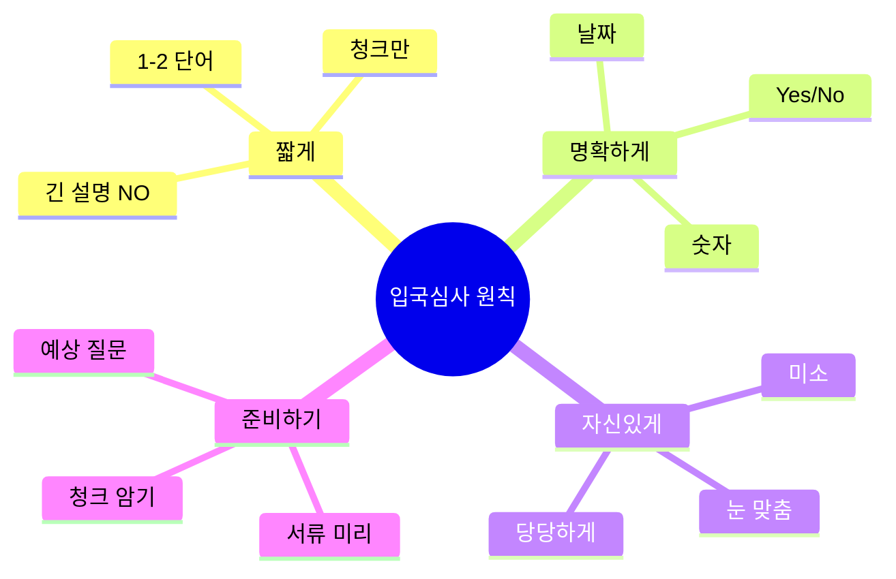
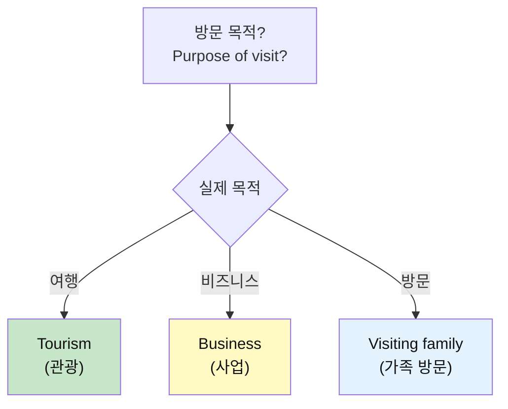
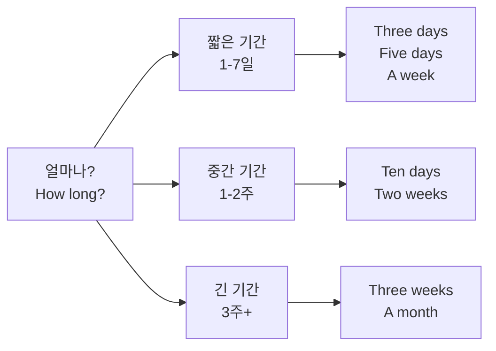
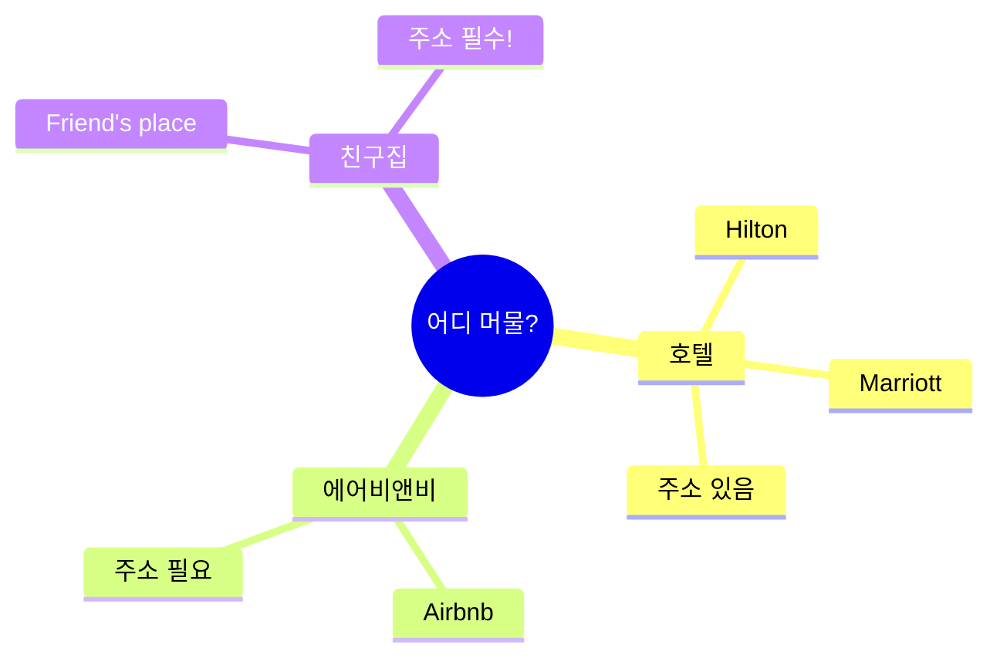
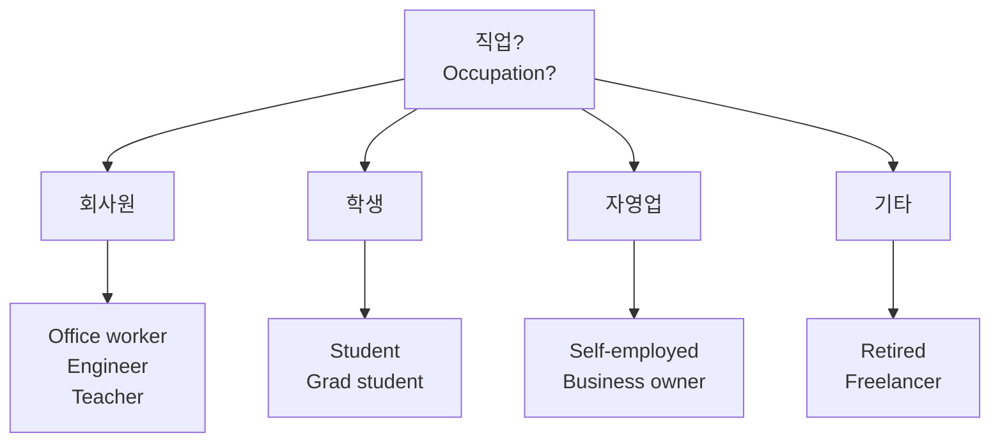

# 🛂 입국심사 청크 실전 가이드
## 긴장 없이 통과하는 청크 마스터

---

## 🎯 이 가이드의 목표

### 입국심사 = 가장 긴장되는 순간!

```
❌ 흔한 실수:
"음... I'm here for... tourism... 
and... I will stay... 7 days..."
→ 느림, 긴장, 불안

✅ 청크로 말하면:
"Tourism. Seven days."
→ 빠름, 명확, 자신감!

💡 핵심: 입국심사는 짧고 명확하게!
```

### 🏆 학습 목표

```
✅ 입국심사 필수 청크 15개 마스터
✅ 3단계 응용 (캐주얼/표준/정중)
✅ 예상 질문 100% 대응 가능
✅ 1초 안에 자동 반응
✅ 긴장 0%, 자신감 100%!
```

---

## 📋 목차

1. [입국심사 청크 핵심 원칙](#입국심사-청크-핵심-원칙)
2. [필수 청크 마스터](#필수-청크-마스터)
3. [질문별 청크 대응](#질문별-청크-대응)
4. [위험 상황 청크](#위험-상황-청크)
5. [실전 시뮬레이션](#실전-시뮬레이션)

---

## 입국심사 청크 핵심 원칙

### 💡 입국심사 = 짧고 명확하게!



### ⚠️ 절대 규칙

```
DO (해야 할 것):
✅ 짧은 청크로 답변
✅ 명확한 정보
✅ 서류 미리 준비
✅ 자신감 있게
✅ 눈 맞춤

DON'T (하지 말아야 할 것):
❌ 긴 설명
❌ 농담
❌ 불필요한 정보
❌ 거짓말
❌ 긴장한 표정
```

---

## 필수 청크 마스터

### 🔹 목적 청크 (Purpose)



#### 청크 1: Tourism (관광) ⭐ 가장 많이 사용

**3단계 시스템:**

| 단계 | 청크 | 상황 | 느낌 |
|:---:|------|------|------|
| **1단계** | "Tourism." | 간단 명료 | 👍 추천 |
| **2단계** | "Tourism, sightseeing." | 조금 더 설명 | 👍 좋음 |
| **3단계** | "I'm here for tourism." | 완전한 문장 | 👍 안전 |

**💡 추천:** 1단계 "Tourism." 이 가장 좋음!

**실전 대화:**
```
심사관: "Purpose of visit?"
당신: "Tourism."
심사관: "How long?"
당신: "Seven days."
→ 완벽! 짧고 명확!
```

#### 청크 2: Business (사업)

**3단계:**

| 단계 | 청크 | 설명 |
|:---:|------|------|
| 1단계 | "Business." | 간단 |
| 2단계 | "Business meeting." | 회의 |
| 3단계 | "I'm here for a business meeting." | 완전 |

**필수 추가 청크:**
- "Conference" (컨퍼런스)
- "Trade show" (무역 박람회)
- "Client meeting" (고객 미팅)

#### 청크 3: Visiting family/friends (방문)

**3단계:**

| 단계 | 청크 |
|:---:|------|
| 1단계 | "Visiting family." |
| 2단계 | "Visiting my cousin." |
| 3단계 | "I'm visiting my cousin who lives here." |

---

### 🔹 기간 청크 (Duration)



#### 숫자 청크 (중요!)

**3단계:**

| 기간 | 1단계 (추천!) | 2단계 | 3단계 |
|------|-------------|------|------|
| 3일 | "Three days." | "Three days." | "I'm staying three days." |
| 1주 | "A week." | "One week." | "I'm staying for a week." |
| 10일 | "Ten days." | "Ten days." | "I'm staying ten days." |
| 2주 | "Two weeks." | "Two weeks." | "I'm staying two weeks." |

**💡 핵심:** 숫자만 명확하게!

**발음 주의:**
- Three (쓰리) - 혀를 내밀고
- Days (데이즈) - 복수 s
- Week (위크) - 길게

---

### 🔹 체류지 청크 (Accommodation)



#### 청크 4: Hotel (호텔)

**3단계:**

| 단계 | 청크 | 예시 |
|:---:|------|------|
| 1단계 | "Hilton Hotel." | 호텔명만 |
| 2단계 | "Hilton, downtown." | 위치 추가 |
| 3단계 | "I'm staying at the Hilton downtown." | 완전 |

**💡 팁:** 호텔 예약 확인서 준비!

#### 청크 5: Airbnb

**3단계:**

| 단계 | 청크 |
|:---:|------|
| 1단계 | "Airbnb." |
| 2단계 | "Airbnb in Brooklyn." |
| 3단계 | "I'm staying at an Airbnb in Brooklyn." |

**⚠️ 주의:** 주소 꼭 준비!

#### 청크 6: Friend's place

**3단계:**

| 단계 | 청크 |
|:---:|------|
| 1단계 | "Friend's place." |
| 2단계 | "Staying with a friend." |
| 3단계 | "I'm staying with my friend in Queens." |

**⚠️ 중요:** 친구 전화번호 & 주소 필수!

---

### 🔹 직업 청크 (Occupation)



#### 청크 7: 직업 표현

**일반 직업 청크:**

| 직업 | 1단계 청크 | 2단계 청크 |
|------|-----------|-----------|
| 회사원 | "Office worker." | "I work at Samsung." |
| 엔지니어 | "Engineer." | "Software engineer." |
| 교사 | "Teacher." | "High school teacher." |
| 학생 | "Student." | "University student." |
| 자영업 | "Self-employed." | "I run a business." |
| 은퇴 | "Retired." | "Retired teacher." |

**💡 추천:** 1단계만 써도 충분!

---

## 질문별 청크 대응

### 📌 TOP 10 예상 질문 & 청크

#### Q1: "Purpose of visit?" (목적?)

```
✅ 최고 답변: "Tourism." (1초)

다른 옵션:
- "Vacation." (휴가)
- "Sightseeing." (관광)
- "Business." (사업)

❌ 나쁜 답변:
"Um... I'm here because I want to see 
New York and visit museums and..."
→ 너무 김!
```

#### Q2: "How long are you staying?" (기간?)

```
✅ 최고 답변: "Seven days." (1초)

다른 옵션:
- "A week." (1주)
- "Ten days." (10일)
- "Two weeks." (2주)

💡 발음 주의: Seven (세븐)
```

#### Q3: "Where are you staying?" (숙소?)

```
✅ 최고 답변: "Hilton Hotel." (1초)

다른 옵션:
- "Marriott, Manhattan."
- "Airbnb in Brooklyn."
- "Friend's place."

⚠️ 주소 물어보면: 종이 보여주기!
```

#### Q4: "Is this your first time?" (첫 방문?)

```
✅ 답변 청크:

첫 방문:
"Yes, first time." 또는 "First time."

재방문:
"No, second time." 또는 "Third time."

💡 추가: "Love it here!" (재방문 시)
```

#### Q5: "What do you do?" (직업?)

```
✅ 답변 청크:

회사원:
"Office worker." 또는 "I work at Samsung."

학생:
"Student." 또는 "University student."

자영업:
"Self-employed." 또는 "Business owner."

💡 짧게만!
```

#### Q6: "Do you have a return ticket?" (왕복 티켓?)

```
✅ 답변 청크:

"Yes." + 티켓 보여주기

또는:
"Yes, here." (종이 주면서)

❌ 긴 설명 NO!
```

#### Q7: "How much money do you have?" (돈?)

```
✅ 답변 청크:

카드:
"Credit cards." (카드 보여주기)

현금:
"About 2,000 dollars."

둘 다:
"Cards and some cash."

💡 구체적 금액보다 "충분히 있다" 느낌!
```

#### Q8: "Who are you traveling with?" (동행?)

```
✅ 답변 청크:

혼자:
"By myself." 또는 "Solo."

친구:
"With friends." 또는 "With two friends."

가족:
"With family." 또는 "With my wife."

💡 간단하게!
```

#### Q9: "What will you do here?" (뭐 할 거?)

```
✅ 답변 청크:

관광:
"Sightseeing." 또는 "Tourist stuff."

구체적:
"Visit museums." 또는 "See Times Square."

비즈니스:
"Meetings." 또는 "Conference."

💡 1-2개만 언급!
```

#### Q10: "Do you have family here?" (가족 있나?)

```
✅ 답변 청크:

없음:
"No." (끝!)

있음:
"Yes, my cousin." (간단)

⚠️ 있다고 하면 질문 더 많아짐!
   없으면 그냥 "No."
```

---

## 위험 상황 청크

### 🚨 예상치 못한 질문

#### 상황 1: 더 자세히 물어볼 때

```
심사관: "What's the address of your hotel?"

대응 청크:
1단계: "Here." (종이 보여주기) ⭐
2단계: "I have it here."
3단계: "Let me show you." (종이 꺼내며)

💡 말보다 서류가 최고!
```

#### 상황 2: 못 알아들었을 때

```
대응 청크:

1단계: "Sorry?" (다시 물어보기) ⭐
2단계: "Pardon?"
3단계: "Could you repeat that?"

❌ 절대 NO:
- "What?" (무례함)
- 추측해서 대답
- 침묵

✅ 꼭 확인하고 대답!
```

#### 상황 3: 긴장해서 말이 안 나올 때

```
대응 전략:

1. 깊게 숨쉬기
2. 서류 보면서 답변
3. 짧은 청크만!

예:
"Tourism. Seven days. Hilton Hotel."
→ 최소한의 정보만 명확하게!
```

---

## 실전 시뮬레이션

### 🎬 시나리오 1: 순조로운 입국심사 (90%)

```
심사관: "Passport, please."
당신: (건네기) "Here you go."

심사관: "Purpose of visit?"
당신: "Tourism." 
       ↑ 1초 반응!

심사관: "How long?"
당신: "Seven days."
       ↑ 명확!

심사관: "Where are you staying?"
당신: "Hilton Hotel, Manhattan."
       ↑ 구체적!

심사관: "First time in the US?"
당신: "Yes, first time."
       ↑ 간단!

심사관: "Enjoy your stay."
당신: "Thank you!"
       ↑ 미소!

⏱️ 소요 시간: 30초
✅ 결과: 완벽 통과!
```

### 🎬 시나리오 2: 질문 많은 경우 (9%)

```
심사관: "Purpose?"
당신: "Tourism."

심사관: "What will you do?"
당신: "Sightseeing. Visit museums."
       ↑ 1-2개만!

심사관: "Who are you traveling with?"
당신: "By myself."
       ↑ 솔직하게!

심사관: "Do you have a return ticket?"
당신: "Yes." (티켓 보여주기)
       ↑ 서류가 답!

심사관: "Where do you work?"
당신: "Office worker. I work at Samsung."
       ↑ 구체적!

심사관: "How much money do you have?"
당신: "Credit cards and some cash."
       ↑ 충분히 있다는 느낌!

심사관: "What's your hotel address?"
당신: "Here." (예약 확인서 보여주기)
       ↑ 말보다 서류!

심사관: "Okay, enjoy."
당신: "Thanks!"

⏱️ 소요 시간: 2분
✅ 결과: 통과!
💡 팁: 당황하지 말고 짧게 답변!
```

### 🎬 시나리오 3: 비즈니스 (특수)

```
심사관: "Purpose?"
당신: "Business."

심사관: "What kind of business?"
당신: "Conference. Tech conference."
       ↑ 구체적!

심사관: "How long?"
당신: "Five days."

심사관: "Do you have an invitation?"
당신: "Yes, here." (초대장 보여주기)
       ↑ 서류 필수!

심사관: "Where will you stay?"
당신: "Marriott, near the conference center."

심사관: "Okay, good luck with your conference."
당신: "Thank you!"

✅ 결과: 통과!
💡 비즈니스는 서류가 핵심!
```

---

## 📝 준비 체크리스트

### 출발 전 준비 (필수!)

```
서류 준비:
□ 여권 (유효기간 6개월 이상)
□ 왕복 항공권
□ 호텔 예약 확인서 (주소 포함)
□ 여행자 보험
□ ESTA 승인서 (미국)

청크 준비:
□ 목적 청크 암기 (Tourism)
□ 기간 청크 암기 (Seven days)
□ 숙소 청크 암기 (Hilton Hotel)
□ 직업 청크 암기 (Office worker)
□ 예상 질문 10개 연습

멘탈 준비:
□ 긴장하지 않기
□ 자신감 갖기
□ 미소 짓기
□ 눈 맞춤하기
```

---

## 🏆 입국심사 청크 마스터 체크

### 최종 체크리스트

```
필수 청크 (10개):
□ Tourism (목적)
□ Seven days (기간)
□ Hilton Hotel (숙소)
□ Office worker (직업)
□ Yes, first time (첫 방문)
□ By myself (동행)
□ Sightseeing (활동)
□ Credit cards (돈)
□ Here you go (서류 건넬 때)
□ Thank you (마지막)

반응 속도:
□ 1초 안에 답변 가능
□ 서류 즉시 꺼낼 수 있음
□ 당황하지 않음

자신감:
□ 눈 맞춤 OK
□ 미소 OK
□ 명확한 발음
□ 긴장 0%

✅ 모두 체크되면 준비 완료!
```

---

## 💡 최종 팁

### 입국심사 황금 규칙

```
1. 짧게 (Short)
   - 1-3 단어 청크
   - 긴 설명 NO

2. 명확하게 (Clear)
   - Yes/No
   - 숫자
   - 구체적 정보

3. 자신있게 (Confident)
   - 눈 맞춤
   - 미소
   - 당당하게

4. 준비하기 (Prepared)
   - 서류 미리
   - 청크 암기
   - 시뮬레이션

5. 솔직하게 (Honest)
   - 거짓말 NO
   - 일관성 유지
   - 서류와 일치
```

### 🎯 기억하세요!

```
입국심사는 시험이 아닙니다!

단지 확인하는 것:
✅ 왜 왔나?
✅ 얼마나 있나?
✅ 어디 머무나?
✅ 돌아가나?

청크로 답하면 끝! 🎉
```

---

**입국심사 청크 마스터 완료! 자신감 100%! 🛂✈️**

> "짧게, 명확하게, 자신있게!"
> 
> Short, Clear, Confident!

**Last Updated: 2026-01-11**

