# 🙏 감사·응답·동의 표현 완벽 체계
## 자연스러운 대화의 핵심

---

## 📋 목차
1. [감사 표현 완전 분석](#감사-표현-완전-분석)
2. [응답 표현 마스터](#응답-표현-마스터)
3. [동의 표현 가이드](#동의-표현-가이드)
4. [거절 표현 노하우](#거절-표현-노하우)
5. [상황별 조합 활용](#상황별-조합-활용)

---

## 전체 구조 마인드맵

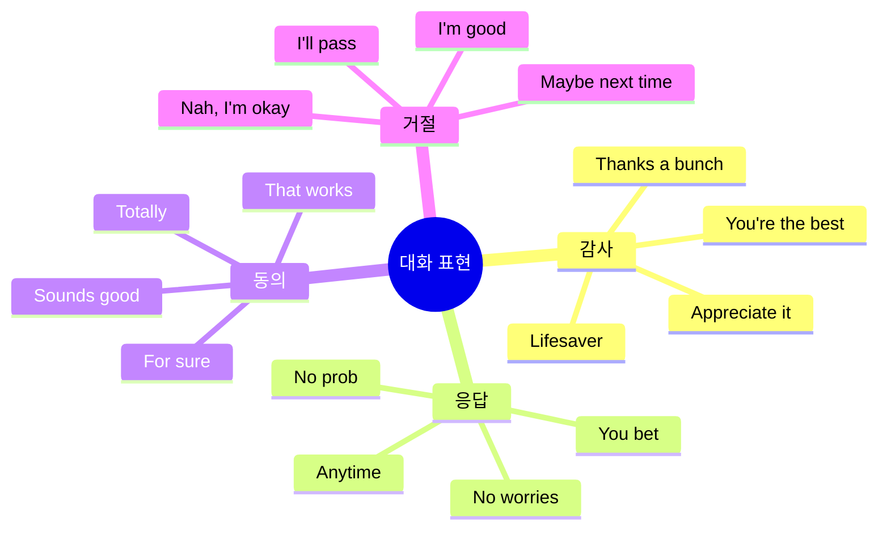

---

## 감사 표현 완전 분석

### 레벨별 감사 표현

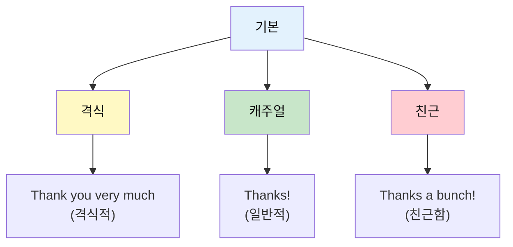

---

## 1️⃣ Thanks / Thank you

### 📖 기본 정보

| 항목 | 내용 |
|------|------|
| **표현** | Thanks / Thank you |
| **발음** | 땡스 / 땡큐 |
| **한국어** | 고마워요 / 감사합니다 |
| **격식도** | 중립 ~ 격식 |
| **사용 빈도** | ⭐⭐⭐⭐⭐ |

### 🎯 뉘앙스 차이

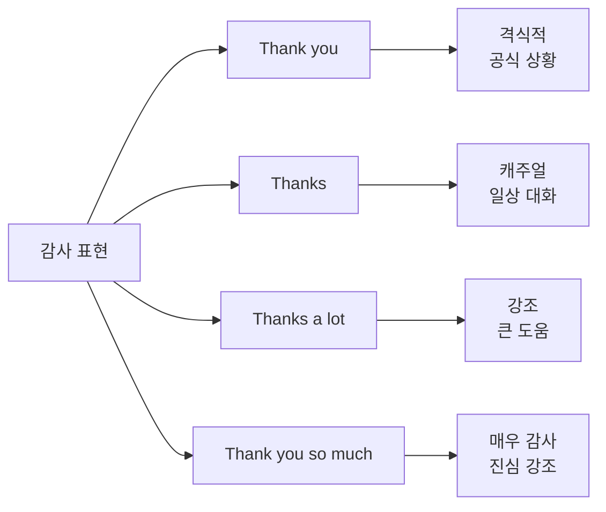

| 표현 | 격식도 | 상황 | 예시 |
|------|:-----:|------|------|
| Thank you | ★★★★ | 공식, 격식 | 입국심사, 호텔 |
| Thanks | ★★ | 일상, 캐주얼 | 카페, 친구 |
| Thanks a lot | ★★★ | 강조, 진심 | 큰 도움 받았을 때 |
| Thank you so much | ★★★★ | 매우 감사 | 특별한 도움 |

### 💬 실전 예문

```
기본 상황:
✅ Thanks! (땡스!)
   → 고마워요! (가장 일반적)

격식 상황:
✅ Thank you for your help.
   (땡큐 포 유어 헬프)
   → 도와주셔서 감사합니다.

강조 상황:
✅ Thanks a lot! Really appreciate it!
   (땡스 어 랏! 리얼리 어프리시에잇 잇!)
   → 정말 고마워요! 감사합니다!
```

---

## 2️⃣ Thanks a bunch

### 📖 기본 정보

| 항목 | 내용 |
|------|------|
| **표현** | Thanks a bunch |
| **발음** | 땡스 어 번치 |
| **한국어** | 정말 고마워요 |
| **격식도** | 캐주얼 (친근함) |
| **사용 빈도** | ⭐⭐⭐⭐ |

### 🎯 의미와 뉘앙스

#### 핵심 포인트
- **"bunch"** = 다발, 묶음 → "한 묶음만큼 고맙다"는 뜻
- **친근하고 따뜻한** 느낌
- **미국식** 표현 (영국에서는 "Cheers" 더 많이 사용)

### 💬 실전 예문

```
여행 상황:
✈️ 공항: "Thanks a bunch for the upgrade!"
         (업그레이드해주셔서 정말 고마워요!)

🏨 호텔: "Thanks a bunch! You've been so helpful!"
         (정말 고마워요! 너무 도움이 됐어요!)

🍽️ 식당: "Thanks a bunch! The food was great!"
         (정말 고마워요! 음식 정말 맛있었어요!)
```

### ✨ 비슷한 표현들

```
같은 뉘앙스:
✅ Thanks a ton (땡스 어 턴) - "엄청 고마워요"
✅ Thanks a million (땡스 어 밀리언) - "백만 번 고마워요"
✅ Thanks so much (땡스 쏘 머치) - "정말 고마워요"
```

---

## 3️⃣ Appreciate it

### 📖 기본 정보

| 항목 | 내용 |
|------|------|
| **표현** | Appreciate it / I appreciate it |
| **발음** | 어프리시에잇 잇 / 아이 어프리시에잇 잇 |
| **한국어** | 감사합니다 / 고맙습니다 |
| **격식도** | 중립 ~ 격식 |
| **사용 빈도** | ⭐⭐⭐⭐ |

### 🎯 의미와 뉘앙스

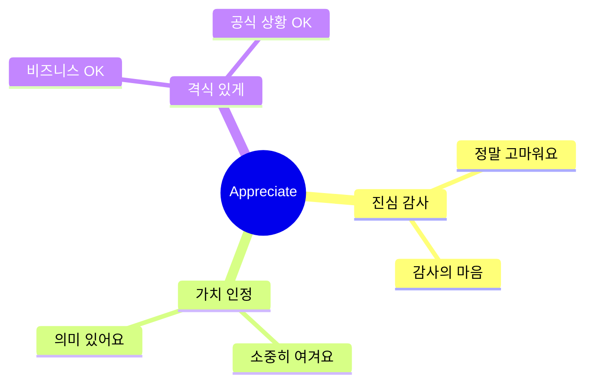

#### 핵심 포인트
- **"thanks"보다 진중한** 느낌
- **진심을 더 강조**
- **비즈니스 상황**에도 적합

### 💬 실전 예문

```
일반 상황:
✅ I really appreciate it.
   (아이 리얼리 어프리시에잇 잇)
   → 정말 감사합니다.

✅ Appreciate your help!
   (어프리시에잇 유어 헬프!)
   → 도와주셔서 감사해요!

비즈니스:
✅ I appreciate your time.
   (아이 어프리시에잇 유어 타임)
   → 시간 내주셔서 감사합니다.
```

---

## 4️⃣ You're a lifesaver / You're the best

### 📖 기본 정보

| 표현 | 발음 | 의미 | 상황 |
|------|------|------|------|
| **You're a lifesaver** | 유얼 어 라이프세이버 | 생명의 은인이에요! | 큰 도움 |
| **You're the best** | 유얼 더 베스트 | 최고예요! | 감탄/칭찬 |
| **You're awesome** | 유얼 어썸 | 멋져요! | 친근한 칭찬 |

### 🎯 사용 상황

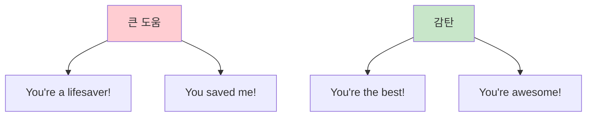

### 💬 실전 예문

```
긴급 상황:
✅ You're a lifesaver! My phone was dying.
   (유얼 어 라이프세이버! 마이 폰 워즈 다잉)
   → 생명의 은인이에요! 폰이 꺼지고 있었어요.

칭찬 상황:
✅ You're the best! Thanks for everything!
   (유얼 더 베스트! 땡스 포 에브리씽!)
   → 최고예요! 모든 것에 감사해요!

도움 받았을 때:
✅ You're awesome! I couldn't have done it without you.
   (유얼 어썸! 아이 쿠든트 해브 던 잇 위다웃 유)
   → 멋져요! 당신 없었으면 못 했을 거예요.
```

---

## 응답 표현 마스터

### 응답 표현 전체 구조

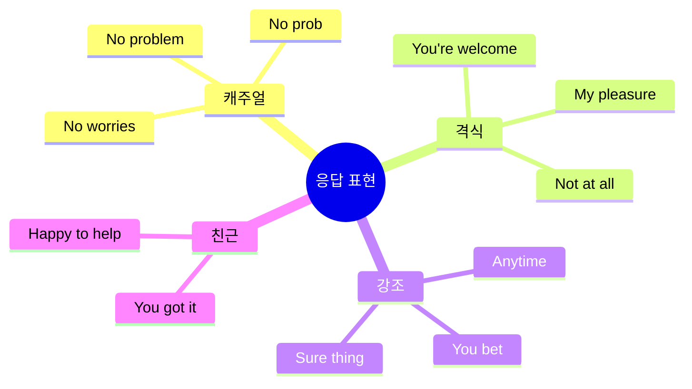

---

## 5️⃣ No worries

### 📖 기본 정보

| 항목 | 내용 |
|------|------|
| **표현** | No worries |
| **발음** | 노 워리스 |
| **한국어** | 걱정 마세요 / 괜찮아요 / 천만에요 |
| **격식도** | 캐주얼 (매우 자연스러움) |
| **사용 빈도** | ⭐⭐⭐⭐⭐ (가장 많이 사용) |

### 🎯 의미와 뉘앙스

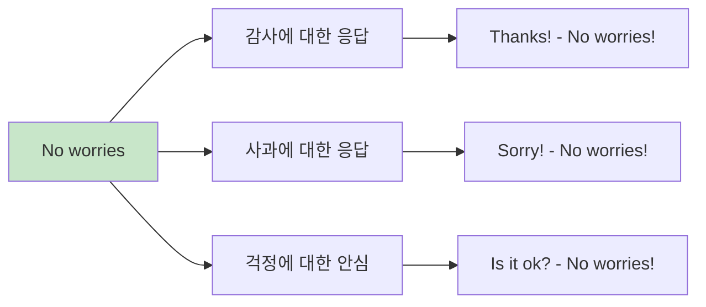

#### 언제 사용하나?

| 상황 | 예시 대화 |
|------|----------|
| **감사 받을 때** | "Thanks!" → "No worries!" |
| **사과 받을 때** | "Sorry I'm late." → "No worries!" |
| **걱정할 때** | "Is this okay?" → "No worries, it's fine!" |

### 💬 실전 예문

```
상황 1: 감사 응답
A: "Thanks for helping me!"
B: "No worries! Happy to help!"
   → 걱정 마세요! 기꺼이 도와드려요!

상황 2: 사과 응답
A: "Sorry, I spilled water."
B: "No worries! Accidents happen."
   → 괜찮아요! 실수는 누구나 하죠.

상황 3: 안심시키기
A: "Is it okay if I sit here?"
B: "No worries! Go ahead!"
   → 괜찮아요! 앉으세요!
```

### ⭐ 왜 이렇게 많이 쓰이나?

1. **다용도** - 거의 모든 상황에 사용 가능
2. **친근함** - 부담 없고 편안한 느낌
3. **현대적** - 젊은 세대가 선호
4. **자연스러움** - "You're welcome"보다 덜 격식적

---

## 6️⃣ No prob / No problem

### 📖 기본 정보

| 표현 | 발음 | 격식도 |
|------|------|:-----:|
| No problem | 노 프라블럼 | ★★★ |
| No prob | 노 프랍 | ★★ |

### 💬 실전 예문

```
✅ "Could you help me?" - "No problem!"
   (도와주실 수 있나요? - 문제없어요!)

✅ "Thanks!" - "No prob!"
   (고마워요! - 별거 아니에요!)
```

---

## 7️⃣ You bet / You got it

### 📖 기본 정보

| 표현 | 발음 | 의미 | 뉘앙스 |
|------|------|------|--------|
| **You bet** | 유 벳 | 물론이죠! | 강한 긍정 |
| **You got it** | 유 갓 잇 | 알겠어요! | 확인+동의 |

### 🎯 사용 구분

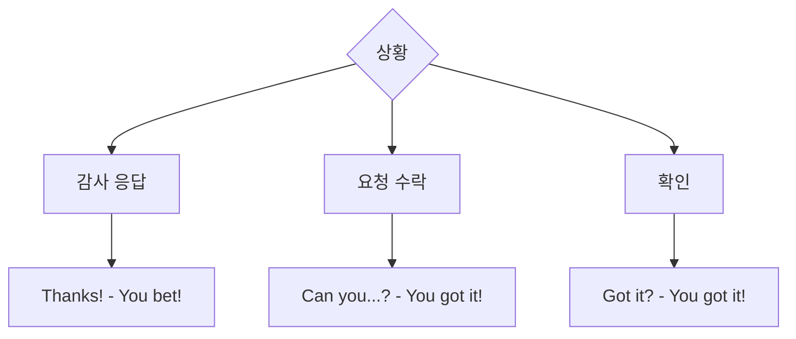

### 💬 실전 예문

```
You bet 사용:
✅ "Will you help me?" - "You bet!"
   (도와줄래? - 당연하지!)

✅ "Thanks for the ride!" - "You bet! Anytime!"
   (태워줘서 고마워! - 당연하지! 언제든지!)

You got it 사용:
✅ "Can I get a coffee?" - "You got it!"
   (커피 하나 주세요 - 알겠습니다!)

✅ "Two tickets, please." - "You got it! That's $50."
   (티켓 2장이요 - 알겠습니다! 50달러입니다)
```

---

## 8️⃣ Anytime / Sure thing

### 📖 기본 정보

| 표현 | 의미 | 상황 |
|------|------|------|
| **Anytime** | 언제든지요 | 도움 제공 후 |
| **Sure thing** | 물론이죠 | 요청 수락 |

### 💬 실전 예문

```
Anytime:
✅ "Thanks for your help!" - "Anytime! Just call me."
   (도와줘서 고마워! - 언제든지요! 전화하세요)

Sure thing:
✅ "Can you pass the salt?" - "Sure thing!"
   (소금 좀 줄래? - 물론이죠!)
```

---

## 동의 표현 가이드

### 동의 강도별 분류

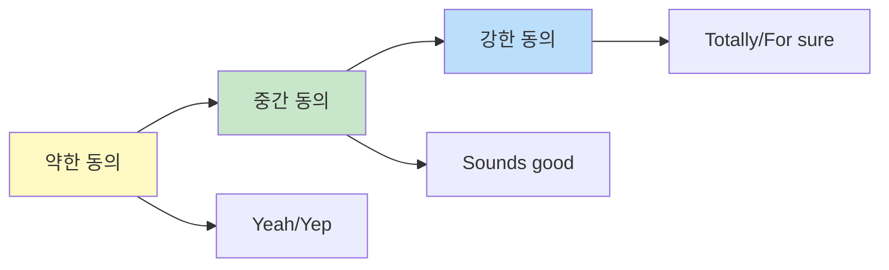

---

## 9️⃣ For sure / Totally

### 📖 기본 정보

| 표현 | 발음 | 의미 | 강도 |
|------|------|------|:----:|
| **For sure** | 포 슈어 | 확실히 / 당연하죠 | ★★★★ |
| **Totally** | 토털리 | 완전히 / 정말 | ★★★★★ |

### 💬 실전 예문

```
For sure:
✅ "Can you help?" - "For sure!"
   (도와줄 수 있어? - 당연하지!)

✅ "Is this good?" - "For sure, it's perfect!"
   (이거 괜찮아? - 당연하지, 완벽해!)

Totally:
✅ "Do you agree?" - "Totally!"
   (동의해? - 완전히!)

✅ "This is amazing!" - "Totally agree!"
   (이거 대단해! - 완전 동의!)
```

---

## 🔟 Sounds good / That works

### 📖 기본 정보

| 표현 | 의미 | 사용 상황 |
|------|------|----------|
| **Sounds good** | 좋아요 / 좋네요 | 제안 받을 때 |
| **That works** | 그게 좋겠네요 | 계획/시간 조율 |

### 💬 실전 예문

```
Sounds good:
✅ "Let's meet at 7?" - "Sounds good!"
   (7시에 만날까? - 좋아!)

That works:
✅ "How about Tuesday?" - "That works for me!"
   (화요일은 어때? - 그게 좋겠네요!)
```

---

## 거절 표현 노하우

### 공손한 거절 단계

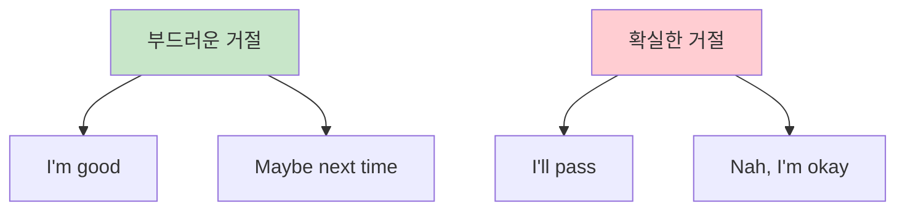

---

## 1️⃣1️⃣ I'm good

### 📖 기본 정보

| 항목 | 내용 |
|------|------|
| **표현** | I'm good |
| **발음** | 아임 굿 |
| **한국어** | 괜찮아요 / 됐어요 |
| **용도** | 부드러운 거절 |
| **사용 빈도** | ⭐⭐⭐⭐⭐ |

### 🎯 의미와 뉘앙스

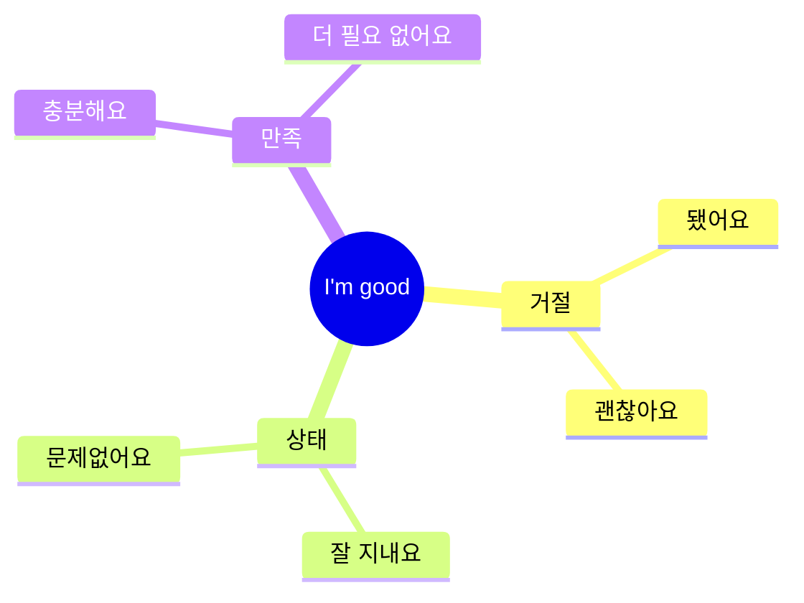

### 💬 실전 예문

```
음식/음료 거절:
✅ "Want some more?" - "I'm good, thanks!"
   (더 드실래요? - 괜찮아요, 고마워요!)

도움 거절:
✅ "Need help?" - "I'm good, I got it!"
   (도움 필요해? - 괜찮아요, 할 수 있어요!)

제안 거절:
✅ "Wanna go out?" - "I'm good, kinda tired."
   (나갈래? - 괜찮아요, 좀 피곤해요)
```

### ⚠️ 주의사항

```
❌ "I'm good"만 말하면 무뚝뚝할 수 있음!

✅ "I'm good, thanks!" (더 친근함)
✅ "I'm good for now, thanks!" (지금은 괜찮다는 뉘앙스)
```

---

## 상황별 조합 활용

### 완벽한 대화 플로우

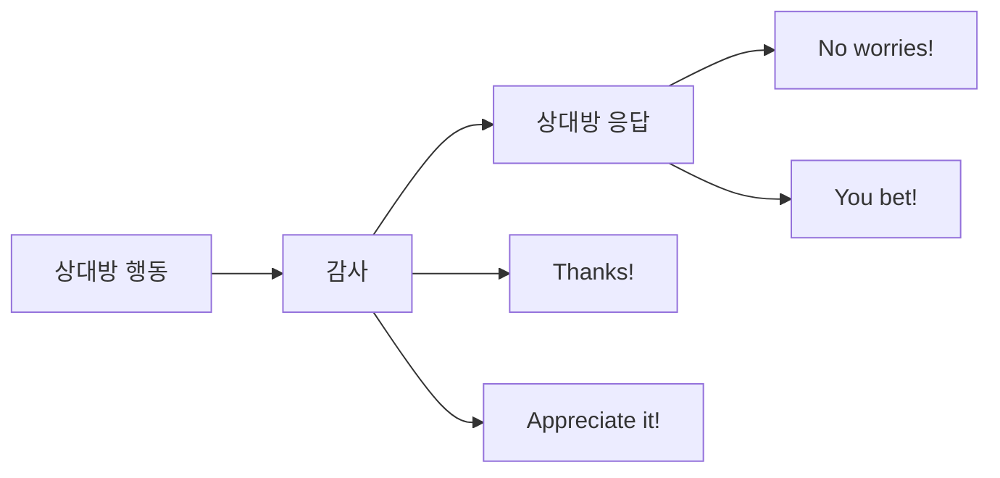

### 상황별 베스트 조합

#### 🏨 호텔 체크인

```
직원: "Here's your key, room 812."
손님: "Thanks a bunch!"
직원: "No worries! Enjoy your stay!"
손님: "Appreciate it!"

해석:
직원: 여기 열쇠 있습니다, 812호입니다.
손님: 정말 고마워요!
직원: 천만에요! 즐거운 시간 보내세요!
손님: 감사합니다!
```

#### ✈️ 공항

```
승객: "Could I get a window seat?"
직원: "Lemme check... Yeah, got one!"
승객: "Awesome! Thanks so much!"
직원: "You bet! Have a good flight!"

해석:
승객: 창가 자리로 받을 수 있을까요?
직원: 확인해볼게요... 네, 있네요!
승객: 좋아요! 정말 감사합니다!
직원: 당연하죠! 좋은 여행 되세요!
```

#### 🍽️ 식당

```
서버: "Here's your order. Anything else?"
손님: "I'm good, thanks!"
서버: "Perfect! Enjoy!"
손님: "Thanks!"

해석:
서버: 주문하신 음식입니다. 더 필요한 거 있나요?
손님: 괜찮아요, 고마워요!
서버: 완벽해요! 맛있게 드세요!
손님: 고마워요!
```

---

## 📊 표현 비교 총정리

### 감사 표현 비교

| 표현 | 격식도 | 친근도 | 상황 | 추천도 |
|------|:-----:|:-----:|------|:-----:|
| Thank you | ★★★★ | ★★ | 공식/격식 | ⭐⭐⭐⭐ |
| Thanks | ★★ | ★★★★ | 일상 | ⭐⭐⭐⭐⭐ |
| Thanks a bunch | ★★ | ★★★★★ | 캐주얼 | ⭐⭐⭐⭐ |
| Appreciate it | ★★★ | ★★★ | 진심 | ⭐⭐⭐⭐ |
| You're the best | ★ | ★★★★★ | 친구 | ⭐⭐⭐ |

### 응답 표현 비교

| 표현 | 격식도 | 친근도 | 상황 | 추천도 |
|------|:-----:|:-----:|------|:-----:|
| You're welcome | ★★★★ | ★★ | 격식 | ⭐⭐⭐ |
| No worries | ★★ | ★★★★★ | 캐주얼 | ⭐⭐⭐⭐⭐ |
| No problem | ★★★ | ★★★★ | 일반 | ⭐⭐⭐⭐ |
| You bet | ★★ | ★★★★ | 긍정적 | ⭐⭐⭐⭐ |
| Anytime | ★★ | ★★★★ | 친근 | ⭐⭐⭐⭐ |

---

## 연습 문제

### 문제 1: 상황에 맞는 표현 선택

```
1. 친구가 도와줬을 때:
   a) Thank you very much.
   b) Thanks a bunch!
   c) I appreciate your assistance.
   
2. 호텔 직원이 감사 인사를 할 때:
   a) Yeah, whatever.
   b) No worries!
   c) Okay.
   
3. 레스토랑에서 더 필요한지 물을 때:
   a) No!
   b) I'm good, thanks!
   c) Go away.
```

<details>
<summary>정답 보기</summary>

1. **b) Thanks a bunch!** - 친구한테는 친근한 표현이 자연스러움
2. **b) No worries!** - 캐주얼하면서도 친절한 응답
3. **b) I'm good, thanks!** - 공손하게 거절하는 완벽한 표현

</details>

### 문제 2: 대화 완성하기

```
상황: 공항에서 좌석 업그레이드를 받았습니다.

직원: "I upgraded you to business class."
나: "________!"
직원: "________! Enjoy the flight!"

a) Wow, thanks a bunch / No worries
b) Okay / Sure
c) Really / Yes
```

<details>
<summary>정답 보기</summary>

**a) Wow, thanks a bunch / No worries**

완성된 대화:
직원: "I upgraded you to business class."
나: "Wow, thanks a bunch!"
직원: "No worries! Enjoy the flight!"

</details>

---

## 핵심 정리

### ✅ 반드시 외울 TOP 5

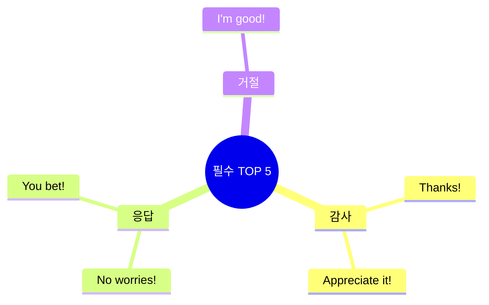

1. **Thanks!** - 가장 기본적인 감사
2. **No worries!** - 가장 자연스러운 응답
3. **Appreciate it!** - 진심 어린 감사
4. **You bet!** - 긍정적인 응답
5. **I'm good!** - 부드러운 거절

### 🎯 상황별 베스트 표현

| 상황 | 1순위 | 2순위 | 3순위 |
|------|-------|-------|-------|
| **캐주얼 감사** | Thanks! | Thanks a bunch! | Appreciate it! |
| **격식 감사** | Thank you | I appreciate it | Thank you so much |
| **일반 응답** | No worries! | No problem! | You're welcome |
| **강한 동의** | For sure! | Totally! | You bet! |
| **부드러운 거절** | I'm good! | Maybe next time | I'll pass |

---

## 📚 다음 학습 단계

이제 기초 표현을 마스터했다면:
- 👉 [공항 체크인 표현 분석](../공항_기내/04_공항_체크인_표현_분석.md)
- 👉 [호텔 숙박 표현 분석](../숙박_식사/07_호텔_숙박_표현_분석.md)

---

## 학습 체크리스트

- [ ] 감사 표현 5가지 완벽히 숙지
- [ ] 응답 표현 5가지 완벽히 숙지
- [ ] 동의 표현 3가지 완벽히 숙지
- [ ] 거절 표현 2가지 완벽히 숙지
- [ ] 상황별 조합 연습 완료
- [ ] 연습 문제 80% 이상 정답

---

*이 표현들만 완벽히 익혀도 자연스러운 대화의 50%는 해결됩니다!*

---

## 🎯 전설의 10턴 대화 마스터

### 상황 1: 택시 기사와의 대화 (감사 & 응답)

```
턴 1 - 손님: "Hey! Can you take me to the airport?"
턴 2 - 기사: "For sure! Hop in!"
턴 3 - 손님: "Thanks a bunch! How long you think?"
턴 4 - 기사: "Maybe 30 minutes? Traffic's not bad."
턴 5 - 손님: "Perfect! You're a lifesaver. I was worried I'd be late."
턴 6 - 기사: "No worries! We got plenty of time."
턴 7 - 손님: "Appreciate it! First time here, so I'm kinda lost."
턴 8 - 기사: "Totally normal! Where you from?"
턴 9 - 손님: "Korea. Seoul."
턴 10 - 기사: "Nice! Well, you bet I'll get you there safe. Enjoy your trip!"

🇰🇷 한국어 번역:
턴 1 - 손님: 안녕하세요! 공항까지 태워주실 수 있나요?
턴 2 - 기사: 물론이죠! 타세요!
턴 3 - 손님: 정말 감사합니다! 얼마나 걸릴 것 같아요?
턴 4 - 기사: 30분쯤요? 교통이 안 막혀요.
턴 5 - 손님: 완벽해요! 생명의 은인이에요. 늦을까 걱정했어요.
턴 6 - 기사: 걱정 마세요! 시간 충분해요.
턴 7 - 손님: 감사합니다! 여기 처음이라 좀 헷갈려요.
턴 8 - 기사: 완전 정상이에요! 어디서 오셨어요?
턴 9 - 손님: 한국이요. 서울.
턴 10 - 기사: 좋네요! 안전하게 모셔다드릴게요. 좋은 여행 되세요!

📝 사용된 표현:
• Thanks a bunch! (진심 어린 감사)
• You're a lifesaver (큰 도움에 감사)
• No worries (걱정 마세요)
• Appreciate it (감사합니다)
• For sure (당연하죠)
• You bet (당연히)
• Totally (완전히 동의)
```

### 상황 2: 카페에서의 주문 (감사 & 동의)

```
턴 1 - 손님: "Hey! Can I get a large latte?"
턴 2 - 바리스타: "You got it! For here or to go?"
턴 3 - 손님: "To go, please. Thanks!"
턴 4 - 바리스타: "No prob! That'll be $5.50."
턴 5 - 손님: "Sounds good! Here's my card."
턴 6 - 바리스타: "Perfect. It'll be ready in a sec."
턴 7 - 손님: "Awesome! Can I get a receipt?"
턴 8 - 바리스타: "Sure thing! Here you go."
턴 9 - 손님: "Thanks so much! You're the best!"
턴 10 - 바리스타: "Anytime! Have a great day!"

🇰🇷 한국어 번역:
턴 1 - 손님: 안녕하세요! 라지 라떼 하나 주세요.
턴 2 - 바리스타: 알겠습니다! 여기서 드시나요 가져가시나요?
턴 3 - 손님: 가져갈게요. 감사합니다!
턴 4 - 바리스타: 문제없어요! 5.50달러예요.
턴 5 - 손님: 좋아요! 여기 카드요.
턴 6 - 바리스타: 완벽해요. 곧 준비될 거예요.
턴 7 - 손님: 좋아요! 영수증 받을 수 있나요?
턴 8 - 바리스타: 물론이죠! 여기요.
턴 9 - 손님: 정말 감사합니다! 최고예요!
턴 10 - 바리스타: 언제든지요! 좋은 하루 보내세요!

📝 사용된 표현:
• Thanks / Thanks so much (감사)
• You got it (알겠습니다)
• No prob (문제없어요)
• Sounds good (좋아요)
• Sure thing (물론이죠)
• You're the best (최고예요)
• Anytime (언제든지)
```

### 상황 3: 식당에서 음료 거절하기 (거절 & 응답)

```
턴 1 - 서버: "Hi! Can I start you with some drinks?"
턴 2 - 손님: "Just water for me, thanks!"
턴 3 - 서버: "Sure! Still or sparkling?"
턴 4 - 손님: "Still is fine. Appreciate it!"
턴 5 - 서버: "No worries! Want some bread while you wait?"
턴 6 - 손님: "I'm good for now, thanks though!"
턴 7 - 서버: "Cool! Lemme know when you're ready to order."
턴 8 - 손님: "Will do. Actually, what's good here?"
턴 9 - 서버: "The salmon's totally amazing! Our chef's special."
턴 10 - 손님: "That works for me! I'll have that then. Thanks!"

🇰🇷 한국어 번역:
턴 1 - 서버: 안녕하세요! 음료 먼저 주문하시겠어요?
턴 2 - 손님: 저는 물만요, 감사합니다!
턴 3 - 서버: 네! 일반 물인가요 탄산수인가요?
턴 4 - 손님: 일반 물이요. 감사합니다!
턴 5 - 서버: 괜찮아요! 기다리시는 동안 빵 드릴까요?
턴 6 - 손님: 지금은 괜찮아요, 그래도 감사합니다!
턴 7 - 서버: 알겠어요! 주문 준비되시면 말씀하세요.
턴 8 - 손님: 그럴게요. 사실, 여기 뭐가 맛있어요?
턴 9 - 서버: 연어가 정말 대단해요! 저희 셰프 특선이에요.
턴 10 - 손님: 그게 좋겠네요! 그걸로 할게요. 감사합니다!

📝 사용된 표현:
• Thanks / Appreciate it (감사)
• No worries (괜찮아요)
• I'm good (괜찮아요/됐어요) - 거절
• Thanks though (그래도 감사)
• Totally (완전히)
• That works for me (그게 좋겠네요)
```

---

## 📝 감사·응답·동의 표현 마스터 테스트

### 테스트 1: 상황별 적절한 표현 선택 (10문제)

```
각 상황에 가장 적절한 표현을 고르세요.

1. 친구가 점심을 사주었을 때:
   a) Thank you very much, sir.
   b) Thanks a bunch! You're the best!
   c) I appreciate your assistance.

2. 호텔 직원이 "Have a good stay"라고 말할 때:
   a) Okay.
   b) Yes.
   c) Thanks! You too!

3. 누군가 "Thanks for your help"라고 말할 때:
   a) No worries! Happy to help!
   b) It's okay.
   c) Yes.

4. 레스토랑에서 "Want more water?"라고 물을 때 (거절):
   a) No!
   b) I'm good, thanks!
   c) Don't want.

5. 친구가 "Let's meet at 7"라고 제안할 때 (동의):
   a) Okay, I guess.
   b) Sounds good!
   c) Maybe.

6. 직원이 도움을 준 후 "Anything else?"라고 물을 때:
   a) That's all. Appreciate your help!
   b) No more.
   c) Go away.

7. 택시 기사가 빠른 길로 갈 수 있다고 말할 때:
   a) Do it.
   b) For sure! That'd be great!
   c) If you want.

8. 바리스타가 "Your order's ready!"라고 말할 때:
   a) Give me.
   b) Awesome! Thanks!
   c) Finally.

9. 친구가 "This restaurant is amazing"라고 말할 때:
   a) Okay.
   b) Totally! The food's so good!
   c) Maybe.

10. 누군가 "Sorry for the wait"라고 사과할 때:
    a) No worries! No rush.
    b) You should be.
    c) Whatever.
```

<details>
<summary>✅ 정답 확인</summary>

1. **b) Thanks a bunch! You're the best!**  
   → 친구한테는 친근한 표현이 자연스러움

2. **c) Thanks! You too!**  
   → 직원에게도 친절하게 응답

3. **a) No worries! Happy to help!**  
   → 캐주얼하면서 친절한 응답

4. **b) I'm good, thanks!**  
   → 부드럽게 거절하는 완벽한 표현

5. **b) Sounds good!**  
   → 긍정적이고 동의하는 표현

6. **a) That's all. Appreciate your help!**  
   → 정중하고 감사 표현

7. **b) For sure! That'd be great!**  
   → 긍정적이고 동의하는 표현

8. **b) Awesome! Thanks!**  
   → 감사와 기쁨 표현

9. **b) Totally! The food's so good!**  
   → 강한 동의 표현

10. **a) No worries! No rush.**  
    → 이해하고 괜찮다는 표현

**점수:**
- 9-10개: 완벽! 🎉
- 7-8개: 훌륭해요! 👍
- 5-6개: 좋아요! 계속 연습하세요 📚
- 4개 이하: 다시 복습이 필요해요 💪

</details>

---

### 테스트 2: 대화 완성하기 (5문제)

```
빈칸에 적절한 감사/응답/동의 표현을 넣으세요.

대화 1: 호텔 체크인
직원: "Here's your room key."
손님: "_____________!"
직원: "_____________! Enjoy your stay."

대화 2: 택시
기사: "I'll take the highway. Faster."
손님: "_____________! How long you think?"
기사: "About 20 minutes."
손님: "_____________."

대화 3: 카페
바리스타: "Want whipped cream on top?"
손님: "_____________, _____________!"
바리스타: "_____________! Coming right up."
```

<details>
<summary>✅ 정답 확인 (모범 답안)</summary>

**대화 1: 호텔 체크인**
- 손님: "**Thanks!**" / "**Awesome!**" / "**Appreciate it!**"
- 직원: "**No worries!**" / "**You bet!**" / "**No problem!**"

**대화 2: 택시**
- 손님: "**For sure!**" / "**Sounds good!**" / "**Perfect!**"
- 손님: "**That works**" / "**Sounds good**" / "**Perfect**"

**대화 3: 카페**
- 손님: "**I'm good**" / "**Nah**" + "**thanks**" / "**thanks though**"
- 바리스타: "**No prob!**" / "**Cool!**" / "**You got it!**"

**채점 기준:**
- 문맥에 맞는 표현 사용
- 자연스러운 조합
- 격식도 적절함

</details>

---

### 테스트 3: 격식도 구별하기 (5문제)

```
각 표현을 적절한 상황에 매칭하세요.

표현:
A) Thanks a bunch!
B) I appreciate your assistance.
C) You're a lifesaver!
D) Thank you very much.
E) Thanks!

상황:
1. 면접관에게 ___
2. 친한 친구에게 ___
3. 일반 상황 (카페, 식당) ___
4. 큰 도움을 받았을 때 (친구) ___
5. 호텔 직원에게 (정중하게) ___
```

<details>
<summary>✅ 정답 확인</summary>

1. 면접관에게: **B) I appreciate your assistance.** 또는 **D) Thank you very much.**
2. 친한 친구에게: **A) Thanks a bunch!** 또는 **C) You're a lifesaver!**
3. 일반 상황: **E) Thanks!**
4. 큰 도움을 받았을 때: **C) You're a lifesaver!**
5. 호텔 직원에게: **D) Thank you very much.** 또는 **E) Thanks!**

**격식도 정리:**
- 매우 격식: B, D
- 중립: E
- 캐주얼/친근: A, C

</details>

---

### 테스트 4: 거절 표현 연습 (5문제)

```
다음 상황에서 공손하게 거절하는 표현을 만드세요.

1. 웨이터: "Want dessert?"
   나: _______________

2. 친구: "Wanna go out tonight?"
   나: _______________

3. 판매원: "Can I help you find something?"
   나: _______________

4. 직원: "Need a bag for that?"
   나: _______________

5. 바리스타: "Want to add a shot of espresso?"
   나: _______________
```

<details>
<summary>✅ 정답 확인 (모범 답안)</summary>

1. **"I'm good, thanks!"** / "I'm full, thanks though!"
   
2. **"I'm kinda tired tonight. Maybe next time?"**
   
3. **"Just browsing, thanks!"** / "I'm good, thanks!"
   
4. **"I'm good, thanks!"** / "Nah, I'm okay!"
   
5. **"I'm good with regular, thanks!"** / "Nah, I'm good!"

**포인트:**
- "I'm good" - 가장 자연스러운 거절 표현
- "Thanks" / "Thanks though" - 공손함 추가
- "Maybe next time" - 부드러운 대안 제시
- "Just browsing" - 쇼핑 시 특화 표현

</details>

---

### 테스트 5: 실전 응용 - 10턴 대화 만들기

```
다음 상황에서 자연스러운 10턴 대화를 만드세요.
(감사, 응답, 동의, 거절 표현을 각각 최소 1번씩 사용)

상황: 호텔 프런트에서 체크인 후 짐 보관 부탁하기

턴 1 - 손님: _________________________________
턴 2 - 직원: _________________________________
턴 3 - 손님: _________________________________
턴 4 - 직원: _________________________________
턴 5 - 손님: _________________________________
턴 6 - 직원: _________________________________
턴 7 - 손님: _________________________________
턴 8 - 직원: _________________________________
턴 9 - 손님: _________________________________
턴 10 - 직원: _________________________________
```

<details>
<summary>💡 모범 답안 예시</summary>

**턴 1 - 손님:** "Hey! I just checked out. Can I leave my bags here?"

**턴 2 - 직원:** "For sure! How long you need?"

**턴 3 - 손님:** "Just till 5 PM? My flight's at 7."

**턴 4 - 직원:** "No prob! Sounds good. Any valuables?"

**턴 5 - 손님:** "Nah, I'm good. Just clothes."

**턴 6 - 직원:** "Perfect! Want a storage tag?"

**턴 7 - 손님:** "Yeah, that'd be great! Thanks a bunch!"

**턴 8 - 직원:** "You're welcome! Here's your tag."

**턴 9 - 손님:** "Appreciate it! You're the best!"

**턴 10 - 직원:** "Anytime! Enjoy the rest of your day!"

**사용된 표현 분석:**
- ✅ 감사: Thanks a bunch, Appreciate it, You're the best
- ✅ 응답: For sure, No prob, You're welcome, Anytime
- ✅ 동의: Sounds good, Perfect, Yeah
- ✅ 거절: Nah, I'm good

</details>

---

## 🎓 학습 완료 체크리스트

### 기본 이해도 ✅
- [ ] 5가지 감사 표현의 뉘앙스 차이를 안다
- [ ] 5가지 응답 표현을 자연스럽게 사용할 수 있다
- [ ] 동의 표현의 강도 차이를 안다
- [ ] "I'm good"을 활용한 거절을 할 수 있다

### 실전 활용도 ✅
- [ ] 테스트 1 (선택) - 8/10 이상 정답
- [ ] 테스트 2 (대화 완성) - 자연스러운 표현 사용
- [ ] 테스트 3 (격식도) - 4/5 이상 정답
- [ ] 테스트 4 (거절) - 공손하게 거절 가능
- [ ] 테스트 5 (응용) - 모든 표현 유형 사용

### 고급 활용도 🔥
- [ ] 10턴 대화를 보고 상황 파악 가능
- [ ] 비슷한 상황에서 즉흥적으로 대화 가능
- [ ] 격식도에 맞는 표현 선택 가능
- [ ] 자연스러운 조합으로 대화 이어가기 가능

### 문화적 이해도 🌍
- [ ] 미국 문화에서 감사 표현의 중요성을 안다
- [ ] "No worries"가 가장 많이 쓰이는 이유를 안다
- [ ] 거절할 때도 감사를 표현하는 이유를 안다
- [ ] 응답 표현의 친근도 차이를 이해한다

---

## 💡 학습 팁

### 효과적인 연습 방법
1. **거울 보고 연습하기** 😊
   - 10턴 대화를 혼자서 양쪽 역할 해보기
   - 표정과 제스처도 함께 연습

2. **상황별 암기**
   - 상황 1: 택시 → "Thanks a bunch" + "No worries"
   - 상황 2: 카페 → "Thanks" + "You got it"
   - 상황 3: 식당 → "I'm good" (거절)

3. **패턴 연습**
   - 감사 + 칭찬: "Thanks! You're the best!"
   - 응답 + 격려: "No worries! Happy to help!"
   - 거절 + 감사: "I'm good, thanks though!"

4. **실전 적용**
   - 한국에서도 영어로 연습 (카페, 식당 등)
   - 여행 전 시뮬레이션
   - 원어민 유튜브 보며 따라하기

---

**Last Updated: 2026-01-11**

