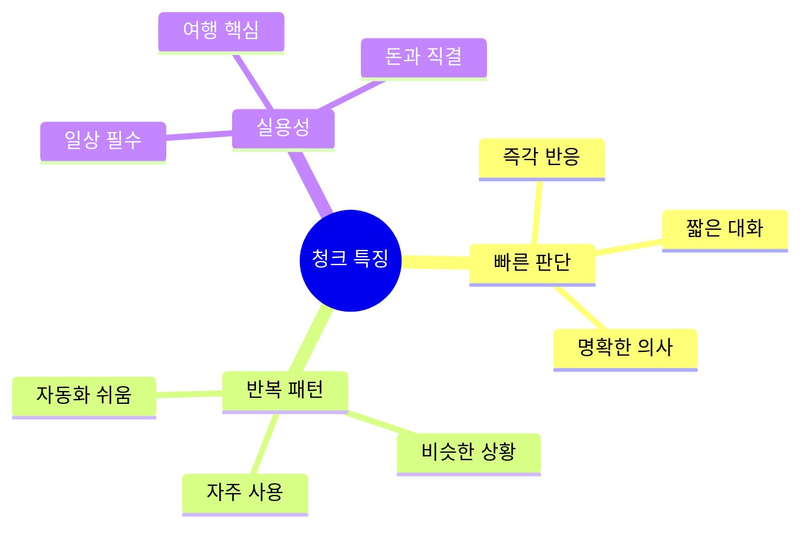

# 🛍️🚕 쇼핑 & 교통 청크 실전 가이드
## 스마트한 쇼핑과 안전한 이동을 위한 청크 학습법

---

## 📋 청크 사고 시스템

### 🧠 쇼핑 & 교통에서의 청크



**이 영역의 특징:**
- 대화가 짧음 ⚡
- 반복이 많음 🔄
- 즉각 반응 필요 💨
- 실수하면 손해 💸

---

# 🛍️ 쇼핑 청크 마스터

## 청크 #1: 매장 입장 시 대응

### 🧩 청크 구조 분석

```
청크 = [상태 알림] + [필요 시 요청]
예: "Just browsing / Let you know"
    [그냥 구경]   [알려드릴게요]
```

### 🎭 3단계 응용: 점원이 다가올 때

**🔹 1단계: 줄임말 (초간단)**
```
👔: "Need help?"
👤: "Browsing."
    [구경 중]

💭 생각 과정:
"구경하고 있어요" → "Browsing"
(한 단어로 끝!)

⏱️ 0.5초
```

**🔹 2단계: 실전 (표준) ⭐ 추천**
```
👔: "Can I help you?"
👤: "Just browsing, / thanks. / I'll let you know / if I need help."
    [그냥 구경]    [감사] [알려드릴게요]   [필요하면]

💭 생각 과정:
"그냥 구경 중" → "Just browsing"
"고마워요" → "thanks"
"필요하면 말할게요" → "I'll let you know if I need help"

⏱️ 2초
```

**🔹 3단계: 정중 (프리미엄 매장)**
```
👔: "Good afternoon. May I assist you today?"
👤: "Good afternoon. / Thank you / for asking. / I'm just / browsing at the moment, / but I'll certainly / ask for assistance / if I need it."
    [인사]          [감사]    [물어봐주셔서] [단지]   [지금 구경 중]       [확실히]       [도움 요청]      [필요하면]

💭 생각 과정:
"좋은 오후입니다" → "Good afternoon"
"물어봐주셔서 감사합니다" → "Thank you for asking"
"지금은 그냥 구경 중입니다" → "I'm just browsing at the moment"
"필요하면 요청하겠습니다" → "I'll ask for assistance if I need it"

⏱️ 5초
```

### 📊 상황별 청크 선택 가이드

| 상황 | 1단계 | 2단계 ⭐ | 3단계 |
|------|-------|---------|-------|
| **저렴한 매장** | "Browsing." | "Just browsing, thanks." | ❌ 너무 격식 |
| **일반 매장** | ✅ OK | ✅ **Best!** | ✅ OK |
| **고급 매장** | ❌ 너무 캐주얼 | ✅ OK | ✅ **Best!** |

---

## 청크 #2: 사이즈/색상 찾기

### 🧩 청크 구조 분석

```
청크 = [이것] + [다른 속성]?
예: "This / in medium?"
    [이것] [미디엄으로?]
```

### 🎭 3단계 응용

**🔹 1단계: 줄임말**
```
👤: "This? / Medium?"
    [이거?] [미디엄?]
👔: "Lemme check."
    [확인할게요]
[찾아온 후]
👔: "Here."
    [여기]
👤: "Thanks!"
    [감사]

⏱️ 5초 해결
💭 최소한의 말
```

**🔹 2단계: 실전 ⭐**
```
👤: "Excuse me. / Do you have / this / in medium?"
    [실례]       [있나요?]    [이거] [미디엄으로]
👔: "Let me check / for you."
    [확인할게요]
[찾아온 후]
👔: "Yes! / Here's / a medium."
    [네!] [여기]   [미디엄]
👤: "Perfect. / Can I try it on?"
    [완벽]     [입어봐도 될까요?]
👔: "Of course. / Fitting rooms / are over there."
    [물론]       [탈의실]        [저쪽]

⏱️ 20초
💭 명확하고 자연스러움
```

**🔹 3단계: 정중**
```
👤: "Excuse me. / I'm interested in / this item. / Do you happen to have it / in / a medium size?"
    [실례]       [관심 있습니다]   [이 제품]  [혹시 있으신가요?]      [미디엄 사이즈로]
👔: "Certainly. / Let me check / our inventory / for you. / One moment, / please."
    [물론]      [확인할게요]    [재고]        [당신을 위해] [잠시만]      [기다려주세요]
[찾은 후]
👔: "I've found one. / Here you are. / Would you like / to try it on?"
    [찾았습니다]      [여기 있습니다] [원하시나요?]  [입어보시길]
👤: "Yes, / I would appreciate that. / Where are / the fitting rooms?"
    [네]  [그러고 싶습니다]       [어디인가요?] [탈의실]

⏱️ 40초
💭 매우 공손
```

---

## 청크 #3: 피팅 & 사이즈 확인

### 🧩 청크 구조 분석

```
청크 = [시도 요청] + [장소 질문]
예: "Try this on? / Where's fitting room?"
    [입어봐도 될까요?] [탈의실 어디?]
```

### 🎭 3단계 응용

**피팅 후 - 사이즈 완벽할 때**
```
✅ 1단계: "Perfect! / I'll take it."
           [완벽]   [살게요]

✅ 2단계: "It fits perfectly! / How much is it?"
           [완벽하게 맞아요]     [얼마예요?]

✅ 3단계: "This is an excellent fit. / What is the price?"
           [완벽하게 맞습니다]      [가격이 얼마인가요?]
```

**피팅 후 - 사이즈 안 맞을 때**
```
✅ 1단계: "Too small. / Got larger?"
           [너무 작아]  [더 큰 거?]

✅ 2단계: "This is a bit tight. / Do you have / a larger size?"
           [조금 작아요]         [있나요?]    [더 큰 사이즈]

✅ 3단계: "I'm afraid / this is slightly snug. / Would you have / the next size up?"
           [미안하지만]  [약간 꽉 끼네요]       [있으신가요?]   [한 치수 큰 것]
```

---

## 청크 #4: 가격 확인 & 할인

### 🧩 청크 구조 분석

```
청크 = [가격 질문] + [할인 질문]
예: "How much? / Any discount?"
    [얼마예요?]  [할인 있나요?]
```

### 🎭 3단계 응용: 가격 물어보기

**🔹 1단계: 줄임말**
```
👤: "Price?"
    [가격?]
👔: "$89."
    [89달러]
👤: "Discount?"
    [할인?]
👔: "20% off / today."
    [20% 할인]  [오늘]
👤: "Sweet! / I'll take it."
    [좋아]   [살게요]

⏱️ 10초
💭 직설적
```

**🔹 2단계: 실전 ⭐**
```
👤: "How much / is this?"
    [얼마예요] [이거]
👔: "That's $89."
    [89달러입니다]
👤: "Are there / any discounts / today?"
    [있나요?]  [할인]       [오늘]
👔: "Yes! / We have / 20% off / on all items."
    [네!]  [있습니다] [20% 할인] [모든 상품]
👤: "Great! / So that's / about $71?"
    [좋아!]  [그럼]      [약 71달러?]
👔: "Exactly! / $71.20."
    [정확히!]  [71.20달러]
👤: "Perfect. / I'll take it."
    [완벽]     [살게요]

⏱️ 30초
💭 명확한 확인
```

**🔹 3단계: 정중**
```
👤: "Excuse me. / May I ask / the price / of this item?"
    [실례]       [여쭤봐도]  [가격]   [이 제품]
👔: "Of course. / This item / is priced at / $89."
    [물론]       [이 제품은]  [가격이]      [89달러]
👤: "I see. / Are there / any current promotions / or discounts / available?"
    [알겠습니다] [있나요?]  [현재 프로모션]      [또는 할인]   [이용 가능한]
👔: "Yes, / we're currently offering / 20% off / all merchandise."
    [네]  [현재 제공 중입니다]    [20% 할인]  [모든 상품]
👤: "Wonderful. / So / the final price / would be / approximately / $71?"
    [좋네요]     [그럼] [최종 가격은]   [~이겠네요] [약]           [71달러]
👔: "Precisely. / $71.20 / to be exact."
    [정확히]     [71.20달러] [정확하게는]
👤: "Excellent. / I'll purchase it."
    [훌륭합니다]  [구매하겠습니다]

⏱️ 60초
💭 매우 격식
```

---

## 청크 #5: 환불/교환

### 🧩 청크 구조 분석

```
청크 = [문제 제기] + [원하는 것] + [이유]
예: "Need to return / Want refund / Doesn't fit"
    [환불해야 함]     [환불 원함]   [안 맞음]
```

### 🎭 3단계 응용

**🔹 1단계: 줄임말**
```
👤: "Return this. / Too small."
    [환불]        [너무 작아]
👔: "Receipt?"
    [영수증?]
👤: "Here."
    [여기]
👔: "Refund / or exchange?"
    [환불]   [교환?]
👤: "Refund."
    [환불]

⏱️ 15초
```

**🔹 2단계: 실전 ⭐**
```
👤: "Hi. / I need to / return this."
    [안녕하세요] [해야 해요] [환불]
👔: "Sure. / What's the issue?"
    [네]   [무슨 문제?]
👤: "It doesn't fit. / Too small."
    [안 맞아요]      [너무 작아요]
👔: "I understand. / Do you have / your receipt?"
    [이해합니다]    [있으세요?]  [영수증]
👤: "Yes, / here it is."
    [네]  [여기 있어요]
👔: "Perfect. / Would you like / a refund / or an exchange?"
    [좋아요]   [원하시나요?]   [환불]    [교환]
👤: "Do you have / a larger size?"
    [있나요?]     [더 큰 사이즈]
👔: "Let me check... / Sorry, / we're out of stock."
    [확인할게요]      [죄송]   [재고가 없네요]
👤: "Okay, / I'll take / a refund / then."
    [알겠어요] [받을게요]  [환불]    [그럼]

⏱️ 45초
```

**🔹 3단계: 정중**
```
👤: "Good afternoon. / I purchased this item / yesterday, / and unfortunately / it doesn't fit properly. / I'd like to / return it / if possible."
    [안녕하세요]      [구매했습니다]        [어제]      [불행히도]      [제대로 맞지 않네요]     [하고 싶습니다] [반품]   [가능하다면]
👔: "I completely understand. / May I see / your receipt?"
    [완전히 이해합니다]      [봐도 될까요?] [영수증]
👤: "Certainly. / Here you are."
    [물론]       [여기 있습니다]
👔: "Thank you. / I can process / a refund / or an exchange. / Which would you / prefer?"
    [감사합니다]   [처리할 수 있습니다] [환불]    [교환]         [어느 것을]      [선호하시나요?]
👤: "I'd prefer / an exchange / if you have / a larger size / available."
    [선호합니다]  [교환]        [있으시다면]  [더 큰 사이즈]  [가능한]
👔: "Let me check / our inventory... / I apologize, / but we're currently / out of stock / in that size."
    [확인해보겠습니다] [재고]           [사과드립니다]  [현재]           [재고가 없습니다] [그 사이즈는]
👤: "I see. / In that case, / I'll proceed with / a refund. / How long / will that take?"
    [알겠습니다] [그렇다면]      [진행하겠습니다]  [환불]      [얼마나]   [걸릴까요?]
👔: "The refund / will be processed / to your original card / within / 3-5 business days."
    [환불은]       [처리될 것입니다]  [원래 카드로]        [이내에]  [3-5 영업일]

⏱️ 90초
```

---

# 🚕 교통 청크 마스터

## 청크 #6: 택시 타기

### 🧩 청크 구조 분석

```
청크 = [목적지] + [시간/가격 질문]
예: "Airport / How long? / How much?"
    [공항]   [얼마나?]   [얼마?]
```

### 🎭 3단계 응용: 택시 탑승

**🔹 1단계: 줄임말**
```
👤: "Airport."
    [공항]
🚕: "Which terminal?"
    [어느 터미널?]
👤: "Terminal 2."
    [터미널 2]
🚕: "Got it."
    [알았어요]
[이동 중]
👤: "How long?"
    [얼마나?]
🚕: "20 minutes."
    [20분]
👤: "How much?"
    [얼마?]
🚕: "About $40."
    [약 40달러]

⏱️ 초간단
💭 필수만
```

**🔹 2단계: 실전 ⭐**
```
👤: "Hi! / Can you take me / to the airport?"
    [안녕] [태워주실 수 있나요] [공항까지]
🚕: "Sure! / Which terminal?"
    [네!]  [어느 터미널?]
👤: "Terminal 2, / please."
    [터미널 2]    [부탁드립니다]
🚕: "No problem. / Hop in!"
    [문제없어요]   [타세요!]
[탑승 후]
👤: "How long / do you think / it'll take?"
    [얼마나]    [생각하세요]   [걸릴까요?]
🚕: "Maybe 25-30 minutes / depending on / traffic."
    [25-30분쯤]            [따라]        [교통]
👤: "That's fine. / Rough estimate / on the price?"
    [괜찮아요]    [대략]          [가격]
🚕: "Probably / around $40-45."
    [아마]      [약 40-45달러]
👤: "Perfect. / Thanks!"
    [완벽]     [감사]

⏱️ 45초
💭 자연스러움
```

**🔹 3단계: 정중**
```
👤: "Good afternoon. / Could you / please take me / to the airport?"
    [안녕하세요]      [해주실 수 있나요] [태워주시길]    [공항까지]
🚕: "Certainly, sir. / Which terminal / would you prefer?"
    [물론입니다]       [어느 터미널]    [원하시나요?]
👤: "Terminal 2, / if you please."
    [터미널 2]      [부탁드립니다]
🚕: "Of course. / Please, / make yourself comfortable."
    [물론입니다]  [부디]   [편하게 하세요]
[탑승 후]
👤: "May I ask / how long / the journey / might take?"
    [여쭤봐도 될까요] [얼마나]   [여정이]      [걸릴까요?]
🚕: "Given / current traffic conditions, / approximately / 25-30 minutes."
    [주어진]  [현재 교통 상황]         [약]           [25-30분]
👤: "Excellent. / Could you / also give me / a rough estimate / of the fare?"
    [좋습니다]   [해주실 수 있나요] [알려주시길]   [대략적인 예상]  [요금]
🚕: "It should be / in the range of / $40-45."
    [~일 것입니다]  [범위]            [40-45달러]
👤: "That's perfectly acceptable. / Thank you."
    [완전히 수용 가능합니다]    [감사합니다]

⏱️ 90초
💭 매우 격식
```

---

## 청크 #7: 우버 확인

### 🧩 청크 구조 분석

```
청크 = [확인] + [이름] + [목적지]
예: "You my Uber? / Park? / Going downtown?"
    [제 우버?]     [박?]  [다운타운?]
```

### 🎭 3단계 응용

**🔹 1단계: 줄임말**
```
👤: "My Uber?"
    [제 우버?]
🚕: "Kim?"
    [김?]
👤: "Yep!"
    [네!]
🚕: "Hop in!"
    [타세요!]

⏱️ 3초
💭 초고속
```

**🔹 2단계: 실전 ⭐**
```
👤: "Hey! / You my Uber?"
    [안녕] [제 우버세요?]
🚕: "Yep! / You Kim?"
    [네!]  [김 씨?]
👤: "That's me!"
    [네 맞아요!]
🚕: "Great! / Hop in. / Going to / the hotel?"
    [좋아요] [타세요]  [가시나요] [호텔]
👤: "Yeah, / the Hilton."
    [네]   [힐튼]
🚕: "Got it. / About 15 minutes."
    [알겠습니다] [약 15분]
👤: "Perfect. / Thanks!"
    [완벽]     [감사]

⏱️ 20초
💭 가장 일반적
```

**🔹 3단계: 정중**
```
👤: "Excuse me. / Are you / the Uber driver / for Kim?"
    [실례]       [~이신가요] [우버 기사]      [김]
🚕: "Yes, / that's correct. / You must be / Mr. Kim?"
    [네]  [맞습니다]      [~이시겠네요] [김 씨]
👤: "Yes, / I am. / Thank you / for coming."
    [네]  [맞습니다] [감사합니다] [오셔서]
🚕: "My pleasure. / Please, / get in. / I understand / we're heading to / the Hilton Hotel?"
    [천만에요]     [부디]   [타세요]  [알고 있습니다]  [향하고 있다고]   [힐튼 호텔]
👤: "That's correct. / How long / do you anticipate / it will take?"
    [맞습니다]      [얼마나]   [예상하시나요]     [걸릴까요?]
🚕: "Approximately / 15 minutes, / barring / any unexpected traffic."
    [약]           [15분]        [제외하고] [예상치 못한 교통]
👤: "Excellent. / Thank you."
    [훌륭합니다]  [감사합니다]

⏱️ 50초
💭 비즈니스급
```

---

## 청크 #8: 길 묻기

### 🧩 청크 구조 분석

```
청크 = [실례] + [질문] + [목적지]
예: "Excuse me / How do I get to / the station?"
    [실례]      [어떻게 가나요]     [역]
```

### 🎭 3단계 응용

**🔹 1단계: 줄임말**
```
👤: "Hey! / Station?"
    [저기]  [역?]
👥: "That way. / 10 minutes."
    [저쪽]     [10분]
👤: "Thanks!"
    [감사!]

⏱️ 5초
```

**🔹 2단계: 실전 ⭐**
```
👤: "Excuse me! / How do I get to / the train station?"
    [실례합니다]  [어떻게 가나요]     [기차역]
👥: "Oh, / it's that way. / Go straight / for about 10 minutes."
    [오]  [저쪽이요]      [직진]        [약 10분]
👤: "Straight / down this street?"
    [직진]    [이 길로?]
👥: "Yep! / Then / turn left / at the Starbucks. / Can't miss it."
    [네!]  [그리고] [왼쪽으로]  [스타벅스에서]      [못 찾을 수 없어요]
👤: "Got it. / Thank you!"
    [알겠습니다] [감사합니다!]
👥: "No problem! / Have a good one!"
    [문제없어요]   [좋은 하루!]

⏱️ 30초
💭 명확한 안내
```

**🔹 3단계: 정중**
```
👤: "Excuse me, sir. / I'm terribly sorry / to bother you, / but could you / possibly direct me / to the train station?"
    [실례합니다]       [정말 죄송하지만]  [방해드려서]    [해주실 수 있나요] [안내해주시길]    [기차역으로]
👥: "Oh, / not at all! / It's quite nearby. / If you walk / straight down / this street / for approximately / 10 minutes, / you'll reach it."
    [오]  [전혀 아닙니다!] [꽤 가까워요]     [걸으시면]    [직진]        [이 길로]    [약]            [10분]         [도착하실 겁니다]
👤: "I see. / Should I continue / straight / the entire way?"
    [알겠습니다] [계속해야 하나요]  [직진을]  [전체 경로를?]
👥: "Yes, / and then / when you see / a Starbucks, / turn left. / The station / will be / right there. / You can't miss it."
    [네]  [그리고]  [보시면]      [스타벅스를]    [왼쪽으로]   [역이]       [있을 겁니다] [바로 거기]   [못 찾을 수 없어요]
👤: "Thank you / so very much / for your kind assistance."
    [감사합니다]  [정말 매우]      [친절한 도움]
👥: "You're most welcome. / Safe travels!"
    [정말 천만에요]         [안전한 여행!]

⏱️ 60초
💭 매우 공손
```

---

## 🎯 통합 실전 시나리오

### 시나리오 1: 의류 쇼핑 전체 과정 (실전 버전)

```
[입장]
👔: "Hi there! / Can I help you / find anything?"
    [안녕하세요]  [도와드릴까요]  [찾으시는 거]
👤: "Hi! / Just browsing, / but I'll let you know / if I need help."
    [안녕하세요] [그냥 구경]      [알려드릴게요]      [필요하면]
👔: "Perfect! / Take your time."
    [좋아요]    [천천히 보세요]

[5분 후]
👤: "Excuse me. / Do you have / this jacket / in large?"
    [실례]       [있나요?]    [이 재킷]  [라지 사이즈로]
👔: "Let me check / for you... / Yes! / Here's / a large."
    [확인할게요]            [네!]  [여기]   [라지]
👤: "Great! / Can I try it on?"
    [좋아요]  [입어봐도 될까요?]
👔: "Of course. / Fitting rooms / are right there."
    [물론]       [탈의실]        [바로 저쪽]

[피팅 후]
👤: "This fits / perfectly! / How much / is it?"
    [맞네요]     [완벽하게]   [얼마예요] [이거]
👔: "That's $89, / but we have / 20% off / today."
    [89달러]      [있어요]     [20% 할인]  [오늘]
👤: "Oh nice! / So that's / about $71?"
    [오 좋아요]  [그럼]      [약 71달러?]
👔: "Exactly! / Great deal."
    [정확히!]   [좋은 가격이에요]
👤: "Perfect. / I'll take it."
    [완벽]     [살게요]

[계산대]
👔: "Cash or card?"
    [현금? 카드?]
👤: "Card, please."
    [카드로요]
👔: "Great. / Here's your receipt. / Have a great day!"
    [좋아요]  [영수증입니다]      [좋은 하루!]
👤: "Thank you! / You too!"
    [감사합니다]  [당신도!]

⏱️ 총 소요: 15분
🎯 청크: 32개
💭 매우 자연스러운 흐름
```

### 시나리오 2: 택시 → 쇼핑 → 우버 (하루 일정)

```
=== Part 1: 아침 택시 (호텔 → 쇼핑몰) ===

👤: "Good morning! / Can you take me / to / the shopping mall?"
    [좋은 아침]     [태워주시겠어요]    [쇼핑몰까지]
🚕: "Sure! / Which one?"
    [네!]  [어느 거?]
👤: "The Grove Mall."
    [그로브 몰]
🚕: "Got it. / About 15 minutes."
    [알겠습니다] [약 15분]
[도착]
🚕: "Here we are. / That's $18."
    [도착했습니다]  [18달러]
👤: "Here's $25. / Keep the change."
    [25달러요]     [잔돈 가지세요]
🚕: "Thank you! / Have fun!"
    [감사합니다]   [즐겁게!]

=== Part 2: 쇼핑 (3시간) ===

[매장 1: 신발]
👤: "Just browsing, thanks."
👔: "Cool. Let me know!"

[30분 후]
👤: "These shoes. / Size 9?"
👔: "Lemme check... / Got 'em!"
👤: "How much?"
👔: "$120, / but 25% off."
👤: "So $90? / I'll take them."

[매장 2: 옷]
👤: "This shirt / in medium?"
👔: "Here you go."
👤: "Can I try it?"
👔: "Sure! Over there."
[피팅 후]
👤: "Perfect! / I'll take it."
👔: "$45."
👤: "Card, please."

=== Part 3: 저녁 우버 (쇼핑몰 → 호텔) ===

👤: "Hey! / You my Uber? / Going to / Hilton Hotel?"
    [안녕]  [제 우버?]      [가시나요] [힐튼 호텔]
🚕: "Yep! / Kim?"
    [네!]  [김 씨?]
👤: "That's me! / Had a good day / shopping."
    [네 맞아요]   [좋은 하루였어요] [쇼핑]
🚕: "Nice! / Find / good stuff?"
    [좋네요]  [찾으셨나요] [좋은 거]
👤: "Yeah! / Shoes / and a shirt."
    [네!]   [신발]  [그리고 셔츠]
🚕: "Awesome. / We're here."
    [좋아요]    [도착했습니다]
👤: "Thanks / for the ride! / I'll rate / 5 stars."
    [감사]    [태워주셔서]   [줄게요]   [별 5개]
🚕: "Appreciate it! / Have a good night!"
    [감사합니다]    [좋은 밤!]

⏱️ 총 하루: 4시간
🎯 청크: 68개
💰 지출: $18 + $90 + $45 = $153
💭 성공적인 쇼핑 데이!
```

---

## 📊 쇼핑 & 교통 청크 마스터 맵

### 필수 암기 청크 TOP 40

```mermaid
mindmap
  root((TOP 40))
    쇼핑 20개
      입장
        Just browsing
        Let you know
        Need help?
      탐색
        This in medium?
        Any colors?
        Got larger?
      피팅
        Try it on?
        Fits perfectly
        Too tight
      구매
        How much?
        Any discount?
        I'll take it
      환불
        Return this
        Doesn't fit
        Got receipt?
    교통 20개
      택시
        Airport please
        How long?
        How much?
        Keep change
      우버
        You my Uber?
        You [name]?
        Thanks for ride
        5 stars
      길찾기
        How do I get to?
        Which way?
        How far?
        Can't miss it
```

---

## 💡 청크 마스터 비법

### 쇼핑 청크 훈련 (1주)

```
Day 1: 입장 청크
□ "Just browsing" 100번
□ 3단계 모두 연습
□ 거울 앞 10회

Day 2: 사이즈/색상 청크
□ "This in medium?" 50번
□ "Any colors?" 50번
□ 실전 시뮬레이션

Day 3: 피팅 청크
□ "Try it on?" 패턴
□ "Fits perfectly" 연습
□ 사이즈 문제 대응

Day 4: 가격 청크
□ "How much?" 필수
□ 할인 청크 패턴
□ 계산 연습

Day 5: 환불 청크
□ "Return this" 연습
□ 사유 설명 청크
□ 영수증 관련 표현

Day 6: 교통 청크 (택시/우버)
□ 목적지 청크
□ 시간/가격 질문
□ 감사 표현

Day 7: 통합 테스트
□ 전체 시나리오
□ 3단계 모두
□ 실전 준비!
```

---

## 🏆 최종 체크리스트

### 쇼핑 청크 ✅
- [ ] 입장 대응 자동화
- [ ] 사이즈 요청 완벽
- [ ] 피팅 표현 숙달
- [ ] 가격 청크 마스터
- [ ] 환불 청크 암기
- [ ] 15분 쇼핑 완수

### 교통 청크 ✅
- [ ] 택시 청크 완벽
- [ ] 우버 확인 자동
- [ ] 길 묻기 숙달
- [ ] 3초 반응 가능
- [ ] 실전 자신감

### 통합 실전 🔥
- [ ] 쇼핑 전체 과정
- [ ] 교통 조합 사용
- [ ] 하루 일정 완수
- [ ] 스트레스 제로
- [ ] 100% 자신감!

---

**💪 쇼핑 & 교통 청크 마스터의 핵심:**
> "생각 말고 말하라!"
> 
> 청크는 자동으로 나와야 합니다.
> 빠른 상황, 빠른 반응!

**Last Updated: 2026-01-11**

