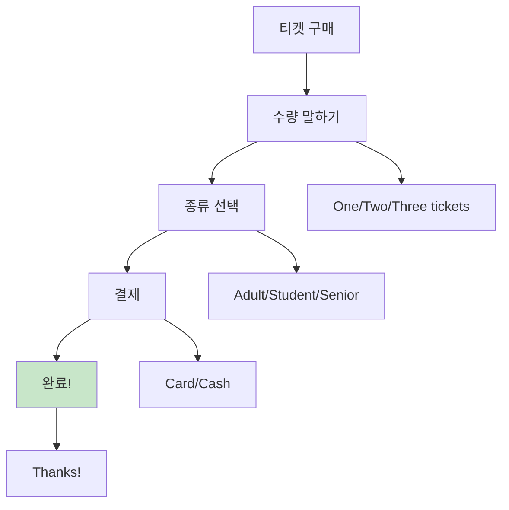
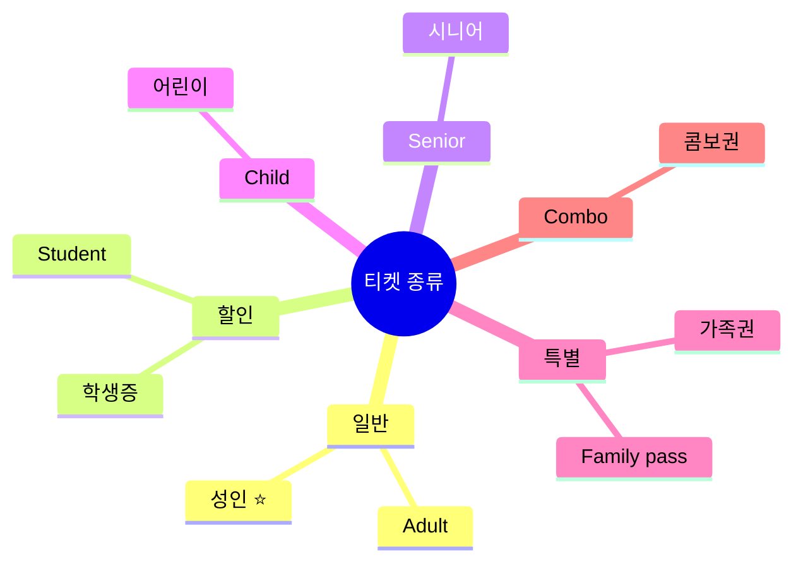
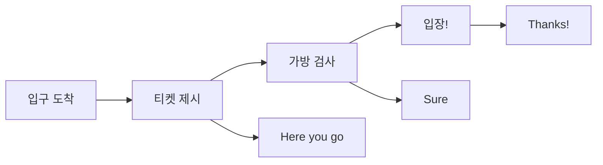
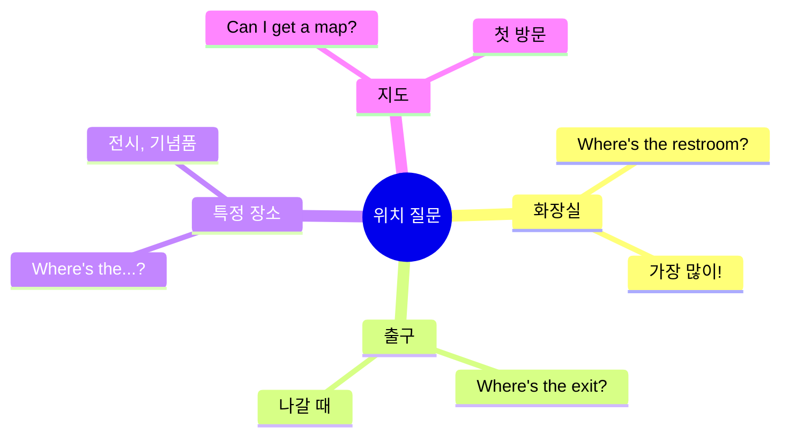
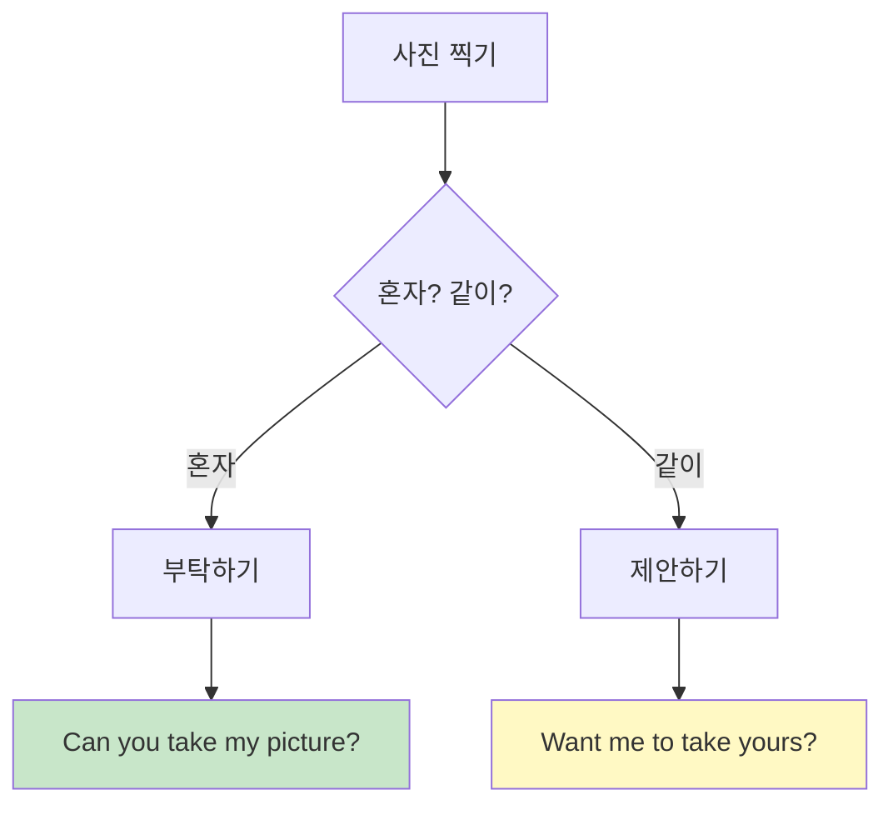

# 🗽 관광지 청크 실전 가이드
## 입장부터 사진까지 완벽 마스터

---

## 🎯 이 가이드의 목표

### 관광지 = 영어 사용의 꽃!

```
❌ 흔한 실수:
"Excuse me... I want to... 
how can I... buy ticket... 
and... where is...?"
→ 복잡, 헷갈림, 시간 낭비

✅ 청크로 말하면:
"Two tickets, please."
"Where's the restroom?"
→ 명확, 빠름, 완벽!

💡 핵심: 짧고 명확하게!
```

### 🏆 학습 목표

```
✅ 관광지 필수 청크 25개 마스터
✅ 3단계 응용 (캐주얼/표준/정중)
✅ 입장부터 퇴장까지 전 과정 커버
✅ 사진 요청 완벽 마스터
✅ 문제 상황 대응 가능
```

---

## 📋 목차

1. [티켓 구매 청크](#티켓-구매-청크)
2. [입장 & 안내 청크](#입장--안내-청크)
3. [사진 청크](#사진-청크)
4. [정보 요청 청크](#정보-요청-청크)
5. [실전 시뮬레이션](#실전-시뮬레이션)

---

## 티켓 구매 청크

### 💡 티켓 구매 시스템



### 🔹 수량 청크

#### 청크 1: 기본 티켓 수량

**3단계 시스템:**

| 단계 | 청크 | 상황 |
|:---:|------|------|
| 1단계 | "Two tickets." | 간단 명료 ⭐ |
| 2단계 | "Two tickets, please." | 기본 |
| 3단계 | "Can I get two tickets, please?" | 정중 |

**수량별 청크:**

| 수량 | 청크 | 발음 |
|------|------|------|
| 1명 | "One ticket, please." | 원 티켓 |
| 2명 | "Two tickets, please." | 투 티켓 |
| 3명 | "Three tickets, please." | 쓰리 티켓 |
| 4명 | "Four tickets, please." | 포 티켓 |
| 가족 | "Family pass, please." | 패밀리 패스 |

**실전 대화:**
```
직원: "Hi! How can I help you?"
당신: "Two adult tickets, please."
      ↑ 수량 + 종류

직원: "That'll be $45."
당신: "Card." (카드 건네며)

직원: "Here you go. Enjoy!"
당신: "Thanks!"

⏱️ 소요 시간: 30초
✅ 완벽한 구매!
```

---

### 🔹 티켓 종류 청크



#### 청크 2: 성인 티켓

**주문 청크:**
```
"Two adult tickets, please."
 ↑    ↑
수량  종류

💡 가장 기본!
```

#### 청크 3: 학생 할인

**주문 청크:**
```
"One student ticket, please."

+ID 요청 시:
"Here's my student ID."
(학생증 보여주며)

⚠️ 준비: 학생증 or 국제학생증
```

#### 청크 4: 시니어 할인

**주문 청크:**
```
"One senior ticket, please."

💡 보통 65세 이상
   ID 요청 가능
```

#### 청크 5: 가족권

**주문 청크:**
```
"Family pass for four, please."
             ↑
         인원 수

💡 보통 2 adults + 2 kids
   더 저렴!
```

---

### 🔹 특수 티켓 청크

#### 청크 6: 시간 지정 티켓

```
예: 박물관, 전망대

"Two tickets for 2 PM, please."
              ↑
          시간 지정

또는:
"What times are available?"
(가능한 시간?)
```

#### 청크 7: 콤보 티켓

```
예: 박물관 + 전망대

"Is there a combo ticket?"
(콤보권 있나요?)

또는:
"What packages do you have?"
(패키지 뭐 있나요?)

💡 보통 더 저렴!
```

#### 청크 8: 온라인 예약 확인

```
"I booked online."
(온라인 예약했어요)

+확인:
"Here's my confirmation."
(확인서 보여주며)

또는:
"Confirmation number is..."
(확인 번호는...)
```

---

## 입장 & 안내 청크

### 🔹 입장 청크



#### 청크 9: 티켓 제시

```
직원: "Tickets, please."

답변 청크:
"Here you go." (티켓 건네며) ⭐
"Here." (간단)
```

#### 청크 10: 가방 검사

```
직원: "Can I check your bag?"

답변 청크:
"Sure!" (가방 열며) ⭐
"Of course."
"No problem."

💡 거절 불가, 긍정적으로!
```

---

### 🔹 위치 찾기 청크



#### 청크 11: 화장실 ⭐ 최우선!

**질문 청크:**

| 단계 | 청크 | 상황 |
|:---:|------|------|
| 1단계 | "Restroom?" | 급할 때 |
| 2단계 | "Where's the restroom?" | 기본 ⭐ |
| 3단계 | "Excuse me, where's the restroom?" | 정중 |

**받아쓰기:**
```
직원: "Down the hall, on your left."
당신: "Thanks!"

💡 자주 쓰는 방향:
- Down the hall (복도 따라)
- On your left/right (왼쪽/오른쪽)
- Upstairs/Downstairs (위층/아래층)
```

#### 청크 12: 출구

**질문 청크:**
```
"Where's the exit?"
(출구 어디?)

"Way out?"
(나가는 길?)

💡 보통 EXIT 표지판 따라가기
```

#### 청크 13: 특정 장소

**질문 청크:**
```
"Where's the gift shop?"
(기념품점?)

"Where's the observation deck?"
(전망대?)

"Where's the cafe?"
(카페?)

공식: Where's the + 장소
```

---

### 🔹 정보 요청 청크

#### 청크 14: 지도

**요청 청크:**
```
"Can I get a map?"
(지도 주세요?)

또는:
"Do you have a map?"
(지도 있나요?)

+언어:
"English map, please."
(영어 지도요)
```

#### 청크 15: 가이드 투어

**질문 청크:**
```
"Are there any tours?"
(투어 있나요?)

"When's the next tour?"
(다음 투어 언제?)

"Is it in English?"
(영어로 하나요?)

💡 가이드 투어 = 더 많이 배움!
```

#### 청크 16: 오디오 가이드

**요청 청크:**
```
"Can I get an audio guide?"
(오디오 가이드 주세요?)

"How much is the audio guide?"
(오디오 가이드 얼마?)

"In English, please."
(영어로요)

💡 보통 $5-10 추가
```

---

## 사진 청크

### 💡 사진 = 여행의 추억!



### 🔹 사진 부탁 청크

#### 청크 17: 사진 찍어달라고 ⭐

**3단계 시스템:**

| 단계 | 청크 | 상황 |
|:---:|------|------|
| 1단계 | "Picture?" (핸드폰 들며) | 간단 |
| 2단계 | "Can you take my picture?" | 기본 ⭐ |
| 3단계 | "Excuse me, could you take my picture?" | 정중 |

**실전 대화:**
```
당신: "Excuse me, can you take my picture?"
      (핸드폰 건네며)

행인: "Sure!"

당신: "Just press here." (버튼 가리키며)
      ↑ 설명!

행인: "Got it. Ready?"

당신: "Yes!" (포즈)

--- 찍은 후 ---

행인: "Here you go."

당신: "Thanks so much!"
      ↑ 감사 청크!

✅ 완벽한 사진 완료!
```

---

### 🔹 사진 찍는 법 설명 청크

#### 청크 18: 버튼 설명

```
"Just press here."
(여기만 누르세요) ⭐

"Press this button."
(이 버튼 누르세요)

"Tap anywhere."
(아무 데나 터치하세요)

💡 간단하게 설명!
```

#### 청크 19: 구도 요청

```
"With the statue, please."
(동상이랑 같이요)

"Get the building in."
(건물 넣어주세요)

"Full body, please."
(전신으로요)

"Just me."
(저만요)
```

#### 청크 20: 다시 찍기

```
"Can we try one more?"
(한 장 더?)

"One more, please?"
(한 번 더요?)

💡 부탁스럽게!
```

---

### 🔹 사진 찍어주기 청크

#### 청크 21: 제안하기

```
"Want me to take yours?"
(제가 찍어드릴까요?)

또는:
"I can take one for you."
(제가 찍어드릴게요)

"Need a picture?"
(사진 필요하세요?)

💡 친절함 = 좋은 인상!
```

#### 청크 22: 같이 찍자고

```
"Want to take one together?"
(같이 찍을까요?)

또는:
"Let's get someone to take ours."
(누가 우리 것 찍어주게 하죠)

💡 여행 친구 만들기!
```

---

## 정보 요청 청크

### 🔹 시간 & 운영 청크

#### 청크 23: 운영 시간

```
"What time do you close?"
(몇 시에 닫나요?)

"How long can we stay?"
(얼마나 있을 수 있나요?)

"When's the last entry?"
(마지막 입장 언제?)

💡 시간 여유 확인!
```

#### 청크 24: 소요 시간

```
"How long does it take?"
(얼마나 걸려요?)

"How big is it?"
(얼마나 큰가요?)

직원 답변:
"About an hour."
"It's pretty big."

💡 일정 계획에 필수!
```

---

### 🔹 규칙 & 제한 청크

#### 청크 25: 사진 가능?

```
"Can I take pictures?"
(사진 찍어도 되나요?)

"Is photography allowed?"
(촬영 가능한가요?)

답변:
"Yes, no flash."
(네, 플래시만 빼고)

"No photos inside."
(안에서는 사진 금지)

💡 꼭 확인!
```

#### 청크 26: 음식 가능?

```
"Can I bring food?"
(음식 가져와도 되나요?)

"Is there a cafe inside?"
(안에 카페 있나요?)

💡 박물관은 보통 금지
```

#### 청크 27: 재입장 가능?

```
"Can I come back in?"
(다시 들어올 수 있나요?)

"Do you stamp for re-entry?"
(재입장 스탬프 찍나요?)

💡 점심 나갔다 올 때!
```

---

## 실전 시뮬레이션

### 🎬 시나리오 1: 자유의 여신상

```
--- 티켓 부스 ---

직원: "Hi! How can I help you?"
당신: "Two adult tickets, please."

직원: "Crown access or pedestal?"
당신: "What's the difference?"
      ↑ 차이 물어보기!

직원: "Crown goes all the way up. Pedestal is halfway."
당신: "Pedestal, please."

직원: "$36. Next available is 2 PM."
당신: "That works. Card."

직원: "Here are your tickets."
당신: "Thanks! Where do we board?"
      ↑ 배 타는 곳?

직원: "Pier 1, that way."
당신: "Got it, thanks!"

--- 배 위 ---

관광객: (사진 찍고 있음)

당신: "Want me to take one for you?"
      ↑ 친절하게 제안!

관광객: "That would be great!"

당신: (찍어줌) "Got it!"

관광객: "Thanks! Want me to take yours?"
당신: "That'd be awesome!"

--- 자유의 여신상 ---

당신: "Excuse me, can you take our picture?"
      (핸드폰 건네며)

행인: "Sure!"

당신: "With the statue, please."
      ↑ 구도 요청!

행인: "Ready? 1, 2, 3!"

당신: "Perfect! Thanks so much!"

⏱️ 소요 시간: 3시간
✅ 완벽한 관광!
💡 포인트: 친절 + 명확
```

### 🎬 시나리오 2: MoMA (현대미술관)

```
--- 입구 ---

직원: "Tickets?"
당신: "Two students, please."
      ↑ 학생 할인!

직원: "Can I see your student IDs?"
당신: "Here you go." (학생증 건네며)

직원: "$28. Here's your map."
당신: "Thanks! Is photography allowed?"
      ↑ 사진 확인!

직원: "Yes, but no flash."
당신: "Got it!"

--- 안에서 ---

당신: "Excuse me, where's the Van Gogh?"
      ↑ 특정 작품 찾기

직원: "5th floor, Gallery 2."
당신: "Thanks!"

--- 카페 ---

당신: "Is there a cafe?"
      ↑ 휴식 필요!

직원: "Yes, 6th floor."
당신: "Can I come back in?"
      ↑ 재입장?

직원: "Yes, just keep your ticket."
당신: "Perfect, thanks!"

✅ 결과: 완벽한 미술관 관람!
💡 포인트: 미리 질문하기
```

### 🎬 시나리오 3: 타임스퀘어

```
--- 거리 ---

당신: (사진 찍고 싶음)

당신: "Excuse me, can you take my picture?"

행인: "Sure, where?"

당신: "With all the lights behind me."
      ↑ 배경 설명!

행인: "Got it!" (찍음)

당신: "Can we try one more? I blinked."
      ↑ 다시 부탁!

행인: "No problem!" (다시 찍음)

당신: "Perfect! Thanks so much!"

--- 관광 안내소 ---

당신: "Do you have a map?"
      ↑ 지도 요청!

직원: "Here you go."

당신: "Where's the best view?"
      ↑ 추천 받기!

직원: "Top of the Rock or Empire State."

당신: "Which is better?"
      ↑ 비교!

직원: "Top of the Rock. Less crowded."

당신: "Thanks for the tip!"
      ↑ 정보 감사!

✅ 결과: 최고의 정보 획득!
💡 포인트: 적극적으로 물어보기
```

---

## 🎯 관광지별 특수 청크

### 🗽 박물관/미술관

```
필수 청크:
□ "Two adult tickets, please."
□ "Can I get an audio guide?"
□ "Is photography allowed?"
□ "Where's the...?" (특정 전시)
□ "How long does it take?"

💡 팁:
- 오디오 가이드 추천
- 사진 규칙 확인
- 시간 여유 있게
```

### 🏰 역사 유적지

```
필수 청크:
□ "Any guided tours?"
□ "When's the next tour?"
□ "Can I take pictures?"
□ "What's the history?"
□ "How old is it?"

💡 팁:
- 가이드 투어 강력 추천
- 역사 배우면 더 재밌음
```

### 🎢 테마파크

```
필수 청크:
□ "Where's the map?"
□ "What's the wait time?"
□ "Is there a fast pass?"
□ "Where's the nearest restroom?"
□ "What time's the parade?"

💡 팁:
- 지도 필수
- 앱 다운로드
- 물 많이!
```

### 🏔️ 자연 관광지

```
필수 청크:
□ "Is there a trail?"
□ "How long is the hike?"
□ "What should I bring?"
□ "Is it safe?"
□ "What's the weather like?"

💡 팁:
- 날씨 확인 필수
- 준비물 챙기기
- 안전 제일!
```

---

## 📝 관광지 마스터 체크리스트

### 입장 청크 (10개)

```
□ Two tickets, please
□ Student ticket
□ Can I get a map?
□ Where's the restroom?
□ Where's the exit?
□ Is photography allowed?
□ What time do you close?
□ How long does it take?
□ Here you go (티켓 제시)
□ Thanks!
```

### 사진 청크 (5개)

```
□ Can you take my picture?
□ Just press here
□ With the statue, please
□ One more, please
□ Want me to take yours?
```

### 정보 청크 (5개)

```
□ Where's the...?
□ Do you have...?
□ Is there...?
□ What time...?
□ How much...?
```

### 응대 청크 (5개)

```
□ Thanks!
□ Perfect!
□ Got it!
□ That works!
□ Appreciate it!
```

---

## 💡 최종 팁

### 관광지 에티켓

```
✅ DO:
- 조용히 관람
- 사진 규칙 지키기
- 줄 서서 기다리기
- 작품 만지지 않기
- 쓰레기 버리기

❌ DON'T:
- 큰 소리
- 플래시 (금지 시)
- 줄 끼어들기
- 음식 먹기 (금지 구역)
- 작품 가까이 가기
```

### 사진 촬영 팁

```
골든 아워:
🌅 아침: 6-8 AM (인파 적음)
🌆 저녁: 6-8 PM (예쁜 조명)

사진 부탁:
✅ 부부/커플 대상 (시간 있음)
✅ 다른 관광객 (이해 있음)
❌ 급한 사람 (부담)

💡 여러 장 찍기:
"Can we try a few?"
→ 더 좋은 확률!
```

### 시간 관리

```
추천 일정:

박물관: 2-3시간
미술관: 1.5-2시간
전망대: 1시간
테마파크: 전일

💡 팁:
- 오픈 시간에 방문 (인파 적음)
- 점심 시간 피하기
- 마감 2시간 전까지 입장
```

---

## 🏆 최종 마스터 체크

### 자동화 레벨

```
레벨 1: 초보 (5초+)
"Um... two tickets... please?"
→ 더 연습!

레벨 2: 중급 (3초)
"Two tickets, please."
→ 기본 됨!

레벨 3: 고급 (1초)
"Two adults. Where's the restroom?"
→ 연속 질문 가능!

레벨 4: 마스터 (0.5초)
상황 보자마자 자동으로!
→ 현지인급! 🏆

🎯 목표: 레벨 3 이상!
```

### 최종 시뮬레이션

```
테스트 항목:

□ 티켓 구매
□ 위치 찾기 (화장실, 출구)
□ 사진 부탁하기
□ 사진 찍어주기
□ 정보 요청
□ 시간 확인
□ 규칙 확인
□ 감사 표현

✅ 모두 1초 안에 → 마스터!
```

---

**관광지 청크 마스터 완료! 🗽📸**

> "티켓 + 지도 + 사진 = 완벽한 관광!"
> 
> Tickets + Map + Photos = Perfect Tour!

**Last Updated: 2026-01-11**

