# 🏨🍽️ 호텔 & 식당 표현 완벽 가이드
## 편안한 숙박과 맛있는 식사를 위한 필수 표현

---

## 📋 목차

### 호텔편
1. [호텔 체크인 표현](#호텔-체크인)
2. [객실 요청 & 문제 해결](#객실-요청--문제-해결)
3. [룸서비스 & 부대시설](#룸서비스--부대시설)

### 식당편
4. [식당 입장 & 주문](#식당-입장--주문)
5. [음식 관련 표현](#음식-관련-표현)
6. [계산 & 팁](#계산--팁)

---

## 전체 구조 마인드맵

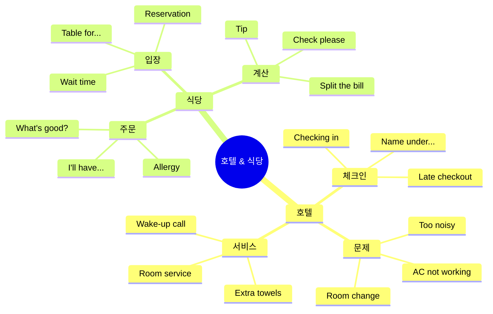

---

# 🏨 호텔 표현

## 호텔 체크인

### 체크인 전체 흐름

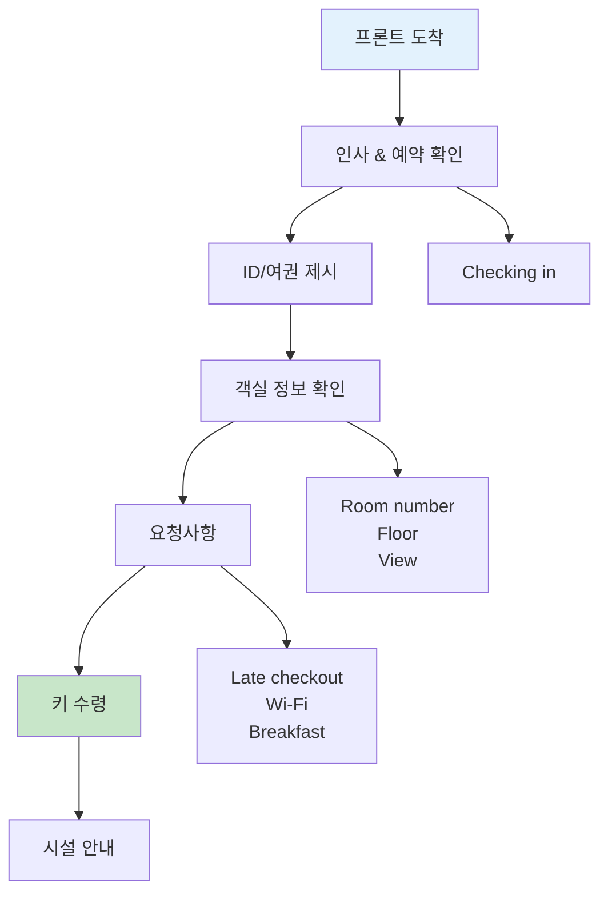

---

## 1️⃣ Checking in / Check out (체크인/아웃)

### 📖 기본 정보

| 표현 | 의미 | 사용 시점 |
|------|------|----------|
| **Check in** | 체크인하다 | 도착할 때 |
| **Check out** | 체크아웃하다 | 떠날 때 |

### 🎯 표현 방법

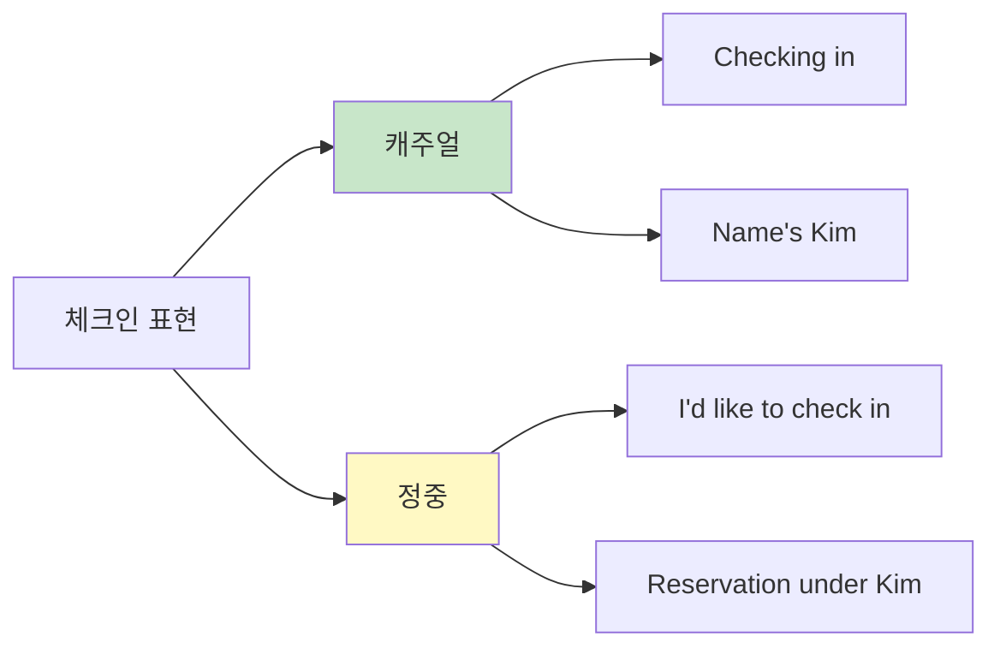

### 💬 실전 대화

```
캐주얼 체크인:
손님: "Hey! Checking in. Name's Kim."
직원: "Hey! Lemme find you... Got it!"
손님: "Sweet. What floor am I on?"
직원: "8th floor, room 812. Nice view!"

한국어:
손님: 안녕하세요! 체크인할게요. 이름은 김입니다.
직원: 안녕하세요! 찾아볼게요... 찾았습니다!
손님: 좋아요. 몇 층이에요?
직원: 8층, 812호실이에요. 전망 좋아요!
```

### 📌 핵심 표현

```
체크인 시작:
✅ "Checking in." (체킹 인)
   → 체크인할게요.

✅ "I have a reservation." (아이 해브 어 레저베이션)
   → 예약했어요.

✅ "Name's under Kim." (네임스 언더 킴)
   → 김으로 되어 있어요.

정보 확인:
✅ "What floor?" (왓 플로어?)
   → 몇 층이에요?

✅ "Do you have Wi-Fi?" (두 유 해브 와이파이?)
   → 와이파이 있나요?

✅ "Is breakfast included?" (이즈 브렉퍼스트 인클루디드?)
   → 조식 포함인가요?
```

---

## 2️⃣ Late checkout (늦은 체크아웃)

### 📖 기본 정보

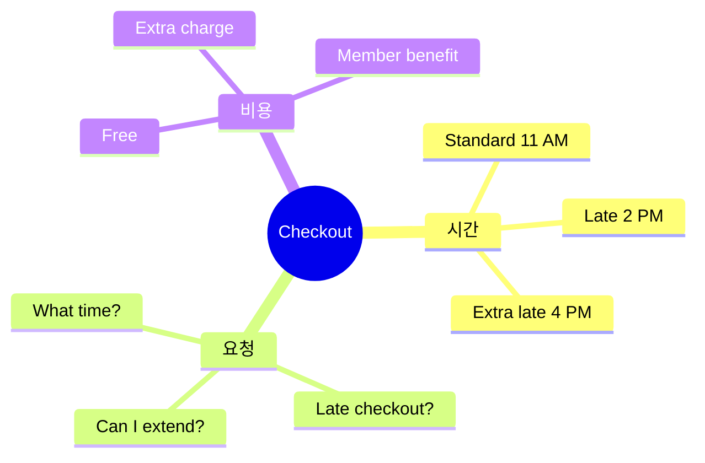

### 💬 실전 표현

```
요청하기:
✅ "Can I get a late checkout?"
   (캔 아이 겟 어 레잇 체크아웃?)
   → 늦은 체크아웃 가능한가요?

✅ "What time's checkout?"
   (왓 타임즈 체크아웃?)
   → 체크아웃 시간이 언제예요?

✅ "Can I extend till 2 PM?"
   (캔 아이 익스텐드 틸 투 피엠?)
   → 오후 2시까지 연장할 수 있나요?

직원 응답:
직원: "Usually it's noon, but I can do 2 PM."
      (유주얼리 잇츠 눈, 벗 아이 캔 두 투 피엠)
      → 보통은 정오인데, 2시까지 가능해요.

손님: "That'd be perfect."
      (댓드 비 퍼펙트)
      → 그게 완벽하겠네요.
```

---

## 객실 요청 & 문제 해결

### 자주 발생하는 문제

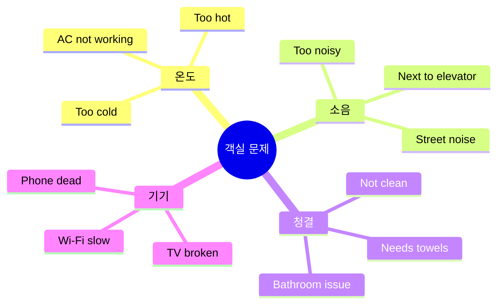

---

## 3️⃣ AC not working (에어컨 고장)

### 💬 문제 신고

```
문제 설명:
손님: "Hey, got a problem with my room."
직원: "Oh no! What's going on?"
손님: "The AC's not working. It's super hot."

한국어:
손님: 안녕하세요, 제 방에 문제가 있어요.
직원: 어머! 무슨 일이에요?
손님: 에어컨이 작동 안 해요. 엄청 더워요.
```

### 📌 유용한 표현

```
온도 관련:
✅ "It's too hot/cold."
   (잇츠 투 핫/콜드)
   → 너무 더워요/추워요.

✅ "The AC's broken."
   (디 에이씨즈 브로큰)
   → 에어컨이 고장났어요.

✅ "Can you send someone?"
   (캔 유 센드 썸원?)
   → 누구 보내주실 수 있나요?

해결책 제시:
직원: "I'll send someone right away."
      → 바로 누구 보낼게요.

직원: "Or I can move you to another room?"
      → 아니면 다른 방으로 옮겨드릴까요?

손님: "That'd be great!"
      → 그거 좋겠네요!
```

---

## 4️⃣ Too noisy (너무 시끄러움)

### 💬 실전 표현

```
문제 설명:
✅ "It's kinda noisy."
   (잇츠 카인더 노이지)
   → 좀 시끄러워요.

✅ "Can I get a quieter room?"
   (캔 아이 겟 어 콰이어터 룸?)
   → 더 조용한 방으로 바꿀 수 있나요?

✅ "Is there a room away from the elevator?"
   (이즈 데얼 어 룸 어웨이 프롬 디 엘러베이터?)
   → 엘리베이터에서 먼 방 있나요?

완곡한 표현:
✅ "It's a bit loud for me."
   (잇츠 어 빗 라우드 포 미)
   → 제겐 좀 시끄러워요.
```

---

## 룸서비스 & 부대시설

### 호텔 시설 마인드맵

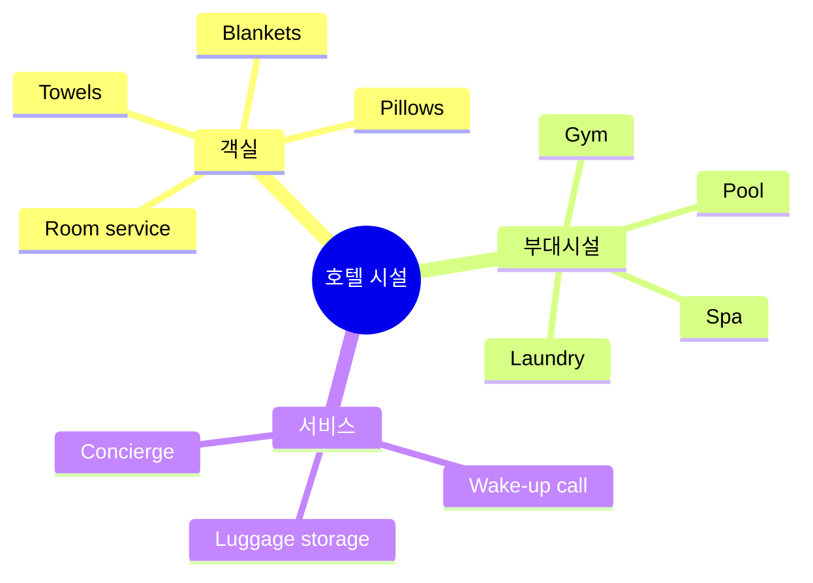

---

## 5️⃣ Room service (룸서비스)

### 💬 주문 대화

```
전화로 주문:
손님: "Hey, can I order room service?"
직원: "Sure thing! Whatcha want?"
손님: "What's good? Any recommendations?"
직원: "The burger's pretty fire. 🔥"
손님: "Ha! Okay, I'll try that."
직원: "Fries with it?"
손님: "Yeah, and maybe a beer?"
직원: "We got local craft and imports."
손님: "Whatever's popular."
직원: "I'll send up the IPA. It's really good."

한국어:
손님: 룸서비스 주문할 수 있나요?
직원: 물론이죠! 뭐 드시겠어요?
손님: 뭐가 맛있어요? 추천해주세요.
직원: 버거가 진짜 맛있어요.
손님: 하하! 좋아요, 그거로 할게요.
직원: 감자튀김 같이요?
손님: 네, 그리고 맥주도요?
직원: 로컬 수제맥주랑 수입맥주 있어요.
손님: 인기 있는 걸로요.
직원: IPA 보내드릴게요. 정말 맛있어요.
```

### 📌 핵심 표현

```
주문:
✅ "Can I order room service?"
   → 룸서비스 주문할 수 있나요?

✅ "How long will it take?"
   → 얼마나 걸려요?

✅ "Can I get extra towels too?"
   → 수건도 더 받을 수 있나요?
```

---

## 6️⃣ 부대시설 이용

### 💬 실전 표현

```
체육관:
✅ "Where's the gym?"
   (웨얼즈 더 짐?)
   → 헬스장이 어디예요?

✅ "What time's it open?"
   (왓 타임즈 잇 오픈?)
   → 몇 시에 열어요?

✅ "Is it 24/7?"
   (이즈 잇 트웬티포 세븐?)
   → 24시간인가요?

수영장:
✅ "Do you have a pool?"
   → 수영장 있나요?

✅ "Indoor or outdoor?"
   → 실내인가요 실외인가요?

세탁:
✅ "Is there laundry service?"
   → 세탁 서비스 있나요?

✅ "How much is it?"
   → 얼마예요?
```

---

# 🍽️ 식당 표현

## 식당 입장 & 주문

### 식당 이용 전체 흐름

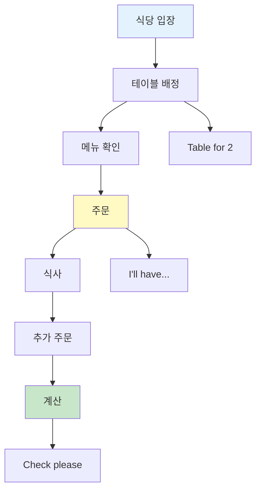

---

## 7️⃣ Table for... (몇 명 자리)

### 📖 기본 정보

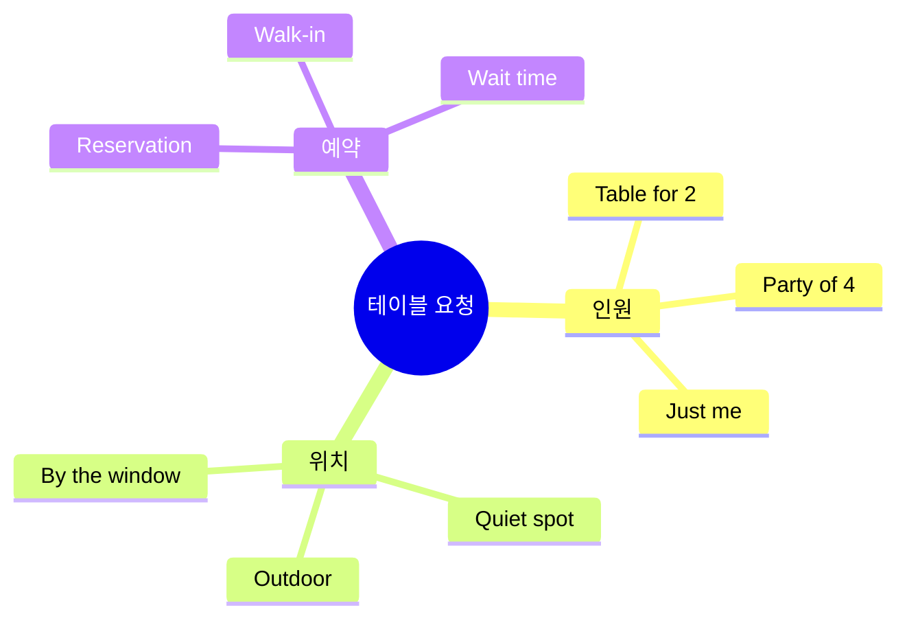

### 💬 실전 대화

```
입장:
손님: "Hi! Table for two?"
직원: "Hey! Sure, follow me."
손님: "Can we sit by the window?"
직원: "That one's taken, but this one's got a nice view too."
손님: "Works for me!"

한국어:
손님: 안녕하세요! 2명 자리 있나요?
직원: 안녕하세요! 네, 따라오세요.
손님: 창가에 앉을 수 있나요?
직원: 저기는 차있는데, 이 자리도 전망 좋아요.
손님: 괜찮아요!
```

### 📌 핵심 표현

```
인원:
✅ "Table for two, please."
   (테이블 포 투, 플리즈)
   → 2명 자리 주세요.

✅ "Party of four."
   (파티 오브 포)
   → 4명이에요.

✅ "Just me." / "Table for one."
   → 혼자예요.

대기:
✅ "How long's the wait?"
   (하우 롱즈 더 웨잇?)
   → 얼마나 기다려야 해요?

✅ "Can I wait at the bar?"
   → 바에서 기다려도 될까요?
```

---

## 8️⃣ What's good? (뭐가 맛있어요?)

### 📖 추천 요청

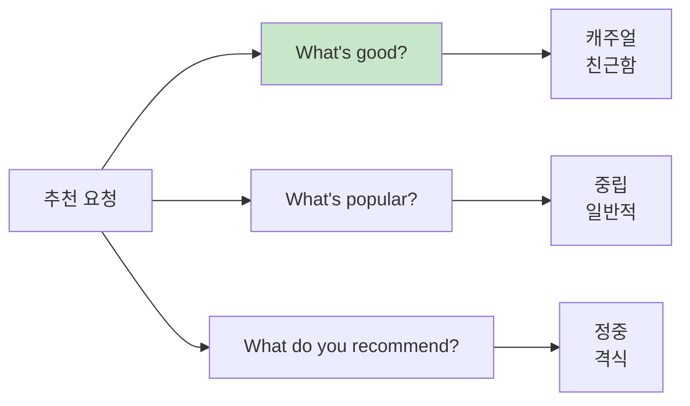

### 💬 실전 대화

```
추천 요청:
손님: "What's good here?"
직원: "The tacos are kinda famous."
손님: "Ooh! We'll do that then."
직원: "How many? They're pretty big."
손님: "Maybe 4 to share?"
직원: "Perfect. Coming right up!"

한국어:
손님: 여기 뭐가 맛있어요?
직원: 타코가 좀 유명해요.
손님: 오! 그럼 그걸로 할게요.
직원: 몇 개요? 꽤 커요.
손님: 나눠 먹으려고 4개요?
직원: 완벽해요. 바로 나갈게요!
```

### 📌 다양한 추천 요청

```
✅ "What's good here?"
   → 여기 뭐가 맛있어요? (가장 캐주얼)

✅ "What's popular?"
   → 뭐가 인기 있어요?

✅ "What do you recommend?"
   → 뭘 추천하시나요? (정중)

✅ "What's your favorite?"
   → 당신이 좋아하는 건 뭐예요?

✅ "Any specials today?"
   → 오늘 특별 메뉴 있나요?
```

---

## 음식 관련 표현

### 주문 방법

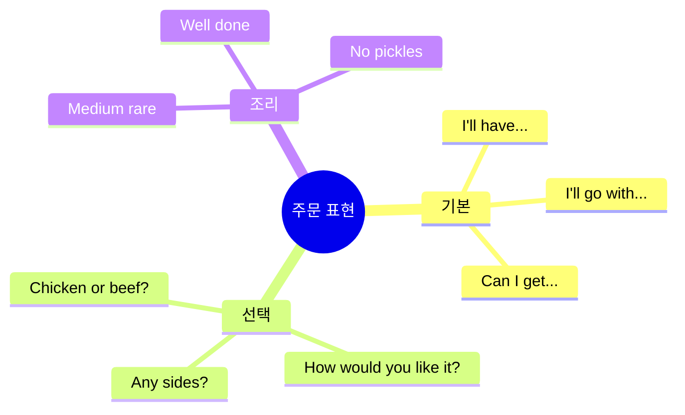

---

## 9️⃣ I'll have... / I'll go with... (주문할게요)

### 📖 주문 표현 비교

| 표현 | 격식도 | 뉘앙스 |
|------|:-----:|--------|
| **I'll have...** | ★★★ | 일반적, 정중 |
| **I'll go with...** | ★★ | 캐주얼, 선택 |
| **Can I get...** | ★★ | 요청 형태 |
| **Gimme...** | ★ | 매우 캐주얼 (조심!) |

### 💬 실전 표현

```
기본 주문:
✅ "I'll have the salmon."
   (아일 해브 더 새먼)
   → 연어로 할게요.

✅ "I'll go with the chicken."
   (아일 고 위드 더 치킨)
   → 치킨으로 할게요.

✅ "Can I get the pasta?"
   (캔 아이 겟 더 파스타?)
   → 파스타 주시겠어요?

조리 방법:
직원: "How would you like it cooked?"
손님: "Medium, please."
      → 미디엄으로요.

✅ Rare (레어) - 덜 익힘
✅ Medium rare (미디엄 레어) - 중간 덜 익힘
✅ Medium (미디엄) - 중간
✅ Well done (웰 던) - 완전히 익힘
```

---

## 🔟 Allergy (알레르기)

### 💬 알레르기 신고

```
중요한 대화:
손님: "Hey, quick question - I got allergies."
직원: "Oh for sure! What are you allergic to?"
손님: "Peanuts. Like, really allergic."
직원: "Okay, I'll make sure the kitchen knows."
손님: "Appreciate it. What's safe to order?"
직원: "The salmon's totally peanut-free."

한국어:
손님: 안녕하세요, 질문 있는데요 - 알레르기가 있어요.
직원: 아 네! 뭐에 알레르기 있으세요?
손님: 땅콩이요. 정말 심해요.
직원: 알겠습니다, 주방에 꼭 알려드릴게요.
손님: 감사합니다. 뭘 주문하면 안전해요?
직원: 연어는 완전히 땅콩 없어요.
```

### 📌 핵심 표현

```
알레르기 고지:
✅ "I have an allergy to..."
   (아이 해브 언 알러지 투...)
   → ~에 알레르기가 있어요.

✅ "I'm allergic to peanuts."
   (아임 알러직 투 피넛츠)
   → 땅콩 알레르기가 있어요.

✅ "Does this have nuts?"
   (더즈 디스 해브 넛츠?)
   → 이거 견과류 들어가나요?

✅ "Is it gluten-free?"
   → 글루텐 프리인가요?

확인:
✅ "Are you sure it's safe?"
   → 확실히 안전한가요?

✅ "Can you double-check with the kitchen?"
   → 주방에 다시 확인해주실 수 있나요?
```

---

## 계산 & 팁

### 계산 프로세스

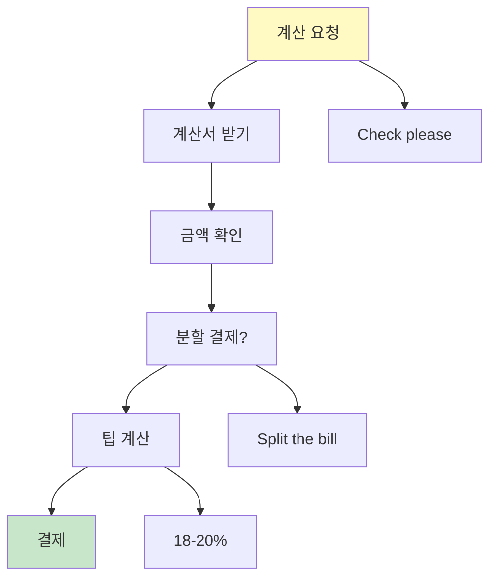

---

## 1️⃣1️⃣ Check please (계산서 주세요)

### 💬 실전 대화

```
계산 요청:
손님: "Hey, can we get the check?"
직원: "Sure thing! How was everything?"
손님: "Really good! But, um, small issue."
직원: "Oh no, what's up?"
손님: "I think we got charged twice for drinks."
직원: "Lemme look... Oh shoot, you're right!"
손님: "No biggie, mistakes happen."
직원: "So sorry! I'll fix it right now."

한국어:
손님: 계산서 주시겠어요?
직원: 물론이죠! 다 어떠셨어요?
손님: 정말 좋았어요! 근데, 음, 작은 문제가...
직원: 어머, 뭔데요?
손님: 음료를 두 번 계산하신 것 같아요.
직원: 볼게요... 앗 정말이네요!
손님: 괜찮아요, 실수는 있는 거죠.
직원: 죄송해요! 바로 고칠게요.
```

### 📌 핵심 표현

```
계산 요청:
✅ "Check, please?"
   (체크, 플리즈?)
   → 계산서 주세요.

✅ "Can we get the bill?"
   (캔 위 겟 더 빌?)
   → 계산서 받을 수 있을까요?

✅ "We're ready for the check."
   → 계산할게요.
```

---

## 1️⃣2️⃣ Split the bill (분할 결제)

### 💬 실전 표현

```
분할 요청:
손님: "Can we split the bill?"
직원: "Yeah! Two cards?"
손님: "Yep. Just split it 50-50."
직원: "Easy. Here you go."

한국어:
손님: 따로 계산할 수 있나요?
직원: 네! 카드 두 개요?
손님: 네. 반반으로요.
직원: 쉬워요. 여기요.
```

### 📌 분할 표현

```
✅ "Can we split this?"
   → 나눠서 낼 수 있나요?

✅ "Separate checks, please."
   → 따로따로 계산해주세요.

✅ "Split it 50-50."
   → 반반으로 나눠주세요.

✅ "Put it on two cards."
   → 카드 두 개로 나눠주세요.
```

---

## 1️⃣3️⃣ Tip (팁)

### 📖 팁 기본 가이드

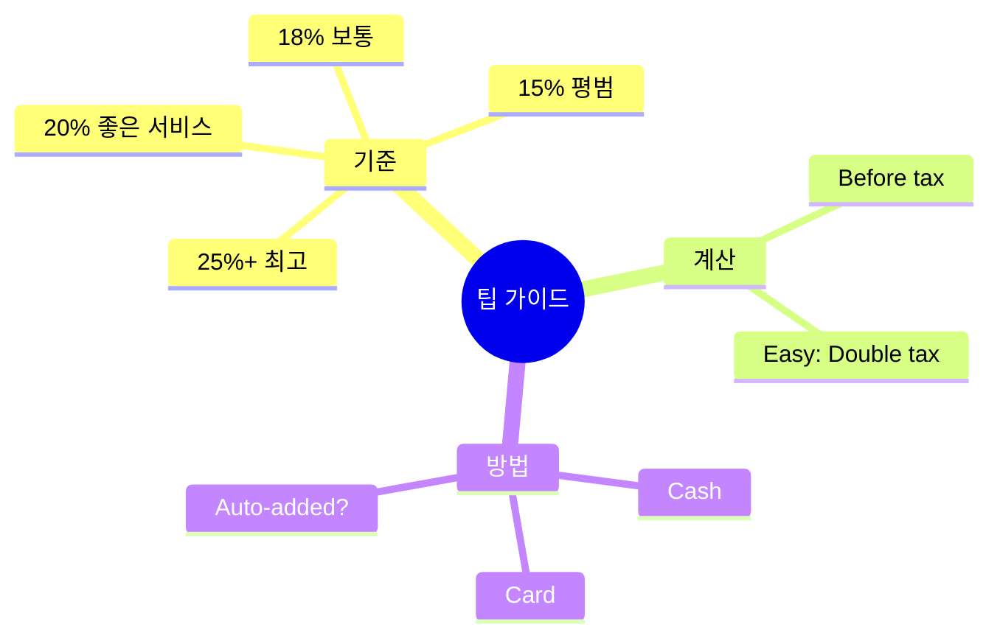

### 💬 팁 관련 질문

```
확인:
손님: "Do you add tip automatically?"
직원: "Nope, tip's up to you!"
손님: "What's standard here?"
직원: "Usually 18-20% for good service."
손님: "Cool, we'll do 20. You were great!"
직원: "Aww, thanks! Y'all are sweet."

한국어:
손님: 팁이 자동으로 포함되나요?
직원: 아니요, 팁은 선택이에요!
손님: 여기는 보통 얼마예요?
직원: 보통 좋은 서비스면 18-20%예요.
손님: 좋아요, 20% 줄게요. 서비스 훌륭했어요!
직원: 아, 감사합니다! 너무 친절하시네요.
```

### 📌 팁 계산법

```
쉬운 팁 계산:
1. 세금(Tax) 확인: 보통 8-10%
2. 세금 x 2 = 약 18-20%
3. 또는 총액의 20% = 총액 ÷ 5

예시:
음식값: $45
세금: $4.50 (10%)
팁: $9 (20%)
총액: $58.50
```

---

## 필수 표현 총정리

### 호텔 TOP 10

| 순위 | 표현 | 의미 | 상황 |
|:---:|------|------|------|
| 1 | Checking in | 체크인할게요 | 도착 |
| 2 | Late checkout? | 늦은 체크아웃? | 연장 |
| 3 | AC not working | 에어컨 고장 | 문제 |
| 4 | Too noisy | 너무 시끄러움 | 불편 |
| 5 | Room service | 룸서비스 | 주문 |
| 6 | Extra towels | 수건 추가 | 요청 |
| 7 | Where's the gym? | 헬스장 어디? | 시설 |
| 8 | Is Wi-Fi free? | 와이파이 무료? | 확인 |
| 9 | What time's breakfast? | 조식 시간? | 식사 |
| 10 | Can you store my luggage? | 짐 보관 가능? | 서비스 |

### 식당 TOP 10

| 순위 | 표현 | 의미 | 상황 |
|:---:|------|------|------|
| 1 | Table for two | 2명 자리 | 입장 |
| 2 | What's good? | 뭐가 맛있어요? | 추천 |
| 3 | I'll have... | ~로 할게요 | 주문 |
| 4 | I'm allergic to... | ~알레르기 | 중요 |
| 5 | Medium, please | 미디엄으로 | 조리 |
| 6 | Check, please | 계산서 주세요 | 계산 |
| 7 | Split the bill | 나눠서 계산 | 분할 |
| 8 | What's the tip? | 팁 얼마? | 확인 |
| 9 | This is great! | 정말 맛있어요! | 칭찬 |
| 10 | Thanks! | 고마워요! | 마무리 |

---

## 학습 체크리스트

### 호텔
- [ ] 체크인/아웃 표현 숙지
- [ ] 문제 신고 표현 암기
- [ ] 룸서비스 주문법 이해
- [ ] 부대시설 질문 연습

### 식당
- [ ] 테이블 요청 표현 숙지
- [ ] 주문 표현 다양화
- [ ] 알레르기 신고법 암기
- [ ] 계산 & 팁 개념 이해

---

*이 표현들로 편안한 숙박과 즐거운 식사를 즐기세요!*

---

## 🎯 전설의 10턴 대화 마스터

## 🏨 호텔 시나리오

### 호텔 상황 1: 체크인 + 객실 문의 (순조로운 체크인)

```
턴 1 - 손님: "Hey! Checking in. Name's under Kim."
턴 2 - 직원: "Welcome, Mr. Kim! Lemme find you... Got it! Room 812."
턴 3 - 손님: "Nice! What floor is that?"
턴 4 - 직원: "8th floor. Great view of the city!"
턴 5 - 손님: "Awesome! Is breakfast included?"
턴 6 - 직원: "Yep! 7 to 10 AM in the lobby restaurant."
턴 7 - 손님: "Perfect! Where's the gym?"
턴 8 - 직원: "2nd floor, open 24/7. Here's your key!"
턴 9 - 손님: "Thanks a bunch! Wi-Fi password?"
턴 10 - 직원: "It's on this card. Enjoy your stay!"

🇰🇷 한국어 번역:
턴 1 - 손님: 안녕하세요! 체크인할게요. 김으로 예약했어요.
턴 2 - 직원: 환영합니다, 김 님! 찾아볼게요... 찾았어요! 812호실이에요.
턴 3 - 손님: 좋네요! 몇 층이에요?
턴 4 - 직원: 8층이요. 도시 전망이 멋져요!
턴 5 - 손님: 좋아요! 조식 포함인가요?
턴 6 - 직원: 네! 오전 7시부터 10시까지 로비 레스토랑에서요.
턴 7 - 손님: 완벽해요! 헬스장은 어디예요?
턴 8 - 직원: 2층이요, 24시간 열려있어요. 여기 열쇠요!
턴 9 - 손님: 정말 감사합니다! 와이파이 비밀번호는요?
턴 10 - 직원: 이 카드에 있어요. 편히 쉬세요!

📝 핵심 표현:
• Checking in (체크인)
• Name's under... (~로 예약)
• What floor? (몇 층?)
• Is breakfast included? (조식 포함?)
• Where's the gym? (헬스장 어디?)
• Enjoy your stay (편히 쉬세요)
```

### 호텔 상황 2: 객실 문제 해결 (에어컨 고장)

```
턴 1 - 손님: "Hey, I got a problem with my room."
턴 2 - 직원: "Oh no! What's going on?"
턴 3 - 손님: "The AC's not working. It's super hot."
턴 4 - 직원: "I'm so sorry! Room number?"
턴 5 - 손님: "512. Can you send someone?"
턴 6 - 직원: "For sure! Or I can move you to another room right now?"
턴 7 - 손님: "Moving rooms would be better. I gotta rest."
턴 8 - 직원: "Totally understand! Room 618 is ready. Better view too!"
턴 9 - 손님: "You're a lifesaver! Thanks!"
턴 10 - 직원: "No worries! Here's the new key. Sorry for the trouble!"

🇰🇷 한국어 번역:
턴 1 - 손님: 안녕하세요, 제 방에 문제가 있어요.
턴 2 - 직원: 어머! 무슨 일이에요?
턴 3 - 손님: 에어컨이 작동 안 해요. 엄청 더워요.
턴 4 - 직원: 정말 죄송해요! 객실 번호가 어떻게 되세요?
턴 5 - 손님: 512호요. 누구 보내주실 수 있나요?
턴 6 - 직원: 물론이죠! 아니면 지금 바로 다른 방으로 옮겨드릴까요?
턴 7 - 손님: 방 옮기는 게 더 나을 것 같아요. 쉬어야 해서요.
턴 8 - 직원: 완전 이해해요! 618호가 준비됐어요. 전망도 더 좋아요!
턴 9 - 손님: 생명의 은인이에요! 감사합니다!
턴 10 - 직원: 걱정 마세요! 여기 새 열쇠요. 불편을 드려 죄송해요!

📝 핵심 표현:
• I got a problem (문제가 있어요)
• AC's not working (에어컨 고장)
• Can you send someone? (누구 보내주실 수 있나요?)
• Move you to another room (다른 방으로 옮기기)
• You're a lifesaver (생명의 은인)
```

### 호텔 상황 3: 체크아웃 + 늦은 체크아웃 요청

```
턴 1 - 손님: "Hi! What time's checkout?"
턴 2 - 직원: "Standard's 11 AM. Need a late checkout?"
턴 3 - 손님: "Yeah, can I extend till 2 PM? My flight's at 5."
턴 4 - 직원: "Lemme check... Yeah, no problem! Free of charge."
턴 5 - 손님: "Really? That's awesome! Can I store my luggage after?"
턴 6 - 직원: "For sure! We have luggage storage. Free service."
턴 7 - 손님: "Perfect! Where's a good place to eat around here?"
턴 8 - 직원: "There's an amazing taco place 2 blocks down. Super popular!"
턴 9 - 손님: "Sounds good! I'll check it out. Thanks for everything!"
턴 10 - 직원: "You bet! Enjoy your last day here!"

🇰🇷 한국어 번역:
턴 1 - 손님: 안녕하세요! 체크아웃 시간이 언제예요?
턴 2 - 직원: 기본은 오전 11시예요. 늦은 체크아웃 필요하세요?
턴 3 - 손님: 네, 오후 2시까지 연장할 수 있나요? 비행기가 5시예요.
턴 4 - 직원: 확인해볼게요... 네, 문제없어요! 무료예요.
턴 5 - 손님: 정말요? 좋네요! 그 후에 짐 보관할 수 있나요?
턴 6 - 직원: 물론이죠! 짐 보관소 있어요. 무료 서비스예요.
턴 7 - 손님: 완벽해요! 이 근처에 맛있는 곳 어디예요?
턴 8 - 직원: 2블록 아래에 타코 집이 대단해요. 엄청 인기 있어요!
턴 9 - 손님: 좋아요! 가볼게요. 모든 것에 감사합니다!
턴 10 - 직원: 당연하죠! 마지막 날 즐기세요!

📝 핵심 표현:
• What time's checkout? (체크아웃 시간?)
• Late checkout (늦은 체크아웃)
• Extend till 2 PM (2시까지 연장)
• Store my luggage (짐 보관)
• Thanks for everything (모든 것에 감사)
```

---

## 🍽️ 식당 시나리오

### 식당 상황 1: 입장 + 주문 + 추천받기

```
턴 1 - 손님: "Hey! Table for two?"
턴 2 - 호스트: "Sure! Follow me. Here good?"
턴 3 - 손님: "Perfect! By the window, nice!"
턴 4 - 서버: "Hi! I'm Jake. Can I start you with drinks?"
턴 5 - 손님: "What's good? Any specials?"
턴 6 - 서버: "The mango smoothie's kinda famous. And our burger's fire!"
턴 7 - 손님: "Ooh! I'll try the smoothie. And lemme get that burger."
턴 8 - 서버: "Great choice! How do you want it cooked?"
턴 9 - 손님: "Medium, please. With fries?"
턴 10 - 서버: "You got it! Coming right up!"

🇰🇷 한국어 번역:
턴 1 - 손님: 안녕하세요! 2명 자리 있나요?
턴 2 - 호스트: 네! 따라오세요. 여기 괜찮아요?
턴 3 - 손님: 완벽해요! 창가 옆이네요, 좋아요!
턴 4 - 서버: 안녕하세요! 저는 제이크예요. 음료 먼저 주문하시겠어요?
턴 5 - 손님: 뭐가 맛있어요? 특선 있나요?
턴 6 - 서버: 망고 스무디가 좀 유명해요. 그리고 저희 버거가 대박이에요!
턴 7 - 손님: 오! 스무디 먹어볼게요. 그리고 버거 주세요.
턴 8 - 서버: 좋은 선택이에요! 어떻게 익히실래요?
턴 9 - 손님: 미디엄으로요. 감자튀김이랑요?
턴 10 - 서버: 알겠습니다! 곧 나갈게요!

📝 핵심 표현:
• Table for two (2명 자리)
• Follow me (따라오세요)
• What's good? (뭐가 맛있어요?)
• Kinda famous (좀 유명함)
• Fire (대박) - 슬랭
• Coming right up (곧 나갈게요)
```

### 식당 상황 2: 알레르기 + 메뉴 변경

```
턴 1 - 손님: "Hey, quick question. I got allergies."
턴 2 - 서버: "Oh for sure! What are you allergic to?"
턴 3 - 손님: "Peanuts. Like, really allergic."
턴 4 - 서버: "Got it. I'll make sure the kitchen knows. What looks good?"
턴 5 - 손님: "The Thai salad? Does it have peanuts?"
턴 6 - 서버: "Actually, yeah. But we can make it without! No problem."
턴 7 - 손님: "That'd be perfect! And the grilled chicken?"
턴 8 - 서버: "Totally peanut-free! Great combo."
턴 9 - 손님: "Awesome! Thanks for checking. I appreciate it."
턴 10 - 서버: "Of course! Better safe than sorry. I'll put that in now."

🇰🇷 한국어 번역:
턴 1 - 손님: 안녕하세요, 질문 하나만요. 알레르기가 있어요.
턴 2 - 서버: 아 네! 뭐에 알레르기 있으세요?
턴 3 - 손님: 땅콩이요. 정말 심각해요.
턴 4 - 서버: 알겠습니다. 주방에 꼭 알려드릴게요. 뭐가 좋아 보이세요?
턴 5 - 손님: 타이 샐러드요? 땅콩 들어가나요?
턴 6 - 서버: 사실, 네. 근데 빼고 만들 수 있어요! 문제없어요.
턴 7 - 손님: 완벽하겠네요! 그리고 구운 치킨은요?
턴 8 - 서버: 완전 땅콩 없어요! 좋은 조합이에요.
턴 9 - 손님: 좋아요! 확인해주셔서 감사해요.
턴 10 - 서버: 당연하죠! 안전이 최우선이죠. 지금 주문 넣을게요.

📝 핵심 표현:
• I got allergies (알레르기 있어요)
• Really allergic (정말 심각함)
• Make it without (빼고 만들기)
• Totally peanut-free (완전 땅콩 없음)
• Better safe than sorry (안전이 최우선)
```

### 식당 상황 3: 계산 + 분할 결제 + 팁

```
턴 1 - 손님: "Hey, can we get the check?"
턴 2 - 서버: "Sure thing! How was everything?"
턴 3 - 손님: "Really good! The burger was amazing."
턴 4 - 서버: "Yay! Glad you liked it. One check or separate?"
턴 5 - 손님: "Can we split it? Two cards."
턴 6 - 서버: "No prob! I'll split it 50-50. Be right back."
턴 7 - (돌아와서) 서버: "Here you go! Both $32.50."
턴 8 - 손님: "Perfect! (카드 주기) What's typical for tip?"
턴 9 - 서버: "Usually 18-20% for good service. But it's up to you!"
턴 10 - 손님: "You were awesome! We'll do 20. Thanks!"

🇰🇷 한국어 번역:
턴 1 - 손님: 안녕하세요, 계산서 주시겠어요?
턴 2 - 서버: 물론이죠! 다 어떠셨어요?
턴 3 - 손님: 정말 좋았어요! 버거가 대단했어요.
턴 4 - 서버: 야호! 좋아하셨다니 다행이에요. 한 장으로 할까요 따로 할까요?
턴 5 - 손님: 나눠서 할 수 있나요? 카드 두 개요.
턴 6 - 서버: 문제없어요! 반반으로 나눌게요. 곧 올게요.
턴 7 - (돌아와서) 서버: 여기요! 각각 32.50달러예요.
턴 8 - 손님: 완벽해요! (카드 주기) 팁은 보통 얼마예요?
턴 9 - 서버: 보통 좋은 서비스면 18-20%예요. 하지만 선택이에요!
턴 10 - 손님: 정말 훌륭했어요! 20% 줄게요. 감사합니다!

📝 핵심 표현:
• Can we get the check? (계산서 주세요)
• How was everything? (다 어떠셨어요?)
• Split it (나눠서 계산)
• Two cards (카드 두 개)
• What's typical for tip? (팁은 보통 얼마?)
• You were awesome! (훌륭했어요!)
```

---

## 📝 호텔 & 식당 마스터 테스트

### 테스트 1: 상황별 필수 표현 (10문제)

```
빈칸에 적절한 단어를 넣으세요.

호텔:
1. "_______ in. Name's under Kim."
2. "Is _______ included?"
3. "What _______ is checkout?"
4. "The AC's not _______."
5. "Can I _______ my luggage?"

식당:
6. "_______ for two, please."
7. "What's _______?"
8. "I got _______."
9. "Can we _______ the check?"
10. "Can we _______ it?"
```

<details>
<summary>✅ 정답 확인</summary>

1. **Checking** (체크인)
2. **breakfast** (조식)
3. **time** (시간)
4. **working** (작동)
5. **store** (보관)
6. **Table** (테이블)
7. **good** (맛있는 것)
8. **allergies** (알레르기)
9. **get** (받다)
10. **split** (나누다)

</details>

---

### 테스트 2: 상황 구별하기 (5문제)

```
다음 표현이 호텔(H)인지 식당(R)인지 구별하세요.

1. "Checking in" - ___
2. "Table for two" - ___
3. "Late checkout" - ___
4. "Split the bill" - ___
5. "AC not working" - ___
```

<details>
<summary>✅ 정답 확인</summary>

1. **H** (Hotel - 호텔)
2. **R** (Restaurant - 식당)
3. **H** (Hotel - 호텔)
4. **R** (Restaurant - 식당)
5. **H** (Hotel - 호텔)

</details>

---

### 테스트 3: 문제 해결 대화 (5문제)

```
각 문제 상황에 어떻게 대응할지 쓰세요.

호텔:
1. 방이 너무 시끄럽습니다.
   나: _________________________________

2. 체크아웃을 연장하고 싶습니다.
   나: _________________________________

식당:
3. 주문이 잘못 나왔습니다.
   나: _________________________________

4. 추천 메뉴를 물어보고 싶습니다.
   나: _________________________________

5. 계산을 따로 하고 싶습니다.
   나: _________________________________
```

<details>
<summary>✅ 정답 확인 (모범 답안)</summary>

**호텔:**
1. **"Hey, my room's kinda noisy. Can I get a quieter room?"**
   → 공손하게 문제 설명 + 해결책 요청

2. **"Hi! Can I extend my checkout till 2 PM? My flight's at 5."**
   → 이유와 함께 연장 요청

**식당:**
3. **"Excuse me, I ordered the salmon but got the chicken?"**
   → 정중하게 실수 지적

4. **"What's good here? Any recommendations?"**
   → 자연스러운 추천 요청

5. **"Can we split the bill? Separate checks, please."**
   → 명확한 분할 결제 요청

</details>

---

### 테스트 4: 10턴 대화 완성 - 호텔 (종합)

```
상황: 체크인 + 객실 문의 + 시설 안내

턴 1 - 나: _________________________________
턴 2 - 직원: _________________________________
턴 3 - 나: _________________________________
턴 4 - 직원: _________________________________
턴 5 - 나: _________________________________
턴 6 - 직원: _________________________________
턴 7 - 나: _________________________________
턴 8 - 직원: _________________________________
턴 9 - 나: _________________________________
턴 10 - 직원: _________________________________

필수 포함:
□ 체크인
□ 객실 번호 확인
□ 조식 문의
□ 시설 문의 (헬스장/수영장)
□ 감사 표현
```

<details>
<summary>💡 모범 답안</summary>

**턴 1 - 나:** "Hi! Checking in. Reservation under Park."

**턴 2 - 직원:** "Welcome! Let me find you... Room 1205!"

**턴 3 - 나:** "Great! Is breakfast included?"

**턴 4 - 직원:** "Yes! 6:30 to 10 AM, ground floor."

**턴 5 - 나:** "Perfect! Where's the gym?"

**턴 6 - 직원:** "3rd floor. Also, we have a rooftop pool!"

**턴 7 - 나:** "Awesome! Pool hours?"

**턴 8 - 직원:** "7 AM to 10 PM. Here's your key and Wi-Fi code."

**턴 9 - 나:** "Thanks so much! You've been super helpful!"

**턴 10 - 직원:** "No worries! Enjoy your stay!"

</details>

---

### 테스트 5: 10턴 대화 완성 - 식당 (종합)

```
상황: 입장 + 알레르기 + 주문 + 계산

턴 1 - 나: _________________________________
턴 2 - 호스트: _________________________________
턴 3 - 나: _________________________________
턴 4 - 서버: _________________________________
턴 5 - 나: _________________________________
턴 6 - 서버: _________________________________
턴 7 - 나: _________________________________
턴 8 - 서버: _________________________________
턴 9 - 나: _________________________________
턴 10 - 서버: _________________________________

필수 포함:
□ 테이블 요청
□ 알레르기 고지
□ 메뉴 주문
□ 계산 요청
□ 팁 확인
```

<details>
<summary>💡 모범 답안</summary>

**턴 1 - 나:** "Hi! Table for one, please?"

**턴 2 - 호스트:** "Sure! Right this way."

**턴 3 - 나:** "Thanks! Quick heads up - I'm allergic to shellfish."

**턴 4 - 서버:** "Good to know! I'll make sure. What can I get you?"

**턴 5 - 나:** "What's good? No shellfish, please."

**턴 6 - 서버:** "The grilled salmon is amazing and totally safe!"

**턴 7 - 나:** "Perfect! I'll have that. Medium, please."

**턴 8 - 서버:** "Coming right up!"

(식사 후)

**턴 9 - 나:** "That was great! Check, please? What's typical for tip?"

**턴 10 - 서버:** "Usually 18-20%. Thanks for dining with us!"

</details>

---

## 🎓 학습 완료 체크리스트

### 호텔 마스터 ✅
- [ ] 체크인 표현 완벽 숙지
- [ ] 객실 문제 대처 가능
- [ ] 시설 문의 자연스럽게 가능
- [ ] 체크아웃 및 연장 요청 가능
- [ ] 호텔 10턴 대화 3개 유창하게 말하기

### 식당 마스터 ✅
- [ ] 테이블 요청 및 입장 완벽
- [ ] 알레르기 명확히 고지 가능
- [ ] 추천 요청 및 주문 자연스럽게
- [ ] 계산 및 팁 이해
- [ ] 식당 10턴 대화 3개 유창하게 말하기

### 실전 준비도 🔥
- [ ] 테스트 1-5 모두 80% 이상
- [ ] 호텔과 식당 표현 구별 가능
- [ ] 문제 상황에 즉각 대응 가능
- [ ] 자연스러운 대화 흐름 유지
- [ ] 감사와 공손함 표현 적절히 사용

---

## 💡 실전 꿀팁

### 호텔 체크인 시
```
✅ 미리 준비할 것:
- 예약 확인서 (이메일)
- 신용카드 (보증금)
- ID/여권

✅ 꼭 물어볼 것:
- 조식 시간 및 장소
- 체크아웃 시간
- Wi-Fi 비밀번호
- 시설 위치 (헬스장, 수영장)
```

### 식당 이용 시
```
✅ 입장 시:
- 예약 확인 또는 인원 수 말하기
- 알레르기 즉시 고지

✅ 주문 시:
- 추천 요청: "What's good?"
- 조리법 확인: "How's it cooked?"
- 사이드 확인: "What comes with it?"

✅ 계산 시:
- 팁 기준: 18-20% (좋은 서비스)
- 분할 결제: 미리 말하기
- 영수증: 꼭 확인
```

---

**Last Updated: 2026-01-11**

