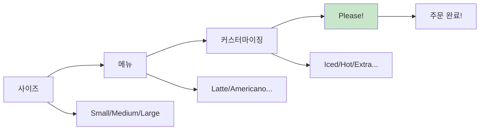
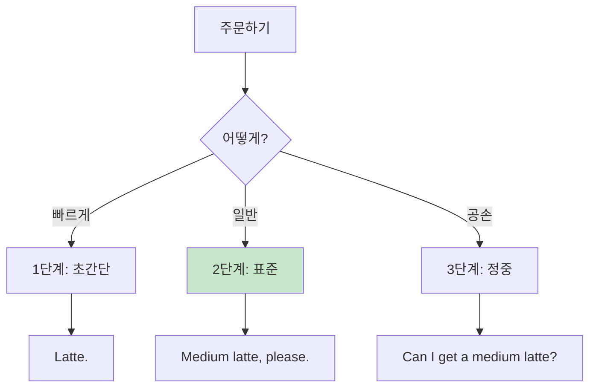
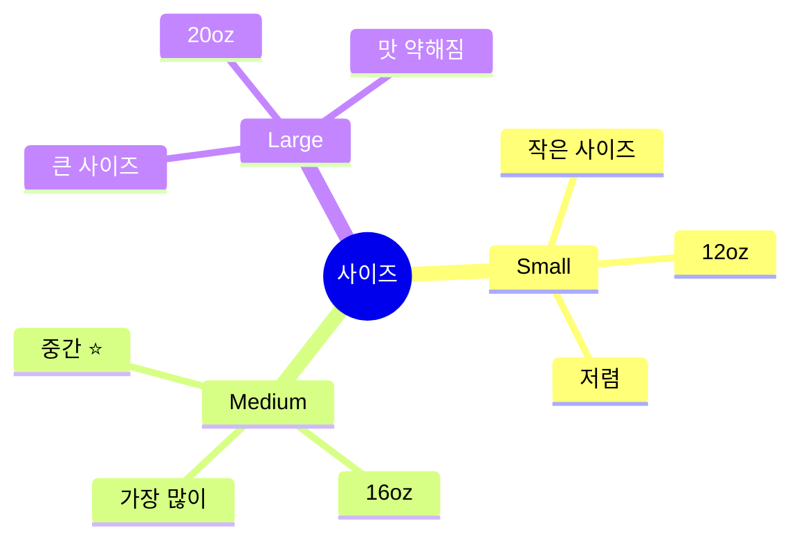
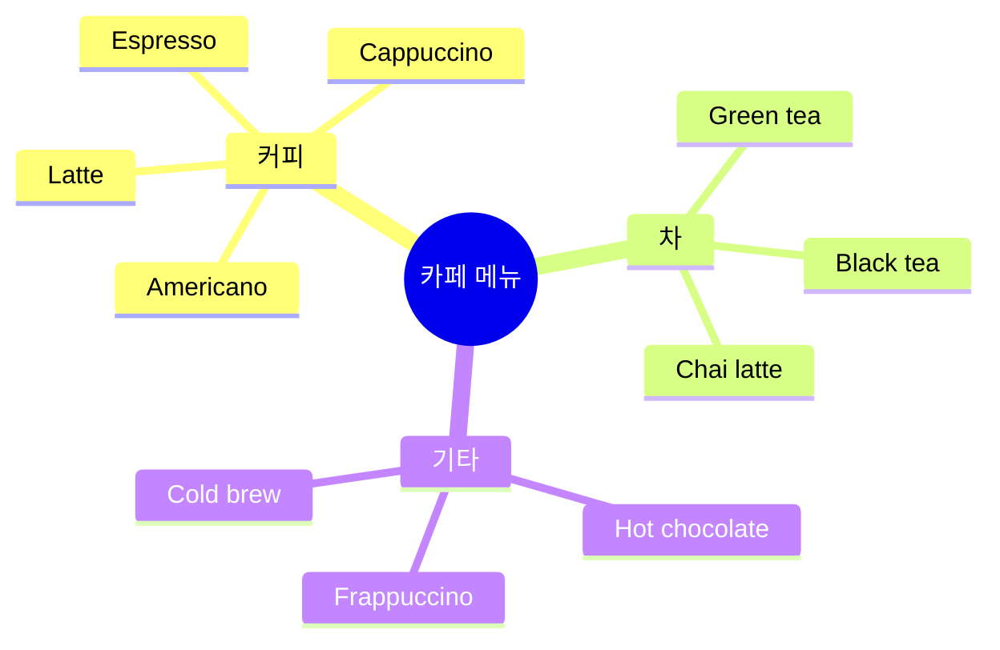
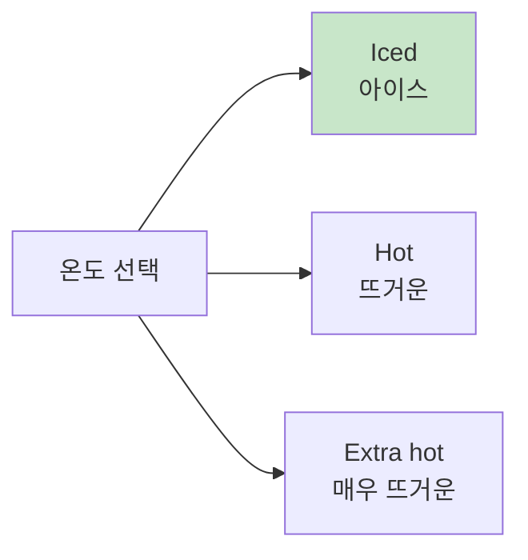
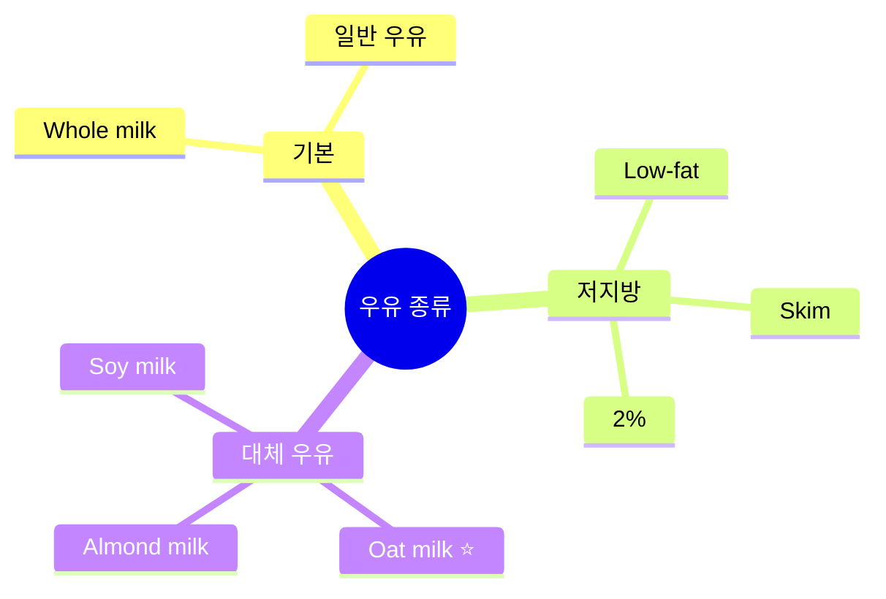
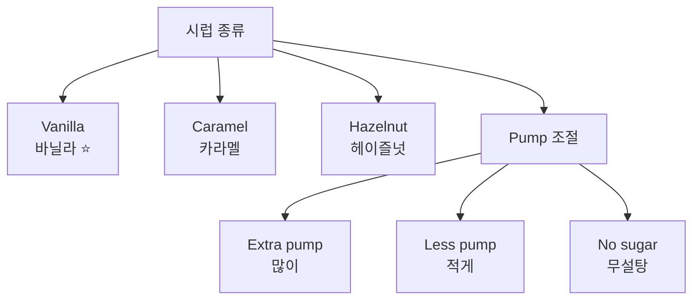

# ☕ 카페 주문 청크 실전 가이드
## 스타벅스부터 로컬 카페까지 완벽 마스터

---

## 🎯 이 가이드의 목표

### 카페 주문 = 여행의 일상!

```
❌ 흔한 실수:
"Um... I want... coffee... 
with milk... and sugar... 
and... medium size?"
→ 느림, 복잡, 헷갈림

✅ 청크로 주문:
"Medium latte, please."
→ 빠름, 명확, 완벽!

💡 핵심: 사이즈 + 메뉴 + Please!
```

### 🏆 학습 목표

```
✅ 카페 주문 필수 청크 20개 마스터
✅ 3단계 응용 (캐주얼/표준/정중)
✅ 스타벅스 용어 완벽 이해
✅ 커스터마이징 자유자재
✅ 1초 주문 가능!
```

---

## 📋 목차

1. [카페 주문 청크 시스템](#카페-주문-청크-시스템)
2. [사이즈 & 메뉴 청크](#사이즈--메뉴-청크)
3. [커스터마이징 청크](#커스터마이징-청크)
4. [결제 & 픽업 청크](#결제--픽업-청크)
5. [실전 시뮬레이션](#실전-시뮬레이션)

---

## 카페 주문 청크 시스템

### 💡 카페 주문 공식



### 🎯 기본 청크 공식

```
공식 1 (기본):
사이즈 + 메뉴 + Please
"Medium latte, please."

공식 2 (온도):
온도 + 사이즈 + 메뉴 + Please
"Iced medium latte, please."

공식 3 (커스터마이징):
사이즈 + 메뉴 + 옵션 + Please
"Large latte, extra shot, please."

💡 핵심: 순서만 외우면 끝!
```

### 3단계 주문 시스템



---

## 사이즈 & 메뉴 청크

### 🔹 사이즈 청크

#### 일반 카페



**사이즈 청크:**

| 사이즈 | 청크 | 발음 | 추천도 |
|--------|------|------|:------:|
| Small | "Small" | 스몰 | ⭐⭐⭐ |
| Medium | "Medium" | 미디엄 | ⭐⭐⭐⭐⭐ |
| Large | "Large" | 라지 | ⭐⭐⭐⭐ |

#### 스타벅스 사이즈

```
스타벅스 특수 용어:
- Tall = Small (12oz)
- Grande = Medium (16oz) ⭐
- Venti = Large (20oz, 24oz)

💡 팁: 
스타벅스: "Grande latte, please."
일반 카페: "Medium latte, please."
```

**3단계 사이즈 주문:**

| 단계 | 청크 | 상황 |
|:---:|------|------|
| 1단계 | "Grande." | 사이즈만 (메뉴는 이미 말함) |
| 2단계 | "Grande latte." | 사이즈 + 메뉴 ⭐ |
| 3단계 | "Grande latte, please." | 완벽! |

---

### 🔹 기본 메뉴 청크

#### TOP 10 카페 메뉴



#### 청크 1: Americano (아메리카노) ⭐

**3단계 주문:**

| 단계 | 청크 | 설명 |
|:---:|------|------|
| 1단계 | "Americano." | 메뉴만 |
| 2단계 | "Medium americano, please." | 기본 ⭐ |
| 3단계 | "Can I get a medium americano?" | 정중 |

**온도 추가:**
- "Iced americano" (아이스)
- "Hot americano" (핫) - 보통 생략

**실전 대화:**
```
바리스타: "What can I get you?"
당신: "Medium iced americano, please."
      ↑ 완벽한 청크!

바리스타: "Anything else?"
당신: "That's it, thanks!"
      ↑ 간단!
```

#### 청크 2: Latte (라떼) ⭐

**3단계 주문:**

| 단계 | 청크 |
|:---:|------|
| 1단계 | "Latte." |
| 2단계 | "Medium latte, please." ⭐ |
| 3단계 | "Can I get a medium latte, please?" |

**종류:**
- "Vanilla latte" (바닐라 라떼)
- "Caramel latte" (카라멜 라떼)
- "Oat milk latte" (오트밀 라떼)

#### 청크 3: Cappuccino (카푸치노)

**주문 청크:**
```
"Medium cappuccino, please."

⚠️ 발음 주의:
카-푸-치-노 (4음절)
강세: 푸(pu)
```

#### 청크 4: Cold Brew (콜드브루)

**주문 청크:**
```
"Large cold brew, please."

💡 특징:
- 아이스만 있음 (hot 없음)
- 진한 맛
- 카페인 많음
```

#### 청크 5: Frappuccino (프라푸치노)

**주문 청크:**
```
스타벅스:
"Grande caramel frappuccino, please."

일반 카페:
"Medium caramel frappe, please."

💡 설명:
Frappuccino = 얼음 + 커피 + 우유 블렌딩
```

---

### 🔹 커스터마이징 청크

#### 온도 청크



**온도 청크:**

| 청크 | 한국어 | 위치 | 예시 |
|------|--------|------|------|
| **Iced** | 아이스 | 맨 앞 | "Iced medium latte" ⭐ |
| **Hot** | 뜨거운 | 보통 생략 | "Hot latte" (거의 안 씀) |
| **Extra hot** | 매우 뜨거운 | 맨 앞 | "Extra hot latte" |

#### 우유 청크



**우유 청크:**

| 청크 | 한국어 | 추가 요금 | 추천도 |
|------|--------|:--------:|:-----:|
| "Whole milk" | 일반 우유 | ❌ | ⭐⭐⭐ |
| "Oat milk" | 귀리 우유 | ✅ | ⭐⭐⭐⭐⭐ |
| "Almond milk" | 아몬드 우유 | ✅ | ⭐⭐⭐⭐ |
| "Soy milk" | 두유 | ✅ | ⭐⭐⭐ |
| "Skim milk" | 무지방 | ❌ | ⭐⭐ |

**주문 방법:**
```
"Medium latte with oat milk, please."
        ↑      ↑
     메뉴    우유 종류
```

#### 샷 추가 청크

```
청크:
"Extra shot" (샷 추가)

주문:
"Large americano, extra shot, please."

💡 설명:
- Extra shot = 에스프레소 1샷 추가
- 카페인 UP!
- 진한 맛
```

#### 시럽/맛 청크



**시럽 청크:**

| 청크 | 주문 예시 |
|------|----------|
| **Vanilla** | "Vanilla latte, please." ⭐ |
| **Caramel** | "Caramel latte, please." |
| **Hazelnut** | "Hazelnut latte, please." |
| **No sugar** | "Latte, no sugar, please." |
| **Extra sweet** | "Extra sweet, please." |
| **Less sweet** | "Less sweet, please." |

#### 휘핑크림 청크

```
청크:
"With whipped cream" (휘핑 추가)
"No whip" (휘핑 빼기)

주문:
"Mocha, no whip, please."
"Hot chocolate, extra whip!"

💡 팁: 모카는 기본 휘핑 있음
```

---

## 결제 & 픽업 청크

### 🔹 주문 확인 청크

```
바리스타: "Anything else?"
(더 필요한 거 있나요?)

답변 청크:

끝:
"That's it, thanks!" ⭐
"That's all!"
"Just that!"

추가:
"And a cookie, please."
"Can I get a muffin too?"
```

### 🔹 이름 청크

```
바리스타: "Name for the order?"
(주문 이름?)

답변 청크:

1단계: "Kim."
2단계: "K-I-M."
3단계: "Kim, K-I-M."

💡 팁:
- 한 음절 이름은 철자 말하기
- 알파벳으로 명확하게
```

### 🔹 결제 청크

```
바리스타: "That'll be $5.50."

답변 청크:

카드:
"Card, please." ⭐
(카드를 건네거나 터치)

현금:
"Here you go." (돈 건네며)

Apple Pay:
"Apple Pay." (폰 준비하며)

💡 팁: 팁은 선택!
- 0-20% 자유
- 터치 스크린에서 선택
```

### 🔹 픽업 청크

```
바리스타: "I'll have that right out."
(곧 나와요)

답변 청크:
"Thanks!" ⭐
"Sounds good!"
"No prob!"

--- 음료 나옴 ---

바리스타: "Medium latte for Kim!"

당신: "Thanks!" (받으며)
      "That's me!" (내 거!)
```

---

## 실전 시뮬레이션

### 🎬 시나리오 1: 기본 주문 (스타벅스)

```
바리스타: "Hi! What can I get for you?"
당신: "Grande iced latte, please."
      ↑ 사이즈 + 온도 + 메뉴 + Please

바리스타: "Anything else?"
당신: "That's it, thanks!"
      ↑ 간단 종료!

바리스타: "Name?"
당신: "Kim, K-I-M."
      ↑ 철자 명확히!

바리스타: "$5.50."
당신: (카드 건네며) "Card."

바리스타: "I'll have that right out."
당신: "Thanks!"

--- 2분 후 ---

바리스타: "Grande iced latte for Kim!"
당신: "Thanks!" (받으며)

⏱️ 소요 시간: 30초
✅ 완벽한 주문!
```

### 🎬 시나리오 2: 커스터마이징 주문

```
바리스타: "What can I get started for you?"
당신: "Medium latte with oat milk, please."
      ↑ 메뉴 + 우유 변경

바리스타: "Iced or hot?"
당신: "Iced."
      ↑ 간단!

바리스타: "Anything else?"
당신: "Can I get that with an extra shot?"
      ↑ 샷 추가 요청

바리스타: "Sure! That'll be $7.25."
당신: "Card." (터치 결제)

바리스타: "Name?"
당신: "Kim."

바리스타: "Got it. Be ready in a few."
당신: "Thanks!"

✅ 결과: 커스텀 완벽!
💡 포인트: 우유 변경 + 샷 추가
```

### 🎬 시나리오 3: 여러 개 주문

```
바리스타: "What can I get you?"
당신: "Two medium lattes, please."
      ↑ 수량 + 메뉴

바리스타: "Both iced?"
당신: "One iced, one hot."
      ↑ 구분!

바리스타: "Got it. Anything else?"
당신: "And two croissants."
      ↑ 음식 추가

바리스타: "Perfect. $15.50."
당신: (카드 건네며) "Here."

바리스타: "Name?"
당신: "Kim."

--- 음료 나옴 ---

바리스타: "Two lattes and two croissants for Kim!"
당신: "Perfect, thanks!"

✅ 결과: 여러 개 주문 성공!
```

### 🎬 시나리오 4: 문제 상황

```
--- 주문 실수 ---

바리스타: "Tall vanilla latte for Kim!"
당신: "Sorry, I ordered grande."
      ↑ 정정!

바리스타: "Oh, my bad! I'll fix that."
당신: "No worries, thanks!"
      ↑ 만능 청크!

--- 잘못 나옴 ---

당신: "Excuse me, this is hot. I ordered iced."
      ↑ 명확하게!

바리스타: "I'm so sorry! Let me remake that."
당신: "Appreciate it!"
      ↑ 감사 청크!

--- 다시 나옴 ---

바리스타: "Here's your iced latte. Sorry about that!"
당신: "No problem! Thanks!"
      ↑ 긍정적 마무리!

✅ 문제 해결 완료!
💡 핵심: 명확 + 공손
```

---

## 🎯 상황별 주문 청크 모음

### ☀️ 아침 주문

```
시나리오: 아침 출근길

빠른 주문:
"Medium americano to go, please."
         ↑      ↑
      사이즈   포장

+ 음식:
"And a bagel with cream cheese."

💡 팁:
- To go = 포장
- For here = 먹고 가기
- 아침은 빠르게!
```

### 🌞 오후 주문

```
시나리오: 오후 카페

여유 있게:
"Can I get a large iced latte with oat milk?"
      ↑                    ↑
    정중하게            커스터마이징

+ 디저트:
"And can I see the cake menu?"

💡 팁: 오후는 천천히 여유롭게
```

### ❄️ 겨울 주문

```
시나리오: 추운 겨울

따뜻하게:
"Extra hot medium latte, please."
 ↑
매우 뜨겁게

+ 달콤하게:
"With caramel syrup."

💡 팁: Extra hot으로 오래 따뜻!
```

### 🏃 급할 때

```
시나리오: 시간 없음

초고속:
"Large americano, to go!"
        ↑          ↑
      큰 사이즈   포장

결제:
(카드 미리 준비)
"Card!"

💡 팁:
- 간단한 메뉴 (아메리카노)
- To go 강조
- 결제 빠르게
```

---

## 📝 카페 주문 마스터 체크리스트

### 기본 청크 (10개)

```
□ Medium latte, please
□ Iced americano
□ Grande latte (스타벅스)
□ With oat milk
□ Extra shot
□ That's it, thanks
□ Card, please
□ K-I-M (이름 철자)
□ To go
□ Thanks! (픽업 시)
```

### 커스터마이징 청크 (10개)

```
□ Iced/Hot
□ Oat milk/Almond milk
□ Extra shot
□ Vanilla latte
□ No sugar
□ Extra hot
□ No whip
□ Less sweet
□ Extra pump
□ With cream
```

### 응대 청크 (5개)

```
□ That's it!
□ No worries!
□ Appreciate it!
□ Thanks!
□ Sounds good!
```

---

## 💡 카페 문화 팁

### 미국 카페 에티켓

```
✅ DO (해야 할 것):
- 줄 서서 기다리기
- 명확하게 주문
- 이름 또렷하게
- 감사 표현 ("Thanks!")
- 테이블 정리 (쓰레기)

❌ DON'T (하지 말 것):
- 줄 끼어들기
- 큰 소리로 통화
- 오래 자리 차지 (바쁠 때)
- 쓰레기 안 치우기
```

### 팁 문화

```
카페 팁 가이드:

스타벅스/체인점:
- 팁 선택 (0-20%)
- 스크린에서 선택
- 안 줘도 OK

로컬 카페:
- 팁 권장 (15-20%)
- 서비스 좋으면 20%
- 단골 되고 싶으면 꼭!

💡 팁 주는 법:
1. 카드: 스크린에서 선택
2. 현금: 팁 병에 넣기
```

### 혼잡 시간 피하기

```
바쁜 시간:
🔴 7-9 AM (출근 시간)
🔴 12-1 PM (점심 시간)
🔴 3-4 PM (오후 카페인)

한가한 시간:
🟢 10-11 AM (여유)
🟢 2-3 PM (조용)
🟢 7-8 PM (저녁)

💡 팁: 바쁜 시간엔 간단하게!
```

---

## 🏆 최종 마스터 체크

### 주문 자동화 레벨

```
레벨 1: 초보 (5초+)
"Um... medium... latte... please?"
→ 더 연습 필요!

레벨 2: 중급 (3초)
"Medium latte, please."
→ 기본은 됨!

레벨 3: 고급 (1초)
"Iced medium latte with oat milk!"
→ 커스터마이징 가능!

레벨 4: 마스터 (0.5초)
상황 보자마자 자동으로!
→ 현지인 급! 🏆

🎯 목표: 레벨 3 이상!
```

### 최종 시뮬레이션 테스트

```
테스트 시나리오:

1. 기본 주문 (라떼)
2. 아이스 아메리카노
3. 우유 변경 (오트밀)
4. 샷 추가
5. 시럽 추가 (바닐라)
6. 여러 개 주문
7. 포장 주문
8. 문제 해결
9. 이름 철자
10. 감사 인사

✅ 10개 모두 1초 안에 → 마스터!
```

---

**카페 주문 청크 마스터 완료! ☕**

> "사이즈 + 메뉴 + Please = 완벽!"
> 
> Size + Menu + Please = Perfect!

**Last Updated: 2026-01-11**

