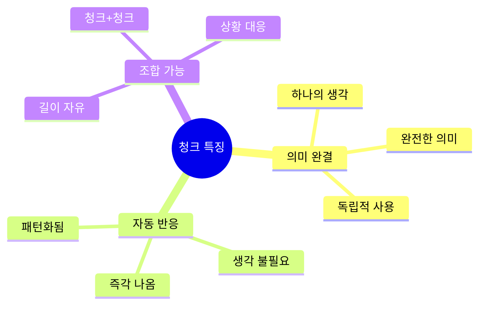
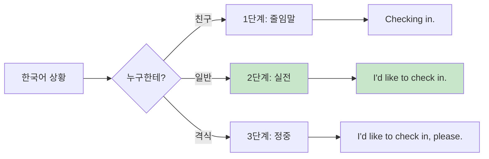
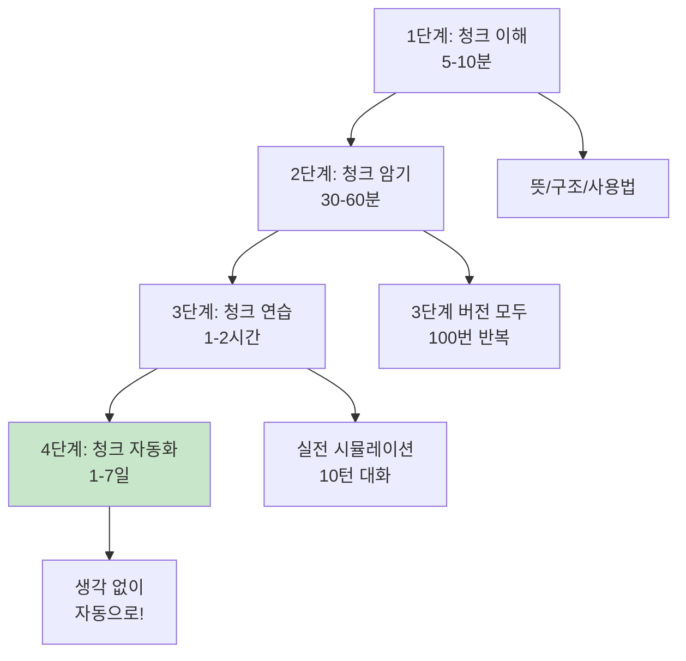
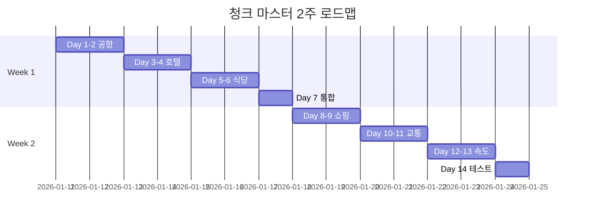

# 🧠 청크(Chunk) 학습 완벽 가이드
## 생각하고 말하는 영어의 비밀

---

## 📋 목차

1. [청크란 무엇인가?](#청크란-무엇인가)
2. [왜 청크로 배워야 하나?](#왜-청크로-배워야-하나)
3. [3단계 응용 시스템](#3단계-응용-시스템)
4. [청크 학습 4단계 프로세스](#청크-학습-4단계-프로세스)
5. [청크 자동화 로드맵](#청크-자동화-로드맵)
6. [청크 훈련 방법](#청크-훈련-방법)
7. [실전 청크 연습](#실전-청크-연습)

---

## 청크란 무엇인가?

### 정의

**청크(Chunk)** = 의미 있는 언어 덩어리

> 단어 하나하나가 아닌, 
> **의미 단위로 묶어서** 
> 생각하고 말하는 것!

### 예시로 이해하기

```mermaid
flowchart TB
    A[한국어: "체크인하고 싶어요"] --> B[❌ 단어 단위로 번역]
    A --> C[✅ 청크로 생각]
    
    B --> B1["I... want... to... check... in..."]
    B1 --> B2[느림 😰<br/>부자연스러움<br/>5-10초]
    
    C --> C1["I'd like to check in"]
    C1 --> C2[빠름 😊<br/>자연스러움<br/>1초]
    
    style B2 fill:#ffcdd2
    style C2 fill:#c8e6c9
```

### 청크의 특징



---

## 왜 청크로 배워야 하나?

### 4가지 핵심 이유

#### 1️⃣ 속도: 빠른 반응 ⚡

**문제:** 여행 중 빠른 상황에서 단어 하나하나 생각하면 늦습니다.

```
상황: 공항 체크인 데스크

❌ 단어 단위 (10초):
"음... I... want... check in... 
아니 I want TO check in... 
아 맞다 I'd like to... check in!"

✅ 청크 (1초):
"I'd like to check in." 
[자동으로 쑥!]
```

#### 2️⃣ 자연스러움: 원어민처럼 🎯

**문제:** 문법은 맞는데 이상하게 들립니다.

```
❌ 단어 조합:
"I want that I check in now"
(문법적으로 이상함)

✅ 청크:
"I'd like to check in"
(원어민이 실제로 쓰는 표현)
```

#### 3️⃣ 기억력: 오래 기억됨 🧠

**문제:** 단어는 쉽게 잊어버립니다.

```
뇌 과학 원리:
- 단어 개별: 10개 → 2-3개 기억
- 청크 3개: 10개 단어 → 모두 기억!

예:
청크 1: "I'd like to"
청크 2: "check in"
→ 합쳐서 하나의 기억!
```

#### 4️⃣ 실수 감소: 문법 걱정 NO ✅

**문제:** 문법을 생각하면 실수합니다.

```
❌ 문법 생각:
"I want... 아니 I'd like to... 
아니 I would like to...?"
→ 헷갈림!

✅ 청크:
"I'd like to check in"
→ 통째로 외워서 
   문법 걱정 없음!
```

---

## 3단계 응용 시스템

### 시스템 개요



### 3단계 상세 설명

#### 🔹 1단계: 줄임말 (Casual)

**언제 사용?**
- 친구와 대화
- 캐주얼한 분위기
- 빠른 응답 필요

**특징:**
```
✅ 장점:
- 초고속 (0.5-1초)
- 친근한 느낌
- 에너지 절약

⚠️ 단점:
- 격식 상황에는 부적절
- 오해 가능성
- 불친절하게 들릴 수 있음
```

**예시:**
```
상황: 공항 체크인

👤: "Checking in."
    [체크인]

👤: "Window."
    [창가석]

👤: "One bag."
    [가방 1개]

💭 특징: 최소한의 단어, 초간단!
```

#### 🔹 2단계: 실전 (Standard) ⭐ **가장 추천!**

**언제 사용?**
- 일반적인 모든 상황
- 여행 중 90% 사용
- 가장 안전한 선택

**특징:**
```
✅ 장점:
- 자연스러움
- 명확한 의사 전달
- 격식/비격식 모두 OK

✅ 추천 이유:
- 실수할 확률 낮음
- 누구에게나 적절
- 원어민도 많이 사용
```

**예시:**
```
상황: 공항 체크인

👤: "Hi! I'd like to check in."
    [안녕하세요! 체크인하고 싶어요]

👤: "Window seat, please."
    [창가석 주세요]

👤: "Yes, just one bag."
    [네, 가방 하나요]

💭 특징: 완전한 청크, 가장 자연스러움!
```

#### 🔹 3단계: 정중 (Formal)

**언제 사용?**
- 고급 호텔/식당
- 비즈니스 미팅
- 첫 만남, 윗사람

**특징:**
```
✅ 장점:
- 매우 예의 바름
- 전문적인 인상
- 좋은 서비스 받음

⚠️ 단점:
- 시간 오래 걸림 (3-5초)
- 너무 격식적일 수 있음
- 친구한테는 어색
```

**예시:**
```
상황: 5성급 호텔 체크인

👤: "Good evening. I'd like to check in, please."
    [좋은 저녁입니다. 체크인하고 싶습니다]

👤: "I'd prefer a window seat, if available."
    [가능하다면 창가석을 선호합니다]

👤: "Yes, I have one bag to check."
    [네, 부칠 가방이 하나 있습니다]

💭 특징: 길지만 매우 공손!
```

### 📊 3단계 비교표

| 항목 | 1단계 줄임말 | 2단계 실전 ⭐ | 3단계 정중 |
|------|-------------|-------------|-----------|
| **속도** | ⚡⚡⚡ (0.5초) | ⚡⚡ (1초) | ⚡ (3초) |
| **사용 빈도** | 20% | **70%** | 10% |
| **안전성** | ⚠️ 중 | ✅ 높음 | ✅ 최고 |
| **적용 범위** | 좁음 | **넓음** | 좁음 |
| **추천도** | ⭐⭐⭐ | ⭐⭐⭐⭐⭐ | ⭐⭐⭐ |

---

## 청크 학습 4단계 프로세스

### 전체 프로세스



### 1단계: 청크 이해

**목표:** 청크의 의미와 구조 완벽 이해

```
체크리스트:
□ 한국어 의미 이해
□ 영어 구조 분석
□ 언제 사용하는지
□ 누구한테 사용하는지
□ 왜 이렇게 말하는지

예: "I'd like to check in"
✓ 의미: 체크인하고 싶어요
✓ 구조: I'd like to + 동사
✓ 언제: 호텔/공항 도착 시
✓ 누구: 직원
✓ 왜: 공손하고 자연스러운 요청
```

### 2단계: 청크 암기

**목표:** 3단계 버전 모두 자동으로 나올 때까지

```
암기 방법:

방법 1: 반복 연습 (100번)
□ 1단계: "Checking in" × 30
□ 2단계: "I'd like to check in" × 50
□ 3단계: "I'd like to check in, please" × 20

방법 2: 음성 메모 활용
□ 핸드폰에 녹음
□ 출퇴근길에 듣기
□ 따라 말하기

방법 3: 플래시카드
□ 앞면: 한국어
□ 뒷면: 3단계 영어
□ 섞어서 연습
```

### 3단계: 청크 연습

**목표:** 실전처럼 대화 연습

```
연습 방법:

방법 1: 거울 연습 (10분)
□ 거울 보고 말하기
□ 표정/제스처 함께
□ 자신감 UP!

방법 2: 10턴 대화 (5회)
□ 상황 설정
□ 직원/손님 역할 바꿔가며
□ 녹음해서 듣기

방법 3: 친구와 역할극
□ 실전처럼 연습
□ 피드백 주고받기
□ 재미있게!
```

### 4단계: 청크 자동화

**목표:** 생각 없이 자동으로!

```
자동화 체크:

레벨 1: 의식적 (3-5초)
"음... 체크인은... Checking in!"
→ 아직 생각이 필요함

레벨 2: 빠른 반응 (1-2초)
"Checking in!" [생각→말]
→ 빠르지만 약간 생각

레벨 3: 자동 반응 (0.5초)
[생각=말] "Checking in!"
→ 거의 자동! ⭐

레벨 4: 무의식적 (0초)
상황 보자마자 자동으로!
→ 원어민급! 🏆

🎯 목표: 레벨 3 이상!
```

---

## 청크 자동화 로드맵

### 2주 집중 로드맵



### Week 1: 기본 청크 마스터

**Day 1-2: 공항 청크**
```
목표: 공항 체크인 완벽

□ 체크인 청크 10개 암기
  - Checking in
  - I'd like to check in
  - Window seat, please
  - Just one bag
  - Is it okay?
  - What gate?
  ...

□ 3단계 모두 100번 반복
  - 1단계: 30번
  - 2단계: 50번 ⭐
  - 3단계: 20번

□ 10턴 대화 3회 연습
  - 순조로운 체크인
  - 좌석 문제
  - 무게 초과

✅ 성공 기준: 3초 안에 반응!
```

**Day 3-4: 호텔 청크**
```
목표: 호텔 입장부터 퇴실까지

□ 호텔 청크 15개
  - 체크인 (5개)
  - 문제 해결 (5개)
  - 요청 (5개)

□ 시나리오 연습
  - 정상 체크인
  - AC 고장
  - 늦은 체크아웃

✅ 성공 기준: 자동으로 나옴!
```

**Day 5-6: 식당 청크**
```
목표: 입장부터 계산까지

□ 식당 청크 15개
  - 입장 (3개)
  - 주문 (5개)
  - 알레르기 (4개) ⚠️ 중요!
  - 계산 (3개)

□ 알레르기 청크 필수 암기!
  - I have an allergy to...
  - It's pretty serious
  - Is it safe?

✅ 성공 기준: 20턴 대화 가능!
```

**Day 7: Week 1 통합**
```
목표: 복습 & 속도 향상

□ 전체 청크 복습 (40개)
□ 약점 보강
□ 속도 테스트 (3초 → 1초)
□ 자신감 체크

✅ 성공 기준: 모든 청크 2초 안에!
```

### Week 2: 고급 청크 & 자동화

**Day 8-9: 쇼핑 청크**
```
목표: 스마트한 쇼핑

□ 쇼핑 청크 20개
  - 입장 (3개)
  - 탐색 (5개)
  - 피팅 (4개)
  - 구매 (4개)
  - 환불 (4개)

□ 실전 연습
  - 의류 쇼핑 전체
  - 전자제품 구매
  - 환불/교환

✅ 성공 기준: 15분 쇼핑 완수!
```

**Day 10-11: 교통 청크**
```
목표: 안전한 이동

□ 교통 청크 15개
  - 택시 (5개)
  - 우버 (5개)
  - 길찾기 (5개)

□ 시나리오
  - 택시 전체 과정
  - 우버 확인
  - 길 묻기 3회

✅ 성공 기준: 즉각 반응!
```

**Day 12-13: 속도 & 자동화**
```
목표: 레벨 3 달성 (0.5초 반응)

□ 전체 청크 속도 훈련
  - 3초 → 2초 → 1초 → 0.5초

□ 랜덤 상황 대응
  - 예상치 못한 질문
  - 복합 상황
  - 연속 대화

□ 실전 시뮬레이션
  - 하루 일정 전체
  - 문제 상황 대응

✅ 성공 기준: 생각 없이 자동!
```

**Day 14: 최종 테스트**
```
목표: 실전 투입 준비 완료!

□ 전체 청크 테스트 (100개)
  - 3초 안에 반응률: 목표 90%
  - 1초 안에 반응률: 목표 70%

□ 3단계 자유자재
  - 상황에 맞게 선택
  - 자연스러운 전환

□ 실전 자신감
  - 스트레스 없음
  - 여행 준비 완료!

✅ 최종 목표: 100% 자신감!
```

---

## 청크 훈련 방법

### 방법 1: 거울 연습법

```
📍 장소: 집 거울 앞
⏱️ 시간: 하루 10분
🎯 목표: 자연스러운 표정과 말투

단계:
1. 거울 앞에 서기
2. 청크 말하기
3. 표정 확인
4. 억양 조절
5. 제스처 추가

예: "I'd like to check in"
□ 미소 지으며 😊
□ 올림 억양 ↗️
□ 살짝 고개 숙이기
□ 자연스럽게!
```

### 방법 2: 음성 메모 활용

```
📱 도구: 스마트폰
⏱️ 시간: 출퇴근 시간
🎯 목표: 청크 자동화

단계:
1. 청크 10개씩 녹음
2. 플레이리스트 만들기
3. 반복 재생
4. 따라 말하기
5. 속도 점점 빠르게

플레이리스트 예:
Track 1: 공항 청크 × 10
Track 2: 호텔 청크 × 10
Track 3: 식당 청크 × 10
...
```

### 방법 3: 플래시카드

```
🃏 도구: 종이 카드 or 앱
⏱️ 시간: 자투리 시간
🎯 목표: 즉각 반응

카드 구성:
앞면: 한국어 상황
"체크인하고 싶어요"

뒷면: 3단계 영어
1단계: "Checking in."
2단계: "I'd like to check in."
3단계: "I'd like to check in, please."

연습법:
□ 앞면 보고 영어로
□ 3초 안에 반응
□ 못하면 다시
□ 100% 될 때까지!
```

### 방법 4: 친구와 역할극

```
👥 인원: 2명
⏱️ 시간: 주 2-3회, 30분
🎯 목표: 실전 경험

역할:
- A: 여행자
- B: 직원 (호텔/식당/매장)

시나리오:
1. 공항 체크인 (10턴)
2. 호텔 문제 해결 (15턴)
3. 식당 알레르기 (20턴)
4. 쇼핑 환불 (15턴)
5. 택시 타기 (10턴)

피드백:
□ 발음
□ 억양
□ 자연스러움
□ 속도
```

---

## 실전 청크 연습

### 연습 1: 3초 챌린지

```
규칙:
- 상황 카드를 뽑는다
- 3초 안에 청크로 반응
- 못하면 실패!

예시:
카드: "공항 체크인"
→ "I'd like to check in" (1초)
→ 성공! ✅

카드: "좌석 선택"
→ "음... Window... seat?" (5초)
→ 실패! ❌ 다시!
```

### 연습 2: 청크 조합 게임

```
규칙:
- 청크 은행에서 선택
- 자연스러운 문장 만들기
- 실제로 사용할 수 있어야 함

청크 은행:
[I'd like to] [check in] [please]
[Window seat] [if possible] [near the front]
[Just one] [bag] [to check]

조합 예:
"I'd like to check in, please."
"Window seat, if possible."
"Just one bag to check."

🎯 목표: 10가지 조합!
```

### 연습 3: 하루 일정 시뮬레이션

```
시나리오: 여행 첫날

08:00 공항 체크인
□ I'd like to check in
□ Window seat, please
□ Just one bag

10:30 호텔 도착
□ Checking in
□ Name's Kim
□ What floor?

12:00 식당
□ Table for two
□ What's good?
□ I'm allergic to...

15:00 쇼핑
□ Just browsing
□ This in medium?
□ I'll take it

18:00 택시
□ Airport, please
□ How long?
□ Keep the change

⏱️ 목표: 30분 안에 완수!
💪 난이도: 모든 청크 자동으로!
```

---

## 🏆 최종 체크리스트

### 청크 이해도 ✅
- [ ] 청크가 무엇인지 설명 가능
- [ ] 3단계 시스템 이해
- [ ] 왜 청크로 배우는지 아는가
- [ ] 청크 vs 단어 차이 이해

### 청크 암기도 ✅
- [ ] 공항 청크 10개 완벽
- [ ] 호텔 청크 15개 완벽
- [ ] 식당 청크 15개 완벽
- [ ] 쇼핑 청크 20개 완벽
- [ ] 교통 청크 15개 완벽
- [ ] **총 75개 청크 마스터!**

### 청크 속도 ✅
- [ ] 3초 안에 반응 (90% 이상)
- [ ] 1초 안에 반응 (70% 이상)
- [ ] 0.5초 자동 반응 (50% 이상)
- [ ] 생각 없이 나옴 (목표!)

### 실전 준비도 🔥
- [ ] 10턴 대화 유창하게
- [ ] 20턴 대화 자연스럽게
- [ ] 상황별 3단계 선택 가능
- [ ] 예상치 못한 상황 대응 OK
- [ ] 여행 자신감 100%!

---

## 💡 청크 마스터의 비결

### 비결 1: 매일 조금씩

```
❌ 잘못된 방법:
- 주말에 몰아서 10시간
- 피곤하고 지루함
- 기억 안 남

✅ 올바른 방법:
- 매일 30분씩
- 꾸준히 14일
- 자동화됨!

💡 핵심: 반복이 힘!
```

### 비결 2: 소리 내어 말하기

```
❌ 잘못된 방법:
- 머릿속으로만 생각
- "I'd like to check in..." (속으로)
- 실전에서 안 나옴

✅ 올바른 방법:
- 크게 소리 내서!
- "I'd like to check in!" (밖으로)
- 입이 기억함!

💡 핵심: 근육 기억!
```

### 비결 3: 실전처럼 연습

```
❌ 잘못된 방법:
- 책상에 앉아서
- 조용히 혼자
- 재미없음

✅ 올바른 방법:
- 서서 움직이며
- 표정/제스처 함께
- 실전처럼!

💡 핵심: 몸으로 기억!
```

### 비결 4: 실수 두려워하지 않기

```
❌ 잘못된 태도:
- "완벽해질 때까지 안 써!"
- 기회 놓침
- 늘지 않음

✅ 올바른 태도:
- "일단 써보자!"
- 실수로 배움
- 빨리 늠

💡 핵심: 실수 = 성장!
```

---

## 🎯 다음 단계

청크 학습법을 이해했다면:

1. **실전 가이드로 이동**
   - 📘 [공항 체크인 청크 가이드](./공항_기내/04_공항_체크인_청크_실전_가이드.md)
   - 📗 [호텔 & 식당 청크 가이드](./숙박_식사/07_호텔_식당_청크_실전_가이드.md)
   - 📙 [쇼핑 & 교통 청크 가이드](./쇼핑_교통/10_쇼핑_교통_청크_실전_가이드.md)

2. **2주 로드맵 시작**
   - Day 1부터 차근차근
   - 매일 30분 투자
   - 14일 후 마스터!

3. **실전 투입**
   - 여행에서 적극 사용
   - 실수 두려워하지 말기
   - 자신감 UP!

---

**💪 청크 마스터가 되는 단 하나의 비밀:**

> "생각하지 말고, 말하라!"
> 
> 청크는 생각이 아니라,
> **자동으로 나오는 것!**

**Last Updated: 2026-01-11**

