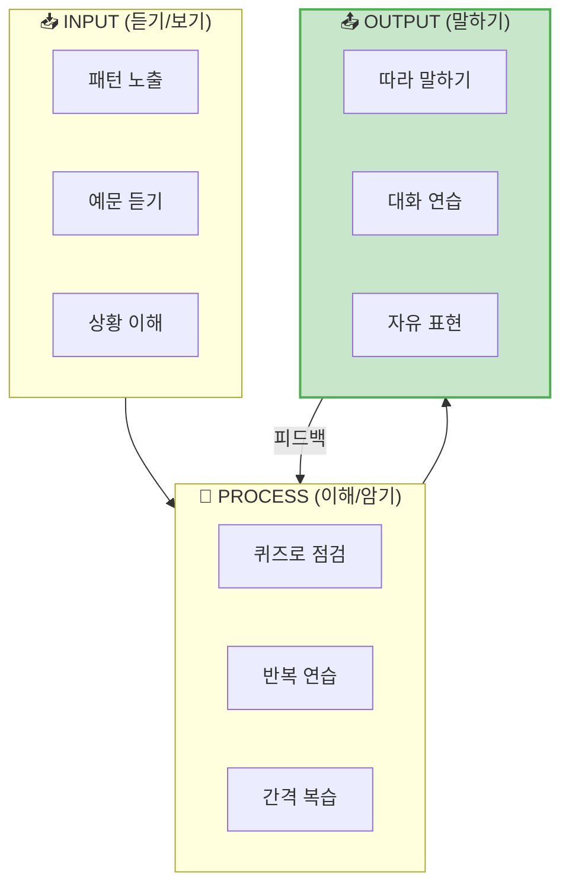
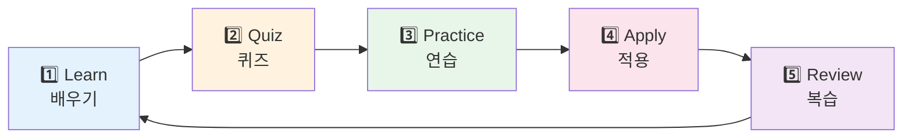
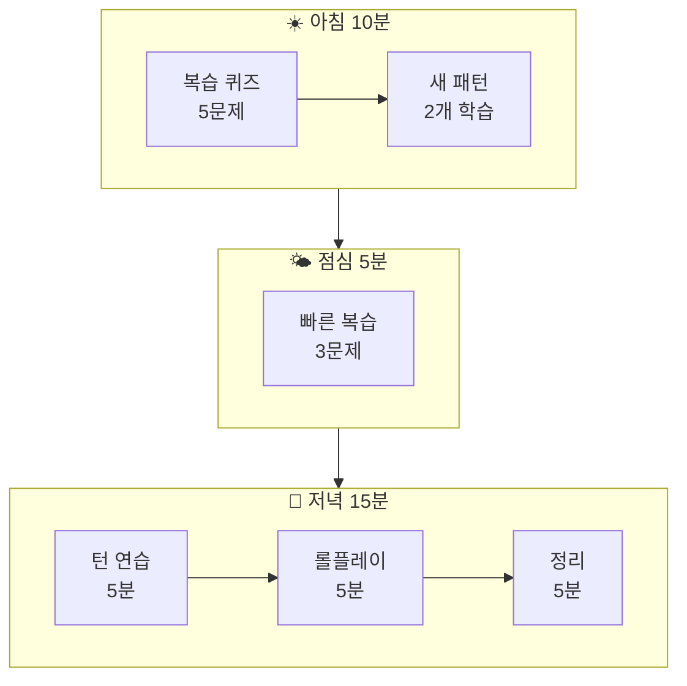

# 🎮 ChatGPT 영어 학습 프롬프트 시스템

> **글로벌 영어 앱의 학습 구조를 ChatGPT 프롬프트로 구현**  
> Duolingo, Babbel, Speak, Pimsleur 등의 검증된 학습 방식 적용

---

## 📋 목차

1. [학습 시스템 설계 철학](#학습-시스템-설계-철학)
2. [레벨 1: 패턴 암기 퀴즈](#레벨-1-패턴-암기-퀴즈)
3. [레벨 2: 듣기 & 따라하기](#레벨-2-듣기--따라하기)
4. [레벨 3: 턴 기반 대화 연습](#레벨-3-턴-기반-대화-연습)
5. [레벨 4: 표현 점검 & 교정](#레벨-4-표현-점검--교정)
6. [레벨 5: 실전 시뮬레이션](#레벨-5-실전-시뮬레이션)
7. [복습 시스템](#복습-시스템)
8. [일일 학습 플로우](#일일-학습-플로우)

---

## 학습 시스템 설계 철학

### 🎯 글로벌 앱들의 공통 원칙



### 📊 참조한 글로벌 앱 기능

| 앱 | 핵심 기능 | 적용 방식 |
|:--:|----------|----------|
| **Duolingo** | 게이미피케이션, 짧은 퀴즈 | 포인트 시스템, 미니 퀴즈 |
| **Babbel** | 실용 회화, 복습 시스템 | 상황별 대화, 간격 반복 |
| **Speak** | AI 대화, 실시간 피드백 | 턴 기반 롤플레이, 교정 |
| **Pimsleur** | 오디오 기반, 대화 시뮬레이션 | 듣고 따라하기, 프롬프트-응답 |
| **Cake** | 짧은 표현, 말하기 연습 | 핵심 표현 집중, 반복 말하기 |

### 🔄 학습 사이클



---

# 레벨 1: 패턴 암기 퀴즈

## 🎯 목표: 핵심 패턴을 정확히 기억하기

### Quiz Type 1: 빈칸 채우기 (Fill in the Blank)

```
[빈칸 채우기 퀴즈]

📌 규칙:
1. 영어 문장에서 빈칸을 채우세요
2. 5문제 연속 진행
3. 맞으면 ✅ (+10점) / 틀리면 ❌ (정답 공개)
4. 마지막에 총점 공개

오늘의 패턴: "Can I have ___, please?"

━━━━━━━━━━━━━━━━━━━━━━━━━━━━

Q1. "_____ I have water, please?"
    (a) Do  (b) Can  (c) Am  (d) Is

Q2. "Can I _____ the menu, please?"
    (a) has  (b) having  (c) have  (d) had

한 문제씩 보여주고, 제가 답하면 다음 문제로!
시작해주세요!
```

---

### Quiz Type 2: 한→영 변환 (Translation)

```
[한→영 변환 퀴즈]

📌 규칙:
1. 한국어 문장을 영어로 말하세요
2. 3초 안에 대답!
3. 정답과 비교 후 피드백
4. 10문제 후 점수 공개

난이도: ⭐ (초급)
패턴: 요청 표현

━━━━━━━━━━━━━━━━━━━━━━━━━━━━

예시:
Q: "물 주세요"
A: (내 대답)
정답: "Can I have water, please?"

채점 기준:
- 완벽 일치: ✅ 10점
- 의미 통함: ⚠️ 7점  
- 틀림: ❌ 0점

시작!
```

---

### Quiz Type 3: 듣고 받아쓰기 (Dictation)

```
[듣고 받아쓰기 퀴즈]

📌 규칙:
1. 영어 문장을 읽어주세요 (음성 모드)
2. 저는 들은 대로 따라 말합니다
3. 제가 말한 것과 원문 비교
4. 틀린 부분 피드백

오늘 주제: 공항 표현

━━━━━━━━━━━━━━━━━━━━━━━━━━━━

진행 방식:
1. 문장을 자연스러운 속도로 읽어주세요
2. "Your turn"이라고 해주세요
3. 제가 따라 말하면 정답 비교
4. 5문장 연속 진행

시작해주세요!
```

---

### Quiz Type 4: 상황 매칭 (Situation Matching)

```
[상황 매칭 퀴즈]

📌 규칙:
1. 상황을 설명하면, 적절한 표현을 고르세요
2. 객관식 4지선다
3. 정답 + 왜 그게 맞는지 설명

━━━━━━━━━━━━━━━━━━━━━━━━━━━━

예시:
상황: 카페에서 아메리카노를 주문하고 싶어요.

(a) "I want Americano."
(b) "Give me Americano."
(c) "Can I have an Americano, please?"
(d) "Americano is what I want."

정답: (c) - 가장 자연스럽고 공손한 표현

이런 형식으로 10문제 진행해주세요!
```

---

### Quiz Type 5: 틀린 부분 찾기 (Error Detection)

```
[틀린 부분 찾기 퀴즈]

📌 규칙:
1. 문장에서 틀린 부분을 찾으세요
2. 올바른 표현으로 고치세요
3. 왜 틀렸는지 설명 요청 가능

━━━━━━━━━━━━━━━━━━━━━━━━━━━━

예시:
Q: "Can I have a water, please?"
A: "a water" ❌ → "water" ✅ (물은 셀 수 없음)

또는
Q: "Where is the bathroom at?"
A: "at" 불필요 → "Where is the bathroom?" ✅

10문제 진행해주세요!
```

---

# 레벨 2: 듣기 & 따라하기

## 🎯 목표: 정확한 발음과 억양 습득

### Practice 1: 섀도잉 (Shadowing)

```
[섀도잉 연습]

📌 규칙:
1. 문장을 읽어주세요
2. 저는 동시에/직후에 따라 말합니다
3. 발음, 억양, 속도 피드백
4. 같은 문장 3번 반복 후 다음으로

오늘의 표현 5개:
1. "Can I have the check, please?"
2. "I'd like to make a reservation."
3. "Could you speak more slowly?"
4. "Where is the nearest subway station?"
5. "I'm looking for a gift shop."

━━━━━━━━━━━━━━━━━━━━━━━━━━━━

진행:
- 1번 문장부터 천천히 읽어주세요
- 제가 따라하면 피드백
- "Good!" 또는 교정 후 다시
- 3회 성공하면 다음 문장

시작!
```

---

### Practice 2: 청크 따라하기 (Chunk Repeat)

```
[청크 따라하기]

📌 목표: 긴 문장을 덩어리로 나눠서 익히기

오늘의 문장: 
"I'd like to check in. I have a reservation under Kim."

━━━━━━━━━━━━━━━━━━━━━━━━━━━━

진행 방식:

[Step 1] 청크별 연습
- "I'd like to" → 따라하기
- "check in" → 따라하기
- "I'd like to check in." → 따라하기

[Step 2] 다음 청크
- "I have" → 따라하기
- "a reservation" → 따라하기
- "under Kim" → 따라하기
- "I have a reservation under Kim." → 따라하기

[Step 3] 전체 연결
- 전체 문장 따라하기 x 3회

각 단계별로 피드백 주세요!
시작!
```

---

### Practice 3: 속도 점진 연습 (Speed Ladder)

```
[속도 점진 연습]

📌 같은 문장을 점점 빠르게 말하기

오늘의 문장: "Could you tell me how to get to the airport?"

━━━━━━━━━━━━━━━━━━━━━━━━━━━━

[Round 1] 🐢 느리게 (50% 속도)
- 아주 천천히 읽어주세요
- 저는 따라합니다
- 정확성 체크

[Round 2] 🚶 보통 (75% 속도)
- 조금 빠르게 읽어주세요
- 저는 따라합니다

[Round 3] 🏃 원어민 속도 (100%)
- 자연스러운 속도로 읽어주세요
- 저는 따라합니다

[Round 4] 🚀 빠르게 (110%)
- 조금 더 빠르게
- 저도 빠르게 따라합니다

각 라운드 성공하면 다음으로!
```

---

# 레벨 3: 턴 기반 대화 연습

## 🎯 목표: 실제 대화 흐름 속에서 표현 사용하기

### Turn Practice 1: 프롬프트-응답 (Prompt-Response)

```
[프롬프트-응답 연습]

📌 규칙:
1. 상대방(ChatGPT)이 먼저 말합니다
2. 저는 적절한 응답을 영어로 합니다
3. 정답 예시와 비교
4. 다양한 응답 가능 여부 체크

오늘 상황: 레스토랑

━━━━━━━━━━━━━━━━━━━━━━━━━━━━

[Turn 1]
👨‍🍳: "Hi! Welcome to our restaurant. Table for how many?"
🙋 나: (2명이라고 답하기)
✅ 예시: "Table for two, please." / "Two, please."

[Turn 2]  
👨‍🍳: "Would you like to sit inside or outside?"
🙋 나: (안쪽으로 답하기)
✅ 예시: "Inside, please."

[Turn 3]
👨‍🍳: "Here's your menu. Can I get you something to drink?"
🙋 나: (물 요청하기)
✅ 예시: "Can I have water, please?"

... 이런 식으로 10턴 진행해주세요!
각 턴마다 제 답변 평가 + 더 좋은 표현 제안
```

---

### Turn Practice 2: 역할 교대 (Role Switch)

```
[역할 교대 연습]

📌 규칙:
1. 처음엔 제가 손님, ChatGPT가 직원
2. 중간에 역할 교대!
3. 양쪽 입장에서 표현 연습

상황: 호텔 체크인

━━━━━━━━━━━━━━━━━━━━━━━━━━━━

[Part 1] 나 = 손님 👤, ChatGPT = 직원 👨‍💼
- 5턴 대화

[Part 2] 역할 교대! 나 = 직원 👨‍💼, ChatGPT = 손님 👤
- 5턴 대화
- 직원으로서 어떻게 응대하는지 연습

예시 전환:
"Now, let's switch roles! 
You are now the hotel receptionist.
A guest is coming to check in."

시작해주세요!
```

---

### Turn Practice 3: 예상치 못한 상황 대응 (Unexpected Turns)

```
[예상치 못한 상황 대응]

📌 규칙:
1. 일반적인 대화 진행 중...
2. 갑자기 예상치 못한 상황 발생!
3. 순발력 있게 대응하기

상황: 카페 주문

━━━━━━━━━━━━━━━━━━━━━━━━━━━━

[일반 흐름]
👩‍🍳: "What would you like?"
🙋: "Can I have an Americano, please?"
👩‍🍳: "Sure. What size?"
🙋: "Grande, please."

[예상치 못한 상황 발생!]
👩‍🍳: "I'm sorry, we're out of coffee beans. 
      Would you like something else?"

🙋: ??? (대응하기!)

━━━━━━━━━━━━━━━━━━━━━━━━━━━━

이런 식으로 5개 상황을 만들어주세요:
1. 원하는 메뉴 품절
2. 카드 결제 안 됨
3. 주문 잘못 들음
4. 가격 오류
5. 자리 없음

시작!
```

---

### Turn Practice 4: 연속 대화 완성 (Conversation Chain)

```
[연속 대화 완성]

📌 규칙:
1. 하나의 상황에서 처음부터 끝까지
2. 모든 턴을 제가 말함
3. ChatGPT는 상대방 역할 + 평가

상황: 공항 체크인 → 탑승 전체 과정

━━━━━━━━━━━━━━━━━━━━━━━━━━━━

예상 흐름 (10턴):
1. 체크인 카운터 도착
2. 체크인 요청
3. 여권 제시
4. 좌석 선택
5. 수하물 체크
6. 탑승구 확인
7. 보안검색 통과
8. 면세점 쇼핑
9. 탑승구 이동
10. 탑승

각 턴마다:
- ChatGPT가 상황 설명 + 상대방 대사
- 내가 영어로 응답
- 피드백 후 다음 턴

전체 완료 후 종합 점수!
시작해주세요!
```

---

# 레벨 4: 표현 점검 & 교정

## 🎯 목표: 올바른 표현 vs 틀린 표현 구분하기

### Check 1: 올바른 표현 선택 (Correct Expression)

```
[올바른 표현 선택]

📌 두 표현 중 더 적절한 것 고르기

━━━━━━━━━━━━━━━━━━━━━━━━━━━━

Q1. 물을 요청할 때
(A) "Give me water."
(B) "Can I have water, please?"

Q2. 화장실 위치를 물을 때
(A) "Toilet where?"
(B) "Where is the restroom?"

Q3. 추천 메뉴를 물을 때
(A) "What's good here?"
(B) "Recommend me food."

각 문제마다:
- 정답 선택
- 왜 다른 것이 틀렸거나 덜 적절한지 설명
- 상황별 뉘앙스 차이 설명

10문제 진행해주세요!
```

---

### Check 2: 공손함 레벨 점검 (Politeness Level)

```
[공손함 레벨 점검]

📌 같은 의미, 다른 공손함 레벨

━━━━━━━━━━━━━━━━━━━━━━━━━━━━

상황: 창가 좌석을 원함

[Level 1] 😠 무례함
"I want window seat."

[Level 2] 😐 보통
"Window seat, please."

[Level 3] 🙂 공손함
"Can I have a window seat?"

[Level 4] 😊 매우 공손
"Could I possibly get a window seat, please?"

━━━━━━━━━━━━━━━━━━━━━━━━━━━━

퀴즈:
1. 각 상황에서 적절한 레벨의 표현 고르기
2. Level 3 이상으로 문장 만들기 연습

5개 상황에 대해 진행해주세요!
```

---

### Check 3: 응용 표현 점검 (Applied Expressions)

```
[응용 표현 점검]

📌 기본 패턴을 응용해서 새로운 상황에 적용

기본 패턴: "Can I have ___, please?"

━━━━━━━━━━━━━━━━━━━━━━━━━━━━

[응용 테스트]

Q1. 호텔에서 수건을 더 달라고 할 때
→ 내 답변: _______________
→ 모범 답안: "Can I have extra towels, please?"

Q2. 비행기에서 담요를 달라고 할 때
→ 내 답변: _______________
→ 모범 답안: "Can I have a blanket, please?"

Q3. 식당에서 영수증을 달라고 할 때
→ 내 답변: _______________
→ 모범 답안: "Can I have the receipt, please?"

10개 응용 상황을 주세요!
맞으면 ✅, 틀리면 교정!
```

---

### Check 4: 실수 교정 세션 (Error Correction)

```
[실수 교정 세션]

📌 한국인이 자주 하는 실수 점검

━━━━━━━━━━━━━━━━━━━━━━━━━━━━

[흔한 실수 유형]

1️⃣ 관사 실수
❌ "Can I have water?" (O이지만...)
✅ "Can I have a glass of water?" (더 자연스러움)

2️⃣ 전치사 실수
❌ "I'm allergic for peanuts."
✅ "I'm allergic to peanuts."

3️⃣ 어순 실수
❌ "How much is this? Very expensive?"
✅ "How much is this? That's too expensive."

4️⃣ 직역 실수
❌ "Please give me discount."
✅ "Can you give me a discount?"

━━━━━━━━━━━━━━━━━━━━━━━━━━━━

퀴즈 형식:
- 틀린 문장을 보여주세요
- 제가 고쳐서 말합니다
- 정답 비교 + 설명

10문제 진행!
```

---

# 레벨 5: 실전 시뮬레이션

## 🎯 목표: 실제 상황과 동일한 환경에서 연습

### Simulation 1: 전체 시나리오 (Full Scenario)

```
[전체 시나리오 시뮬레이션]

📌 규칙:
1. 실제 여행처럼 처음부터 끝까지
2. 중간 교정 없이 진행
3. 모든 대화 후 종합 피드백

시나리오: 해외 레스토랑 식사

━━━━━━━━━━━━━━━━━━━━━━━━━━━━

[Scene 1] 입장
- 식당 도착, 자리 요청

[Scene 2] 착석
- 메뉴 받기, 음료 주문

[Scene 3] 주문
- 메뉴 질문, 음식 주문

[Scene 4] 식사 중
- 추가 요청 (물, 냅킨 등)

[Scene 5] 계산
- 계산서 요청, 결제

[Scene 6] 퇴장
- 인사, 나가기

━━━━━━━━━━━━━━━━━━━━━━━━━━━━

전체 시뮬레이션 후:
- 총점 (100점 만점)
- 잘한 표현 TOP 3
- 개선 필요한 표현 TOP 3
- 다음 학습 추천

시작!
```

---

### Simulation 2: 타임 어택 (Time Attack)

```
[타임 어택 시뮬레이션]

📌 규칙:
1. 상황이 주어지면 3초 안에 응답!
2. 시간 초과 = 0점
3. 빠르고 정확하게!

난이도: ⭐⭐⭐ (중급)

━━━━━━━━━━━━━━━━━━━━━━━━━━━━

Round 1: 공항 (5문제)
Round 2: 호텔 (5문제)
Round 3: 레스토랑 (5문제)
Round 4: 쇼핑 (5문제)
Round 5: 랜덤 믹스 (5문제)

채점:
- 3초 내 정확한 답: 10점
- 3초 내 의미 통함: 7점
- 5초 내 답변: 5점
- 시간 초과: 0점

총 25문제, 목표: 200점 이상!

"3, 2, 1... GO!" 로 시작해주세요!
```

---

### Simulation 3: 문제 해결 미션 (Problem Solving)

```
[문제 해결 미션]

📌 규칙:
1. 여행 중 문제 상황 발생
2. 영어로 해결해야 함
3. 여러 번의 대화로 문제 해결

━━━━━━━━━━━━━━━━━━━━━━━━━━━━

[Mission 1] 호텔 예약 문제
상황: 호텔 도착했는데 예약이 없다고 함
목표: 문제 해결하고 방 배정받기

[Mission 2] 음식 알레르기
상황: 주문한 음식에 견과류가 들어있음
목표: 다른 음식으로 교체받기

[Mission 3] 택시 요금 분쟁
상황: 미터기보다 높은 요금 청구
목표: 적정 가격으로 협상

[Mission 4] 분실물 찾기
상황: 카페에 휴대폰을 두고 옴
목표: 돌아가서 찾기

━━━━━━━━━━━━━━━━━━━━━━━━━━━━

각 미션:
- 성공하면 ⭐ 획득
- 3번 이내 대화로 해결: 보너스 ⭐

Mission 1부터 시작!
```

---

# 복습 시스템

## 🔄 간격 반복 복습 (Spaced Repetition)

### Daily Review: 오늘의 복습

```
[오늘의 복습 세션]

📌 간격 반복 시스템
- 어제 배운 것: 오늘 복습
- 3일 전 배운 것: 오늘 복습
- 1주 전 배운 것: 오늘 복습

━━━━━━━━━━━━━━━━━━━━━━━━━━━━

[복습 1] 어제 배운 표현 (5개)
- 빈칸 채우기 퀴즈

[복습 2] 3일 전 배운 표현 (3개)
- 한→영 변환

[복습 3] 1주 전 배운 표현 (2개)
- 상황 대입 말하기

━━━━━━━━━━━━━━━━━━━━━━━━━━━━

복습 결과:
- 기억함 ✅: 다음 복습 주기 연장
- 잊어버림 ❌: 다음 복습 주기 단축

시작해주세요!
```

---

### Weekly Review: 주간 종합 테스트

```
[주간 종합 테스트]

📌 이번 주 배운 모든 내용 점검

━━━━━━━━━━━━━━━━━━━━━━━━━━━━

[Part 1] 객관식 퀴즈 (10문제, 5분)
- 올바른 표현 고르기
- 상황 매칭

[Part 2] 말하기 테스트 (10문제, 5분)
- 상황 → 영어 문장
- 제한 시간 3초

[Part 3] 미니 롤플레이 (5분)
- 하나의 상황 전체 대화
- 교정 없이 진행

[Part 4] 자가 평가
- 가장 자신 있는 표현
- 아직 어려운 표현

━━━━━━━━━━━━━━━━━━━━━━━━━━━━

총점: ___/100
다음 주 학습 추천: ___

Part 1부터 시작!
```

---

# 일일 학습 플로우

## 📅 추천 일일 루틴



---

### 🌅 아침 10분 프롬프트

```
[아침 10분 세션]

📌 Quick & Light!

━━━━━━━━━━━━━━━━━━━━━━━━━━━━

[Step 1] 복습 퀴즈 (3분)
- 어제 배운 표현 5개
- 빈칸 채우기

[Step 2] 오늘의 새 표현 (5분)
- 새 패턴 1개 소개
- 예문 3개 따라하기

[Step 3] 빠른 점검 (2분)
- 새 패턴으로 문장 3개 만들기

━━━━━━━━━━━━━━━━━━━━━━━━━━━━

오늘의 목표 패턴: "Could you ___?"

시작!
```

---

### 🌙 저녁 15분 프롬프트

```
[저녁 15분 세션]

📌 Deep Practice!

━━━━━━━━━━━━━━━━━━━━━━━━━━━━

[Step 1] 턴 연습 (5분)
- 오늘 패턴으로 프롬프트-응답 10턴

[Step 2] 미니 롤플레이 (5분)
- 하나의 상황 전체 대화
- 오늘 패턴 활용

[Step 3] 피드백 & 정리 (5분)
- 오늘 잘한 것
- 개선할 것
- 내일 복습할 표현 3개

━━━━━━━━━━━━━━━━━━━━━━━━━━━━

오늘 연습할 상황: 호텔 체크인

시작!
```

---

## 🎮 포인트 & 레벨 시스템

### 점수 체계

```
[포인트 시스템]

📊 점수 획득 방법:

| 활동 | 포인트 |
|------|--------|
| 퀴즈 정답 | +10 |
| 연속 정답 3개 | +20 보너스 |
| 롤플레이 완료 | +50 |
| 일일 목표 달성 | +100 |
| 주간 테스트 통과 | +500 |

📈 레벨 시스템:

| 레벨 | 필요 포인트 | 칭호 |
|------|-------------|------|
| Lv.1 | 0 | Beginner |
| Lv.2 | 500 | Starter |
| Lv.3 | 1500 | Explorer |
| Lv.4 | 3000 | Traveler |
| Lv.5 | 5000 | Confident |
| Lv.6 | 10000 | Fluent |
```

---

## 🚀 Quick Start

```
[오늘 학습 시작!]

안녕하세요! 영어 회화 학습을 시작합니다.

📌 학습 방식:
- 퀴즈 → 따라하기 → 대화 연습 → 피드백

📌 오늘의 목표:
- 핵심 패턴 1개 완벽 습득
- 퀴즈 10문제 80% 이상
- 롤플레이 1회 완료

📌 오늘의 패턴:
"Can I have ___, please?"

준비됐으면 "시작!"이라고 해주세요.

진행 순서:
1️⃣ 패턴 소개 & 예문 학습
2️⃣ 빈칸 채우기 퀴즈 5문제
3️⃣ 한→영 변환 퀴즈 5문제
4️⃣ 프롬프트-응답 연습 5턴
5️⃣ 미니 롤플레이
6️⃣ 오늘의 피드백

시작!
```

---

*글로벌 영어 앱의 검증된 학습 방식을 ChatGPT로 구현했습니다! 🌟*

*Last Updated: 2026-01-10*

