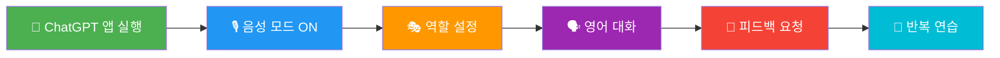
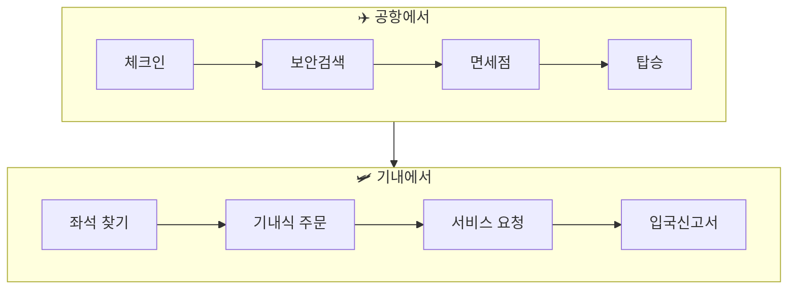
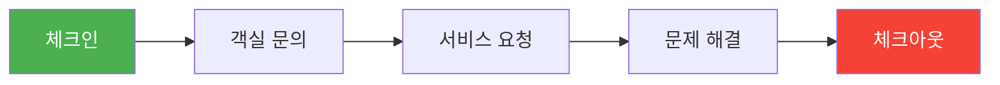
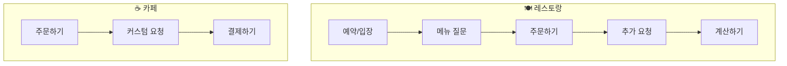

# 🛫 ChatGPT 여행 영어 회화 학습 가이드

> **화상 영어처럼 ChatGPT와 1:1 영어 회화 연습하기**  
> 음성 대화, 발음 교정, 실전 여행 회화를 ChatGPT로 마스터하세요!

---

## 📋 목차
1. [ChatGPT 기능 활용법](#chatgpt-기능-활용법)
2. [학습 시작 프롬프트](#학습-시작-프롬프트)
3. [여행 상황별 회화 프롬프트](#여행-상황별-회화-프롬프트)
4. [발음 연습 프롬프트](#발음-연습-프롬프트)
5. [빠른 문장 연습 프롬프트](#빠른-문장-연습-프롬프트)
6. [실전 롤플레이 프롬프트](#실전-롤플레이-프롬프트)

---

## ChatGPT 기능 활용법

### 🎙️ 음성 모드 (Advanced Voice Mode)

| 기능 | 활용법 | 효과 |
|------|--------|------|
| **실시간 음성 대화** | ChatGPT 앱에서 음성 버튼 탭 | 실제 회화처럼 대화 |
| **발음 피드백** | 음성으로 말하고 교정 요청 | 발음 개선 |
| **속도 조절** | "천천히 말해주세요" 요청 | 청취력 향상 |
| **반복 청취** | "다시 한번 말해주세요" | 듣기 연습 |

### 학습 흐름



---

## 학습 시작 프롬프트

### 🌟 기본 튜터 설정 (복사해서 사용하세요!)

```
당신은 저의 영어 회화 튜터입니다.

📌 기본 규칙:
1. 모든 대화는 영어로 진행해주세요
2. 제가 틀린 표현을 쓰면 즉시 교정해주세요
3. 더 자연스러운 표현이 있으면 알려주세요
4. 대화 중간중간 발음 팁도 알려주세요
5. 저의 레벨: 초급 (기초 회화)

지금부터 여행 영어 회화를 연습하겠습니다.
준비되면 "Let's start!"라고 말해주세요.
```

### 🎯 난이도별 설정 프롬프트

| 난이도 | 프롬프트 |
|:------:|----------|
| **초급** | `저는 영어 초보입니다. 짧고 쉬운 문장으로 천천히 대화해주세요. 모르는 표현은 한국어로 설명해주세요.` |
| **중급** | `저는 기본적인 영어 대화가 가능합니다. 자연스러운 대화를 하고, 더 좋은 표현이 있으면 제안해주세요.` |
| **고급** | `저는 영어 대화에 익숙합니다. 원어민처럼 자연스럽게 대화하고, 관용 표현과 뉘앙스 차이도 알려주세요.` |

---

## 여행 상황별 회화 프롬프트

### ✈️ 1. 공항/비행기



#### 📋 공항 체크인 프롬프트
```
🎭 역할: 공항 체크인 카운터 직원

상황: 제가 국제선 체크인을 하러 왔습니다.
- 여권과 e-티켓을 보여드립니다
- 창가 좌석을 요청하고 싶어요
- 수하물 무게 초과 상황도 연습해주세요

대화가 끝나면 제가 사용한 표현을 평가해주세요.
시작해주세요!
```

#### 📋 기내 서비스 프롬프트
```
🎭 역할: 비행기 승무원

상황: 저는 기내에서 서비스를 요청합니다.
연습할 상황들:
1. 담요/베개 요청하기
2. 음료 주문하기
3. 기내식 선택하기 (beef or chicken)
4. 입국신고서 요청하기

각 상황을 차례로 연습해주세요.
```

#### 💬 핵심 표현 모음

| 상황 | 영어 표현 | 발음 가이드 |
|------|----------|------------|
| 체크인 | I'd like to check in, please. | 아이드 라이크 투 체킨 플리즈 |
| 좌석 요청 | Can I have a window seat? | 캔 아이 해브 어 윈도우 싯? |
| 수하물 | I have one bag to check. | 아이 해브 원 백 투 첵 |
| 담요 요청 | Could I have a blanket? | 쿠드 아이 해브 어 블랭킷? |
| 음료 | Orange juice, please. | 오렌지 쥬스 플리즈 |

---

### 🏨 2. 호텔



#### 📋 호텔 체크인 프롬프트
```
🎭 역할: 호텔 프론트 데스크 직원

상황: 예약한 호텔에 체크인합니다.
연습할 내용:
1. 예약 확인 (이름: Kim)
2. 조식 포함 여부 확인
3. 와이파이 비밀번호 문의
4. 늦은 체크아웃 요청

자연스럽게 대화를 이어가주세요.
제가 틀린 부분은 바로 교정해주세요.
```

#### 📋 호텔 문제 상황 프롬프트
```
🎭 역할: 호텔 프론트 직원

상황: 객실에 문제가 생겼습니다.
연습할 상황:
1. 에어컨이 작동하지 않아요
2. 뜨거운 물이 안 나와요
3. 옆방이 너무 시끄러워요
4. 객실 변경 요청

정중하게 불만을 표현하는 방법을 알려주세요.
```

#### 💬 핵심 표현 모음

| 상황 | 영어 표현 |
|------|----------|
| 예약 확인 | I have a reservation under Kim. |
| 체크인 시간 | What time is check-in? |
| 객실 요청 | Could I get a room on a higher floor? |
| 문제 신고 | There's a problem with my room. |
| 체크아웃 | I'd like to check out, please. |

---

### 🍽️ 3. 레스토랑/카페



#### 📋 레스토랑 주문 프롬프트
```
🎭 역할: 레스토랑 웨이터/웨이트리스

상황: 저는 현지 레스토랑에서 식사합니다.
연습할 상황:
1. 2명 자리 요청
2. 메뉴 추천 받기
3. 알레르기 언급하기 (해산물 알레르기)
4. 스테이크 굽기 선택하기
5. 계산서 요청하기

각 상황에서 자연스러운 대화를 해주세요.
```

#### 📋 카페 주문 프롬프트
```
🎭 역할: 스타벅스 바리스타

상황: 저는 카페에서 음료를 주문합니다.
연습할 내용:
1. 아메리카노 주문 (아이스/핫)
2. 사이즈 선택 (톨/그란데/벤티)
3. 커스텀 요청 (시럽 추가, 우유 변경)
4. 여기서/포장 선택

실제 스타벅스처럼 대화해주세요!
```

#### 💬 핵심 표현 모음

| 상황 | 영어 표현 |
|------|----------|
| 자리 요청 | Table for two, please. |
| 추천 질문 | What do you recommend? |
| 알레르기 | I'm allergic to shellfish. |
| 굽기 선택 | Medium rare, please. |
| 계산 | Can I have the check, please? |
| 카드 결제 | Can I pay by card? |
| 포장 | To go, please. |

---

### 🛍️ 4. 쇼핑

#### 📋 옷 가게 프롬프트
```
🎭 역할: 옷 가게 점원

상황: 저는 옷을 쇼핑하고 있습니다.
연습할 상황:
1. 사이즈 문의하기
2. 다른 색상 요청하기
3. 피팅룸 이용하기
4. 가격 흥정하기 (시장인 경우)
5. 환불/교환 정책 문의

대화를 자연스럽게 이어가주세요.
```

#### 📋 면세점 프롬프트
```
🎭 역할: 면세점 직원

상황: 공항 면세점에서 쇼핑합니다.
연습할 내용:
1. 특정 브랜드 찾기
2. 세금 환급 문의
3. 할인 여부 확인
4. 기내 반입 가능 여부 확인

친절하게 응대해주세요.
```

#### 💬 핵심 표현 모음

| 상황 | 영어 표현 |
|------|----------|
| 구경 | I'm just looking, thanks. |
| 사이즈 | Do you have this in medium? |
| 색상 | Do you have this in black? |
| 피팅 | Can I try this on? |
| 가격 | How much is this? |
| 할인 | Is this on sale? |
| 환불 | Can I get a refund? |

---

### 🚕 5. 교통/길 찾기

#### 📋 택시 이용 프롬프트
```
🎭 역할: 택시 기사

상황: 저는 택시를 타고 목적지로 갑니다.
연습할 상황:
1. 목적지 말하기
2. 소요 시간 문의
3. 요금 문의
4. 카드 결제 가능 여부
5. 영수증 요청

실제 택시 대화처럼 진행해주세요.
```

#### 📋 길 찾기 프롬프트
```
🎭 역할: 현지인 (지나가는 사람)

상황: 저는 길을 잃어서 물어봅니다.
연습할 상황:
1. 정중하게 말 걸기
2. 특정 장소 물어보기
3. 방향 이해하기 (left, right, straight)
4. 거리/시간 확인하기

간단하고 자연스러운 대화로 진행해주세요.
```

#### 💬 핵심 표현 모음

| 상황 | 영어 표현 |
|------|----------|
| 목적지 | To the airport, please. |
| 시간 문의 | How long will it take? |
| 길 묻기 | Excuse me, how do I get to...? |
| 방향 | Go straight and turn left. |
| 거리 | Is it far from here? |
| 감사 | Thanks for your help! |

---

### 🆘 6. 긴급 상황

#### 📋 긴급 상황 프롬프트
```
🎭 역할: 상황에 맞는 담당자

⚠️ 긴급 상황 연습이 필요합니다.
연습할 상황들:

1. 여권을 분실했어요 (대사관 직원)
2. 지갑을 도난당했어요 (경찰관)
3. 아파서 병원에 가야해요 (약사/의사)
4. 비행기를 놓쳤어요 (항공사 직원)

각 상황에서 침착하게 도움을 요청하는 방법을 연습시켜주세요.
```

#### 💬 긴급 표현 모음

| 상황 | 영어 표현 |
|------|----------|
| 도움 요청 | Can you help me, please? |
| 여권 분실 | I lost my passport. |
| 도난 신고 | My wallet was stolen. |
| 아픔 표현 | I don't feel well. |
| 병원 | Where is the nearest hospital? |
| 대사관 | Where is the Korean embassy? |

---

## 발음 연습 프롬프트

### 🎤 발음 교정 요청

```
저의 발음을 교정해주세요.

제가 음성으로 영어 문장을 말하면:
1. 제가 말한 문장을 텍스트로 보여주세요
2. 잘못 발음한 부분을 지적해주세요
3. 정확한 발음 방법을 알려주세요
4. 다시 따라할 수 있게 천천히 말해주세요

시작하겠습니다!
```

### 🔤 발음 집중 연습 프롬프트

```
여행 영어에서 자주 틀리는 발음을 연습하고 싶어요.

다음 항목을 하나씩 연습시켜주세요:
1. R과 L 발음 구분 (right/light, rice/lice)
2. TH 발음 (think, this, there)
3. V와 B 발음 (very/berry, vest/best)
4. 강세와 억양 (hotel, police, restaurant)

각 항목당 5개 단어씩 연습시켜주세요.
제가 따라하면 피드백 해주세요.
```

### 📊 자주 틀리는 발음 정리

| 발음 | 틀리기 쉬운 단어 | 연습 방법 |
|------|-----------------|----------|
| **R/L** | really, airport, hotel | 혀 위치 확인 |
| **TH** | thank, three, there | 혀를 이 사이에 |
| **V/B** | very, vacation | 아랫입술 깨물기 |
| **F/P** | coffee, phone | 윗니가 아랫입술 |

---

## 빠른 문장 연습 프롬프트

### ⚡ 순발력 테스트

```
빠른 영어 문장 연습을 시작합니다!

📌 규칙:
1. 한국어 문장을 보여주세요
2. 저는 3초 안에 영어로 말합니다
3. 정답과 제 답을 비교해주세요
4. 10문제 후 점수를 알려주세요

주제: 여행 상황
난이도: 초급
시작해주세요!
```

### 📝 상황별 빠른 연습

```
[빠른 문장 변환 게임]

주제: 공항에서
10개의 한국어 문장을 하나씩 보여주세요.
저는 바로 영어로 말합니다.

예시:
Q: "창가 좌석 주세요"
A: (저의 대답)
정답: "Can I have a window seat, please?"

틀리면 바로 교정해주시고,
맞으면 "Perfect!" 또는 "Good!"이라고 해주세요.

시작!
```

### 🎯 패턴 드릴 연습

```
패턴 연습을 시작합니다!

오늘의 패턴: "Can I have _____, please?"

10개의 단어를 하나씩 보여주세요.
저는 그 단어를 넣어서 전체 문장을 말합니다.

예: "water" → "Can I have water, please?"

빠르게 진행해주세요!
```

### 💡 패턴 목록

| 패턴 | 의미 | 예시 |
|------|------|------|
| Can I have ___? | ~를 주세요 | Can I have the menu? |
| Could you ___? | ~해주실래요? | Could you speak slowly? |
| Where is ___? | ~가 어디예요? | Where is the bathroom? |
| How much is ___? | ~얼마예요? | How much is this? |
| I'd like to ___ | ~하고 싶어요 | I'd like to check out. |

---

## 실전 롤플레이 프롬프트

### 🎬 시나리오 1: 여행 첫날

```
[실전 롤플레이: 여행 첫날]

상황 흐름:
1. 공항 도착 → 입국심사
2. 택시 타고 호텔로
3. 호텔 체크인
4. 저녁 식사

각 상황에 맞는 역할을 해주세요.
대화가 자연스럽게 이어지도록 해주세요.
중간에 교정하지 말고, 마지막에 종합 피드백 주세요.

지금부터 저는 입국심사대 앞에 서 있습니다.
시작해주세요!
```

### 🎬 시나리오 2: 쇼핑 데이

```
[실전 롤플레이: 쇼핑하기]

상황:
1. 백화점에서 선물 쇼핑
2. 사이즈 교환하기
3. 면세점에서 화장품 구매
4. 택스 리펀드 받기

각 상황을 연속으로 진행해주세요.
실제 상황처럼 자연스럽게 해주세요!
```

### 🎬 시나리오 3: 문제 해결

```
[실전 롤플레이: 문제 상황]

오늘은 여행 중 생길 수 있는 문제 상황을 연습합니다.

상황들:
1. 주문한 음식이 잘못 나왔어요
2. 호텔 예약이 없다고 해요
3. 택시 기사가 바가지를 씌우려 해요
4. 비행기가 지연됐어요

차례로 진행해주세요.
정중하지만 단호하게 문제를 해결하는 연습을 합니다!
```

---

## 📅 학습 플랜

### 주간 학습 계획

```mermaid
gantt
    title 1주차 여행 영어 학습 플랜
    dateFormat  X
    axisFormat %s일차
    
    section 기초
    공항/비행기     :1, 2
    
    section 숙박
    호텔 체크인/아웃  :2, 3
    
    section 식사
    레스토랑/카페    :3, 4
    
    section 이동
    교통/길찾기     :4, 5
    
    section 쇼핑
    쇼핑/면세점     :5, 6
    
    section 종합
    실전 롤플레이    :6, 7
    종합 복습       :7, 8
```



### 일일 학습 루틴

| 시간 | 활동 | 프롬프트 유형 |
|:----:|------|:------------:|
| 5분 | 발음 워밍업 | 발음 연습 |
| 10분 | 핵심 표현 학습 | 상황별 회화 |
| 10분 | 빠른 문장 연습 | 순발력 테스트 |
| 10분 | 롤플레이 대화 | 실전 롤플레이 |
| 5분 | 피드백 정리 | 복습 요청 |

---

## 🎯 학습 완료 체크리스트

### 오늘 학습 마무리 프롬프트

```
오늘 학습을 마무리합니다.

다음을 정리해주세요:
1. 오늘 배운 핵심 표현 5개
2. 제가 자주 틀린 부분
3. 내일 복습할 표현
4. 오늘 대화 점수 (10점 만점)

마지막으로 격려의 말도 해주세요! 😊
```

---

## 💡 Pro Tips

### ✅ 효과적인 학습법

1. **매일 20-30분** 음성으로 대화하세요
2. **틀려도 괜찮아요** - 피드백이 곧 학습입니다
3. **같은 상황 3번 반복** - 자동으로 나올 때까지!
4. **발음은 과장되게** 연습하세요
5. **실제 여행 전 2주간** 집중 연습하세요

### 🎙️ 음성 모드 팁

- **조용한 환경**에서 연습하세요
- **또박또박** 말하면 인식률 UP
- 모르면 **"How do I say...?"** 질문하세요
- **천천히 말해달라고** 요청하세요

---

## 📱 Quick Start

지금 바로 시작하세요! 아래 프롬프트를 복사해서 ChatGPT에 붙여넣으세요:

```
안녕하세요! 저는 2주 후 해외여행을 앞두고 있어요.
영어 회화 튜터가 되어주세요.

📌 저의 정보:
- 영어 레벨: 초급 (기초 회화 가능)
- 연습 시간: 20분
- 오늘 주제: 공항/비행기

📌 요청사항:
1. 영어로 대화해주세요
2. 틀리면 바로 교정해주세요
3. 발음 팁도 알려주세요
4. 마지막에 피드백 주세요

지금 공항에서 체크인하는 상황부터 시작해주세요!
```

---

*Happy Learning! 즐거운 여행 영어 공부 되세요! ✈️*

*Last Updated: 2026-01-10*
