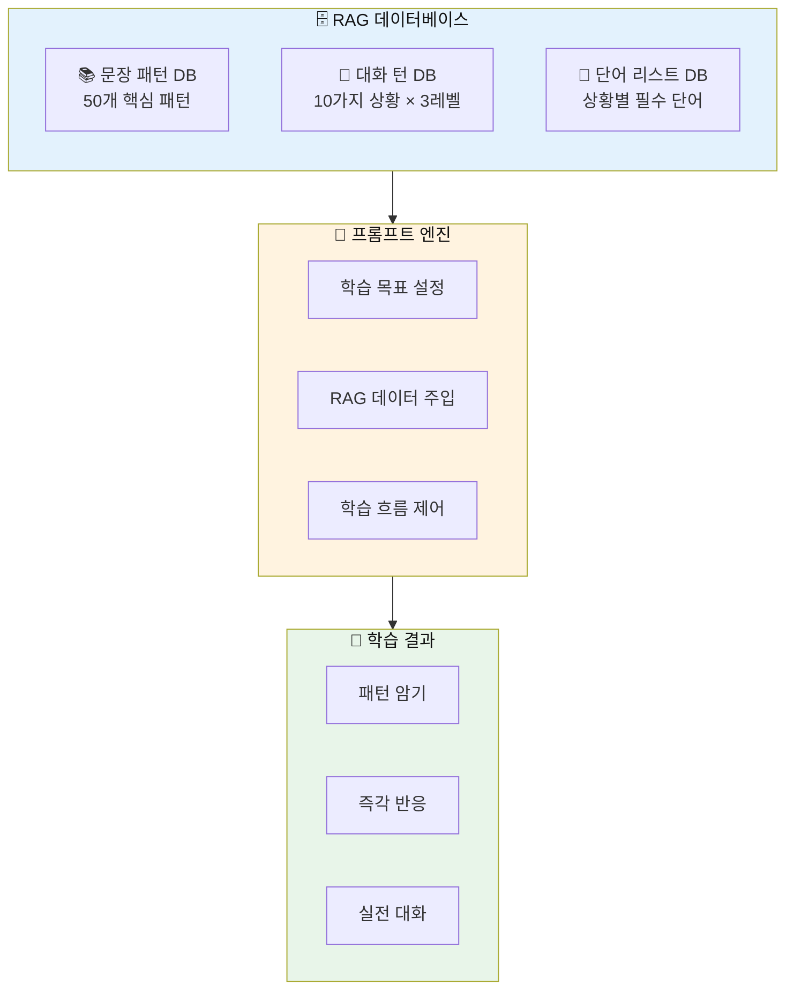
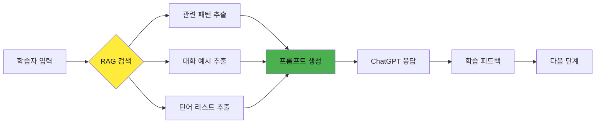
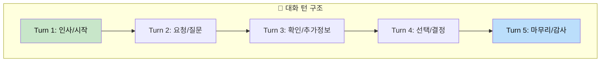
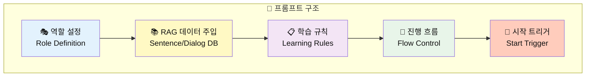
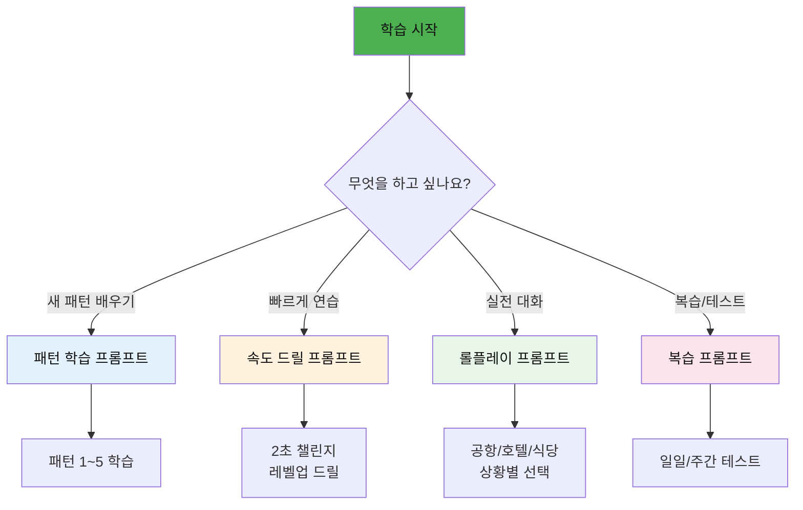

# 🛫 RAG 기반 ChatGPT 여행 영어 회화 학습 시스템

> **미리 구성된 문장 DB와 대화 턴을 활용한 체계적 영어 학습**  
> 프롬프트에 RAG 데이터를 내장하여 일관된 학습 경험 제공

---

## 📋 목차
1. [RAG 시스템 구조](#rag-시스템-구조)
2. [문장 데이터베이스](#문장-데이터베이스)
3. [대화 턴 데이터베이스](#대화-턴-데이터베이스)
4. [프롬프트 설계 원칙](#프롬프트-설계-원칙)
5. [기본 튜터 설정 프롬프트](#기본-튜터-설정-프롬프트)
6. [패턴 학습 프롬프트](#패턴-학습-프롬프트)
7. [단어 대입 훈련 프롬프트](#단어-대입-훈련-프롬프트)
8. [상황별 롤플레이 프롬프트](#상황별-롤플레이-프롬프트)
9. [속도 향상 드릴 프롬프트](#속도-향상-드릴-프롬프트)
10. [복습 및 테스트 프롬프트](#복습-및-테스트-프롬프트)

---

## RAG 시스템 구조

### 🔄 전체 아키텍처



### 📊 RAG 활용 학습 흐름



---

## 문장 데이터베이스

### 🎯 핵심 패턴 5가지 (RAG 기본 데이터)

```
┌─────────────────────────────────────────────────────────────────┐
│  PATTERN_DB: 핵심 요청 패턴 5가지                                │
├─────────────────────────────────────────────────────────────────┤
│  1. Can I have ___, please?     → 물건/서비스 요청              │
│  2. Could you ___?              → 정중한 부탁                   │
│  3. Where is ___?               → 장소 질문                     │
│  4. How much is ___?            → 가격 문의                     │
│  5. I'd like to ___             → 희망/의사 표현                │
└─────────────────────────────────────────────────────────────────┘
```

### 📋 상황별 문장 매핑 테이블

| 패턴 | 공항 | 호텔 | 식당 | 쇼핑 | 택시 |
|:----:|------|------|------|------|------|
| **Can I have ___?** | a window seat | extra towels | the menu | this in black | a receipt |
| **Could you ___?** | help me find the gate | keep my luggage | recommend something | give me a discount | take me to the hotel |
| **Where is ___?** | Gate 15 | the elevator | the restroom | the fitting room | the nearest station |
| **How much is ___?** | the excess baggage fee | the room per night | this dish | this jacket | the fare to downtown |
| **I'd like to ___** | check in | check out | order the steak | try this on | go to the airport |

---

## 대화 턴 데이터베이스

### 💬 대화 구조 템플릿



### 📚 레벨별 대화 데이터 (공항 체크인 예시)

#### 🌱 초급 대화 턴 DB
```
CONVERSATION_DB: airport_checkin_beginner
━━━━━━━━━━━━━━━━━━━━━━━━━━━━━━━━━━━━━━━━━━━━
Turn 1:
  Staff: "Next, please! Passport?"
  You:   "Here."

Turn 2:
  Staff: "Where are you going?"
  You:   "Tokyo."

Turn 3:
  Staff: "Window or aisle?"
  You:   "Window, please."

Turn 4:
  Staff: "Any bags?"
  You:   "One bag."

Turn 5:
  Staff: "Gate 15. Have a nice flight!"
  You:   "Thank you!"
━━━━━━━━━━━━━━━━━━━━━━━━━━━━━━━━━━━━━━━━━━━━
```

#### 🌿 중급 대화 턴 DB
```
CONVERSATION_DB: airport_checkin_intermediate
━━━━━━━━━━━━━━━━━━━━━━━━━━━━━━━━━━━━━━━━━━━━
Turn 1:
  Staff: "Good morning! May I see your passport?"
  You:   "Good morning. Here you go."

Turn 2:
  Staff: "Where are you flying to today?"
  You:   "I'm flying to Tokyo. I have a reservation under Kim."

Turn 3:
  Staff: "Would you prefer a window or aisle seat?"
  You:   "Could I get a window seat, please?"

Turn 4:
  Staff: "Do you have any luggage to check?"
  You:   "Yes, I have one suitcase. Is it within the weight limit?"

Turn 5:
  Staff: "Your gate is 15. Boarding starts at 10:30."
  You:   "Thank you for your help!"
━━━━━━━━━━━━━━━━━━━━━━━━━━━━━━━━━━━━━━━━━━━━
```

#### 🌳 고급 대화 턴 DB
```
CONVERSATION_DB: airport_checkin_advanced
━━━━━━━━━━━━━━━━━━━━━━━━━━━━━━━━━━━━━━━━━━━━
Turn 1:
  Staff: "Good morning, sir. How may I assist you today?"
  You:   "Good morning. I was wondering if I could check in for the 11:45 flight to Tokyo?"

Turn 2:
  Staff: "Certainly. May I see your passport and booking reference?"
  You:   "Of course. Here's my passport. The booking reference should be ABC123."

Turn 3:
  Staff: "I've located your reservation. Do you have a seat preference?"
  You:   "Would it be possible to get a window seat towards the front of the plane?"

Turn 4:
  Staff: "I can offer you 8A. Will you be checking any luggage today?"
  You:   "Yes, just one suitcase. I hope it's not over the weight limit."

Turn 5:
  Staff: "It's 21 kilos, well within the allowance. Anything else?"
  You:   "That's everything. You've been incredibly helpful. Thank you!"
━━━━━━━━━━━━━━━━━━━━━━━━━━━━━━━━━━━━━━━━━━━━
```

---

## 프롬프트 설계 원칙

### 🎯 RAG 프롬프트 구성 요소



### 📝 프롬프트 템플릿 공식

```
┌─────────────────────────────────────────────────────────────────┐
│  [1] 역할 정의                                                   │
│      → "당신은 ~입니다"                                          │
├─────────────────────────────────────────────────────────────────┤
│  [2] RAG 데이터 블록                                             │
│      → 패턴, 예문, 대화 턴을 직접 주입                           │
├─────────────────────────────────────────────────────────────────┤
│  [3] 학습 규칙                                                   │
│      → 진행 방식, 피드백 규칙, 키워드 설정                       │
├─────────────────────────────────────────────────────────────────┤
│  [4] 진행 흐름                                                   │
│      → 단계별 순서, 완료 조건                                    │
├─────────────────────────────────────────────────────────────────┤
│  [5] 시작 트리거                                                 │
│      → "~로 시작해주세요!"                                       │
└─────────────────────────────────────────────────────────────────┘
```

---

## 기본 튜터 설정 프롬프트

### 🌟 마스터 튜터 프롬프트 (복사해서 사용)

```
당신은 저의 여행 영어 회화 튜터입니다.

━━━━━━━━━━━━━━━━━━━━━━━━━━━━━━━━━━━━━━━━━━━━
📚 핵심 패턴 데이터베이스 (오늘 학습용)
━━━━━━━━━━━━━━━━━━━━━━━━━━━━━━━━━━━━━━━━━━━━
1. Can I have ___, please? (물건/서비스 요청)
   예: Can I have water? / Can I have the menu?

2. Could you ___? (정중한 부탁)
   예: Could you help me? / Could you speak slowly?

3. Where is ___? (장소 질문)
   예: Where is the gate? / Where is the bathroom?

4. How much is ___? (가격 문의)
   예: How much is this? / How much is the fare?

5. I'd like to ___ (희망 표현)
   예: I'd like to check in. / I'd like to order.

━━━━━━━━━━━━━━━━━━━━━━━━━━━━━━━━━━━━━━━━━━━━
📌 기본 규칙
━━━━━━━━━━━━━━━━━━━━━━━━━━━━━━━━━━━━━━━━━━━━
1. 대화는 영어로 진행합니다
2. 제가 틀리면 즉시 교정해주세요
3. 더 자연스러운 표현이 있으면 알려주세요
4. "help"라고 하면 힌트를 주세요
5. "한국어"라고 하면 한국어로 설명해주세요

━━━━━━━━━━━━━━━━━━━━━━━━━━━━━━━━━━━━━━━━━━━━
📊 나의 레벨: 초급
📍 오늘 주제: 공항/기내
━━━━━━━━━━━━━━━━━━━━━━━━━━━━━━━━━━━━━━━━━━━━

"안녕하세요! 오늘 여행 영어를 함께 연습해볼까요?"로 시작해주세요!
```

---

### 🎯 레벨별 튜터 설정 프롬프트

#### 초급 튜터 프롬프트
```
당신은 친절한 영어 회화 튜터입니다.

━━━━━━━━━━━━━━━━━━━━━━━━━━━━━━━━━━━━━━━━━━━━
📚 초급 학습자용 RAG 데이터
━━━━━━━━━━━━━━━━━━━━━━━━━━━━━━━━━━━━━━━━━━━━
사용할 문장 패턴:
- ___, please. (가장 기본)
- Can I have ___? 
- Where is ___?
- How much?
- Thank you!

예시 대화 (참고용):
Staff: "Window or aisle?"
You: "Window, please."

Staff: "Anything to drink?"
You: "Water, please."

━━━━━━━━━━━━━━━━━━━━━━━━━━━━━━━━━━━━━━━━━━━━
📌 초급 학습 규칙
━━━━━━━━━━━━━━━━━━━━━━━━━━━━━━━━━━━━━━━━━━━━
1. 짧고 쉬운 문장만 사용해주세요 (3-5단어)
2. 천천히 말해주세요
3. 모르는 표현은 한국어로 바로 설명해주세요
4. 같은 패턴을 여러 번 반복해주세요
5. 칭찬을 많이 해주세요!

"Hi! 오늘 영어 연습 시작해볼까요? 😊" 로 시작해주세요!
```

#### 중급 튜터 프롬프트
```
당신은 전문 영어 회화 코치입니다.

━━━━━━━━━━━━━━━━━━━━━━━━━━━━━━━━━━━━━━━━━━━━
📚 중급 학습자용 RAG 데이터
━━━━━━━━━━━━━━━━━━━━━━━━━━━━━━━━━━━━━━━━━━━━
사용할 문장 패턴:
- Could you ___? (정중한 요청)
- I'd like to ___ (희망 표현)
- Could you tell me ___? (정보 요청)
- Would it be possible to ___? (공손한 요청)
- I'm looking for ___ (찾기)

레벨업 표현:
초급: "Check in, please."
→ 중급: "I'd like to check in. I have a reservation under Kim."

초급: "Window, please."
→ 중급: "Could I get a window seat, please?"

━━━━━━━━━━━━━━━━━━━━━━━━━━━━━━━━━━━━━━━━━━━━
📌 중급 학습 규칙
━━━━━━━━━━━━━━━━━━━━━━━━━━━━━━━━━━━━━━━━━━━━
1. 자연스러운 속도로 대화해주세요
2. 초급 표현을 쓰면 중급 표현으로 업그레이드 제안
3. 다양한 상황 변형을 추가해주세요
4. 관용 표현도 조금씩 소개해주세요

"Good afternoon! Ready for today's practice?" 로 시작해주세요!
```

#### 고급 튜터 프롬프트
```
당신은 네이티브 수준의 영어 대화 파트너입니다.

━━━━━━━━━━━━━━━━━━━━━━━━━━━━━━━━━━━━━━━━━━━━
📚 고급 학습자용 RAG 데이터
━━━━━━━━━━━━━━━━━━━━━━━━━━━━━━━━━━━━━━━━━━━━
사용할 표현:
- I was wondering if ___ (매우 공손한 요청)
- Would you mind ___? (부탁)
- I don't suppose ___? (완곡한 질문)
- Would you happen to know ___? (정중한 질문)
- I'd really appreciate it if ___ (감사 표현)

뉘앙스 차이:
"Can I have water?" (일반적)
"Could I possibly get some water?" (더 공손)
"I don't suppose I could trouble you for some water?" (매우 공손, 세련됨)

━━━━━━━━━━━━━━━━━━━━━━━━━━━━━━━━━━━━━━━━━━━━
📌 고급 학습 규칙
━━━━━━━━━━━━━━━━━━━━━━━━━━━━━━━━━━━━━━━━━━━━
1. 네이티브 속도로 자연스럽게 대화
2. 관용 표현, 슬랭, 문화적 뉘앙스 포함
3. 예상치 못한 상황을 던져주세요
4. 피드백은 대화 후 한꺼번에

"Hey there! What's on your mind today?" 로 자연스럽게 시작해주세요!
```

---

## 패턴 학습 프롬프트

### 📖 패턴 1: "Can I have ___?" 학습

```
[패턴 학습 세션]

오늘 배울 패턴: "Can I have ___, please?"
의미: "~를 주시겠어요?" (물건이나 서비스 요청)

━━━━━━━━━━━━━━━━━━━━━━━━━━━━━━━━━━━━━━━━━━━━
📚 RAG 예문 데이터베이스
━━━━━━━━━━━━━━━━━━━━━━━━━━━━━━━━━━━━━━━━━━━━
[기내]
1. Can I have water, please? (물 주세요)
2. Can I have a blanket, please? (담요 주세요)
3. Can I have headphones, please? (헤드폰 주세요)

[식당]
4. Can I have the menu, please? (메뉴 주세요)
5. Can I have the check, please? (계산서 주세요)
6. Can I have more water, please? (물 더 주세요)

[호텔]
7. Can I have a wake-up call, please? (모닝콜 주세요)
8. Can I have extra towels, please? (수건 더 주세요)

[카페]
9. Can I have an iced latte, please? (아이스라떼 주세요)
10. Can I have the receipt, please? (영수증 주세요)

━━━━━━━━━━━━━━━━━━━━━━━━━━━━━━━━━━━━━━━━━━━━
📌 학습 진행 규칙
━━━━━━━━━━━━━━━━━━━━━━━━━━━━━━━━━━━━━━━━━━━━
1. 위 예문을 하나씩 천천히 읽어주세요
2. 제가 따라한 후 발음 피드백 주세요
3. 10개 모두 완료 후 "next"라고 하면 연습 단계로 넘어가주세요

"자, 첫 번째 문장입니다. 천천히 따라해보세요:" 로 시작해주세요!
```

---

### 📖 패턴 2: "Could you ___?" 학습

```
[패턴 학습 세션]

오늘 배울 패턴: "Could you ___, please?"
의미: "~해주시겠어요?" (정중한 요청)
뉘앙스: "Can you" 보다 더 공손함

━━━━━━━━━━━━━━━━━━━━━━━━━━━━━━━━━━━━━━━━━━━━
📚 RAG 예문 데이터베이스
━━━━━━━━━━━━━━━━━━━━━━━━━━━━━━━━━━━━━━━━━━━━
[서비스 요청]
1. Could you help me, please? (도와주시겠어요?)
2. Could you speak more slowly, please? (더 천천히 말해주시겠어요?)
3. Could you repeat that, please? (다시 말해주시겠어요?)
4. Could you write it down, please? (적어주시겠어요?)

[행동 요청]
5. Could you take a picture of us, please? (사진 찍어주시겠어요?)
6. Could you call a taxi, please? (택시 불러주시겠어요?)
7. Could you wake me up at 7, please? (7시에 깨워주시겠어요?)

[정보 요청]
8. Could you tell me the way to the station? (역 가는 길 알려주시겠어요?)
9. Could you recommend a good restaurant? (좋은 식당 추천해주시겠어요?)
10. Could you check my reservation? (예약 확인해주시겠어요?)

━━━━━━━━━━━━━━━━━━━━━━━━━━━━━━━━━━━━━━━━━━━━
📌 vs "Can you" 비교
━━━━━━━━━━━━━━━━━━━━━━━━━━━━━━━━━━━━━━━━━━━━
Can you help me? (일반적, 친구 사이)
Could you help me? (정중함, 서비스 상황에 적합)

"자, 따라해보세요. 첫 번째:" 로 시작해주세요!
```

---

### 📖 패턴 3: "Where is ___?" 학습

```
[패턴 학습 세션]

오늘 배울 패턴: "Where is ___?" / "Where can I find ___?"
의미: "~가 어디에 있나요?"

━━━━━━━━━━━━━━━━━━━━━━━━━━━━━━━━━━━━━━━━━━━━
📚 RAG 예문 데이터베이스
━━━━━━━━━━━━━━━━━━━━━━━━━━━━━━━━━━━━━━━━━━━━
[공항에서]
1. Where is Gate 15? (15번 게이트가 어디예요?)
2. Where is the baggage claim? (수하물 찾는 곳이 어디예요?)
3. Where is the currency exchange? (환전소가 어디예요?)
4. Where is the transfer counter? (환승 카운터가 어디예요?)

[호텔/건물에서]
5. Where is the elevator? (엘리베이터가 어디예요?)
6. Where is the bathroom? (화장실이 어디예요?)
7. Where is the restaurant? (식당이 어디예요?)

[거리에서]
8. Where is the nearest subway station? (가장 가까운 지하철역이 어디예요?)
9. Where is the bus stop? (버스 정류장이 어디예요?)
10. Where can I find a pharmacy? (약국을 어디서 찾을 수 있어요?)

━━━━━━━━━━━━━━━━━━━━━━━━━━━━━━━━━━━━━━━━━━━━
📌 응답 이해하기 (방향)
━━━━━━━━━━━━━━━━━━━━━━━━━━━━━━━━━━━━━━━━━━━━
- Go straight (직진하세요)
- Turn left/right (좌회전/우회전)
- It's on your left/right (왼쪽/오른쪽에 있어요)
- It's at the end of the hall (복도 끝에 있어요)

"자, 공항에 도착했다고 상상해보세요. 첫 번째:" 로 시작해주세요!
```

---

### 📖 패턴 4: "I'd like to ___" 학습

```
[패턴 학습 세션]

오늘 배울 패턴: "I'd like to ___"
의미: "~하고 싶어요" (공손한 희망 표현)
발음: "아이드 라이크 투"
뉘앙스: "I want to" 보다 훨씬 공손

━━━━━━━━━━━━━━━━━━━━━━━━━━━━━━━━━━━━━━━━━━━━
📚 RAG 예문 데이터베이스
━━━━━━━━━━━━━━━━━━━━━━━━━━━━━━━━━━━━━━━━━━━━
[예약/주문]
1. I'd like to check in. (체크인하고 싶어요)
2. I'd like to check out. (체크아웃하고 싶어요)
3. I'd like to make a reservation. (예약하고 싶어요)
4. I'd like to order. (주문하고 싶어요)

[요청]
5. I'd like to change my seat. (좌석을 바꾸고 싶어요)
6. I'd like to extend my stay. (숙박을 연장하고 싶어요)
7. I'd like to cancel my reservation. (예약을 취소하고 싶어요)

[문의]
8. I'd like to know the check-out time. (체크아웃 시간을 알고 싶어요)
9. I'd like to see the menu. (메뉴를 보고 싶어요)
10. I'd like to try this on. (이것을 입어보고 싶어요)

━━━━━━━━━━━━━━━━━━━━━━━━━━━━━━━━━━━━━━━━━━━━
📌 vs "I want to" 비교
━━━━━━━━━━━━━━━━━━━━━━━━━━━━━━━━━━━━━━━━━━━━
I want to order. (직설적, 약간 무례할 수 있음)
I'd like to order. (공손함, 서비스 상황에 적합)

"호텔 프론트에 있다고 생각하세요. 첫 번째:" 로 시작해주세요!
```

---

### 📖 패턴 5: "How much is ___?" 학습

```
[패턴 학습 세션]

오늘 배울 패턴: "How much is ___?" / "How much does ___ cost?"
의미: "~는 얼마예요?"

━━━━━━━━━━━━━━━━━━━━━━━━━━━━━━━━━━━━━━━━━━━━
📚 RAG 예문 데이터베이스
━━━━━━━━━━━━━━━━━━━━━━━━━━━━━━━━━━━━━━━━━━━━
[물건 가격]
1. How much is this? (이거 얼마예요?)
2. How much is this jacket? (이 재킷 얼마예요?)
3. How much are these shoes? (이 신발 얼마예요?)

[서비스 요금]
4. How much is the entrance fee? (입장료 얼마예요?)
5. How much is the taxi fare? (택시 요금 얼마예요?)
6. How much is the room per night? (1박에 얼마예요?)

[추가 비용]
7. How much is the delivery fee? (배달비 얼마예요?)
8. How much extra for a bigger size? (큰 사이즈는 추가 얼마예요?)
9. How much does it cost in total? (총 얼마예요?)
10. How much is tax refund? (세금 환급액이 얼마예요?)

━━━━━━━━━━━━━━━━━━━━━━━━━━━━━━━━━━━━━━━━━━━━
📌 가격 응답 이해하기
━━━━━━━━━━━━━━━━━━━━━━━━━━━━━━━━━━━━━━━━━━━━
- It's $50. (50달러예요)
- That'll be $30. (30달러입니다)
- It comes to $100 in total. (총 100달러입니다)

"쇼핑 중이에요. 가격을 물어보세요. 첫 번째:" 로 시작해주세요!
```

---

## 단어 대입 훈련 프롬프트

### ⚡ 기본 단어 대입 드릴

```
[단어 대입 훈련]

오늘의 패턴: "Can I have ___, please?"

━━━━━━━━━━━━━━━━━━━━━━━━━━━━━━━━━━━━━━━━━━━━
📚 RAG 단어 리스트 (대입용)
━━━━━━━━━━━━━━━━━━━━━━━━━━━━━━━━━━━━━━━━━━━━
1. water (물)
2. coffee (커피)
3. the menu (메뉴)
4. the check (계산서)
5. a blanket (담요)
6. some napkins (냅킨 몇 장)
7. the Wi-Fi password (와이파이 비밀번호)
8. a receipt (영수증)
9. more bread (빵 더)
10. a window seat (창가 좌석)

━━━━━━━━━━━━━━━━━━━━━━━━━━━━━━━━━━━━━━━━━━━━
📌 진행 규칙
━━━━━━━━━━━━━━━━━━━━━━━━━━━━━━━━━━━━━━━━━━━━
1. 한국어 단어를 하나씩 보여주세요
2. 저는 3초 안에 완성된 영어 문장을 말합니다
3. 맞으면 "Good!" / 틀리면 정답을 알려주세요
4. 10개 연속으로 진행해주세요

예시:
당신: "물"
저: "Can I have water, please?"
당신: "Good! 다음, 커피"

"Ready? 첫 번째 단어입니다:" 로 시작해주세요!
```

---

### ⚡ 속도 향상 드릴 (3초 제한)

```
[속도 드릴: 3초 챌린지]

━━━━━━━━━━━━━━━━━━━━━━━━━━━━━━━━━━━━━━━━━━━━
📚 RAG 문장 변환 데이터
━━━━━━━━━━━━━━━━━━━━━━━━━━━━━━━━━━━━━━━━━━━━
한국어 → 영어 변환 문제:

1. 물 주세요 → Can I have water, please?
2. 메뉴 주세요 → Can I have the menu, please?
3. 계산서 주세요 → Can I have the check, please?
4. 도와주세요 → Could you help me, please?
5. 천천히 말해주세요 → Could you speak slowly, please?
6. 화장실이 어디예요? → Where is the bathroom?
7. 체크인하고 싶어요 → I'd like to check in.
8. 이거 얼마예요? → How much is this?
9. 창가 좌석 주세요 → Can I have a window seat, please?
10. 사진 찍어주세요 → Could you take a picture, please?

━━━━━━━━━━━━━━━━━━━━━━━━━━━━━━━━━━━━━━━━━━━━
📌 진행 규칙
━━━━━━━━━━━━━━━━━━━━━━━━━━━━━━━━━━━━━━━━━━━━
1. 한국어 문장을 보여주세요
2. 저는 3초 안에 영어로 말합니다
3. 3초 초과하면 "Time's up!" 후 정답 공개
4. 10문제 후 점수 알려주세요

"3초 챌린지 시작! 첫 번째:" 로 시작해주세요!
```

---

### ⚡ 랜덤 패턴 혼합 드릴

```
[랜덤 패턴 드릴]

━━━━━━━━━━━━━━━━━━━━━━━━━━━━━━━━━━━━━━━━━━━━
📚 RAG 5대 패턴 혼합 데이터
━━━━━━━━━━━━━━━━━━━━━━━━━━━━━━━━━━━━━━━━━━━━
상황별 정답 매핑:

상황 1: 기내에서 물이 마시고 싶다
→ Can I have water, please?

상황 2: 직원에게 도움을 요청하고 싶다
→ Could you help me, please?

상황 3: 화장실 위치를 모른다
→ Where is the bathroom?

상황 4: 호텔에서 체크인하려고 한다
→ I'd like to check in.

상황 5: 물건 가격을 알고 싶다
→ How much is this?

상황 6: 영수증이 필요하다
→ Can I have a receipt, please?

상황 7: 식당 추천을 받고 싶다
→ Could you recommend a good restaurant?

상황 8: 지하철역을 찾고 있다
→ Where is the subway station?

상황 9: 예약을 취소하고 싶다
→ I'd like to cancel my reservation.

상황 10: 택시비가 궁금하다
→ How much is the taxi fare?

━━━━━━━━━━━━━━━━━━━━━━━━━━━━━━━━━━━━━━━━━━━━
📌 진행 규칙
━━━━━━━━━━━━━━━━━━━━━━━━━━━━━━━━━━━━━━━━━━━━
1. 상황을 랜덤 순서로 주세요
2. 저는 적절한 패턴을 선택해서 영어로 말합니다
3. 정답이 여러 개일 수 있으면 모두 인정해주세요
4. 10문제 후 점수와 피드백 주세요

"자, 상황을 드릴게요. 빠르게 대응하세요!" 로 시작해주세요!
```

---

## 상황별 롤플레이 프롬프트

### ✈️ 공항 체크인 롤플레이

```
[실전 롤플레이: 공항 체크인]

🎭 당신의 역할: 항공사 체크인 카운터 직원
📍 상황: 저는 해외여행을 떠나는 승객입니다

━━━━━━━━━━━━━━━━━━━━━━━━━━━━━━━━━━━━━━━━━━━━
📚 RAG 대화 흐름 가이드
━━━━━━━━━━━━━━━━━━━━━━━━━━━━━━━━━━━━━━━━━━━━
예상 대화 턴:

Turn 1: [인사 & 여권 요청]
Staff: "Next, please! May I see your passport?"
You: "Here you go." (또는) "Here's my passport."

Turn 2: [목적지 확인]
Staff: "Where are you flying to today?"
You: "Tokyo." (또는) "I'm flying to Tokyo."

Turn 3: [좌석 선택]
Staff: "Window or aisle seat?"
You: "Window, please." (또는) "Could I get a window seat?"

Turn 4: [수하물 확인]
Staff: "Do you have any bags to check?"
You: "Yes, one bag." (또는) "Yes, I have one suitcase."

Turn 5: [탑승 정보]
Staff: "Here's your boarding pass. Gate 15, boarding at 10:30."
You: "Thank you!" (또는) "What time should I be at the gate?"

━━━━━━━━━━━━━━━━━━━━━━━━━━━━━━━━━━━━━━━━━━━━
📌 진행 규칙
━━━━━━━━━━━━━━━━━━━━━━━━━━━━━━━━━━━━━━━━━━━━
1. 실제 직원처럼 자연스럽게 대화해주세요
2. 대화 중간에 교정하지 마세요
3. 5턴 정도 진행 후 마무리
4. "피드백 주세요"라고 하면 교정 및 평가해주세요

━━━━━━━━━━━━━━━━━━━━━━━━━━━━━━━━━━━━━━━━━━━━
📌 활용할 패턴 (힌트)
━━━━━━━━━━━━━━━━━━━━━━━━━━━━━━━━━━━━━━━━━━━━
- Can I have a window seat, please?
- Could you check my reservation?
- Where is Gate 15?
- I'd like to check in.

"Next, please!" 로 시작해주세요!
```

---

### 🛩️ 기내 서비스 롤플레이

```
[실전 롤플레이: 기내 서비스]

🎭 당신의 역할: 비행기 승무원
📍 상황: 저는 비행기 안에서 서비스를 받는 승객입니다

━━━━━━━━━━━━━━━━━━━━━━━━━━━━━━━━━━━━━━━━━━━━
📚 RAG 대화 흐름 가이드
━━━━━━━━━━━━━━━━━━━━━━━━━━━━━━━━━━━━━━━━━━━━
예상 대화 턴:

Turn 1: [음료 서비스]
Staff: "Would you like something to drink?"
You: "Can I have orange juice, please?"

Turn 2: [기내식 선택]
Staff: "For your meal, we have chicken or beef."
You: "I'll have the chicken, please."

Turn 3: [추가 요청]
Staff: "Is there anything else I can get for you?"
You: "Could I have a blanket, please?"

Turn 4: [문제 해결]
Staff: (당신이 호출) "Yes, how can I help you?"
You: "My headphones aren't working."

Turn 5: [입국서류]
Staff: "Would you like an arrival card?"
You: "Yes, please. And could you help me fill it out?"

━━━━━━━━━━━━━━━━━━━━━━━━━━━━━━━━━━━━━━━━━━━━
📌 기내 필수 표현
━━━━━━━━━━━━━━━━━━━━━━━━━━━━━━━━━━━━━━━━━━━━
- Can I have ___? (물, 담요, 베개, 음료)
- Could you ___? (도와주다, 설명하다)
- Where is ___? (화장실, 내 자리)

"비행기 이륙 후, 승무원이 다가옵니다..."로 시작해주세요!
```

---

### 🏨 호텔 체크인 롤플레이

```
[실전 롤플레이: 호텔 체크인]

🎭 당신의 역할: 호텔 프론트 데스크 직원
📍 상황: 저는 예약한 호텔에 도착했습니다
📌 예약자명: Kim

━━━━━━━━━━━━━━━━━━━━━━━━━━━━━━━━━━━━━━━━━━━━
📚 RAG 대화 흐름 가이드
━━━━━━━━━━━━━━━━━━━━━━━━━━━━━━━━━━━━━━━━━━━━
예상 대화 턴:

Turn 1: [체크인 요청]
Staff: "Good evening! How may I help you?"
You: "I'd like to check in. I have a reservation under Kim."

Turn 2: [예약 확인]
Staff: "Let me check... Yes, I have your reservation. May I see your ID?"
You: "Here's my passport."

Turn 3: [객실 안내]
Staff: "You're in room 512 on the 5th floor."
You: "Could you tell me where the elevator is?"

Turn 4: [서비스 문의]
Staff: "Is there anything else you need?"
You: "What time is breakfast? And where is the restaurant?"

Turn 5: [추가 요청]
Staff: "Breakfast is from 7 to 10 in the lobby restaurant."
You: "Could I get a wake-up call at 7 AM?"

━━━━━━━━━━━━━━━━━━━━━━━━━━━━━━━━━━━━━━━━━━━━
📌 호텔 필수 표현
━━━━━━━━━━━━━━━━━━━━━━━━━━━━━━━━━━━━━━━━━━━━
- I have a reservation under [이름].
- I'd like to check in/out.
- Could I have ___? (수건, 베개, 열쇠)
- Where is ___? (엘리베이터, 식당, 수영장)
- What time is ___? (조식, 체크아웃)

"Good evening! Welcome to Grand Hotel." 로 시작해주세요!
```

---

### 🍽️ 레스토랑 주문 롤플레이

```
[실전 롤플레이: 레스토랑 식사]

🎭 당신의 역할: 레스토랑 웨이터/웨이트리스
📍 상황: 저는 외국 레스토랑에서 식사하려 합니다
📌 인원: 2명

━━━━━━━━━━━━━━━━━━━━━━━━━━━━━━━━━━━━━━━━━━━━
📚 RAG 대화 흐름 가이드
━━━━━━━━━━━━━━━━━━━━━━━━━━━━━━━━━━━━━━━━━━━━
예상 대화 턴:

Turn 1: [자리 요청]
Staff: "Hi! How many?"
You: "Table for two, please."

Turn 2: [메뉴 요청 & 추천]
Staff: "Here are your menus. Can I get you something to drink?"
You: "Water for now. What do you recommend?"

Turn 3: [주문하기]
Staff: "The steak is very popular."
You: "I'll have the steak, please. Medium rare."

Turn 4: [추가 요청]
Staff: "And for you?" (동행자)
You: "She'll have the salmon. Could we get some bread, please?"

Turn 5: [계산]
Staff: (식사 후) "How was everything?"
You: "It was delicious. Can I have the check, please?"

Turn 6: [결제]
Staff: "Here's your bill."
You: "Can I pay by card?"

━━━━━━━━━━━━━━━━━━━━━━━━━━━━━━━━━━━━━━━━━━━━
📌 식당 필수 표현
━━━━━━━━━━━━━━━━━━━━━━━━━━━━━━━━━━━━━━━━━━━━
- Table for [숫자], please.
- What do you recommend?
- I'll have ___, please.
- Medium rare / Medium / Well done (스테이크 굽기)
- Can I have the check, please?
- Can I pay by card?

"Hi! Welcome! How many?" 로 시작해주세요!
```

---

### ☕ 카페 주문 롤플레이

```
[실전 롤플레이: 카페 주문]

🎭 당신의 역할: 카페 바리스타
📍 상황: 저는 외국 카페에서 음료를 주문합니다

━━━━━━━━━━━━━━━━━━━━━━━━━━━━━━━━━━━━━━━━━━━━
📚 RAG 대화 흐름 가이드
━━━━━━━━━━━━━━━━━━━━━━━━━━━━━━━━━━━━━━━━━━━━
예상 대화 턴:

Turn 1: [주문 시작]
Staff: "Hi! What can I get for you?"
You: "I'd like an iced latte, please."

Turn 2: [사이즈 선택]
Staff: "What size? Small, medium, or large?"
You: "Medium, please."

Turn 3: [옵션 선택]
Staff: "Would you like any flavor? Vanilla? Caramel?"
You: "Vanilla, please. Could I get it with oat milk?"

Turn 4: [매장/포장]
Staff: "Sure! For here or to go?"
You: "For here, please."

Turn 5: [결제]
Staff: "That'll be $6.50."
You: "Can I pay by card? And can I have a receipt?"

━━━━━━━━━━━━━━━━━━━━━━━━━━━━━━━━━━━━━━━━━━━━
📌 카페 필수 표현
━━━━━━━━━━━━━━━━━━━━━━━━━━━━━━━━━━━━━━━━━━━━
- I'd like an iced/hot [음료], please.
- [Small/Medium/Large], please.
- Could I get it with [우유 종류]?
- For here / To go
- Can I have a receipt?

"Hi! What can I get for you today?" 로 시작해주세요!
```

---

### 🛍️ 쇼핑 롤플레이

```
[실전 롤플레이: 옷 쇼핑]

🎭 당신의 역할: 옷 가게 점원
📍 상황: 저는 재킷을 사러 왔습니다

━━━━━━━━━━━━━━━━━━━━━━━━━━━━━━━━━━━━━━━━━━━━
📚 RAG 대화 흐름 가이드
━━━━━━━━━━━━━━━━━━━━━━━━━━━━━━━━━━━━━━━━━━━━
예상 대화 턴:

Turn 1: [입장]
Staff: "Hi! Can I help you find something?"
You: "I'm just looking, thanks." (또는) "I'm looking for a jacket."

Turn 2: [사이즈 문의]
Staff: "This one is very popular. What size do you need?"
You: "Do you have this in medium?"

Turn 3: [색상 문의]
Staff: "Here's a medium."
You: "Do you have this in black?"

Turn 4: [피팅]
Staff: "Yes, let me get it for you."
You: "Can I try this on? Where is the fitting room?"

Turn 5: [구매 결정 & 가격]
Staff: (피팅 후) "How does it fit?"
You: "It fits well. How much is it?"

Turn 6: [결제 & 면세]
Staff: "It's $120. 20% off today, so $96."
You: "I'll take it. Can I get a tax refund?"

━━━━━━━━━━━━━━━━━━━━━━━━━━━━━━━━━━━━━━━━━━━━
📌 쇼핑 필수 표현
━━━━━━━━━━━━━━━━━━━━━━━━━━━━━━━━━━━━━━━━━━━━
- I'm just looking. / I'm looking for ___
- Do you have this in [사이즈/색상]?
- Can I try this on?
- How much is this?
- I'll take it.
- Can I get a tax refund?

"Hi there! Looking for something special?" 로 시작해주세요!
```

---

### 🚕 택시 이용 롤플레이

```
[실전 롤플레이: 택시 이용]

🎭 당신의 역할: 택시 기사
📍 상황: 저는 공항에서 호텔로 가려고 택시를 탔습니다

━━━━━━━━━━━━━━━━━━━━━━━━━━━━━━━━━━━━━━━━━━━━
📚 RAG 대화 흐름 가이드
━━━━━━━━━━━━━━━━━━━━━━━━━━━━━━━━━━━━━━━━━━━━
예상 대화 턴:

Turn 1: [목적지 안내]
Driver: "Where to?"
You: "To the Hilton Hotel, please." (또는) "Could you take me to the Hilton?"

Turn 2: [시간/요금 확인]
Driver: "Downtown Hilton?"
You: "Yes. How long will it take?"

Turn 3: [요금 확인]
Driver: "About 30 minutes if there's no traffic."
You: "How much is the fare?"

Turn 4: [도착]
Driver: "We're here. That's $35."
You: "Can I pay by card?"

Turn 5: [마무리]
Driver: "Sure, here's the machine."
You: "Thank you. Could I have a receipt, please?"

━━━━━━━━━━━━━━━━━━━━━━━━━━━━━━━━━━━━━━━━━━━━
📌 택시 필수 표현
━━━━━━━━━━━━━━━━━━━━━━━━━━━━━━━━━━━━━━━━━━━━
- To [장소], please.
- Could you take me to ___?
- How long will it take?
- How much is the fare?
- Can I pay by card?
- Could I have a receipt?
- Keep the change. (팁 줄 때)

"Where to?" 로 시작해주세요!
```

---

### 🆘 긴급 상황 롤플레이

```
[실전 롤플레이: 문제 해결]

🎭 당신의 역할: 호텔 프론트 직원
📍 상황: 객실에 문제가 생겨서 연락합니다

━━━━━━━━━━━━━━━━━━━━━━━━━━━━━━━━━━━━━━━━━━━━
📚 RAG 대화 흐름 가이드 (3가지 상황 연속)
━━━━━━━━━━━━━━━━━━━━━━━━━━━━━━━━━━━━━━━━━━━━

[상황 1: 에어컨 고장]
Staff: "Front desk. How may I help you?"
You: "Hi, this is room 512. The air conditioner doesn't work."
Staff: "I'm sorry about that. I'll send someone right away."
You: "How long will it take?"

[상황 2: 뜨거운 물 안 나옴]
Staff: "Front desk. How may I help you?"
You: "There's no hot water in my room."
Staff: "I apologize. Let me check on that."
You: "Could you fix it as soon as possible? I need to shower."

[상황 3: 소음 문제]
Staff: "Front desk. How may I help you?"
You: "The room next door is very noisy. Could you do something about it?"
Staff: "I'm sorry for the inconvenience. I'll contact them immediately."
You: "If it continues, could I change to a different room?"

━━━━━━━━━━━━━━━━━━━━━━━━━━━━━━━━━━━━━━━━━━━━
📌 문제 해결 필수 표현
━━━━━━━━━━━━━━━━━━━━━━━━━━━━━━━━━━━━━━━━━━━━
- The ___ doesn't work. (작동 안 함)
- There's no ___. (없음)
- Could you fix it? (고쳐주세요)
- Could I change rooms? (방 바꿔주세요)
- How long will it take? (얼마나 걸려요?)

"Front desk. How may I help you?" 로 시작해주세요!
세 가지 상황을 연속으로 진행해주세요!
```

---

## 속도 향상 드릴 프롬프트

### ⚡ 2초 챌린지 드릴

```
[2초 챌린지]

목표: 생각 없이 바로 입에서 나오게 만들기!

━━━━━━━━━━━━━━━━━━━━━━━━━━━━━━━━━━━━━━━━━━━━
📚 RAG 문제 데이터 (20문제)
━━━━━━━━━━━━━━━━━━━━━━━━━━━━━━━━━━━━━━━━━━━━
1. 물 주세요 → Can I have water, please?
2. 메뉴 주세요 → Can I have the menu, please?
3. 계산서 주세요 → Can I have the check, please?
4. 담요 주세요 → Can I have a blanket, please?
5. 영수증 주세요 → Can I have a receipt, please?
6. 도와주세요 → Could you help me, please?
7. 천천히 말해주세요 → Could you speak slowly, please?
8. 사진 찍어주세요 → Could you take a picture, please?
9. 택시 불러주세요 → Could you call a taxi, please?
10. 다시 말해주세요 → Could you repeat that, please?
11. 화장실 어디예요? → Where is the bathroom?
12. 엘리베이터 어디예요? → Where is the elevator?
13. 지하철역 어디예요? → Where is the subway station?
14. 버스 정류장 어디예요? → Where is the bus stop?
15. 15번 게이트 어디예요? → Where is Gate 15?
16. 체크인하고 싶어요 → I'd like to check in.
17. 체크아웃하고 싶어요 → I'd like to check out.
18. 예약하고 싶어요 → I'd like to make a reservation.
19. 이거 얼마예요? → How much is this?
20. 택시비 얼마예요? → How much is the taxi fare?

━━━━━━━━━━━━━━━━━━━━━━━━━━━━━━━━━━━━━━━━━━━━
📌 진행 규칙
━━━━━━━━━━━━━━━━━━━━━━━━━━━━━━━━━━━━━━━━━━━━
1. 한국어 문장을 빠르게 보여주세요
2. 저는 2초 안에 영어로 말합니다
3. 시간 초과하면 "Pass!" 하고 다음으로
4. 20문제 후 점수 공개 (__/20)
5. 틀린 문장들은 마지막에 정리해주세요

"3, 2, 1, GO! 첫 번째:" 로 시작해주세요!
```

---

### ⚡ 연속 상황 대응 드릴

```
[연속 상황 대응 드릴]

목표: 다양한 상황에 즉각 반응하기

━━━━━━━━━━━━━━━━━━━━━━━━━━━━━━━━━━━━━━━━━━━━
📚 RAG 상황 데이터
━━━━━━━━━━━━━━━━━━━━━━━━━━━━━━━━━━━━━━━━━━━━
[공항]
- 창가 좌석 원함 → Could I get a window seat?
- 게이트 위치 모름 → Where is Gate 15?

[호텔]
- 체크인하러 옴 → I'd like to check in.
- 방에 수건 더 필요 → Could I have extra towels?

[식당]
- 2명 자리 필요 → Table for two, please.
- 추천 메뉴 궁금 → What do you recommend?

[쇼핑]
- M 사이즈 있는지 확인 → Do you have this in medium?
- 가격 확인 → How much is this?

[택시]
- 호텔로 가고 싶음 → To the Hilton Hotel, please.
- 시간 확인 → How long will it take?

[긴급]
- 에어컨 고장 → The air conditioner doesn't work.
- 여권 분실 → I lost my passport.

━━━━━━━━━━━━━━━━━━━━━━━━━━━━━━━━━━━━━━━━━━━━
📌 진행 규칙
━━━━━━━━━━━━━━━━━━━━━━━━━━━━━━━━━━━━━━━━━━━━
1. 상황을 한국어로 짧게 제시해주세요
2. 저는 3초 안에 영어로 대응합니다
3. 상황을 랜덤하게 섞어주세요
4. 15문제 연속으로 진행
5. 마지막에 정확도와 속도 피드백

"상황이 빠르게 바뀝니다! 준비되셨나요? 첫 번째:" 로 시작해주세요!
```

---

### ⚡ 레벨업 변환 드릴

```
[레벨업 변환 드릴]

목표: 초급 표현 → 중급/고급 표현으로 업그레이드!

━━━━━━━━━━━━━━━━━━━━━━━━━━━━━━━━━━━━━━━━━━━━
📚 RAG 레벨업 데이터
━━━━━━━━━━━━━━━━━━━━━━━━━━━━━━━━━━━━━━━━━━━━
[초급 → 중급 변환]

1. "Water, please."
   → "Could I have some water, please?"

2. "Check in, please."
   → "I'd like to check in. I have a reservation under Kim."

3. "Window, please."
   → "Could I get a window seat, please?"

4. "How much?"
   → "How much does this cost?"

5. "Where is bathroom?"
   → "Could you tell me where the bathroom is?"

6. "Help me."
   → "Could you help me, please?"

7. "Menu, please."
   → "Could I see the menu, please?"

8. "More water."
   → "Could I have some more water, please?"

9. "Check, please."
   → "Could I have the check when you get a chance?"

10. "Photo, please."
    → "Would you mind taking a picture of us?"

━━━━━━━━━━━━━━━━━━━━━━━━━━━━━━━━━━━━━━━━━━━━
📌 진행 규칙
━━━━━━━━━━━━━━━━━━━━━━━━━━━━━━━━━━━━━━━━━━━━
1. 초급 표현을 보여주세요
2. 저는 이것을 중급/고급 표현으로 업그레이드해서 말합니다
3. 정답이 여러 개면 다 인정해주세요
4. 더 좋은 표현이 있으면 알려주세요

"초급 표현을 세련되게 바꿔볼까요? 첫 번째:" 로 시작해주세요!
```

---

## 복습 및 테스트 프롬프트

### 📝 일일 복습 프롬프트

```
[오늘의 복습]

━━━━━━━━━━━━━━━━━━━━━━━━━━━━━━━━━━━━━━━━━━━━
📚 복습할 패턴 (오늘 배운 것)
━━━━━━━━━━━━━━━━━━━━━━━━━━━━━━━━━━━━━━━━━━━━
1. Can I have ___, please?
2. Could you ___?
3. Where is ___?

━━━━━━━━━━━━━━━━━━━━━━━━━━━━━━━━━━━━━━━━━━━━
📌 복습 진행
━━━━━━━━━━━━━━━━━━━━━━━━━━━━━━━━━━━━━━━━━━━━

[Part 1] 패턴별 예문 말하기 (각 3개씩)
- 저에게 패턴을 주면, 그 패턴으로 3문장을 말합니다
- 기억 안 나면 "hint"라고 할게요

[Part 2] 랜덤 테스트 (10문제)
- 상황을 주면 적절한 패턴으로 대답합니다
- 3초 제한

[Part 3] 미니 롤플레이 (3분)
- 배운 패턴을 모두 사용하는 짧은 대화

━━━━━━━━━━━━━━━━━━━━━━━━━━━━━━━━━━━━━━━━━━━━
📌 마무리 요청
━━━━━━━━━━━━━━━━━━━━━━━━━━━━━━━━━━━━━━━━━━━━
마지막에 정리해주세요:
1. 오늘 복습 점수 (__/10)
2. 잘한 점
3. 개선할 점
4. 내일 다시 연습할 문장 3개

"복습 시작! Part 1부터 갈게요." 로 시작해주세요!
```

---

### 📝 주간 테스트 프롬프트

```
[주간 종합 테스트]

이번 주 배운 모든 내용을 테스트합니다!

━━━━━━━━━━━━━━━━━━━━━━━━━━━━━━━━━━━━━━━━━━━━
📚 테스트 범위
━━━━━━━━━━━━━━━━━━━━━━━━━━━━━━━━━━━━━━━━━━━━
5대 핵심 패턴:
1. Can I have ___?
2. Could you ___?
3. Where is ___?
4. How much is ___?
5. I'd like to ___

상황:
- 공항/기내
- 호텔
- 식당/카페
- 쇼핑
- 택시/교통

━━━━━━━━━━━━━━━━━━━━━━━━━━━━━━━━━━━━━━━━━━━━
📌 테스트 구성
━━━━━━━━━━━━━━━━━━━━━━━━━━━━━━━━━━━━━━━━━━━━

[Part 1: 패턴 인출] (5분, 25점)
- 패턴당 예문 3개씩 말하기
- 기억 안 나면 패스 가능
- 한 패턴당 5점

[Part 2: 상황 대응] (5분, 35점)
- 15개 상황 → 영어로 대답
- 문제당 2-3점
- 3초 제한

[Part 3: 종합 롤플레이] (10분, 40점)
- 공항 → 호텔 → 식당 연속 시나리오
- 자연스러움, 정확성, 속도 평가
- 교정 없이 진행, 마지막에 피드백

━━━━━━━━━━━━━━━━━━━━━━━━━━━━━━━━━━━━━━━━━━━━
📊 점수 기준
━━━━━━━━━━━━━━━━━━━━━━━━━━━━━━━━━━━━━━━━━━━━
90-100점: 🌟 완벽! 다음 레벨로!
70-89점: 👍 좋아요! 조금만 더 연습!
50-69점: 💪 기초 OK, 반복 연습 필요
50점 미만: 📚 기본 패턴 다시 복습

"주간 테스트를 시작합니다! Part 1부터!" 로 시작해주세요!
```

---

### 📝 학습 마무리 프롬프트

```
[학습 세션 마무리]

오늘 학습을 마칩니다.

━━━━━━━━━━━━━━━━━━━━━━━━━━━━━━━━━━━━━━━━━━━━
📌 마무리 정리 요청
━━━━━━━━━━━━━━━━━━━━━━━━━━━━━━━━━━━━━━━━━━━━

다음을 정리해주세요:

1. 📚 오늘 배운 핵심 패턴
   - 패턴과 대표 예문 정리

2. ✅ 잘한 점 (2-3가지)
   - 구체적으로 칭찬해주세요

3. 🔧 개선할 점 (2-3가지)
   - 구체적인 개선 방법과 함께

4. 📝 내일 복습할 문장 5개
   - 오늘 틀리거나 어려웠던 것 위주

5. 📊 오늘 학습 점수 (10점 만점)
   - 간단한 이유와 함께

6. 💬 격려의 말
   - 다음 학습 의욕을 높여주세요!

━━━━━━━━━━━━━━━━━━━━━━━━━━━━━━━━━━━━━━━━━━━━

정리 부탁드립니다!
```

---

## 📅 추천 학습 플랜

### 🗓️ 1주 학습 로드맵

```mermaid
gantt
    title 1주차 여행 영어 마스터 플랜
    dateFormat X
    axisFormat %s일차
    
    section 패턴 학습
    Can I have? 학습     :1, 2
    Could you? 학습      :2, 3
    Where is? 학습       :3, 4
    I'd like to 학습     :4, 5
    How much? 학습       :5, 6
    
    section 실전 연습
    상황별 롤플레이       :5, 7
    종합 복습             :7, 8
```



### 📆 일일 학습 루틴 (20분)

| 단계 | 시간 | 활동 | 프롬프트 유형 |
|:----:|:----:|------|:------------:|
| 1 | 3분 | 전날 복습 | 복습 프롬프트 |
| 2 | 5분 | 새 패턴 학습 | 패턴 학습 프롬프트 |
| 3 | 5분 | 단어 대입 드릴 | 드릴 프롬프트 |
| 4 | 5분 | 미니 롤플레이 | 롤플레이 프롬프트 |
| 5 | 2분 | 오늘 정리 | 마무리 프롬프트 |

---

## 💡 Quick Start 프롬프트

### 지금 바로 시작! (복사해서 사용)

```
안녕하세요! 여행 영어 연습을 시작합니다.

━━━━━━━━━━━━━━━━━━━━━━━━━━━━━━━━━━━━━━━━━━━━
📌 나의 정보
━━━━━━━━━━━━━━━━━━━━━━━━━━━━━━━━━━━━━━━━━━━━
- 영어 레벨: 초급
- 오늘 학습 시간: 15분
- 오늘 주제: 공항/기내

━━━━━━━━━━━━━━━━━━━━━━━━━━━━━━━━━━━━━━━━━━━━
📌 학습 방식
━━━━━━━━━━━━━━━━━━━━━━━━━━━━━━━━━━━━━━━━━━━━
- 문장을 통째로 외우고 싶어요
- 패턴에 단어만 바꿔서 빠르게 말하는 연습을 해요
- 문법 설명보다 반복 연습을 선호해요

━━━━━━━━━━━━━━━━━━━━━━━━━━━━━━━━━━━━━━━━━━━━
📌 오늘 목표
━━━━━━━━━━━━━━━━━━━━━━━━━━━━━━━━━━━━━━━━━━━━
1. 핵심 패턴 2개 완벽 암기
2. 각 패턴으로 5문장씩 즉각 말하기
3. 공항 체크인 롤플레이 1회

━━━━━━━━━━━━━━━━━━━━━━━━━━━━━━━━━━━━━━━━━━━━
📌 진행 순서
━━━━━━━━━━━━━━━━━━━━━━━━━━━━━━━━━━━━━━━━━━━━
1. 패턴 1: "Can I have ___, please?" 학습 (5분)
2. 패턴 2: "Could you ___?" 학습 (5분)
3. 공항 체크인 롤플레이 (5분)

━━━━━━━━━━━━━━━━━━━━━━━━━━━━━━━━━━━━━━━━━━━━

"안녕하세요! 오늘 여행 영어 마스터해볼까요? 😊" 로 시작해주세요!
```

---

## 📊 프롬프트 사용 가이드

### 상황별 추천 프롬프트



### 프롬프트 효과 비교표

| 프롬프트 유형 | 학습 목표 | 소요 시간 | 난이도 | 추천 상황 |
|:------------:|:--------:|:--------:|:------:|:--------:|
| 패턴 학습 | 새 패턴 암기 | 5분 | ⭐ | 첫 학습 |
| 단어 대입 드릴 | 패턴 활용력 | 3분 | ⭐⭐ | 패턴 익힌 후 |
| 속도 향상 드릴 | 반응 속도 | 5분 | ⭐⭐⭐ | 숙달 단계 |
| 롤플레이 | 실전 대화력 | 5-10분 | ⭐⭐⭐ | 종합 연습 |
| 복습 테스트 | 기억 강화 | 5분 | ⭐⭐ | 매일 마무리 |

---

*Happy Learning! 즐거운 여행 영어 공부 되세요! ✈️*

*Last Updated: 2026-01-10*

