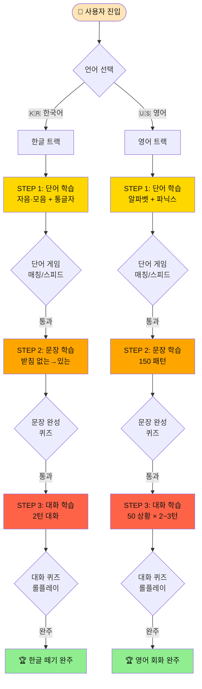
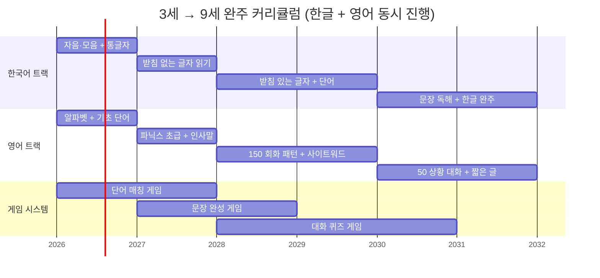
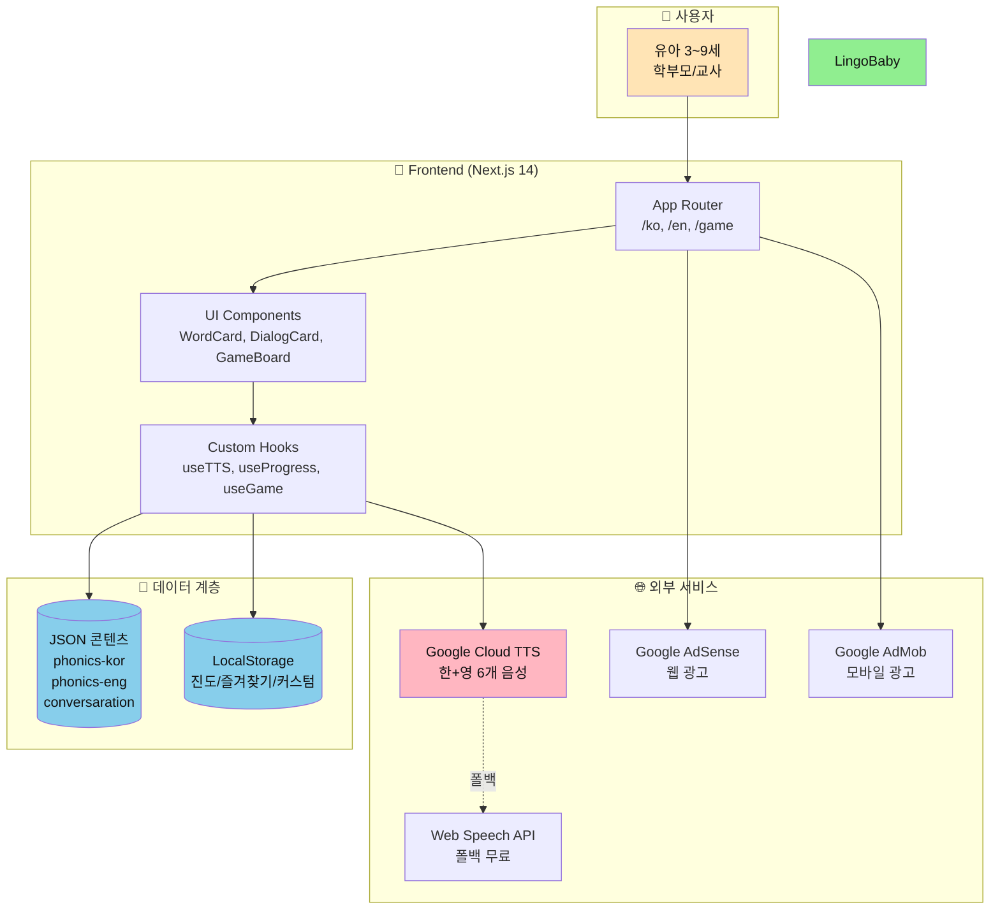
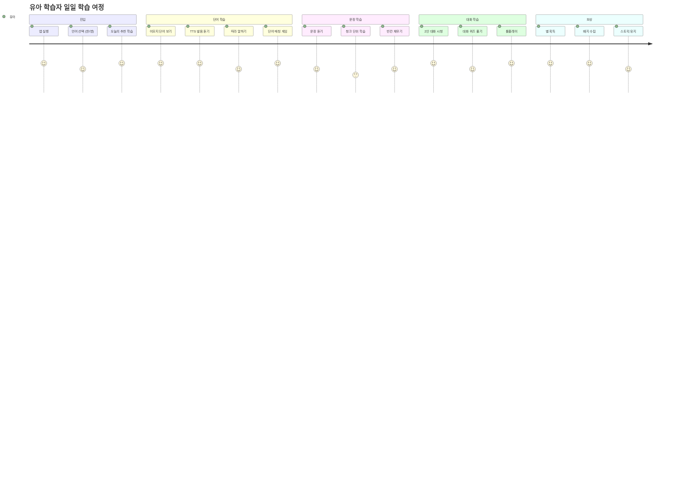
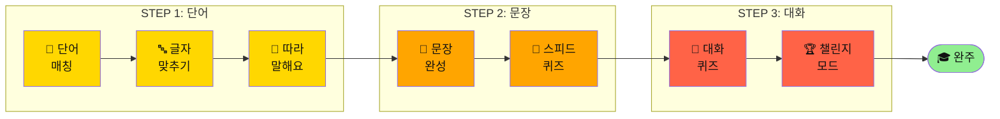
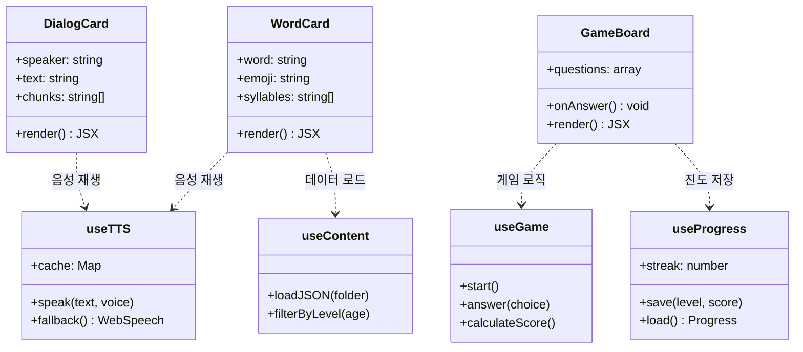
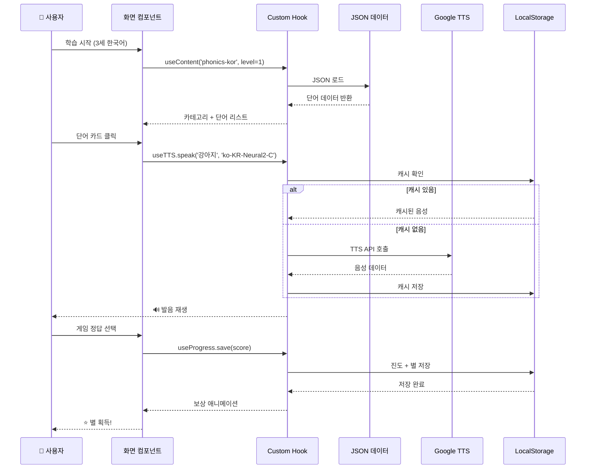
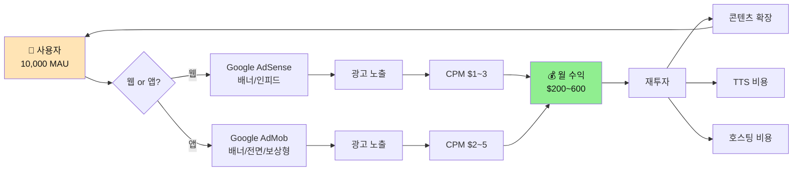
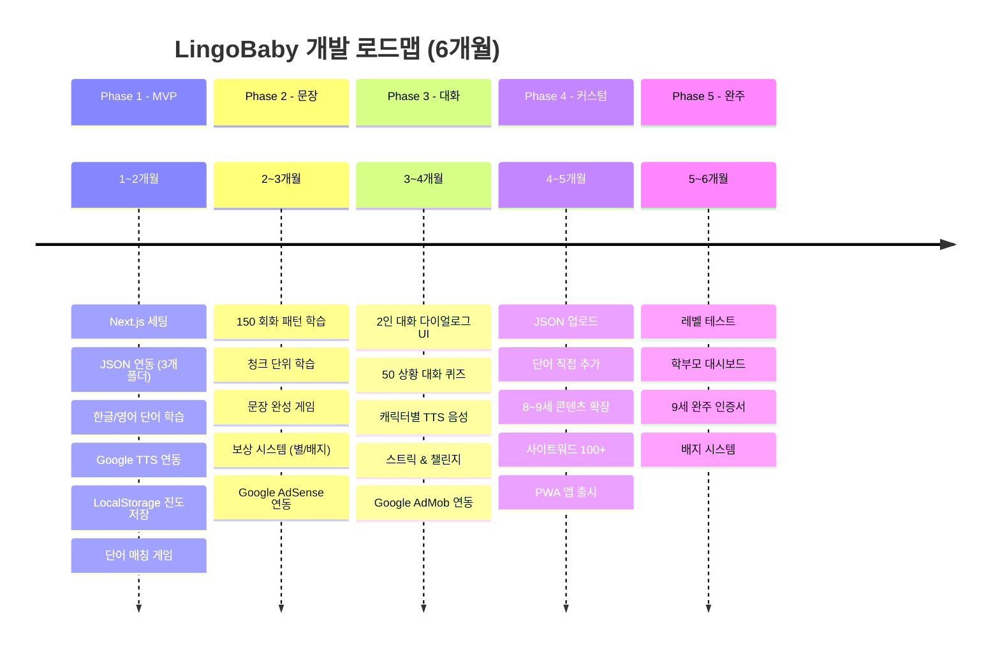

# 🌟 유아 영어·한글 학습 앱 프로젝트 기획서

> **프로젝트명**: LingoBaby (링고베이비)
> **버전**: v1.0 기획
> **작성일**: 2026-04-15
> **대상**: 유아 3세 이상 / 무료 / 웹+앱

---

## 1. 프로젝트 개요

### 1-1. 최종 학습 목표 (3세 → 9세 완주형)

```
🎯 최종 목표 (9세 종료 시점)
 │
 ├── 한국어 트랙 🇰🇷
 │    └── 🎓 한글 완전 떼기
 │         ├── 자음·모음 전체 인지
 │         ├── 받침 없는/있는 글자 읽기
 │         ├── 기본 단어 500+ 읽기
 │         ├── 간단 문장 독해
 │         └── 초등 1~2학년 문해력 수준
 │
 └── 영어 트랙 🇺🇸
      └── 🎓 간단 회화 + 읽기 가능
           ├── 기초 파닉스 (A~Z 음가)
           ├── 사이트워드 100+ 읽기
           ├── 일상 회화 50+ 상황 대응
           ├── 2~3턴 대화 수행
           └── 초등 저학년 영어 교과 수준
```

### 1-2. 연령대별 목표 매트릭스

| 연령 | 한국어 목표 | 영어 목표 | 핵심 콘텐츠 |
|------|------------|-----------|------------|
| **3~4세** | 자음·모음 익히기, 통글자 | 알파벳 + 기초 단어 | 단어 카드 + TTS |
| **5~6세** | 받침 없는 글자 읽기 | 파닉스 초급 + 인사말 | 단어 + 짧은 문장 |
| **7~8세** | 받침 있는 글자, 간단 문장 | 150 회화 패턴, 사이트워드 | 문장 + 청크 학습 |
| **9세** | 한글 완전 해득, 짧은 글 독해 | 50 상황 일상 회화 | 2~3턴 대화 퀴즈 |

### 1-3. 핵심 가치

| 항목 | 내용 |
|------|------|
| 무료 | 전면 무료 (광고 수익 모델) |
| 언어 | 영어 + 한국어 동시 지원 |
| 대상 | **3세 ~ 9세 (한글 떼기 + 영어 기초 회화/읽기 완주)** |
| 플랫폼 | 웹 (Next.js) + 모바일 반응형 |
| 수익 | Google AdMob + AdSense |
| 차별점 | 단계별 학습 + 게임 + 무료 + TTS + 한/영 통합 |

---


## 📊 핵심 도식 (Mermaid Diagrams)

### 도식 1: 전체 학습 플로우 (단어 → 문장 → 대화)



### 도식 2: 연령대별 학습 로드맵 (3세 → 9세)



### 도식 3: 경쟁사 포지셔닝 맵

```mermaid
%% NOTE: quadrantChart는 mermaid에서 공식적으로 지원되지 않는 차트 유형이므로, scatter plot(산점도 차트)로 변경하여 시각화 에러를 방지합니다.
%% 아래는 mermaid 10+ 버전의 공식 지원 문법입니다.
```mermaid
scatterChart
    title 경쟁 서비스 포지셔닝 (가격 vs 학습 깊이)
    x-axis 무료, 고가, 0, 1
    y-axis 학습 깊이 낮음, 학습 깊이 높음, 0, 1
    토도 한글 : 0.85, 0.85
    토도 영어 : 0.85, 0.80
    소중한글 : 0.75, 0.78
    호두잉글리시 : 0.55, 0.65
    Lingokids : 0.55, 0.55
    핑크퐁 슈퍼파닉스 : 0.35, 0.40
    아기상어 영어 : 0.35, 0.42
    뽀로로 한글박사 : 0.30, 0.30
    Duolingo ABC : 0.05, 0.45
    Khan Academy Kids : 0.05, 0.50
    앱들엄마 한글놀이 : 0.05, 0.20
    LingoBaby : 0.10, 0.75
```
※ 만약 scatterChart도 지원되지 않을 경우, 표로 정보를 제공하거나 mermaid 지원 범위 내 별도 안내 필요
```

### 도식 4: 시스템 아키텍처



### 도식 5: 사용자 학습 여정 (User Journey)



### 도식 6: 게임 → 학습 단계 매핑



### 도식 7: 컴포넌트 구조 (UI/비즈니스 분리)



### 도식 8: 데이터 흐름도 (JSON → 화면)



### 도식 9: 수익 모델 흐름도



### 도식 10: 개발 로드맵 타임라인



---

## 2. 경쟁 서비스 분석 (2025~2026 최신 기준)

### 2-1. 한글 학습 앱 경쟁사

| 앱명 | 가격 | 타겟 | 강점 | 약점 |
|------|------|------|------|------|
| **토도 한글** | 월 ₩49,000 | 4~9세 | AI 맞춤 커리큘럼, 3,500+ 활동, 200권 도서 | 고가, 전면 유료 |
| **소중한글** | 월 구독 (유료) | 3~9세 | 언어재활사 협업, 과학적 접근 | 학습 중심(재미 부족), 고가 |
| **뽀로로 한글박사** | ₩23,000~27,000 (인앱) | 2~6세 | 캐릭터 강력, 따라 말하기 쉬움 | 기초 단계만, 심화 부족 |
| **핑크퐁 한글** | 월 ₩11,000~ | 2~7세 | 캐릭터, 노래·게임 | 깊이 부족, 반복 학습 |
| **앱들엄마 한글놀이** | 무료(광고) | 2~6세 | 완전 무료, 아기자기 | 광고 많음, 기초만 |

### 2-2. 영어 학습 앱 경쟁사

| 앱명 | 가격 | 타겟 | 강점 | 약점 |
|------|------|------|------|------|
| **토도 영어** | 월 ₩49,000 | 5~10세 | AI 개인화, 광고 없음, 게임 중심 | 고가, 한국 교과 연계 약함 |
| **호두잉글리시** | 월 ₩20,000~30,000 | 초등 저학년~중1 | 음성인식 회화, 국내 1위 | 인식 오류, 읽기/쓰기 부족 |
| **Duolingo ABC** | **완전 무료** | 3~8세 | 파닉스 특화, 광고 없음 | 한국어 UI 부족, 깊이 얕음 |
| **Lingokids** | 월 ~₩20,000 | 4~10세 | 노래·애니, 글로벌 커리큘럼 | 고가, 영어권 중심 |
| **Khan Academy Kids** | **완전 무료** | 2~8세 | 완전 무료, 광고 없음 | 한국어 미지원, 교과 연계 없음 |
| **핑크퐁 슈퍼파닉스** | 월 ₩11,000 | 3~7세 | 캐릭터, 가성비, 노래 | 회화 부족, 단계 약함 |
| **아기상어 영어** | 월 ₩11,000, 연 ₩72,000 | 3~7세 | 글로벌 캐릭터, 파닉스+회화 | 깊이 얕음, 인앱 가격 편차 |
| **Endless Alphabet** | ₩12,000 (일시불) | 3~8세 | 시각 디자인, 단어 특화 | 단어만, 회화 부족 |

### 2-3. 가격대별 경쟁 구도

```
가격 스펙트럼
 │
 ├── 🆓 완전 무료
 │    ├── Duolingo ABC (파닉스만)
 │    ├── Khan Academy Kids (한국어 X)
 │    └── 앱들엄마 한글놀이 (기초만, 광고 많음)
 │       ❌ 한+영 통합 무료 앱 없음
 │
 ├── 💰 저가 (₩11,000~20,000/월)
 │    ├── 핑크퐁 슈퍼파닉스
 │    ├── 아기상어 영어
 │    └── Lingokids
 │
 ├── 💰💰 중가 (₩20,000~30,000/월)
 │    └── 호두잉글리시
 │
 └── 💰💰💰 고가 (₩49,000+/월)
      ├── 토도 한글
      ├── 토도 영어
      └── 핑크퐁 플러스 (₩70,000~132,000)
```

### 2-4. LingoBaby 차별화 포인트

| 경쟁사 문제 | LingoBaby 해결책 |
|------------|------------------|
| 토도(한글/영어) 각각 월 ₩49,000 = 월 10만원 부담 | **완전 무료** |
| Duolingo ABC = 영어만, 한국어 UI 없음 | **한+영 통합**, 한국어 네이티브 UI |
| Khan Academy Kids = 한국어 미지원 | **한국어 콘텐츠 자체 제작** (JSON) |
| 핑크퐁/뽀로로 = 기초 단계만 | **3세~9세 완주 커리큘럼** |
| 호두잉글리시 = 회화 중심, 읽기 약함 | **단어 → 문장 → 대화 3단계** |
| 앱들엄마 = 광고 과다 | **광고 최소 배치 전략** |

### 2-5. 포지셔닝 맵

```
                         [학습 깊이 높음]
                               │
            토도 한글/영어 ●   │   ● 소중한글
                               │
                               │  ⭐ LingoBaby (목표 위치)
      호두잉글리시 ●           │
                               │   ● Lingokids
  [유료]━━━━━━━━━━━━━━━━━━━━━━━━┼━━━━━━━━━━━━━━━━━━━━━━━━[무료]
                               │
            핑크퐁/아기상어 ●  │   ● Duolingo ABC
                               │   ● Khan Academy Kids
          뽀로로 한글박사 ●    │   ● 앱들엄마 한글놀이
                               │
                         [학습 깊이 낮음]

✨ LingoBaby 목표: 무료 + 학습 깊이 높음 (블루오션)
```

## 3. 주요 고객 페르소나

### 페르소나 1: 영유아 부모 (주 타겟)

```
👩 김지영 (33세, 워킹맘)
 ├── 직업: 직장인 (주 5일 근무)
 ├── 자녀: 4세 딸
 ├── 상황: 영어 학원 비용 부담 (월 15~20만원)
 ├── 니즈: 저렴하고 아이 혼자 할 수 있는 영어 학습
 ├── 불만: 기존 앱은 너무 어렵거나 너무 비쌈
 └── 기대: 아이가 즐기면서 영어·한글 기초 학습
```

### 페르소나 2: 조부모 (보조 타겟)

```
👴 박명수 (62세, 손자 돌봄)
 ├── 상황: 주중 손주 돌봄 담당
 ├── 니즈: 손주에게 교육적 콘텐츠 보여주고 싶음
 ├── 불만: 복잡한 앱은 사용 어려움
 └── 기대: 간단하고 바로 사용 가능한 학습 앱
```

### 페르소나 3: 어린이집·유치원 교사

```
👩‍🏫 이선생 (28세, 유치원 교사)
 ├── 상황: 수업 보조 자료 필요
 ├── 니즈: 무료로 사용할 수 있는 영어 학습 자료
 ├── 불만: 유료 앱은 기관 단위 구매 불가
 └── 기대: 커스터마이징 가능한 교육 콘텐츠
```

---

## 4. 학습 단계 설계 (Learning Stage)

### 4-1. 3단계 학습 플로우

```
[STEP 1] 단어 학습 (Words)
    │  ├── 그림 + 단어 + TTS 발음
    │  ├── 이모지 힌트
    │  ├── 음절 분리 학습 (한글: 강-아-지 / 영어: pup-py)
    │  └── 단어 퀴즈 게임
    ▼
[STEP 2] 간단 문장 (Simple Sentences)
    │  ├── 핵심 문장 패턴 (청크 단위)
    │  ├── 따라 말하기 (TTS 음성 따라하기)
    │  ├── 빈칸 채우기 게임
    │  └── 문장 완성 퀴즈
    ▼
[STEP 3] 일상 대화 (Daily Conversation)
       ├── 2인 대화 (어린이 ↔ 선생님/친구)
       ├── 상황별 롤플레이
       ├── 대화 퀴즈 (선택지 방식)
       └── 대화 완성 게임
```

### 4-2. 언어별 학습 경로

```
한국어 학습 트랙 (phonics-kor)
 ├── Level 1: 기초 단어 (동물, 음식, 색깔) - 3~4세
 ├── Level 2: 생활 단어 (가족, 집, 학교) - 4~5세
 ├── Level 3: 간단 문장 (주어+서술어) - 5~6세
 └── Level 4: 일상 대화 (2턴~5턴) - 6~7세

영어 학습 트랙 (phonics-eng)
 ├── Level 1: 기초 단어 (Animals, Colors, Food) - 3~4세
 ├── Level 2: 기본 인사 패턴 (Hi/Hello/Bye) - 4~5세
 ├── Level 3: 150 회화 패턴 - 5~6세
 └── Level 4: 상황별 대화 (50 상황 × 10턴) - 6세+
```

### 4-3. 현재 콘텐츠 자산 현황

```
📁 phonics-kor/
 ├── 한글_단어_데이터_확장판.json
 │    ├── 41개 카테고리
 │    ├── 1,000+ 단어
 │    └── 음절 분리 + 예문 2개 포함
 └── 영어_단어_데이터.json (영어 단어 기초)

📁 phonics-eng/
 ├── patterns_유아_150.json (3~7세 150패턴, 4개 상황)
 ├── patterns_초등_150.json (초등 150패턴)
 └── conversation_1000.json (11개 상황 × 1,000문장)

📁 conversaration/
 ├── patterns_유아_500.json (47개 상황 × 500문장, 대화형)
 ├── 영어회화_대화퀴즈_50가지_상황별_데이터.json (50 상황)
 └── 트러블_불편상황_20가지_데이터.json (20 상황)
```

---

## 5. 게임 시스템 설계

### 5-1. 게임 유형 (Learning + Game)

| 게임 타입 | 학습 단계 | 설명 | 난이도 |
|-----------|-----------|------|--------|
| 🎯 단어 매칭 | STEP 1 | 그림-단어 연결하기 | ⭐ |
| 🔤 글자 맞추기 | STEP 1 | 단어 음절 순서 맞추기 | ⭐⭐ |
| 🎵 따라 말해요 | STEP 1~2 | TTS 듣고 따라하기 | ⭐ |
| 🧩 문장 완성 | STEP 2 | 빈칸에 맞는 단어 고르기 | ⭐⭐ |
| 💬 대화 퀴즈 | STEP 3 | 대화 상황에서 맞는 답 선택 | ⭐⭐⭐ |
| 🌟 스피드 퀴즈 | STEP 1~3 | 시간 제한 단어/문장 맞추기 | ⭐⭐⭐ |
| 🏆 챌린지 모드 | STEP 2~3 | 연속 정답 스트릭 | ⭐⭐⭐⭐ |

### 5-2. 보상 시스템

```
포인트 & 보상 구조
 ├── ⭐ 별 3개 시스템 (학습 완료도)
 ├── 🏅 배지 (레벨업, 연속 학습, 완주)
 ├── 🎊 축하 애니메이션 (정답 시)
 ├── 📊 학습 진도 바
 └── 🔥 스트릭 카운터 (연속 학습일)
```

---

## 6. 기술 스택 및 아키텍처

### 6-1. 기술 스택

```
Frontend
 ├── Framework: Next.js 14+ (App Router)
 ├── Styling: Tailwind CSS + CSS Modules
 ├── State: React useState / useReducer
 ├── 음성: Google Cloud TTS API
 ├── 애니메이션: Framer Motion / CSS Animation
 └── 아이콘: 이모지 (무료) + Heroicons (무료)

데이터 관리
 ├── 콘텐츠: JSON 파일 (정적 데이터)
 ├── 학습 진도: LocalStorage
 ├── 즐겨찾기: LocalStorage
 └── 커스텀 단어: LocalStorage + JSON import/export

광고
 ├── 웹: Google AdSense
 └── 모바일 웹: Google AdMob (WebView)
```

### 6-2. 프로젝트 폴더 구조

```
/lingobaby
 ├── /public
 │    ├── /icons (이모지 fallback 이미지)
 │    └── /sounds (효과음 - 무료 사운드)
 ├── /src
 │    ├── /app (Next.js App Router)
 │    │    ├── /[lang] (ko/en 언어 라우팅)
 │    │    │    ├── /words
 │    │    │    ├── /sentences
 │    │    │    └── /conversation
 │    │    └── layout.tsx
 │    ├── /components
 │    │    ├── /ui (버튼, 카드, 모달)
 │    │    ├── /game (게임 컴포넌트)
 │    │    ├── /learn (학습 컴포넌트)
 │    │    └── /dialog (다이얼로그 컴포넌트)
 │    ├── /hooks (비즈니스 로직)
 │    │    ├── useTTS.ts (Google TTS)
 │    │    ├── useProgress.ts (학습 진도)
 │    │    ├── useGame.ts (게임 로직)
 │    │    └── useContent.ts (JSON 로드)
 │    ├── /data
 │    │    ├── /ko (한국어 JSON)
 │    │    └── /en (영어 JSON)
 │    └── /lib
 │         ├── tts.ts (TTS 유틸)
 │         ├── storage.ts (LocalStorage 유틸)
 │         └── content.ts (JSON 파싱 유틸)
 └── /data (원본 JSON 콘텐츠)
      ├── phonics-kor/
      ├── phonics-eng/
      └── conversaration/
```

### 6-3. 컴포넌트 설계 원칙

```
UI 로직 / 비즈니스 로직 분리
 ├── UI Components (표현만 담당)
 │    ├── WordCard.tsx → 단어 카드 렌더링
 │    ├── SentenceCard.tsx → 문장 카드 렌더링
 │    ├── DialogCard.tsx → 대화 다이얼로그 렌더링
 │    └── GameBoard.tsx → 게임판 렌더링
 └── Custom Hooks (로직 담당)
      ├── useWordGame() → 단어 게임 로직
      ├── useDialogQuiz() → 대화 퀴즈 로직
      ├── useProgress() → 진도 관리
      └── useTTS() → 음성 출력 로직
```

---

## 7. Google TTS 음성 지원 설계

### 7-1. TTS 음성 구성

| 언어 | 음성 ID | 타입 | 사용 상황 |
|------|---------|------|-----------|
| 영어 (미국) | en-US-Neural2-F | 여성 | 기본 학습 음성 |
| 영어 (미국) | en-US-Neural2-D | 남성 | 대화 캐릭터 B |
| 영어 (어린이) | en-US-Neural2-J | 어린이형 | 어린이 캐릭터 |
| 한국어 | ko-KR-Neural2-A | 여성 | 기본 한국어 |
| 한국어 | ko-KR-Neural2-B | 남성 | 대화 캐릭터 B |
| 한국어 | ko-KR-Neural2-C | 여성 (밝음) | 유아 학습 |

### 7-2. TTS 활용 흐름

```
TTS 사용 시나리오
 ├── 단어 학습: 단어 클릭 → TTS 발음 재생
 ├── 문장 학습: 문장 듣기 버튼 → 전체 문장 TTS
 ├── 청크 학습: 단어별 → 청크별 → 전체 문장 순서
 ├── 대화 퀴즈: 캐릭터별 다른 목소리 (어린이 ↔ 선생님)
 └── 정답/오답: 효과음 + TTS 피드백 음성
```

### 7-3. TTS 비용 최적화

```
비용 절감 전략
 ├── 사전 생성 오디오 캐싱 (자주 쓰는 단어/문장)
 ├── 브라우저 Web Speech API 폴백 (무료)
 ├── LocalStorage 음성 캐시 (재방문 시 재사용)
 └── Free Tier 한도 관리 (월 100만자 무료)
```

---

## 8. JSON 콘텐츠 관리 시스템

### 8-1. JSON 스키마 표준화

```json
// 단어 JSON 스키마 (표준)
{
  "title": "카테고리명",
  "version": "1.0",
  "language": "ko | en",
  "level": 1,
  "categories": [
    {
      "id": "animals",
      "name": "동물",
      "icon": "🐾",
      "level": 1,
      "color": "#FF3838",
      "words": [
        {
          "id": 1,
          "word": "강아지",
          "emoji": "🐶",
          "hint": "멍멍!",
          "syllables": ["강", "아", "지"],
          "tts": "강아지",
          "sentences": ["강아지 귀여워요.", "강아지랑 같이 뛰어!"]
        }
      ]
    }
  ]
}
```

```json
// 대화 JSON 스키마 (표준)
{
  "title": "대화 상황명",
  "version": "1.0",
  "situations": [
    {
      "id": 1,
      "emoji": "👋",
      "name": "인사",
      "nameEn": "Greetings",
      "color": "gradient string",
      "turns": [
        {
          "turn": 1,
          "role": "child",
          "speaker": "👧 어린이",
          "english": "Hi! How are you?",
          "korean": "안녕! 어떻게 지내?",
          "chunks": ["Hi!", "How", "are you?"],
          "ttsVoice": "child"
        }
      ]
    }
  ]
}
```

### 8-2. 커스터마이징 기능

```
사용자 커스텀 기능
 ├── 📤 JSON 파일 직접 업로드 (학원/교사용)
 ├── ➕ 단어/문장 직접 추가 (LocalStorage 저장)
 ├── 🔖 즐겨찾기 단어 모음
 ├── 📋 학습 목록 커스텀 (선택적 학습)
 └── 🎨 캐릭터/테마 선택
```

---

## 9. UI/UX 설계 (모바일 다이얼로그 중심)

### 9-1. 화면 구조

```
모바일 최적화 UI 구조
 ├── 메인 화면 (홈)
 │    ├── 언어 선택 (한국어 / 영어)
 │    ├── 학습 단계 선택 (단어/문장/대화)
 │    └── 오늘의 학습 추천
 │
 ├── 학습 화면
 │    ├── 상단: 진도바 + 현재 레벨
 │    ├── 중앙: 콘텐츠 카드 (큰 이모지 + 텍스트)
 │    ├── TTS 버튼 (🔊 크게)
 │    └── 하단: 액션 버튼
 │
 ├── 게임 화면 (다이얼로그 방식)
 │    ├── 전체화면 다이얼로그 팝업
 │    ├── 캐릭터 대화 버블
 │    ├── 선택지 버튼 (4개)
 │    └── 결과 애니메이션
 │
 └── 광고 영역
      ├── 상단 배너 (AdSense)
      ├── 게임 사이 전면 광고 (AdMob)
      └── 보상형 광고 (힌트 획득용)
```

### 9-2. 아이콘 전략 (무료 자원)

```
무료 아이콘 자원 활용
 ├── 🎨 이모지 (기본) → 모든 기기 지원, 무료
 ├── 🦸 Heroicons → MIT 라이선스, SVG
 ├── 📦 Lucide React → MIT 라이선스
 ├── 🌈 OpenMoji → 오픈소스 이모지
 └── 🖼️ 그림 카드 → Unsplash API (무료 쿼리)
```

---

## 10. 개발 로드맵

### 10-1. Phase별 개발 계획

```
Phase 1 - MVP (1~2개월)
 ├── ✅ Next.js 프로젝트 세팅
 ├── ✅ JSON 데이터 연동 (기존 3개 폴더)
 ├── ✅ 단어 학습 화면 (한국어)
 ├── ✅ 단어 학습 화면 (영어)
 ├── ✅ Google TTS 연동
 ├── ✅ LocalStorage 진도 저장
 └── ✅ 기본 게임 1종 (단어 매칭)

Phase 2 - 문장 학습 (2~3개월)
 ├── 문장 학습 화면 (150패턴)
 ├── 청크 단위 학습
 ├── 문장 완성 게임
 ├── 보상 시스템 (별, 배지)
 └── Google AdSense 연동

Phase 3 - 대화 퀴즈 (3~4개월)
 ├── 2인 대화 다이얼로그 UI
 ├── 상황별 대화 퀴즈
 ├── 캐릭터별 TTS 음성 분리
 ├── 스트릭 & 챌린지 모드
 └── Google AdMob 연동

Phase 4 - 커스터마이징 + 고학년 확장 (4~5개월)
 ├── JSON 업로드 기능
 ├── 단어 직접 추가 기능
 ├── 학습 목록 커스텀
 ├── 테마 선택
 ├── 초등 저학년 (8~9세) 콘텐츠 추가
 │    ├── 받침 있는 한글 독해
 │    └── 영어 사이트워드 100+ 게임
 └── PWA 앱 출시 (웹앱)

Phase 5 - 완주 커리큘럼 (5~6개월)
 ├── 레벨 테스트 기능 (현재 수준 진단)
 ├── 연령별 추천 학습 경로
 ├── 학부모 대시보드 (진도 확인)
 └── 9세 완주 인증서/배지 시스템
```

### 10-2. 웹 vs 앱 출시 전략

| 구분 | 웹 (브라우저) | 모바일 앱 (PWA/네이티브) |
|------|--------------|------------------------|
| 출시 시점 | Phase 1 | Phase 3~4 |
| 기술 | Next.js + Vercel | PWA or Capacitor.js |
| 광고 | AdSense | AdMob |
| 비용 | 무료 호스팅 | 스토어 등록비 |
| 업데이트 | 즉시 | 심사 필요 |
| 설치 불필요 | ✅ | ❌ |
| 오프라인 | ❌ (기본) | ✅ (PWA 서비스워커) |

---

## 11. 수익 모델

### 11-1. 광고 수익 구조

```
광고 배치 전략
 ├── 웹 (AdSense)
 │    ├── 상단 배너 (728×90)
 │    ├── 사이드 배너 (300×250)
 │    └── 인피드 광고 (학습 목록 사이)
 │
 └── 모바일 (AdMob)
      ├── 배너 광고 (하단 고정)
      ├── 전면 광고 (게임 완료 후)
      └── 보상형 광고 (힌트 1회 획득)
```

### 11-2. 수익 예측 (참고)

| 지표 | 목표값 |
|------|--------|
| MAU | 10,000명 (6개월) |
| DAU | 2,000명 |
| 세션/일 | 3~5분 |
| CPM (AdSense) | $1~3 |
| 월 예상 수익 | $200~600 |

---

## 12. 기존 폴더 분석 요약 (3개 폴더)

### 12-1. phonics-kor (한글 학습)

```
phonics-kor/
 ├── 한글_단어_데이터_확장판.json
 │    ├── 41개 카테고리 (동물, 음식, 색깔...)
 │    ├── 1,000+ 단어
 │    ├── 음절 분리: ['강','아','지']
 │    ├── 이모지 + 힌트 포함
 │    └── 예문 2개 포함
 ├── 영어_단어_데이터.json (영어 단어 기초)
 ├── 한글_단어_학습.html (v5)
 └── 한글_단어_학습_v6.html (최신)

활용 계획: STEP 1 한글 단어 학습 전 과정에 직접 사용
```

### 12-2. phonics-eng (영어 학습)

```
phonics-eng/
 ├── patterns_유아_150.json
 │    ├── 3~7세 대상 150 패턴
 │    ├── 4개 주요 상황
 │    └── 청크(chunks) 단위 분리
 ├── patterns_초등_150.json (초등 레벨)
 └── conversation_1000.json
      ├── 11개 실생활 상황
      └── 1,000 문장 (식당, 학교, 병원...)

활용 계획: STEP 1~2 영어 단어/문장 학습에 사용
```

### 12-3. conversaration (대화 퀴즈)

```
conversaration/
 ├── patterns_유아_500.json
 │    ├── 47개 대화 상황
 │    ├── 500+ 대화 문장
 │    ├── 2인 대화 형식 (어린이 ↔ 선생님)
 │    └── 턴(turn) 구조 데이터
 ├── 영어회화_대화퀴즈_50가지_상황별_데이터.json
 │    └── 50 상황 × 퀴즈 포맷
 └── 트러블_불편상황_20가지_데이터.json
      └── 생활 트러블 대화 20종

활용 계획: STEP 3 대화 퀴즈 전 과정의 핵심 데이터
```

---

## 13. 성공 지표 (KPI)

| KPI | 목표 (3개월) | 목표 (6개월) |
|-----|------------|------------|
| 일간 활성 사용자 (DAU) | 500명 | 2,000명 |
| 평균 세션 시간 | 3분 | 5분 |
| 재방문율 (7일) | 20% | 35% |
| 완료율 (학습 1세션) | 60% | 75% |
| 광고 클릭률 (CTR) | 1% | 2% |
| 월 수익 | $50 | $300 |

---

## 14. 리스크 & 대응 방안

| 리스크 | 대응 방안 |
|--------|-----------|
| TTS 비용 초과 | Web Speech API 폴백 + 캐싱 전략 |
| 광고 수익 낮음 | 보상형 광고 + 프리미엄 콘텐츠 옵션 |
| 모바일 성능 | Next.js 이미지 최적화 + 레이지 로딩 |
| 콘텐츠 부족 | JSON 커스터마이징 + 사용자 기여 모델 |
| 경쟁사 무료화 | 차별화 콘텐츠 + 커뮤니티 기능 추가 |

---

*📅 작성: 2026-04-15 | LingoBaby 프로젝트 기획서 v1.0*
