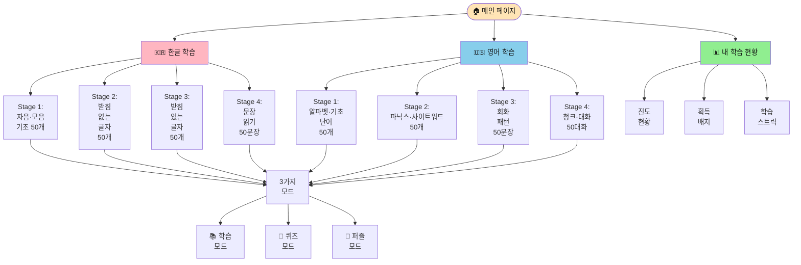
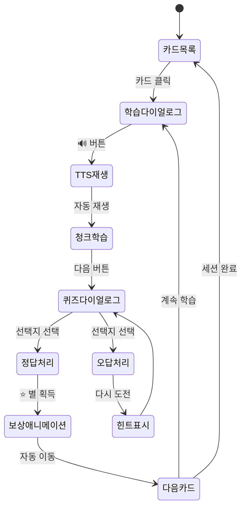
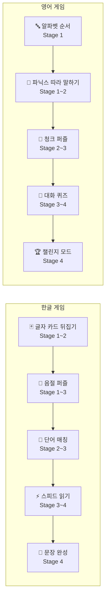
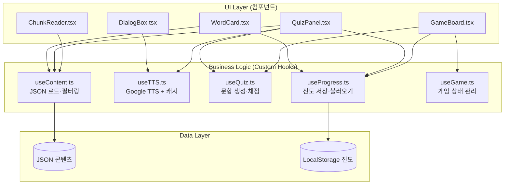
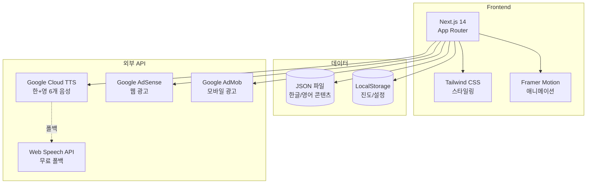
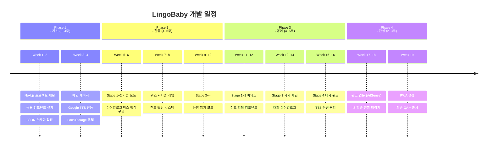
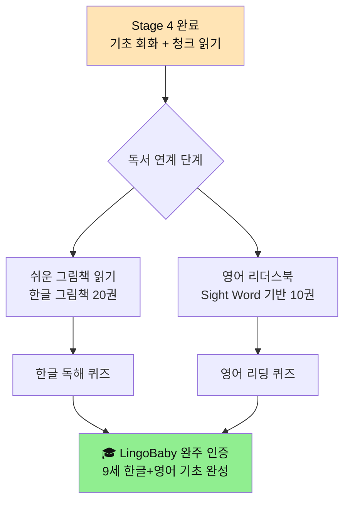

# 📋 LingoBaby 외주 개발 용역서

> **프로젝트**: 유아 한글·영어 학습 웹 서비스 (LingoBaby)
> **버전**: v1.0
> **작성일**: 2026-04-15
> **기술 스택**: Next.js 14 / JSON / LocalStorage / Google TTS
> **대상 연령**: 3세 ~ 9세

---

## 1. 프로젝트 요약

| 항목 | 내용 |
|------|------|
| **서비스명** | LingoBaby (링고베이비) |
| **목적** | 유아 한글 떼기 + 영어 간단 회화/청크 읽기 |
| **플랫폼** | 웹 (모바일 반응형) → 추후 PWA |
| **수익 모델** | Google AdSense (웹) / AdMob (모바일) |
| **학습 목표** | 단계별 50개 커리큘럼 × 4단계 × 2언어 |
| **학습 주기** | 주 2회 (회당 30~40분) |
| **콘텐츠 관리** | JSON 파일 (추가·업데이트 용이) |

---

## 2. 핵심 설계 원칙

```
두 마리 토끼 전략
 ├── 🎓 학습 (Learning)
 │    ├── 단계별 커리큘럼 (Stage 1~4 × 50개)
 │    ├── TTS 발음 + 청크 읽기
 │    └── 반복 학습 + 진도 트래킹
 └── 🎮 게임 (Game)
      ├── 다이얼로그 박스 집중 UI
      ├── 퀴즈 / 퍼즐 / 매칭 / 스피드
      └── 보상 시스템 (별 / 배지 / 스트릭)
```

---

## 3. 사이트맵 (Site Map)



---

## 4. 커리큘럼 설계 (Curriculum)

### 4-1. 한글 학습 커리큘럼 (4단계 × 50개)

```mermaid
flowchart LR
    subgraph S1["Stage 1 (3~4세)<br>기초 자음·모음 <br> 50개"]
        direction TB
        A1[모음 <br> 10개<br>ㅏㅑㅓㅕㅗㅛㅜㅠㅡㅣ]
        A2[기본 <br> 자음 <br> 10개<br>ㄱㄴㄷㄹㅁㅂㅅㅇㅈㅎ]
        A3[통글자 <br> 단어 <br> 30개<br>마마 아빠 나 바나나...]
    end
    subgraph S2["Stage 2 (5~6세)<br>받침 없는 글자 50개"]
        direction TB
        B1[가~하 <br> 기초 <br> 음절 20개]
        B2[2글자 <br> 단어 <br> 20개<br>고양이 나비 토끼...]
        B3[간단 <br> 문장 <br> 10개<br>나는 강아지야]
    end
    subgraph S3["Stage 3 (7~8세)<br>받침 있는 글자 50개"]
        direction TB
        C1[받침 <br> 자음 <br> 11개<br>ㄱㄴㄷㄹㅁㅂㅅㅇㅈㅊㅎ]
        C2[받침 <br> 단어 <br> 30개<br>밥 국 닭 사람...]
        C3[2~3어절 <br> 문장 10개]
    end
    subgraph S4["Stage 4 (8~9세)<br>문장 읽기 50문장"]
        direction TB
        D1[일상 <br> 단문 <br> 20개<br>밥 먹었어?]
        D2[대화형 <br> 문장<br> 20개<br>2인 대화]
        D3[짧은 글 읽기 10개]
    end

    S1 --> S2 --> S3 --> S4
```



#### Stage 1 샘플 (50개 중 첫 10개)

| # | 학습 항목 | 이모지 | 힌트 | TTS |
|---|-----------|--------|------|-----|
| 1 | 아 (ㅏ) | 👄 | 입 벌리고 "아~" | 아 |
| 2 | 이 (ㅣ) | 😁 | 이를 보이며 "이~" | 이 |
| 3 | 우 (ㅜ) | 😗 | 입술 모아 "우~" | 우 |
| 4 | 나 | 🙋 | 나는 나야! | 나 |
| 5 | 가 | 🚶 | 가자 가자! | 가 |
| 6 | 마마 | 👩 | 엄마 부를 때 | 마마 |
| 7 | 아빠 | 👨 | 아빠는 어디? | 아빠 |
| 8 | 바나나 | 🍌 | 노란 과일 | 바나나 |
| 9 | 포포 | 🍇 | 동그란 보라색 | 포도 |
| 10 | 고기 | 🥩 | 맛있는 고기 | 고기 |

---

### 4-2. 영어 학습 커리큘럼 (4단계 × 50개)

```mermaid
flowchart LR
    subgraph S1E["Stage 1 (3~4세)<br>알파벳·기초 단어 50개"]
        direction TB
        E1[알파벳 대소문자 26개]
        E2[기초 단어 24개<br>cat dog apple...]
    end
    subgraph S2E["Stage 2 (5~6세)<br>파닉스·사이트워드 50개"]
        direction TB
        F1[단모음 파닉스 20개<br>a-e-i-o-u 패턴]
        F2[사이트워드 20개<br>the a is I you...]
        F3[2음절 단어 10개<br>happy funny...]
    end
    subgraph S3E["Stage 3 (6~8세)<br>회화 패턴 50문장"]
        direction TB
        G1[인사·감정 15문장<br>Hi! I'm happy!]
        G2[일상 패턴 20문장<br>I want... Can I...]
        G3[질문·대답 15쌍<br>What is this? It's a...]
    end
    subgraph S4E["Stage 4 (7~9세)<br>청크·대화 50대화"]
        direction TB
        H1[청크 읽기 20개<br>Chunk: I want + 음식]
        H2[2턴 대화 20쌍<br>상황별 롤플레이]
        H3[3~5턴 대화 10쌍<br>생활 영어 대화]
    end

    S1E --> S2E --> S3E --> S4E
```



#### Stage 3 샘플 (회화 패턴 50문장 중 10개)

| # | 영어 | 한국어 | 청크 | 상황 |
|---|------|--------|------|------|
| 1 | Hi! How are you? | 안녕! 어때? | Hi! / How are you? | 인사 |
| 2 | I'm fine, thank you! | 나는 괜찮아, 고마워! | I'm fine / thank you! | 인사 |
| 3 | I want water. | 물 주세요. | I want / water | 요청 |
| 4 | Can I have more? | 더 주세요. | Can I have / more? | 요청 |
| 5 | I'm hungry. | 배고파요. | I'm / hungry | 감정 |
| 6 | Let's play! | 같이 놀자! | Let's / play! | 제안 |
| 7 | What is this? | 이게 뭐야? | What is / this? | 질문 |
| 8 | It's a dog! | 강아지야! | It's / a dog! | 대답 |
| 9 | I love you! | 사랑해! | I love / you! | 감정 |
| 10 | Good night! | 잘 자! | Good / night! | 인사 |

---

## 5. 페이지별 역할 정의

### 5-1. 메인 페이지 (Main)

```
역할: 서비스 소개 + 언어 선택 진입점
────────────────────────────────────────
[레이아웃]
 ┌─────────────────────────────────────┐
 │  🌟 LingoBaby                 🔔 MY │
 ├─────────────────────────────────────┤
 │   "매일 10분, 한글과 영어를 함께!"  │
 │                                     │
 │   ┌──────────┐  ┌──────────┐        │
 │   │ 🇰🇷 한글  │  │ 🇺🇸 영어  │        │
 │   │  학습    │  │  학습    │        │
 │   └──────────┘  └──────────┘        │
 │                                     │
 │   📊 오늘의 학습 현황               │
 │   🔥 연속 학습 3일!                 │
 │   [광고 배너]                       │
 └─────────────────────────────────────┘

주요 컴포넌트
 ├── LanguageSelector (한/영 선택 카드)
 ├── TodayProgress (오늘 진도 요약)
 ├── StreakCounter (연속 학습일)
 └── AdBanner (Google AdSense)
```

### 5-2. 한글 학습 페이지 (Korean Learning)

```
역할: 4단계 한글 커리큘럼 + 3가지 학습 모드
────────────────────────────────────────
[레이아웃]
 ┌─────────────────────────────────────┐
 │ ← 한글 학습          진도 ██░░ 50%  │
 ├─────────────────────────────────────┤
 │ [Stage1] [Stage2] [Stage3] [Stage4] │
 ├─────────────────────────────────────┤
 │ [📚 학습] [🎯 퀴즈] [🧩 퍼즐]       │
 ├─────────────────────────────────────┤
 │                                     │
 │   콘텐츠 영역 (카테고리/카드/게임)  │
 │                                     │
 │          ▼ 다이얼로그 팝업          │
 │   ┌─────────────────────────┐       │
 │   │   🐶 강아지             │       │
 │   │   [강][아][지]          │       │
 │   │   🔊 발음 듣기          │       │
 │   │  ┌──┐ ┌──┐ ┌──┐ ┌──┐  │       │
 │   │  │나│ │고│ │강│ │바│  │       │
 │   │  └──┘ └──┘ └──┘ └──┘  │       │
 │   └─────────────────────────┘       │
 └─────────────────────────────────────┘

주요 컴포넌트
 ├── StageSelector (Stage 1~4 탭)
 ├── ModeSelector (학습/퀴즈/퍼즐)
 ├── WordCard (단어 카드 그리드)
 ├── LearningDialog (다이얼로그 집중 학습)
 ├── QuizDialog (퀴즈 다이얼로그)
 └── PuzzleBoard (낱말 퍼즐)
```

### 5-3. 영어 학습 페이지 (English Learning)

```
역할: 4단계 영어 커리큘럼 + 청크 읽기 + 대화 퀴즈
────────────────────────────────────────
[레이아웃]
 ┌─────────────────────────────────────┐
 │ ← 영어 학습          진도 ██░░ 50%  │
 ├─────────────────────────────────────┤
 │ [Stage1] [Stage2] [Stage3] [Stage4] │
 ├─────────────────────────────────────┤
 │ [📚 학습] [🎯 퀴즈] [💬 대화]       │
 ├─────────────────────────────────────┤
 │                                     │
 │   ▼ Stage3/4: 대화 다이얼로그       │
 │   ┌─────────────────────────┐       │
 │   │ 👧 Hi! How are you?     │       │
 │   │  [Hi!] [How] [are you?] │       │
 │   │ 🔊 ← 청크 클릭 학습    │       │
 │   │                         │       │
 │   │ 다음 답을 선택하세요:   │       │
 │   │ ┌──────────┐ ┌──────────┐│      │
 │   │ │I'm fine! │ │I'm sad   ││      │
 │   │ └──────────┘ └──────────┘│      │
 │   └─────────────────────────┘       │
 └─────────────────────────────────────┘

주요 컴포넌트
 ├── StageSelector (Stage 1~4)
 ├── PhonicsCard (파닉스 카드)
 ├── ChunkReader (청크 읽기 뷰어)
 ├── ConversationDialog (대화 다이얼로그)
 ├── QuizDialog (선택지 퀴즈)
 └── TTS Controller (음성 선택/재생)
```

### 5-4. 내 학습 현황 페이지 (My Progress)

```
역할: 진도/배지/스트릭 확인 (LocalStorage 기반)
────────────────────────────────────────
주요 컴포넌트
 ├── ProgressChart (한글/영어 진도 차트)
 ├── BadgeCollection (획득 배지 컬렉션)
 ├── StreakCalendar (학습 달력)
 └── WeeklyGoal (주 2회 목표 현황)
```

---

## 6. 다이얼로그 박스 설계 (집중 학습 UI)



### 다이얼로그 유형별 역할

| 다이얼로그 | 용도 | 포함 요소 |
|-----------|------|-----------|
| **학습 다이얼로그** | 단어/문장 집중 학습 | 이모지 + 텍스트 + TTS + 청크 버튼 |
| **퀴즈 다이얼로그** | 4지선다 퀴즈 | 문제 + 선택지 4개 + 카운트다운 |
| **퍼즐 다이얼로그** | 낱말 퍼즐 | 드래그&드롭 음절 맞추기 |
| **대화 다이얼로그** | 2인 대화 롤플레이 | 캐릭터 말풍선 + 선택지 |
| **결과 다이얼로그** | 세션 완료 결과 | 별 획득 + 배지 + 다음 단계 |

---

## 7. 게임 시스템 설계

### 7-1. 게임 유형 × 학습 단계 매핑



### 7-2. 공통 게임 규칙

| 규칙 | 내용 |
|------|------|
| **세션당 문항 수** | 10문항 (50개 중 랜덤 출제) |
| **제한 시간** | 문항당 15초 (퀴즈 모드) |
| **힌트** | 1세션 3회 (보상형 광고 시청 시 +3회) |
| **합격 기준** | 7/10 이상 → ⭐⭐⭐ 완료 |
| **오답 처리** | 오답 단어 세션 말미 재출제 |
| **보상** | 별 3개 → 배지 → 다음 Stage 해금 |

---

## 8. 개발 방향성 (Development Direction)

### 8-1. 비즈니스 로직 / UI 로직 분리



### 8-2. JSON 콘텐츠 관리 구조

```
/data
 ├── ko/                         ← 한글 콘텐츠
 │    ├── stage1_자음모음.json
 │    ├── stage2_받침없는글자.json
 │    ├── stage3_받침있는글자.json
 │    └── stage4_문장읽기.json
 └── en/                         ← 영어 콘텐츠
      ├── stage1_alphabet.json
      ├── stage2_phonics.json
      ├── stage3_patterns.json
      └── stage4_conversation.json
```

**JSON 스키마 표준 (단어)**

```json
{
  "stage": 1,
  "language": "ko",
  "title": "Stage 1: 자음·모음 50개",
  "items": [
    {
      "id": 1,
      "word": "강아지",
      "emoji": "🐶",
      "hint": "멍멍!",
      "syllables": ["강", "아", "지"],
      "tts": "강아지",
      "sentences": ["강아지 귀여워요.", "강아지랑 놀자!"],
      "level": 1
    }
  ]
}
```

**JSON 스키마 표준 (대화)**

```json
{
  "stage": 4,
  "language": "en",
  "title": "Stage 4: 청크 대화 50",
  "items": [
    {
      "id": 1,
      "situation": "인사",
      "emoji": "👋",
      "turns": [
        {
          "role": "child",
          "text": "Hi! How are you?",
          "korean": "안녕! 어때?",
          "chunks": ["Hi!", "How", "are you?"],
          "voice": "child"
        },
        {
          "role": "teacher",
          "text": "I'm fine, thank you!",
          "korean": "나는 괜찮아, 고마워!",
          "chunks": ["I'm fine,", "thank you!"],
          "voice": "teacher"
        }
      ],
      "quiz_choices": [
        "I'm fine, thank you!",
        "I'm very sad.",
        "I don't know.",
        "Goodbye!"
      ],
      "answer": 0
    }
  ]
}
```

### 8-3. 컴포넌트 재사용 원칙

```
공통 컴포넌트 (한글/영어 공용)
 ├── <StageBar />         → Stage 1~4 탭 네비게이션
 ├── <ModeSelector />     → 학습/퀴즈/퍼즐 전환
 ├── <DialogBox />        → 집중 학습 다이얼로그 (핵심)
 ├── <TTSButton />        → 음성 재생 버튼
 ├── <ProgressBar />      → 진도 표시 바
 ├── <StarReward />       → 별 획득 애니메이션
 ├── <QuizChoices />      → 4지선다 선택지
 └── <AdBanner />         → 광고 배너

언어별 전용 컴포넌트
 ├── 한글 전용
 │    ├── <SyllableBlock />    → 음절 분리 블록
 │    └── <JasoCombiner />     → 자소 조합 인터랙션
 └── 영어 전용
      ├── <ChunkReader />      → 청크 강조 표시
      └── <ConvBubble />       → 대화 말풍선
```

---

## 9. 주 2회 학습 스케줄 가이드

```mermaid
gantt
    title 주 2회 학습 스케줄 (회당 30~40분)
    dateFormat  D
    axisFormat 주%W

    section 1회차 (예: 화요일)
    준비 워밍업 (5분)         :w1, 1, 1d
    신규 학습 모드 (15분)     :w2, after w1, 1d
    퀴즈 게임 (10분)          :w3, after w2, 1d
    복습 + 보상 (5~10분)      :w4, after w3, 1d

    section 2회차 (예: 목요일)
    지난 복습 퀴즈 (10분)     :w5, 4, 1d
    신규 학습 모드 (15분)     :w6, after w5, 1d
    퍼즐 게임 (10분)          :w7, after w6, 1d
    이번 주 정리 (5분)        :w8, after w7, 1d
```



### 단계별 완료 기간 (주 2회 기준)

| 단계 | 항목 수 | 완료 기간 | 학습 방식 |
|------|---------|-----------|-----------|
| Stage 1 | 50개 | 약 5~6주 | 단어 카드 + 매칭 게임 |
| Stage 2 | 50개 | 약 5~6주 | 음절 학습 + 퍼즐 |
| Stage 3 | 50개 | 약 6~8주 | 문장 읽기 + 퀴즈 |
| Stage 4 | 50대화 | 약 8~10주 | 대화 퀴즈 + 챌린지 |
| **전체** | **200개** | **약 24~30주 (6~7개월)** | **주 2회 완주** |

---

## 10. 개발 범위 및 요구사항 명세

### 10-1. 공통 기능 요구사항

| 기능 | 설명 | 우선순위 |
|------|------|---------|
| JSON 로드 | 단계별 JSON 파일 로드 및 파싱 | 필수 |
| Google TTS | 한국어/영어 음성 재생 (6종) | 필수 |
| Web Speech API | TTS 폴백 (무료) | 필수 |
| LocalStorage | 진도·즐겨찾기·설정 저장 | 필수 |
| 다이얼로그 박스 | 집중 학습 팝업 UI | 필수 |
| 반응형 레이아웃 | 모바일 360px ~ 데스크탑 | 필수 |
| 진도 표시 | 스테이지별 완료율 시각화 | 필수 |
| 보상 시스템 | 별·배지·스트릭 | 필수 |
| 광고 연동 | AdSense / AdMob 배너 | 필수 |
| JSON 업로드 | 커스텀 콘텐츠 추가 (교사용) | 권장 |
| PWA 설정 | 앱처럼 설치 가능 | 권장 |
| 오프라인 모드 | Service Worker 캐싱 | 선택 |

### 10-2. 페이지별 개발 체크리스트

```
✅ 메인 페이지
 ├── [ ] 언어 선택 카드 (한글/영어)
 ├── [ ] 오늘의 학습 현황 위젯
 ├── [ ] 연속 학습 스트릭 표시
 └── [ ] 광고 배너 영역

✅ 한글 학습 페이지
 ├── [ ] Stage 1~4 탭 전환
 ├── [ ] 학습/퀴즈/퍼즐 모드 탭
 ├── [ ] 단어 카드 그리드 (카테고리별)
 ├── [ ] 학습 다이얼로그 (이모지+음절+TTS)
 ├── [ ] 퀴즈 다이얼로그 (4지선다+카운트다운)
 ├── [ ] 낱말 퍼즐 (드래그&드롭)
 └── [ ] 진도 저장 (LocalStorage)

✅ 영어 학습 페이지
 ├── [ ] Stage 1~4 탭 전환
 ├── [ ] 학습/퀴즈/대화 모드 탭
 ├── [ ] 파닉스 카드 (Stage 1~2)
 ├── [ ] 청크 리더 (Stage 3~4)
 ├── [ ] 대화 다이얼로그 (말풍선+선택지)
 ├── [ ] TTS 음성 선택 (남성/여성/어린이)
 └── [ ] 진도 저장 (LocalStorage)

✅ 내 학습 현황
 ├── [ ] 한글/영어 진도 차트
 ├── [ ] 획득 배지 갤러리
 ├── [ ] 주간 학습 달력
 └── [ ] 주 2회 목표 달성률
```

### 10-3. 기술 스택 명세



---

## 11. 개발 일정 (Phase별)



---

## 12. 개발 비용 산정 기준 (참고)

| 항목 | 예상 기간 | 비고 |
|------|-----------|------|
| 메인 페이지 | 3일 | 심플 레이아웃 |
| 공통 컴포넌트 | 7일 | 재사용 컴포넌트 풀 |
| 한글 학습 4단계 | 15일 | 다이얼로그+퀴즈+퍼즐 |
| 영어 학습 4단계 | 15일 | 청크+대화+퀴즈 |
| 게임 시스템 | 10일 | 5종 게임 |
| TTS 연동 | 3일 | Google API + 캐시 |
| 진도/보상 시스템 | 5일 | LocalStorage |
| 광고 연동 | 2일 | AdSense/AdMob |
| JSON 콘텐츠 작업 | 10일 | 200개 항목 |
| QA + 배포 | 5일 | Vercel 배포 |
| **합계** | **약 75일** | **단독 개발 기준** |

---

## 13. 추후 확장 계획 (독서 연계)



### 독서 연계 방향

| 단계 | 연계 콘텐츠 | 시기 |
|------|------------|------|
| 한글 Stage 4 이후 | 그림책 읽기 (JSON 텍스트 연동) | Phase 5 |
| 영어 Stage 4 이후 | 영어 리더스북 (Level 1~2) | Phase 5 |
| 최종 | 어휘 기반 독서 퀴즈 | Phase 6 |

---

*📅 작성: 2026-04-15 | LingoBaby 외주 개발 용역서 v1.0*
*📌 기존 HTML 레퍼런스: `phonics_viewer.html`, `한글_단어_학습_v6.html` 분석 반영*
