# 📋 LingoBaby 외주 개발 용역서 v2 (확장판)

> **프로젝트**: 유아 한글·영어 학습 웹 서비스 (LingoBaby)
> **버전**: v2.0 확장판
> **작성일**: 2026-04-15
> **레퍼런스**: `phonics_viewer.html` / `한글_단어_학습_v6.html` 분석 반영
> **기술 스택**: Next.js 14 / TypeScript / Tailwind CSS / JSON / LocalStorage / Google TTS

---

## 1. 프로젝트 핵심 목표

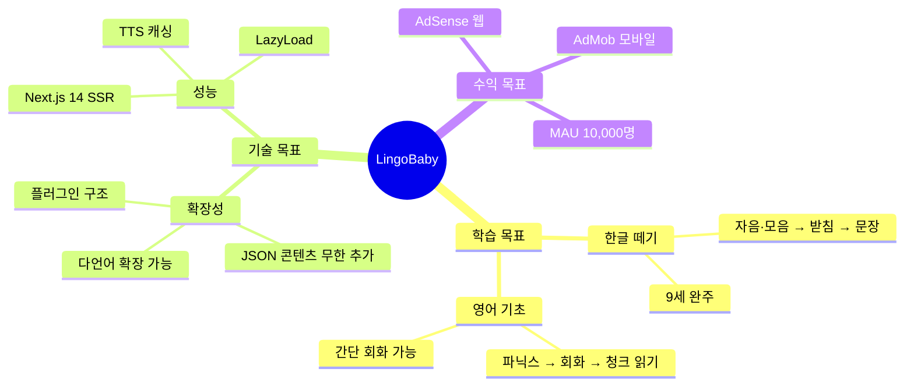

---

## 2. 아이콘 시스템 설계 (Icon System)

### 2-1. 아이콘 라이브러리 최종 선택

| 라이브러리 | 용도 | 아이콘 수 | 라이선스 | 추천도 |
|-----------|------|---------|---------|--------|
| **이모지 (기본)** | 단어 카드, 힌트, 캐릭터 | 3,600+ | 무료 | ⭐⭐⭐⭐⭐ |
| **@iconify/react** | UI 아이콘 (버튼/메뉴) | 200,000+ | MIT | ⭐⭐⭐⭐⭐ |
| **@phosphor-icons/react** | 학습 UI 전용 | 9,000+ | MIT | ⭐⭐⭐⭐ |
| **react-icons (Md/Ri 서브셋)** | 일반 UI 대안 | 50,000+ | MIT | ⭐⭐⭐ |
| ~~Twemoji CDN~~ | (기존 사용) | 이모지셋 | CC BY 4.0 | 대체 권장 |

### 2-2. 권장 아이콘 조합 전략

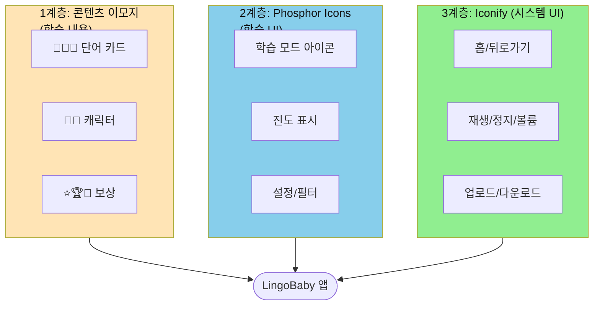

### 2-3. 아이콘 설치 및 config 설정

```bash
# 설치 명령어
npm install @phosphor-icons/react
npm install @iconify/react
# react-icons는 선택적 설치
npm install react-icons
```

```typescript
// src/config/icons.config.ts  ← 모든 아이콘 중앙 관리

import {
  Book, Puzzle, Trophy, Star, SmileyWink,
  SpeakerHigh, Play, House, ArrowLeft,
  CheckCircle, XCircle, Timer, Lightbulb
} from '@phosphor-icons/react';
import { Icon as IconifyIcon } from '@iconify/react';

// ─── 유아 친화 색상 팔레트 ───────────────────────
export const kidColors = {
  red:    '#FF6B6B',
  pink:   '#FF69B4',
  yellow: '#FFD700',
  green:  '#4CAF50',
  blue:   '#4A90E2',
  purple: '#9B59B6',
  orange: '#FF8C00',
  sky:    '#87CEEB',
} as const;

// ─── 아이콘 사이즈 표준 ───────────────────────────
export const iconSize = {
  xs: 16,  sm: 20,  md: 28,
  lg: 36,  xl: 48,  xxl: 64,
} as const;

// ─── Phosphor 아이콘 맵 (학습 UI) ────────────────
export const learnIcons = {
  book:     Book,
  puzzle:   Puzzle,
  trophy:   Trophy,
  star:     Star,
  smile:    SmileyWink,
  speaker:  SpeakerHigh,
  play:     Play,
  home:     House,
  back:     ArrowLeft,
  correct:  CheckCircle,
  wrong:    XCircle,
  timer:    Timer,
  hint:     Lightbulb,
} as const;

// ─── Iconify 아이콘 ID 맵 (시스템 UI) ────────────
export const systemIconIds = {
  upload:   'mdi:upload',
  download: 'mdi:download',
  settings: 'mdi:cog-outline',
  badge:    'mdi:medal-outline',
  streak:   'mdi:fire',
  calendar: 'mdi:calendar-check',
  chart:    'mdi:chart-bar',
  refresh:  'mdi:refresh',
  close:    'mdi:close-circle-outline',
  next:     'mdi:arrow-right-circle',
} as const;
```

### 2-4. 재사용 아이콘 컴포넌트

```typescript
// src/components/ui/KidIcon.tsx

'use client';
import { learnIcons, iconSize, kidColors } from '@/config/icons.config';
import { Icon as Iconify } from '@iconify/react';
import { systemIconIds } from '@/config/icons.config';
import type { IconWeight } from '@phosphor-icons/react';

type LearnIconName = keyof typeof learnIcons;
type SystemIconName = keyof typeof systemIconIds;
type IconSize = keyof typeof iconSize;

interface KidIconProps {
  name: LearnIconName | SystemIconName;
  size?: IconSize;
  color?: string;
  weight?: IconWeight;
  animate?: boolean;
  className?: string;
}

export function KidIcon({
  name, size = 'md', color = kidColors.blue,
  weight = 'regular', animate = false, className = ''
}: KidIconProps) {
  const animClass = animate ? 'hover:scale-125 transition-transform duration-200' : '';

  // Phosphor (학습 UI)
  if (name in learnIcons) {
    const Icon = learnIcons[name as LearnIconName];
    return (
      <Icon
        size={iconSize[size]} color={color} weight={weight}
        className={`${animClass} ${className}`}
      />
    );
  }

  // Iconify (시스템 UI)
  const iconId = systemIconIds[name as SystemIconName];
  return (
    <Iconify
      icon={iconId} width={iconSize[size]} height={iconSize[size]}
      style={{ color }} className={`${animClass} ${className}`}
    />
  );
}
```

---

## 3. 사이트맵 (전체 라우팅 구조)

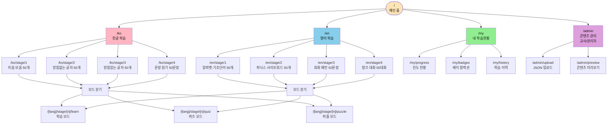

---

## 4. 확장성 중심 아키텍처

### 4-1. 전체 시스템 구조

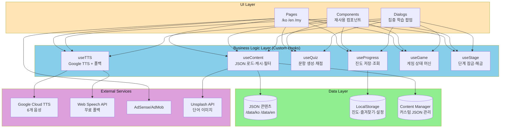

### 4-2. 확장 포인트 (Extension Points)

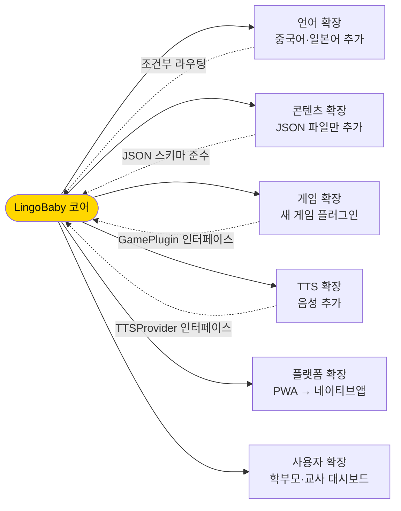

### 4-3. 컴포넌트 트리 (재사용 구조)

```
src/
 ├── app/                          ← Next.js App Router
 │    ├── layout.tsx               ← 루트 레이아웃 (광고 Provider)
 │    ├── page.tsx                 ← 메인 홈
 │    ├── ko/
 │    │    └── stage/[stageId]/
 │    │         └── [mode]/page.tsx
 │    ├── en/
 │    │    └── stage/[stageId]/
 │    │         └── [mode]/page.tsx
 │    ├── my/page.tsx
 │    └── admin/page.tsx
 │
 ├── components/
 │    ├── ui/                      ← 공통 원자 컴포넌트
 │    │    ├── KidIcon.tsx         ← 아이콘 통합 컴포넌트
 │    │    ├── KidButton.tsx       ← 유아 친화 버튼
 │    │    ├── ProgressBar.tsx     ← 진도 바
 │    │    ├── StarReward.tsx      ← 별 보상 애니메이션
 │    │    ├── AdBanner.tsx        ← 광고 배너
 │    │    └── TTSButton.tsx       ← 음성 재생 버튼
 │    │
 │    ├── layout/                  ← 레이아웃 컴포넌트
 │    │    ├── StageNav.tsx        ← Stage 1~4 탭
 │    │    ├── ModeSelector.tsx    ← 학습/퀴즈/퍼즐 탭
 │    │    └── BottomNav.tsx       ← 하단 네비게이션
 │    │
 │    ├── learn/                   ← 학습 전용 컴포넌트
 │    │    ├── WordCard.tsx        ← 단어 카드 (한/영 공용)
 │    │    ├── SentenceCard.tsx    ← 문장 카드
 │    │    ├── ChunkReader.tsx     ← 청크 읽기 (영어)
 │    │    ├── SyllableBlock.tsx   ← 음절 블록 (한글)
 │    │    └── ConvBubble.tsx      ← 대화 말풍선
 │    │
 │    ├── game/                    ← 게임 컴포넌트
 │    │    ├── MatchGame.tsx       ← 단어 매칭 게임
 │    │    ├── QuizGame.tsx        ← 4지선다 퀴즈
 │    │    ├── PuzzleGame.tsx      ← 드래그 퍼즐
 │    │    ├── SpeedGame.tsx       ← 스피드 읽기
 │    │    └── DialogGame.tsx      ← 대화 퀴즈
 │    │
 │    └── dialog/                  ← 다이얼로그 시스템
 │         ├── DialogBox.tsx       ← 기본 다이얼로그 컨테이너
 │         ├── LearnDialog.tsx     ← 학습 다이얼로그
 │         ├── QuizDialog.tsx      ← 퀴즈 다이얼로그
 │         ├── ResultDialog.tsx    ← 결과 다이얼로그
 │         └── HintDialog.tsx      ← 힌트 다이얼로그
 │
 ├── hooks/                        ← 비즈니스 로직
 │    ├── useContent.ts            ← JSON 로드·필터·캐시
 │    ├── useTTS.ts                ← Google TTS + 폴백
 │    ├── useQuiz.ts               ← 문항 생성·채점
 │    ├── useProgress.ts           ← 진도 저장·조회
 │    ├── useGame.ts               ← 게임 상태 머신
 │    └── useStage.ts              ← 단계 잠금·해금 관리
 │
 ├── config/                       ← 설정 파일 모음
 │    ├── icons.config.ts          ← 아이콘 통합 설정
 │    ├── tts.config.ts            ← TTS 음성 설정
 │    ├── game.config.ts           ← 게임 규칙 설정
 │    ├── stage.config.ts          ← 단계별 잠금 규칙
 │    └── ad.config.ts             ← 광고 배치 설정
 │
 ├── lib/                          ← 유틸리티
 │    ├── storage.ts               ← LocalStorage 추상화
 │    ├── tts.ts                   ← TTS API 래퍼
 │    ├── content.ts               ← JSON 파서·검증
 │    └── shuffle.ts               ← 랜덤 셔플
 │
 └── data/                         ← JSON 콘텐츠
      ├── ko/
      │    ├── stage1.json
      │    ├── stage2.json
      │    ├── stage3.json
      │    └── stage4.json
      └── en/
           ├── stage1.json
           ├── stage2.json
           ├── stage3.json
           └── stage4.json
```

---

## 5. JSON 스키마 완전 정의 (확장 가능 구조)

### 5-1. 단어 JSON 스키마 (한글/영어 공용)

```typescript
// types/content.types.ts

export interface WordItem {
  id: number;
  word: string;           // "강아지" | "puppy"
  emoji: string;          // "🐶"
  hint: string;           // "멍멍!" | "Woof!"
  syllables: string[];    // ["강","아","지"] | ["pup","py"]
  tts: string;            // TTS 읽기 텍스트
  sentences: string[];    // 예문 2개
  level: number;          // 1~4
  tags?: string[];        // ["동물", "애완동물"]
  imageQuery?: string;    // Unsplash 검색어
}

export interface Category {
  id: string;             // "animals"
  name: string;           // "동물"
  nameEn?: string;        // "Animals"
  icon: string;           // "🐾"
  color: string;          // "#FF3838"
  gradient: string;       // "linear-gradient(...)"
  level: number;          // 해금 단계
  words: WordItem[];
}

export interface StageContent {
  stage: number;          // 1~4
  language: 'ko' | 'en' | string;  // 확장 가능
  title: string;
  description: string;
  totalItems: number;
  categories: Category[];
  meta: {
    version: string;
    createdAt: string;
    author?: string;
  };
}
```

### 5-2. 대화 JSON 스키마

```typescript
export interface ConvTurn {
  turn: number;
  role: 'child' | 'teacher' | 'friend' | string; // 확장 가능
  speaker: string;        // "👧 어린이"
  text: string;           // "Hi! How are you?"
  korean?: string;        // 한국어 번역 (영어 콘텐츠)
  english?: string;       // 영어 번역 (한국어 콘텐츠)
  chunks: string[];       // ["Hi!", "How", "are you?"]
  voice: 'child' | 'teacher' | 'male' | 'female';
  ttsId?: string;         // Google TTS 음성 ID
}

export interface ConversationItem {
  id: number;
  situation: string;      // "인사"
  situationEn?: string;   // "Greetings"
  emoji: string;          // "👋"
  color: string;
  turns: ConvTurn[];
  quizChoices: string[];  // 4지선다 보기
  answer: number;         // 정답 인덱스 (0~3)
  difficulty: 1 | 2 | 3;
  tags?: string[];
}

export interface ConvStageContent {
  stage: number;
  language: string;
  title: string;
  items: ConversationItem[];
  meta: { version: string; createdAt: string; };
}
```

### 5-3. 실제 JSON 샘플 (stage1.json - 한글)

```json
{
  "stage": 1,
  "language": "ko",
  "title": "Stage 1: 자음·모음 기초 50개",
  "description": "기초 자음·모음부터 시작하는 한글 떼기",
  "totalItems": 50,
  "categories": [
    {
      "id": "vowels",
      "name": "모음",
      "icon": "🔤",
      "level": 1,
      "color": "#FF6B6B",
      "gradient": "linear-gradient(135deg, #FF6B6B, #FF8E53)",
      "words": [
        {
          "id": 1,
          "word": "아",
          "emoji": "👄",
          "hint": "입을 크게 벌려요!",
          "syllables": ["아"],
          "tts": "아",
          "sentences": ["아, 맛있다!", "아이 좋아!"],
          "level": 1,
          "tags": ["모음", "기초"]
        }
      ]
    }
  ],
  "meta": {
    "version": "1.0.0",
    "createdAt": "2026-04-15",
    "author": "LingoBaby Team"
  }
}
```

---

## 6. 다이얼로그 박스 시스템 (핵심 UI)

### 6-1. 다이얼로그 상태 흐름

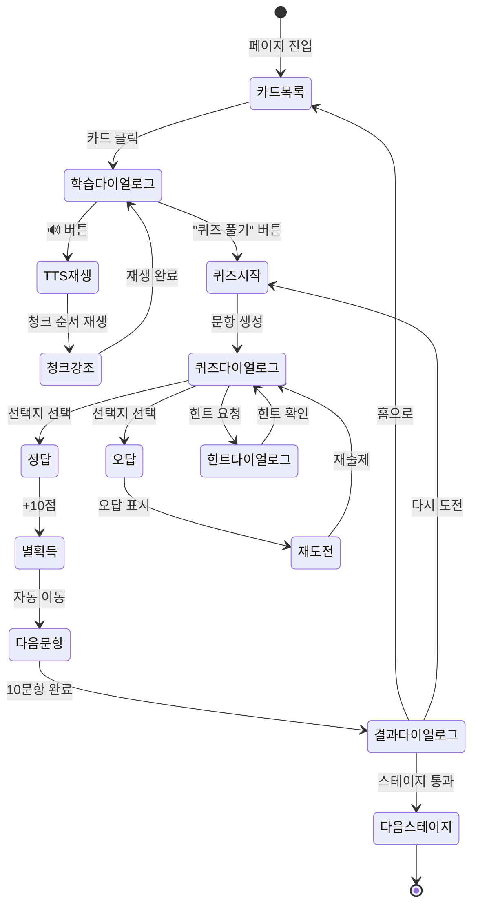

### 6-2. 다이얼로그 컴포넌트 명세

```typescript
// components/dialog/DialogBox.tsx

interface DialogBoxProps {
  isOpen: boolean;
  onClose: () => void;
  type: 'learn' | 'quiz' | 'result' | 'hint' | 'conv';
  size?: 'sm' | 'md' | 'lg' | 'full';  // full = 모바일 전체화면
  children: React.ReactNode;
  backdrop?: boolean;   // 배경 클릭 닫기
  animation?: 'slide' | 'fade' | 'bounce';
}

// components/dialog/LearnDialog.tsx
interface LearnDialogProps {
  item: WordItem | ConversationItem;
  language: 'ko' | 'en';
  onNext: () => void;
  onQuiz: () => void;
  onClose: () => void;
}

// components/dialog/QuizDialog.tsx
interface QuizDialogProps {
  question: string;
  choices: string[];
  answer: number;
  timeLimit?: number;    // 초 (기본: 15)
  onCorrect: () => void;
  onWrong: () => void;
  onHint: () => void;
}
```

---

## 7. 커리큘럼 상세 (4단계 × 50개)

### 7-1. 한글 커리큘럼 전체 로드맵

```mermaid
gantt
    title 한글 커리큘럼 (주 2회, 총 200개)
    dateFormat  X
    axisFormat  %s주

    section Stage 1 (3~4세)
    모음 10개            :s1a, 0, 3
    기본 자음 10개       :s1b, after s1a, 3
    통글자 30개          :s1c, after s1b, 4

    section Stage 2 (5~6세)
    가~하 음절 20개      :s2a, 10, 4
    2글자 단어 20개      :s2b, after s2a, 4
    간단 문장 10개       :s2c, after s2b, 2

    section Stage 3 (7세)
    받침 자음 11개       :s3a, 20, 3
    받침 단어 30개       :s3b, after s3a, 5
    2~3어절 문장 10개    :s3c, after s3b, 2

    section Stage 4 (8~9세)
    일상 단문 20개       :s4a, 30, 4
    대화형 문장 20개     :s4b, after s4a, 4
    짧은 글 읽기 10개    :s4c, after s4b, 2
```

### 7-2. 한글 Stage별 세부 커리큘럼

**Stage 1 — 자음·모음 기초 (50개)**

| 그룹 | 항목 | 개수 | 대표 예시 |
|------|------|------|----------|
| 기본 모음 | ㅏㅑㅓㅕㅗㅛㅜㅠㅡㅣ | 10 | 아·이·우·에 |
| 기본 자음 | ㄱㄴㄷㄹㅁㅂㅅㅇㅈㅎ | 10 | 가·나·다·라 |
| 통글자 | 일상 단어 (받침 없음) | 30 | 나·가·마마·아빠·바나나 |

**Stage 2 — 받침 없는 글자 (50개)**

| 그룹 | 항목 | 개수 | 대표 예시 |
|------|------|------|----------|
| 가~하 음절 | 기본 단음절 | 20 | 가나다라마바사아자차 |
| 2글자 단어 | 생활 어휘 | 20 | 고양이·나비·토끼·개구리 |
| 간단 문장 | 주어+서술어 | 10 | "나는 강아지야" |

**Stage 3 — 받침 있는 글자 (50개)**

| 그룹 | 항목 | 개수 | 대표 예시 |
|------|------|------|----------|
| 받침 자음 | ㄱㄴㄷㄹㅁㅂㅅㅇㅈ... | 11 | 악·안·알·암·압 |
| 받침 단어 | 생활 명사 | 30 | 밥·국·닭·사람·학교 |
| 2~3어절 문장 | 짧은 문장 | 10 | "밥 먹었어?" |

**Stage 4 — 문장 읽기 (50문장)**

| 그룹 | 항목 | 개수 | 대표 예시 |
|------|------|------|----------|
| 일상 단문 | 생활 표현 | 20 | "배고파요" "졸려요" |
| 2인 대화 | 상황별 대화 | 20 | "뭐 먹을래?" "나 피자!" |
| 짧은 글 | 2~3문장 단락 | 10 | 일기·동화 첫 단락 |

---

### 7-3. 영어 커리큘럼 전체 로드맵

```mermaid
gantt
    title 영어 커리큘럼 (주 2회, 총 200개)
    dateFormat  X
    axisFormat  %s주

    section Stage 1 (3~4세)
    알파벳 대문자 26개   :e1a, 0, 3
    기초 단어 24개       :e1b, after e1a, 3

    section Stage 2 (5~6세)
    단모음 파닉스 20개   :e2a, 6, 3
    사이트워드 20개      :e2b, after e2a, 3
    2음절 단어 10개      :e2c, after e2b, 2

    section Stage 3 (6~8세)
    인사·감정 패턴 15개  :e3a, 14, 3
    일상 요청 패턴 20개  :e3b, after e3a, 4
    Q&A 패턴 15쌍        :e3c, after e3b, 3

    section Stage 4 (7~9세)
    청크 읽기 20개       :e4a, 24, 4
    2턴 대화 20쌍        :e4b, after e4a, 4
    3~5턴 대화 10쌍      :e4c, after e4b, 2
```

### 7-4. 영어 Stage별 세부 커리큘럼

**Stage 1 — 알파벳·기초 단어 (50개)**

| 그룹 | 항목 | 개수 | 대표 예시 |
|------|------|------|----------|
| 알파벳 대문자 | A~Z | 26 | A=Apple, B=Ball |
| 기초 단어 | 동물·색·음식 | 24 | cat·dog·red·apple |

**Stage 2 — 파닉스·사이트워드 (50개)**

| 그룹 | 항목 | 개수 | 대표 예시 |
|------|------|------|----------|
| 단모음 파닉스 | a/e/i/o/u 패턴 | 20 | cat·bed·pig·hot·bug |
| 사이트워드 | Dolch List 기초 | 20 | the·a·is·I·you·and |
| 2음절 단어 | 쉬운 복합어 | 10 | happy·funny·little |

**Stage 3 — 회화 패턴 (50문장)**

| 상황 | 패턴 | 개수 | 대표 예시 |
|------|------|------|----------|
| 인사·감정 | 기본 인사 | 15 | Hi! / I'm happy! |
| 일상 요청 | I want / Can I | 20 | I want water. |
| Q&A | What/Where/Who | 15 | What is this? It's a dog! |

**Stage 4 — 청크·대화 (50대화)**

| 그룹 | 항목 | 개수 | 청크 예시 |
|------|------|------|----------|
| 청크 읽기 | 청크 단위 분해 | 20 | [I want] + [water] |
| 2턴 대화 | 상황별 롤플레이 | 20 | 인사·음식·학교·병원 |
| 3~5턴 대화 | 확장 대화 | 10 | 생활 영어 미니 대화 |

---

## 🔍 [보강] 사이트맵 · JSON · 화면 구성 · 다이얼로그 재정비

### A. 사이트맵 재검토 (실제 URL 기준)

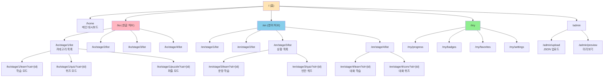

**URL 파라미터 명세**

| 경로 | 쿼리 파라미터 | 설명 |
|------|--------------|------|
| `/ko/stage/[n]/list` | `?cat=animals` | 카테고리 선택 필터 |
| `/ko/stage/[n]/learn` | `?cat=animals&idx=0` | 학습 시작 인덱스 |
| `/ko/stage/[n]/quiz` | `?cat=animals&mode=speed` | 퀴즈 난이도 |
| `/en/stage/[n]/learn` | `?sit=greetings&idx=0` | 상황+인덱스 |
| `/en/stage/4/conv` | `?sit=restaurant` | 대화 상황 |

---

### B. JSON 파일 구조 완전 정의 (3가지 타입)

기존 3개 폴더의 실제 JSON을 분석한 결과 **3개 타입의 스키마**가 존재합니다.

#### 📘 Type A — 단어 스키마 (Word Schema)

**사용처**: `phonics-kor/한글_단어_데이터_확장판.json`, `phonics-eng/영어_단어_데이터.json`
**적용 페이지**: 한글 Stage 1~3, 영어 Stage 1~2

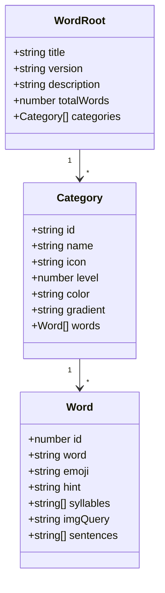

```json
{
  "title": "유아 한글 단어 학습",
  "version": "3.0",
  "description": "1000+ 단어 확장판",
  "totalWords": 1000,
  "categories": [
    {
      "id": "animals",
      "name": "동물",
      "icon": "🐾",
      "level": 1,
      "color": "#FF3838",
      "gradient": "linear-gradient(135deg,#FF3838,#FF6B6B)",
      "words": [
        {
          "id": 1,
          "word": "강아지",
          "emoji": "🐶",
          "hint": "멍멍!",
          "syllables": ["강","아","지"],
          "imgQuery": "cute puppy dog",
          "sentences": ["강아지 작고 귀여워요.","강아지랑 같이 뛰어!"]
        }
      ]
    }
  ]
}
```

#### 📗 Type B — 문장 패턴 스키마 (Sentence Pattern Schema)

**사용처**: `phonics-eng/patterns_유아_150.json`, `patterns_초등_150.json`, `conversation_1000.json`
**적용 페이지**: 영어 Stage 3 (회화 패턴)

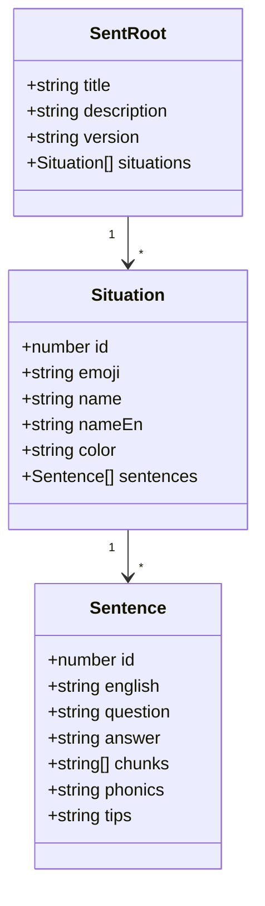

```json
{
  "title": "유아 영어 회화 150패턴",
  "situations": [
    {
      "id": 1,
      "emoji": "👋",
      "name": "인사",
      "nameEn": "Greetings",
      "color": "linear-gradient(135deg,#ff9a44,#fc6076)",
      "sentences": [
        {
          "id": 1,
          "english": "Hi! How are you?",
          "question": "How do you casually greet someone?",
          "answer": "안녕! 어떻게 지내?",
          "chunks": ["Hi!","How","are you?"],
          "phonics": "Hi! (인사) → How are you? (안부 묻기)",
          "tips": "Hi / Hello / Hey | 상황별 인사 강도 차이"
        }
      ]
    }
  ]
}
```

#### 📕 Type C — 2인 대화 스키마 (Dialogue Turn Schema)

**사용처**: `conversaration/patterns_유아_500.json`, `영어회화_대화퀴즈_50가지_상황별_데이터.json`, `트러블_불편상황_20가지_데이터.json`
**적용 페이지**: 영어 Stage 4 (대화 퀴즈), 한글 Stage 4 (문장 읽기)

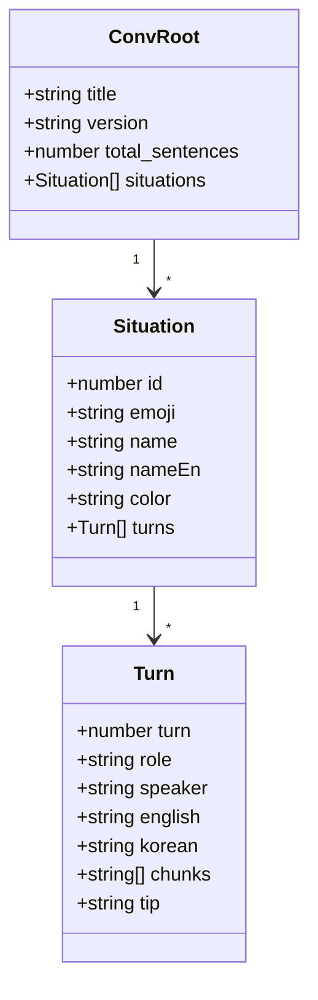

```json
{
  "title": "유아 영어 회화 패턴 500",
  "version": "1.0",
  "total_sentences": 500,
  "situations": [
    {
      "id": 1,
      "emoji": "👋",
      "name": "인사",
      "nameEn": "Greetings",
      "color": "linear-gradient(135deg,#ff9a44,#fc6076)",
      "turns": [
        {
          "turn": 1,
          "role": "c",
          "speaker": "👧 어린이",
          "english": "Hi! How are you?",
          "korean": "안녕! 어떻게 지내?",
          "chunks": ["Hi!","How","are you?"],
          "tip": "인사 강도 구분"
        },
        {
          "turn": 2,
          "role": "b",
          "speaker": "👩 선생님",
          "english": "I'm fine, thank you!",
          "korean": "잘 지내, 고마워!",
          "chunks": ["I'm fine,","thank you!"]
        }
      ]
    }
  ]
}
```

---

### C. JSON ↔ 페이지 매핑표

| 페이지 경로 | 사용 JSON 타입 | 실제 파일 |
|------------|---------------|----------|
| `/ko/stage/1/*` | Type A | 한글_단어_데이터_확장판.json (level=1) |
| `/ko/stage/2/*` | Type A | 한글_단어_데이터_확장판.json (level=2) |
| `/ko/stage/3/*` | Type A | 한글_단어_데이터_확장판.json (level=3) |
| `/ko/stage/4/*` | Type C | 한글 대화 (신규 제작 필요) |
| `/en/stage/1/*` | Type A | 영어_단어_데이터.json |
| `/en/stage/2/*` | Type A | 영어_단어_데이터.json (phonics 필드 추가) |
| `/en/stage/3/*` | Type B | patterns_유아_150.json |
| `/en/stage/4/*` | Type C | patterns_유아_500.json, 대화퀴즈_50가지.json |

**콘텐츠 파일 배치 (최종)**

```
/data
 ├── /ko
 │    ├── words.json                   (Type A, categories에 level 필드)
 │    └── dialogues.json                (Type C, 한글 대화)
 └── /en
      ├── words.json                   (Type A)
      ├── phonics.json                  (Type A + phonics 필드)
      ├── sentences.json                (Type B, 150 패턴)
      └── dialogues.json                (Type C, 대화 퀴즈 50)
```

---

### D. 페이지별 화면 구성 (Screen Composition)

#### 🏠 D-1. 메인 홈 `/` (`/home`)

```
┌──────────────────────────────────────┐
│ 🌟 LingoBaby       🔔  👤             │ ← Header (고정)
├──────────────────────────────────────┤
│                                      │
│ 🔥 3일 연속 학습 중!                 │ ← StreakBanner
│                                      │
│ 오늘의 학습                          │ ← SectionTitle
│ ┌─────────────┐ ┌─────────────┐      │
│ │ 🇰🇷 한글 학습 │ │ 🇺🇸 영어 학습 │     │ ← LanguageCard ×2
│ │ Stage 2/4   │ │ Stage 3/4   │      │   (진도/다음버튼)
│ │ ▓▓▓▓░░ 60%  │ │ ▓▓░░░░ 30%  │     │
│ │ [계속하기 →]│ │ [계속하기 →]│      │
│ └─────────────┘ └─────────────┘      │
│                                      │
│ 이번 주 목표 (주 2회)                │ ← WeeklyGoal
│ [화 ✅] [목 ⬜]         1/2 완료     │
│                                      │
│ 추천 학습                            │ ← Recommendation
│ ┌──┐ ┌──┐ ┌──┐ ┌──┐                 │
│ │🐶│ │🍎│ │🌈│ │📚│                  │   (horizontal scroll)
│ └──┘ └──┘ └──┘ └──┘                 │
│                                      │
│ ┌──────────────────────────────┐     │
│ │ 📣 광고 배너 (AdSense 320x50)│    │ ← AdBanner
│ └──────────────────────────────┘     │
├──────────────────────────────────────┤
│ 🏠 홈  🇰🇷 한글  🇺🇸 영어  📊 MY     │ ← BottomNav (고정)
└──────────────────────────────────────┘
```

**사용 데이터**: LocalStorage (`progress`, `streak`, `weeklyGoal`)
**호출 JSON**: 없음 (메타만)

#### 🇰🇷 D-2. 한글 학습 목록 `/ko/stage/[n]/list`

```
┌──────────────────────────────────────┐
│ ← 한글 학습      ▓▓▓▓░░░░ 40%  ⚙    │ ← Header + 전체진도
├──────────────────────────────────────┤
│ [S1✅] [S2 현재] [S3 🔒] [S4 🔒]     │ ← StageNav
├──────────────────────────────────────┤
│ [📚 학습] [🎯 퀴즈] [🧩 퍼즐]        │ ← ModeSelector
├──────────────────────────────────────┤
│ 카테고리                             │
│ ┌──────┐ ┌──────┐ ┌──────┐ ┌──────┐ │
│ │ 🐾   │ │ 🍎   │ │ 🌈   │ │ 👨‍👩‍👧 │ │ ← CategoryCard
│ │ 동물 │ │ 음식 │ │ 색깔 │ │ 가족 │ │   (Type A categories)
│ │ 30개 │ │ 25개 │ │ 15개 │ │ 20개 │ │
│ │▓▓░░50%│ │▓░░░20%│ │░░░0% │ │▓▓▓80%│
│ └──────┘ └──────┘ └──────┘ └──────┘ │
│                                      │
│ ┌──────────────────────────────┐     │
│ │ 📣 광고 배너                  │    │
│ └──────────────────────────────┘     │
└──────────────────────────────────────┘
```

**사용 데이터**: `/data/ko/words.json` (Type A)
**렌더링**: `categories.filter(c => c.level === n)` → CategoryCard 그리드

#### 🇰🇷 D-3. 한글 학습 모드 `/ko/stage/[n]/learn?cat={id}`

```
┌──────────────────────────────────────┐
│ ← 동물 학습    1/30  ▓░░░░░░ 3%      │ ← 진행 표시
├──────────────────────────────────────┤
│                                      │
│         큰 이모지 영역               │
│                                      │
│            🐶                        │ ← WordCard (큰 중앙)
│        (터치로 확대)                  │
│                                      │
│      ┌──┐ ┌──┐ ┌──┐                  │
│      │강│ │아│ │지│                   │ ← SyllableBlock
│      └──┘ └──┘ └──┘                  │   (클릭 시 음절 TTS)
│                                      │
│      🔊 강아지                        │ ← TTSButton
│      💡 "멍멍!"                       │ ← HintText
│                                      │
│   ─────────────────────────          │
│   예문:                               │
│   • 강아지 귀여워요.                  │ ← Sentences
│   • 강아지랑 같이 뛰어!              │   (TTS 재생 가능)
│                                      │
├──────────────────────────────────────┤
│  [◀ 이전]  [⭐ 즐겨찾기]  [다음 ▶]   │ ← Navigation
└──────────────────────────────────────┘
```

**사용 데이터**: `words.json → categories[cat].words[idx]`
**TTS 재생**: word / syllables / sentences 각각 클릭으로 재생

#### 🇺🇸 D-4. 영어 Stage 3 학습 `/en/stage/3/learn?sit={id}`

```
┌──────────────────────────────────────┐
│ ← 인사 (Greetings)  1/15  ▓░░░ 7%    │
├──────────────────────────────────────┤
│           👋                         │ ← Situation emoji
│                                      │
│    "Hi! How are you?"                │ ← English 큰 텍스트
│    안녕! 어떻게 지내?                │ ← Korean 작은 텍스트
│                                      │
│    ┌──────┐ ┌──────┐ ┌──────────┐   │
│    │ Hi!  │ │ How  │ │ are you? │    │ ← ChunkReader
│    └──────┘ └──────┘ └──────────┘   │   (각 청크 TTS)
│                                      │
│    🔊 전체 문장 듣기                  │
│                                      │
│    ───── 📖 TIPS ─────               │
│    Hi / Hello / Hey                  │ ← tips 필드 내용
│    상황별 인사 강도 차이              │
│                                      │
├──────────────────────────────────────┤
│  [◀ 이전]  [🎯 퀴즈로]  [다음 ▶]    │
└──────────────────────────────────────┘
```

**사용 데이터**: `sentences.json → situations[sit].sentences[idx]`
**필드 활용**: english, answer(korean), chunks, phonics, tips

#### 🇺🇸 D-5. 영어 Stage 4 대화 퀴즈 `/en/stage/4/conv?sit={id}`

```
┌──────────────────────────────────────┐
│ ← 식당 대화 (Restaurant) 🍽️           │
├──────────────────────────────────────┤
│                                      │
│  ┌───────────────────────────┐       │
│  │👧 어린이                   │      │ ← ConvBubble (role=c)
│  │ "Can I have pizza?"        │       │
│  │ 피자 주세요.               │      │
│  │ [Can I have] [pizza?]      │       │ ← chunks
│  │ 🔊                         │       │
│  └───────────────────────────┘       │
│                                      │
│                 ┌─────────────────┐  │
│                 │👩 선생님        │   │ ← ConvBubble (role=b)
│                 │ "Sure! Here."   │   │
│                 │ 네! 여기 있어.  │  │
│                 │ 🔊              │   │
│                 └─────────────────┘  │
│                                      │
│  ───── 다음 대답은? ─────            │
│                                      │
│  ┌──────────────┐ ┌──────────────┐   │
│  │Thank you!    │ │Goodbye!      │   │ ← Quiz choices
│  └──────────────┘ └──────────────┘   │   (4지선다)
│  ┌──────────────┐ ┌──────────────┐   │
│  │I don't know. │ │It's hot!     │   │
│  └──────────────┘ └──────────────┘   │
└──────────────────────────────────────┘
```

**사용 데이터**: `dialogues.json → situations[sit].turns[]`
**UI 로직**: turns를 순차 렌더링 → 마지막 턴 전에 퀴즈 제시

#### 📊 D-6. 내 학습현황 `/my/progress`

```
┌──────────────────────────────────────┐
│ ← 내 학습현황                        │
├──────────────────────────────────────┤
│ 🇰🇷 한글                              │
│ Stage 1 ▓▓▓▓▓▓▓▓ 100% ✅            │
│ Stage 2 ▓▓▓▓▓░░░  60% (30/50)       │ ← StageProgress
│ Stage 3 ░░░░░░░░   0% 🔒            │
│ Stage 4 ░░░░░░░░   0% 🔒            │
│                                      │
│ 🇺🇸 영어                              │
│ Stage 1 ▓▓▓▓▓▓▓▓ 100% ✅            │
│ Stage 2 ▓▓▓░░░░░  30%                │
│ Stage 3 ░░░░░░░░   0% 🔒            │
│                                      │
│ 🏆 획득 배지 (5개)                   │
│ ┌──┐┌──┐┌──┐┌──┐┌──┐                │
│ │🥇││🥈││🔥││📚││🎯│                 │ ← BadgeGrid
│ └──┘└──┘└──┘└──┘└──┘                │
│                                      │
│ 📅 이번 달 학습                      │
│ [ 월간 캘린더 히트맵 ]               │ ← Calendar
└──────────────────────────────────────┘
```

---

### E. 다이얼로그 박스 상세 설계 (Dialog System)

#### E-1. 다이얼로그 유형 6종

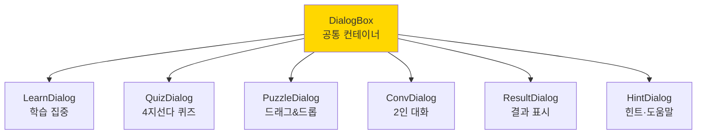

#### E-2. DialogBox 공통 Props

```typescript
interface DialogBoxProps {
  isOpen: boolean;
  onClose: () => void;
  title?: string;
  size: 'sm' | 'md' | 'lg' | 'fullscreen';  // 모바일은 fullscreen 권장
  closable?: boolean;         // X 버튼 표시
  backdrop?: boolean;          // 배경 클릭 닫기
  animation?: 'slide-up' | 'fade' | 'bounce' | 'zoom';
  preventScroll?: boolean;    // body 스크롤 잠금
  zIndex?: number;             // 기본 1000
  children: React.ReactNode;
}
```

#### E-3. 각 다이얼로그 구조 상세

**① LearnDialog (학습 다이얼로그)** — Stage 1~3 단어/문장

```
┌──────────────────────────────────────┐
│  🐶                              [✕] │  ← 큰 이모지 + 닫기
│                                      │
│            강아지                    │  ← word 큰 텍스트
│     [강] [아] [지]                   │  ← syllables (클릭 TTS)
│                                      │
│  💡 멍멍!                            │  ← hint
│  🔊 전체 듣기                         │  ← TTS 버튼
│                                      │
│  ── 예문 ──                          │
│  • 강아지 작고 귀여워요.             │  ← sentences[0]
│  • 강아지랑 같이 뛰어!               │  ← sentences[1]
│                                      │
│  ┌────────────────────────────┐      │
│  │   🎯 퀴즈 도전하기          │      │  ← 액션 버튼
│  └────────────────────────────┘      │
│  [◀ 이전]              [다음 ▶]      │
└──────────────────────────────────────┘

컴포넌트: <LearnDialog item={word} onQuiz={}/>
데이터: Type A의 Word 객체
크기: fullscreen (모바일) / lg (데스크탑)
```

**② QuizDialog (퀴즈 다이얼로그)** — 4지선다

```
┌──────────────────────────────────────┐
│ 🎯 1/10  ⭐⭐⭐⭐⭐  ⏱ 12초    [✕]  │  ← 진행/점수/타이머
├──────────────────────────────────────┤
│                                      │
│          이 동물은?                  │  ← question
│            🐱                         │  ← 이모지 제시
│                                      │
├──────────────────────────────────────┤
│  ┌──────────┐  ┌──────────┐         │
│  │  강아지  │  │  고양이  │          │  ← 선택지 (shuffle)
│  └──────────┘  └──────────┘         │
│  ┌──────────┐  ┌──────────┐         │
│  │   토끼   │  │   오리   │          │
│  └──────────┘  └──────────┘         │
│                                      │
│       💡 힌트 (남은 횟수: 3)         │
└──────────────────────────────────────┘

컴포넌트: <QuizDialog question="" choices={} answer={}/>
데이터: Type A 또는 Type B
타이머: 15초 (config/game.config.ts)
정답 시: ⭐ +1, 초록 애니메이션
오답 시: 빨강 shake + 정답 하이라이트
```

**③ PuzzleDialog (음절 퍼즐)** — 드래그&드롭

```
┌──────────────────────────────────────┐
│ 🧩 퍼즐                         [✕]  │
├──────────────────────────────────────┤
│                                      │
│          🐶                           │  ← 이모지 힌트
│     "이 동물의 이름은?"              │
│                                      │
│   ┌───┐ ┌───┐ ┌───┐                  │
│   │ ? │ │ ? │ │ ? │                   │  ← 드롭 영역
│   └───┘ └───┘ └───┘                  │
│                                      │
│   ── 아래 글자를 드래그 ──           │
│                                      │
│   ┌───┐ ┌───┐ ┌───┐ ┌───┐ ┌───┐     │
│   │ 지 │ │ 가 │ │ 강 │ │ 아 │ │ 나 │  │  ← 드래그 가능 블록
│   └───┘ └───┘ └───┘ └───┘ └───┘     │   (정답 3개 + 오답 2개)
│                                      │
│              [🔄 섞기]                │
└──────────────────────────────────────┘

컴포넌트: <PuzzleDialog word="강아지" syllables={}/>
데이터: Type A의 Word.syllables
정답 감지: 드롭 순서 == syllables 배열
```

**④ ConvDialog (대화 다이얼로그)** — Stage 4 2인 대화

```
┌──────────────────────────────────────┐
│ 💬 인사 (Greetings)            [✕]   │
├──────────────────────────────────────┤
│                                      │
│ ┌──────────────────────┐             │
│ │👧 Hi! How are you?   │             │  ← role=c (좌측)
│ │  안녕! 어떻게 지내?  │             │
│ │  [Hi!][How][are you?]│             │  ← chunks
│ │  🔊                  │             │
│ └──────────────────────┘             │
│                                      │
│             ┌────────────────────┐   │
│             │👩 I'm fine, thanks!│   │  ← role=b (우측)
│             │  잘 지내, 고마워!  │   │
│             │  [I'm fine,]       │   │
│             │  [thank you!]      │   │
│             │  🔊                │   │
│             └────────────────────┘   │
│                                      │
│  ── 다음 대답을 고르세요 ──          │
│                                      │
│  ┌──────────────┐ ┌──────────────┐   │
│  │ See you!     │ │ I'm sad.     │   │
│  └──────────────┘ └──────────────┘   │
│  ┌──────────────┐ ┌──────────────┐   │
│  │ Thank you!   │ │ No, I don't. │   │
│  └──────────────┘ └──────────────┘   │
└──────────────────────────────────────┘

컴포넌트: <ConvDialog turns={} quizChoices={}/>
데이터: Type C의 turns 배열
role 처리: 'c'=어린이(좌), 'b'=선생님(우)
청크 클릭: 해당 부분만 TTS 재생
```

**⑤ ResultDialog (결과 다이얼로그)** — 세션 종료

```
┌──────────────────────────────────────┐
│ 🎉 학습 완료!                        │
│                                      │
│         ⭐ ⭐ ⭐                      │  ← 획득 별
│                                      │
│     9 / 10 정답!                     │  ← 점수
│     세션 시간: 3분 20초              │
│                                      │
│     🏆 새 배지 획득!                 │  ← 배지 애니메이션
│     [ 동물 마스터 ]                  │
│                                      │
│     🔥 연속 학습 4일째!              │  ← 스트릭
│                                      │
│  ┌──────────────────────────────┐    │
│  │ 📣 광고 (스킵 가능 5초)       │   │  ← 보상형 광고 (선택)
│  └──────────────────────────────┘    │
│                                      │
│  [🏠 홈]  [🔄 다시]  [다음 스테이지 →]│
└──────────────────────────────────────┘

컴포넌트: <ResultDialog score stars badges streakDays/>
트리거: 10문항 완료 후 자동 표시
저장: LocalStorage에 progress + badge 저장
```

**⑥ HintDialog (힌트 다이얼로그)**

```
┌──────────────────────────────────────┐
│ 💡 힌트                         [✕]  │
├──────────────────────────────────────┤
│                                      │
│   "강아지"의 힌트                    │
│                                      │
│   🐶 멍멍!                            │  ← hint 필드
│   글자 수: 3글자                     │
│   첫 글자: "강"                      │  ← 추가 힌트
│                                      │
│   ⚠ 힌트 1회 사용 → 점수 -2점        │
│                                      │
│  [취소]              [힌트 사용]     │
└──────────────────────────────────────┘

컴포넌트: <HintDialog word={} onUse={}/>
규칙: 세션당 3회 기본, 보상형 광고 시 +3회
```

#### E-4. 다이얼로그 전환 흐름

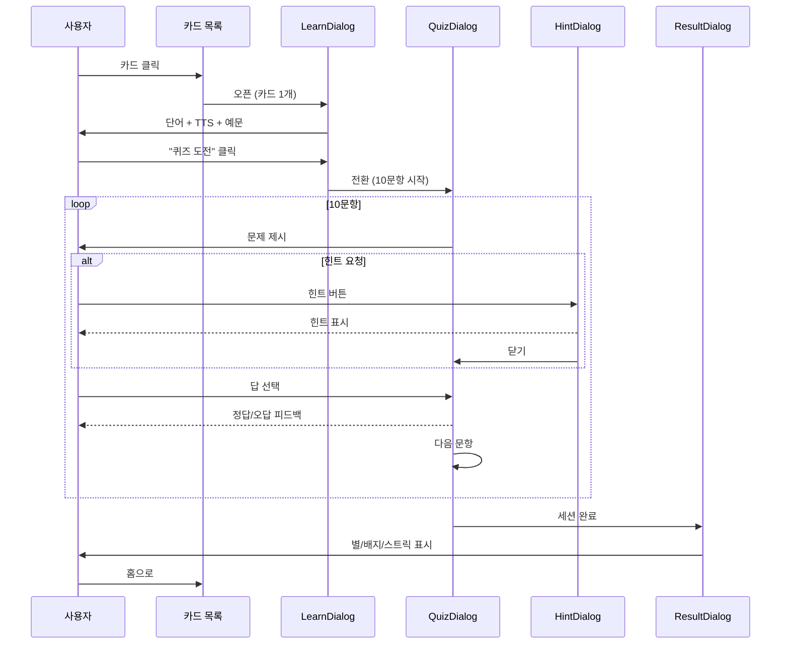

#### E-5. 다이얼로그 애니메이션 표준

| 다이얼로그 | 등장 애니메이션 | 퇴장 | 지속 |
|-----------|---------------|------|------|
| LearnDialog | slide-up (아래→위) | slide-down | 300ms |
| QuizDialog | zoom (중앙 확대) | fade-out | 250ms |
| PuzzleDialog | bounce (튕김) | fade-out | 400ms |
| ConvDialog | slide-up | slide-down | 300ms |
| ResultDialog | bounce + confetti | fade-out | 600ms |
| HintDialog | fade | fade | 150ms |

#### E-6. 다이얼로그 공통 규칙

```
✅ 모바일 360px 이상 지원 (fullscreen 모드)
✅ backdrop 클릭 시 닫기 (confirm 없이)
✅ ESC 키로 닫기 (데스크탑)
✅ 스크롤 잠금 (body overflow: hidden)
✅ z-index 계층:
   - backdrop: 1000
   - dialog: 1001
   - toast: 1100
   - critical: 1200
✅ 포커스 트랩 (Tab 키가 다이얼로그 내부 순환)
✅ 접근성: aria-modal="true", role="dialog"
```

---

## 8. TTS 시스템 설계

### 8-1. TTS 음성 구성

```typescript
// config/tts.config.ts

export const ttsVoices = {
  ko: {
    female:  { id: 'ko-KR-Neural2-A', name: '선생님 (여성)', rate: 0.9 },
    male:    { id: 'ko-KR-Neural2-B', name: '선생님 (남성)', rate: 0.9 },
    child:   { id: 'ko-KR-Neural2-C', name: '친구 (어린이)', rate: 0.95 },
  },
  en: {
    female:  { id: 'en-US-Neural2-F', name: 'Teacher (Female)', rate: 0.85 },
    male:    { id: 'en-US-Neural2-D', name: 'Teacher (Male)',   rate: 0.85 },
    child:   { id: 'en-US-Neural2-J', name: 'Friend (Child)',   rate: 0.9  },
  },
} as const;

export const ttsConfig = {
  defaultSpeed:   0.85,       // 유아용 느린 속도
  chunkDelay:     600,        // 청크 간 딜레이(ms)
  cacheEnabled:   true,       // LocalStorage 캐싱
  maxCacheItems:  200,        // 최대 캐시 항목
  fallbackToWeb:  true,       // Web Speech API 폴백
};
```

### 8-2. TTS 호출 흐름

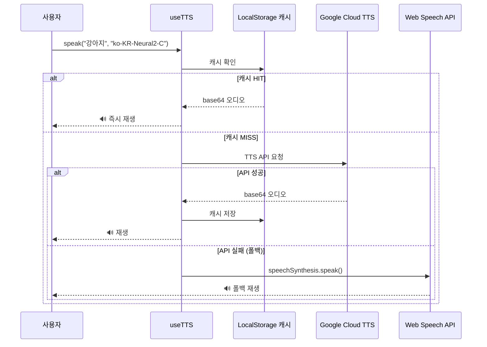

---

## 9. 게임 시스템 상세

### 9-1. 게임 유형별 명세

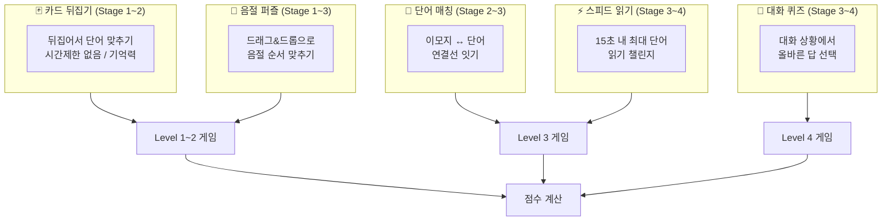

### 9-2. 게임 공통 설정

```typescript
// config/game.config.ts

export const gameConfig = {
  itemsPerSession:  10,       // 세션당 문항 수
  timeLimit:        15,       // 초 (퀴즈 모드)
  hintLimit:        3,        // 힌트 횟수
  hintAdReward:     3,        // 광고 시청 시 추가 힌트
  passingScore:     7,        // 합격 기준 (10문항 중)
  starThresholds: {
    three: 9,                 // ⭐⭐⭐
    two:   7,                 // ⭐⭐
    one:   5,                 // ⭐
  },
  wrongRepeat:      true,     // 오답 세션 말미 재출제
  shuffleQuestions: true,     // 문항 랜덤 순서
} as const;
```

### 9-3. 보상 시스템

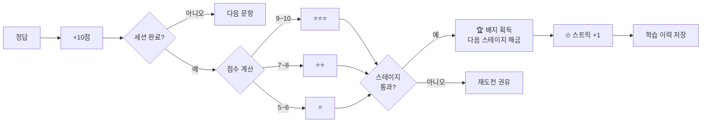

---

## 10. 페이지별 상세 명세

### 10-1. 메인 페이지 레이아웃

```
┌─────────────────────────────────────────┐
│  🌟 LingoBaby          🔔 알림  👤 MY   │  ← Header
├─────────────────────────────────────────┤
│                                         │
│  ┌─────────────────────────────────┐    │
│  │  🔥 3일 연속 학습 중!           │    │  ← Streak 배너
│  └─────────────────────────────────┘    │
│                                         │
│  오늘의 학습                            │
│  ┌──────────────┐ ┌──────────────┐     │
│  │ 🇰🇷 한글 학습 │ │ 🇺🇸 영어 학습 │     │  ← 언어 선택
│  │  Stage 2     │ │  Stage 3     │     │
│  │  ████░░ 60%  │ │  ██░░░░ 30%  │     │
│  └──────────────┘ └──────────────┘     │
│                                         │
│  이번 주 목표 (주 2회)                  │
│  [화요일 ✅] [목요일 ⬜] ── 1/2 완료   │  ← 주간 목표
│                                         │
│  ┌─────────────────────────────────┐    │
│  │  📣 광고 배너 (AdSense)          │    │  ← 광고
│  └─────────────────────────────────┘    │
│                                         │
├─────────────────────────────────────────┤
│  🏠 홈   🇰🇷 한글   🇺🇸 영어   📊 MY    │  ← Bottom Nav
└─────────────────────────────────────────┘
```

### 10-2. 학습 페이지 레이아웃 (모드별)

```
┌─────────────────────────────────────────┐
│ ← 한글 학습      ████░░ 40%  🔊 설정   │  ← Header
├─────────────────────────────────────────┤
│  [Stage1] [Stage2✅] [Stage3🔒] [Stage4🔒] │  ← 스테이지 탭
├─────────────────────────────────────────┤
│  [📚 학습]  [🎯 퀴즈]  [🧩 퍼즐]        │  ← 모드 탭
├─────────────────────────────────────────┤
│                                         │
│  동물 🐾   음식 🍎   색깔 🌈  (카테고리)│
│                                         │
│  ┌───────┐ ┌───────┐ ┌───────┐         │
│  │  🐶   │ │  🐱   │ │  🐰   │         │  ← 카드 그리드
│  │ 강아지 │ │고양이 │ │ 토끼  │         │
│  └───────┘ └───────┘ └───────┘         │
│                                         │
│  ┌─────────────────────────────────┐    │
│  │  📣 광고 배너                    │    │
│  └─────────────────────────────────┘    │
└─────────────────────────────────────────┘

── 카드 클릭 시 ── 다이얼로그 오버레이 ──────
┌────────────────────────────────────┐
│                              [✕]  │
│           🐶                       │
│                                    │
│     [강] [아] [지]  ← 음절 블록    │
│                                    │
│   🔊 강아지   멍멍!               │
│                                    │
│  예문: "강아지 귀여워요."          │
│                                    │
│  [← 이전]  [퀴즈 풀기]  [다음 →] │
└────────────────────────────────────┘
```

### 10-3. 퀴즈 다이얼로그 레이아웃

```
┌────────────────────────────────────┐
│  🎯 퀴즈  ○○○●○○○○○○  [10초]      │  ← 진행·타이머
├────────────────────────────────────┤
│                                    │
│         🐱  이 동물은?             │  ← 질문
│                                    │
├────────────────────────────────────┤
│                                    │
│  ┌─────────┐   ┌─────────┐        │
│  │  고양이  │   │  강아지  │        │  ← 선택지 4개
│  └─────────┘   └─────────┘        │
│  ┌─────────┐   ┌─────────┐        │
│  │  토끼   │   │  오리   │        │
│  └─────────┘   └─────────┘        │
│                                    │
│         [💡 힌트 (3회)]           │
└────────────────────────────────────┘
```

---

## 11. 확장성 설계 원칙

### 11-1. 새 언어 추가 방법 (예: 일본어)

```typescript
// 1. config/stage.config.ts 에 언어 추가
export const supportedLanguages = ['ko', 'en', 'ja'] as const;

// 2. data/ja/stage1.json 파일 추가 (스키마 동일)
// 3. app/ja/stage/[stageId]/[mode]/page.tsx 라우트 추가
// → 코어 컴포넌트 변경 없음!
```

### 11-2. 새 게임 추가 방법

```typescript
// lib/gameRegistry.ts ← 플러그인 레지스트리

export interface GamePlugin {
  id: string;
  name: string;
  component: React.ComponentType<GameProps>;
  supportedStages: number[];
  config?: Record<string, unknown>;
}

export const gameRegistry: GamePlugin[] = [
  { id: 'match',  name: '단어 매칭', component: MatchGame,  supportedStages: [1,2] },
  { id: 'quiz',   name: '퀴즈',      component: QuizGame,   supportedStages: [1,2,3,4] },
  { id: 'puzzle', name: '퍼즐',      component: PuzzleGame, supportedStages: [1,2,3] },
  { id: 'speed',  name: '스피드',    component: SpeedGame,  supportedStages: [3,4] },
  { id: 'dialog', name: '대화 퀴즈', component: DialogGame, supportedStages: [4] },
  // 새 게임은 여기에만 추가 → 자동 노출
];
```

### 11-3. 콘텐츠 버전 관리

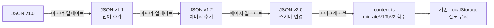

---

## 12. 개발 체크리스트

```
Phase 1 - 기반 구축 (3~4주)
 ├── [ ] Next.js 14 + TypeScript 프로젝트 생성
 ├── [ ] Tailwind CSS + Framer Motion 설정
 ├── [ ] 아이콘 라이브러리 설치 (Phosphor + Iconify)
 ├── [ ] config/ 파일 전체 작성 (icons/tts/game/stage)
 ├── [ ] JSON 스키마 타입 정의 (types/content.types.ts)
 ├── [ ] 공통 UI 컴포넌트 개발 (KidIcon, KidButton, ProgressBar)
 ├── [ ] LocalStorage 추상화 (lib/storage.ts)
 ├── [ ] Google TTS 연동 + 폴백 (hooks/useTTS.ts)
 └── [ ] 메인 페이지

Phase 2 - 한글 학습 (5~7주)
 ├── [ ] Stage 1~4 라우팅 구조
 ├── [ ] JSON 로드 훅 (hooks/useContent.ts)
 ├── [ ] 단어 카드 그리드
 ├── [ ] 학습 다이얼로그 (LearnDialog)
 ├── [ ] 음절 블록 컴포넌트 (SyllableBlock)
 ├── [ ] 퀴즈 다이얼로그 (QuizDialog)
 ├── [ ] 낱말 퍼즐 (드래그&드롭)
 ├── [ ] 진도·보상 시스템
 └── [ ] AdSense 광고 배너

Phase 3 - 영어 학습 (5~7주)
 ├── [ ] 파닉스 카드 (Stage 1~2)
 ├── [ ] 청크 리더 컴포넌트 (ChunkReader)
 ├── [ ] 대화 말풍선 (ConvBubble)
 ├── [ ] 대화 다이얼로그 (Stage 3~4)
 ├── [ ] TTS 음성 선택 UI
 ├── [ ] 대화 퀴즈 게임
 └── [ ] AdMob 모바일 광고

Phase 4 - 완성 및 확장 (3~4주)
 ├── [ ] 내 학습 현황 페이지
 ├── [ ] JSON 업로드 (교사/관리자)
 ├── [ ] 게임 레지스트리 구조
 ├── [ ] PWA 설정 (Service Worker)
 ├── [ ] 성능 최적화 (이미지, 코드 스플릿)
 └── [ ] Vercel 배포 + 도메인

총 예상 기간: 약 16~22주 (주 2회 작업 기준)
```

---

## 13. 개발 비용 산정

| 항목 | 기간 | 난이도 | 비고 |
|------|------|--------|------|
| 기반 구축 (설정·공통 컴포넌트) | 15일 | ★★★ | 아이콘 시스템 포함 |
| 메인 페이지 | 3일 | ★ | |
| 한글 학습 4단계 | 20일 | ★★★★ | 다이얼로그+게임 포함 |
| 영어 학습 4단계 | 20일 | ★★★★ | 청크+대화+TTS |
| 게임 시스템 5종 | 12일 | ★★★★ | 드래그&드롭 포함 |
| TTS 연동 + 캐싱 | 4일 | ★★★ | Google API |
| 진도·보상 시스템 | 5일 | ★★ | LocalStorage |
| 광고 연동 | 3일 | ★★ | AdSense + AdMob |
| JSON 콘텐츠 (200개) | 12일 | ★★ | 한글+영어 전체 |
| 관리자 페이지 | 5일 | ★★ | JSON 업로드 |
| PWA + 최적화 | 4일 | ★★★ | |
| QA + 배포 | 5일 | ★★ | Vercel |
| **합계** | **약 108일** | | **단독 풀스택 기준** |

---

## 14. 추후 확장 로드맵

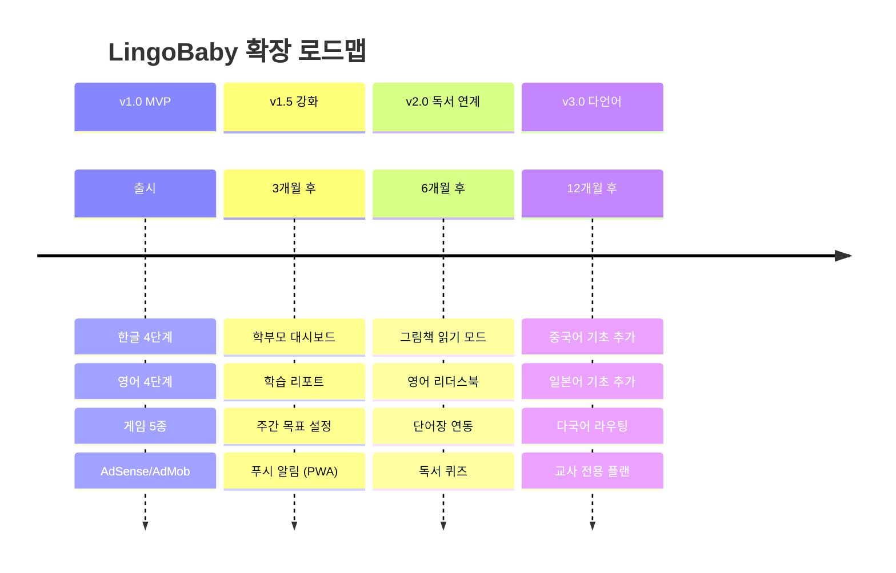

---

*📅 작성: 2026-04-15 | LingoBaby 외주 개발 용역서 v2.0 확장판*
*🔖 아이콘: Phosphor Icons + Iconify 채택, 이모지 기반 콘텐츠 유지*
*📁 레퍼런스: phonics_viewer.html (영어 다이얼로그/청크 UI), 한글_단어_학습_v6.html (퀴즈/퍼즐 모드)*
