# 📚 영어 단계별 학습 완전 로드맵
> 유아기 ~ 고등학교 | 파닉스 · 독해 · 회화 · 글쓰기 · 입시 통합 가이드
> 작성일: 2026-04-08

---

## 1. 전체 학습 로드맵 (개요)

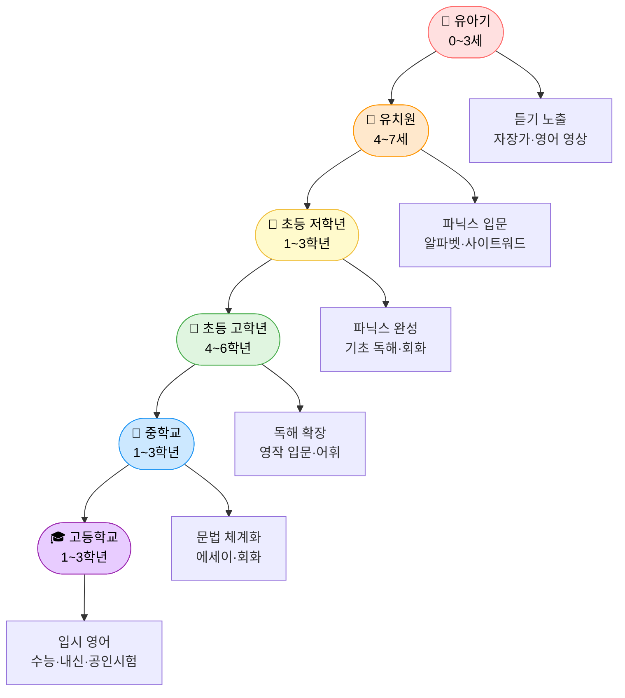

---

## 2. 단계별 핵심 역량 한눈에 보기

| 단계 | 연령 | 핵심 역량 | 주요 방법론 | 목표 레벨 |
|------|------|----------|------------|----------|
| 유아기 | 0~3세 | 듣기 · 발음 감각 | 노출 중심 (Input) | 영어 소리 익숙해지기 |
| 유치원 | 4~7세 | 알파벳 · 파닉스 입문 | Whole Language + Phonics | 간단한 단어 읽기 |
| 초등 저 | 1~3학년 | 파닉스 완성 · 사이트워드 | Systematic Phonics | 쉬운 리더스 독해 |
| 초등 고 | 4~6학년 | 독해 확장 · 영작 입문 | Balanced Literacy | 챕터북 독해, 단락 쓰기 |
| 중학교 | 13~15세 | 문법 · 에세이 · 회화 | Grammar-Translation + CLT | 중급 독해·영작 |
| 고등학교 | 16~18세 | 수능 · 내신 · 공인시험 | Test-Prep + Academic Writing | CEFR B2~C1 |

---

## 3. 파닉스(Phonics) 완전 정복 로드맵

### 3-1. 파닉스 단계 순서도

### 3-2. 파닉스 단계별 학습 내용

| 단계 | 연령 | 내용 | 예시 단어 | 추천 교재/방법 |
|------|------|------|----------|--------------|
| 1단계 알파벳 인식 | 4~5세 | 대소문자 쓰기, 알파벳 소리 연결 | A=Apple, B=Ball | Starfall, LeapFrog DVD |
| 2단계 단모음+자음 CVC | 5~6세 | cat, dog, hot, pet, cut | cat·dog·run·pig·bed | BOB Books, ORT Stage 1 |
| 3단계 혼합자음 Blends | 6~7세 | bl, cl, fl, gr, tr, st, sp, nd | blue, clap, frog, stop | Jolly Phonics, Hooked on Phonics |
| 4단계 장모음 Silent E | 7~8세 | a_e, i_e, o_e, u_e | cake, bike, home, cube | Saxon Phonics, All About Reading |
| 5단계 이중모음 Diphthongs | 8~9세 | oo, ou, ow, oi, oy, au, aw | book, cloud, boy, saw | Wilson Reading System |
| 6단계 고급 패턴 | 9~10세 | gh, ph, kn, wr, 접미사·접두사 | knight, phone, write | Barton Reading |

### 3-3. 파닉스 방법론 비교

| 방법론 | 핵심 개념 | 장점 | 단점 | 적합 대상 |
|--------|----------|------|------|----------|
| Synthetic Phonics | 소리 → 단어 조합 (bottom-up) | 읽기 해독력 강함 | 유창성 느릴 수 있음 | 읽기 어려운 아이 |
| Analytic Phonics | 단어 → 패턴 분석 (top-down) | 맥락 이해 강함 | 해독 훈련 부족 | 독서 경험 있는 아이 |
| Jolly Phonics | 행동+소리+노래 연합 | 흥미·기억력 탁월 | 교사 훈련 필요 | 유치원~초등 1학년 |
| Wilson Reading | 체계적 음절 분석 | 난독증 효과 큼 | 시간 많이 필요 | 읽기 장애 아동 |
| Balanced Literacy | Phonics + 통독 혼합 | 균형적 접근 | 방향성 불명확 가능 | 초등 전반 |

---

## 4. 단계별 상세 학습 계획

### 📌 4-1. 유아기 (0~3세) — 소리 노출 단계

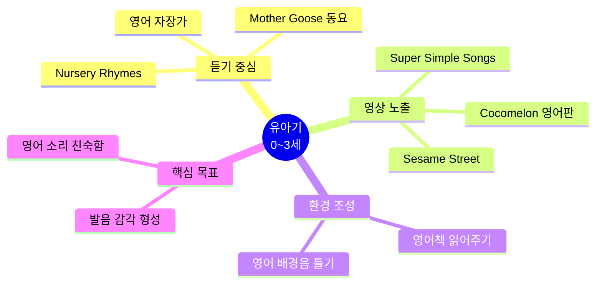

| 항목 | 내용 |
|------|------|
| 목표 | 영어 소리에 친숙해지기, 이중언어 환경 조성 |
| 방법 | 매일 30분 이상 영어 오디오/영상 노출 |
| 추천 콘텐츠 | Super Simple Songs, Cocomelon, Mother Goose |
| 부모 역할 | 영어 그림책 소리 내어 읽어주기 (하루 1권 이상) |
| 주의사항 | 강요 금지, 놀이처럼 접근 |

---

### 📌 4-2. 유치원 (4~7세) — 파닉스 입문 단계

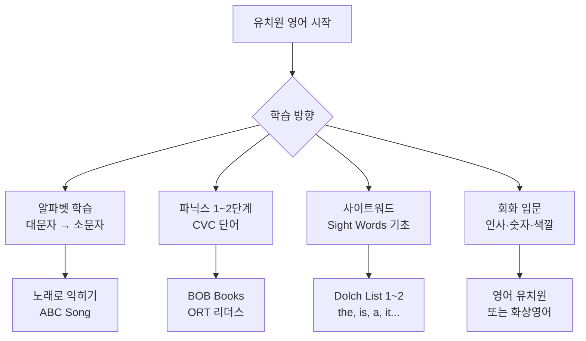

| 학습 영역 | 주간 학습량 | 추천 교재 | 체크 포인트 |
|----------|------------|----------|------------|
| 알파벳 | 매일 10분 | LeapFrog Letter Factory | 26자 대소문자 인식 |
| 파닉스 | 주 3회 20분 | Jolly Phonics, BOB Books | CVC 단어 30개 읽기 |
| 사이트워드 | 주 5개씩 암기 | Dolch Pre-K ~ K 리스트 | 50개 단어 인식 |
| 듣기/말하기 | 매일 영상 30분 | Peppa Pig, Bluey | 간단한 인사 표현 |
| 읽기 | 주 3회 | ORT Stage 1~2 | 그림책 따라 읽기 |

---

### 📌 4-3. 초등 저학년 (1~3학년) — 파닉스 완성 & 기초 독해

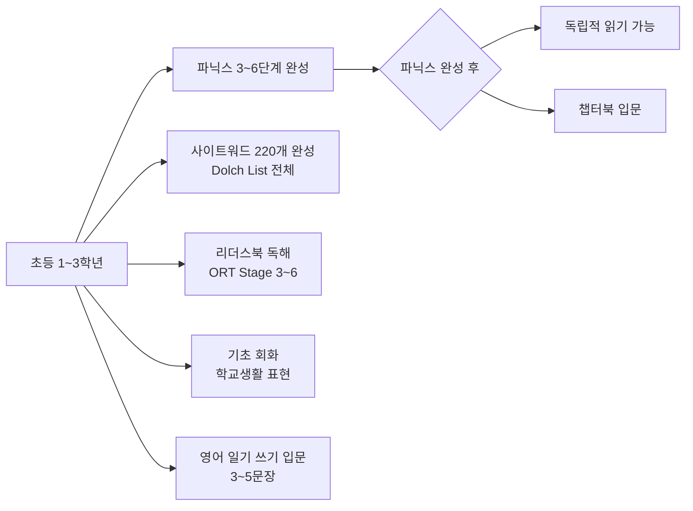

#### 학년별 학습 목표

| 학년 | 읽기 목표 | 쓰기 목표 | 어휘 수 | 듣기/말하기 |
|------|----------|----------|--------|------------|
| 1학년 | ORT Stage 3~4 / 파닉스 blends | 단어 쓰기, 문장 필사 | 200~300개 | 간단한 자기소개 |
| 2학년 | ORT Stage 5~6 / Elephant&Piggie | 문장 3~5개 쓰기 | 400~500개 | 학교생활 대화 |
| 3학년 | Magic Tree House 입문 | 일기 쓰기 시작 | 600~800개 | 짧은 스토리 말하기 |

#### 추천 교재 & 리소스

| 영역 | 교재/리소스 | 특징 |
|------|------------|------|
| 파닉스 완성 | All About Reading Level 2~4 | 체계적 파닉스 |
| 리더스 | ORT, I Can Read, Step Into Reading | 레벨별 단계 독서 |
| 사이트워드 | Dolch Word Flash Cards | 220개 필수 단어 |
| 영어일기 | My Daily English Diary | 3문장 쓰기 훈련 |
| 화상영어 | 링글틴즈, 캠블리키즈 | 원어민 회화 연습 |

---

### 📌 4-4. 초등 고학년 (4~6학년) — 독해 확장 & 영작 입문

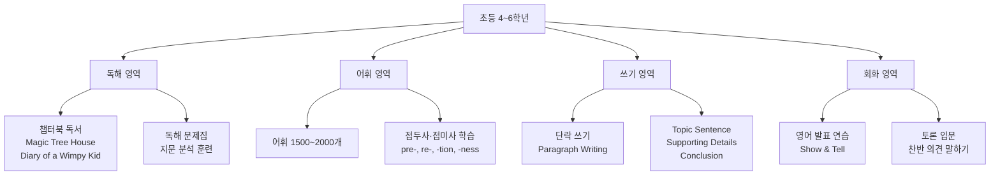

#### 단락 쓰기(Paragraph Writing) 구조

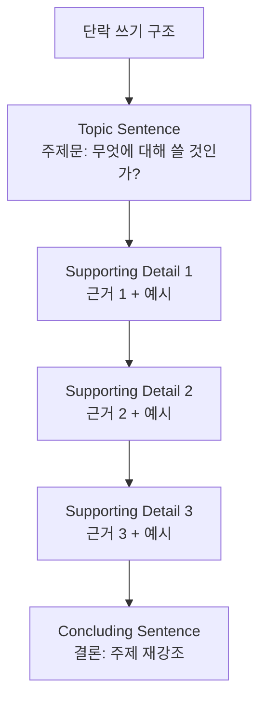

| 학년 | 읽기 수준 | 쓰기 수준 | 어휘 목표 | 문법 |
|------|----------|----------|----------|------|
| 4학년 |챕터북 입문 (AR 3.0~4.0) | 단락 1개 (5~7문장) | 1,000개 | 현재/과거 시제 |
| 5학년 | 챕터북 중급 (AR 4.0~5.0) | 단락 2~3개 연결 | 1,500개 | 완료형, 진행형 |
| 6학년 | 비문학 지문 읽기 시작 | 5단락 에세이 입문 | 2,000개 | 수동태, 비교급 |

---

### 📌 4-5. 중학교 (1~3학년) — 문법 체계화 & 에세이 완성

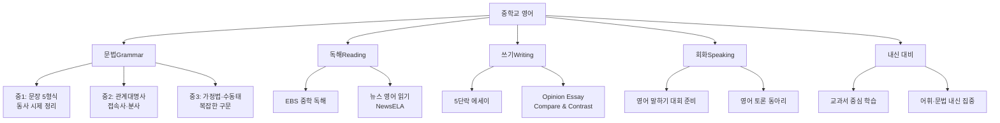

#### 5단락 에세이 구조 (중학교 핵심)

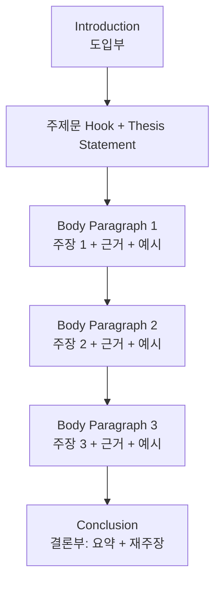

#### 중학교 학년별 학습 계획

| 영역 | 중1 목표 | 중2 목표 | 중3 목표 |
|------|----------|----------|----------|
| 문법 | 5형식, 기본 시제 | 관계대명사, 분사 | 가정법, 도치, 강조 |
| 독해 | 중급 독해 (지문 200단어) | 300~400단어 지문 | 수능형 지문 입문 |
| 어휘 | 중등필수 어휘 1000 | 어휘 2000 | 어휘 3000 (수능 기초) |
| 쓰기 | 단락 쓰기 | Opinion Essay | Academic Essay |
| 듣기 | 중학 듣기평가 | EBS 중학 듣기 | 수능 듣기 유형 입문 |
| 회화 | 기본 대화 | 의견 표현 | 토론형 대화 |

---

### 📌 4-6. 고등학교 (1~3학년) — 입시 영어 완성

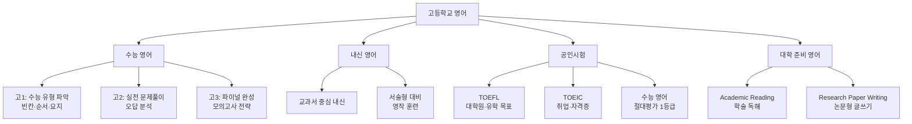

#### 수능 영어 유형별 전략

| 문제 유형 | 출제 비중 | 핵심 전략 | 연습 방법 |
|----------|----------|----------|----------|
| 듣기 (1~17번) | 34% | 선택지 먼저 읽기, 키워드 집중 | EBS 듣기 매일 1회 |
| 빈칸 추론 | 고난도 | 빈칸 앞뒤 문장 핵심 파악 | 논리적 흐름 연습 |
| 순서 배열 | 중난도 | 연결어 (however, therefore) 분석 | 단락 흐름 훈련 |
| 요지/주제 | 중난도 | 첫 문장+마지막 문장 파악 | 중심문장 찾기 |
| 장문 독해 | 고난도 | 단락별 요약, 시간 배분 | 실전 모의고사 |
| 어휘/문법 | 기본 | 문맥 속 어휘 추론 | 어휘장 매일 30개 |

#### 고등 학년별 로드맵

| 학년 | 1학기 목표 | 2학기 목표 | 연간 어휘 | 모의고사 목표 |
|------|----------|----------|----------|------------|
| 고1 | 수능 유형 파악, 내신 체계 확립 | 기출 분석, 독해 속도 훈련 | 3,500개 | 3등급 |
| 고2 | 취약 유형 집중 보완 | 실전 모의고사 반복 | 4,500개 | 2등급 |
| 고3 | 파이널 정리, EBS 연계 완성 | 실전 감각 유지 | 5,000개+ | 1등급 |

---

## 5. 영역별 핵심 방법론

### 5-1. 독해(Reading) 방법론

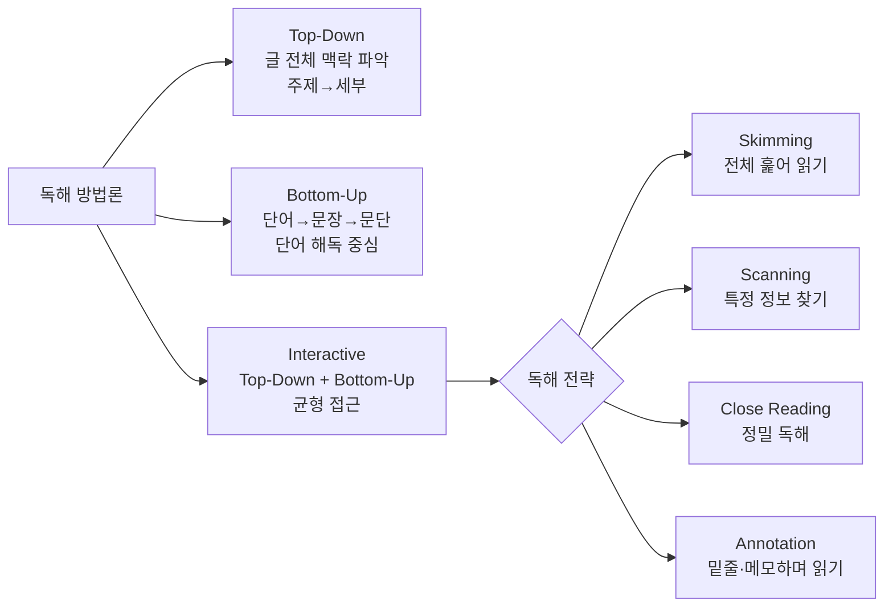

| 독해 전략 | 설명 | 적용 시기 | 훈련 방법 |
|----------|------|----------|----------|
| Skimming | 제목·첫문장·끝문장만 읽어 전체 파악 | 시험 시간 부족할 때 | 지문 30초 훑기 연습 |
| Scanning | 특정 키워드나 숫자 찾기 | 세부 정보 문제 | 단어 찾기 훈련 |
| Close Reading | 문장 하나하나 분석 | 고난도 독해 | 구문 분석 병행 |
| Annotation | 읽으며 메모, 중심어 표시 | 논술·에세이 준비 | 형광펜+메모 습관 |
| SQ3R | Survey→Question→Read→Recite→Review | 학습 독해 | 교재 읽기에 적용 |

---

### 5-2. 영작(Writing) 방법론 & 단계

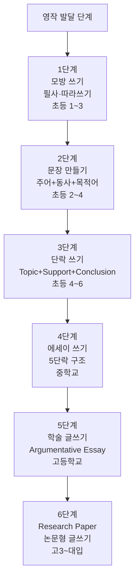

#### 글쓰기 장르별 학습 시기

| 글쓰기 유형 | 적합 학년 | 핵심 요소 | 연습 방법 |
|------------|----------|----------|----------|
| 영어 일기 (Journal) | 초등 2~4 | 날씨, 기분, 한 일 | 매일 3문장 |
| 묘사문 (Descriptive) | 초등 4~5 | 오감 활용 묘사 | 사물/장소 묘사 |
| 서사문 (Narrative) | 초등 5~6 | 시작-전개-결말 | 단편 이야기 쓰기 |
| 의견문 (Opinion) | 중1~2 | 주장+근거+반박 | 찬반 토론 에세이 |
| 비교문 (Compare/Contrast) | 중2~3 | 공통점·차이점 | 두 주제 비교 |
| 논증문 (Argumentative) | 고1~2 | 논제+논거+반론+결론 | PEEL 구조 훈련 |
| 학술문 (Academic) | 고2~3 | 인용·각주·참고문헌 | 모의 리서치 페이퍼 |

---

### 5-3. 회화(Speaking) 방법론

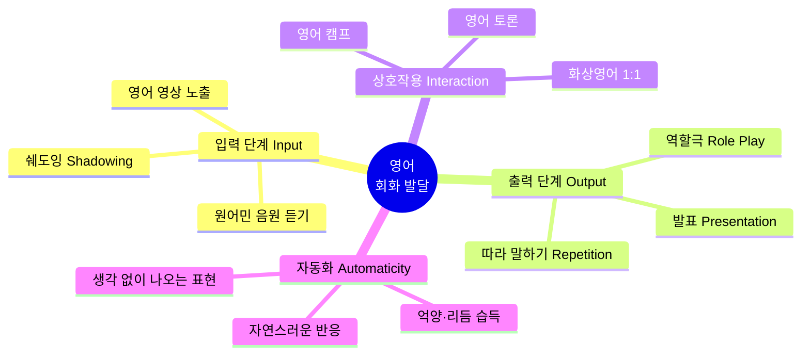

| 회화 훈련법 | 설명 | 효과 | 추천 시기 |
|-----------|------|------|----------|
| 쉐도잉 (Shadowing) | 음원과 동시에 따라 말하기 | 발음·억양·속도 교정 | 중학교~ |
| 역할극 (Role Play) | 상황별 대화 연습 | 실전 표현 습득 | 초등 고학년~ |
| 독백 (Monologue) | 주제 정해 혼자 말하기 | 유창성 향상 | 중학교~ |
| 화상영어 | 원어민과 1:1 대화 | 실전 회화 경험 | 초등 3학년~ |
| 영어 일기 음성 녹음 | 쓴 것을 읽어 녹음 | 자기 교정 | 초등 고학년~ |

---

## 6. 어휘(Vocabulary) 체계적 학습 전략

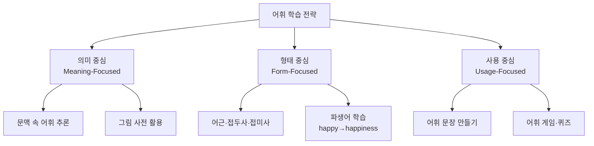

#### 시기별 어휘 목표

| 단계 | 어휘 수 | 학습 방법 | 권장 어휘집 |
|------|--------|----------|------------|
| 유치원 | 100~300개 | 그림책, 노래 | Sight Words |
| 초등 저 | 500~800개 | 플래시카드, 게임 | Dolch 220 + Fry 1000 |
| 초등 고 | 1,500~2,000개 | 독서+단어장 | Vocabulary Workshop |
| 중학교 | 3,000개 | 어근 분석+문맥 | 중학 필수 어휘 3000 |
| 고등학교 | 5,000개+ | 수능 어휘+학술어 | EBS 수능 어휘, WordList |

---

## 7. 추천 학습 도구 & 플랫폼

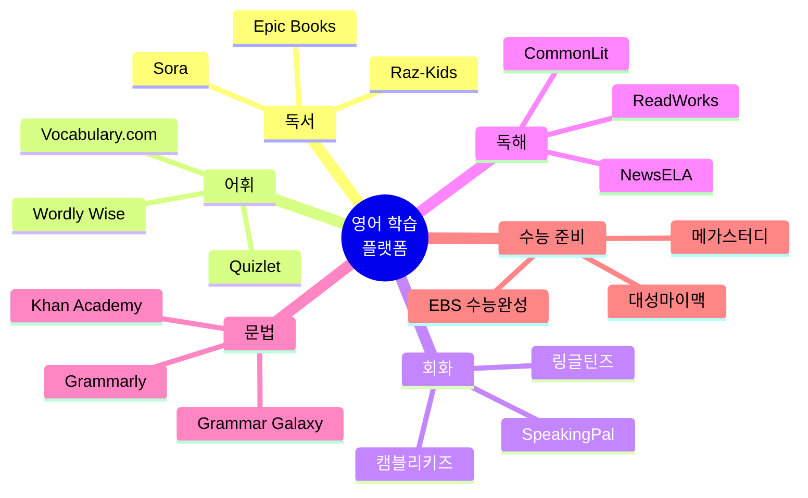

---

## 8. 월별·주간 학습 루틴 예시

### 초등 4학년 예시 (주간 루틴)

| 요일 | 아침 (15분) | 방과후 (30분) | 저녁 (20분) |
|------|------------|--------------|------------|
| 월 | 어휘 10개 암기 | 챕터북 읽기 | 영어 일기 3문장 |
| 화 | 어휘 복습 퀴즈 | 화상영어 25분 | 듣기 영상 시청 |
| 수 | 새 어휘 10개 | 독해 문제집 | 쉐도잉 연습 |
| 목 | 어휘 복습 | 챕터북 읽기 | 영어 일기 |
| 금 | 주간 어휘 테스트 | 화상영어 25분 | 영어 영화/드라마 |
| 토 | 자유 독서 | 에세이 쓰기 연습 | 가족 영어 대화 |
| 일 | 휴식 | 좋아하는 영어 콘텐츠 | 다음 주 계획 |

### 고3 수험생 예시 (주간 루틴)

| 요일 | 오전 | 오후 | 저녁 |
|------|------|------|------|
| 월~금 | 어휘 30개 + 듣기 1회 | 독해 지문 5개 | 취약 유형 집중 |
| 토 | 실전 모의고사 1회 (45분) | 오답 분석 | 어휘 복습 |
| 일 | EBS 연계 교재 | 내신 교과서 | 다음 주 계획 |

---

## 9. 공인시험 준비 로드맵

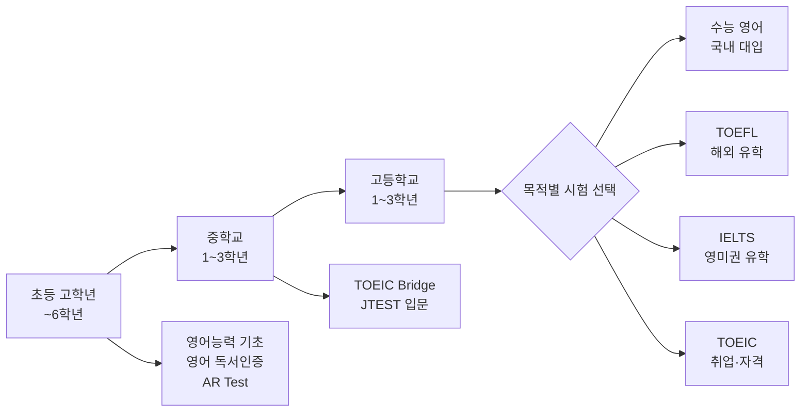

| 시험 | 목적 | 준비 시작 | 목표 점수 | 핵심 영역 |
|------|------|----------|----------|----------|
| 수능 영어 | 국내 대입 | 고1 | 1등급 (90점+) | 독해, 듣기 |
| TOEFL iBT | 미국·캐나다 유학 | 고2~3 | 100점+ | 읽기, 듣기, 말하기, 쓰기 |
| IELTS | 영국·호주·뉴질랜드 | 고2~3 | 7.0+ | 4개 영역 균형 |
| TOEIC | 취업·자격증 | 고3~대학 | 900점+ | 읽기, 듣기 |
| SAT | 미국 대입 | 고2~3 | 1400+ | 수학, 독해, 쓰기 |

---

## 10. 자주 하는 실수 & 해결 방법

| ❌ 흔한 실수 | ✅ 올바른 방향 | 💡 실천 팁 |
|------------|-------------|----------|
| 파닉스 없이 통암기 | 파닉스 체계적 학습 후 독해 | 초등 3학년 전 파닉스 완성 |
| 문법만 공부 | 읽기·쓰기·말하기 통합 | 4가지 영역 균형 유지 |
| 너무 어려운 책 선택 | 편안한 독서 수준 유지 | AR 지수 현재 수준 ±0.5 |
| 영작 첨삭 없이 혼자 쓰기 | 원어민 또는 AI 피드백 활용 | ChatGPT, Grammarly 활용 |
| 입시용 단어만 암기 | 문맥 속 어휘 습득 병행 | 독서+어휘 통합 학습 |
| 회화 연습 없이 시험만 준비 | 말하기 훈련 꾸준히 병행 | 주 2회 화상영어 |

---

## 11. 체크리스트 (단계별 달성 확인)

### ✅ 초등 졸업 전 체크리스트

- [ ] 파닉스 완전 습득 (모든 음소 패턴 읽기 가능)
- [ ] Dolch Sight Words 220개 자동 인식
- [ ] AR 4.0 수준 챕터북 독립 독해 가능
- [ ] 5단락 에세이 기초 구조 이해
- [ ] 기초 회화 30분 영어 대화 가능
- [ ] 어휘 2,000개 이상 보유

### ✅ 중학 졸업 전 체크리스트

- [ ] 영어 문법 주요 항목 완성 (관계대명사, 가정법 등)
- [ ] AR 6.0 수준 비문학 독해 가능
- [ ] Opinion Essay 5단락 독립 작성 가능
- [ ] 영어 발표 3분 이상 가능
- [ ] 어휘 3,500개 이상 보유
- [ ] 수능 듣기 기본 유형 풀기 가능

### ✅ 수능 최종 체크리스트

- [ ] 어휘 5,000개+ 완성
- [ ] 수능 45문항 45분 내 풀기
- [ ] 듣기 전 문항 맞히기
- [ ] 빈칸·순서 유형 정답률 80%+
- [ ] EBS 연계 교재 완독
- [ ] 실전 모의고사 3개년 완성

---

> 📌 **핵심 메시지**
> 영어는 하루아침에 완성되지 않습니다.
> **파닉스 → 독해 → 어휘 → 영작 → 회화**의 순서로 탄탄히 쌓아가되,
> 각 단계에서 **즐거운 노출**과 **체계적 훈련**을 병행하는 것이 가장 중요합니다.
> 꾸준한 독서가 영어 실력의 핵심 기반입니다. 📚
