# 🍼 유아 영어 집중 가이드 (완전판)
> 0세 ~ 7세 | 월령별 목표 · 뇌과학 기반 방법론 · 실전 예시 200+ · 주의사항 완전 정리
> 작성일: 2026-04-08 (개선판)

---

## 1. 유아 영어 전체 흐름도

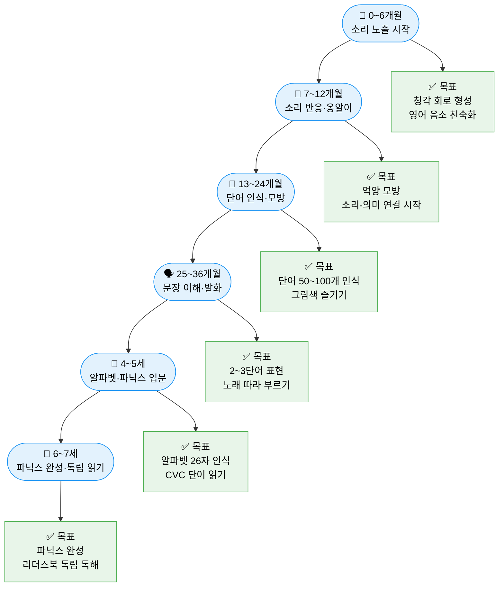

---

## 2. 뇌과학으로 보는 유아 영어의 원리

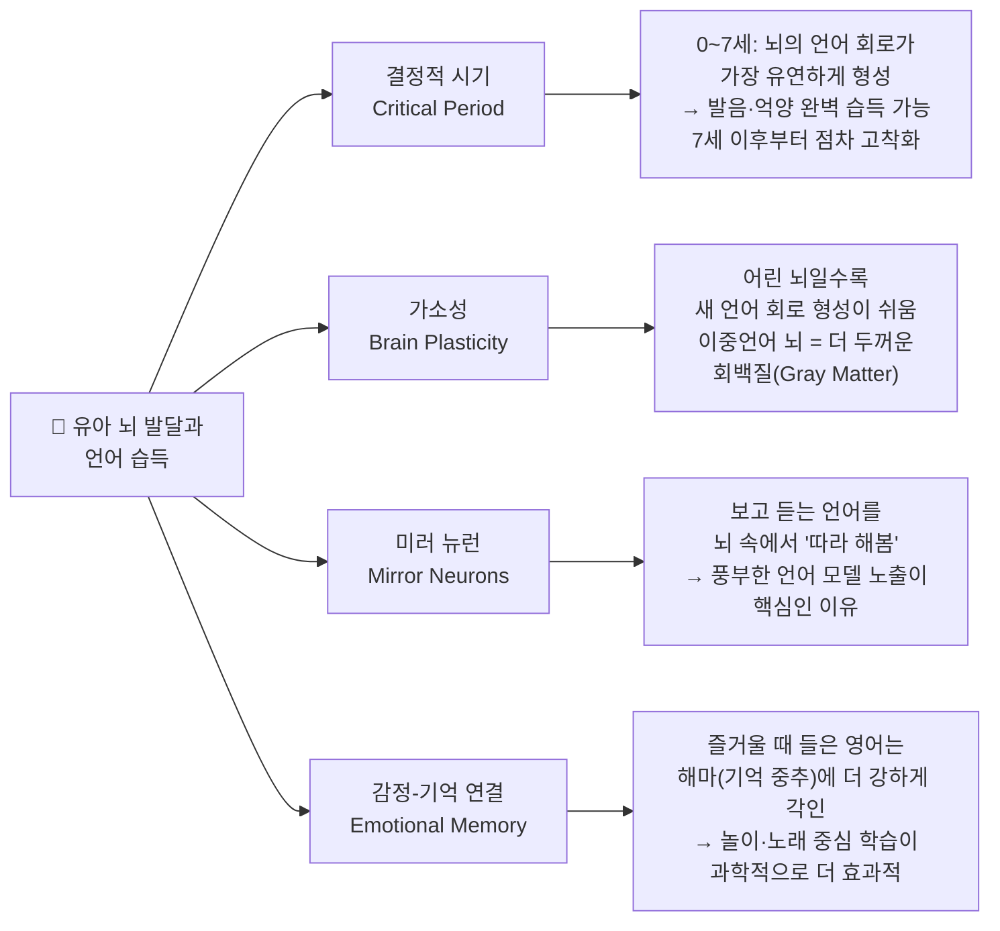

### 연령별 뇌 발달과 언어 학습 적기

| 연령 | 뇌 발달 특징 | 영어 학습 최적 방식 | 주의사항 |
|------|------------|------------------|---------|
| 0~1세 | 청각 피질 빠르게 발달, 음소 변별 능력 최고조 | 풍부한 청각 노출 (소리, 노래, 대화) | 스크린 최소화, 사람 목소리 우선 |
| 1~3세 | 시냅스 폭발적 증가, 언어 지도 형성 | 반복 노출 + 상호작용 (눈 맞추며 말하기) | 언어 혼란 걱정 불필요 |
| 3~5세 | 전두엽 발달, 규칙 학습 가능 | 파닉스 입문, 패턴 학습 | 강요·암기식 금지 |
| 5~7세 | 읽기 준비 완성, 메타인지 시작 | 체계적 파닉스, 독립 읽기 | 학습 부담 주지 않기 |

---

## 3. 월령별 발달 목표 & 핵심 활동

### 📊 월령별 영어 발달 로드맵

| 월령 | 언어 발달 특징 | 영어 목표 | 핵심 활동 | 추천 콘텐츠 |
|------|--------------|----------|----------|------------|
| 0~3개월 | 소리 구분 시작, 목소리 반응 | 영어 소리 환경 형성 | 영어 자장가 | Lullaby songs, White noise with words |
| 4~6개월 | 옹알이, 억양 모방 | 영어 리듬·억양 친숙화 | 눈 맞추며 노래 | Mother Goose, Twinkle Twinkle |
| 7~9개월 | 단어 인식, 옹알이 활발 | 자주 쓰는 영어 단어 노출 | 물건 짚으며 말하기 | Baby Einstein, Peek-a-boo |
| 10~12개월 | 첫 단어 발화 시작 | more, no, hi, bye 인식 | 그림책 반복 읽기 | Brown Bear, Goodnight Moon |
| 13~18개월 | 단어 폭발기 시작 | 영어 단어 20~30개 인식 | 그림 카드 놀이 | Touch and Feel Books |
| 19~24개월 | 두 단어 조합 | 2단어 영어 표현 이해 | 노래+행동 연결 | Wheels on the Bus |
| 25~36개월 | 3~4단어 문장 | 간단한 영어 문장 이해 | 반복 그림책 읽기 | Eric Carle 시리즈 |
| 4~5세 | 복잡한 문장 이해 | 알파벳 인식, 파닉스 입문 | 파닉스 앱·노래 | Jolly Phonics, LeapFrog |
| 6~7세 | 읽기 준비 완성 | CVC 단어 읽기, 사이트워드 | BOB Books, ORT | Starfall, Reading Eggs |

---

## 4. 시기별 상세 가이드 (월령별 완전 정복)

### 📌 4-1. 영아기 (0~12개월) — 소리 환경 형성

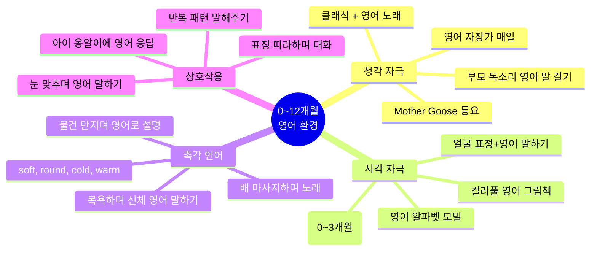

#### 🎯 0~12개월 월별 세부 목표

| 월령 | 핵심 활동 | 구체적 방법 | 기대 반응 |
|------|----------|-----------|----------|
| 0~1개월 | 자장가 노출 | 매일 취침 전 영어 자장가 5분 | 소리에 안정감 반응 |
| 2~3개월 | 눈 맞추며 말 걸기 | "Hi baby! Are you awake? Yes you are!" | 미소, 소리 반응 |
| 4~5개월 | 율동+노래 | "Pat-a-cake, pat-a-cake, baker's man!" | 몸 리듬 반응 |
| 6~7개월 | 물건 짚으며 영어 | "Look! A ball! Round ball! Blue ball!" | 손 뻗기, 관심 표현 |
| 8~9개월 | 이름 반응+단어 | "Where's Mama? Here's Mama!" | 이름 돌아보기 |
| 10~11개월 | 간단한 지시 | "Wave bye-bye! Clap your hands!" | 지시 따르기 시작 |
| 12개월 | 첫 단어 유도 | "What's this? Ball! Can you say ball?" | "ba" 비슷한 발화 |

#### 0~12개월 하루 루틴 예시

| 시간대 | 활동 | 영어 표현 예시 (전체 스크립트) |
|--------|------|---------------------------|
| 기상 | 아침 인사 | "Good morning, sunshine! ☀️ Did you sleep well? I missed you so much! Let's start our day!" |
| 수유/이유식 | 음식 말해주기 | "Here comes the milk! Open wide! Yummy, yummy! More? All done? Good job!" |
| 기저귀 교환 | 신체 부위 | "Let's change your diaper! Here are your little feet — one, two! So clean now!" |
| 목욕 | 신체+촉감 | "Bath time! Is the water warm? Let's wash your tummy — splash, splash! Now your tiny toes!" |
| 놀이 | 물건 짚기 | "Look! It's a red ball! Big ball! Bounce! Catch it! You got it! Good job, baby!" |
| 낮잠 전 | 그림책 읽기 | "Brown Bear, Brown Bear, what do you see? I see a red bird looking at me!" |
| 취침 | 자장가+인사 | "Twinkle twinkle little star... Time to sleep. I love you so much. Good night, sweet baby." |

#### 0~12개월 자장가 & 동요 목록 (레퍼토리 10곡)

| 곡명 | 핵심 언어 | 효과 | 유튜브 검색어 |
|------|----------|------|-------------|
| Twinkle Twinkle Little Star | star, sky, diamond, high | 취침 루틴 연결 | Super Simple Songs |
| Hush Little Baby | buy, mockingbird, ring | 자장가 어휘 | Hush Little Baby lullaby |
| Rock-a-bye Baby | rock, cradle, treetop | 리듬감 형성 | Rock a bye baby |
| You Are My Sunshine | sunshine, happy, skies | 긍정 감정 연결 | You Are My Sunshine |
| Wheels on the Bus | go, round, up, down | 동작 어휘 | Wheels on the Bus |
| Old MacDonald | farm, cow, duck, oink | 동물 어휘 | Old MacDonald |
| Pat-a-cake | bake, pat, roll, mark | 손 놀이 | Pat a cake nursery rhyme |
| If You're Happy | happy, sad, clap, stomp | 감정 어휘 | If you're happy song |
| Head Shoulders | head, shoulders, knees | 신체 어휘 | Head Shoulders |
| Itsy Bitsy Spider | spider, rain, sun, up | 날씨+동작 | Itsy Bitsy Spider |

---

### 📌 4-2. 걸음마기 (13~36개월) — 단어·문장 폭발기

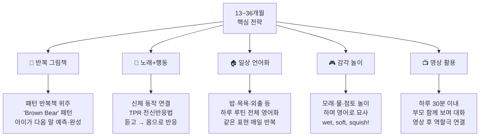

#### 🎯 단어 카테고리별 학습 우선순위 (200단어 목록)

| 카테고리 | 1순위 (먼저 배울 것) | 2순위 | 학습 방법 |
|----------|------------------|-------|----------|
| **신체** | head, hand, foot, eye, ear, nose, mouth, tummy | knee, elbow, finger, toe, back, hair | 몸 짚으며 노래 |
| **음식** | milk, apple, banana, bread, egg, water, rice, juice | cheese, cookie, carrot, noodle, soup, cake | 먹을 때 말하기 |
| **동물** | dog, cat, bird, fish, bear, rabbit, cow, duck | lion, tiger, elephant, monkey, horse, frog | 소리+이름 연결 |
| **색깔** | red, blue, yellow, green | white, black, pink, orange, purple, brown | 물건 보며 말하기 |
| **모양** | circle, square, triangle | star, heart, rectangle, oval | 블록 놀이 중 |
| **숫자** | one~five | six~ten | 손가락 접으며 |
| **동작** | eat, sleep, play, run, sit, jump, come, go | walk, dance, sing, draw, read, wash | 동작하며 말하기 |
| **감정** | happy, sad, angry, scared | surprised, tired, excited, bored | 표정 만들며 |
| **장소** | home, room, kitchen, park | school, store, car, garden | 외출 중 말하기 |
| **날씨** | sunny, rainy, cloudy, cold, hot | windy, snowy, foggy | 창문 보며 매일 |

#### 단어 폭발기 (18~24개월) 집중 전략

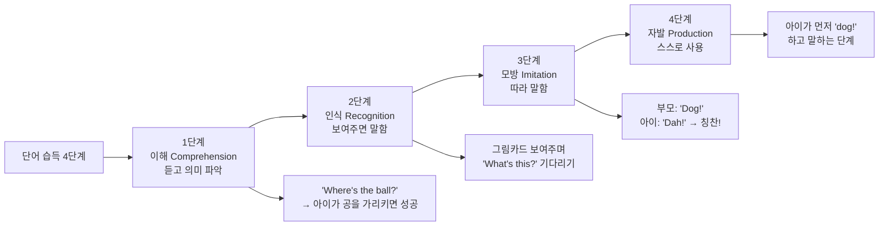

#### 13~36개월 놀이별 영어 표현 실전 예시

| 놀이 상황 | 구체적 영어 스크립트 | 학습 어휘 |
|----------|-------------------|----------|
| **블록 쌓기** | "Let's build! One block... two blocks... so tall! Oh no, it fell down! Crash! Let's build again!" | build, tall, fall, crash, again |
| **모래 놀이** | "Dig, dig, dig! Is it wet or dry? Pat it down. Make a hill! Pour the water — whoosh!" | dig, wet, dry, pour, hill |
| **물 놀이** | "Splash! Is it cold? Warm? Fill the cup! Now pour it out! Again? The duck is swimming!" | splash, cold, warm, fill, pour |
| **공 놀이** | "Roll the ball to Mama! Catch it! Good throw! Bounce! Bounce! Now kick it!" | roll, catch, throw, bounce, kick |
| **그네** | "Hold on tight! Ready? Here we go! Wee! Higher? More? All done? Good job!" | hold, ready, higher, more, done |
| **미끄럼틀** | "Climb up the stairs! One, two, three! At the top! Ready? Slide down! Wheee!" | climb, stairs, top, slide, down |
| **인형 놀이** | "Baby is hungry! Let's feed her. Yummy! Now she's sleepy. Shh, baby is sleeping." | hungry, feed, sleepy, sleeping |
| **책 읽기 중** | "Look at the picture! What's that? A caterpillar! He's eating! Munch, munch!" | look, picture, eating, munch |

---

### 📌 4-3. 유아기 (3~5세) — 언어 폭발기 & 파닉스 준비

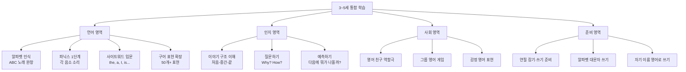

#### 3~5세 필수 회화 표현 60개 (상황별 스크립트)

| 상황 | 표현 | 발음 가이드 | 사용 예시 장면 |
|------|------|-----------|-------------|
| **인사** | Good morning! / Good afternoon! / Good night! | 굿 모닝 / 굿 애프터눈 / 굿 나잇 | 기상·점심·취침 |
| | How are you? → I'm great/good/okay/tired. | 하우 아 유? → 아임 그레잇 | 매일 아침 루틴 |
| | Nice to meet you! / See you later! | 나이스 투 밋 유 / 씨 유 레이터 | 처음 만날 때·헤어질 때 |
| **요청** | Can I have some water, please? | 캔 아이 해브 썸 워터 플리즈 | 식사 중 |
| | Can you help me, please? | 캔 유 헬프 미 플리즈 | 도움 필요할 때 |
| | May I go to the bathroom? | 메이 아이 고 투 더 배쓰룸 | 화장실 가고 싶을 때 |
| | I want~ / I don't want~ | 아이 원트 / 아이 돈트 원트 | 원하는 것 표현 |
| **감정** | I'm happy / sad / angry / scared / excited. | 아임 해피 / 새드 / 앵그리 / 스캐어드 | 감정 표현 |
| | I feel sick. / My tummy hurts. | 아이 필 씩 / 마이 터미 허츠 | 아플 때 |
| | I'm bored. / I'm tired. | 아임 보어드 / 아임 타이어드 | 심심·피곤할 때 |
| **놀이** | Let's play! / Can I play too? | 렛츠 플레이 / 캔 아이 플레이 투 | 놀이 시작 |
| | My turn! / Your turn! | 마이 턴 / 유어 턴 | 순서 지킬 때 |
| | That's mine! / Can I borrow that? | 댓츠 마인 / 캔 아이 바로우 댓 | 물건 다툴 때 |
| | Let's take turns! / That's not fair! | 렛츠 테이크 턴스 / 댓츠 낫 페어 | 규칙 말할 때 |
| **칭찬/격려** | Good job! / Well done! / You did it! | 굿 잡 / 웰 던 / 유 디드 잇 | 성공했을 때 |
| | Try again! / Don't give up! | 트라이 어게인 / 돈트 기브 업 | 실패했을 때 |
| | I'm so proud of you! | 아임 쏘 프라우드 오브 유 | 대단할 때 |
| **일상** | I'm done! / All finished! | 아임 던 / 올 피니쉬드 | 끝냈을 때 |
| | It's time to clean up! | 잇츠 타임 투 클린 업 | 정리할 때 |
| | What's for dinner? / It smells good! | 왓츠 포 디너 / 잇 스멜스 굿 | 저녁식사 전 |
| **질문** | What's that? / What does it mean? | 왓츠 댓 / 왓 더즈 잇 민 | 모를 때 |
| | Why? / How does it work? | 와이? / 하우 더즈 잇 워크 | 궁금할 때 |
| | Can we go? / Where are we going? | 캔 위 고 / 웨어 아 위 고잉 | 외출 준비 |

#### 3~5세 파닉스 준비 단계 — 음운 인식(Phonological Awareness)

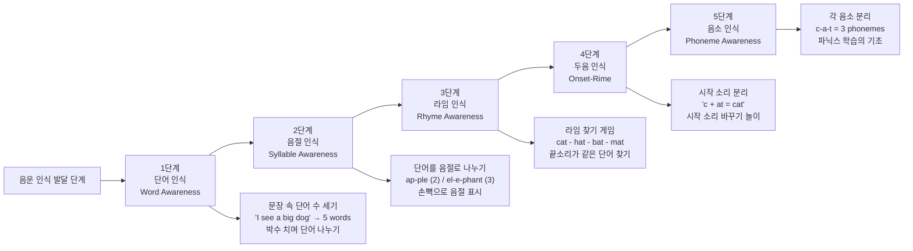

---

### 📌 4-4. 유치원 (5~7세) — 파닉스 본격 시작 & 독립 읽기

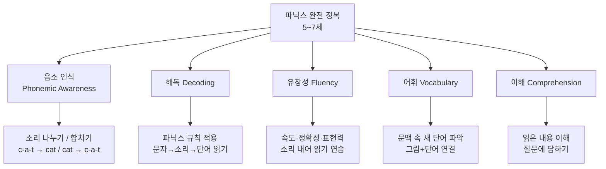

#### 파닉스 단계별 주간 학습 계획 (전체 32주)

| 주차 | 단계 | 학습 내용 | 예시 단어 | 주요 활동 | 확인 방법 |
|------|------|----------|----------|----------|----------|
| 1~2주 | 단모음 /a/ | CVC 단어 | cat, hat, bat, can, fan, map, nap | 라임 맞추기 | 단어카드 골라내기 |
| 3~4주 | 단모음 /i/ | CVC 단어 | sit, hit, pig, wig, zip, lid, fin | 단어 읽고 그림 연결 | 받아쓰기 5개 |
| 5~6주 | 단모음 /o/ | CVC 단어 | hot, pot, dog, log, fox, mop, dot | 노래로 외우기 | 문장 속 빈칸 채우기 |
| 7~8주 | 단모음 /e/ | CVC 단어 | bed, red, ten, hen, wet, leg, net | 문장 만들기 | 문장 소리 내어 읽기 |
| 9~10주 | 단모음 /u/ | CVC 단어 | bug, hug, cup, mug, sun, run, tub | 단어 찾기 게임 | 짧은 이야기 만들기 |
| 11~12주 | 복습+혼합 | 5개 단모음 통합 | 위 전체 | 빙고 게임 | 랜덤 카드 읽기 |
| 13~14주 | Blends /bl, cl, fl/ | 혼합 자음 | blue, clap, flag, flip, blade | 블렌드 카드 게임 | 단어 분리+합치기 |
| 15~16주 | Blends /br, cr, dr/ | 혼합 자음 | brown, crab, drum, drop, bride | 그림-단어 매칭 | 문장 읽기 |
| 17~18주 | Blends /st, sp, sn/ | 혼합 자음 | stop, spin, snap, step, sport | 블렌드 분류 | 받아쓰기 |
| 19~20주 | Digraphs /ch, sh/ | 이중자음 | chair, cheese, ship, shop, she | 카드 분류 | 단어 분류 게임 |
| 21~22주 | Digraphs /th, wh/ | 이중자음 | thin, this, wheel, when, white | 목구멍 느끼기 | 문장 속 찾기 |
| 23~24주 | Long Vowels /a-e/ | 장모음 | cake, name, tape, lane, save | Magic E 설명 | 단/장모음 비교 |
| 25~26주 | Long Vowels /i-e, o-e/ | 장모음 | bike, hide, home, note, pole | 규칙 정리 | 단어 만들기 |
| 27~28주 | Long Vowels /u-e/ | 장모음 | cube, tune, rule, cute, mule | 단어 분류 | 빈칸 채우기 |
| 29~30주 | Vowel Teams /ai, ea/ | 모음 조합 | rain, mail, read, team, mean | 짝 찾기 게임 | 지문 읽기 |
| 31~32주 | 전체 복습+리더스 | 통합 적용 | BOB Books / ORT Stage 2 읽기 | 독립 읽기 | 책 한 권 완독 |

---

## 5. 방법론별 실전 적용 (6가지 핵심 방법론)

### 🔵 5-1. TPR (전신반응법 — Total Physical Response)

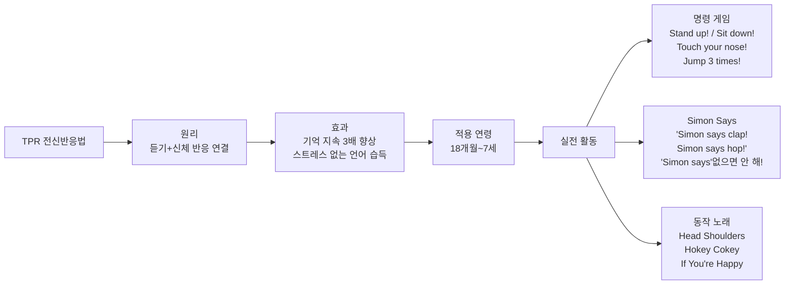

#### TPR 30가지 기초 명령어 (레벨별)

| 레벨 | 명령어 | 동작 | 적합 연령 |
|------|--------|------|----------|
| **초급** | Stand up / Sit down | 일어서기/앉기 | 18개월+ |
| | Jump! / Stop! | 점프/멈추기 | 18개월+ |
| | Clap your hands! | 박수 치기 | 18개월+ |
| | Wave hello / Wave bye-bye | 손 흔들기 | 12개월+ |
| | Touch your nose / ear / head | 신체 짚기 | 18개월+ |
| **중급** | Turn around! / Spin! | 빙글 돌기 | 2세+ |
| | Tiptoe! / Stomp! | 까치발/쿵쿵 | 2세+ |
| | Crawl like a baby / Hop like a frog | 기기/개구리 점프 | 2세+ |
| | Open/Close the door | 문 여닫기 | 2.5세+ |
| | Put it on / Take it off | 올려놓기/내리기 | 2.5세+ |
| **고급** | Walk to the window and look outside | 복합 지시 | 3세+ |
| | Pick up the red block and put it in the box | 색깔+장소 | 3.5세+ |
| | If you hear a bird sound, fly like a bird | 조건 명령 | 4세+ |

---

### 🟢 5-2. Whole Language (총체적 언어 접근법)

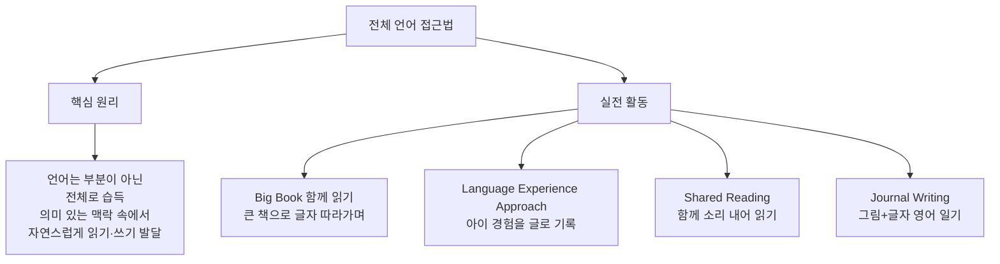

#### Language Experience Approach (LEA) 실전 예시

> 아이가 공원에서 나비를 봤을 때 ↓

```
1단계: 경험 이야기 나누기
  부모: "What did you see at the park?"
  아이: "나비!"
  부모: "A butterfly! It was so beautiful!"

2단계: 아이 말을 영어로 받아 적기
  부모: (종이에 쓰면서) "Today I saw a butterfly at the park. It had orange wings. It was pretty!"

3단계: 함께 읽기
  부모+아이: 위 문장 함께 소리 내어 읽기

4단계: 그림 그리기
  아이가 나비 그림 그리고 부모가 영어 단어 써줌

5단계: 다음에 읽기
  아이가 그린 책을 다시 꺼내 읽으며 자신의 경험 기억
```

---

### 🟡 5-3. CLT (의사소통 중심 교수법 — Communicative Language Teaching)

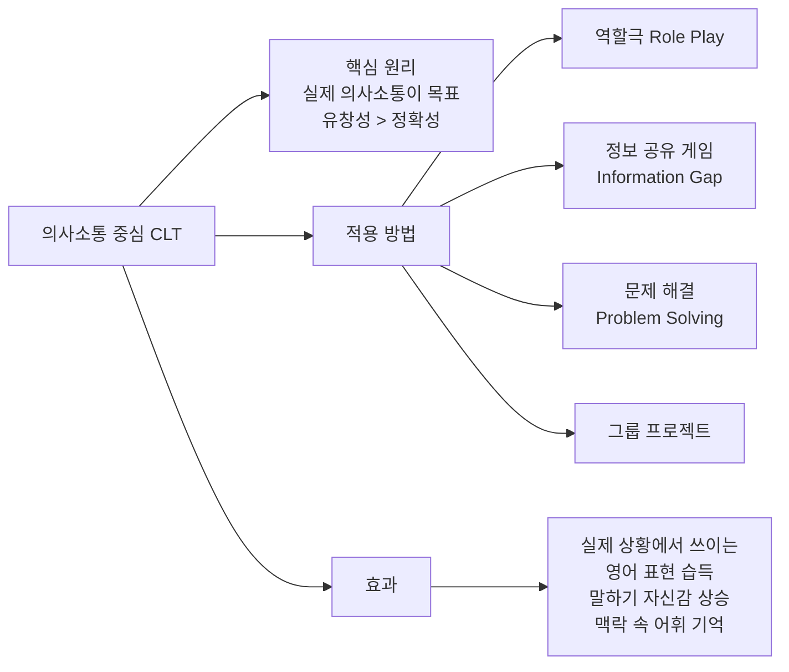

#### CLT 역할극 시나리오 10가지 (유아용)

| 역할극 | 세팅 | 주요 대화 | 필요 소품 |
|--------|------|----------|----------|
| **식당 놀이** | 아이=손님, 부모=웨이터 | "What would you like?" / "I'll have pizza, please!" / "Enjoy your meal!" | 메뉴판, 장난감 음식 |
| **슈퍼마켓** | 쇼핑 역할극 | "How much is this?" / "Two dollars!" / "Here you go, keep the change!" | 물건들, 가짜 돈 |
| **병원 놀이** | 아이=환자, 부모=의사 | "Where does it hurt?" / "My tummy hurts." / "Let me check!" | 장난감 청진기 |
| **동물원** | 인형=동물, 역할극 | "What animal is this?" / "It's a lion! Roar!" / "What does it eat?" | 동물 인형들 |
| **공항 놀이** | 여행 역할극 | "Where are you going?" / "To the beach!" / "Have a safe trip!" | 가방, 여권(종이) |
| **생일 파티** | 파티 역할극 | "Happy Birthday!" / "Make a wish!" / "What do you want for your birthday?" | 케이크, 풍선 |
| **도서관** | 사서-독자 | "Can I borrow this book?" / "When is it due back?" / "Two weeks!" | 책들 |
| **날씨 예보** | TV 앵커 역할 | "Good morning! Today it's sunny and warm!" / "Don't forget your hat!" | 날씨 그림 카드 |
| **집짓기** | 블록으로 건축 | "Let's build a house! Put the big block here." / "How many floors?" | 블록 세트 |
| **우주 여행** | 로켓 탑승 | "3, 2, 1 — blast off!" / "Look at the stars!" / "We're on the moon!" | 상자(로켓), 인형 |

---

### 🟠 5-4. 스토리 기반 학습 (Story-Based Learning)

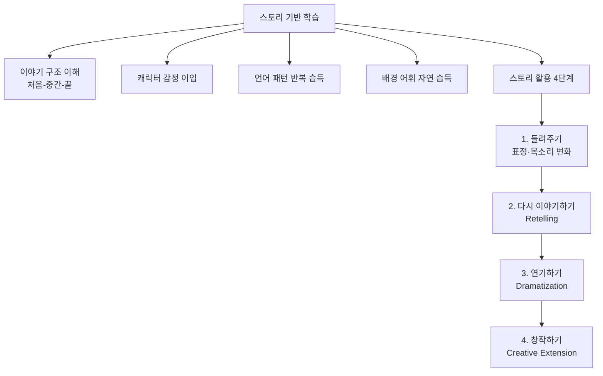

#### 연령별 스토리 활용 방법

| 연령 | 활동 | 구체적 방법 | 기대 효과 |
|------|------|-----------|----------|
| 1~2세 | 반복 패턴 책 | Brown Bear 패턴 외워 예측 | 언어 패턴 내재화 |
| 2~3세 | 소리 효과 넣기 | 책 읽으며 동물 소리, 의성어 추가 | 듣기 집중력, 어휘 |
| 3~4세 | 다시 이야기하기 | "What happened?" 질문 후 아이가 설명 | 말하기, 이야기 구조 |
| 4~5세 | 역할극 연결 | 읽은 책을 인형극으로 재연 | 표현력, 어휘 활용 |
| 5~6세 | 이야기 바꾸기 | "What if the bear was red?" 새 이야기 창작 | 창의력, 영작 준비 |
| 6~7세 | 직접 쓰기 | 읽은 이야기의 속편 그림+글로 만들기 | 영작 기초 |

---

### 🔴 5-5. Reggio Emilia 접근법 (프로젝트 기반)

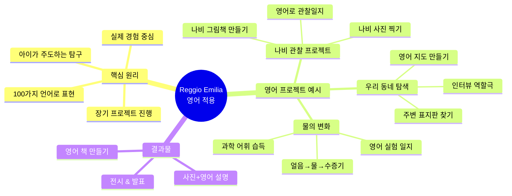

#### 프로젝트 학습 예시 — "나비 관찰 프로젝트" (4~6세)

| 단계 | 기간 | 활동 | 사용 영어 | 결과물 |
|------|------|------|----------|--------|
| 도입 | 1주 | 나비 그림책 읽기, 동영상 보기 | butterfly, wings, caterpillar, cocoon | 나비 그림 그리기 |
| 관찰 | 2~3주 | 공원에서 나비 찾기, 사진 찍기 | "I see a butterfly!" "It has orange wings!" | 관찰 일지 |
| 탐구 | 3~4주 | 나비 생활주기 알아보기 | life cycle, egg, larva, pupa, adult | 생활주기 그림책 |
| 표현 | 4~5주 | 나비 영어 책 직접 만들기 | 배운 어휘 전체 활용 | 나만의 나비 책 |
| 공유 | 5주 | 가족에게 영어로 발표 | "I learned that..." | 발표 영상 |

---

### 🟣 5-6. 몰입 교육 (Immersion Method)

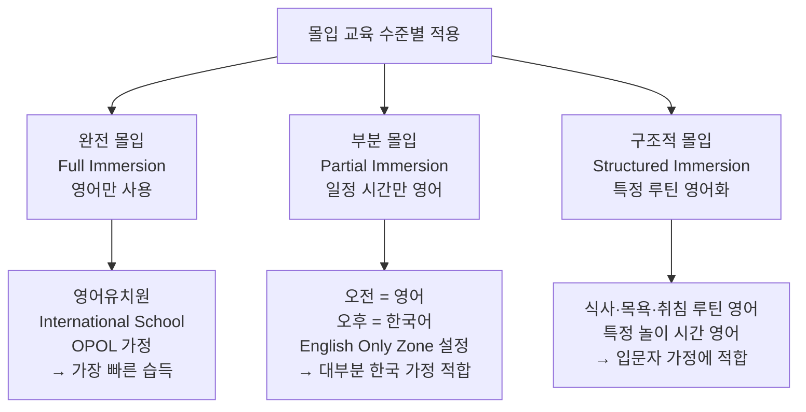

---

## 6. 실전 활동 100가지 (카테고리별 완전 정리)

### 🎮 6-1. 신체 활동 (Body Movement)

| 번호 | 활동명 | 연령 | 방법 | 영어 표현 |
|------|--------|------|------|----------|
| 1 | Simon Says | 3~7세 | 'Simon says' 있을 때만 동작 | "Simon says jump! Simon says freeze!" |
| 2 | Freeze Dance | 2~6세 | 노래 멈추면 동작 멈추기 | "Freeze! / Dance! / Move!" |
| 3 | Color Run | 2~5세 | 색깔 말하면 그 색 물건 터치 | "Touch something BLUE! Run!" |
| 4 | Animal Walk | 2~5세 | 동물 말하면 그 동물처럼 걷기 | "Walk like a penguin! Now a crab!" |
| 5 | Hot & Cold | 3~6세 | 물건 숨기고 hot/cold로 힌트 | "Warmer! Colder! Boiling hot!" |
| 6 | Body Part Bingo | 4~7세 | 신체 부위 빙고 카드 만들어 플레이 | "Head! / Elbow! / Shoulder!" |
| 7 | Floor Maze | 3~6세 | 테이프로 미로 만들어 영어 지시 따라 이동 | "Go straight! Turn left! Stop!" |
| 8 | Balloon Tap | 2~5세 | 풍선 치며 색깔·모양 말하기 | "Red balloon! Don't let it fall!" |
| 9 | Hopscotch | 4~7세 | 숫자/알파벳 써서 영어 말하며 건너기 | "One! Two! Three! Jump!" |
| 10 | Yoga Animals | 3~7세 | 동물 이름 외치고 그 자세 취하기 | "Cat pose! / Dog pose! / Frog!" |

### 🎨 6-2. 미술 활동 (Arts & Crafts)

| 번호 | 활동명 | 연령 | 방법 | 영어 표현 |
|------|--------|------|------|----------|
| 11 | Color Mixing | 2~5세 | 물감 섞으며 새 색 만들기 | "Blue + yellow = green! Magic!" |
| 12 | Alphabet Stamping | 4~6세 | 알파벳 도장으로 단어 찍기 | "Find the letter A! Stamp it!" |
| 13 | Playdough Letters | 3~6세 | 밀가루 반죽으로 알파벳 만들기 | "Make the letter B! Good job!" |
| 14 | Nature Collage | 3~6세 | 나뭇잎·꽃으로 콜라주 만들며 이름 말하기 | "This is a leaf! It's green!" |
| 15 | My Family Portrait | 3~6세 | 가족 그리며 영어로 소개 | "This is my mom! She's tall!" |
| 16 | Feelings Masks | 3~6세 | 감정 표정 마스크 만들어 역할극 | "I'm happy! / I'm surprised!" |
| 17 | Story Map Drawing | 4~7세 | 읽은 책 장면 그리며 이야기 | "First... Then... Finally..." |
| 18 | ABC Book Making | 5~7세 | 각 알파벳으로 나만의 책 만들기 | "A is for apple! B is for ball!" |
| 19 | Weather Chart | 3~6세 | 매일 날씨 그리고 영어로 쓰기 | "Today it's sunny and warm!" |
| 20 | Handprint Animals | 2~5세 | 손 찍어 동물 그림 완성 | "My handprint is a turkey!" |

### 🎵 6-3. 음악 & 챈트 활동 (Music & Chant)

| 번호 | 활동명 | 연령 | 방법 | 목표 언어 |
|------|--------|------|------|----------|
| 21 | Action Songs | 1~5세 | 율동+영어 노래 따라하기 | Head Shoulders, Hokey Cokey |
| 22 | Echo Chant | 2~6세 | 부모 말 → 아이 메아리 | "Apple! (Apple!) Juicy apple!" |
| 23 | Clap the Syllables | 3~6세 | 단어 음절 박수로 표현 | "el-e-phant (3박수)" |
| 24 | Rhyme Time | 3~6세 | 라임 찾기 챈트 | "Cat, bat, hat, sat, mat!" |
| 25 | Freeze Song | 2~6세 | 노래 틀다 멈추면 freeze | 영어 노래 전체 |
| 26 | Alphabet Rap | 4~7세 | 알파벳을 랩으로 외우기 | A-B-C 리듬감 있게 |
| 27 | Number Chant | 2~5세 | 숫자 노래 전신 반응 | 1, 2, 3... jump! stomp! |
| 28 | Days of the Week Song | 4~7세 | Addams Family 곡조 | Monday, Tuesday... |
| 29 | Feelings Song | 3~6세 | "If you're happy and you know it" | happy, sad, tired, mad |
| 30 | Lullaby Time | 0~3세 | 취침 전 영어 자장가 의식화 | Twinkle, Hush Little Baby |

### 📚 6-4. 그림책 & 독서 활동 (Books & Reading)

| 번호 | 활동명 | 연령 | 방법 | 효과 |
|------|--------|------|------|------|
| 31 | Read-Aloud Daily | 0~7세 | 하루 2~3권 소리 내어 읽기 | 어휘·문장 자연 습득 |
| 32 | Book Prediction | 3~7세 | 표지 보며 내용 예측 말하기 | 사전 지식 활성화 |
| 33 | Character Voice | 3~7세 | 캐릭터마다 다른 목소리 | 집중력·표현력 |
| 34 | Story Retelling | 4~7세 | 읽은 후 아이가 다시 이야기 | 기억력·말하기 |
| 35 | Puppet Retelling | 4~7세 | 인형으로 이야기 재연 | 표현력·어휘 |
| 36 | Book-to-Life | 3~7세 | 책 속 음식 만들기, 장소 방문 | 경험+언어 연결 |
| 37 | Felt Board Story | 2~5세 | 펠트 캐릭터로 이야기 조작 | 시각+언어 통합 |
| 38 | Repeated Reading | 0~5세 | 같은 책 10~20번 반복 | 자동화·유창성 |
| 39 | Wordless Books | 2~5세 | 글 없는 그림책으로 이야기 만들기 | 창의적 표현 |
| 40 | Make Your Own Book | 5~7세 | 이야기 창작해 책 만들기 | 쓰기 준비·창의성 |

### 🃏 6-5. 카드 & 보드게임 활동

| 번호 | 활동명 | 연령 | 방법 | 목표 어휘 |
|------|--------|------|------|----------|
| 41 | Flash Card Match | 2~5세 | 단어-그림 카드 매칭 | 주제별 어휘 |
| 42 | Memory Game | 3~7세 | 그림 카드 뒤집어 같은 것 찾기 | 어휘 기억력 |
| 43 | Go Fish | 5~7세 | 카드 짝 맞추기 게임 | "Do you have a dog?" |
| 44 | Bingo | 4~7세 | 영어 단어/그림 빙고 | 숫자·어휘·알파벳 |
| 45 | Snakes & Ladders | 5~7세 | 영어 질문 답하며 이동 | 다양한 어휘 질문 |
| 46 | Alphabet Soup | 4~7세 | 알파벳 카드로 단어 만들기 | 파닉스·단어 |
| 47 | What's in the Bag? | 3~6세 | 가방 속 물건 만져 맞추기 | 형용사·명사 |
| 48 | Story Dice | 4~7세 | 주사위 그림으로 이야기 만들기 | 창의적 표현 |
| 49 | Dominoes (Word) | 5~7세 | 그림-단어 도미노 연결 | 어휘 인식 |
| 50 | Scavenger Hunt | 3~7세 | 영어 단서 보고 물건 찾기 | 이해·어휘 |

### 🍳 6-6. 생활 & 요리 활동 (Life Skills)

| 번호 | 활동명 | 연령 | 방법 | 영어 표현 |
|------|--------|------|------|----------|
| 51 | Cooking Together | 3~7세 | 요리하며 재료·동작 영어로 | "Stir! Pour! Mix! Taste!" |
| 52 | Grocery Shopping | 3~6세 | 마트에서 물건 영어로 찾기 | "Find the apples! How many?" |
| 53 | Setting the Table | 3~6세 | 식탁 차리며 영어로 | "Put the fork on the left!" |
| 54 | Garden Time | 3~7세 | 식물 키우며 영어 관찰일지 | "It grew 2cm! The leaves are green!" |
| 55 | Sorting Laundry | 3~5세 | 빨래 분류하며 색깔·크기 영어 | "Big shirt! / Small socks! / Blue!" |
| 56 | Pet Care | 3~7세 | 반려동물 돌보며 영어 | "Time to feed the dog! Fill the bowl!" |
| 57 | Baking Bread | 4~7세 | 빵 만들며 순서 영어로 | "First, second, then, finally!" |
| 58 | Making Smoothie | 3~6세 | 스무디 만들며 과일 이름 | "Add banana! Blend it! Yummy!" |
| 59 | Planting Seeds | 4~7세 | 씨앗 심으며 식물 어휘 | "Dig a hole! Put the seed in! Water it!" |
| 60 | Mini Chef | 4~7세 | 간단한 샌드위치 만들기 | "Spread the butter! Add the cheese!" |

### 🌿 6-7. 야외 & 자연 활동 (Outdoor & Nature)

| 번호 | 활동명 | 연령 | 방법 | 영어 표현 |
|------|--------|------|------|----------|
| 61 | Nature Walk | 2~7세 | 산책 중 보이는 것 영어로 | "Look! A butterfly! It's flying!" |
| 62 | Leaf Collection | 3~6세 | 나뭇잎 모아 색깔·모양 영어로 | "Red leaf! Round! Crinkly!" |
| 63 | Cloud Watching | 3~7세 | 구름 모양 상상하며 이야기 | "That cloud looks like a dragon!" |
| 64 | Weather Journal | 3~7세 | 매일 날씨 영어로 기록 | "Sunny / Rainy / Windy / Cloudy" |
| 65 | Puddle Stomping | 1~4세 | 물웅덩이 뛰어다니며 영어 | "Splash! Wet! Cold! Jump in!" |
| 66 | Bug Hunt | 3~7세 | 벌레 찾아 영어로 관찰 | "An ant! It's so tiny! It's carrying food!" |
| 67 | Park Scavenger | 3~6세 | 공원에서 영어 목록 물건 찾기 | "Find something round! Something rough!" |
| 68 | Shadow Play | 3~6세 | 그림자 보며 영어 묘사 | "My shadow is HUGE! It's growing!" |
| 69 | Bird Watching | 4~7세 | 새 관찰하며 영어로 묘사 | "That bird is singing! Blue wings!" |
| 70 | Stargazing | 4~7세 | 별 보며 영어 이야기 | "I see the moon! So bright tonight!" |

### 💻 6-8. 디지털 & 기술 활동 (Digital Tools)

| 번호 | 활동명 | 연령 | 도구 | 방법 |
|------|--------|------|------|------|
| 71 | Audiobook Together | 2~7세 | Audible Kids, Epic | 원어민 음성으로 들으며 책 보기 |
| 72 | Video Call in English | 3~7세 | Zoom, FaceTime | 원어민 친척/튜터와 영상통화 |
| 73 | Phonics App Daily | 4~7세 | Starfall, Reading Eggs | 매일 10~15분 파닉스 앱 |
| 74 | Record & Playback | 3~7세 | 스마트폰 녹음 | 영어로 말한 것 녹음해 들어보기 |
| 75 | English Alexa/Siri | 3~7세 | AI 스피커 | "Hey Alexa, play ABC song!" |
| 76 | Educational YouTube | 2~7세 | YouTube Kids | Blippi, Sesame Street 함께 시청 |
| 77 | Digital Storytelling | 5~7세 | Book Creator 앱 | 아이가 영어 이야기 직접 만들기 |
| 78 | Vocabulary Apps | 4~7세 | Endless Alphabet, Quizlet | 게임형 어휘 학습 |
| 79 | English Podcast | 3~7세 | Wow in the World | 아이 영어 팟캐스트 듣기 |
| 80 | Online Storytime | 2~6세 | Storyline Online | 유명인이 읽어주는 그림책 무료 시청 |

---

## 7. 환경 조성 완전 가이드

### 🏠 7-1. 가정 영어 환경 세팅 체크리스트

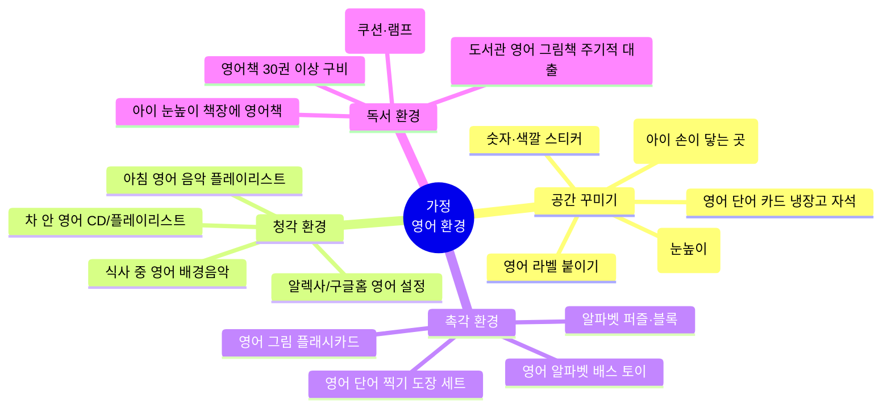

#### 가정 영어 라벨링 완전 세트 (붙일 것 목록)

| 장소 | 영어 라벨 | 관련 학습 표현 |
|------|----------|-------------|
| 현관문 | DOOR / ENTRANCE | "Open the door!" / "Close it gently!" |
| 신발장 | SHOES / CLOSET | "Put your shoes away!" |
| 거실 | LIVING ROOM | "Let's sit in the living room!" |
| 소파 | SOFA / COUCH | "Sit on the couch, please!" |
| 텔레비전 | TV / TELEVISION | "TV time is over!" |
| 책장 | BOOKSHELF | "Let's pick a book from the shelf!" |
| 냉장고 | REFRIGERATOR / FRIDGE | "Is it in the fridge?" |
| 싱크대 | SINK | "Wash your hands at the sink!" |
| 식탁 | TABLE / DINING TABLE | "Come to the table! Dinner time!" |
| 침실 | BEDROOM | "Time to go to your bedroom!" |
| 침대 | BED | "Make your bed in the morning!" |
| 창문 | WINDOW | "Look out the window! It's snowing!" |
| 욕실 | BATHROOM | "Let's go to the bathroom!" |
| 거울 | MIRROR | "Look in the mirror! Funny face!" |
| 욕조 | BATHTUB | "Time for your bath!" |
| 계단 | STAIRS | "Walk up the stairs carefully!" |
| 우편함 | MAILBOX | "Let's check the mailbox!" |
| 정원 | GARDEN / BACKYARD | "Let's play in the garden!" |

---

### 🗓️ 7-2. 하루 영어 루틴 완전판 (연령별)

#### 3~4세 하루 영어 루틴

| 시간 | 활동 | 영어 비중 | 구체적 실행 |
|------|------|----------|-----------|
| 7:00 | 기상 | 100% | 영어로 아침 인사, 오늘 날씨 영어로 말하기 |
| 7:30 | 아침식사 | 70% | 음식 이름, "더 줄까?" 영어로 대화 |
| 8:00 | 그림책 읽기 | 100% | 영어 그림책 2권 소리 내어 읽기 |
| 8:30 | 영어 노래/율동 | 100% | Super Simple Songs 20분 함께 따라하기 |
| 9:00 | 자유 놀이 | 50% | 블록·인형 놀며 영어 중계방송 해주기 |
| 10:00 | 영어 영상 | 100% | Bluey 1~2편 함께 보며 대화 |
| 10:30 | 야외 활동 | 60% | 공원 산책 중 보이는 것 영어로 |
| 12:00 | 점심식사 | 70% | 음식 어휘, "맛있어?" 영어 대화 |
| 13:00 | 낮잠 | - | 영어 자장가 틀어두기 |
| 14:30 | 파닉스 놀이 | 100% | Jolly Phonics 앱 또는 알파벳 카드 놀이 |
| 15:00 | 창의 미술 | 60% | 그리며 색깔·모양 영어로 묘사 |
| 16:00 | 영어 놀이 | 100% | 오늘의 역할극 또는 카드 게임 |
| 18:00 | 저녁식사 | 60% | 하루 이야기 영어로, 음식 어휘 |
| 19:00 | 가족 놀이 | 50% | 아빠와 영어 게임 |
| 20:00 | 취침 독서 | 100% | 영어 그림책 2~3권 |
| 20:30 | 취침 | 100% | 영어 자장가, "Good night!" |

#### 5~7세 하루 영어 루틴 (파닉스 포함)

| 시간 | 활동 | 영어 비중 | 구체적 실행 |
|------|------|----------|-----------|
| 7:00 | 기상 | 100% | 오늘 날씨 영어로 말하기, 기분 표현 |
| 7:30 | 아침식사 | 70% | 영어 대화, 오늘 할 일 영어로 계획 |
| 8:00 | 파닉스 학습 | 100% | 오늘의 파닉스 1가지 집중 (15~20분) |
| 8:30 | 사이트워드 | 100% | 플래시카드 5개 복습+새 단어 2개 |
| 9:00 | 영어 그림책 | 100% | 파닉스 연결 리더스북 독립 읽기 시도 |
| 10:00 | 영어 영상 | 100% | Sesame Street 또는 WordGirl 30분 |
| 10:30 | 야외 활동 | 60% | 영어로 자연 관찰 |
| 14:30 | 파닉스 게임 | 100% | Starfall 앱 또는 파닉스 보드게임 |
| 15:00 | 영어 쓰기 준비 | 100% | 알파벳 쓰기 연습 또는 단어 필사 |
| 16:00 | 역할극/게임 | 100% | 오늘의 CLT 활동 |
| 20:00 | 취침 독서 | 100% | 영어 그림책 + 아이가 소리 내어 읽기 시도 |

---

## 8. 영어 그림책 완전 가이드

### 8-1. 연령별 추천 그림책 50권

#### 0~2세 (보드북·감각책)

| 책 제목 | 작가 | 핵심 언어 | 활용 포인트 |
|--------|------|----------|-----------|
| Goodnight Moon | M.W. Brown | 취침 루틴 어휘 | 매일 밤 같은 책 반복 |
| Brown Bear, Brown Bear | Bill Martin Jr. | 색깔·동물 | 패턴 예측하며 읽기 |
| Pat the Bunny | Dorothy Kunhardt | 촉감+감각 | 만지며 영어로 묘사 |
| Where Is Baby's Belly Button? | Karen Katz | 신체 부위 | 플랩 들추며 찾기 |
| Global Baby Bedtimes | Global Fund for Children | 취침 루틴 | 세계 아기들과 공감 |

#### 2~4세 (그림 중심·반복 패턴)

| 책 제목 | 작가 | 핵심 언어 | 활용 포인트 |
|--------|------|----------|-----------|
| The Very Hungry Caterpillar | Eric Carle | 음식·숫자·요일 | 음식 실물 보여주기 |
| Where the Wild Things Are | Maurice Sendak | 감정·모험 | 아이와 감정 이야기 |
| Chicka Chicka Boom Boom | Bill Martin Jr. | 알파벳 | ABC 나무 만들기 |
| If You Give a Mouse a Cookie | Laura Numeroff | 연결 패턴 | 다음에 뭐가 나올까 예측 |
| Green Eggs and Ham | Dr. Seuss | 라임·반복 | 소리 내어 박자 맞춰 읽기 |
| Corduroy | Don Freeman | 우정·감정 | 인형 가지고 역할극 |

#### 3~5세 (스토리·감정·캐릭터)

| 책 제목 | 작가 | 핵심 언어 | 활용 포인트 |
|--------|------|----------|-----------|
| Pete the Cat | James Dean | 색깔·긍정 마인드 | 신발 색칠하기 활동 |
| Dragons Love Tacos | Adam Rubin | 음식·유머 | 타코 만들기 놀이 |
| The Bad Seed | Jory John | 감정·변화 | 내 감정 이야기 나누기 |
| Elephant & Piggie 시리즈 | Mo Willems | 우정·감정 대화 | 두 역할 나눠 읽기 |
| The Pigeon series | Mo Willems | 감정·협상 | 찬반 토론 |
| Not a Box / Not a Stick | Antoinette Portis | 창의력·상상력 | 종이상자로 창의 놀이 |
| Don't Let the Pigeon Drive the Bus | Mo Willems | 설득·감정 | 아이가 비둘기 역할 |

#### 4~6세 (파닉스·독립 읽기 준비)

| 책 제목 | 작가 | 핵심 언어 | 활용 포인트 |
|--------|------|----------|-----------|
| BOB Books Set 1 | Bobby Lynn Maslen | CVC 파닉스 | 아이 혼자 읽기 첫 책 |
| ORT Stage 1~3 | Oxford | 스토리+파닉스 | Kipper 시리즈 집중 |
| I Can Read Level 1 | 다양한 작가 | 기초 문장 | 소리 내어 읽기 훈련 |
| Hop on Pop | Dr. Seuss | CVC+라임 | 단어 패밀리 게임 |
| One Fish Two Fish | Dr. Seuss | 라임·숫자·반대말 | 패턴 따라 말하기 |

---

## 9. 주제별 단계 학습 — 실전 프로그램 예시

### 9-1. 4주 집중 프로그램: "Animals & Nature" (4~5세)

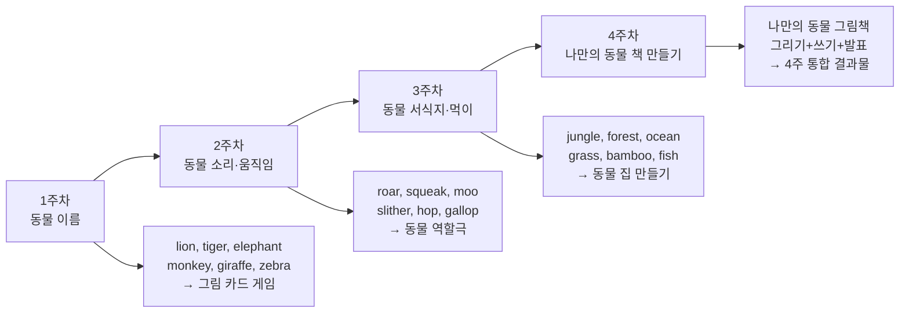

| 일 | 활동 | 사용 자료 | 핵심 표현 |
|----|------|----------|----------|
| 1 | 동물 그림책 읽기 | Dear Zoo | "He sent me a..." |
| 2 | 동물 카드 게임 | Flash cards | "What is this? It's a..." |
| 3 | 동물 소리 TPR | YouTube 동물 소리 | "A lion ROARS! ROAR!" |
| 4 | 동물 만들기 미술 | 색종이, 풀 | "I'm making a giraffe!" |
| 5 | 동물원 역할극 | 동물 인형 | "Welcome to our zoo!" |
| 6 | 동물 노래 | Old MacDonald+ | "E-I-E-I-O!" |
| 7 | 주간 복습 게임 | 빙고 카드 | 주간 어휘 전체 |

### 9-2. 4주 집중 프로그램: "Colors & Shapes" (2~4세)

| 주차 | 테마 | 핵심 어휘 | 대표 활동 | 노래 |
|------|------|----------|----------|------|
| 1주 | Primary Colors | red, blue, yellow | 물감 섞기, Color Hunt | I Can Sing a Rainbow |
| 2주 | More Colors | green, orange, purple | 색깔 몬스터 만들기 | Colors Song (Super Simple) |
| 3주 | Basic Shapes | circle, square, triangle | 모양 콜라주, Shape Hunt | Shape Song 2 |
| 4주 | Shapes in Real Life | rectangle, star, heart | 동네 모양 찾기, 모양 그림 | I Know My Shapes |

---

## 10. 사이트워드(Sight Words) 완전 정복

### 10-1. Dolch Word List 단계별 학습

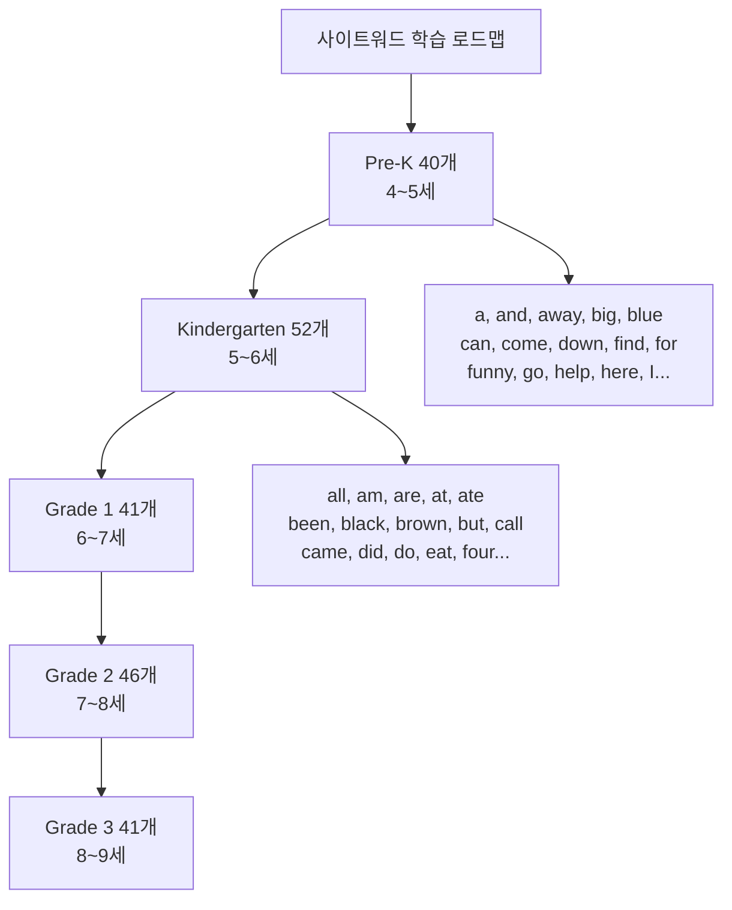

#### 사이트워드 학습 방법 10가지

| 방법 | 적합 연령 | 방법 설명 | 재미 요소 |
|------|----------|----------|----------|
| 플래시카드 | 4세+ | 카드 보여주며 읽기 | 속도 경쟁 |
| 단어 빙고 | 5세+ | 빙고 카드에 단어 써서 게임 | 빙고! 외치기 |
| 단어 낚시 | 4세+ | 클립 단어 카드 자석 낚시 | 낚싯대 만들기 |
| 스팸 쓰기 | 5세+ | 소금·모래에 손으로 쓰기 | 촉감 놀이 |
| 단어 스탬프 | 4세+ | 알파벳 도장으로 단어 찍기 | 미술+언어 |
| 레고 단어 | 5세+ | 레고 블록에 단어 써서 쌓기 | 레고 활용 |
| 점프 단어 | 4세+ | 바닥에 단어 써서 뛰어다니며 읽기 | 신체 활동 |
| 단어 퍼즐 | 5세+ | 단어 카드 조각 맞추기 | 퍼즐 완성 |
| 단어 찾기 | 5세+ | 그림책 속 사이트워드 형광펜 | 독서 연결 |
| 단어 노래 | 4세+ | 사이트워드로 노래 만들기 | 창작 |

---

## 11. 평가 & 기록 방법

### 11-1. 발달 관찰 기록표 (분기별)

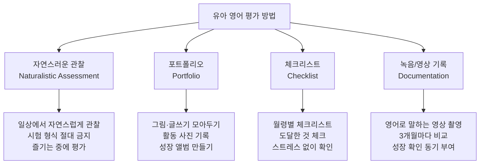

#### 분기별 관찰 체크리스트

| 관찰 항목 | 2세 | 3세 | 4세 | 5세 | 6세 | 7세 |
|----------|-----|-----|-----|-----|-----|-----|
| 영어 노래 따라부르기 (1곡+) | ☐ | ☐ | ☐ | ☐ | ☐ | ☐ |
| 간단한 지시 이해 ("Sit down!") | ☐ | ☐ | ☐ | ☐ | ☐ | ☐ |
| 영어 단어 20개+ 인식 | ☐ | ☐ | ☐ | ☐ | ☐ | ☐ |
| 2단어 영어 표현 사용 | ☐ | ☐ | ☐ | ☐ | ☐ | ☐ |
| 알파벳 26자 인식 | - | - | ☐ | ☐ | ☐ | ☐ |
| CVC 단어 5개+ 읽기 | - | - | - | ☐ | ☐ | ☐ |
| 사이트워드 50개 인식 | - | - | - | ☐ | ☐ | ☐ |
| ORT Stage 2 독립 읽기 | - | - | - | - | ☐ | ☐ |
| 영어로 3문장 연속 말하기 | - | - | - | ☐ | ☐ | ☐ |
| 알파벳 쓰기 (대문자) | - | - | - | ☐ | ☐ | ☐ |

---

## 12. ⚠️ 주의사항 완전 정리

### 12-1. 절대 금지 사항

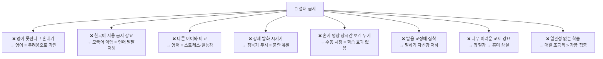

### 12-2. 오해 vs 진실

| 흔한 오해 | 실제 진실 | 올바른 대처 |
|----------|----------|-----------|
| "한국어를 먼저 완성해야 영어를 시작해야 한다" | ❌ 두 언어 동시 습득이 인지 발달에 더 유익 | 0세부터 영어 소리 노출 병행 가능 |
| "이중언어 아이는 언어 발달이 느리다" | ❌ 합산 어휘 수는 정상, 잠시 분리되어 보일 뿐 | 두 언어 합산으로 평가할 것 |
| "영어 조기교육은 사교육이 필수다" | ❌ 가정 환경이 어떤 학원보다 효과적 | 부모의 영어 말 걸기+그림책이 핵심 |
| "아이가 영어를 싫어하면 재능이 없는 것" | ❌ 방법이 잘못된 것 (강요, 어려운 교재 등) | 더 재미있는 방법으로 전환 |
| "발음이 완벽하지 않으면 영어를 가르치면 안 된다" | ❌ 부모의 불완전한 발음도 충분히 효과적 | 오디오북·영상으로 보완하면 됨 |
| "영어 영상은 보여주기만 해도 습득된다" | ❌ 부모와 상호작용 없는 수동 시청은 효과 미미 | 항상 함께 보고 대화하기 |
| "침묵기는 문제가 있는 것이다" | ❌ 6~12개월의 침묵기는 완전히 정상 | 강요 없이 계속 노출만 유지 |

### 12-3. 영어 거부 반응 대처법

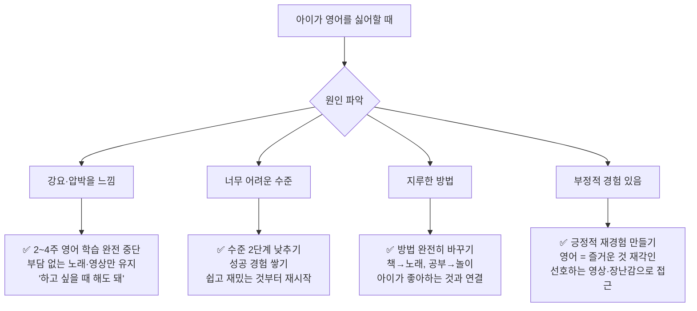

---

## 13. 추천 리소스 완전 목록

### 13-1. 앱 & 디지털 도구

| 이름 | 연령 | 특징 | 월 비용 | 평점 |
|------|------|------|--------|------|
| **Starfall** | 3~8세 | 파닉스+읽기 체계적, 게임형 | 무료/월 $35 | ⭐⭐⭐⭐⭐ |
| **Reading Eggs** | 3~7세 | 달걀 캐릭터, 단계별 읽기 | 월 $10 | ⭐⭐⭐⭐ |
| **Endless Alphabet** | 2~6세 | 알파벳+어휘, 귀여운 몬스터 | 무료/앱 구매 | ⭐⭐⭐⭐⭐ |
| **Jolly Phonics** | 4~7세 | 42음소 체계, 노래+행동 | 무료/앱 구매 | ⭐⭐⭐⭐⭐ |
| **Khan Academy Kids** | 2~8세 | 종합 교육, 완전 무료 | 무료 | ⭐⭐⭐⭐⭐ |
| **Epic! Books** | 2~12세 | 40,000권+ 영어책 디지털 | 월 $8 | ⭐⭐⭐⭐⭐ |
| **Raz-Kids** | 5~12세 | 레벨별 읽기+퀴즈 | 월 $6 | ⭐⭐⭐⭐ |
| **Duolingo ABC** | 3~8세 | 무료, 파닉스+읽기 | 무료 | ⭐⭐⭐⭐ |
| **Toca Boca 시리즈** | 3~8세 | 창의적 역할극, 언어 노출 | 앱 구매 | ⭐⭐⭐⭐ |
| **Lingokids** | 2~8세 | 영어 종합 커리큘럼 | 월 $15 | ⭐⭐⭐⭐ |

### 13-2. YouTube 채널 (무료)

| 채널명 | 연령 | 콘텐츠 | 구독자 | 강점 |
|--------|------|--------|--------|------|
| Super Simple Songs | 0~5세 | 동요·율동 | 4500만+ | 가장 직관적, 발음 명확 |
| Cocomelon | 0~4세 | 일상 노래 | 1.7억+ | 반복 구조, 일상 어휘 |
| Blippi | 3~7세 | 탐험·학습 | 1700만+ | 과학·직업·자연 어휘 |
| Sesame Street | 3~7세 | 교육·알파벳 | 750만+ | 고전, 교육 검증됨 |
| Alphablocks | 4~7세 | 알파벳 캐릭터 파닉스 | 250만+ | 파닉스 학습 최고 |
| Numberblocks | 4~7세 | 숫자 캐릭터 수학 | 360만+ | 수 개념+영어 동시 |
| Pinkfong | 0~5세 | Baby Shark, 동요 | 7400만+ | 중독성 있는 리듬 |
| Storybots | 4~8세 | 왜? 어떻게? 탐구 | 370만+ | 호기심 자극 |
| Wow in the World | 5~10세 | 과학 팟캐스트 형식 | - | 배경 청취용 |
| Storyline Online | 3~10세 | 유명인이 읽어주는 그림책 | 120만+ | 완전 무료, 고품질 |

### 13-3. 영어 그림책 구매 추천 (가성비)

| 구매처 | 특징 | 가격대 | 추천 이유 |
|--------|------|--------|----------|
| 알라딘 중고 | 중고 영어책 저렴 | 1,000~5,000원 | 양 채우기 좋음 |
| YES24 영어원서 | 신간 구매 | 10,000~20,000원 | 다양한 선택 |
| 도서관 대출 | 무료 | 0원 | 국내 주요 도서관 영어책 풍부 |
| Thrift Books | 미국 중고 직구 | $3~5/권 | 저렴한 해외 직구 |
| Book Depository | 무료 배송 | 원가 | 영국 기반, 무료 배송 |
| Amazon | 세트 구매 | 권당 저렴 | BOB Books 세트 등 |

### 13-4. 화상영어 플랫폼 비교

| 플랫폼 | 연령 | 수업 시간 | 가격 | 강점 |
|--------|------|----------|------|------|
| **링글틴즈** | 4세+ | 25~40분 | 월 20만원대 | 엄선된 원어민 교사 |
| **캠블리키즈** | 4세+ | 30분 | 월 10만원대 | 다양한 교사 선택 |
| **AmazingTalker** | 5세+ | 25~60분 | 시간당 1.5~3만원 | 강사 자유 선택 |
| **italki Kids** | 5세+ | 30~60분 | 시간당 1~2만원 | 저렴한 비원어민 옵션 |
| **VIPKid** | 4~12세 | 25분 | 월 20만원+ | 미국 커리큘럼 체계 |
| **Outschool** | 3세+ | 그룹/개인 | 수업당 1~3만원 | 주제별 다양한 클래스 |

---

## 14. 최종 체크리스트

### ✅ 2세 달성 목표
- [ ] 영어 자장가 5곡 이상 들으면 반응
- [ ] "no", "more", "hi", "bye" 의미 이해
- [ ] 간단한 지시 따르기 ("Clap!", "Come here!")
- [ ] 영어 노래 1~2곡 부분 따라하기
- [ ] 영어 그림책 5~10분 집중해서 듣기

### ✅ 3세 달성 목표
- [ ] 영어 단어 50개+ 이해
- [ ] 2단어 영어 표현 사용 ("more milk", "big dog")
- [ ] 영어 노래 3~5곡 따라 부르기
- [ ] 그림책 보며 그림 짚어 말하기
- [ ] 간단한 지시 5개 이상 이해

### ✅ 4세 달성 목표
- [ ] 알파벳 26자 인식 (대문자)
- [ ] 영어 단어 100개+ 인식
- [ ] 3~5문장 영어 대화 가능
- [ ] 파닉스 1단계 (기본 음소) 시작
- [ ] 그림책 줄거리 간단히 이야기하기

### ✅ 5세 달성 목표
- [ ] 알파벳 대소문자 26자 인식·발음
- [ ] 사이트워드 30~50개 자동 인식
- [ ] CVC 단어 10개+ 읽기
- [ ] 파닉스 2단계 (단모음 전체) 진행 중
- [ ] 인사·감정·요청 표현 30개+ 사용

### ✅ 6세 달성 목표
- [ ] 파닉스 1~3단계 완성 (CVC, Blends, Digraphs)
- [ ] 사이트워드 100개+ 자동 인식
- [ ] ORT Stage 2~3 수준 독립 독해
- [ ] 5~10문장 영어 대화 가능
- [ ] 알파벳 대문자 쓰기

### ✅ 7세 달성 목표
- [ ] 파닉스 4~5단계 완성 (장모음, 이중모음)
- [ ] 사이트워드 Dolch Pre-K~K 완성 (92개)
- [ ] ORT Stage 3~4 독립 독해
- [ ] 영어 일기 2~3문장 쓰기
- [ ] 10분 이상 영어 대화 지속 가능

---

> ## 📌 유아 영어의 5대 황금 원칙
>
> | 원칙 | 실천 방법 |
> |------|----------|
> | **① 즐거움 최우선** | 영어 = 즐거운 경험으로 각인, 성과 압박 금지 |
> | **② 노출량이 핵심** | 좋은 교재 1권보다 매일 30분 영어 환경이 더 중요 |
> | **③ 부모 상호작용** | 영상보다 부모가 영어로 말 거는 것이 가장 효과적 |
> | **④ 모국어 탄탄히** | 한국어 기반이 강해야 영어도 강해진다 |
> | **⑤ 꾸준함이 전부** | 매일 20분 > 주말 2시간, 장기 일관성이 승부 |
>
> **"아이의 영어는 부모의 영어 환경과 상호작용으로 완성됩니다." 🌱**
