# 🗣️ 유아 영어 — 회화·듣기·말하기 중심 교육법
> 한국어 최소화 전략 · 자연 습득 이론 · 그림책 활용 · 아이 한국어 반응 대처법
> 작성일: 2026-04-08

---

## 1. 핵심 이론: 왜 듣기가 먼저인가?

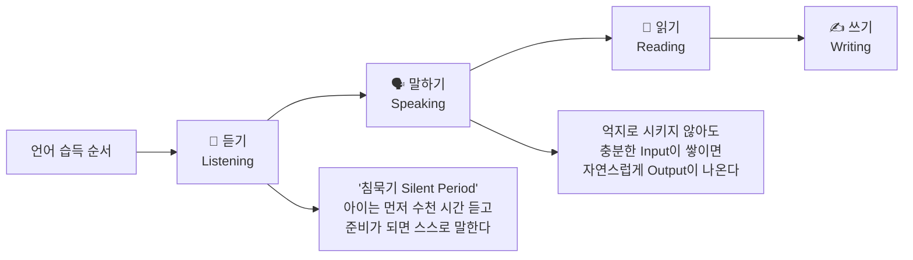

### 크라센(Krashen)의 입력 가설 — 유아 영어에 적용

| 이론 | 핵심 개념 | 유아 영어 적용 |
|------|----------|--------------|
| **Input Hypothesis** | 이해 가능한 입력 (i+1) 이 있어야 습득 | 아이 수준보다 살짝 높은 영어 노출 |
| **Silent Period** | 말하기 전 충분한 침묵기는 정상 | 영어로 안 말해도 강요하지 않기 |
| **Affective Filter** | 불안·강요 → 언어 습득 차단 | 즐겁고 편안한 환경이 핵심 |
| **Acquisition vs Learning** | 자연 습득 > 의식적 학습 | 놀이·노래·일상 대화로 자연 습득 |

---

## 2. 듣기(Listening) 중심 전략

### 2-1. 총체적 듣기 환경 설계

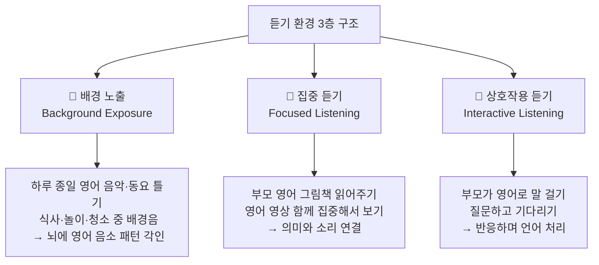

### 2-2. 하루 듣기 시간 배분 (권장)

| 유형 | 방법 | 시간 | 효과 |
|------|------|------|------|
| 배경 영어 음악 | Super Simple Songs, 동요 플레이리스트 | 2~3시간 (틀어놓기) | 리듬·억양 내재화 |
| 집중 영상 시청 | Bluey, Peppa Pig (함께 보기) | 30분 | 맥락+어휘 이해 |
| 그림책 읽어주기 | 부모 소리 내어 읽기 | 20~30분 | 소리-의미-그림 통합 |
| 부모 영어 말 걸기 | 일상 속 영어 대화 | 하루 전체 | 실제 언어 습득 |
| **합계** | | **약 3~4시간** | |

---

## 3. 한국어 최소화 전략 — OPOL & 영어 몰입

### 3-1. OPOL 전략 (One Parent One Language)

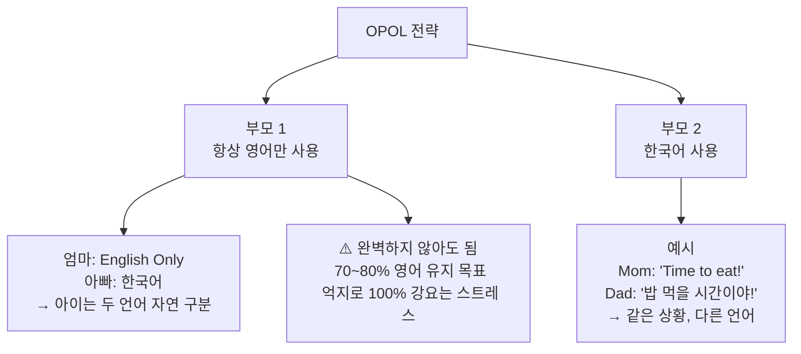

### 3-2. 한국어 사용을 줄이는 실전 방법

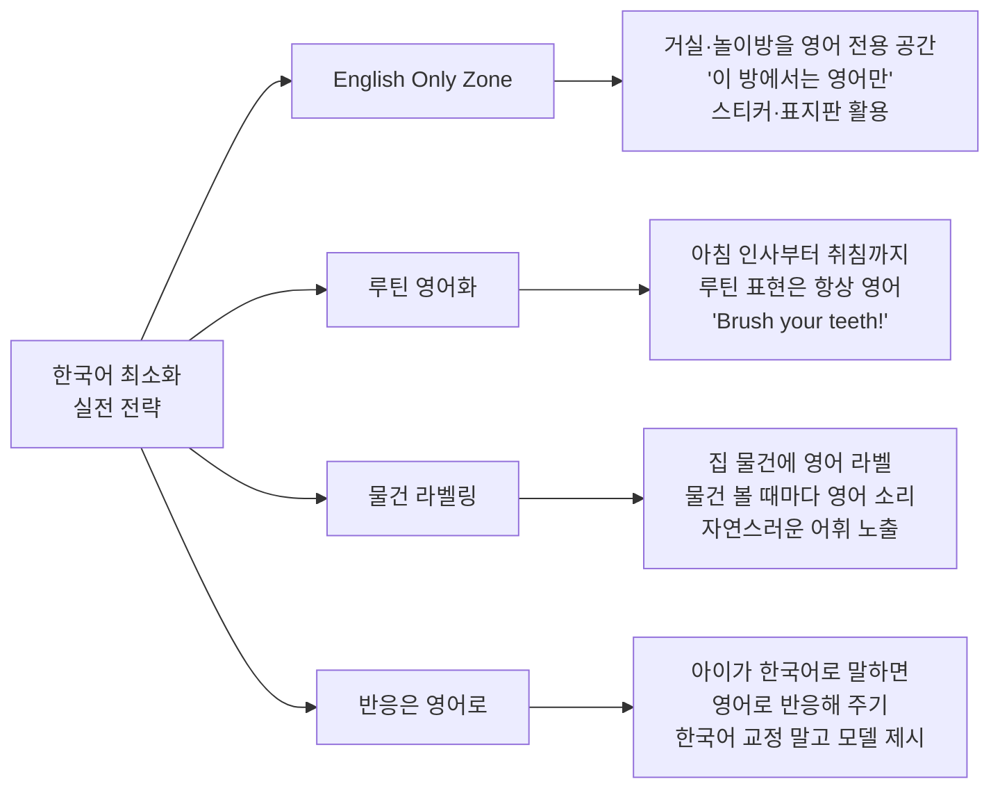

---

## 4. 아이가 한국어로 말할 때 대처법

> 💡 **핵심 원칙**: 아이가 한국어로 말하는 것은 **완전히 정상**입니다.
> 교정하거나 혼내지 말고, **영어로 자연스럽게 모델을 보여주세요.**

### 4-1. 상황별 대처 전략

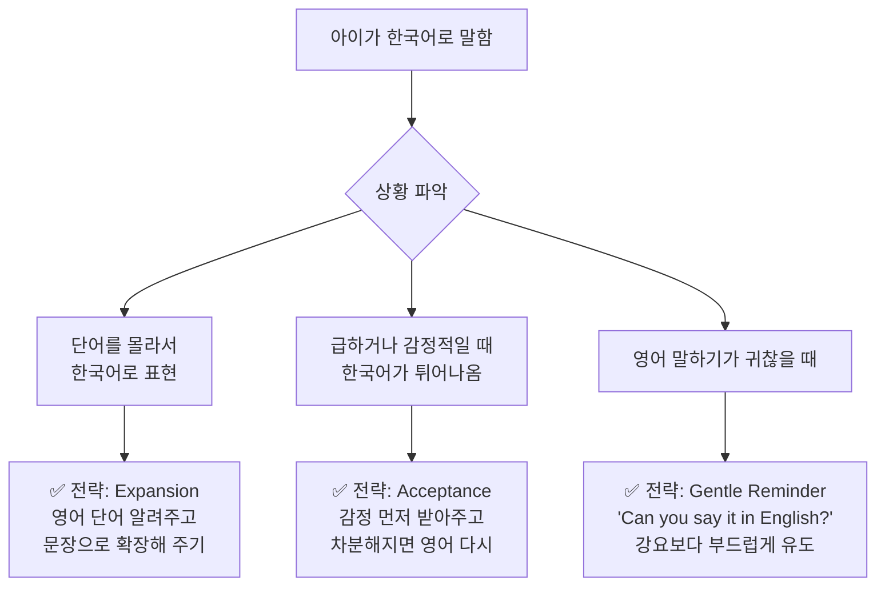

### 4-2. 실전 대화 예시

| 상황 | 아이 말 (한국어) | ❌ 잘못된 반응 | ✅ 올바른 반응 |
|------|----------------|--------------|--------------|
| 배고플 때 | "엄마, 배고파!" | "한국어 쓰면 안 돼!" | "Oh, you're hungry! Let's eat! Are you hungry?" |
| 물건 가리킬 때 | "저거 뭐야?" | "영어로 말해봐." | "What's that? That's a butterfly! 나비야, butterfly!" |
| 놀이 중 | "이거 내 꺼야!" | (무시) | "It's yours! Mine! This is mine!" |
| 아플 때 | "머리 아파" | "Headache라고 해봐" | "Oh no, does your head hurt? You have a headache." |
| 질문할 때 | "왜?" | "Why라고 해봐야지" | "Why? Good question! Because~" |
| 도움 요청 | "이거 열어줘" | "Open이라고 해야지" | "Open? Can I open it? Here you go! I opened it!" |

### 4-3. 아이의 영어 말하기 유도 기술

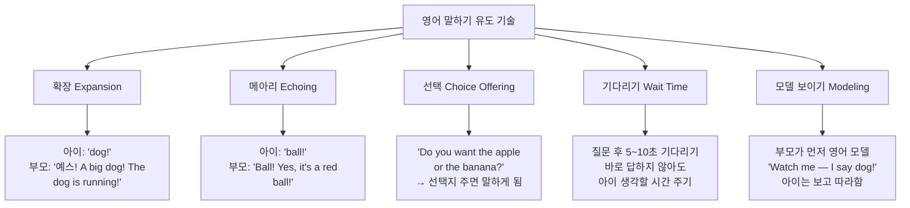

---

## 5. 말하기(Speaking) 발달 단계별 전략

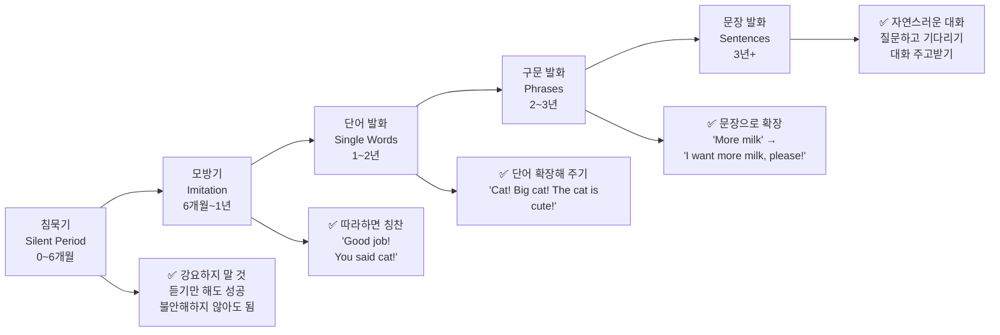

### 5-1. 말하기 유도 활동 실전 예시

| 활동 | 방법 | 유도 영어 | 기대 반응 |
|------|------|----------|----------|
| 🎭 **인형극** | 인형으로 대화, 아이가 인형 역할 | "What does the bear say?" | "Hello! / Roar!" |
| 🃏 **그림카드 게임** | 카드 뒤집어 이름 말하기 대결 | "What is it?" | "Dog! / Apple!" |
| 📸 **사진 보며 말하기** | 가족 사진 보며 묘사 | "Who is this?" | "Daddy! / Baby me!" |
| 🔍 **I Spy** | "I spy something blue!" | "Is it the sky? The cup?" | 추측하며 영어 사용 |
| 🍕 **주문 놀이** | 식당 역할극, 메뉴 주문 | "What would you like?" | "Pizza! / Juice please!" |
| 📖 **이야기 완성하기** | 책 읽다가 멈추기 | "And then what happened?" | 이야기 예측 말하기 |
| 🌈 **색깔 챈트** | 리듬에 맞춰 색깔 말하기 | "Red, red, what is red?" | "Apple is red!" |
| 🎵 **노래 빈칸 채우기** | 노래 중간에 멈추고 기다리기 | "Twinkle twinkle little ___" | "Star!" |

---

## 6. 영어 그림책 읽어주기 — 효과 & 방법

> **결론: 영어 그림책 읽어주기는 매우 효과적입니다.**
> 단, **어떻게** 읽어주느냐가 핵심입니다.

### 6-1. 그림책이 왜 효과적인가?

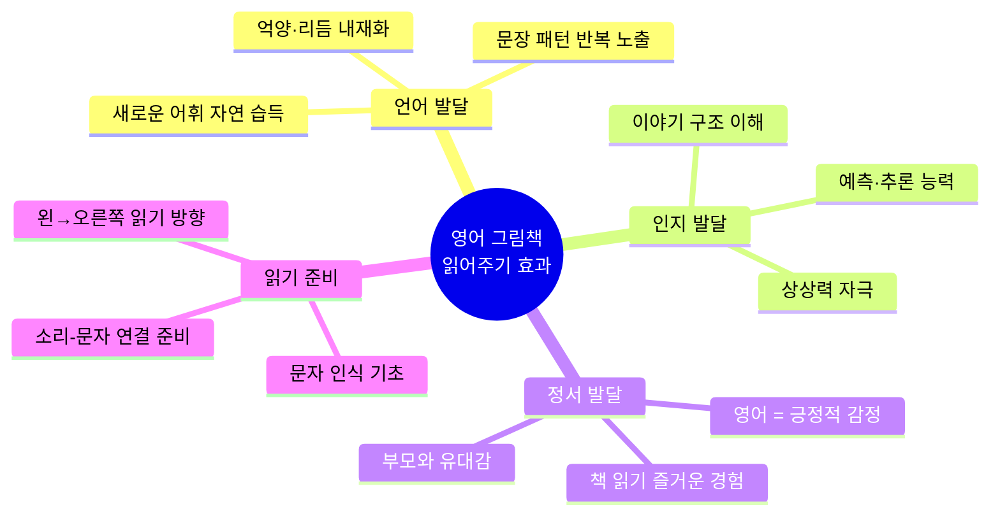

### 6-2. 그림책 읽어주기 4단계 전략

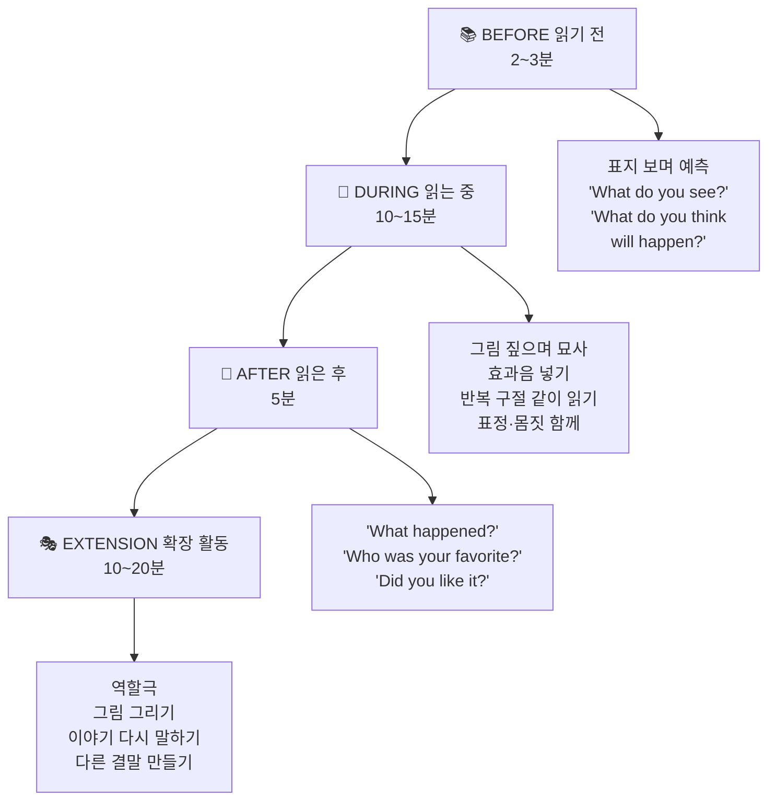

### 6-3. 그림책 읽어줄 때 영어 발화 기술

| 기술 | 방법 | 예시 |
|------|------|------|
| **짚기 (Pointing)** | 그림 짚으며 이름 말하기 | "Look! A caterpillar! He's eating!" |
| **효과음 (Sound Effects)** | 동물 소리, 행동 소리 넣기 | "The bear goes ROAR! 🐻" |
| **질문하기 (Questioning)** | 열린 질문으로 생각 유도 | "Why is she crying? What do you think?" |
| **예측하기 (Predicting)** | 페이지 넘기기 전 멈추기 | "What will happen next? Let's see!" |
| **연결하기 (Connecting)** | 아이 경험과 연결 | "Like when YOU were scared! Remember?" |
| **반복하기 (Repetition)** | 반복 구절은 같이 읽기 | 아이와 함께 "Brown Bear, what do you see?" |
| **드라마틱하게 (Drama)** | 목소리·속도·크기 변화 | 속삭이다가 크게, 천천히 했다가 빠르게 |

### 6-4. 부모 영어 실력이 부족할 때 해결책

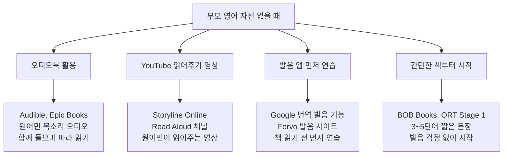

---

## 7. 몰입 환경 설계 — 실전 루틴

### 7-1. 영어 몰입 하루 루틴 (4~6세)

```mermaid
gantt
    title 영어 몰입 하루 루틴 (4~6세)
    dateFormat HH:mm
    axisFormat %H:%M

    section 아침
    기상 영어 인사        :07:00, 10m
    아침식사 영어 대화     :07:10, 20m
    영어 그림책 읽기       :08:00, 20m

    section 오전
    영어 노래/율동        :08:30, 20m
    영어 놀이 (Role Play) :09:00, 30m
    영어 영상 (함께 보기) :10:00, 30m
    야외 활동 (영어 말 걸기):10:30, 60m

    section 오후
    점심식사 영어 대화     :12:00, 20m
    낮잠/자유시간         :13:00, 90m
    파닉스/알파벳 놀이    :14:30, 20m
    창의 미술 (영어 설명):15:00, 30m

    section 저녁
    저녁식사 영어 대화    :18:00, 30m
    취침 전 그림책 2~3권  :20:00, 25m
    잠자리 영어 인사      :20:25, 5m
```

### 7-2. 상황별 부모 영어 스크립트

#### 🌅 아침 (Morning Routine)
```
▶ 기상
"Good morning! Rise and shine! ☀️"
"Did you sleep well? Did you have any dreams?"
"Let's get up! Time to start the day!"

▶ 세수/양치
"Let's wash your face! Splash, splash!"
"Now brush your teeth — top, bottom, sides!"
"Open wide! Good job! All clean!"

▶ 옷 입기
"What do you want to wear today?"
"It's cold today — let's wear a jacket!"
"Put your arms through! There you go! Looking good!"
```

#### 🍳 식사 시간 (Meal Time)
```
▶ 식사 전
"Are you hungry? Let's eat!"
"What do you want for breakfast?"
"We're having eggs and toast today!"

▶ 식사 중
"How is it? Is it yummy?"
"Do you want more? / Are you full?"
"Take a big bite! Chew, chew, chew!"
"Drink some water, please."

▶ 식사 후
"All done! Did you enjoy it?"
"Let's clean up! Wipe your mouth."
"Good eating today! 👍"
```

#### 🎮 놀이 시간 (Playtime)
```
▶ 놀이 시작
"What do you want to play?"
"Let's play with blocks! / Let's do a puzzle!"
"I'll play with you! Let's go!"

▶ 놀이 중
"Wow, look at that! Amazing!"
"Your turn! / My turn!"
"What are you making? Tell me!"
"Be careful! / Good job!"

▶ 정리 시간
"Clean up time! Let's tidy up!"
"Where does this go? On the shelf!"
"Almost done! Great teamwork!"
```

#### 🌙 취침 루틴 (Bedtime Routine)
```
▶ 목욕
"Bath time! Let's go! 🛁"
"Is the water warm? Good!"
"Wash, wash, wash! Now rinse!"

▶ 독서
"Story time! Which book tonight?"
"Snuggle up! Let's read together."
(읽은 후) "The end! Did you like it?"

▶ 잠자리
"Time to sleep. Close your eyes."
"I love you so much! 💕"
"Sweet dreams! Good night!"
```

---

## 8. 유아 영어 방법론 비교

| 방법론 | 핵심 원칙 | 특징 | 한국 가정 적용 |
|--------|----------|------|--------------|
| **자연습득법 (Natural Approach)** | 언어는 자연스럽게 습득 | 강요 없이 의미 있는 입력 | 일상 영어 대화 |
| **전신반응법 (TPR)** | 신체 동작으로 언어 습득 | 지시 → 행동으로 반응 | "Jump! Clap! Sit!" 명령 놀이 |
| **몰입법 (Immersion)** | 목표 언어만 사용 환경 | 최대 영어 노출 | English Only Zone 설정 |
| **균형적 접근 (Balanced)** | 자연 습득 + 구조적 학습 | 놀이+파닉스 병행 | 4~5세부터 파닉스 추가 |
| **이야기 중심 (Story-based)** | 스토리로 언어 습득 | 그림책·이야기가 핵심 | 매일 그림책 2~3권 |

---

## 9. 자주 묻는 질문 (FAQ)

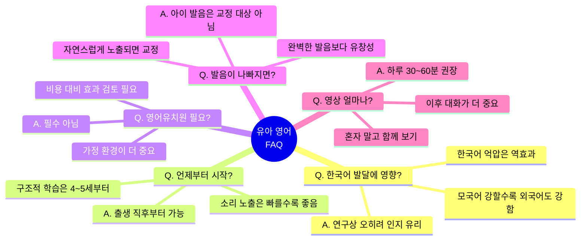

| 질문 | 답변 | 실천 방법 |
|------|------|----------|
| 영어 때문에 한국어가 늦어질까? | ❌ 아닙니다. 이중언어 아이는 인지적으로 유리합니다. | 한국어도 충분히 사용, 두 언어 모두 풍부하게 |
| 아이가 전혀 영어로 말 안 해요 | ✅ 침묵기는 정상! 6~12개월 지속될 수 있습니다. | 강요 말고 계속 노출만 유지 |
| 부모 영어 발음이 좋지 않아도 되나요? | ✅ 됩니다. 원어민 영상·오디오 보완하면 충분합니다. | YouTube 읽어주기 + 오디오북 활용 |
| 영어책 읽어주는 게 효과 있나요? | ✅ 매우 효과적! 언어 습득의 핵심입니다. | 매일 2~3권, 같은 책 반복도 OK |
| 몇 살부터 파닉스 시작해야 하나요? | 4~5세가 적기. 그 전엔 노출 중심으로 | 5세 이전: 노래·그림책 / 5세 이후: 파닉스 |
| 영어유치원 꼭 보내야 하나요? | ❌ 필수 아닙니다. 가정 환경이 더 중요합니다. | 가정 몰입 환경 + 화상영어로 대체 가능 |

---

## 10. ⚠️ 절대 하지 말아야 할 것

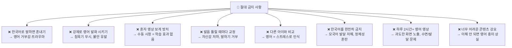

---

> ## 📌 핵심 요약
>
> | 원칙 | 실천 |
> |------|------|
> | **듣기가 먼저** | 충분히 들어야 말이 나온다 — 침묵기는 정상 |
> | **즐거움이 핵심** | 영어 = 즐거운 경험으로 각인시키기 |
> | **일상에서 영어** | 특별한 학습 시간보다 루틴 영어화 |
> | **그림책은 필수** | 매일 2~3권, 소리 내어 읽어주기 |
> | **한국어 탄탄히** | 모국어 기반이 강해야 영어도 강해진다 |
> | **기다려 주기** | 말 안 해도 강요 금지, 노출만 계속 |
> | **부모가 먼저 영어** | 아이에게 영어 모델을 보여주는 것이 최고 교재 |

---

## 11. 🗣️ 상황별 영어 10턴 회화 — 엄마·아빠 실전 스크립트 30선

> **🌱 프뢰벨 영어 교육 철학**: 놀이와 일상 속에서 자연스럽게 언어를 습득합니다.
> 아이가 영어로 대답 못해도 OK! **부모가 꾸준히 영어로 말해주는 것**이 핵심입니다.
> 아이는 충분한 Input(듣기)이 쌓이면 자연스럽게 말하기 시작합니다.

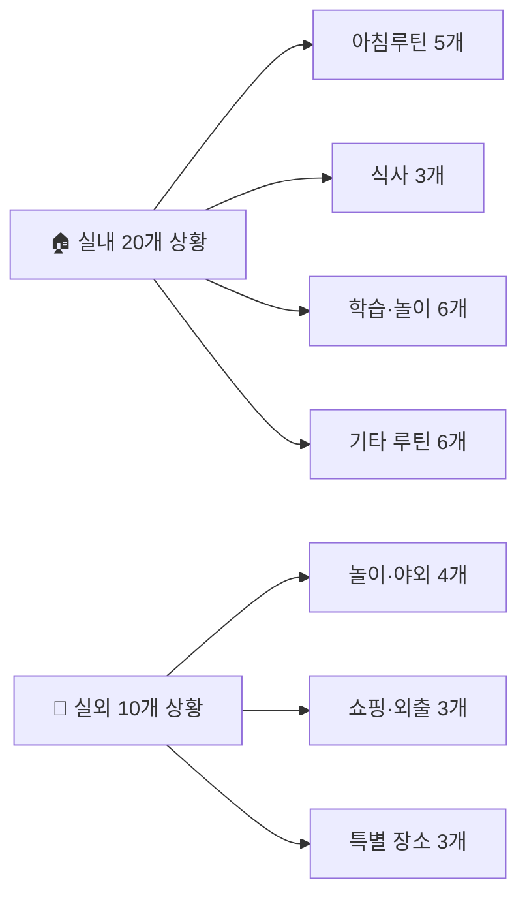

### 📌 사용 가이드

| 기호 | 의미 |
|------|------|
| 👩 엄마 / 👨 아빠 | 부모가 말하는 영어 표현 |
| 👶 아이 | 아이 반응 (한국어·영어 혼합 완전 OK!) |
| 💡 핵심 표현 | 반복해서 익히면 좋은 핵심 문장 |
| 🔁 | 매일 반복 권장 표현 |

---

## 🏠 실내 상황 (Indoor — 20개)

---

### 상황 01. 🪥 이닦기 (Brushing Teeth)

| 턴 | 화자 | 영어 표현 | 한국어 의미 |
|----|------|----------|------------|
| 1 | 👩 엄마 | "Time to brush your teeth! Let's go to the bathroom." | 이 닦을 시간이야! 화장실 가자. |
| 2 | 👶 아이 | "Okay, Mommy!" | 네, 엄마! |
| 3 | 👩 엄마 | "Put a little toothpaste on your brush — not too much!" | 칫솔에 치약 조금 묻혀 — 너무 많이 말고! |
| 4 | 👶 아이 | "Like this?" | 이렇게요? |
| 5 | 👩 엄마 | "Perfect! Now brush — up and down, round and round!" | 완벽해! 이제 닦아 — 위아래, 빙글빙글! |
| 6 | 👶 아이 | "Brush, brush, brush!" | 닦고, 닦고, 닦고! |
| 7 | 👩 엄마 | "Don't forget the back teeth! Open wide — say ahhh!" | 뒤쪽 이도 잊지 마! 입 크게 벌려 — 아 해봐! |
| 8 | 👶 아이 | "Ahhhh!" | 아! |
| 9 | 👩 엄마 | "Now spit and rinse! Good rinsing!" | 이제 뱉고 헹궈! 잘 헹구고 있어! |
| 10 | 👩 엄마 | "All done! Beautiful, clean teeth! High five!" | 다 됐어! 예쁘고 깨끗한 이! 하이파이브! |

> 💡 **핵심 표현**: `Brush your teeth!` / `Open wide!` / `Spit and rinse!` / `All done!`

---

### 상황 02. 🌊 세수하기 (Washing Face)

| 턴 | 화자 | 영어 표현 | 한국어 의미 |
|----|------|----------|------------|
| 1 | 👩 엄마 | "Good morning! Let's wash your face!" | 좋은 아침! 세수하자! |
| 2 | 👶 아이 | "I'm sleepy..." | 졸려요... |
| 3 | 👩 엄마 | "I know! Washing will wake you up! Come on!" | 알아! 세수하면 잠이 깰 거야! 어서! |
| 4 | 👶 아이 | "Okay..." | 알겠어요... |
| 5 | 👩 엄마 | "Turn on the water. Is it warm or cold?" | 물 틀어. 따뜻해 아니면 차가워? |
| 6 | 👶 아이 | "Warm!" | 따뜻해요! |
| 7 | 👩 엄마 | "Good! Splash the water on your face! Splash, splash!" | 좋아! 물을 얼굴에 튀겨! 첨벙, 첨벙! |
| 8 | 👶 아이 | "Splash! It's cold!" | 첨벙! 차가워요! |
| 9 | 👩 엄마 | "Dry your face with the towel. Pat, pat, pat!" | 수건으로 얼굴 닦아. 토닥, 토닥, 토닥! |
| 10 | 👩 엄마 | "So fresh and clean! What a beautiful face!" | 정말 상쾌하고 깨끗해! 정말 예쁜 얼굴이야! |

> 💡 **핵심 표현**: `Wash your face!` / `Warm or cold?` / `Splash!` / `Fresh and clean!`

---

### 상황 03. ☀️ 아침 기상 (Waking Up)

| 턴 | 화자 | 영어 표현 | 한국어 의미 |
|----|------|----------|------------|
| 1 | 👨 아빠 | "Good morning, sunshine! Time to wake up!" | 좋은 아침, 내 햇님! 일어날 시간이야! |
| 2 | 👶 아이 | "Five more minutes, Daddy..." | 5분만 더요, 아빠... |
| 3 | 👨 아빠 | "Come on! The sun is up! Stretch your arms — stretch, stretch!" | 어서! 해가 떴어! 팔 쭉 뻗어봐 — 쭉, 쭉! |
| 4 | 👶 아이 | "Mmm... stretchhh..." | 음... 쭉... |
| 5 | 👨 아빠 | "Big yawn! Yaaawn! How did you sleep?" | 크게 하품해! 하아암! 잘 잤어? |
| 6 | 👶 아이 | "I had a dream! About dinosaurs!" | 꿈 꿨어요! 공룡 꿈이요! |
| 7 | 👨 아빠 | "Wow! Tell me about your dream! Were they scary?" | 와! 꿈 이야기 해줘! 무서웠어? |
| 8 | 👶 아이 | "No! They were my friends! We played together!" | 아니요! 제 친구들이었어요! 같이 놀았어요! |
| 9 | 👨 아빠 | "What a wonderful dream! Okay, up you go! Let's start the day!" | 정말 멋진 꿈이었구나! 자, 일어나! 하루 시작하자! |
| 10 | 👨 아빠 | "Good morning hug! I love you! Ready for a great day?" | 아침 포옹! 사랑해! 멋진 하루 준비됐어? |

> 💡 **핵심 표현**: `Good morning!` / `Stretch!` / `How did you sleep?` / `Tell me about your dream!`

---

### 상황 04. 👕 옷 입기 (Getting Dressed)

| 턴 | 화자 | 영어 표현 | 한국어 의미 |
|----|------|----------|------------|
| 1 | 👩 엄마 | "Time to get dressed! Let's pick your clothes." | 옷 입을 시간이야! 옷 고르자. |
| 2 | 👶 아이 | "I want the red shirt!" | 빨간 셔츠 입고 싶어요! |
| 3 | 👩 엄마 | "Great choice! Do you want these pants too?" | 좋은 선택! 이 바지도 입을래? |
| 4 | 👶 아이 | "Yes, the blue ones!" | 네, 파란 거요! |
| 5 | 👩 엄마 | "Red and blue — you'll look so cool! Arms up first!" | 빨강이랑 파랑 — 정말 멋있겠다! 먼저 팔 들어봐! |
| 6 | 👶 아이 | "Arms up!" | 팔 들었어요! |
| 7 | 👩 엄마 | "Shirt on! Now the pants — one leg, two legs!" | 셔츠 입었어! 이제 바지 — 한 다리, 두 다리! |
| 8 | 👶 아이 | "One, two! Done!" | 하나, 둘! 됐어요! |
| 9 | 👩 엄마 | "Don't forget your socks! Which color do you like?" | 양말 잊지 마! 무슨 색 좋아해? |
| 10 | 👩 엄마 | "All dressed! You look amazing today! Ready to go?" | 다 입었어! 오늘 정말 멋있어 보여! 갈 준비됐어? |

> 💡 **핵심 표현**: `Time to get dressed!` / `Arms up!` / `One leg, two legs!` / `You look amazing!`

---

### 상황 05. 🍳 아침식사 (Breakfast)

| 턴 | 화자 | 영어 표현 | 한국어 의미 |
|----|------|----------|------------|
| 1 | 👩 엄마 | "Breakfast is ready! Come and eat!" | 아침 준비됐어! 와서 먹어! |
| 2 | 👶 아이 | "What is it?" | 뭐예요? |
| 3 | 👩 엄마 | "We have eggs and toast today! Yummy!" | 오늘은 달걀이랑 토스트야! 맛있겠다! |
| 4 | 👶 아이 | "I like eggs!" | 달걀 좋아해요! |
| 5 | 👩 엄마 | "Sit down and let's eat. Don't forget to wash your hands first!" | 앉아서 먹자. 먼저 손 씻는 거 잊지 마! |
| 6 | 👶 아이 | "Mmm, it's yummy!" | 음, 맛있어요! |
| 7 | 👩 엄마 | "I'm glad! Take a big bite! Chew, chew, chew!" | 잘됐다! 크게 한 입 먹어! 씹어, 씹어, 씹어! |
| 8 | 👶 아이 | "Can I have more?" | 더 주세요? |
| 9 | 👩 엄마 | "Of course! You must be very hungry today!" | 물론이지! 오늘 많이 배고프구나! |
| 10 | 👩 엄마 | "All done! Great eating today! Thank you for finishing!" | 다 먹었어! 오늘 잘 먹었네! 다 먹어줘서 고마워! |

> 💡 **핵심 표현**: `Breakfast is ready!` / `Take a big bite!` / `Chew, chew, chew!` / `Can I have more?`

---

### 상황 06. 🥗 점심식사 (Lunch)

| 턴 | 화자 | 영어 표현 | 한국어 의미 |
|----|------|----------|------------|
| 1 | 👩 엄마 | "Lunchtime! Come to the table, please!" | 점심시간! 식탁으로 와줘! |
| 2 | 👶 아이 | "Just a minute! I'm playing!" | 잠깐만요! 놀고 있어요! |
| 3 | 👩 엄마 | "You can play after lunch. Food first!" | 점심 먹고 놀아. 밥이 먼저야! |
| 4 | 👶 아이 | "Okay, okay..." | 네, 네... |
| 5 | 👩 엄마 | "Today we have rice and soup! Do you like soup?" | 오늘은 밥이랑 국이야! 국 좋아해? |
| 6 | 👶 아이 | "Yes! I love soup!" | 네! 국 너무 좋아요! |
| 7 | 👩 엄마 | "Careful! The soup is hot! Blow on it first!" | 조심해! 국이 뜨거워! 먼저 불어! |
| 8 | 👶 아이 | "Hoo, hoo!" | 후, 후! |
| 9 | 👩 엄마 | "Good! Now it's cooler. Try a spoonful!" | 좋아! 이제 좀 식었어. 한 숟가락 먹어봐! |
| 10 | 👩 엄마 | "Finished! You ate so well! Wipe your mouth, please!" | 다 먹었어! 정말 잘 먹었어! 입 닦아줘! |

> 💡 **핵심 표현**: `Lunchtime!` / `Blow on it!` / `It's hot!` / `Try a spoonful!`

---

### 상황 07. 🍚 저녁식사 (Dinner)

| 턴 | 화자 | 영어 표현 | 한국어 의미 |
|----|------|----------|------------|
| 1 | 👨 아빠 | "Dinner's ready! Let's eat together as a family!" | 저녁 됐어! 온 가족이 함께 먹자! |
| 2 | 👶 아이 | "Daddy! What did you make?" | 아빠! 뭐 만들었어요? |
| 3 | 👨 아빠 | "Chicken and vegetables! It smells so good, doesn't it?" | 닭고기랑 채소야! 냄새 정말 좋지? |
| 4 | 👶 아이 | "Mmm! Smells yummy!" | 음! 맛있는 냄새! |
| 5 | 👨 아빠 | "Let's say thank you for the food. 'Thank you for this meal!'" | 식사 감사하다고 하자. '이 식사에 감사해요!' |
| 6 | 👶 아이 | "Thank you for this meal!" | 이 식사에 감사해요! |
| 7 | 👨 아빠 | "How was your day? What did you do today?" | 오늘 어땠어? 오늘 뭐 했어? |
| 8 | 👶 아이 | "I played with blocks! And drew a picture!" | 블록 가지고 놀았어요! 그리고 그림도 그렸어요! |
| 9 | 👨 아빠 | "Sounds like a great day! Eat your vegetables too!" | 정말 좋은 하루였구나! 채소도 먹어! |
| 10 | 👨 아빠 | "All done! Great dinner! Help me clean up?" | 다 먹었어! 맛있는 저녁이었어! 치우는 거 도와줄래? |

> 💡 **핵심 표현**: `Dinner's ready!` / `How was your day?` / `Eat your vegetables!` / `Help me clean up!`

---

### 상황 08. 🍎 간식 시간 (Snack Time)

| 턴 | 화자 | 영어 표현 | 한국어 의미 |
|----|------|----------|------------|
| 1 | 👩 엄마 | "Snack time! Are you hungry? What would you like?" | 간식 시간! 배고파? 뭐 먹고 싶어? |
| 2 | 👶 아이 | "Apple! And some crackers!" | 사과요! 크래커도 좀이요! |
| 3 | 👩 엄마 | "Good choices! Let me cut the apple for you." | 좋은 선택! 사과 잘라줄게. |
| 4 | 👶 아이 | "Can I have lots of pieces?" | 많이 잘라줘요? |
| 5 | 👩 엄마 | "Of course! Count with me — one, two, three, four, five pieces!" | 물론이지! 같이 세자 — 하나, 둘, 셋, 넷, 다섯 조각! |
| 6 | 👶 아이 | "Five pieces! Thank you, Mommy!" | 다섯 조각이요! 감사해요, 엄마! |
| 7 | 👩 엄마 | "You're welcome! Is it sweet? Do you like it?" | 천만에! 달아? 맛있어? |
| 8 | 👶 아이 | "So sweet! And crunchy!" | 정말 달아요! 그리고 아삭아삭해요! |
| 9 | 👩 엄마 | "Apples are healthy! Good for your teeth and body!" | 사과는 건강에 좋아! 이와 몸에 좋아! |
| 10 | 👩 엄마 | "All finished? Great snacking! Drink some water too!" | 다 먹었어? 간식 잘 먹었어! 물도 좀 마셔! |

> 💡 **핵심 표현**: `Snack time!` / `What would you like?` / `Count with me!` / `Drink some water!`

---

### 상황 09. 🛁 목욕 (Bath Time)

| 턴 | 화자 | 영어 표현 | 한국어 의미 |
|----|------|----------|------------|
| 1 | 👩 엄마 | "Bath time! Let's get you nice and clean!" | 목욕 시간! 깨끗이 씻자! |
| 2 | 👶 아이 | "Yay! I love bath time!" | 야호! 목욕 좋아요! |
| 3 | 👩 엄마 | "Let's check the water — is it warm enough?" | 물 온도 확인해보자 — 충분히 따뜻해? |
| 4 | 👶 아이 | "Yes, it's perfect!" | 네, 딱 좋아요! |
| 5 | 👩 엄마 | "In you go! Are your rubber ducks ready?" | 들어가! 고무 오리 준비됐어? |
| 6 | 👶 아이 | "Quack, quack! Hi ducky!" | 꽥, 꽥! 안녕, 오리야! |
| 7 | 👩 엄마 | "Now let's wash! Soap on your tummy, arms, and legs!" | 이제 씻자! 배, 팔, 다리에 비누 발라! |
| 8 | 👶 아이 | "And my back?" | 등도요? |
| 9 | 👩 엄마 | "Yes! I'll wash your back! Now rinse — here comes the water!" | 응! 내가 등 씻겨줄게! 이제 헹궈 — 물 온다! |
| 10 | 👩 엄마 | "All done! So clean and fresh! Let's wrap you in a towel!" | 다 됐어! 정말 깨끗하고 상쾌해! 수건으로 감싸줄게! |

> 💡 **핵심 표현**: `Bath time!` / `Is the water warm?` / `Let's wash!` / `Wrap in a towel!`

---

### 상황 10. 🌙 잠자리 준비 (Bedtime Routine)

| 턴 | 화자 | 영어 표현 | 한국어 의미 |
|----|------|----------|------------|
| 1 | 👩 엄마 | "It's bedtime! Time to get ready for sleep." | 잠잘 시간이야! 잘 준비 하자. |
| 2 | 👶 아이 | "Not yet! Five more minutes!" | 아직요! 5분만 더요! |
| 3 | 👩 엄마 | "It's already 9 o'clock! Bed time, sweetheart." | 벌써 9시야! 잘 시간이야, 얘야. |
| 4 | 👶 아이 | "Okay, one more book?" | 알겠어요, 책 한 권만 더요? |
| 5 | 👩 엄마 | "Deal! One book, then sleep. Which one?" | 알겠어! 책 한 권, 그다음 자자. 어떤 거? |
| 6 | 👶 아이 | "This one! The bear book!" | 이거요! 곰 책이요! |
| 7 | 👩 엄마 | "Good choice! Snuggle up and I'll read it." | 좋은 선택! 꼭 안기어 봐, 읽어줄게. |
| 8 | 👶 아이 | "I love this book!" | 이 책 너무 좋아요! |
| 9 | 👩 엄마 | "The end! Time to close your eyes. I love you so much." | 끝! 이제 눈 감을 시간. 정말 사랑해. |
| 10 | 👩 엄마 | "Sweet dreams, my love. Good night! Sleep tight!" | 좋은 꿈 꿔, 내 사랑. 잘 자! 푹 자! |

> 💡 **핵심 표현**: `Bedtime!` / `Sweet dreams!` / `Good night!` / `I love you so much!`

---

### 상황 11. 😴 낮잠 (Nap Time)

| 턴 | 화자 | 영어 표현 | 한국어 의미 |
|----|------|----------|------------|
| 1 | 👩 엄마 | "You look sleepy! Let's take a little nap." | 졸려 보이네! 잠깐 낮잠 자자. |
| 2 | 👶 아이 | "I'm not sleepy!" | 안 졸려요! |
| 3 | 👩 엄마 | "Your eyes are closing! Let's lie down and rest." | 눈이 감기고 있잖아! 누워서 쉬자. |
| 4 | 👶 아이 | "Okay... just rest..." | 알겠어요... 그냥 쉬는 거예요... |
| 5 | 👩 엄마 | "Come to your cozy bed. Bring your teddy bear!" | 포근한 침대로 와. 테디베어 데려와! |
| 6 | 👶 아이 | "Here he is! Hi teddy!" | 여기 있어요! 안녕, 테디! |
| 7 | 👩 엄마 | "Let's cover up with a blanket. Cozy and warm!" | 이불 덮자. 아늑하고 따뜻해! |
| 8 | 👶 아이 | "Mommy, stay with me?" | 엄마, 같이 있어줘요? |
| 9 | 👩 엄마 | "I'll be right here. Close your eyes. I'll hum a little song." | 바로 여기 있을게. 눈 감아. 노래 조금 불러줄게. |
| 10 | 👩 엄마 | "Sweet dreams, little one. Rest well. I love you." | 좋은 꿈 꿔, 우리 아가. 푹 쉬어. 사랑해. |

> 💡 **핵심 표현**: `Nap time!` / `Let's rest!` / `Cozy and warm!` / `Sweet dreams!`

---

### 상황 12. 🚽 화장실 가기 (Bathroom Break)

| 턴 | 화자 | 영어 표현 | 한국어 의미 |
|----|------|----------|------------|
| 1 | 👩 엄마 | "Do you need to go to the bathroom?" | 화장실 가야 해? |
| 2 | 👶 아이 | "Yes! Hurry!" | 네! 빨리요! |
| 3 | 👩 엄마 | "Okay, let's go quickly! Good job for telling me!" | 자, 빨리 가자! 말해줘서 잘했어! |
| 4 | 👶 아이 | "I made it!" | 제때 왔어요! |
| 5 | 👩 엄마 | "Great! All done? Now we wash our hands — so important!" | 잘했어! 다 됐어? 이제 손 씻어 — 정말 중요해! |
| 6 | 👶 아이 | "Soap! Rub, rub, rub!" | 비누! 문지르고, 문지르고, 문지르고! |
| 7 | 👩 엄마 | "Count to twenty while you wash! Let's count together!" | 씻으면서 스무까지 세! 같이 세자! |
| 8 | 👶 아이 | "One, two, three... twenty! Done!" | 하나, 둘, 셋... 스물! 됐어요! |
| 9 | 👩 엄마 | "Now rinse and dry! Show me your clean hands!" | 이제 헹구고 닦아! 깨끗한 손 보여줘! |
| 10 | 👩 엄마 | "Spotless! Germ-free hands! Good job! 🙌" | 티 하나 없어! 세균 없는 손! 잘했어! 🙌 |

> 💡 **핵심 표현**: `Do you need the bathroom?` / `Wash your hands!` / `Count to twenty!` / `Show me your clean hands!`

---

### 상황 13. 📚 공부/숙제 (Study Time)

| 턴 | 화자 | 영어 표현 | 한국어 의미 |
|----|------|----------|------------|
| 1 | 👩 엄마 | "Time to study! Let's sit at the desk." | 공부할 시간이야! 책상에 앉자. |
| 2 | 👶 아이 | "Do I have to?" | 꼭 해야 해요? |
| 3 | 👩 엄마 | "Yes! But it'll be fun! What do we have today?" | 응! 그런데 재미있을 거야! 오늘 뭐 있어? |
| 4 | 👶 아이 | "Numbers... and letters!" | 숫자랑... 글자요! |
| 5 | 👩 엄마 | "Great! Let's count first. Can you count to ten?" | 좋아! 먼저 수 세자. 열까지 셀 수 있어? |
| 6 | 👶 아이 | "One, two, three, four, five, six, seven, eight, nine, ten!" | 하나, 둘, 셋, 넷, 다섯, 여섯, 일곱, 여덟, 아홉, 열! |
| 7 | 👩 엄마 | "Amazing! You did it! Now let's do the alphabet!" | 대단해! 해냈어! 이제 알파벳 하자! |
| 8 | 👶 아이 | "A, B, C, D, E, F, G...!" | A, B, C, D, E, F, G...! |
| 9 | 👩 엄마 | "Wonderful! You're so smart! Take a little break now." | 훌륭해! 정말 똑똑하다! 이제 잠깐 쉬어. |
| 10 | 👩 엄마 | "Study is done! I'm so proud of you! ⭐" | 공부 끝났어! 정말 자랑스러워! ⭐ |

> 💡 **핵심 표현**: `Time to study!` / `Can you count to ten?` / `You're so smart!` / `I'm proud of you!`

---

### 상황 14. 📖 책 읽기 (Reading Time)

| 턴 | 화자 | 영어 표현 | 한국어 의미 |
|----|------|----------|------------|
| 1 | 👨 아빠 | "Book time! Let's choose a book. Which one do you like?" | 책 읽을 시간! 책 골라보자. 어떤 게 좋아? |
| 2 | 👶 아이 | "The dinosaur one!" | 공룡 책이요! |
| 3 | 👨 아빠 | "Oh, dinosaurs! Great pick! Let's sit together on the couch." | 오, 공룡! 잘 골랐어! 소파에 같이 앉자. |
| 4 | 👶 아이 | "Read it, Daddy! Read it!" | 읽어줘요, 아빠! 읽어줘요! |
| 5 | 👨 아빠 | "Look at the cover — what do you see?" | 표지 봐봐 — 뭐가 보여? |
| 6 | 👶 아이 | "A big dinosaur! T-Rex!" | 큰 공룡이요! 티렉스요! |
| 7 | 👨 아빠 | "Right! The T-Rex is so big! Rawr! 🦕 Let's see what happens!" | 맞아! 티렉스가 정말 크네! 으르렁! 🦕 무슨 일이 일어나는지 보자! |
| 8 | 👶 아이 | "Rawr! I'm a T-Rex too!" | 으르렁! 나도 티렉스야! |
| 9 | 👨 아빠 | "Ha ha! You're the scariest dinosaur! Now listen — what happens next?" | 하하! 네가 제일 무서운 공룡이야! 이제 들어봐 — 다음에 무슨 일이 생길까? |
| 10 | 👨 아빠 | "The end! Did you like it? What was your favorite part?" | 끝! 재미있었어? 어떤 부분이 제일 좋았어? |

> 💡 **핵심 표현**: `Book time!` / `What do you see?` / `Let's see what happens!` / `What was your favorite part?`

---

### 상황 15. 🎨 그림 그리기 (Drawing Time)

| 턴 | 화자 | 영어 표현 | 한국어 의미 |
|----|------|----------|------------|
| 1 | 👩 엄마 | "Let's draw a picture! What do you want to draw?" | 그림 그리자! 뭐 그리고 싶어? |
| 2 | 👶 아이 | "A rainbow! And a sun!" | 무지개요! 그리고 해도요! |
| 3 | 👩 엄마 | "Beautiful idea! What colors do we need for a rainbow?" | 아름다운 생각이야! 무지개에 무슨 색 필요해? |
| 4 | 👶 아이 | "Red, orange, yellow, green, blue, purple!" | 빨강, 주황, 노랑, 초록, 파랑, 보라요! |
| 5 | 👩 엄마 | "You know all the rainbow colors! You're so smart!" | 무지개 색 다 알고 있네! 정말 똑똑해! |
| 6 | 👶 아이 | "Watch me! I'm drawing the sun!" | 보세요! 해 그리고 있어요! |
| 7 | 👩 엄마 | "A big round sun with rays! Wow, that's gorgeous!" | 빛이 나는 크고 동그란 해! 와, 정말 멋지다! |
| 8 | 👶 아이 | "And now the rainbow!" | 이제 무지개요! |
| 9 | 👩 엄마 | "Beautiful! You are a real artist! Tell me about your picture!" | 아름다워! 진짜 예술가네! 그림에 대해 말해줘! |
| 10 | 👩 엄마 | "Let's hang it on the wall! I love your masterpiece!" | 벽에 붙이자! 네 걸작이 너무 좋아! |

> 💡 **핵심 표현**: `What do you want to draw?` / `What colors?` / `You're a real artist!` / `Your masterpiece!`

---

### 상황 16. 🏗️ 블록 놀이 (Block Play)

| 턴 | 화자 | 영어 표현 | 한국어 의미 |
|----|------|----------|------------|
| 1 | 👨 아빠 | "Let's play with blocks! What shall we build?" | 블록 가지고 놀자! 뭘 만들까? |
| 2 | 👶 아이 | "A castle! A big big castle!" | 성이요! 크고 크고 큰 성이요! |
| 3 | 👨 아빠 | "A castle! Excellent! We need lots of blocks. Help me find them!" | 성이요! 훌륭해! 블록 많이 필요해. 같이 찾아봐! |
| 4 | 👶 아이 | "Here! Big ones and small ones!" | 여기요! 큰 거랑 작은 거요! |
| 5 | 👨 아빠 | "Perfect! Let's start with the base — big blocks at the bottom!" | 완벽해! 기초부터 시작하자 — 큰 블록 아래에! |
| 6 | 👶 아이 | "Then smaller on top! Like this?" | 그다음 위에 작은 거요! 이렇게요? |
| 7 | 👨 아빠 | "Exactly right! You're a great engineer! Keep going!" | 딱 맞아! 훌륭한 엔지니어네! 계속해! |
| 8 | 👶 아이 | "Look! The tower is so tall!" | 보세요! 탑이 엄청 높아요! |
| 9 | 👨 아빠 | "Wow! It's amazing! How many blocks did we use?" | 와! 정말 대단해! 블록 몇 개 썼어? |
| 10 | 👨 아빠 | "Our castle is finished! Should we pretend to live in it?" | 우리 성 완성됐어! 그 안에 사는 척 해볼까? |

> 💡 **핵심 표현**: `What shall we build?` / `Big at the bottom!` / `You're a great engineer!` / `How many?`

---

### 상황 17. 🎭 역할 놀이 (Role Play — Doctor)

| 턴 | 화자 | 영어 표현 | 한국어 의미 |
|----|------|----------|------------|
| 1 | 👩 엄마 | "Let's play pretend! What do you want to be?" | 역할 놀이 하자! 뭐가 되고 싶어? |
| 2 | 👶 아이 | "A doctor! I want to be a doctor!" | 의사요! 의사가 되고 싶어요! |
| 3 | 👩 엄마 | "Perfect! I'll be the patient. Hello, Doctor! I don't feel well." | 완벽해! 나는 환자가 될게. 안녕하세요, 의사 선생님! 몸이 안 좋아요. |
| 4 | 👶 아이 | "Hello! Please sit down. Where does it hurt?" | 안녕하세요! 앉으세요. 어디가 아프세요? |
| 5 | 👩 엄마 | "My tummy hurts! Ouch, ouch!" | 배가 아파요! 아야, 아야! |
| 6 | 👶 아이 | "Let me check! [pretends to listen with stethoscope]" | 검사해볼게요! [청진기로 듣는 척] |
| 7 | 👩 엄마 | "What do you hear, Doctor?" | 뭐가 들려요, 의사 선생님? |
| 8 | 👶 아이 | "Your heart goes boom boom! You need medicine!" | 심장이 쿵쿵! 약이 필요해요! |
| 9 | 👩 엄마 | "Oh thank you, Doctor! You are so clever and kind!" | 오, 감사합니다, 의사 선생님! 정말 영리하고 친절하시네요! |
| 10 | 👶 아이 | "Take this medicine and rest! You'll be better soon!" | 이 약 드시고 쉬세요! 곧 좋아지실 거예요! |

> 💡 **핵심 표현**: `Let's play pretend!` / `Where does it hurt?` / `Let me check!` / `You'll be better soon!`

---

### 상황 18. 🍽️ 요리 도움 (Helping in the Kitchen)

| 턴 | 화자 | 영어 표현 | 한국어 의미 |
|----|------|----------|------------|
| 1 | 👩 엄마 | "I'm cooking! Do you want to help me?" | 요리하고 있어! 도와줄래? |
| 2 | 👶 아이 | "Yes! Yes! Can I?" | 네! 네! 해도 돼요? |
| 3 | 👩 엄마 | "Of course! Wash your hands first — then you can help!" | 물론이지! 먼저 손 씻어 — 그다음에 도와줘! |
| 4 | 👶 아이 | "Done! My hands are clean!" | 됐어요! 손 깨끗해요! |
| 5 | 👩 엄마 | "Can you put these vegetables in the bowl?" | 이 채소들 그릇에 넣어줄 수 있어? |
| 6 | 👶 아이 | "Carrot, tomato, cucumber!" | 당근, 토마토, 오이! |
| 7 | 👩 엄마 | "You know all the vegetable names! Now stir it gently!" | 채소 이름 다 알고 있네! 이제 살살 저어줘! |
| 8 | 👶 아이 | "Stir, stir, stir! Like this?" | 젓고, 젓고, 젓고! 이렇게요? |
| 9 | 👩 엄마 | "Exactly right! You're a great cook! What shall we make next?" | 딱 맞아! 요리를 정말 잘하네! 다음에 뭘 만들까? |
| 10 | 👩 엄마 | "The food is ready! And YOU helped make it! Aren't you proud?" | 음식 준비됐어! 그리고 네가 도와서 만들었잖아! 자랑스럽지 않아? |

> 💡 **핵심 표현**: `Do you want to help?` / `Wash your hands!` / `Stir gently!` / `You're a great cook!`

---

### 상황 19. 🧹 장난감 정리 (Tidying Up)

| 턴 | 화자 | 영어 표현 | 한국어 의미 |
|----|------|----------|------------|
| 1 | 👩 엄마 | "Clean-up time! Let's tidy up together!" | 정리 시간! 같이 정리하자! |
| 2 | 👶 아이 | "Aww, already?" | 아, 벌써요? |
| 3 | 👩 엄마 | "Let's make it a game — can you put the blocks away first?" | 게임으로 해보자 — 먼저 블록 치울 수 있어? |
| 4 | 👶 아이 | "I'll race you!" | 빨리 하기 경쟁해요! |
| 5 | 👩 엄마 | "Oh, you want to race? Let's go! One, two, three, go!" | 오, 경쟁하고 싶어? 가자! 하나, 둘, 셋, 가! |
| 6 | 👶 아이 | "Blocks in the box! Done!" | 블록 상자에 넣었어요! 됐어요! |
| 7 | 👩 엄마 | "Wow, so fast! Now the books — on the shelf, please!" | 와, 엄청 빠르다! 이제 책 — 선반에 올려줘! |
| 8 | 👶 아이 | "Like this?" | 이렇게요? |
| 9 | 👩 엄마 | "Perfect! Last — the stuffed animals on the bed!" | 완벽해! 마지막으로 — 인형들 침대 위에! |
| 10 | 👩 엄마 | "All done! The room is so clean! You're my helper! 🌟" | 다 됐어! 방이 정말 깨끗해! 네가 내 도우미야! 🌟 |

> 💡 **핵심 표현**: `Clean-up time!` / `Let's tidy up!` / `On the shelf!` / `You're my helper!`

---

### 상황 20. 📺 TV 함께 보기 (Screen Time Together)

| 턴 | 화자 | 영어 표현 | 한국어 의미 |
|----|------|----------|------------|
| 1 | 👨 아빠 | "Okay! TV time! But let's watch together!" | 알겠어! TV 시간! 그런데 같이 보자! |
| 2 | 👶 아이 | "Yay! Peppa Pig! Peppa Pig!" | 야호! 페파 피그! 페파 피그! |
| 3 | 👨 아빠 | "Good choice! What is Peppa doing?" | 좋은 선택! 페파가 뭐 하고 있어? |
| 4 | 👶 아이 | "She's jumping in muddy puddles!" | 진흙 웅덩이에서 뛰어요! |
| 5 | 👨 아빠 | "Splashing in puddles! Do you like puddles too?" | 웅덩이에서 첨벙첨벙! 너도 웅덩이 좋아해? |
| 6 | 👶 아이 | "Yes! I want to jump too!" | 네! 나도 뛰어들고 싶어요! |
| 7 | 👨 아빠 | "Ha ha! Maybe when it rains! What does Peppa say?" | 하하! 비 오면 그러자! 페파가 뭐라고 해? |
| 8 | 👶 아이 | "Oink oink! I'm Peppa Pig!" | 꿀꿀! 나는 페파 피그야! |
| 9 | 👨 아빠 | "Ha ha! You ARE Peppa Pig! What happened in the story?" | 하하! 네가 진짜 페파 피그구나! 이야기에서 무슨 일이 있었어? |
| 10 | 👨 아빠 | "TV time is done. What was the best part today?" | TV 시간 끝났어. 오늘 어떤 부분이 제일 좋았어? |

> 💡 **핵심 표현**: `Let's watch together!` / `What is she doing?` / `What happened in the story?` / `What was the best part?`

---

## 🌳 실외 상황 (Outdoor — 10개)

---

### 상황 21. 🛝 놀이터 (Playground)

| 턴 | 화자 | 영어 표현 | 한국어 의미 |
|----|------|----------|------------|
| 1 | 👨 아빠 | "We're at the playground! What do you want to do first?" | 놀이터 왔어! 먼저 뭐 하고 싶어? |
| 2 | 👶 아이 | "The slide! The slide first!" | 미끄럼틀이요! 미끄럼틀 먼저요! |
| 3 | 👨 아빠 | "Okay! Climb up carefully — one step at a time!" | 좋아! 조심해서 올라가 — 한 계단씩! |
| 4 | 👶 아이 | "I'm at the top! Look at me, Daddy!" | 꼭대기 왔어요! 봐요, 아빠! |
| 5 | 👨 아빠 | "I see you! You're so high! Ready to slide down?" | 보여! 정말 높이 올라갔네! 내려올 준비됐어? |
| 6 | 👶 아이 | "Ready! Three, two, one — wheee!" | 준비됐어요! 셋, 둘, 하나 — 야호! |
| 7 | 👨 아빠 | "Woohoo! That was fast! Want to go again?" | 우후! 엄청 빠르다! 다시 할래? |
| 8 | 👶 아이 | "Yes! Push me on the swings next!" | 네! 다음에 그네 밀어줘요! |
| 9 | 👨 아빠 | "Let's go! Hold on tight! Up, up, up — and back!" | 가자! 꽉 잡아! 위로, 위로, 위로 — 그리고 뒤로! |
| 10 | 👨 아빠 | "What a great time! High five before we go home?" | 정말 재미있었어! 집 가기 전에 하이파이브? |

> 💡 **핵심 표현**: `Be careful!` / `One step at a time!` / `Look at me!` / `Hold on tight!`

---

### 상황 22. 🛒 마트/장보기 (Grocery Shopping)

| 턴 | 화자 | 영어 표현 | 한국어 의미 |
|----|------|----------|------------|
| 1 | 👩 엄마 | "We're going grocery shopping! You can be my helper!" | 장보러 가요! 내 도우미가 되어줄 수 있어! |
| 2 | 👶 아이 | "What do we need to buy?" | 뭐 사야 해요? |
| 3 | 👩 엄마 | "We need milk, eggs, and apples. Can you remember that?" | 우유, 달걀, 사과 필요해. 기억할 수 있어? |
| 4 | 👶 아이 | "Milk, eggs, apples! Got it!" | 우유, 달걀, 사과요! 알겠어요! |
| 5 | 👩 엄마 | "Great! Can you find the apples? Are they red or green?" | 잘했어! 사과 찾을 수 있어? 빨간 거야 초록 거야? |
| 6 | 👶 아이 | "Red ones! Here they are, Mommy!" | 빨간 거요! 여기 있어요, 엄마! |
| 7 | 👩 엄마 | "Well done! How many should we get? Count them!" | 잘했어! 몇 개 살까? 세어봐! |
| 8 | 👶 아이 | "One, two, three, four, five! Five apples!" | 하나, 둘, 셋, 넷, 다섯! 사과 다섯 개요! |
| 9 | 👩 엄마 | "Perfect! Now let's find the milk. Where do you think it is?" | 완벽해! 이제 우유 찾자. 어디 있을 것 같아? |
| 10 | 👩 엄마 | "All done! You were such a great helper today! Thank you!" | 다 됐어! 오늘 정말 훌륭한 도우미였어! 고마워! |

> 💡 **핵심 표현**: `Can you be my helper?` / `Can you find~?` / `Count them!` / `Great helper!`

---

### 상황 23. 🌳 공원 산책 (Park Walk)

| 턴 | 화자 | 영어 표현 | 한국어 의미 |
|----|------|----------|------------|
| 1 | 👩 엄마 | "Let's go for a walk in the park! It's so nice outside!" | 공원 산책 가자! 밖이 너무 좋아! |
| 2 | 👶 아이 | "Can we feed the ducks?" | 오리한테 먹이 줄 수 있어요? |
| 3 | 👩 엄마 | "Of course! Look at the sky — is it sunny or cloudy?" | 물론이지! 하늘 봐봐 — 맑아 아니면 흐려? |
| 4 | 👶 아이 | "Sunny! And there are clouds — puffy ones!" | 맑아요! 그리고 구름도 있어요 — 솜사탕 구름이요! |
| 5 | 👩 엄마 | "Beautiful! What shapes can you see in the clouds?" | 아름다워! 구름이 무슨 모양으로 보여? |
| 6 | 👶 아이 | "That one looks like a dog! And that one is a car!" | 저건 강아지처럼 생겼어요! 저건 자동차요! |
| 7 | 👩 엄마 | "Great imagination! I can see them too! Oh look — the ducks!" | 상상력이 대단해! 나도 보여! 오, 봐봐 — 오리들이야! |
| 8 | 👶 아이 | "Quack quack! Here ducky, here!" | 꽥꽥! 이리 와, 오리야! |
| 9 | 👩 엄마 | "They're coming! Throw the bread gently — not too much!" | 오고 있어! 빵을 살살 던져 — 너무 많이 말고! |
| 10 | 👩 엄마 | "What a beautiful day! What was your favorite thing today?" | 정말 아름다운 하루야! 오늘 제일 좋았던 게 뭐야? |

> 💡 **핵심 표현**: `Let's go for a walk!` / `Sunny or cloudy?` / `What shapes?` / `What was your favorite?`

---

### 상황 24. 🚗 자동차 이동 (In the Car)

| 턴 | 화자 | 영어 표현 | 한국어 의미 |
|----|------|----------|------------|
| 1 | 👨 아빠 | "Get in the car! Buckle up your seatbelt — click!" | 차 타! 안전벨트 채워 — 딱! |
| 2 | 👶 아이 | "Click! All buckled, Daddy!" | 딱! 다 채웠어요, 아빠! |
| 3 | 👨 아빠 | "Good job! Safety first! How long do you think it takes?" | 잘했어! 안전이 먼저야! 얼마나 걸릴 것 같아? |
| 4 | 👶 아이 | "Um... a long time? Or short time?" | 음... 오래요? 아니면 짧아요? |
| 5 | 👨 아빠 | "About 20 minutes! Let's play I Spy! I spy something green!" | 약 20분! I Spy 게임 하자! 초록색인 걸 찾았어! |
| 6 | 👶 아이 | "Is it the trees?" | 나무예요? |
| 7 | 👨 아빠 | "Yes! Your turn! What do you spy?" | 맞아! 네 차례! 뭘 찾았어? |
| 8 | 👶 아이 | "I spy something red! A big red thing!" | 빨간 걸 찾았어요! 크고 빨간 거요! |
| 9 | 👨 아빠 | "Is it the traffic light?" | 신호등이에요? |
| 10 | 👨 아빠 | "We're almost there! Look out the window — what do you see?" | 거의 다 왔어! 창문 밖 봐봐 — 뭐가 보여? |

> 💡 **핵심 표현**: `Buckle up!` / `Safety first!` / `I Spy!` / `We're almost there!`

---

### 상황 25. 👦 친구 집 방문 (Visiting Friends)

| 턴 | 화자 | 영어 표현 | 한국어 의미 |
|----|------|----------|------------|
| 1 | 👩 엄마 | "We're visiting your friend today! What do you say when you arrive?" | 오늘 친구 집 방문해! 도착하면 뭐라고 해? |
| 2 | 👶 아이 | "Hello! Nice to meet you!" | 안녕하세요! 만나서 반가워요! |
| 3 | 👩 엄마 | "Perfect! And remember — share your toys and be kind!" | 완벽해! 그리고 기억해 — 나누고 친절하게! |
| 4 | 👶 아이 | "I will, Mommy!" | 그럴게요, 엄마! |
| 5 | 👩 엄마 | "Good! Ring the doorbell!" | 좋아! 초인종 눌러! |
| 6 | 👶 아이 | "Ding dong! Hello! Can I play?" | 딩동! 안녕하세요! 같이 놀 수 있어요? |
| 7 | 👩 엄마 | "Great greeting! Remember to say 'please' and 'thank you'!" | 인사 잘했어! '부탁해요'랑 '감사해요' 기억해! |
| 8 | 👶 아이 | "Can I use your toys, please?" | 장난감 써도 될까요? |
| 9 | 👩 엄마 | "Beautiful manners! Enjoy playing! I'll be nearby." | 예의가 훌륭해! 즐겁게 놀아! 근처에 있을게. |
| 10 | 👩 엄마 | "Time to go home! Don't forget to say thank you for having us!" | 집에 갈 시간! 초대해줘서 감사하다고 잊지 마! |

> 💡 **핵심 표현**: `Nice to meet you!` / `Share and be kind!` / `Please and thank you!` / `Thank you for having us!`

---

### 상황 26. 🏊 수영장 (Swimming Pool)

| 턴 | 화자 | 영어 표현 | 한국어 의미 |
|----|------|----------|------------|
| 1 | 👨 아빠 | "Swimming time! Let's put on your swimsuit!" | 수영 시간! 수영복 입자! |
| 2 | 👶 아이 | "Yay! I love swimming!" | 야호! 수영 너무 좋아요! |
| 3 | 👨 아빠 | "Me too! But first — sunscreen! Stand still please!" | 나도! 그런데 먼저 — 선크림! 가만히 서 있어! |
| 4 | 👶 아이 | "It feels cold!" | 차갑게 느껴져요! |
| 5 | 👨 아빠 | "I know! It'll protect your skin from the sun. Ready to swim?" | 알아! 햇빛으로부터 피부 보호해줄 거야. 수영 준비됐어? |
| 6 | 👶 아이 | "Ready! Can I jump in?" | 준비됐어요! 뛰어들어도 돼요? |
| 7 | 👨 아빠 | "Wait! Safety first — I'll hold you. One, two, three, jump!" | 잠깐! 안전이 먼저야 — 잡아줄게. 하나, 둘, 셋, 뛰어! |
| 8 | 👶 아이 | "Splash! I'm swimming! Look!" | 첨벙! 수영하고 있어요! 봐요! |
| 9 | 👨 아빠 | "Kick your legs! Kick, kick, kick! You're doing great!" | 다리 차! 차, 차, 차! 정말 잘하고 있어! |
| 10 | 👨 아빠 | "Time to get out! Dry off! You're going to be a great swimmer!" | 나올 시간이야! 닦아! 훌륭한 수영선수가 될 거야! |

> 💡 **핵심 표현**: `Swimming time!` / `Sunscreen first!` / `Kick your legs!` / `Safety first!`

---

### 상황 27. 🦁 동물원 (Zoo)

| 턴 | 화자 | 영어 표현 | 한국어 의미 |
|----|------|----------|------------|
| 1 | 👩 엄마 | "We're at the zoo! What animal do you want to see first?" | 동물원 왔어! 어떤 동물 먼저 보고 싶어? |
| 2 | 👶 아이 | "Lions! And elephants!" | 사자요! 그리고 코끼리요! |
| 3 | 👩 엄마 | "Great choices! Look at the map — where are the lions?" | 좋은 선택! 지도 봐봐 — 사자 어디 있어? |
| 4 | 👶 아이 | "There! Let's go, hurry!" | 저기요! 가요, 빨리요! |
| 5 | 👩 엄마 | "Oh! There's the lion! What sound does a lion make?" | 오! 사자다! 사자는 무슨 소리 내? |
| 6 | 👶 아이 | "ROAR! ROAR!" | 어흥! 어흥! |
| 7 | 👩 엄마 | "Perfect roar! Is the lion big or small?" | 완벽한 소리야! 사자가 커 아니면 작아? |
| 8 | 👶 아이 | "Very big! And it has a mane!" | 엄청 커요! 그리고 갈기가 있어요! |
| 9 | 👩 엄마 | "You're right! That's the male lion. Now let's find the elephants!" | 맞아! 저게 수사자야. 이제 코끼리 찾으러 가자! |
| 10 | 👩 엄마 | "What a wonderful day! Which animal was your favorite?" | 정말 멋진 하루야! 어떤 동물이 제일 좋았어? |

> 💡 **핵심 표현**: `What animal?` / `Look at the map!` / `What sound does it make?` / `Which was your favorite?`

---

### 상황 28. 📚 도서관 (Library)

| 턴 | 화자 | 영어 표현 | 한국어 의미 |
|----|------|----------|------------|
| 1 | 👨 아빠 | "Welcome to the library! Remember — quiet voices here!" | 도서관에 온 걸 환영해! 기억해 — 여기선 조용히! |
| 2 | 👶 아이 | "[whispers] Okay! So many books!" | [속삭이며] 알겠어요! 책이 엄청 많아요! |
| 3 | 👨 아빠 | "You can pick any three books. What kind do you like?" | 책 세 권 고를 수 있어. 어떤 종류 좋아해? |
| 4 | 👶 아이 | "Animals! And stories with pictures!" | 동물이요! 그리고 그림 있는 이야기요! |
| 5 | 👨 아빠 | "Let's look in the picture book section. Follow me!" | 그림책 코너 보자. 나 따라와! |
| 6 | 👶 아이 | "Oh! This one! Look at the cover — a funny frog!" | 오! 이거요! 표지 봐요 — 재미있는 개구리! |
| 7 | 👨 아빠 | "Ha, cute! What do you think the story is about?" | 하, 귀엽다! 이야기가 무슨 내용일 것 같아? |
| 8 | 👶 아이 | "Maybe the frog goes on an adventure!" | 아마 개구리가 모험을 떠나는 것 같아요! |
| 9 | 👨 아빠 | "Great prediction! Let's check it out and read it at home!" | 훌륭한 예측이야! 빌려서 집에서 읽자! |
| 10 | 👨 아빠 | "Three books ready! These are our treasures! Take good care of them!" | 책 세 권 준비됐어! 이게 우리 보물이야! 잘 관리해줘! |

> 💡 **핵심 표현**: `Quiet voices!` / `What kind do you like?` / `What's it about?` / `Let's check it out!`

---

### 상황 29. 🍔 식당 (Restaurant)

| 턴 | 화자 | 영어 표현 | 한국어 의미 |
|----|------|----------|------------|
| 1 | 👩 엄마 | "We're eating out today! Sit nicely at the table please!" | 오늘 외식해! 테이블에 예쁘게 앉아줘! |
| 2 | 👶 아이 | "Ooh! What can I have?" | 오! 뭐 먹을 수 있어요? |
| 3 | 👩 엄마 | "Let's look at the menu! What do you see?" | 메뉴 보자! 뭐가 보여? |
| 4 | 👶 아이 | "Pasta! And pizza! I want pizza!" | 파스타요! 그리고 피자요! 피자 먹고 싶어요! |
| 5 | 👩 엄마 | "Okay! When the server comes, tell them — 'Pizza, please!'" | 알겠어! 직원이 오면 말해 — '피자 주세요!' |
| 6 | 👶 아이 | "I'll say it! Pizza, please! And juice, please!" | 내가 말할게요! 피자 주세요! 그리고 주스도 주세요! |
| 7 | 👩 엄마 | "Beautiful manners! See? The server understood you!" | 예의가 훌륭해! 봐봐? 직원이 알아들었잖아! |
| 8 | 👶 아이 | "My food is here! It smells so yummy!" | 내 음식 왔어요! 냄새 너무 좋아요! |
| 9 | 👩 엄마 | "Be careful, it might be hot! Blow on it first!" | 조심해, 뜨거울 수 있어! 먼저 불어! |
| 10 | 👩 엄마 | "All done! Wasn't that delicious? Let's say thank you to the server!" | 다 먹었어! 맛있지 않았어? 직원한테 감사하다고 하자! |

> 💡 **핵심 표현**: `Let's look at the menu!` / `Please!` / `Beautiful manners!` / `Thank you!`

---

### 상황 30. 🌧️ 비 오는 날 (Rainy Day)

| 턴 | 화자 | 영어 표현 | 한국어 의미 |
|----|------|----------|------------|
| 1 | 👨 아빠 | "Oh! It's raining! Listen to the rain — pitter patter!" | 오! 비 와요! 빗소리 들어봐 — 투닥투닥! |
| 2 | 👶 아이 | "Pitter patter! Can we go outside?" | 투닥투닥! 밖에 나가도 돼요? |
| 3 | 👨 아빠 | "Sure! Let's put on our raincoats and boots! Rain gear on!" | 물론이지! 우비랑 장화 신자! 비 옷 착용! |
| 4 | 👶 아이 | "I want to jump in puddles!" | 웅덩이에서 뛰어들고 싶어요! |
| 5 | 👨 아빠 | "Like Peppa Pig! Okay! Hold your umbrella — can you open it?" | 페파 피그처럼! 알겠어! 우산 들어 — 펼칠 수 있어? |
| 6 | 👶 아이 | "Click! Open! I did it!" | 찰칵! 열렸어요! 내가 했어요! |
| 7 | 👨 아빠 | "Excellent! Now — find a puddle and jump! Splash!" | 훌륭해! 이제 — 웅덩이 찾아서 뛰어들어! 첨벙! |
| 8 | 👶 아이 | "Splash splash splash! So fun!" | 첨벙첨벙첨벙! 너무 재미있어요! |
| 9 | 👨 아빠 | "Ha ha! Look at your boots! Totally muddy and wonderful!" | 하하! 장화 봐봐! 완전 진흙투성이지만 멋져! |
| 10 | 👨 아빠 | "Rainy days are the best! Now inside for hot chocolate! Come on!" | 비 오는 날이 최고야! 이제 핫초코 마시러 안으로 가자! |

> 💡 **핵심 표현**: `It's raining!` / `Rain gear on!` / `Jump in puddles!` / `Rainy days are the best!`

---

## 📊 30상황 전체 핵심 표현 요약표

### 🏠 실내 (Indoor) 핵심 표현 모음

| 상황 | 가장 많이 쓰는 표현 3개 |
|------|----------------------|
| 이닦기 | `Brush your teeth!` / `Open wide!` / `All done!` |
| 세수 | `Wash your face!` / `Splash!` / `Fresh and clean!` |
| 기상 | `Good morning!` / `Stretch!` / `How did you sleep?` |
| 옷 입기 | `Arms up!` / `One leg, two legs!` / `You look amazing!` |
| 아침식사 | `Breakfast is ready!` / `Take a big bite!` / `Chew, chew!` |
| 점심식사 | `Lunchtime!` / `Blow on it!` / `Try a spoonful!` |
| 저녁식사 | `Dinner's ready!` / `How was your day?` / `Eat your vegetables!` |
| 간식 | `Snack time!` / `Count with me!` / `Drink water!` |
| 목욕 | `Bath time!` / `Let's wash!` / `All done!` |
| 잠자리 | `Bedtime!` / `Sweet dreams!` / `I love you!` |
| 낮잠 | `Nap time!` / `Cozy and warm!` / `Close your eyes.` |
| 화장실 | `Wash your hands!` / `Count to twenty!` / `Great job!` |
| 공부 | `Time to study!` / `You're so smart!` / `I'm proud of you!` |
| 책 읽기 | `Book time!` / `What do you see?` / `What was your favorite?` |
| 그림 그리기 | `What do you want to draw?` / `You're a real artist!` |
| 블록 놀이 | `What shall we build?` / `You're a great engineer!` |
| 역할 놀이 | `Let's play pretend!` / `Where does it hurt?` |
| 요리 도움 | `Do you want to help?` / `You're a great cook!` |
| 정리 | `Clean-up time!` / `You're my helper!` |
| TV 시청 | `Let's watch together!` / `What happened?` |

### 🌳 실외 (Outdoor) 핵심 표현 모음

| 상황 | 가장 많이 쓰는 표현 3개 |
|------|----------------------|
| 놀이터 | `Be careful!` / `Hold on tight!` / `High five!` |
| 마트 | `Can you find~?` / `Count them!` / `Great helper!` |
| 공원 | `Sunny or cloudy?` / `What shapes?` / `Great imagination!` |
| 자동차 | `Buckle up!` / `Safety first!` / `I Spy!` |
| 친구 집 | `Nice to meet you!` / `Please and thank you!` |
| 수영장 | `Kick your legs!` / `Safety first!` / `You're great!` |
| 동물원 | `What sound?` / `Big or small?` / `Your favorite?` |
| 도서관 | `Quiet voices!` / `What's it about?` / `Our treasure!` |
| 식당 | `Look at the menu!` / `Please!` / `Beautiful manners!` |
| 비 오는 날 | `Rain gear on!` / `Jump in puddles!` / `Rainy days are the best!` |

---

## 🌱 프뢰벨 영어 교육 — 상황별 활용 전략

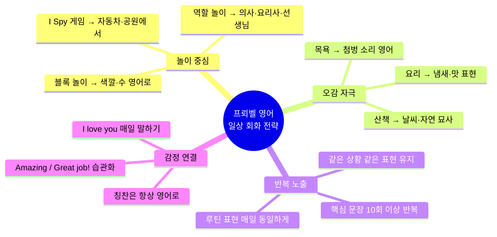

### 🔁 매일 반드시 사용할 프뢰벨 영어 TOP 20

| 순위 | 표현 | 사용 상황 | 한국어 의미 |
|-----|------|----------|------------|
| 1 | `I love you!` | 하루 종일 | 사랑해! |
| 2 | `Good morning!` | 기상 시 | 좋은 아침! |
| 3 | `Good night!` | 취침 시 | 잘 자! |
| 4 | `Great job!` | 칭찬 시 | 잘했어! |
| 5 | `Well done!` | 칭찬 시 | 훌륭해! |
| 6 | `Let's go!` | 이동 시 | 가자! |
| 7 | `Come on!` | 재촉 시 | 어서! |
| 8 | `Be careful!` | 위험 시 | 조심해! |
| 9 | `What do you see?` | 관찰 유도 | 뭐가 보여? |
| 10 | `Time to~!` | 루틴 전환 | ~할 시간이야! |
| 11 | `All done!` | 완료 시 | 다 됐어! |
| 12 | `You're so smart!` | 칭찬 시 | 정말 똑똑해! |
| 13 | `Can you help me?` | 참여 유도 | 도와줄 수 있어? |
| 14 | `How was your day?` | 저녁 대화 | 오늘 어땠어? |
| 15 | `What do you want?` | 선택 존중 | 뭐 원해? |
| 16 | `Sweet dreams!` | 취침 시 | 좋은 꿈 꿔! |
| 17 | `High five!` | 성취 시 | 하이파이브! |
| 18 | `I'm proud of you!` | 칭찬 시 | 자랑스러워! |
| 19 | `Let's count!` | 수 세기 | 같이 세자! |
| 20 | `What sound does it make?` | 동물·사물 | 무슨 소리 내? |

---

> ### 🎯 부모님께 드리는 마지막 조언
>
> | 원칙 | 실천 방법 |
> |------|----------|
> | **완벽하지 않아도 됩니다** | 발음이 틀려도 OK — 계속 말해주는 것이 핵심 |
> | **루틴이 최고의 교재** | 매일 같은 상황에서 같은 표현 반복 |
> | **칭찬은 과하게** | `Amazing! / Wonderful! / I'm so proud!` |
> | **아이 반응을 기다려 주세요** | 질문 후 5~10초 기다리기 |
> | **프뢰벨 정신** | 놀이가 곧 학습 — 즐거움 속에서 영어 습득 |
