# 🧠 영어 단계별 학습 전략
## 직독직해 · 청크 읽기 · 듣기/말하기 중심 수업 설계 가이드

> **대상:** 초·중·고등학생 | **작성일:** 2026-04-09  
> **핵심 방향:** 해석(번역) 위주 → 직독직해 → 청크 인식 → 문해력 향상의 단계적 전환

---

## 📌 목차

1. [왜 듣기/말하기 중심으로 시작해야 하는가?](#1-왜-듣기말하기-중심으로-시작해야-하는가)
2. [해석 위주 학습의 문제점](#2-해석-위주-학습의-문제점)
3. [직독직해란 무엇인가?](#3-직독직해란-무엇인가)
4. [청크(Chunk) 단위 읽기/말하기](#4-청크chunk-단위-읽기말하기)
5. [단계별 영어 학습 전략 로드맵](#5-단계별-영어-학습-전략-로드맵)
6. [수업 설계 모델 (실전 예시)](#6-수업-설계-모델-실전-예시)
7. [학년별 전략 비교표](#7-학년별-전략-비교표)
8. [문해력 향상 단계](#8-문해력-향상-단계)
9. [평가 방법](#9-평가-방법)

---

## 1. 왜 듣기/말하기 중심으로 시작해야 하는가?

### 🔬 언어 습득 이론 근거

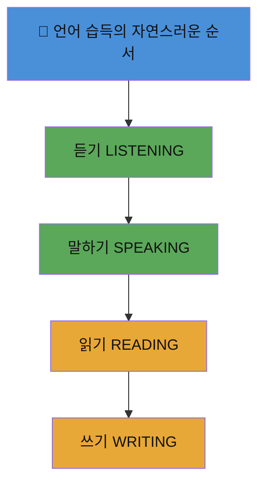

> 📖 **Krashen의 입력 가설 (Input Hypothesis):**  
> 언어 습득은 *이해 가능한 입력 (i+1)* 을 충분히 받을 때 자연스럽게 일어난다.  
> 모국어를 배울 때도 아이는 먼저 **수천 시간 듣고** 나서 말하기 시작한다.

---

### 📊 듣기/말하기 먼저 해야 하는 5가지 이유

| # | 이유 | 근거 | 실전 효과 |
|---|------|------|-----------|
| 1 | **뇌의 언어 처리 방식** | 음운 인식 → 의미 처리 순서 | 소리-의미 연결 자동화 |
| 2 | **발음/억양 체화** | 어릴수록 소리 모방 능력 우수 | 원어민에 가까운 발음 형성 |
| 3 | **불안감 감소** | 말하기 → 읽기 순서가 심리적 안정 | 영어 공포증 예방 |
| 4 | **문장 패턴 내면화** | 반복 청취로 문법 직관 형성 | 문법 규칙 암기 없이 습득 |
| 5 | **실제 의사소통 목적 부합** | 영어의 1차 기능은 소통 | 영어를 도구로 인식 |

---

### 🎯 실전 예시: "듣기 먼저" 수업 활동

```
📱 수업 시나리오 (초등 3-4학년, 15분)
━━━━━━━━━━━━━━━━━━━━━━━━━━━━━━━━━━━━━━━━━━━━━
Step 1 (3분): 영상 클립 시청 (자막 없음)
  → "What did you hear? 들린 단어 손들기!"

Step 2 (5분): 핵심 구문 반복 청취 + 따라 말하기
  → "I want to go to the park."
  → 리듬/억양 그대로 흉내내기

Step 3 (5분): 짝과 대화 연습
  → A: "Where do you want to go?"
  → B: "I want to go to ___."

Step 4 (2분): 소감 나누기 (한국어 허용)
━━━━━━━━━━━━━━━━━━━━━━━━━━━━━━━━━━━━━━━━━━━━━
```

---

## 2. 해석 위주 학습의 문제점

### 🔴 전통적 해석식 학습의 문제점 흐름도

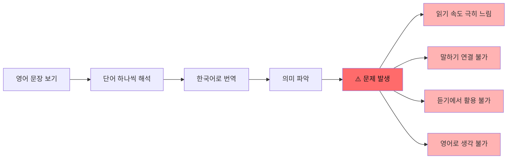

---

### 📊 해석식 vs. 직독직해식 비교

| 비교 항목 | 해석(번역) 위주 | 직독직해 방식 |
|-----------|----------------|--------------|
| **읽기 방향** | 끝에서 앞으로 (역방향) | 앞에서 끝으로 (정방향) |
| **처리 단위** | 단어 하나씩 | 의미 덩어리(청크) |
| **두뇌 처리** | 영어→한국어 번역 | 영어→직접 이미지/의미 |
| **속도** | 느림 (번역 시간 필요) | 빠름 (즉각 이해) |
| **말하기 연결** | ❌ 연결 안 됨 | ✅ 바로 연결 가능 |
| **듣기 활용** | ❌ 실시간 불가 | ✅ 실시간 처리 가능 |
| **장기 문해력** | 낮음 | 높음 |

---

### 🚫 해석식 학습의 실전 문제 사례

```
❌ 해석식 학습 예시:
문장: "The dog that my friend gave me ran away yesterday."

학생의 처리 과정:
1. "yesterday" = 어제
2. "ran away" = 도망갔다
3. "gave me" = 나에게 줬다
4. "my friend" = 내 친구
5. "The dog" = 그 개
→ 조합: "어제 내 친구가 나에게 준 그 개가 도망갔다."
⏱️ 처리 시간: 약 15~20초

✅ 직독직해 예시:
The dog / that my friend gave me / ran away / yesterday.
그 개 / 내 친구가 나에게 준 / 도망갔다 / 어제
⏱️ 처리 시간: 약 3~4초
```

---

## 3. 직독직해란 무엇인가?

### 📖 직독직해 개념 마인드맵

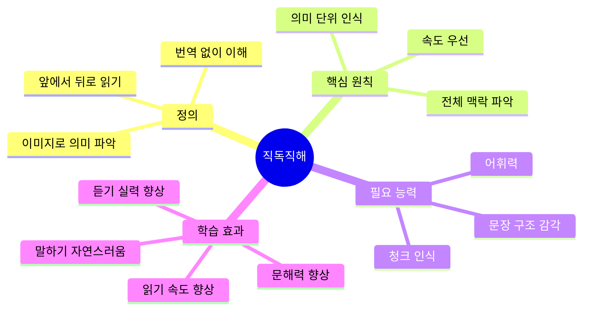

---

### 🔄 직독직해 처리 방식

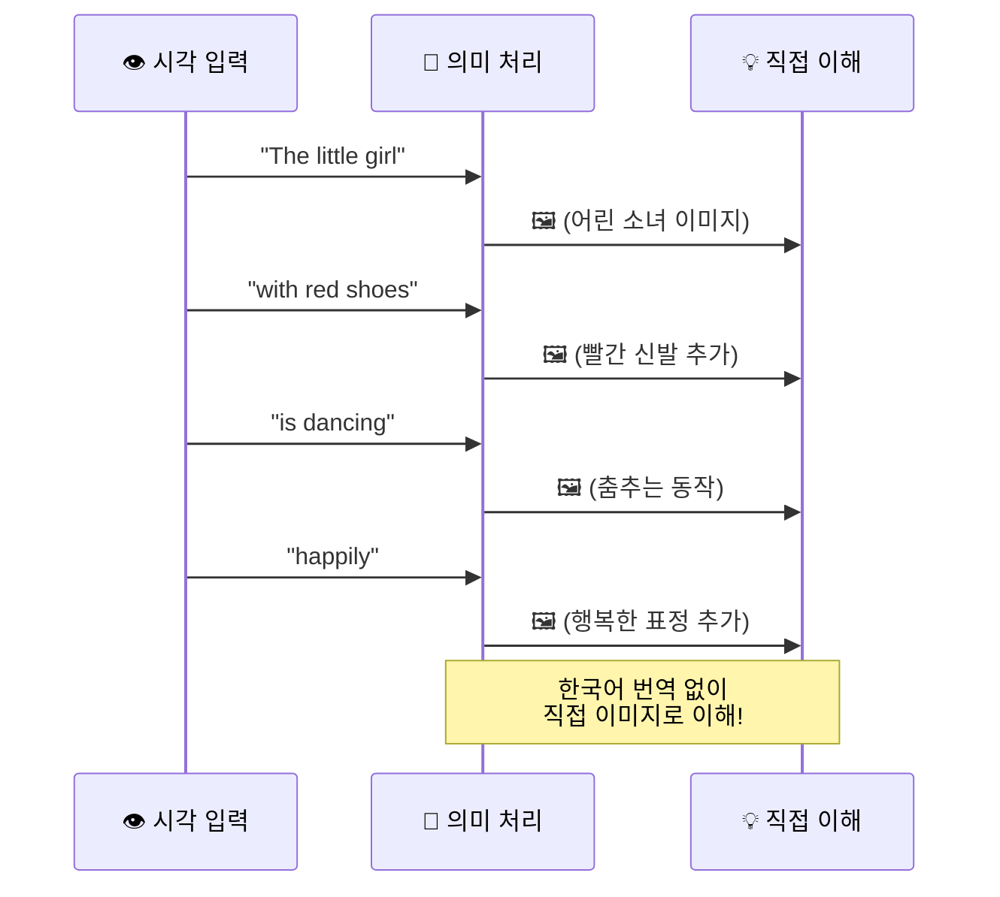

---

### 🎯 실전 예시: 직독직해 훈련 문장

```
레벨 1 (초등 저학년)
━━━━━━━━━━━━━━━━━━━━━━━━━━━━━━━━━━━━━━━━━
원문: I have a big red apple.
청크: I have / a big red apple.
직독: 나는 가지고 있다 / 크고 빨간 사과를.
🖼️ 이미지: [나] → [가진다] → [🍎큰 빨간 사과]

레벨 2 (초등 고학년)
━━━━━━━━━━━━━━━━━━━━━━━━━━━━━━━━━━━━━━━━━
원문: My mom cooks delicious food every Sunday.
청크: My mom / cooks delicious food / every Sunday.
직독: 우리 엄마는 / 맛있는 음식을 요리한다 / 매주 일요일마다.
🖼️ 이미지: [엄마] → [요리] → [맛있는 음식] → [매주 일요일]

레벨 3 (중학생)
━━━━━━━━━━━━━━━━━━━━━━━━━━━━━━━━━━━━━━━━━
원문: The book that she recommended to me last week was really interesting.
청크: The book / that she recommended to me / last week / was really interesting.
직독: 그 책 / 그녀가 나에게 추천한 / 지난주에 / 정말 흥미로웠다.

레벨 4 (고등학생)
━━━━━━━━━━━━━━━━━━━━━━━━━━━━━━━━━━━━━━━━━
원문: Having spent years abroad, she could speak three languages fluently without any hesitation.
청크: Having spent years abroad, / she could speak / three languages / fluently / without any hesitation.
직독: 해외에서 수년을 보낸 덕에, / 그녀는 말할 수 있었다 / 세 가지 언어를 / 유창하게 / 아무런 망설임 없이.
```

---

## 4. 청크(Chunk) 단위 읽기/말하기

### 🧩 청크란 무엇인가?

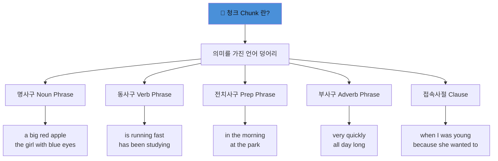

---

### 📊 청크 유형별 실전 예시표

| 청크 유형 | 예시 | 의미 | 활용 문장 |
|-----------|------|------|-----------|
| **명사구** | the tall boy | 키 큰 소년 | **The tall boy** plays soccer. |
| **동사구** | is reading a book | 책을 읽고 있다 | She **is reading a book**. |
| **전치사구** | in the library | 도서관에서 | He studies **in the library**. |
| **시간 표현** | every morning | 매일 아침 | I run **every morning**. |
| **이유 절** | because it was cold | 추웠기 때문에 | She wore a coat **because it was cold**. |
| **조건 절** | if you study hard | 열심히 공부하면 | **If you study hard**, you'll succeed. |

---

### 🎙️ 청크 단위 말하기 훈련법

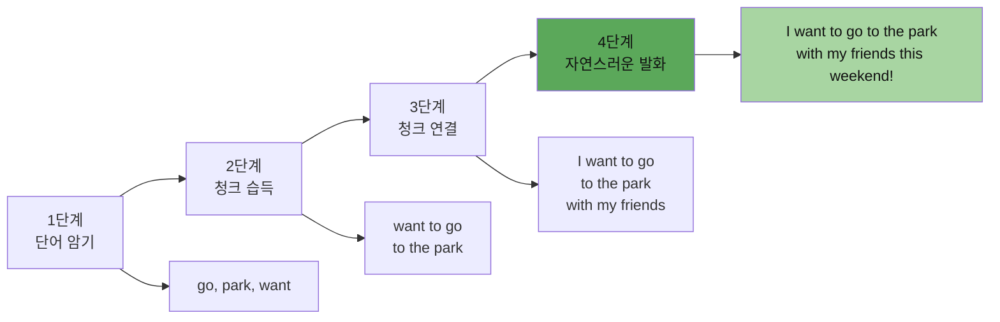

---

### 🎯 실전 예시: 청크 빌딩 (Chunk Building) 수업

```
📌 수업명: "청크 레고 쌓기" (중학교 1학년)
━━━━━━━━━━━━━━━━━━━━━━━━━━━━━━━━━━━━━━━━━━━━━━━━━━━━━━━━

🎯 목표: "나는 지난 여름에 친구들과 제주도에 여행을 갔다."를
         영어 청크로 조합하여 말하기

📦 청크 카드 배부:
  [I went]  [to Jeju Island]  [with my friends]  [last summer]

활동 1 (개인): 카드를 문법적으로 올바른 순서로 배열
  → I went / to Jeju Island / with my friends / last summer.

활동 2 (짝): 청크를 하나씩 추가하며 말하기 (누적 반복)
  → "I went."
  → "I went to Jeju Island."
  → "I went to Jeju Island with my friends."
  → "I went to Jeju Island with my friends last summer."

활동 3 (확장): 각자의 경험으로 청크 바꿔 말하기
  → I went to [장소] with [누구] last [시간].

━━━━━━━━━━━━━━━━━━━━━━━━━━━━━━━━━━━━━━━━━━━━━━━━━━━━━━━━
```

---

### 🔊 청크 단위 듣기 훈련법

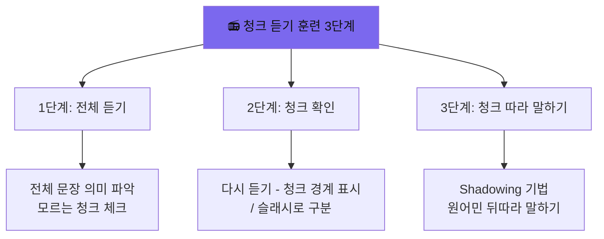

**Shadowing 실전 예시 (고등학생 수준):**

```
원본 음성: "The scientists / who discovered / the new planet / 
           announced / their findings / at the conference."

학생 따라 말하기:
  ① 전체 듣기 (의미 파악)
  ② 청크별 반복: "The scientists" → [따라하기] ✓
  ③ 청크별 반복: "who discovered" → [따라하기] ✓
  ④ 청크별 반복: "the new planet" → [따라하기] ✓
  ⑤ 누적: "The scientists who discovered the new planet" → [따라하기] ✓
  ⑥ 전체 문장 동시 따라 말하기 (Shadowing)
```

---

## 5. 단계별 영어 학습 전략 로드맵

### 🗺️ 전체 로드맵

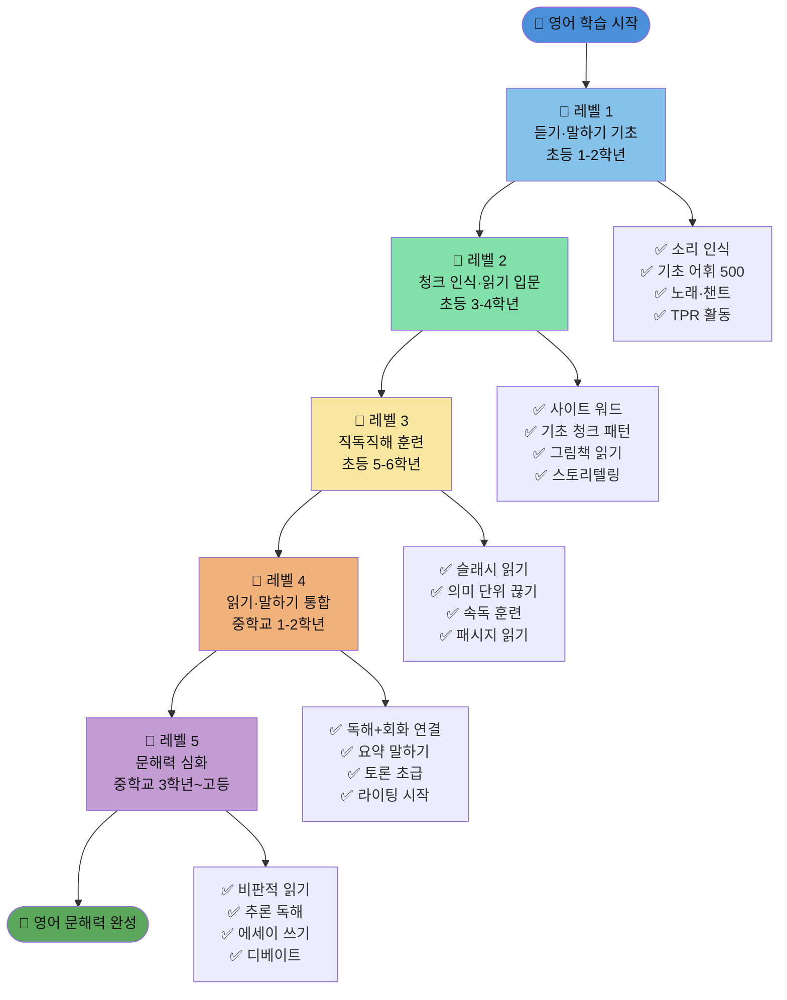

---

## 6. 수업 설계 모델 (실전 예시)

### 🏫 수업 모델 1: 초등 2학년 (듣기/말하기 중심)

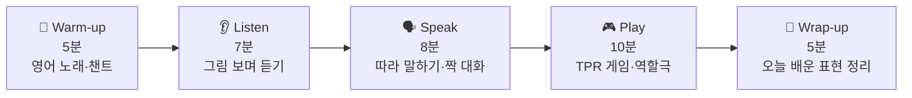

**수업 상세 계획:**

```
📌 주제: 음식 주문하기 "What would you like?"
━━━━━━━━━━━━━━━━━━━━━━━━━━━━━━━━━━━━━━━━━━━━━━━━━

🎵 Warm-up (5분)
  - "Do You Like Broccoli Ice Cream?" 노래 시청 + 따라 부르기
  - 핵심 어휘 미리 노출: like, pizza, sandwich, juice

👂 Listen (7분)
  - 레스토랑 주문 영상 2회 시청 (자막 없음)
  - 1회: 전체 상황 파악
  - 2회: 핵심 표현 찾기
  → "What would you like?" / "I'd like a pizza, please."

🗣️ Speak (8분)
  - 교사 → 학생 따라 말하기 (억양·리듬 강조)
  - 짝 대화 연습:
    A: "What would you like?"
    B: "I'd like a [그림 카드 선택], please."

🎮 Play (10분)
  - "레스토랑 역할극" 활동
  - 메뉴판 카드 활용 실제 주문 대화

📝 Wrap-up (5분)
  - 오늘 배운 표현 1개씩 말하기
  - 스티커 보상 + 다음 수업 예고
━━━━━━━━━━━━━━━━━━━━━━━━━━━━━━━━━━━━━━━━━━━━━━━━━
```

---

### 🏫 수업 모델 2: 초등 5학년 (직독직해 입문)

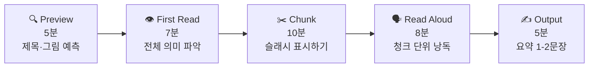

**슬래시 읽기 실전 예시:**

```
📌 원문 (교과서 지문):
"Last weekend, I visited my grandparents in the countryside.
We walked along the river and caught some fish.
In the evening, we had a big dinner together."

📌 슬래시 표시 훈련:
Last weekend, / I visited / my grandparents / in the countryside. /
We walked / along the river / and caught / some fish. /
In the evening, / we had / a big dinner / together.

📌 직독 연습 (한국어 대응):
Last weekend, → 지난 주말에,
I visited → 나는 방문했다
my grandparents → 나의 조부모님을
in the countryside. → 시골에 있는.

📌 학생 활동:
1. 혼자서 슬래시 표시해 보기
2. 짝과 비교하고 토론
3. 청크 단위로 소리 내어 읽기
```

---

### 🏫 수업 모델 3: 중학교 2학년 (읽기·말하기 통합)

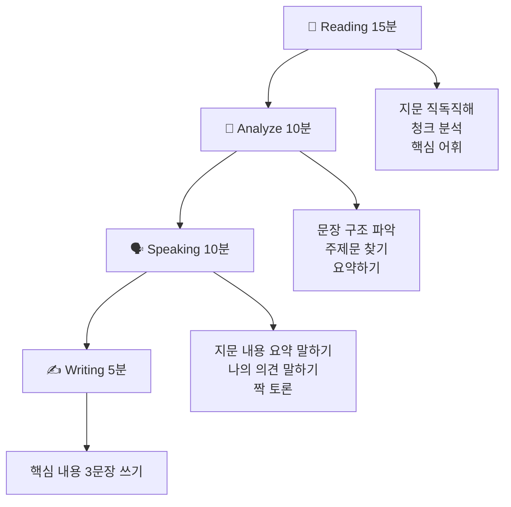

**통합 수업 실전 예시:**

```
📌 지문: 환경 보호 관련 영어 기사 (150단어 수준)

"Plastic pollution is one of the biggest problems / 
facing our oceans today. / Every year, / millions of tons of plastic /
enter the sea, / harming marine life / and damaging ecosystems."

【읽기 활동】
  ① 전체 읽기 (2분): 대략적 의미 파악
  ② 청크 표시 (3분): / 슬래시로 의미 단위 구분
  ③ 직독직해 (5분): 번역 없이 이미지로 이해
  ④ 모르는 어휘 체크 (2분): 문맥으로 추론 먼저

【말하기 활동】
  "지문을 덮고" 기억나는 내용 말하기
  → "The passage is about... It says that..."
  → 짝에게 내용 설명하기 (30초)

【쓰기 활동】
  핵심 내용 3문장으로 요약:
  "This article talks about plastic pollution in oceans.
   Every year, millions of tons of plastic go into the sea.
   This harms fish and destroys the environment."
```

---

### 🏫 수업 모델 4: 고등학교 (문해력 심화)

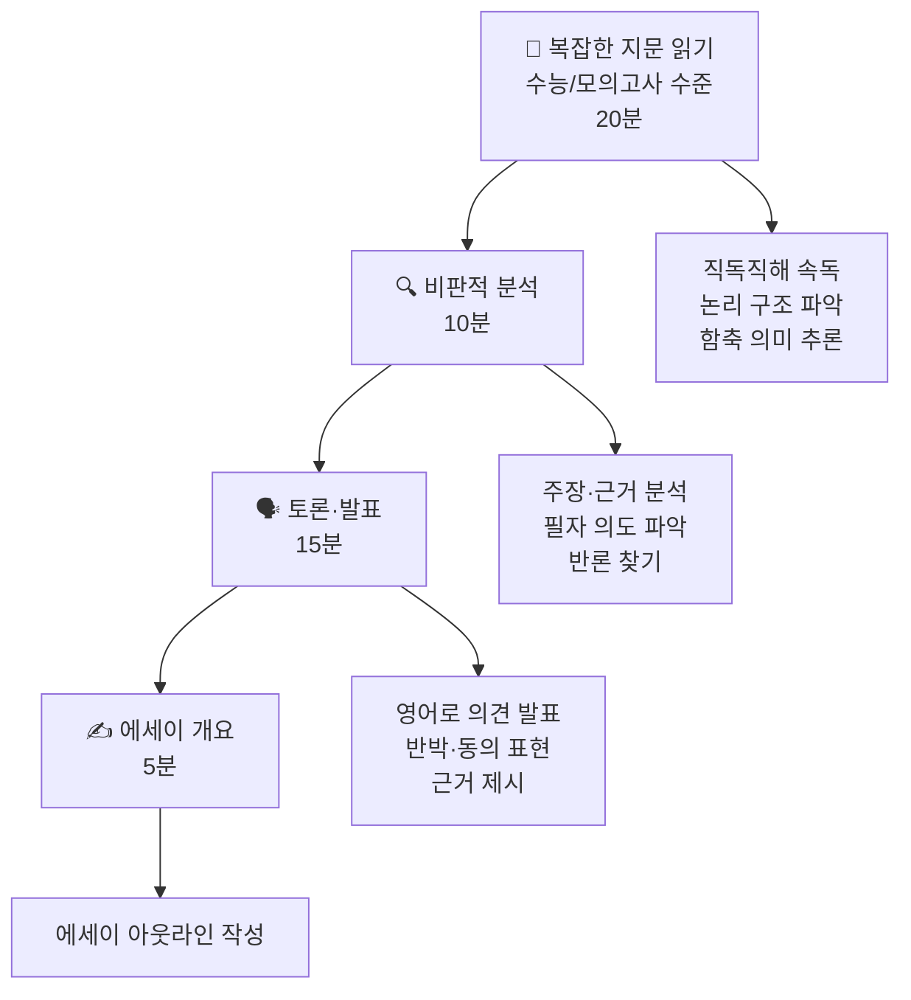

---

## 7. 학년별 전략 비교표

### 📊 학년별 핵심 전략 한눈에 보기

| 학년 | 핵심 방법 | 읽기 | 듣기 | 말하기 | 쓰기 | 주요 활동 |
|------|-----------|------|------|--------|------|-----------|
| **초1-2** | 듣기·말하기 몰입 | ⭐ | ⭐⭐⭐⭐⭐ | ⭐⭐⭐⭐ | ❌ | 노래, TPR, 챈트 |
| **초3-4** | 청크 인식 시작 | ⭐⭐ | ⭐⭐⭐⭐ | ⭐⭐⭐⭐ | ⭐ | 그림책, 패턴 연습 |
| **초5-6** | 직독직해 입문 | ⭐⭐⭐ | ⭐⭐⭐ | ⭐⭐⭐ | ⭐⭐ | 슬래시 읽기, 낭독 |
| **중1-2** | 읽기·말하기 통합 | ⭐⭐⭐⭐ | ⭐⭐⭐ | ⭐⭐⭐ | ⭐⭐⭐ | 요약, 토론, 독해 |
| **중3** | 문해력 심화 시작 | ⭐⭐⭐⭐ | ⭐⭐⭐ | ⭐⭐⭐ | ⭐⭐⭐⭐ | 추론, 에세이 초급 |
| **고1-3** | 통합 문해력 | ⭐⭐⭐⭐⭐ | ⭐⭐⭐ | ⭐⭐⭐ | ⭐⭐⭐⭐⭐ | 비판적 읽기, 에세이 |

---

### 📊 어휘 학습 전략 비교

| 방법 | 설명 | 추천 학년 | 효과 | 단점 |
|------|------|-----------|------|------|
| **단어장 암기** | 단어-뜻 1:1 암기 | 전 학년 (보조) | 빠른 어휘 확보 | 문맥 이해 부족 |
| **청크 어휘** | 구 단위로 암기 | 초3 이상 | 실제 사용 용이 | 시간 소요 |
| **독서 어휘** | 읽기 중 자연 습득 | 초5 이상 | 장기 기억 | 초기 어휘 부족 |
| **TPR 어휘** | 동작으로 의미 연결 | 초1-4 | 체화, 재미 | 추상어 한계 |
| **문맥 추론** | 전후 문맥으로 파악 | 중학생 이상 | 고급 읽기 능력 | 오독 가능성 |

---

## 8. 문해력 향상 단계

### 📈 문해력 발달 단계 모델

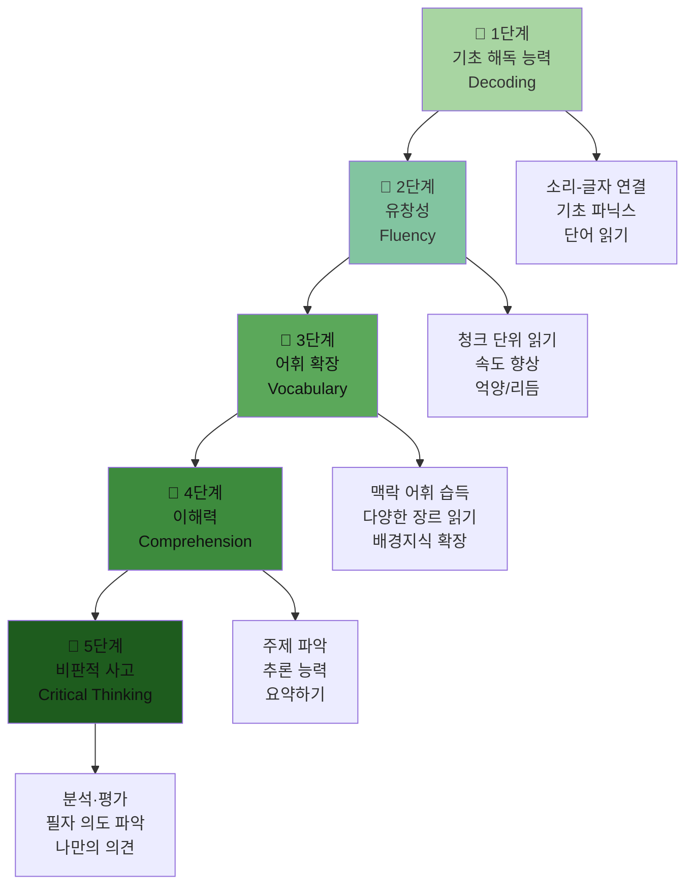

---

### 📊 문해력 향상을 위한 읽기 유형별 전략

| 읽기 유형 | 목적 | 방법 | 적용 학년 | 실전 예시 |
|-----------|------|------|-----------|-----------|
| **다독 (Extensive Reading)** | 유창성·어휘 확장 | 쉬운 책 많이 읽기 | 초3 이상 | 영어 그림책 30권/학기 |
| **정독 (Intensive Reading)** | 정확한 이해 | 한 지문 깊이 분석 | 초5 이상 | 교과서 지문 청크 분석 |
| **속독 (Skimming)** | 전체 주제 파악 | 핵심어 중심 훑기 | 중학생 이상 | 기사 제목+첫 문장만 |
| **선택적 읽기 (Scanning)** | 특정 정보 탐색 | 목표 정보만 찾기 | 중학생 이상 | 시간표에서 시간 찾기 |
| **비판적 읽기 (Critical)** | 평가·분석 | 주장·근거 검토 | 고등학생 | 사설·논설문 분석 |

---

### 🎯 실전 예시: 문해력 향상 프로젝트 수업 (중학교 3학년)

```
📌 프로젝트명: "나의 환경 영어 뉴스 만들기"
━━━━━━━━━━━━━━━━━━━━━━━━━━━━━━━━━━━━━━━━━━━━━━━━━━━━━━━━

📅 3주 프로젝트 구성:

Week 1: 읽기 (문해력 기반 다지기)
  - 환경 관련 영어 기사 3편 직독직해
  - 청크 분석표 작성
  - 핵심 어휘 20개 청크로 습득
  ✏️ 산출물: 지문 청크 분석 노트

Week 2: 말하기 (내용 재구성)
  - 기사 내용 1분 스피치 (영어)
  - 짝과 토론: "가장 심각한 환경 문제는?"
  - 녹음하여 자기 평가
  ✏️ 산출물: 스피치 스크립트 + 녹음 파일

Week 3: 쓰기 (문해력 통합 표현)
  - 나만의 환경 뉴스 기사 작성 (150단어)
  - 청크 구조로 문장 완성
  - 반 전체 발표 & 피드백
  ✏️ 산출물: 나만의 영어 뉴스 기사

━━━━━━━━━━━━━━━━━━━━━━━━━━━━━━━━━━━━━━━━━━━━━━━━━━━━━━━━
🎯 평가 기준:
  - 직독직해 정확도: 30%
  - 청크 활용 말하기: 30%
  - 에세이 구조·내용: 40%
━━━━━━━━━━━━━━━━━━━━━━━━━━━━━━━━━━━━━━━━━━━━━━━━━━━━━━━━
```

---

## 9. 평가 방법

### 📋 단계별 평가 방법

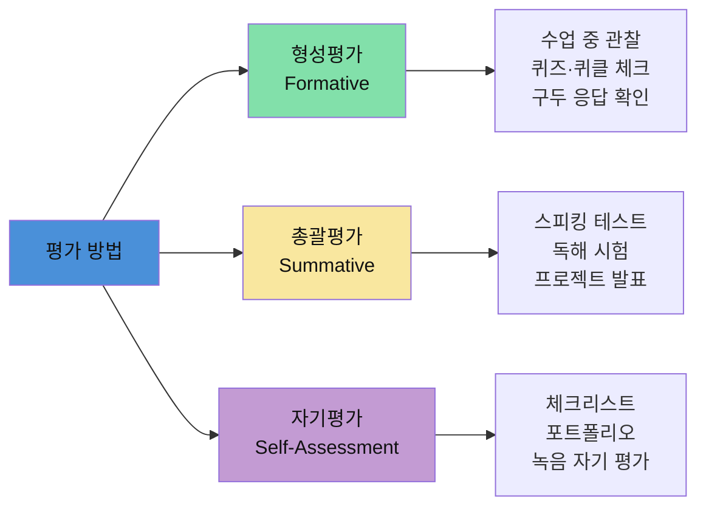

---

### 📊 직독직해 능력 평가 루브릭

| 평가 항목 | 4점 (우수) | 3점 (양호) | 2점 (보통) | 1점 (미흡) |
|-----------|-----------|-----------|-----------|-----------|
| **청크 인식** | 모든 의미 단위 정확히 구분 | 대부분 정확히 구분 | 일부 오류 있음 | 구분 어려움 |
| **읽기 속도** | 분당 130단어 이상 | 100-130단어 | 70-100단어 | 70단어 미만 |
| **이해 정확도** | 90% 이상 이해 | 70-90% 이해 | 50-70% 이해 | 50% 미만 |
| **번역 의존도** | 번역 없이 이해 | 거의 번역 안 함 | 가끔 번역 | 항상 번역 필요 |
| **말하기 연결** | 읽고 바로 말하기 가능 | 약간의 준비 필요 | 많은 준비 필요 | 연결 어려움 |

---

### 📊 청크 말하기 평가 기준

| 평가 항목 | 기준 | 평가 방법 |
|-----------|------|-----------|
| **정확성** | 문법·어휘 오류 없이 청크 사용 | 교사 관찰, 녹음 |
| **유창성** | 자연스러운 속도와 리듬 | 녹음 자기 평가 |
| **청크 활용** | 적절한 청크 조합 능력 | 구두 발표 |
| **의사소통** | 의미 전달 성공 여부 | 짝 활동 평가 |
| **자신감** | 두려움 없이 말하기 시도 | 참여도 관찰 |

---

## 🎯 핵심 정리: 교사를 위한 실천 가이드

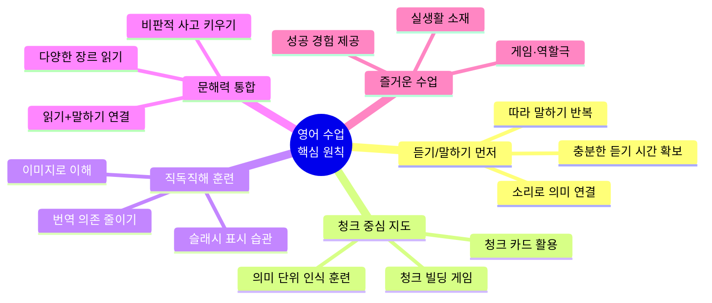

---

### 📌 교사 체크리스트

```
✅ 수업 시작 전
  □ 오늘 수업의 핵심 청크/표현 3개 선정
  □ 듣기 자료 준비 (영상/오디오)
  □ 말하기 활동 설계 (짝/그룹 활동 포함)

✅ 수업 중
  □ 읽기 전: 듣기로 먼저 노출
  □ 번역 지양: 이미지/제스처 활용 설명
  □ 청크 단위 판서 (슬래시 표시)
  □ 학생 발화 기회 최대화 (교사 50% 이하)

✅ 수업 후
  □ 오늘 배운 청크 복습 기회 제공
  □ 가정 학습 연계 (청크 따라 말하기 숙제)
  □ 다음 수업 입력 자료 연결
```

---

> 📚 **참고 이론 및 접근법**
> - Stephen Krashen의 입력 가설 (Input Hypothesis)
> - Jim Cummin의 언어 능력 이론 (BICS/CALP)
> - Paul Nation의 어휘 학습 이론
> - Nation & Newton의 청크 기반 언어 교육
> - Michael Lewis의 어휘적 접근법 (Lexical Approach)

---

*이 자료는 초·중·고등학생 대상 AI 영어 교육 컨텐츠 개발자를 위한 가이드입니다.*  
*2026-04-09 작성 | 한국어 영어 교육 연구 기반*
