# 🌱 영어 전연령 단계별 학습 전략 종합 가이드
## 유아 · 초등 · 중등 · 고등 · 일반 — 영어 정서부터 문해력까지

> **작성일:** 2026-04-09  
> **핵심 철학:** 모국어처럼 — 소리 → 말하기 → 읽기 → 쓰기의 자연스러운 흐름  
> **특별 강조:** 유아기(0~7세)는 영어 습득의 황금기이자 정서적 기반 형성 시기

---

## 📌 전체 목차

| # | 섹션 | 대상 |
|---|------|------|
| 0 | [전체 로드맵 한눈에 보기](#0-전체-로드맵) | 전 연령 |
| **1** | **[유아기 영어 전략 (0~7세)](#1-유아기-영어-전략-07세)** | **★ 핵심 섹션** |
| 2 | [초등 영어 전략 (8~13세)](#2-초등-영어-전략-813세) | 초1~6 |
| 3 | [중등 영어 전략 (13~16세)](#3-중등-영어-전략-1316세) | 중1~3 |
| 4 | [고등 영어 전략 (16~19세)](#4-고등-영어-전략-1619세) | 고1~3 |
| 5 | [일반(성인) 영어 전략](#5-일반성인-영어-전략) | 성인 |
| 6 | [연령별 비교 종합표](#6-연령별-비교-종합표) | 전 연령 |

---

## 0. 전체 로드맵

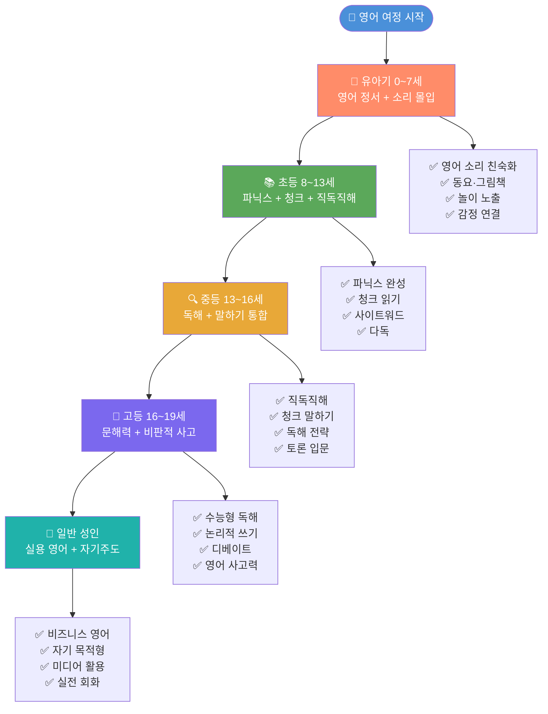

---

## 1. 유아기 영어 전략 (0~7세)

> ⭐ **황금기 원칙:** 유아기 뇌는 언어 흡수 스펀지.  
> 이 시기의 목표는 **"영어가 즐겁고 자연스러운 것"** 이라는 정서 형성이 1순위.  
> 문법·암기·테스트 ❌ → 소리·노래·놀이·그림책 ✅

---

### 1-1. 연령별 발달 단계와 영어 접근법

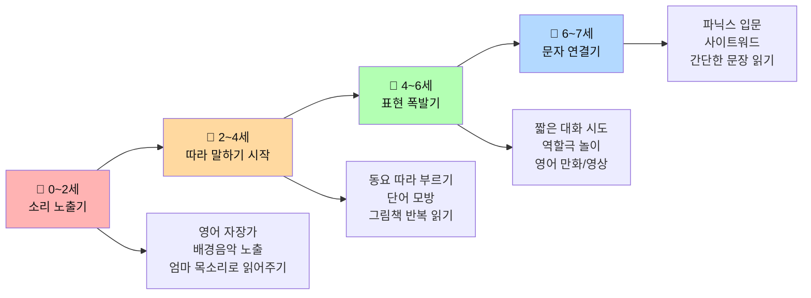

---

### 1-2. 영어 정서(Emotional Bond) 형성 — 가장 중요한 기반

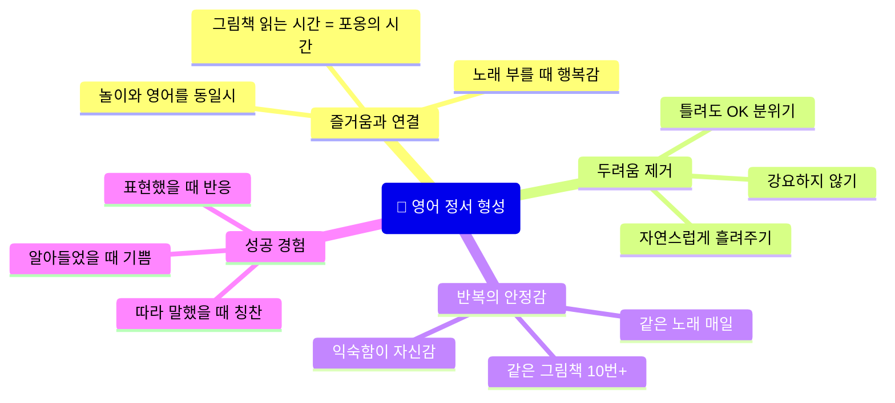

> **실전 팁:** 유아에게 영어는 **"엄마/아빠와 함께하는 특별한 시간"** 으로 기억되어야 합니다.  
> 영어 그림책을 읽어줄 때 스킨십과 함께, 동요를 부를 때 율동과 함께 — **감정과 언어를 묶어주세요.**

---

### 1-3. 하루 영어 노출 비중 & 일과표

#### 📊 연령별 하루 권장 영어 노출 시간

| 연령 | 하루 권장 시간 | 방식 | 강제성 |
|------|--------------|------|--------|
| 0~1세 | 20~30분 | 영어 자장가, 흘려듣기 | ❌ 완전 자연 노출 |
| 2~3세 | 30~45분 | 동요, 그림책, 영상 | ❌ 놀이처럼 |
| 4~5세 | 45~60분 | 동요+그림책+놀이 | △ 루틴화 권장 |
| 6~7세 | 60~90분 | 위 + 파닉스 + 영상 | △ 습관으로 |

---

#### 🕐 유아 하루 영어 노출 일과 예시 (4~6세 기준)

```mermaid
gantt
    title 🌞 유아 하루 영어 노출 일과표 (4~6세)
    dateFormat HH:mm
    axisFormat %H:%M

    section 아침
    영어 동요 틀어두기 (흘려듣기)   : 07:00, 30m
    아침 루틴 영어 표현              : 07:30, 10m

    section 오전 활동
    영어 그림책 읽기 (함께)          : 10:00, 20m
    영어 노래+율동 놀이              : 10:20, 15m

    section 낮
    영어 애니메이션 시청             : 14:00, 20m
    놀이 중 영어 표현 사용           : 14:30, 20m

    section 저녁
    파닉스 놀이 (6세 이상)           : 19:00, 15m
    잠자리 영어 그림책 읽기          : 20:30, 15m

    
```

---

#### 📋 하루 영어 루틴 상세 계획표

| 시간대 | 활동 | 구체적 내용 | 소요시간 |
|--------|------|------------|----------|
| **🌅 아침 기상** | 흘려듣기 | 영어 동요 CD/스트리밍 배경음악 | 30분 |
| **🍳 아침 식사** | 일상 영어 표현 | "Good morning! Are you hungry?" | 5~10분 |
| **🎮 오전 놀이** | 그림책 읽기 | 같은 책 반복 + 손가락 짚으며 | 15~20분 |
| **🎵 오전 중반** | 동요+율동 | "Head, Shoulders, Knees and Toes" 등 | 10~15분 |
| **😴 낮잠 전** | 흘려듣기 | 영어 오디오북/동요 | 20분 |
| **📺 오후** | 영어 영상 | 페파 피그, Bluey 등 (자막 없음) | 20~30분 |
| **🧩 오후 놀이** | 놀이 영어 | 블록, 인형놀이 중 영어 표현 삽입 | 20분 |
| **🍽️ 저녁 식사** | 일상 표현 | "What did you do today?" | 5분 |
| **📖 잠자리** | 그림책 읽기 | 부드러운 목소리로 읽어주기 | 15~20분 |
| **합계** | | | **약 140~160분** |

---

### 1-4. 영어 4대 영역별 유아 접근법

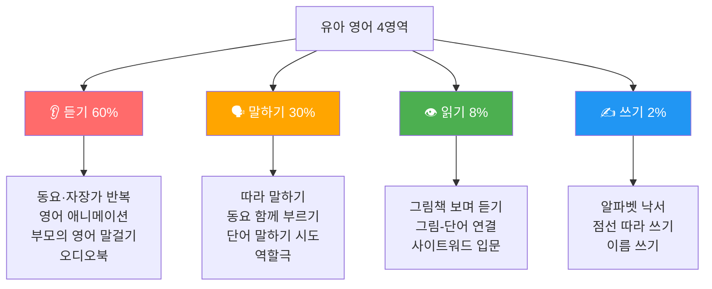

> **⚠️ 핵심:** 유아기에는 **듣기 60%, 말하기 30%** 가 기본 원칙.  
> 읽기·쓰기는 강요하지 않고, 흥미가 생길 때 자연스럽게 시작.

---

### 1-5. 영어 동요 활용법 (Songs & Chants)

#### 🎵 연령별 추천 영어 동요 & 활용법

| 연령 | 추천 동요 | 핵심 표현 | 활동 방법 |
|------|-----------|-----------|-----------|
| **0~2세** | Twinkle Twinkle Little Star | star, up, above | 흔들며 자장가로 |
| **0~2세** | Wheels on the Bus | go round, up and down | 몸 흔들기 |
| **2~4세** | Head, Shoulders, Knees and Toes | 신체 부위 | 신체 부위 짚기 |
| **2~4세** | If You're Happy | happy, clap, stomp | 행동 따라하기 |
| **3~5세** | Old MacDonald Had a Farm | 동물 소리 | 동물 흉내내기 |
| **3~5세** | The Alphabet Song | A~Z | 알파벳 카드와 함께 |
| **4~6세** | Five Little Monkeys | numbers, falling | 손가락 접기 |
| **5~7세** | Let It Go (쉬운 버전) | 감정 표현 | 역할극 |

#### 🎶 동요 활용 3단계 방법

```
1단계 — 듣기 (Listen & Enjoy)
  → 처음 며칠: 그냥 틀어두기, 흘려듣기
  → 아이가 멜로디를 흥얼거리기 시작하면 성공!

2단계 — 따라 부르기 (Sing Along)
  → 율동 DVD/영상 함께 보며 따라 부르기
  → 단어 몰라도 OK — 소리 패턴 먼저!
  → 부모가 먼저 신나게 부르는 모습 보여주기

3단계 — 놀이로 확장 (Play & Use)
  → "Head, Shoulders" → 인형 신체 부위 짚기
  → "Old MacDonald" → 동물 장난감 꺼내서 놀기
  → "Five Little Monkeys" → 소파에서 뛰어내리며 놀기
```

---

### 1-6. 영어 그림책 읽기 전략

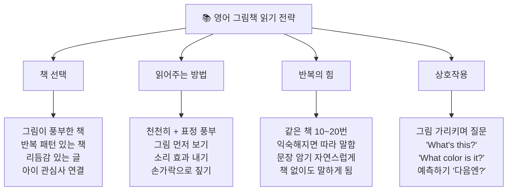

#### 📖 연령별 추천 영어 그림책

| 연령 | 책 제목 | 특징 | 핵심 표현 |
|------|---------|------|-----------|
| **0~2세** | *Goodnight Moon* | 반복 패턴, 부드러운 그림 | Good night, moon/stars |
| **0~2세** | *Brown Bear, Brown Bear* | 색깔+동물 반복 | What do you see? |
| **2~4세** | *The Very Hungry Caterpillar* | 숫자+음식+변화 | He ate through... |
| **2~4세** | *Where's Spot?* | 전치사 자연 습득 | Is he under/in/behind? |
| **3~5세** | *Pete the Cat* | 감정, 낙관적 태도 | I love my shoes! |
| **3~5세** | *Dragons Love Tacos* | 유머, 반복 | Dragons love tacos! |
| **4~6세** | *The Gruffalo* | 이야기 구조, 어휘 | A mouse took a walk... |
| **5~7세** | *Mo Willems: Pigeon Series* | 감정 표현, 대화 | I want to drive the bus! |
| **5~7세** | *Elephant & Piggie* | 대화체, 쉬운 어휘 | Gerald! Piggie! |

#### 📖 그림책 읽기 실전 예시 (Brown Bear, Brown Bear)

```
📌 책: "Brown Bear, Brown Bear, What Do You See?"

[읽기 전]
  → 표지 보며: "Look! It's a bear! What color is it?"
  → "Brown! Can you say brown?" 

[읽는 중]
  → 리듬감 살려 읽기: "Broooown Bear, Brown Bear..."
  → 페이지마다 그림 먼저 가리키며: "What do you see?"
  → 3번째 읽을 때부터: 일부러 멈추고 아이가 채우게
    "Brown bear, brown bear, what do you ___?" 
    → 아이: "SEE!!" 😄

[읽기 후]
  → 집 안 물건에 적용: "Red bird, red bird, what do you see?"
  → "I see a [빨간 사과] looking at me!"
  → 색깔 카드로 게임하기
```

---

### 1-7. 파닉스(Phonics) 접근법

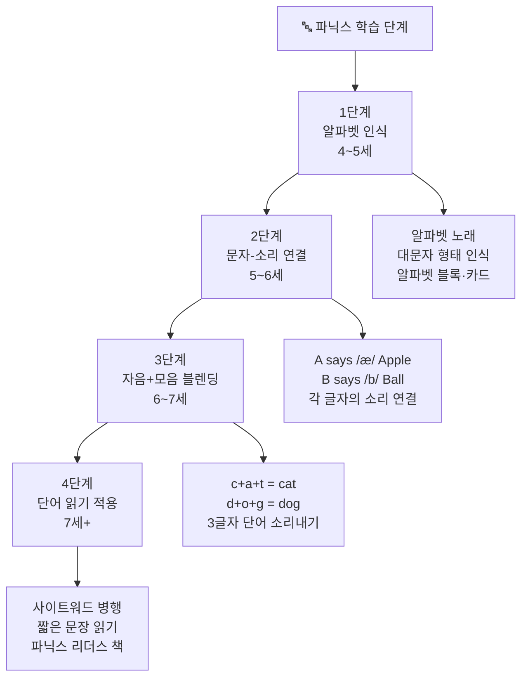

#### 🎮 파닉스 놀이 활동 6가지

```
① 알파벳 몸으로 만들기
  → 몸으로 S, T, O 모양 만들기
  → "This is S! /s/ /s/ Snake!"

② 소리 헌팅 (Sound Hunt)
  → "B 소리 나는 것 찾아라!"
  → Ball, Book, Bear, Banana 가져오기

③ 파닉스 스탬프 놀이
  → 알파벳 도장 + 스탬프 패드
  → "C" 도장 찍으며 "/k/ /k/ Cat!"

④ 모래 쓰기
  → 쟁반에 모래/소금 담기
  → 손가락으로 글자 쓰며 소리내기

⑤ 알파벳 낚시 게임
  → 자석 낚시 장난감에 알파벳 카드
  → 잡은 글자 소리 말하기

⑥ 파닉스 빙고
  → 그림 빙고 카드
  → 소리 듣고 그림 찾기 (dog, cat, hen...)
```

#### 📊 파닉스 단계별 학습 내용

| 단계 | 내용 | 예시 | 권장 연령 |
|------|------|------|----------|
| **Pre-Phonics** | 알파벳 이름·형태 | A B C D... | 4~5세 |
| **Phase 1** | 소리 인식 (음운 인식) | 박수 치며 음절 나누기 | 4~5세 |
| **Phase 2** | 초성 자음 소리 | s, a, t, p, i, n | 5~6세 |
| **Phase 3** | 모든 자음+이중자음 | sh, ch, th, ck | 5~6세 |
| **Phase 4** | 모음+자음 블렌딩 | cat, dog, big, hop | 6~7세 |
| **Phase 5** | 장모음·이중모음 | cake, beat, rain | 7세+ |
| **Phase 6** | 불규칙 단어+사이트워드 | was, the, said | 7세+ |

---

### 1-8. 이미지화 & 놀이 중심 영어 접근법

#### 🧠 영어-이미지 연결 원리

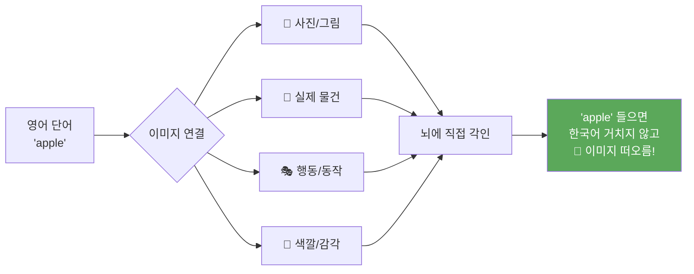

---

#### 🎮 이미지화 놀이 활동 목록

| 활동명 | 방법 | 학습 내용 | 연령 |
|--------|------|-----------|------|
| **실물 가리키기** | 집 안 물건에 영어 라벨 붙이기 | 생활 어휘 | 2세+ |
| **그림 카드 매칭** | 단어 카드 + 그림 카드 짝 맞추기 | 어휘-이미지 연결 | 3세+ |
| **TPR 활동** | "Jump! Run! Sit!" 몸으로 반응 | 동사 체득 | 2세+ |
| **역할극 (Pretend Play)** | 장보기, 의사놀이, 식당놀이를 영어로 | 실용 표현 | 3세+ |
| **색깔 분류 놀이** | 색깔별 장난감 모으며 "Red! Blue!" | 색깔 어휘 | 2세+ |
| **스토리 행동 놀이** | 그림책 내용 몸으로 연기 | 이야기 구조 | 4세+ |
| **영어 요리 놀이** | "Let's make a sandwich!" | 음식 어휘+순서 | 4세+ |
| **인형 영어 대화** | 인형에게 영어로 말걸기 | 말하기 연습 | 3세+ |

---

#### 🏠 집에서 하는 이미지화 환경 만들기

```
📌 공간별 영어 환경 조성

🛋️ 거실
  - 영어 알파벳 포스터 (눈높이)
  - 색깔·숫자 차트
  - 영어 그림책 바구니 (손 닿는 곳에)
  - TV: 영어 애니메이션 채널

🍽️ 주방/식탁
  - 음식 이름 영어 라벨
  - 식사 시간 영어 표현 카드
    "I'm hungry!" / "Yummy!" / "More please!"

🛁 욕실
  - 신체 부위 스티커 (영어)
  - 목욕 놀이 영어 표현
    "Wash your hands!" / "Hot / Cold"

🛏️ 침실
  - 잠자리 루틴 영어 표현 차트
  - 그림책 코너
  - 자장가 플레이리스트

🌳 야외
  - 자연물 가리키며 영어로
    "Tree! Flower! Bird! Cloud!"
  - 공원에서 "Let's run! Jump! Stop!"
```

---

### 1-9. 유아 영어 영상 & 미디어 활용 전략

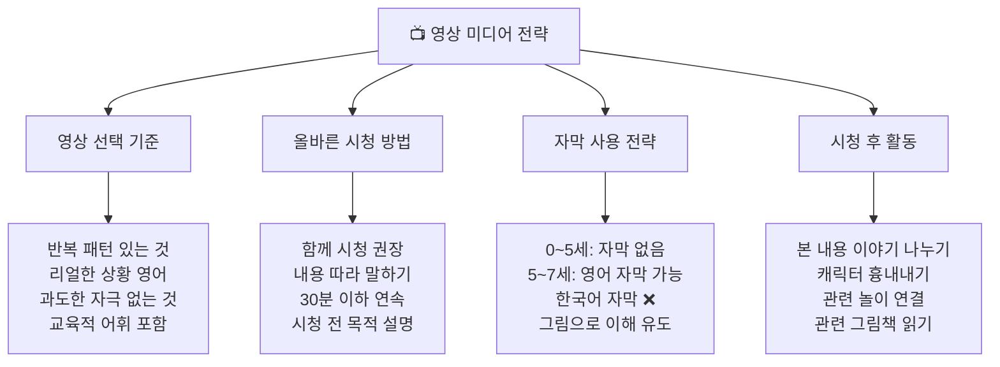

#### 📺 연령별 추천 영어 영상 콘텐츠

| 연령 | 제목 | 특징 | 학습 포인트 |
|------|------|------|-------------|
| **2~4세** | *Cocomelon* | 동요 + 일상 표현 | 생활 어휘, 가족 표현 |
| **2~4세** | *Bluey* | 자연스러운 호주 영어 | 놀이, 감정 표현 |
| **3~5세** | *Peppa Pig* | 느린 속도, 명확한 발음 | 일상 대화, 영국식 영어 |
| **3~5세** | *Dora the Explorer* | 스페인어 혼합, 참여 유도 | 반복 표현, 모험 어휘 |
| **4~6세** | *Paw Patrol* | 영웅 놀이, 직업 어휘 | 직업, 도움 표현 |
| **4~6세** | *Daniel Tiger* | 감정 표현, 사회성 | 감정 어휘, 일상 루틴 |
| **5~7세** | *Wild Kratts* | 동물, 자연 어휘 | 과학 어휘, 모험 표현 |
| **5~7세** | *Magic School Bus* | 과학 개념 | 학문 어휘, 질문 표현 |

---

### 1-10. 부모/교사를 위한 유아 영어 말걸기 (Daily English Talk)

#### 💬 시간대별 영어 표현 활용 가이드

```
🌅 아침 루틴 (Morning Routine)
━━━━━━━━━━━━━━━━━━━━━━━━━━━━━━━━━━━━━━━━━━━━━━━━━━━━━━━━
"Good morning! Did you sleep well?"
"Time to wake up, sunshine!"
"Let's wash your face."
"What do you want for breakfast?"
"Are you hungry?"
"Yummy! Do you like it?"
━━━━━━━━━━━━━━━━━━━━━━━━━━━━━━━━━━━━━━━━━━━━━━━━━━━━━━━━

🎮 놀이 시간 (Play Time)
━━━━━━━━━━━━━━━━━━━━━━━━━━━━━━━━━━━━━━━━━━━━━━━━━━━━━━━━
"What do you want to play?"
"Let's build a tower!"
"Uh oh! It fell down!"
"Good job! You did it!"
"Can I play with you?"
"Your turn! My turn!"
━━━━━━━━━━━━━━━━━━━━━━━━━━━━━━━━━━━━━━━━━━━━━━━━━━━━━━━━

🍽️ 식사 시간 (Mealtime)
━━━━━━━━━━━━━━━━━━━━━━━━━━━━━━━━━━━━━━━━━━━━━━━━━━━━━━━━
"Wash your hands first."
"Time to eat!"
"Open your mouth. Aah!"
"Is it hot? Be careful."
"More rice? More soup?"
"All done! Good eating!"
━━━━━━━━━━━━━━━━━━━━━━━━━━━━━━━━━━━━━━━━━━━━━━━━━━━━━━━━

🛁 목욕 시간 (Bath Time)
━━━━━━━━━━━━━━━━━━━━━━━━━━━━━━━━━━━━━━━━━━━━━━━━━━━━━━━━
"Bath time! Let's go!"
"Is the water warm?"
"Let's wash your hair."
"Rinse! Close your eyes."
"You're so clean now!"
━━━━━━━━━━━━━━━━━━━━━━━━━━━━━━━━━━━━━━━━━━━━━━━━━━━━━━━━

🌙 잠자리 루틴 (Bedtime Routine)
━━━━━━━━━━━━━━━━━━━━━━━━━━━━━━━━━━━━━━━━━━━━━━━━━━━━━━━━
"Time for bed."
"Let's read a book."
"Which book do you want?"
"Sweet dreams."
"I love you. Good night."
━━━━━━━━━━━━━━━━━━━━━━━━━━━━━━━━━━━━━━━━━━━━━━━━━━━━━━━━
```

---

### 1-11. 유아 영어 체크리스트 (발달 지표)

| 연령 | 체크 항목 | 달성 여부 |
|------|-----------|----------|
| **2세** | 영어 노래 멜로디 흥얼거리기 | □ |
| **2세** | 간단한 지시 이해 ("Sit down", "Come here") | □ |
| **3세** | 알고 있는 영어 단어 10개+ | □ |
| **3세** | 영어 그림책 보고 그림 가리키기 | □ |
| **4세** | 알파벳 노래 부르기 | □ |
| **4세** | 좋아하는 영어 동요 2개 이상 따라 부르기 | □ |
| **5세** | 알파벳 대문자 인식하기 | □ |
| **5세** | 간단한 영어 표현 말하기 ("I want~", "I like~") | □ |
| **6세** | 파닉스 기초 소리 (a, b, c...) 알기 | □ |
| **6세** | 간단한 단어 읽기 시도 (cat, dog, big) | □ |
| **7세** | 짧은 문장 읽기 ("I have a dog.") | □ |
| **7세** | 영어로 간단한 자기소개 가능 | □ |

---

## 2. 초등 영어 전략 (8~13세)

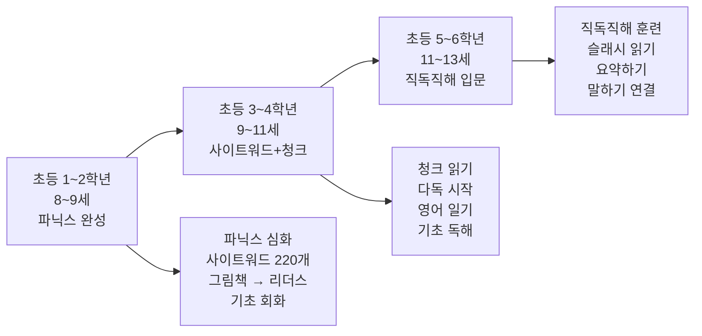

### 📊 초등 핵심 전략표

| 학년 | 핵심 목표 | 읽기 | 듣기 | 말하기 | 쓰기 | 주력 활동 |
|------|-----------|------|------|--------|------|-----------|
| 초1~2 | 파닉스 완성 | ⭐⭐ | ⭐⭐⭐⭐ | ⭐⭐⭐⭐ | ⭐ | 파닉스, 동요, 리더스 |
| 초3~4 | 청크 인식 | ⭐⭐⭐ | ⭐⭐⭐ | ⭐⭐⭐ | ⭐⭐ | 그림책, 패턴북, 다독 |
| 초5~6 | 직독직해 입문 | ⭐⭐⭐⭐ | ⭐⭐⭐ | ⭐⭐⭐ | ⭐⭐⭐ | 슬래시 읽기, 낭독 |

### 🎯 초등 실전 수업 예시: 청크 레고 쌓기 (초3~4)

```
📌 목표 문장: "I want to go to the park with my friends."

청크 카드 [I want to] [go to] [the park] [with my friends]

Step 1: 카드를 올바른 순서로 배열
Step 2: 하나씩 추가하며 말하기
  → "I want to"
  → "I want to go to the park"
  → "I want to go to the park with my friends."
Step 3: 자신의 경험으로 바꾸기
  → "I want to go to [내가 원하는 장소] with [누구]."
```

### 📖 사이트워드 (Sight Words) 학습 전략

| 단계 | 단어 수 | 대표 단어 | 학습법 |
|------|---------|-----------|--------|
| Dolch Pre-K | 40개 | a, the, I, is, in | 카드 플래시, 노래 |
| Dolch K | 52개 | all, am, at, ate | 빙고 게임 |
| Dolch 1st | 41개 | after, again, an | 문장 속 찾기 |
| Dolch 2nd | 46개 | always, around | 다독 중 자연 습득 |
| Fry 1~100 | 100개 | 고빈도 어휘 | 속독 카드 |

---

## 3. 중등 영어 전략 (13~16세)

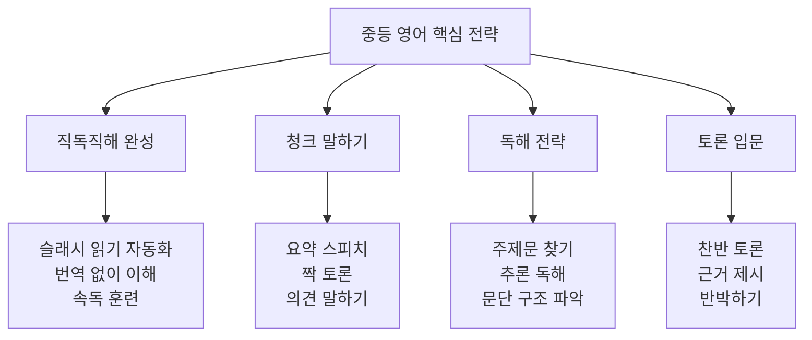

### 📊 중등 직독직해 실전 예시

```
원문: "Plastic pollution is one of the biggest problems /
       facing our oceans today. / Every year, /
       millions of tons of plastic / enter the sea, /
       harming marine life / and damaging ecosystems."

직독 처리:
  플라스틱 오염은 / 가장 큰 문제 중 하나다 /
  오늘날 우리 바다가 직면한. / 매년, /
  수백만 톤의 플라스틱이 / 바다로 들어가 /
  해양 생물을 해치고 / 생태계를 손상시킨다.
```

---

## 4. 고등 영어 전략 (16~19세)

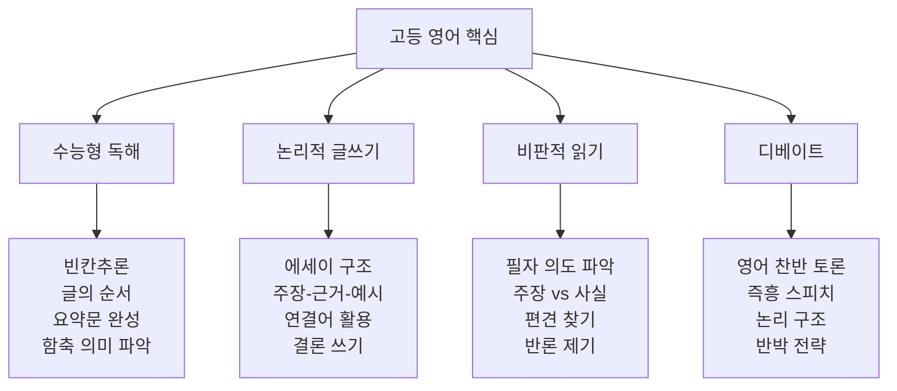

### 📊 고등 문해력 수준별 목표

| 수준 | 읽기 속도 | 이해도 | 어휘 | 목표 |
|------|-----------|--------|------|------|
| 기초 | 80wpm | 60% | 3,000 | 수능 3등급 |
| 중급 | 120wpm | 75% | 5,000 | 수능 2등급 |
| 고급 | 160wpm+ | 90%+ | 8,000+ | 수능 1등급 |

---

## 5. 일반(성인) 영어 전략

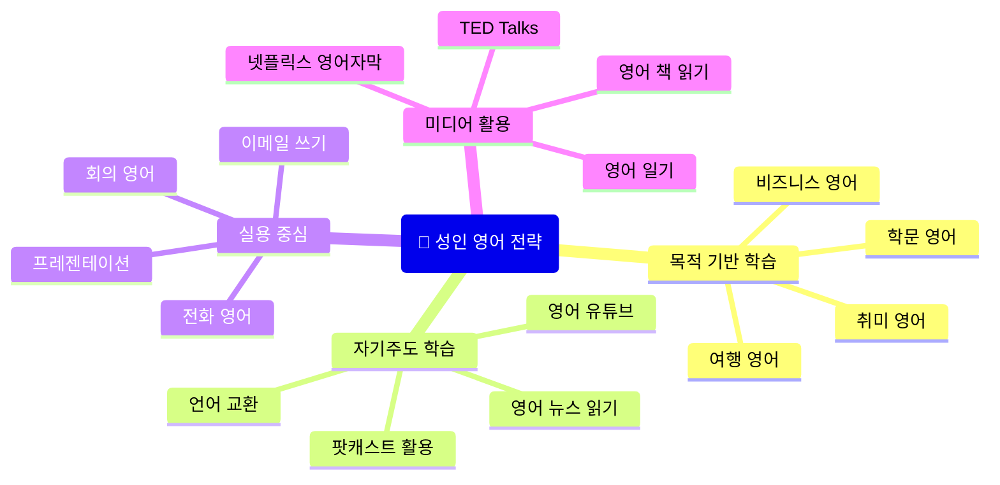

### 📊 성인 학습 방법별 효과 비교

| 방법 | 시간 투자 | 효과 | 비용 | 추천도 |
|------|-----------|------|------|--------|
| 어학원 | 높음 | 중 | 높음 | ★★★ |
| 영어 유튜브 | 중 | 중 | 무료 | ★★★★ |
| 언어 교환 | 중 | 높음 | 무료 | ★★★★★ |
| 영어 책 다독 | 중 | 매우 높음 | 저 | ★★★★★ |
| 넷플릭스 영어자막 | 낮음 | 중 | 중 | ★★★★ |
| AI 영어 대화 | 낮음 | 높음 | 저 | ★★★★★ |

---

## 6. 연령별 비교 종합표

### 📊 전 연령 핵심 전략 비교

| 항목 | 유아 (0~7) | 초등 (8~13) | 중등 (13~16) | 고등 (16~19) | 성인 |
|------|-----------|------------|------------|------------|------|
| **핵심 목표** | 정서+소리 | 파닉스+읽기 | 독해+말하기 | 문해력 | 실용 |
| **듣기 비중** | 60% | 35% | 25% | 20% | 25% |
| **말하기 비중** | 30% | 30% | 30% | 20% | 35% |
| **읽기 비중** | 8% | 25% | 30% | 35% | 25% |
| **쓰기 비중** | 2% | 10% | 15% | 25% | 15% |
| **핵심 활동** | 동요·그림책 | 파닉스·다독 | 직독직해 | 논리독해 | 실전회화 |
| **일일 노출** | 1.5~2시간 | 1~1.5시간 | 1~2시간 | 2~3시간 | 30분~1시간 |
| **강요 여부** | ❌ 절대 금지 | △ 최소화 | △ 목표 설정 | ✅ 전략적 | ✅ 자기주도 |

---

### 📊 영역별 비중 변화 흐름

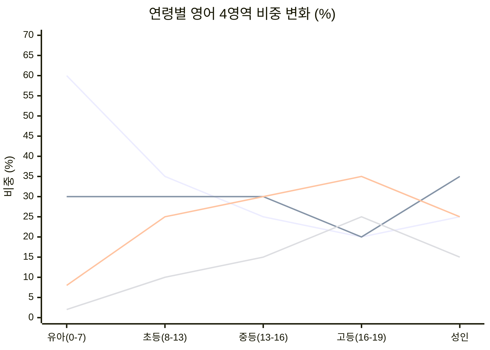

---

### 🗺️ 전체 영어 습득 여정 최종 정리

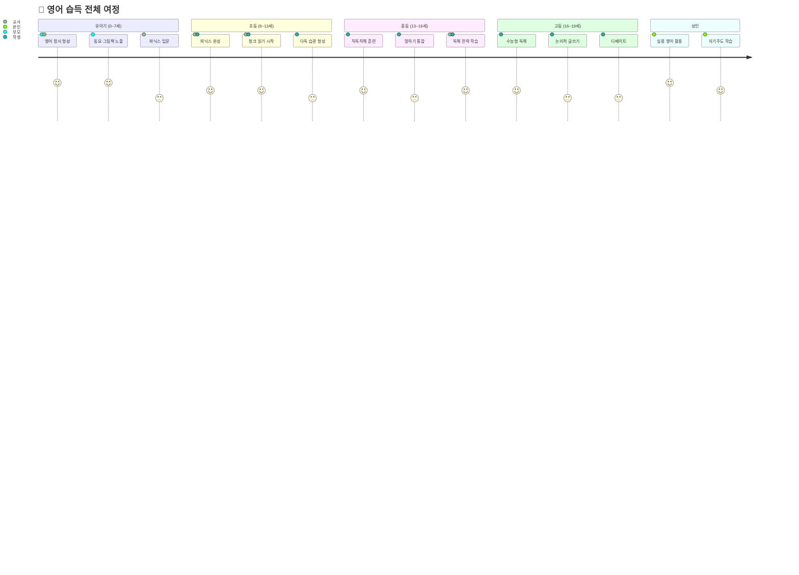

---

## 🎯 교사·부모를 위한 핵심 원칙 10가지

```
✅ 1. 유아기는 정서가 먼저다
      → 영어 = 즐거움, 사랑, 놀이로 연결할 것

✅ 2. 듣기가 90% 채워져야 말하기가 나온다
      → 말을 강요하기 전에 충분히 들려줄 것

✅ 3. 같은 것을 지겹도록 반복하라
      → 한 그림책 20번, 한 동요 100번이 힘이다

✅ 4. 실수는 교정하지 않는다 (유아~초등)
      → 틀려도 "Good try!" 로 더 말하게 유도

✅ 5. 한국어 자막은 독이다
      → 영상은 무조건 자막 없이, 그림으로 이해

✅ 6. 파닉스는 놀이로 시작한다
      → 단어 암기 전에 소리-글자 연결이 먼저

✅ 7. 번역하지 않고 이미지로 연결하라
      → apple → 🍎 (사과라는 단어를 거치지 않게)

✅ 8. 일상의 루틴에 영어를 녹여라
      → 목욕, 식사, 산책 — 모든 순간이 수업

✅ 9. 아이의 속도를 존중하라
      → 비교하지 않고, 기다려 주는 것이 최고의 교육

✅ 10. 부모/교사가 먼저 즐겨야 한다
       → 영어를 즐기는 어른의 모습 자체가 최고의 교재
```

---

> 📚 **참고 이론**
> - Krashen의 자연 습득 순서 & 입력 가설
> - Vygotsky의 근접발달영역 (ZPD)
> - Nation & Newton의 어휘·청크 이론
> - Michael Lewis의 어휘적 접근법 (Lexical Approach)
> - Jim Trelease의 Read-Aloud 이론
> - Patricia Kuhl의 유아 언어 습득 신경과학 연구

---

*이 자료는 유아~성인 대상 AI 영어 교육 컨텐츠 개발자를 위한 종합 가이드입니다.*  
*2026-04-09 작성 | 전연령 영어 교육 연구 기반*
