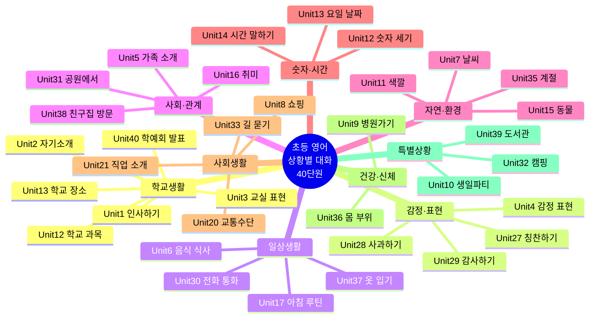
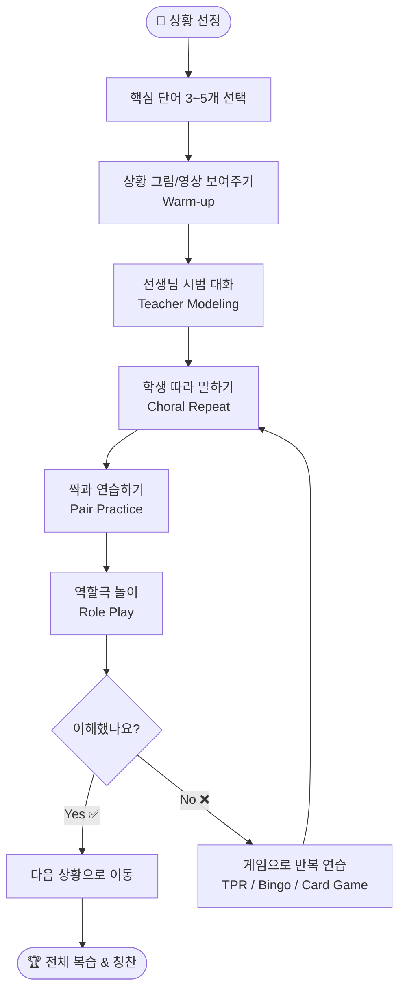
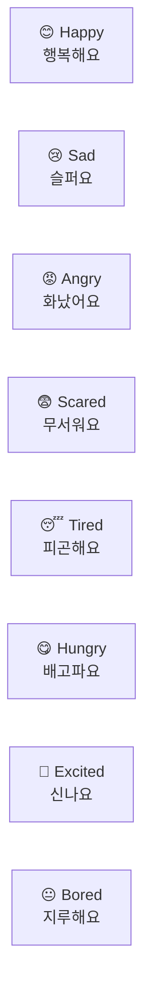
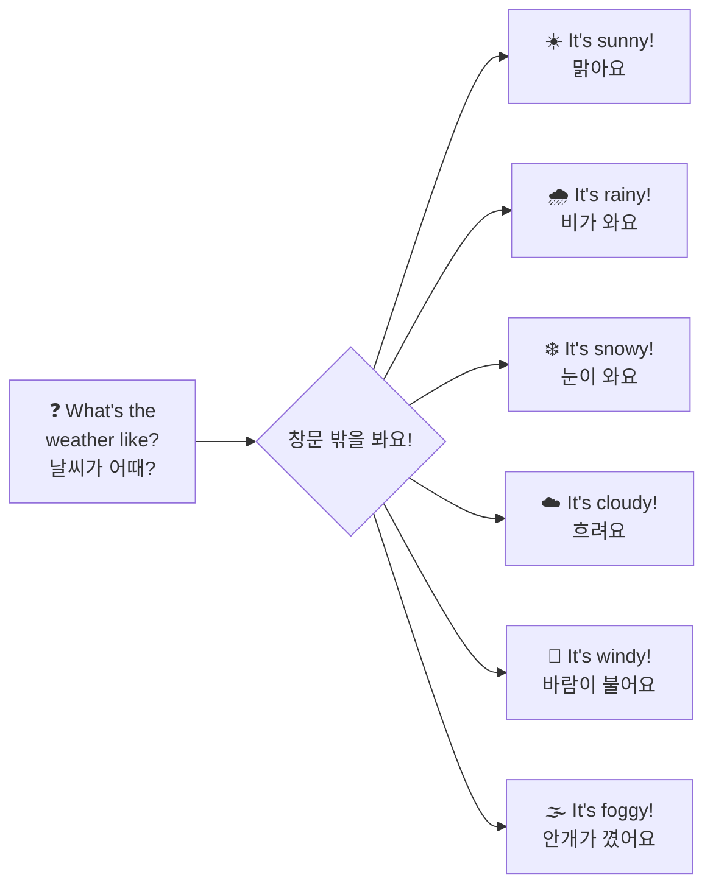
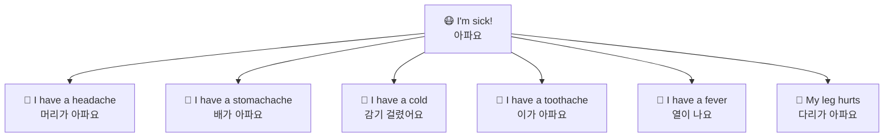
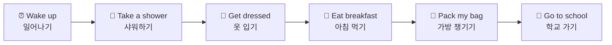
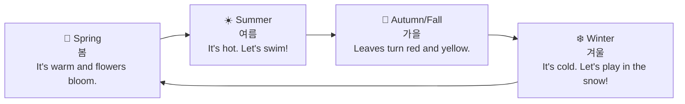
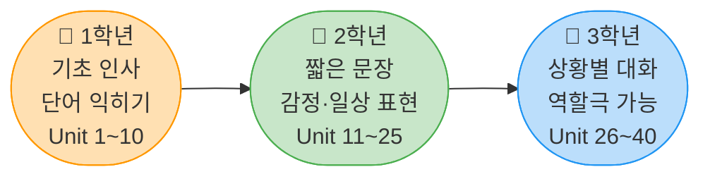

# 🇺🇸 초등 저학년 (1~3학년) 영어 상황별 대화 커리큘럼 (전체 40단원)
> 작성일: 2026-04-07 | 대상: 초등 1~3학년 | 형식: 상황별 회화 중심 | 한글 번역 포함

---

## 📌 전체 커리큘럼 구조 (마인드맵)



---

## 🗂️ 전체 40단원 분류표

| 번호 | 상황 | 핵심 표현 | 난이도 | 카테고리 |
|:----:|:----:|:--------:|:------:|:-------:|
| Unit 1 | 인사하기 | Hello / Good morning / Bye | ⭐ | 학교생활 |
| Unit 2 | 자기소개 | My name is... / I am... | ⭐ | 학교생활 |
| Unit 3 | 교실 표현 | Open your book / Listen | ⭐⭐ | 학교생활 |
| Unit 4 | 감정 표현 | Happy / Sad / Excited | ⭐ | 감정·표현 |
| Unit 5 | 가족 소개 | This is my mom/dad | ⭐⭐ | 사회·관계 |
| Unit 6 | 음식·식사 | I like pizza / I'm hungry | ⭐⭐ | 일상생활 |
| Unit 7 | 날씨 말하기 | It's sunny / cloudy | ⭐⭐ | 자연·환경 |
| Unit 8 | 쇼핑하기 | How much is it? | ⭐⭐⭐ | 사회생활 |
| Unit 9 | 병원가기 | I have a headache | ⭐⭐⭐ | 건강·신체 |
| Unit 10 | 생일파티 | Happy Birthday! / How old? | ⭐⭐ | 특별상황 |
| Unit 11 | 색깔 말하기 | What color is it? / It's red | ⭐ | 자연·환경 |
| Unit 12 | 숫자와 세기 | How many? / There are... | ⭐ | 숫자·시간 |
| Unit 13 | 요일과 날짜 | What day is today? | ⭐⭐ | 숫자·시간 |
| Unit 14 | 시간 말하기 | What time is it? / It's 3 o'clock | ⭐⭐ | 숫자·시간 |
| Unit 15 | 동물 이름 | What animal is this? | ⭐ | 자연·환경 |
| Unit 16 | 취미 말하기 | What do you like to do? | ⭐⭐ | 사회·관계 |
| Unit 17 | 아침 루틴 | I wake up / I brush my teeth | ⭐⭐ | 일상생활 |
| Unit 18 | 운동·스포츠 | I can play soccer | ⭐⭐ | 사회·관계 |
| Unit 19 | 학교 과목 | I like math / science | ⭐⭐ | 학교생활 |
| Unit 20 | 집 안 장소 | This is the kitchen / bedroom | ⭐ | 일상생활 |
| Unit 21 | 학교 장소 | Where is the library? | ⭐⭐ | 학교생활 |
| Unit 22 | 교통수단 | I go by bus / on foot | ⭐⭐ | 사회생활 |
| Unit 23 | 직업 소개 | What do you want to be? | ⭐⭐⭐ | 사회생활 |
| Unit 24 | 물건 찾기 | Where is my pencil? | ⭐⭐ | 일상생활 |
| Unit 25 | 허락 구하기 | Can I go to the bathroom? | ⭐⭐ | 학교생활 |
| Unit 26 | 도움 요청하기 | Can you help me please? | ⭐⭐ | 감정·표현 |
| Unit 27 | 칭찬하기 | Great job! / You're amazing! | ⭐ | 감정·표현 |
| Unit 28 | 사과하기 | I'm sorry / That's okay | ⭐⭐ | 감정·표현 |
| Unit 29 | 감사하기 | Thank you / You're welcome | ⭐ | 감정·표현 |
| Unit 30 | 전화 통화 | Hello? / Can I speak to...? | ⭐⭐⭐ | 일상생활 |
| Unit 31 | 공원에서 | Let's play / Watch out! | ⭐⭐ | 사회·관계 |
| Unit 32 | 도서관에서 | Can I borrow this book? | ⭐⭐ | 특별상황 |
| Unit 33 | 편의점에서 | I'd like a sandwich, please | ⭐⭐⭐ | 사회생활 |
| Unit 34 | 길 묻기 | Excuse me, where is...? | ⭐⭐⭐ | 사회생활 |
| Unit 35 | 계절 말하기 | My favorite season is... | ⭐⭐ | 자연·환경 |
| Unit 36 | 몸 부위 | Touch your head / My arm hurts | ⭐ | 건강·신체 |
| Unit 37 | 옷 입기 | I'm wearing a red shirt | ⭐⭐ | 일상생활 |
| Unit 38 | 친구집 방문 | Come in! / Make yourself at home | ⭐⭐⭐ | 사회·관계 |
| Unit 39 | 캠핑·야외활동 | Let's go hiking! / Set up the tent | ⭐⭐⭐ | 특별상황 |
| Unit 40 | 학예회·발표 | Ladies and gentlemen... | ⭐⭐⭐ | 학교생활 |

---

## 📋 수업 설계 흐름도 (전체 프로세스)



---

## 🗣️ 상황별 대화 예시

---

### ✅ Unit 1 — 인사하기 (Greeting)

#### 🔑 핵심 단어
| 영어 표현 | 한국어 뜻 | 발음 팁 |
|----------|-----------|--------|
| Hello | 안녕하세요 | 헬-로우 |
| Hi | 안녕 (친구끼리) | 하이 |
| Goodbye / Bye | 잘 가요 | 굿-바이 / 바이 |
| Good morning | 좋은 아침이에요 | 굿 모닝 |
| Good afternoon | 좋은 오후예요 | 굿 애프터눈 |
| Good night | 잘 자요 | 굿 나잇 |
| How are you? | 어떻게 지내요? | 하우 아 유 |
| I'm fine, thank you! | 잘 지내요, 고마워요! | 아임 파인 땡큐 |

#### 💬 상황 대화 — 아침에 친구를 만났을 때
```
🧒 Jake : Good morning, Mina!
          (굿 모닝, 미나! → 안녕, 미나! 좋은 아침이야!)

👧 Sora : Good morning, Jake! How are you?
          (굿 모닝, 제이크! 하우 아 유? → 안녕, 제이크! 어떻게 지내?)

🧒 Jake : I'm great! How about you?
          (아임 그레잇! 하우 어바웃 유? → 나는 최고야! 너는?)

👧 Sora : I'm good, thank you!
          (아임 굿, 땡큐! → 나도 좋아, 고마워!)

🧒 Jake : See you in class! Bye!
          (씨 유 인 클래스! 바이! → 교실에서 봐! 잘 가!)

👧 Sora : Bye bye!
          (바이 바이! → 잘 가!)
```

#### 🎮 수업 활동
- **손 인형 활용**: 인형끼리 인사 연습
- **문 들어올 때마다**: "Good morning!" 인사 습관 만들기
- **TPR**: 손 흔들기 → Bye / 인사 고개 숙이기 → Hello

---

### ✅ Unit 2 — 자기소개 (Self Introduction)

#### 🔑 핵심 단어
| 영어 표현 | 한국어 뜻 |
|----------|-----------|
| My name is ___ | 내 이름은 ___야 |
| I am ___ years old | 나는 ___살이야 |
| I like ___ | 나는 ___를 좋아해 |
| I live in ___ | 나는 ___에 살아 |
| Nice to meet you! | 만나서 반가워! |
| Nice to meet you too! | 나도 만나서 반가워! |

#### 💬 상황 대화 — 새 친구를 만났을 때
```
🧒 Jake : Hi! My name is Jake. What's your name?
          (하이! 마이 네임 이즈 제이크. 왓츠 유어 네임? → 안녕! 내 이름은 제이크야. 네 이름은 뭐야?)

👧 Sora : Hi Jake! My name is Sora.
          (하이 제이크! 마이 네임 이즈 소라 → 안녕 제이크! 내 이름은 소라야.)

🧒 Jake : How old are you, Sora?
          (하우 올드 아 유, 소라? → 소라야, 몇 살이야?)

👧 Sora : I am 8 years old. How about you?
          (아이 엠 에잇 이얼스 올드. 하우 어바웃 유? → 나는 8살이야. 너는?)

🧒 Jake : I am 9 years old. I like soccer. Do you like soccer?
          (아이 엠 나인 이얼스 올드. 아이 라이크 사커. 두 유 라이크 사커? → 나는 9살이야. 나는 축구를 좋아해. 너도 좋아해?)

👧 Sora : No, I like drawing! Nice to meet you, Jake!
          (노우, 아이 라이크 드로잉! 나이스 투 밋 유, 제이크! → 아니, 나는 그림 그리기를 좋아해! 만나서 반가워, 제이크!)

🧒 Jake : Nice to meet you too, Sora!
          (나이스 투 밋 유 투, 소라! → 나도 만나서 반가워, 소라!)
```

#### 🎮 수업 활동
- **명찰 만들기**: My name is ___를 직접 써서 붙이기
- **Ball toss**: 공 던지면서 자기소개 한 문장씩 말하기
- **인터뷰 카드**: 친구 3명 인터뷰 후 기록하기

---

### ✅ Unit 3 — 교실 표현 (Classroom Language)

#### 🔑 핵심 표현
| 영어 표현 | 한국어 뜻 | 학생 행동 |
|----------|-----------|-----------|
| Open your book. | 책을 펴세요. | 책 펴기 |
| Close your book. | 책을 닫으세요. | 책 닫기 |
| Listen carefully. | 잘 들으세요. | 귀 기울이기 |
| Repeat after me. | 따라 하세요. | 따라 말하기 |
| Raise your hand. | 손을 드세요. | 손 들기 |
| Work with a partner. | 짝과 함께 해요. | 짝 활동 |
| Good job! / Great! | 잘했어요! | 칭찬 받기 |
| Excuse me, teacher. | 선생님, 실례합니다. | 질문할 때 |
| I don't understand. | 이해가 안 돼요. | 모를 때 |
| Can you say it again? | 다시 말해줄 수 있어요? | 반복 요청 |

#### 💬 상황 대화 — 수업 시간 중
```
👩‍🏫 Teacher : Good morning, everyone!
               (굿 모닝, 에브리원! → 여러분, 좋은 아침이에요!)

👨‍👩‍👧‍👦 Students: Good morning, teacher!
               (굿 모닝, 티처! → 선생님, 좋은 아침이에요!)

👩‍🏫 Teacher : Open your books to page 10.
               (오픈 유어 북스 투 페이지 텐 → 책 10쪽을 펴세요.)

🧒 Jake : Excuse me, teacher. I don't have a book.
          (익스큐즈 미, 티처. 아이 돈't 해브 어 북 → 선생님, 실례합니다. 책이 없어요.)

👩‍🏫 Teacher : That's okay. Share with your partner.
               (댓츠 오케이. 쉐어 위드 유어 파트너 → 괜찮아요. 짝이랑 같이 봐요.)

🧒 Jake : Okay, thank you!
          (오케이, 땡큐! → 네, 감사합니다!)

👩‍🏫 Teacher : Now, listen carefully and repeat after me.
               (나우, 리슨 케어풀리 앤 리핏 애프터 미 → 이제 잘 듣고 따라 하세요.)

👨‍👩‍👧‍👦 Students: (Repeat 따라 말하기)

👩‍🏫 Teacher : Great job, everyone!
               (그레잇 잡, 에브리원! → 여러분, 정말 잘했어요!)
```

---

### ✅ Unit 4 — 감정 표현 (Feelings & Emotions)

#### 🔑 감정 단어 차트


#### 💬 상황 대화 — 오늘 기분을 물어볼 때
```
🧒 Jake : Hey Sora! How do you feel today?
          (헤이 소라! 하우 두 유 필 투데이? → 소라야! 오늘 기분이 어때?)

👧 Sora : I feel happy! We have art class today!
          (아이 필 해피! 위 해브 아트 클래스 투데이! → 행복해! 오늘 미술 수업 있잖아!)

🧒 Jake : That's great! I feel excited too!
          (댓츠 그레잇! 아이 필 익사이티드 투! → 좋겠다! 나도 신나!)

👧 Sora : Are you okay, Tom? You look sad.
          (아 유 오케이, 톰? 유 룩 새드 → 톰아, 괜찮아? 슬퍼 보여.)

🧦 Tom  : I feel a little tired. I slept late.
          (아이 필 어 리틀 타이어드. 아이 슬렙트 레잇 → 조금 피곤해. 늦게 잤어.)

👧 Sora : Oh no. I hope you feel better soon!
          (오 노우. 아이 호프 유 필 베터 순! → 어머나. 곧 나아지길 바라!)

🧦 Tom  : Thank you, Sora. That's so kind!
          (땡큐, 소라. 댓츠 소 카인드! → 고마워, 소라. 정말 친절하다!)
```

#### 🎮 수업 활동
- **감정 카드 게임**: 카드를 뽑아 감정 영어로 말하기
- **감정 날씨 달력**: 매일 오늘 기분을 영어로 적기
- **거울 놀이**: 표정 짓고 상대가 영어로 맞히기

---

### ✅ Unit 5 — 가족 소개 (My Family)

#### 🔑 핵심 단어
| 영어 | 한국어 |
|------|--------|
| Mom / Mother | 엄마 |
| Dad / Father | 아빠 |
| Brother | 남동생 / 오빠 / 형 |
| Sister | 여동생 / 언니 / 누나 |
| Grandma | 할머니 |
| Grandpa | 할아버지 |
| Only child | 외동 |
| Family | 가족 |

#### 💬 상황 대화 — 가족 사진 보여줄 때
```
👧 Sora : Jake, who is this in the picture?
          (제이크, 후 이즈 디스 인 더 픽처? → 제이크, 이 사진 속 사람은 누구야?)

🧒 Jake : This is my mom. Her name is Susan.
          (디스 이즈 마이 맘. 허 네임 이즈 수잔 → 이 사람은 우리 엄마야. 이름은 수잔이야.)

👧 Sora : She looks nice! And who is this?
          (쉬 룩스 나이스! 앤 후 이즈 디스? → 좋아 보이는 분이다! 이 사람은 누구야?)

🧒 Jake : That's my little brother, Max. He is 5 years old.
          (댓츠 마이 리틀 브라더, 맥스. 히 이즈 파이브 이얼스 올드 → 내 남동생 맥스야. 5살이야.)

👧 Sora : Cute! How many people are in your family?
          (큐트! 하우 매니 피플 아 인 유어 패밀리? → 귀엽다! 가족이 몇 명이야?)

🧒 Jake : There are 4 people. Mom, Dad, Max, and me!
          (데어 아 포 피플. 맘, 대드, 맥스, 앤 미! → 4명이야. 엄마, 아빠, 맥스, 그리고 나!)

👧 Sora : My family has 3 people. Mom, Dad, and me!
          (마이 패밀리 해즈 쓰리 피플. 맘, 대드, 앤 미! → 우리 가족은 3명이야. 엄마, 아빠, 그리고 나!)
```

---

### ✅ Unit 6 — 음식·식사 (Food & Eating)

#### 🔑 핵심 표현
| 영어 표현 | 한국어 뜻 |
|----------|-----------|
| I'm hungry. | 나 배고파. |
| I'm thirsty. | 나 목말라. |
| I like pizza. | 나 피자 좋아해. |
| I don't like broccoli. | 나 브로콜리 싫어. |
| It's delicious! | 맛있어요! |
| Can I have more? | 더 먹어도 돼요? |
| What's for lunch? | 점심이 뭐야? |
| My favorite food is ___. | 내가 제일 좋아하는 음식은 ___야. |

#### 💬 상황 대화 — 급식 시간에
```
🧒 Jake : Yay! It's lunch time!
          (야이! 잇츠 런치 타임! → 야호! 점심시간이다!)

👧 Sora : I'm so hungry! What's for lunch today?
          (아임 소 헝그리! 왓츠 포 런치 투데이? → 나 너무 배고파! 오늘 점심 뭐야?)

🧒 Jake : We have rice, soup, and chicken!
          (위 해브 라이스, 숩, 앤 치킨! → 밥이랑 국이랑 치킨이 있어!)

👧 Sora : I love chicken! It's my favorite!
          (아이 러브 치킨! 잇츠 마이 페이버릿! → 나 치킨 너무 좋아! 내가 제일 좋아하는 음식이야!)

🧒 Jake : Do you like the soup?
          (두 유 라이크 더 숩? → 국은 좋아해?)

👧 Sora : Hmm... It's a little spicy. But it's okay!
          (흠... 잇츠 어 리틀 스파이시. 벗 잇츠 오케이! → 흠... 좀 매워. 그래도 괜찮아!)

🧒 Jake : Can I have your chicken? I'm still hungry!
          (캔 아이 해브 유어 치킨? 아임 스틸 헝그리! → 네 치킨 나 줄 수 있어? 아직도 배고파!)

👧 Sora : No way! It's delicious! Haha!
          (노 웨이! 잇츠 딜리셔스! 하하! → 절대 안돼! 맛있단 말이야! 하하!)
```

---

### ✅ Unit 7 — 날씨 말하기 (Weather)

#### 🔑 날씨 표현 순서도


#### 💬 상황 대화 — 오늘 날씨 이야기할 때
```
👧 Sora : Good morning! Look outside!
          (굿 모닝! 룩 아웃사이드! → 좋은 아침! 밖을 봐!)

🧒 Jake : Wow! It's sunny today!
          (와우! 잇츠 서니 투데이! → 와! 오늘 날씨 맑다!)

👧 Sora : Yes! And it's warm! Let's play outside!
          (예스! 앤 잇츠 웜! 렛츠 플레이 아웃사이드! → 응! 따뜻해! 밖에서 놀자!)

🧒 Jake : Great idea! Do you have a hat?
          (그레잇 아이디어! 두 유 해브 어 햇? → 좋은 생각이야! 모자 있어?)

👧 Sora : Yes, I do! The sun is so bright!
          (예스, 아이 두! 더 선 이즈 소 브라이트! → 응, 있어! 햇살이 너무 눈부셔!)

🧒 Jake : Yesterday it was rainy. Today is much better!
          (예스터데이 잇 워즈 레이니. 투데이 이즈 머치 베터! → 어제는 비가 왔잖아. 오늘이 훨씬 좋다!)
```

---

### ✅ Unit 8 — 쇼핑하기 (Shopping)

#### 🔑 핵심 표현
| 영어 표현 | 한국어 뜻 | 역할 |
|----------|-----------|------|
| How much is it? | 얼마예요? | 손님 |
| It's ___ dollars. | ___달러예요. | 점원 |
| I'll take it. | 이거 살게요. | 손님 |
| Here you go. | 여기 있어요. | 점원 |
| Do you have ___? | ___ 있나요? | 손님 |
| It's too expensive. | 너무 비싸요. | 손님 |
| Do you have a smaller size? | 더 작은 사이즈 있나요? | 손님 |
| Your change is ___ dollars. | 거스름돈은 ___달러예요. | 점원 |

#### 💬 상황 대화 — 문방구에서
```
🧒 Jake (손님): Excuse me! How much is this pencil?
                (익스큐즈 미! 하우 머치 이즈 디스 펜슬? → 실례합니다! 이 연필은 얼마예요?)

👧 Sora (점원): It's 2 dollars.
                (잇츠 투 달러스 → 2달러예요.)

🧒 Jake       : And how much is this eraser?
                (앤 하우 머치 이즈 디스 이레이저? → 이 지우개는 얼마예요?)

👧 Sora       : It's 1 dollar.
                (잇츠 원 달러 → 1달러예요.)

🧒 Jake       : Okay! I'll take both, please.
                (오케이! 아일 테이크 보스, 플리즈 → 둘 다 살게요.)

👧 Sora       : That's 3 dollars, please.
                (댓츠 쓰리 달러스, 플리즈 → 총 3달러입니다.)

🧒 Jake       : Here you go! (pays)
                (히어 유 고! → 여기 있어요!)

👧 Sora       : Thank you! Here's your change. Have a nice day!
                (땡큐! 히얼즈 유어 체인지. 해브 어 나이스 데이! → 감사합니다! 거스름돈 여기요. 좋은 하루 보내세요!)
```

---

### ✅ Unit 9 — 병원가기 (At the Doctor's)

#### 🔑 아픈 곳 표현


#### 💬 상황 대화 — 선생님께 아프다고 말할 때
```
🧒 Jake     : Excuse me, teacher. I don't feel well.
              (익스큐즈 미, 티처. 아이 돈't 필 웰 → 선생님, 실례합니다. 몸이 좋지 않아요.)

👩‍🏫 Teacher : Oh no! What's wrong, Jake?
              (오 노우! 왓츠 롱, 제이크? → 어머! 무슨 일이야, 제이크?)

🧒 Jake     : I have a stomachache.
              (아이 해브 어 스터머케이크 → 배가 아파요.)

👩‍🏫 Teacher : I'm sorry to hear that. Did you eat breakfast?
              (아임 쏘리 투 히어 댓. 디드 유 잇 브렉퍼스트? → 안됐구나. 아침 먹었어?)

🧒 Jake     : Yes, but I feel sick.
              (예스, 벗 아이 필 식 → 네, 먹었는데도 아파요.)

👩‍🏫 Teacher : Okay. Let's go to the nurse's office.
              (오케이. 렛츠 고 투 더 너스 오피스 → 알겠어. 보건실에 가자.)

🧒 Jake     : Thank you, teacher.
              (땡큐, 티처 → 감사합니다, 선생님.)

👩‍🏫 Teacher : I hope you feel better soon!
              (아이 호프 유 필 베터 순! → 빨리 낫기를 바랄게!)
```

---

### ✅ Unit 10 — 생일파티 (Birthday Party)

#### 🔑 핵심 표현
| 영어 표현 | 한국어 뜻 |
|----------|-----------|
| Happy Birthday! | 생일 축하해! |
| How old are you? | 몇 살이야? |
| I am ___ years old. | 나는 ___살이야. |
| Make a wish! | 소원을 빌어! |
| This is for you! | 이거 너 줄 거야! |
| Thank you so much! | 정말 고마워! |
| Can I open it? | 열어봐도 돼? |
| You're going to love it! | 분명히 좋아할 거야! |

#### 💬 상황 대화 — 생일 파티에서
```
👨‍👩‍👧‍👦 Everyone: Surprise! Happy Birthday, Sora!
                  (서프라이즈! 해피 버스데이, 소라! → 깜짝이야! 소라야, 생일 축하해!)

👧 Sora : Oh my! Thank you so much!
          (오 마이! 땡큐 소 머치! → 어머나! 정말 고마워!)

🧒 Jake : How old are you today, Sora?
          (하우 올드 아 유 투데이, 소라? → 소라야, 오늘 몇 살이야?)

👧 Sora : I am 8 years old!
          (아이 엠 에잇 이얼스 올드! → 나는 8살이야!)

🧒 Jake : Here! This present is for you!
          (히어! 디스 프레젠트 이즈 포 유! → 여기! 이 선물 너 주는 거야!)

👧 Sora : Wow, thank you Jake! Can I open it now?
          (와우, 땡큐 제이크! 캔 아이 오픈 잇 나우? → 와, 고마워 제이크! 지금 열어봐도 돼?)

🧒 Jake : Yes! Open it!
          (예스! 오픈 잇! → 응! 열어봐!)

👧 Sora : It's a drawing set! I love it!
          (잇츠 어 드로잉 셋! 아이 러브 잇! → 색연필 세트잖아! 너무 좋아!)

🧒 Jake : Now, make a wish and blow the candles!
          (나우, 메이크 어 위시 앤 블로우 더 캔들스! → 이제 소원 빌고 촛불 불어!)

👧 Sora : Okay! (blows) Yay!
          (오케이! 후~ 야이! → 알겠어! 후~ 야호!)

👨‍👩‍👧‍👦 Everyone: Hooray! 🎉
                  (후레이! → 만세!)
```

---

### ✅ Unit 11 — 색깔 말하기 (Colors)

#### 🔑 핵심 단어
| 영어 | 한국어 | 영어 | 한국어 |
|------|--------|------|--------|
| Red | 빨간색 | Orange | 주황색 |
| Yellow | 노란색 | Green | 초록색 |
| Blue | 파란색 | Purple | 보라색 |
| Pink | 분홍색 | Brown | 갈색 |
| Black | 검은색 | White | 흰색 |

#### 💬 상황 대화 — 미술 시간에
```
👩‍🏫 Teacher : What color is this?
               (왓 컬러 이즈 디스? → 이게 무슨 색이야?)

🧒 Jake : It's red!
          (잇츠 레드! → 빨간색이에요!)

👩‍🏫 Teacher : Good! And what is your favorite color?
               (굿! 앤 왓 이즈 유어 페이버릿 컬러? → 잘했어! 네가 제일 좋아하는 색은?)

👧 Sora : My favorite color is blue. The sky is blue!
          (마이 페이버릿 컬러 이즈 블루. 더 스카이 이즈 블루! → 내가 제일 좋아하는 색은 파란색이에요. 하늘이 파란색이잖아요!)

🧒 Jake : I like green. Frogs are green!
          (아이 라이크 그린. 프로그스 아 그린! → 나는 초록색이 좋아. 개구리가 초록색이잖아!)

👩‍🏫 Teacher : Great! Now, draw something in your favorite color!
               (그레잇! 나우, 드로우 섬씽 인 유어 페이버릿 컬러! → 훌륭해요! 이제 자기가 좋아하는 색으로 뭔가 그려봐요!)
```

---

### ✅ Unit 12 — 숫자와 세기 (Numbers & Counting)

#### 🔑 핵심 단어
| 숫자 | 영어 | 발음 |
|------|------|------|
| 1 | One | 원 |
| 2 | Two | 투 |
| 3 | Three | 쓰리 |
| 4 | Four | 포어 |
| 5 | Five | 파이브 |
| 6 | Six | 식스 |
| 7 | Seven | 세븐 |
| 8 | Eight | 에잇 |
| 9 | Nine | 나인 |
| 10 | Ten | 텐 |

#### 💬 상황 대화 — 수학 시간에
```
👩‍🏫 Teacher : How many apples are there?
               (하우 매니 애플즈 아 데어? → 사과가 몇 개 있어요?)

🧒 Jake : One, two, three... There are seven apples!
          (원, 투, 쓰리... 데어 아 세븐 애플즈! → 하나, 둘, 셋... 사과가 7개 있어요!)

👩‍🏫 Teacher : That's right! Can you count to ten?
               (댓츠 라잇! 캔 유 카운트 투 텐? → 맞아요! 10까지 셀 수 있어요?)

👧 Sora : Yes! One, two, three, four, five, six, seven, eight, nine, ten!
          (예스! 원, 투, 쓰리, 포, 파이브, 식스, 세븐, 에잇, 나인, 텐! → 네! 하나, 둘, 셋, 넷, 다섯, 여섯, 일곱, 여덟, 아홉, 열!)

👩‍🏫 Teacher : Excellent! Great counting!
               (엑설런트! 그레잇 카운팅! → 훌륭해요! 정말 잘 셌어요!)
```

---

### ✅ Unit 13 — 요일과 날짜 (Days & Dates)

#### 🔑 핵심 단어
| 영어 | 한국어 | 영어 | 한국어 |
|------|--------|------|--------|
| Monday | 월요일 | Friday | 금요일 |
| Tuesday | 화요일 | Saturday | 토요일 |
| Wednesday | 수요일 | Sunday | 일요일 |
| Thursday | 목요일 | Weekend | 주말 |
| Today | 오늘 | Tomorrow | 내일 |
| Yesterday | 어제 | — | — |

#### 💬 상황 대화 — 수업 시작 시
```
👩‍🏫 Teacher : What day is today?
               (왓 데이 이즈 투데이? → 오늘은 무슨 요일이에요?)

🧒 Jake : Today is Monday!
          (투데이 이즈 먼데이! → 오늘은 월요일이에요!)

👩‍🏫 Teacher : That's right! And what day was yesterday?
               (댓츠 라잇! 앤 왓 데이 워즈 예스터데이? → 맞아요! 어제는 무슨 요일이었어요?)

👧 Sora : Yesterday was Sunday!
          (예스터데이 워즈 선데이! → 어제는 일요일이었어요!)

👩‍🏫 Teacher : Good! What do you do on weekends?
               (굿! 왓 두 유 두 온 위켄즈? → 잘했어요! 주말에는 뭐 해요?)

🧒 Jake : I play with my friends on Saturday! On Sunday, I stay home.
          (아이 플레이 위드 마이 프렌즈 온 새터데이! 온 선데이, 아이 스테이 홈 → 토요일에는 친구들이랑 놀아요! 일요일에는 집에 있어요.)
```

---

### ✅ Unit 14 — 시간 말하기 (Telling Time)

#### 🔑 핵심 표현
| 영어 표현 | 한국어 뜻 |
|----------|-----------|
| What time is it? | 몇 시예요? |
| It's 3 o'clock. | 3시예요. |
| It's half past two. | 2시 반이에요. |
| It's time for lunch! | 점심시간이에요! |
| Wake up time! | 일어날 시간이에요! |
| Bedtime! | 잘 시간이에요! |

#### 💬 상황 대화 — 시간 묻고 답하기
```
🧒 Jake : Sora, what time is it?
          (소라, 왓 타임 이즈 잇? → 소라야, 지금 몇 시야?)

👧 Sora : It's 3 o'clock. School is over!
          (잇츠 쓰리 오클락. 스쿨 이즈 오버! → 3시야. 학교 끝났다!)

🧒 Jake : Yes! Time to go home!
          (예스! 타임 투 고 홈! → 야! 집에 갈 시간이야!)

👧 Sora : What time do you eat dinner?
          (왓 타임 두 유 잇 디너? → 저녁은 몇 시에 먹어?)

🧒 Jake : I eat dinner at 6 o'clock. How about you?
          (아이 잇 디너 앳 식스 오클락. 하우 어바웃 유? → 6시에 먹어. 너는?)

👧 Sora : Me too! See you tomorrow!
          (미 투! 씨 유 투모로우! → 나도! 내일 봐!)
```

---

### ✅ Unit 15 — 동물 이름 (Animals)

#### 🔑 핵심 단어
| 영어 | 한국어 | 소리 표현 |
|------|--------|-----------|
| Dog | 개 | Woof woof! |
| Cat | 고양이 | Meow! |
| Rabbit | 토끼 | — |
| Lion | 사자 | Roar! |
| Duck | 오리 | Quack quack! |
| Elephant | 코끼리 | — |
| Monkey | 원숭이 | — |
| Fish | 물고기 | — |

#### 💬 상황 대화 — 동물원에서
```
🧒 Jake : Wow! Look at that big animal! What is it?
          (와우! 룩 앳 댓 빅 애니멀! 왓 이즈 잇? → 와! 저 큰 동물 좀 봐! 저게 뭐야?)

👧 Sora : It's an elephant! It's so big!
          (잇츠 언 엘리펀트! 잇츠 소 빅! → 코끼리야! 엄청 크다!)

🧒 Jake : Do you have a pet?
          (두 유 해브 어 펫? → 너 반려동물 있어?)

👧 Sora : Yes! I have a cat. Her name is Luna.
          (예스! 아이 해브 어 캣. 허 네임 이즈 루나 → 응! 나 고양이 있어. 이름이 루나야.)

🧒 Jake : That's cool! I have a dog. His name is Coco.
          (댓츠 쿨! 아이 해브 어 독. 히즈 네임 이즈 코코 → 멋지다! 나는 강아지 있어. 이름이 코코야.)

👧 Sora : Coco! What a cute name!
          (코코! 왓 어 큐트 네임! → 코코! 이름 너무 귀엽다!)
```

---

### ✅ Unit 16 — 취미 말하기 (Hobbies)

#### 🔑 핵심 표현
| 영어 표현 | 한국어 뜻 |
|----------|-----------|
| What do you like to do? | 뭐 하는 걸 좋아해? |
| I like reading books. | 나는 책 읽기를 좋아해. |
| I enjoy drawing. | 나는 그림 그리기를 즐겨. |
| I love playing games. | 나는 게임하는 걸 엄청 좋아해. |
| I'm good at singing. | 나는 노래를 잘해. |
| In my free time, I... | 시간이 날 때 나는... |

#### 💬 상황 대화 — 방과 후에
```
👧 Sora : Jake, what do you like to do after school?
          (제이크, 왓 두 유 라이크 투 두 애프터 스쿨? → 제이크야, 방과 후에 뭐 하는 걸 좋아해?)

🧒 Jake : I like playing soccer! I play every day. How about you?
          (아이 라이크 플레잉 사커! 아이 플레이 에브리 데이. 하우 어바웃 유? → 나는 축구하는 걸 좋아해! 매일 해. 너는?)

👧 Sora : I enjoy drawing and reading books.
          (아이 인조이 드로잉 앤 리딩 북스 → 나는 그림 그리기랑 책 읽기를 즐겨.)

🧒 Jake : That's nice! Are you good at drawing?
          (댓츠 나이스! 아 유 굿 앳 드로잉? → 좋겠다! 그림 잘 그려?)

👧 Sora : I think so! I want to be an artist someday.
          (아이 씽크 소! 아이 원트 투 비 언 아티스트 섬데이 → 그런 것 같아! 언젠가 화가가 되고 싶어.)

🧒 Jake : Wow! I want to be a soccer player!
          (와우! 아이 원트 투 비 어 사커 플레이어! → 와! 나는 축구선수가 되고 싶어!)
```

---

### ✅ Unit 17 — 아침 루틴 (Morning Routine)

#### 🔑 순서도 — 아침에 하는 일


#### 💬 상황 대화 — 아침 루틴 이야기
```
👧 Sora : Jake, what time do you wake up?
          (제이크, 왓 타임 두 유 웨이크 업? → 제이크야, 몇 시에 일어나?)

🧒 Jake : I wake up at 7 o'clock. Then I brush my teeth.
          (아이 웨이크 업 앳 세븐 오클락. 덴 아이 브러시 마이 티쓰 → 7시에 일어나. 그리고 이를 닦아.)

👧 Sora : Do you eat breakfast?
          (두 유 잇 브렉퍼스트? → 아침밥은 먹어?)

🧒 Jake : Yes! I eat toast and drink milk every morning.
          (예스! 아이 잇 토스트 앤 드링크 밀크 에브리 모닝 → 응! 매일 아침 토스트 먹고 우유 마셔.)

👧 Sora : Me too! And then I pack my bag and go to school.
          (미 투! 앤 덴 아이 팩 마이 백 앤 고 투 스쿨 → 나도! 그러고 가방 챙겨서 학교에 가.)

🧒 Jake : I'm always excited to come to school!
          (아임 올웨이즈 익사이티드 투 컴 투 스쿨! → 나는 학교 오는 게 항상 신나!)
```

---

### ✅ Unit 18 — 운동·스포츠 (Sports)

#### 🔑 핵심 단어
| 영어 | 한국어 | 표현 |
|------|--------|------|
| Soccer | 축구 | I can play soccer. |
| Basketball | 농구 | I love basketball. |
| Swimming | 수영 | I swim well. |
| Baseball | 야구 | Let's play baseball! |
| Tennis | 테니스 | — |
| Jump rope | 줄넘기 | I jump rope. |
| Run / Race | 달리기 | I run fast! |

#### 💬 상황 대화 — 체육 시간에
```
👩‍🏫 Teacher : Today we are playing soccer! Do you like soccer?
               (투데이 위 아 플레잉 사커! 두 유 라이크 사커? → 오늘 축구해요! 축구 좋아해요?)

🧒 Jake : Yes! I love soccer! I can run very fast!
          (예스! 아이 러브 사커! 아이 캔 런 베리 패스트! → 네! 축구 너무 좋아요! 달리기를 정말 빠르게 해요!)

👧 Sora : I like swimming better than soccer.
          (아이 라이크 스위밍 베터 댄 사커 → 저는 축구보다 수영이 더 좋아요.)

👩‍🏫 Teacher : That's great! Everyone has a different sport they like!
               (댓츠 그레잇! 에브리원 해즈 어 디퍼런트 스포트 데이 라이크! → 훌륭해요! 모두 좋아하는 운동이 다르네요!)

🧒 Jake : Let's play! I'll kick the ball first!
          (렛츠 플레이! 아일 킥 더 볼 퍼스트! → 시작하자! 내가 먼저 공 찰게!)
```

---

### ✅ Unit 19 — 학교 과목 (School Subjects)

#### 🔑 핵심 단어
| 영어 | 한국어 |
|------|--------|
| Math | 수학 |
| English | 영어 |
| Science | 과학 |
| Art | 미술 |
| Music | 음악 |
| P.E. (Physical Education) | 체육 |
| Korean | 국어 |
| Social Studies | 사회 |

#### 💬 상황 대화 — 좋아하는 과목 이야기
```
🧒 Jake : Sora, what is your favorite subject?
          (소라, 왓 이즈 유어 페이버릿 서브젝트? → 소라야, 가장 좋아하는 과목이 뭐야?)

👧 Sora : I love Art! I like drawing and painting. How about you?
          (아이 러브 아트! 아이 라이크 드로잉 앤 페인팅. 하우 어바웃 유? → 미술이 너무 좋아! 그림 그리기랑 색칠하기를 좋아해. 너는?)

🧒 Jake : My favorite is P.E.! I love running and playing sports.
          (마이 페이버릿 이즈 피이! 아이 러브 러닝 앤 플레잉 스포츠 → 나는 체육이 제일 좋아! 달리기랑 운동하는 걸 좋아해.)

👧 Sora : Is there a subject you don't like?
          (이즈 데어 어 서브젝트 유 돈't 라이크? → 싫어하는 과목도 있어?)

🧒 Jake : Hmm... Math is a little hard. But I try my best!
          (흠... 매쓰 이즈 어 리틀 하드. 벗 아이 트라이 마이 베스트! → 흠... 수학이 조금 어려워. 그래도 최선을 다해!)
```

---

### ✅ Unit 20 — 집 안 장소 (Places at Home)

#### 🔑 핵심 단어
| 영어 | 한국어 |
|------|--------|
| Kitchen | 부엌 |
| Bedroom | 침실 |
| Living room | 거실 |
| Bathroom | 화장실 |
| Dining room | 식당 |
| Garden | 정원 |

#### 💬 상황 대화 — 집에서의 일상
```
👧 Sora : Where do you do your homework?
          (웨어 두 유 두 유어 홈워크? → 숙제는 어디서 해?)

🧒 Jake : I do my homework in my bedroom.
          (아이 두 마이 홈워크 인 마이 베드룸 → 나는 침실에서 숙제해.)

👧 Sora : I do mine in the living room. My mom helps me.
          (아이 두 마인 인 더 리빙 룸. 마이 맘 헬프스 미 → 나는 거실에서 해. 엄마가 도와줘.)

🧒 Jake : Where does your family eat dinner?
          (웨어 더즈 유어 패밀리 잇 디너? → 너희 가족은 저녁을 어디서 먹어?)

👧 Sora : We eat in the dining room together. It's fun!
          (위 잇 인 더 다이닝 룸 투게더. 잇츠 펀! → 다 같이 식당에서 먹어. 재미있어!)
```

---

### ✅ Unit 21 — 학교 장소 (Places at School)

#### 🔑 핵심 단어
| 영어 | 한국어 |
|------|--------|
| Classroom | 교실 |
| Library | 도서관 |
| Gym | 체육관 |
| Cafeteria | 급식실 |
| Playground | 운동장 |
| Nurse's office | 보건실 |
| Principal's office | 교장실 |

#### 💬 상황 대화 — 학교 안에서
```
🧒 Jake : Sora, where is the library?
          (소라, 웨어 이즈 더 라이브러리? → 소라야, 도서관이 어디야?)

👧 Sora : The library is on the 2nd floor. Turn left at the stairs.
          (더 라이브러리 이즈 온 더 세컨드 플로어. 턴 레프트 앳 더 스테어즈 → 도서관은 2층에 있어. 계단에서 왼쪽으로 돌아.)

🧒 Jake : Thank you! Is the gym near there too?
          (땡큐! 이즈 더 짐 니어 데어 투? → 고마워! 체육관도 거기 근처에 있어?)

👧 Sora : No, the gym is on the 1st floor. It's near the playground.
          (노우, 더 짐 이즈 온 더 퍼스트 플로어. 잇츠 니어 더 플레이그라운드 → 아니, 체육관은 1층이야. 운동장 옆에 있어.)

🧒 Jake : Got it! Thanks, Sora!
          (갓 잇! 땡스, 소라! → 알겠어! 고마워, 소라!)
```

---

### ✅ Unit 22 — 교통수단 (Transportation)

#### 🔑 핵심 단어
| 영어 | 한국어 | 표현 |
|------|--------|------|
| Bus | 버스 | I go by bus. |
| Subway | 지하철 | I take the subway. |
| Car | 자동차 | I go by car. |
| Bicycle | 자전거 | I ride a bicycle. |
| On foot | 걸어서 | I walk to school. |
| Taxi | 택시 | I take a taxi. |

#### 💬 상황 대화 — 학교 오는 방법
```
👩‍🏫 Teacher : How do you come to school?
               (하우 두 유 컴 투 스쿨? → 학교에 어떻게 와요?)

🧒 Jake : I come to school by bus. The bus takes 10 minutes.
          (아이 컴 투 스쿨 바이 버스. 더 버스 테이크스 텐 미닛츠 → 버스를 타고 학교에 와요. 버스로 10분 걸려요.)

👧 Sora : I walk to school. I live very close!
          (아이 워크 투 스쿨. 아이 리브 베리 클로스! → 걸어서 와요. 학교에서 아주 가까이 살아요!)

🧦 Tom  : My dad drives me by car every morning.
          (마이 대드 드라이브스 미 바이 카 에브리 모닝 → 아빠가 매일 아침 차로 데려다줘요.)

👩‍🏫 Teacher : Great! So many different ways to come to school!
               (그레잇! 소 매니 디퍼런트 웨이즈 투 컴 투 스쿨! → 훌륭해요! 학교 오는 방법이 정말 다양하네요!)
```

---

### ✅ Unit 23 — 직업 소개 (Jobs & Occupations)

#### 🔑 핵심 단어
| 영어 | 한국어 |
|------|--------|
| Teacher | 선생님 |
| Doctor | 의사 |
| Firefighter | 소방관 |
| Police officer | 경찰관 |
| Chef | 요리사 |
| Artist | 화가 |
| Scientist | 과학자 |
| Soccer player | 축구선수 |

#### 💬 상황 대화 — 꿈에 대해 이야기할 때
```
👩‍🏫 Teacher : What do you want to be when you grow up?
               (왓 두 유 원트 투 비 웬 유 그로우 업? → 커서 뭐가 되고 싶어요?)

🧒 Jake : I want to be a soccer player! I practice every day.
          (아이 원트 투 비 어 사커 플레이어! 아이 프랙티스 에브리 데이 → 저는 축구선수가 되고 싶어요! 매일 연습해요.)

👧 Sora : I want to be an artist. I love drawing!
          (아이 원트 투 비 언 아티스트. 아이 러브 드로잉! → 저는 화가가 되고 싶어요. 그림 그리기를 너무 좋아해요!)

🧦 Tom  : I want to be a doctor. I want to help sick people.
          (아이 원트 투 비 어 닥터. 아이 원트 투 헬프 식 피플 → 저는 의사가 되고 싶어요. 아픈 사람들을 돕고 싶어요.)

👩‍🏫 Teacher : Wonderful dreams! Work hard and you can do it!
               (원더풀 드림스! 워크 하드 앤 유 캔 두 잇! → 훌륭한 꿈이에요! 열심히 하면 다 이룰 수 있어요!)
```

---

### ✅ Unit 24 — 물건 찾기 (Finding Things)

#### 🔑 핵심 표현
| 영어 표현 | 한국어 뜻 |
|----------|-----------|
| Where is my ___? | 내 ___가 어디 있어? |
| I can't find my ___. | 내 ___를 못 찾겠어. |
| It's on the table. | 탁자 위에 있어. |
| It's under the chair. | 의자 아래에 있어. |
| It's in your bag. | 가방 안에 있어. |
| It's next to the book. | 책 옆에 있어. |

#### 💬 상황 대화 — 교실에서 물건을 잃어버렸을 때
```
🧒 Jake : Oh no! I can't find my pencil!
          (오 노우! 아이 캔't 파인드 마이 펜슬! → 어머! 내 연필을 못 찾겠어!)

👧 Sora : Where did you put it?
          (웨어 디드 유 풋 잇? → 어디 뒀어?)

🧒 Jake : I don't know! Maybe it's under the desk?
          (아이 돈't 노우! 메이비 잇츠 언더 더 데스크? → 모르겠어! 혹시 책상 아래에 있을까?)

👧 Sora : Look! It's next to your book. On the floor.
          (룩! 잇츠 넥스트 투 유어 북. 온 더 플로어 → 봐봐! 네 책 옆에 있어. 바닥에.)

🧒 Jake : Oh! I found it! Thank you, Sora!
          (오! 아이 파운드 잇! 땡큐, 소라! → 오! 찾았다! 고마워, 소라!)

👧 Sora : No problem! You should be more careful!
          (노 프라블럼! 유 슈드 비 모어 케어풀! → 괜찮아! 다음엔 더 조심해!)
```

---

### ✅ Unit 25 — 허락 구하기 (Asking Permission)

#### 🔑 핵심 표현
| 영어 표현 | 한국어 뜻 | 답변 Yes | 답변 No |
|----------|-----------|----------|---------|
| Can I go to the bathroom? | 화장실 가도 돼요? | Yes, you may. | Not right now. |
| Can I drink some water? | 물 마셔도 돼요? | Sure, go ahead. | Wait a moment. |
| Can I open the window? | 창문 열어도 돼요? | Of course! | It's too cold. |
| May I borrow your eraser? | 지우개 빌려도 돼? | Sure! Here you go. | Sorry, I need it. |

#### 💬 상황 대화 — 수업 중 허락 구하기
```
🧒 Jake : Excuse me, teacher. Can I go to the bathroom?
          (익스큐즈 미, 티처. 캔 아이 고 투 더 배쓰룸? → 선생님, 실례합니다. 화장실에 가도 돼요?)

👩‍🏫 Teacher : Yes, you may. Please hurry back.
               (예스, 유 메이. 플리즈 허리 백 → 네, 가도 돼요. 빨리 돌아오세요.)

🧒 Jake : Thank you, teacher!
          (땡큐, 티처! → 감사합니다, 선생님!)

 — 이후 돌아와서 —

👧 Sora : (whispering) Can I borrow your eraser? I made a mistake.
          (캔 아이 보로우 유어 이레이저? 아이 메이드 어 미스테이크 → 지우개 빌려도 돼? 실수했어.)

🧒 Jake : (whispering) Sure! Here you go.
          (슈어! 히어 유 고 → 물론이지! 여기.)

👧 Sora : Thanks! You're the best!
          (땡스! 유어 더 베스트! → 고마워! 너 최고야!)
```

---

### ✅ Unit 26 — 도움 요청하기 (Asking for Help)

#### 🔑 핵심 표현
| 영어 표현 | 한국어 뜻 |
|----------|-----------|
| Can you help me, please? | 도와줄 수 있어? |
| I need help. | 도움이 필요해. |
| I don't understand. | 이해가 안 돼. |
| Can you show me? | 보여줄 수 있어? |
| How do you do this? | 이거 어떻게 해? |
| Thank you for helping me! | 도와줘서 고마워! |

#### 💬 상황 대화 — 숙제가 어려울 때
```
🧒 Jake : Sora, can you help me please? This math is so hard!
          (소라, 캔 유 헬프 미 플리즈? 디스 매쓰 이즈 소 하드! → 소라야, 도와줄 수 있어? 이 수학이 너무 어려워!)

👧 Sora : Of course! Which question?
          (오브 코스! 위치 퀘스천? → 물론이지! 어느 문제?)

🧒 Jake : Number 5. I don't understand.
          (넘버 파이브. 아이 돈't 언더스탠드 → 5번. 이해가 안 돼.)

👧 Sora : Okay, look. First you add 3 and 4. Then you get 7.
          (오케이, 룩. 퍼스트 유 애드 쓰리 앤 포. 덴 유 겟 세븐 → 알겠어, 봐봐. 먼저 3이랑 4를 더해. 그러면 7이야.)

🧒 Jake : Oh! I see! That's easy! Thank you for helping me!
          (오! 아이 씨! 댓츠 이지! 땡큐 포 헬핑 미! → 오! 알겠다! 쉽네! 도와줘서 고마워!)

👧 Sora : You're welcome! You can do it!
          (유어 웰컴! 유 캔 두 잇! → 천만에! 할 수 있어!)
```

---

### ✅ Unit 27 — 칭찬하기 (Giving Compliments)

#### 🔑 핵심 표현
| 영어 표현 | 한국어 뜻 |
|----------|-----------|
| Great job! | 정말 잘했어! |
| You're amazing! | 너 정말 대단해! |
| I like your drawing! | 네 그림 너무 좋아! |
| You're so smart! | 너 정말 똑똑해! |
| That's so cool! | 정말 멋지다! |
| You did your best! | 최선을 다했잖아! |
| I'm proud of you! | 너 정말 자랑스러워! |

#### 💬 상황 대화 — 친구 그림을 칭찬할 때
```
👧 Sora : Jake, look at my drawing!
          (제이크, 룩 앳 마이 드로잉! → 제이크야, 내 그림 봐봐!)

🧒 Jake : Wow! That's so cool! I love it!
          (와우! 댓츠 소 쿨! 아이 러브 잇! → 와! 정말 멋지다! 너무 좋은걸!)

👧 Sora : Really? Thank you!
          (리얼리? 땡큐! → 정말? 고마워!)

🧒 Jake : You're so talented! How do you draw so well?
          (유어 소 탤런티드! 하우 두 유 드로우 소 웰? → 너 정말 재능이 있어! 어떻게 이렇게 잘 그려?)

👧 Sora : I practice every day! You're great at soccer. I'm proud of you!
          (아이 프랙티스 에브리 데이! 유어 그레잇 앳 사커. 아임 프라우드 오브 유! → 매일 연습해! 너는 축구 정말 잘해. 나는 네가 자랑스러워!)

🧒 Jake : Thanks, Sora! You're the best friend!
          (땡스, 소라! 유어 더 베스트 프렌드! → 고마워, 소라! 너는 최고의 친구야!)
```

---

### ✅ Unit 28 — 사과하기 (Apologizing)

#### 🔑 핵심 표현
| 영어 표현 | 한국어 뜻 | 상황 |
|----------|-----------|------|
| I'm sorry. | 미안해. | 실수했을 때 |
| I'm so sorry! | 정말 미안해! | 심하게 잘못했을 때 |
| That's okay. | 괜찮아. | 용서할 때 |
| No problem. | 문제없어. | 가볍게 용서할 때 |
| I didn't mean it. | 일부러 한 게 아니야. | 변명할 때 |
| It won't happen again. | 다신 안 그럴게. | 약속할 때 |

#### 💬 상황 대화 — 친구 물건을 떨어뜨렸을 때
```
🧒 Jake : (실수로 Sora의 물통을 떨어뜨림)
          Oh no! Sora, I'm so sorry! I dropped your water bottle!
          (오 노우! 소라, 아임 소 쏘리! 아이 드랍트 유어 워터 바틀! → 어머나! 소라야, 정말 미안해! 네 물통을 떨어뜨렸어!)

👧 Sora : It's okay! Is it broken?
          (잇츠 오케이! 이즈 잇 브로큰? → 괜찮아! 깨졌어?)

🧒 Jake : I don't think so. But I'm really sorry. I didn't mean it.
          (아이 돈't 씽크 소. 벗 아임 리얼리 쏘리. 아이 디든't 민 잇 → 안 깨진 것 같아. 근데 정말 미안해. 일부러 한 게 아니야.)

👧 Sora : Don't worry. It was an accident. No problem!
          (돈't 워리. 잇 워즈 언 액시던트. 노 프라블럼! → 걱정 마. 실수였잖아. 괜찮아!)

🧒 Jake : Thank you for being so understanding. It won't happen again!
          (땡큐 포 비잉 소 언더스탠딩. 잇 원't 해픈 어게인! → 이해해줘서 고마워. 다신 안 그럴게!)
```

---

### ✅ Unit 29 — 감사하기 (Saying Thank You)

#### 🔑 핵심 표현
| 영어 표현 | 한국어 뜻 | 답변 |
|----------|-----------|------|
| Thank you! | 고마워! | You're welcome! |
| Thanks a lot! | 정말 고마워! | No problem! |
| Thank you so much! | 너무너무 고마워! | My pleasure! |
| I appreciate it. | 감사히 여겨. | Anytime! |
| That's so kind of you! | 정말 친절하다! | Happy to help! |

#### 💬 상황 대화 — 친구가 도움을 줬을 때
```
🧒 Jake : Sora, you carried my bag when I was hurt. Thank you so much!
          (소라, 유 캐리드 마이 백 웬 아이 워즈 허트. 땡큐 소 머치! → 소라야, 내가 다쳤을 때 가방 들어줬잖아. 정말 너무 고마워!)

👧 Sora : Oh, it was nothing! I was happy to help.
          (오, 잇 워즈 낫씽! 아이 워즈 해피 투 헬프 → 오, 별거 아니야! 도울 수 있어서 기뻤어.)

🧒 Jake : You're always so kind. That means a lot to me!
          (유어 올웨이즈 소 카인드. 댓 민즈 어 랏 투 미! → 너는 항상 친절해. 나한테 정말 많은 의미야!)

👧 Sora : You would do the same for me! We're best friends!
          (유 우드 두 더 세임 포 미! 위어 베스트 프렌즈! → 너도 나한테 그렇게 할 거잖아! 우리 베프잖아!)

🧒 Jake : Of course! Best friends forever!
          (오브 코스! 베스트 프렌즈 포에버! → 물론이지! 영원한 베프!)
```

---

### ✅ Unit 30 — 전화 통화 (Phone Call)

#### 🔑 핵심 표현
| 영어 표현 | 한국어 뜻 | 역할 |
|----------|-----------|------|
| Hello? | 여보세요? | 둘 다 |
| Can I speak to ___? | ___랑 통화할 수 있어요? | 전화 건 사람 |
| Speaking! / This is ___. | 나야! / 저예요. | 받는 사람 |
| Hold on, please. | 잠깐만요. | 받는 사람 |
| Can I take a message? | 메모 남겨드릴까요? | 받는 사람 |
| I'll call you back. | 다시 전화할게. | 전화 건 사람 |
| Goodbye! | 안녕히 계세요! | 둘 다 |

#### 💬 상황 대화 — 친구에게 전화할 때
```
📱 (전화벨이 울린다)

👧 Sora's Mom : Hello?
                (헬로우? → 여보세요?)

🧒 Jake       : Hello! This is Jake. Can I speak to Sora, please?
                (헬로우! 디스 이즈 제이크. 캔 아이 스픽 투 소라, 플리즈? → 여보세요! 저는 제이크예요. 소라랑 통화할 수 있을까요?)

👧 Sora's Mom : Sure! Hold on, please.
                (슈어! 홀드 온, 플리즈 → 물론이죠! 잠깐만요.)

👧 Sora       : Hello? Jake?
                (헬로우? 제이크? → 여보세요? 제이크야?)

🧒 Jake       : Hi Sora! Are you coming to school tomorrow?
                (하이 소라! 아 유 커밍 투 스쿨 투모로우? → 안녕 소라! 내일 학교 와?)

👧 Sora       : Yes! I'll be there. See you tomorrow!
                (예스! 아일 비 데어. 씨 유 투모로우! → 응! 갈 거야. 내일 봐!)

🧒 Jake       : Great! Bye, Sora!
                (그레잇! 바이, 소라! → 좋아! 잘 있어, 소라!)

👧 Sora       : Bye bye!
                (바이 바이! → 잘 가!)
```

---

### ✅ Unit 31 — 공원에서 (At the Park)

#### 🔑 핵심 표현
| 영어 표현 | 한국어 뜻 |
|----------|-----------|
| Let's play! | 같이 놀자! |
| Watch out! | 조심해! |
| Can I play with you? | 같이 놀아도 돼? |
| It's my turn! | 내 차례야! |
| You go first! | 네가 먼저 해! |
| Let's go on the swings! | 그네 타러 가자! |
| Race you to the slide! | 미끄럼틀까지 달리기 내기하자! |

#### 💬 상황 대화 — 공원 놀이터에서
```
🧒 Jake : Sora! Let's go on the swings!
          (소라! 렛츠 고 온 더 스윙스! → 소라야! 그네 타러 가자!)

👧 Sora : Okay! But I want to go on the slide first.
          (오케이! 벗 아이 원트 투 고 온 더 슬라이드 퍼스트 → 좋아! 근데 나는 미끄럼틀 먼저 타고 싶어.)

🧒 Jake : Okay! Race you to the slide!
          (오케이! 레이스 유 투 더 슬라이드! → 좋아! 미끄럼틀까지 달리기 내기하자!)

👧 Sora : Ready, set, go!
          (레디, 셋, 고! → 준비, 시작, 가자!)

🧒 Jake : (달리면서) Watch out! There's a puddle!
          (왓치 아웃! 데어즈 어 퍼들! → 조심해! 물웅덩이 있어!)

👧 Sora : Thanks! Phew! That was close!
          (땡스! 휴! 댓 워즈 클로스! → 고마워! 휴! 하마터면!)

🧒 Jake : I won! I won! Haha!
          (아이 원! 아이 원! 하하! → 내가 이겼다! 이겼어! 하하!)
```

---

### ✅ Unit 32 — 도서관에서 (At the Library)

#### 🔑 핵심 표현
| 영어 표현 | 한국어 뜻 |
|----------|-----------|
| Can I borrow this book? | 이 책 빌려도 돼요? |
| Where is the ___section? | ___ 코너가 어디예요? |
| Please be quiet. | 조용히 해주세요. |
| When is it due? | 반납일이 언제예요? |
| I'd like to return this book. | 이 책을 반납하고 싶어요. |
| Do you have books about ___? | ___ 관련 책 있나요? |

#### 💬 상황 대화 — 도서관에서
```
🧒 Jake : (낮은 목소리로) Excuse me. Do you have books about dinosaurs?
          (익스큐즈 미. 두 유 해브 북스 어바웃 다이노소어스? → 실례합니다. 공룡에 관한 책이 있나요?)

📚 Librarian : Yes! The dinosaur books are in the science section. Aisle 3.
               (예스! 더 다이노소어 북스 아 인 더 사이언스 섹션. 아일 쓰리 → 네! 공룡 책들은 과학 코너에 있어요. 3번 통로예요.)

🧒 Jake : Thank you! Can I borrow this book?
          (땡큐! 캔 아이 보로우 디스 북? → 감사합니다! 이 책 빌려도 돼요?)

📚 Librarian : Of course! Please return it in 2 weeks.
               (오브 코스! 플리즈 리턴 잇 인 투 윅스 → 물론이죠! 2주 안에 반납해주세요.)

🧒 Jake : Thank you! I'll be careful with it.
          (땡큐! 아일 비 케어풀 위드 잇 → 감사합니다! 조심히 다룰게요.)
```

---

### ✅ Unit 33 — 편의점에서 (At the Convenience Store)

#### 🔑 핵심 표현
| 영어 표현 | 한국어 뜻 | 역할 |
|----------|-----------|------|
| I'd like a sandwich, please. | 샌드위치 주세요. | 손님 |
| Anything else? | 다른 건요? | 점원 |
| That's all, thank you. | 이게 다예요, 감사합니다. | 손님 |
| Here's your receipt. | 영수증 여기 있어요. | 점원 |
| Can I pay with a card? | 카드로 계산할 수 있어요? | 손님 |
| Do you have a bag? | 봉투 있나요? | 손님 |

#### 💬 상황 대화 — 편의점에서 간식 사기
```
🧒 Jake (손님): Hello! I'd like a sandwich and an orange juice, please.
                (헬로우! 아이드 라이크 어 샌드위치 앤 언 오렌지 쥬스, 플리즈 → 안녕하세요! 샌드위치 하나랑 오렌지 주스 주세요.)

👧 Cashier    : Sure! Anything else?
                (슈어! 애니씽 엘스? → 물론이죠! 다른 건 없나요?)

🧒 Jake       : Can I also get some chips?
                (캔 아이 올소 겟 섬 칩스? → 과자도 살 수 있을까요?)

👧 Cashier    : Of course! That'll be 5 dollars in total.
                (오브 코스! 댓츨 비 파이브 달러스 인 토탈 → 물론이죠! 총 5달러입니다.)

🧒 Jake       : Here you go. Can I have a bag, please?
                (히어 유 고. 캔 아이 해브 어 백, 플리즈? → 여기요. 봉투 하나 주실 수 있어요?)

👧 Cashier    : Here's your bag and your receipt. Have a nice day!
                (히얼즈 유어 백 앤 유어 리시트. 해브 어 나이스 데이! → 봉투랑 영수증 여기요. 좋은 하루 보내세요!)

🧒 Jake       : Thank you! You too!
                (땡큐! 유 투! → 감사합니다! 선생님도요!)
```

---

### ✅ Unit 34 — 길 묻기 (Asking Directions)

#### 🔑 핵심 표현
| 영어 표현 | 한국어 뜻 |
|----------|-----------|
| Excuse me, where is ___? | 실례합니다, ___가 어디에 있나요? |
| Turn left. | 왼쪽으로 도세요. |
| Turn right. | 오른쪽으로 도세요. |
| Go straight. | 직진하세요. |
| It's on your left / right. | 왼쪽/오른쪽에 있어요. |
| It's near the school. | 학교 근처에 있어요. |
| You can't miss it! | 쉽게 찾을 수 있어요! |

#### 💬 상황 대화 — 길을 물을 때
```
🧒 Jake : Excuse me! Where is the post office?
          (익스큐즈 미! 웨어 이즈 더 포스트 오피스? → 실례합니다! 우체국이 어디 있나요?)

👨 Adult : Go straight for two blocks. Then turn right.
           (고 스트레잇 포 투 블락스. 덴 턴 라잇 → 두 블록 직진하세요. 그런 다음 오른쪽으로 도세요.)

🧒 Jake : Turn right? And then?
          (턴 라잇? 앤 덴? → 오른쪽으로요? 그리고요?)

👨 Adult : The post office is on your left. It's a big blue building. You can't miss it!
           (더 포스트 오피스 이즈 온 유어 레프트. 잇츠 어 빅 블루 빌딩. 유 캔't 미스 잇! → 우체국은 왼쪽에 있어요. 큰 파란 건물이에요. 쉽게 찾을 거예요!)

🧒 Jake : Thank you so much! Have a nice day!
          (땡큐 소 머치! 해브 어 나이스 데이! → 정말 감사합니다! 좋은 하루 보내세요!)

👨 Adult : You too, young man!
           (유 투, 영 맨! → 너도, 꼬마야!)
```

---

### ✅ Unit 35 — 계절 말하기 (Seasons)

#### 🔑 핵심 단어


#### 💬 상황 대화 — 좋아하는 계절 이야기
```
👩‍🏫 Teacher : What is your favorite season?
               (왓 이즈 유어 페이버릿 시즌? → 가장 좋아하는 계절이 뭐예요?)

🧒 Jake : My favorite season is summer! I love swimming and eating ice cream!
          (마이 페이버릿 시즌 이즈 서머! 아이 러브 스위밍 앤 이팅 아이스크림! → 제가 가장 좋아하는 계절은 여름이에요! 수영하고 아이스크림 먹는 걸 너무 좋아해요!)

👧 Sora : I like spring best. The flowers are so pretty!
          (아이 라이크 스프링 베스트. 더 플라워스 아 소 프리티! → 저는 봄이 제일 좋아요. 꽃들이 너무 예뻐요!)

🧦 Tom  : I love winter! I can build a snowman and drink hot cocoa.
          (아이 러브 윈터! 아이 캔 빌드 어 스노우맨 앤 드링크 핫 코코아 → 저는 겨울이 너무 좋아요! 눈사람 만들고 핫초코 마실 수 있잖아요.)

👩‍🏫 Teacher : Great! Every season is special!
               (그레잇! 에브리 시즌 이즈 스페셜! → 훌륭해요! 모든 계절이 특별하네요!)
```

---

### ✅ Unit 36 — 몸 부위 (Body Parts)

#### 🔑 핵심 단어
| 영어 | 한국어 | 영어 | 한국어 |
|------|--------|------|--------|
| Head | 머리 | Nose | 코 |
| Eyes | 눈 | Mouth | 입 |
| Ears | 귀 | Neck | 목 |
| Shoulder | 어깨 | Arm | 팔 |
| Hand | 손 | Fingers | 손가락 |
| Stomach | 배 | Leg | 다리 |
| Knee | 무릎 | Foot / Feet | 발 |

#### 💬 상황 대화 — 체육 시간 준비 운동
```
👩‍🏫 Teacher : Let's warm up! Touch your head!
               (렛츠 웜 업! 터치 유어 헤드! → 준비 운동 해요! 머리를 만지세요!)

👨‍👩‍👧‍👦 Students: (머리 만지기)

👩‍🏫 Teacher : Now touch your shoulders!
               (나우 터치 유어 숄더스! → 이제 어깨를 만지세요!)

🧒 Jake : Teacher! My knee hurts a little.
          (티처! 마이 니 허츠 어 리틀 → 선생님! 무릎이 조금 아파요.)

👩‍🏫 Teacher : Okay, Jake. Please sit and rest. Are you okay?
               (오케이, 제이크. 플리즈 싯 앤 레스트. 아 유 오케이? → 알겠어요, 제이크. 앉아서 쉬어요. 괜찮아요?)

🧒 Jake : Yes, I'm okay now. Thank you!
          (예스, 아임 오케이 나우. 땡큐! → 네, 이제 괜찮아요. 감사합니다!)
```

---

### ✅ Unit 37 — 옷 입기 (Getting Dressed / Clothes)

#### 🔑 핵심 단어
| 영어 | 한국어 |
|------|--------|
| T-shirt | 티셔츠 |
| Pants | 바지 |
| Dress | 원피스 |
| Jacket | 재킷 |
| Shoes | 신발 |
| Hat | 모자 |
| Scarf | 목도리 |
| Gloves | 장갑 |

#### 💬 상황 대화 — 오늘 입은 옷 이야기
```
👧 Sora : Jake! I like your T-shirt! What color is it?
          (제이크! 아이 라이크 유어 티셔츠! 왓 컬러 이즈 잇? → 제이크야! 티셔츠 좋다! 무슨 색이야?)

🧒 Jake : It's blue! It's my favorite color. What are you wearing today?
          (잇츠 블루! 잇츠 마이 페이버릿 컬러. 왓 아 유 웨어링 투데이? → 파란색이야! 내가 제일 좋아하는 색이야. 너는 오늘 뭐 입었어?)

👧 Sora : I'm wearing a pink dress and white shoes.
          (아임 웨어링 어 핑크 드레스 앤 화이트 슈즈 → 나는 분홍색 원피스랑 흰 신발을 입었어.)

🧒 Jake : It's cold today! Do you have a jacket?
          (잇츠 콜드 투데이! 두 유 해브 어 재킷? → 오늘 추워! 재킷 있어?)

👧 Sora : Yes! I have a yellow jacket in my bag. I'll put it on later.
          (예스! 아이 해브 어 옐로우 재킷 인 마이 백. 아일 풋 잇 온 레이터 → 응! 가방에 노란 재킷 있어. 나중에 입을 거야.)
```

---

### ✅ Unit 38 — 친구집 방문 (Visiting a Friend's House)

#### 🔑 핵심 표현
| 영어 표현 | 한국어 뜻 | 역할 |
|----------|-----------|------|
| Come in! | 들어와! | 집 주인 |
| Make yourself at home. | 편하게 있어. | 집 주인 |
| Can I use your bathroom? | 화장실 써도 돼? | 손님 |
| Would you like a snack? | 간식 먹을래? | 집 주인 |
| Yes, please! / No, thank you. | 응, 줘! / 아니, 괜찮아. | 손님 |
| Thank you for having me! | 초대해줘서 고마워! | 손님 |
| Come again anytime! | 언제든지 또 와! | 집 주인 |

#### 💬 상황 대화 — 친구 집에 놀러 갔을 때
```
🧒 Jake : (문을 두드린다) Knock knock! Hi Sora!
          (낙낙! 하이 소라! → 똑똑! 안녕 소라!)

👧 Sora : Jake! Come in! Come in!
          (제이크! 컴 인! 컴 인! → 제이크야! 어서 와! 들어와!)

🧒 Jake : Wow! Your house is so nice!
          (와우! 유어 하우스 이즈 소 나이스! → 와! 네 집 정말 예쁘다!)

👧 Sora : Thank you! Make yourself at home. Would you like some juice?
          (땡큐! 메이크 유어셀프 앳 홈. 우드 유 라이크 섬 쥬스? → 고마워! 편하게 있어. 주스 마실래?)

🧒 Jake : Yes, please! Thank you!
          (예스, 플리즈! 땡큐! → 응, 줘! 고마워!)

👧 Sora : Let's go play in my room!
          (렛츠 고 플레이 인 마이 룸! → 내 방에서 놀자!)

🧒 Jake : Great! Oh, can I use your bathroom first?
          (그레잇! 오, 캔 아이 유즈 유어 배쓰룸 퍼스트? → 좋아! 오, 화장실 먼저 써도 돼?)

👧 Sora : Of course! It's the second door on the right.
          (오브 코스! 잇츠 더 세컨드 도어 온 더 라잇 → 물론이지! 오른쪽 두 번째 문이야.)

 — 나중에 집에 돌아갈 때 —

🧒 Jake : I had so much fun! Thank you for having me!
          (아이 해드 소 머치 펀! 땡큐 포 해빙 미! → 정말 재미있었어! 초대해줘서 고마워!)

👧 Sora : I'm glad you came! Come again anytime!
          (아임 글래드 유 케임! 컴 어게인 애니타임! → 와줘서 기뻐! 언제든지 또 와!)
```

---

### ✅ Unit 39 — 캠핑·야외활동 (Camping & Outdoor Activities)

#### 🔑 핵심 표현
| 영어 표현 | 한국어 뜻 |
|----------|-----------|
| Let's go camping! | 캠핑 가자! |
| Set up the tent. | 텐트를 쳐. |
| Let's make a campfire! | 모닥불 피우자! |
| Look at the stars! | 별 봐봐! |
| I hear something in the dark! | 어둠 속에서 소리가 들려! |
| Don't forget the bug spray! | 모기 스프레이 잊지 마! |
| Roast the marshmallows! | 마시멜로 구워! |

#### 💬 상황 대화 — 가족 캠핑에서
```
🧒 Jake : Dad! Let's set up the tent here!
          (대드! 렛츠 셋 업 더 텐트 히어! → 아빠! 여기에 텐트 치자!)

👨 Dad  : Good spot! Help me with the tent poles.
          (굿 스팟! 헬프 미 위드 더 텐트 폴즈 → 좋은 자리야! 텐트 기둥 잡는 것 도와줘.)

🧒 Jake : Okay! ... Done! Can we make a campfire now?
          (오케이! ... 돈! 캔 위 메이크 어 캠프파이어 나우? → 알겠어요! ... 됐다! 이제 모닥불 피워요?)

👨 Dad  : Yes! And we'll roast marshmallows!
          (예스! 앤 위일 로스트 마시멜로즈! → 응! 그리고 마시멜로 구울 거야!)

🧒 Jake : Yay! And look at the stars! They're so beautiful!
          (야이! 앤 룩 앳 더 스타즈! 데이어 소 뷰티풀! → 야호! 그리고 별 봐요! 정말 아름다워요!)

👨 Dad  : Nature is amazing, isn't it?
          (네이처 이즈 어메이징, 이즌't 잇? → 자연은 정말 놀랍지, 그렇지 않아?)

🧒 Jake : Yes! I love camping! Can we come again next weekend?
          (예스! 아이 러브 캠핑! 캔 위 컴 어게인 넥스트 위켄드? → 네! 캠핑 너무 좋아요! 다음 주말에 또 올 수 있어요?)
```

---

### ✅ Unit 40 — 학예회·발표 (School Performance & Presentation)

#### 🔑 핵심 표현
| 영어 표현 | 한국어 뜻 | 상황 |
|----------|-----------|------|
| Ladies and gentlemen... | 신사 숙녀 여러분... | 발표 시작 |
| My topic today is... | 오늘 제 주제는... | 주제 소개 |
| First, second, finally... | 첫째, 둘째, 마지막으로... | 순서 |
| In conclusion... | 결론적으로... | 마무리 |
| Thank you for listening! | 들어주셔서 감사합니다! | 마무리 |
| Are there any questions? | 질문 있나요? | Q&A |
| Break a leg! | 잘 해봐! (행운을 빌어!) | 응원 |

#### 💬 상황 대화 — 발표 전후
```
👧 Sora : Jake, I'm so nervous! I have to give a presentation today.
          (제이크, 아임 소 너버스! 아이 해브 투 기브 어 프레젠테이션 투데이 → 제이크야, 나 너무 긴장돼! 오늘 발표해야 해.)

🧒 Jake : Don't worry! You practiced so much! Break a leg!
          (돈't 워리! 유 프랙티스드 소 머치! 브레이크 어 레그! → 걱정 마! 연습을 많이 했잖아! 잘 해봐!)

👧 Sora : Thank you! Here I go...

          (마이크를 잡고) Ladies and gentlemen, good morning! My name is Sora.
          (레이디스 앤 젠틀맨, 굿 모닝! 마이 네임 이즈 소라 → 신사 숙녀 여러분, 좋은 아침입니다! 제 이름은 소라입니다.)

          My topic today is 'My favorite animal: the dolphin.'
          (마이 토픽 투데이 이즈 '마이 페이버릿 애니멀: 더 돌핀' → 오늘 제 주제는 '내가 가장 좋아하는 동물: 돌고래'입니다.)

          First, dolphins are very smart. Second, they love to play!
          (퍼스트, 돌핀스 아 베리 스마트. 세컨드, 데이 러브 투 플레이! → 첫째, 돌고래는 매우 똑똑합니다. 둘째, 노는 것을 좋아합니다!)

          Thank you for listening! Are there any questions?
          (땡큐 포 리스닝! 아 데어 애니 퀘스천즈? → 들어주셔서 감사합니다! 질문 있나요?)

👨‍👩‍👧‍👦 Students: (박수) Great job, Sora!
                   (그레잇 잡, 소라! → 정말 잘했어, 소라!)

🧒 Jake : You were amazing! I told you!
          (유 워 어메이징! 아이 톨드 유! → 너 정말 대단했어! 내가 말했잖아!)

👧 Sora : Thank you, Jake! I feel so happy now!
          (땡큐, 제이크! 아이 필 소 해피 나우! → 고마워, 제이크! 이제 너무 행복해!)
```

---

## 📐 수업 1차시 설계 템플릿 (40분 기준)

```mermaid
gantt
    title 40분 수업 시간표
    dateFormat mm
    axisFormat %M분

    section 도입
    Warm-up 인사 & 복습         :00, 5m

    section 전개
    오늘의 상황 그림 보기        :05, 5m
    핵심 단어 배우기             :10, 8m
    선생님 시범 대화             :18, 5m
    따라 말하기 연습             :23, 5m

    section 활동
    짝 대화 연습                 :28, 7m

    section 정리
    역할극 발표 & 칭찬           :35, 5m
```



---

## 🏆 학습 단계 로드맵 (학년별 성장 경로)



---

## 💡 교수법 팁 (Teaching Tips)

| 방법 | 설명 | 효과 |
|------|------|------|
| **TPR** (Total Physical Response) | 몸으로 영어를 표현 | 기억력 ↑ |
| **Choral Repeat** | 다 같이 따라 말하기 | 발음 자신감 ↑ |
| **Role Play** | 역할극으로 상황 연습 | 실전 활용력 ↑ |
| **Song & Chant** | 노래로 표현 익히기 | 즐거움 + 반복 ↑ |
| **Card Game** | 카드로 단어 게임 | 흥미 유지 ↑ |
| **Show & Tell** | 물건 가져와서 영어 소개 | 말하기 자신감 ↑ |
| **Puppet Play** | 인형극으로 대화 연습 | 부끄러움 극복 ↑ |
| **Video Watching** | 영어 영상 보며 표현 익히기 | 자연스러운 노출 ↑ |

---

## 📊 평가 기준표

| 항목 | 1점 (노력 필요) | 2점 (잘하고 있어요) | 3점 (훌륭해요!) |
|------|:--------------:|:------------------:|:--------------:|
| 발음 | 알아듣기 어려움 | 대체로 이해됨 | 명확하고 자연스러움 |
| 표현 사용 | 표현을 잘 모름 | 도움받아 사용 가능 | 스스로 사용 가능 |
| 대화 참여 | 거의 참여 안 함 | 가끔 참여 | 적극적으로 참여 |
| 짝 활동 | 협력 어려움 | 어느 정도 협력 | 훌륭히 협력 |
| 한국어→영어 전환 | 어려움 | 시간이 걸림 | 자연스럽게 전환 |

---

*📝 본 커리큘럼은 초등 1~3학년 대상 상황별 영어 회화 수업을 위해 제작되었습니다.*
*모든 대화 예시는 한글 번역·발음을 포함하여 실제 수업에서 바로 활용 가능합니다.*
*학생 수준에 맞게 자유롭게 수정하여 사용하세요. ✏️*
